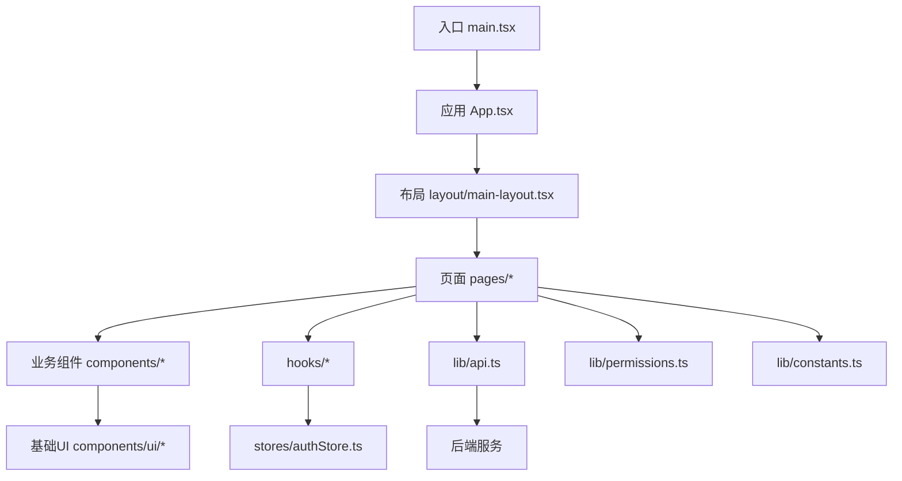
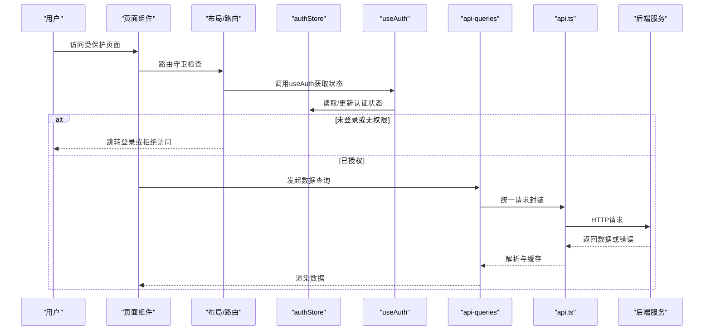
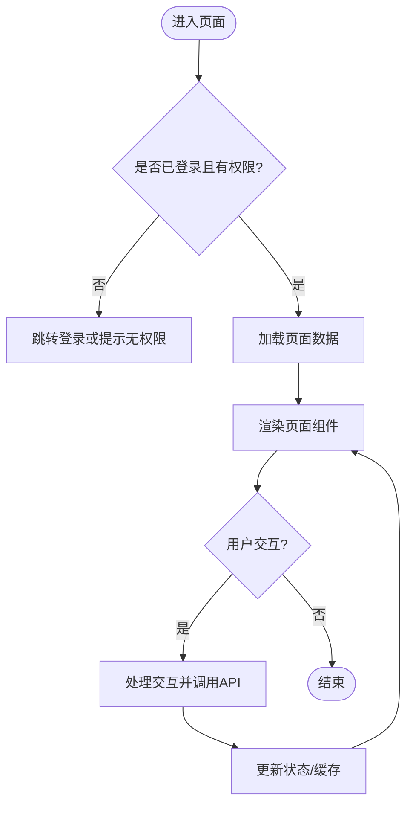
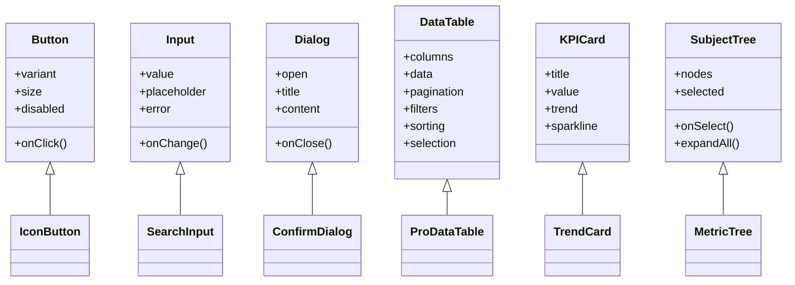
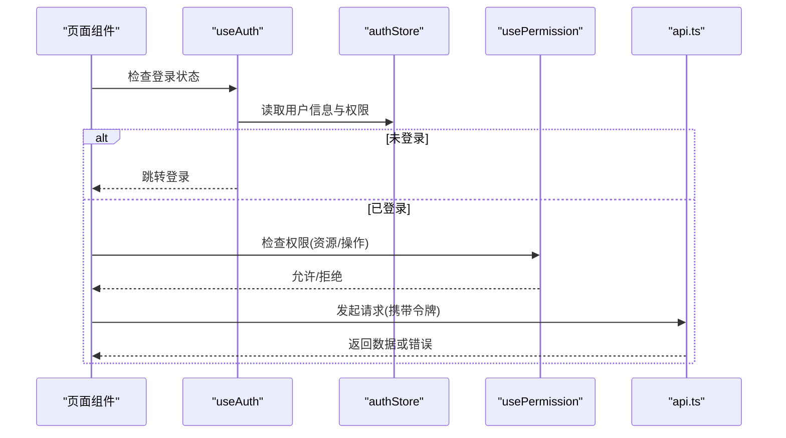
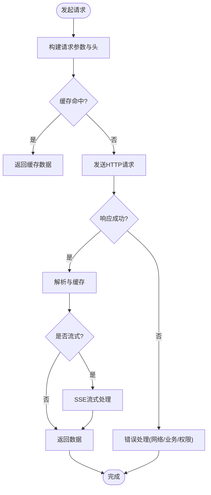
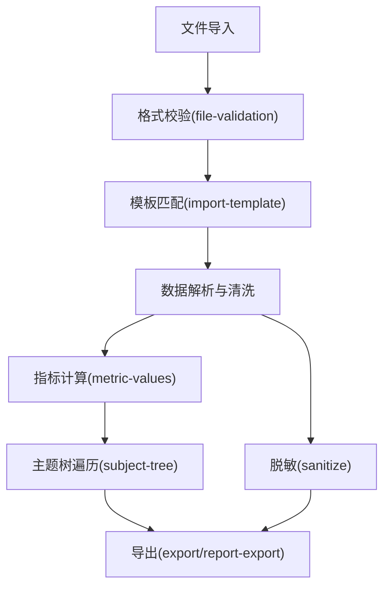
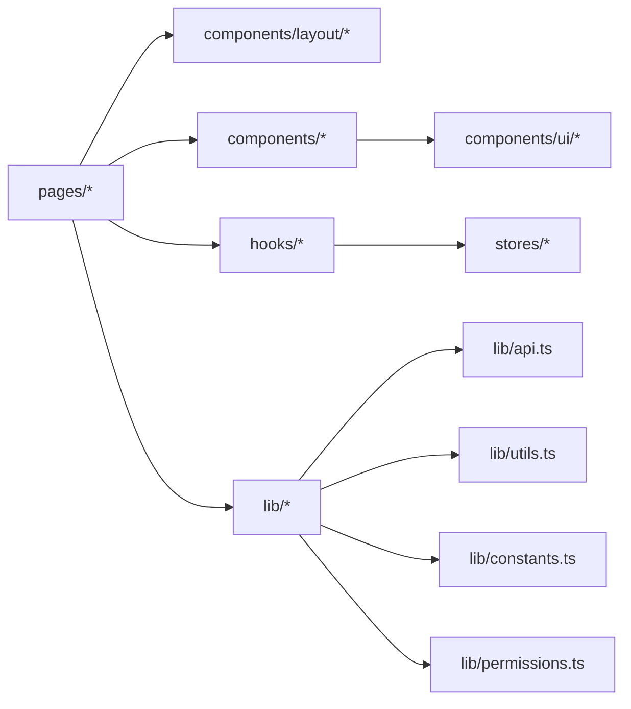

# 前端架构

<cite>
**本文引用的文件**   
- [main.tsx](file://web/src/main.tsx)
- [App.tsx](file://web/src/App.tsx)
- [authStore.ts](file://web/src/stores/authStore.ts)
- [useAuth.ts](file://web/src/hooks/useAuth.ts)
- [usePermission.ts](file://web/src/hooks/usePermission.ts)
- [api.ts](file://web/src/lib/api.ts)
- [api-queries.ts](file://web/src/hooks/api-queries.ts)
- [permissions.ts](file://web/src/lib/permissions.ts)
- [constants.ts](file://web/src/lib/constants.ts)
- [utils.ts](file://web/src/lib/utils.ts)
- [subject-tree.ts](file://web/src/lib/subject-tree.ts)
- [metric-values.ts](file://web/src/lib/metric-values.ts)
- [export.ts](file://web/src/lib/export.ts)
- [report-export.ts](file://web/src/lib/report-export.ts)
- [file-validation.ts](file://web/src/lib/file-validation.ts)
- [import-template.ts](file://web/src/lib/import-template.ts)
- [sanitize.ts](file://web/src/lib/sanitize.ts)
- [ai-stream.ts](file://web/src/lib/ai-stream.ts)
- [index.css](file://web/src/index.css)
- [globals.css](file://web/src/styles/globals.css)
- [App.css](file://web/src/App.css)
- [tailwind.config.js](file://web/src/tailwind.config.js)
- [vite.config.ts](file://web/src/vite.config.ts)
- [tsconfig.json](file://web/src/tsconfig.json)
- [package.json](file://web/src/package.json)
- [admin/index.tsx](file://web/src/pages/admin/index.tsx)
- [admin/dialogs.tsx](file://web/src/pages/admin/dialogs.tsx)
- [dashboard/index.tsx](file://web/src/pages/dashboard/index.tsx)
- [data/index.tsx](file://web/src/pages/data/index.tsx)
- [data/formula-maintenance.tsx](file://web/src/pages/data/formula-maintenance.tsx)
- [data/formula-rule-dialog.tsx](file://web/src/pages/data/formula-rule-dialog.tsx)
- [data/formula-history-dialog.tsx](file://web/src/pages/data/formula-history-dialog.tsx)
- [indicators/index.tsx](file://web/src/pages/indicators/index.tsx)
- [reports/index.tsx](file://web/src/pages/reports/index.tsx)
- [reports/report-editor.tsx](file://web/src/pages/reports/report-editor.tsx)
- [inventory/index.tsx](file://web/src/pages/inventory/index.tsx)
- [transactions/index.tsx](file://web/src/pages/transactions/index.tsx)
- [login/index.tsx](file://web/src/pages/login/index.tsx)
- [layout/main-layout.tsx](file://web/src/components/layout/main-layout.tsx)
- [layout/header.tsx](file://web/src/components/layout/header.tsx)
- [layout/page-container.tsx](file://web/src/components/layout/page-container.tsx)
- [layout/require-permission.tsx](file://web/src/components/layout/require-permission.tsx)
- [ui/button.tsx](file://web/src/components/ui/button.tsx)
- [ui/input.tsx](file://web/src/components/ui/input.tsx)
- [ui/dialog.tsx](file://web/src/components/ui/dialog.tsx)
- [ui/card.tsx](file://web/src/components/ui/card.tsx)
- [ui/badge.tsx](file://web/src/components/ui/badge.tsx)
- [ui/avatar.tsx](file://web/src/components/ui/avatar.tsx)
- [ui/select.tsx](file://web/src/components/ui/select.tsx)
- [ui/textarea.tsx](file://web/src/components/ui/textarea.tsx)
- [ui/label.tsx](file://web/src/components/ui/label.tsx)
- [ui/dropdown-menu.tsx](file://web/src/components/ui/dropdown-menu.tsx)
- [ui/separator.tsx](file://web/src/components/ui/separator.tsx)
- [ui/status-indicator.tsx](file://web/src/components/ui/status-indicator.tsx)
- [ui/skeleton.tsx](file://web/src/components/ui/skeleton.tsx)
- [ui/skeleton-blocks.tsx](file://web/src/components/ui/skeleton-blocks.tsx)
- [ui/switch.tsx](file://web/src/components/ui/switch.tsx)
- [ui/tabs.tsx](file://web/src/components/ui/tabs.tsx)
- [ui/tooltip.tsx](file://web/src/components/ui/tooltip.tsx)
- [ui/confirm-dialog.tsx](file://web/src/components/ui/confirm-dialog.tsx)
- [charts/kpi-card.tsx](file://web/src/components/charts/kpi-card.tsx)
- [charts/kpi-sparkline.tsx](file://web/src/components/charts/kpi-sparkline.tsx)
- [charts/mini-bar-chart.tsx](file://web/src/components/charts/mini-bar-chart.tsx)
- [charts/trend-chart.tsx](file://web/src/components/charts/trend-chart.tsx)
- [data-table/data-table.tsx](file://web/src/components/data-table/data-table.tsx)
- [data-table/pro-data-table.tsx](file://web/src/components/data-table/pro-data-table.tsx)
- [data-table/pagination.tsx](file://web/src/components/data-table/pagination.tsx)
- [data-table/pro-table-inner.tsx](file://web/src/components/data-table/pro-table-inner.tsx)
- [subject-tree/subject-tree.tsx](file://web/src/components/subject-tree/subject-tree.tsx)
- [subject-tree/subject-tree-panel.tsx](file://web/src/components/subject-tree/subject-tree-panel.tsx)
- [subject-tree/metric-tree.tsx](file://web/src/components/subject-tree/metric-tree.tsx)
- [subject-tree/subject-dialog.tsx](file://web/src/components/subject-tree/subject-dialog.tsx)
- [dimension/aggregation-map-panel.tsx](file://web/src/components/dimension/aggregation-map-panel.tsx)
- [dimension/company-panel.tsx](file://web/src/components/dimension/company-panel.tsx)
- [indicators/analysis-drawer.tsx](file://web/src/components/indicators/analysis-drawer.tsx)
- [editor/rich-text-editor.tsx](file://web/src/components/editor/rich-text-editor.tsx)
</cite>

## 目录
1. [简介](#简介)
2. [项目结构](#项目结构)
3. [核心组件](#核心组件)
4. [架构总览](#架构总览)
5. [详细组件分析](#详细组件分析)
6. [依赖关系分析](#依赖关系分析)
7. [性能考虑](#性能考虑)
8. [故障排查指南](#故障排查指南)
9. [结论](#结论)
10. [附录](#附录)

## 简介
本文件面向FY200财年经营数据分析平台的前端架构，聚焦React应用的模块化设计、页面组织、组件库分层、状态管理与权限控制、API集成策略与错误处理。文档以“Excel进、看板/报表出”为核心定位，强调数据导入、指标计算、可视化分析与报表导出的一体化体验。内容覆盖：
- 页面模块职责划分：admin管理、dashboard仪表盘、data数据管理、indicators指标分析、reports报表生成等
- 组件库分层：基础UI组件与业务组件的边界与复用策略
- 状态管理：authStore全局状态、useAuth自定义钩子、usePermission权限控制
- API集成：统一请求封装、查询缓存与流式响应（AI）
- TypeScript类型定义最佳实践与错误处理机制
- 性能优化与可观测性建议

## 项目结构
前端采用Vite + React + TypeScript工程化方案，按功能域与层次进行目录划分：
- pages：页面级路由与业务入口（admin、dashboard、data、indicators、reports等）
- components：组件库，分为ui基础组件、data-table表格、charts图表、subject-tree主题树、layout布局、indicators指标、dimension维度、editor编辑器等
- hooks：自定义钩子（useAuth、usePermission、api-queries）
- stores：全局状态（authStore）
- lib：工具与领域逻辑（api、权限、常量、导出、校验、脱敏、指标值、主题树、AI流式等）
- styles：全局样式与Tailwind配置
- types：类型定义（集中管理）

**图示来源**
- [main.tsx:1-50](file://web/src/main.tsx#L1-L50)
- [App.tsx:1-120](file://web/src/App.tsx#L1-L120)
- [main-layout.tsx:1-120](file://web/src/components/layout/main-layout.tsx#L1-L120)

**章节来源**
- [main.tsx:1-50](file://web/src/main.tsx#L1-L50)
- [App.tsx:1-120](file://web/src/App.tsx#L1-L120)
- [package.json:1-60](file://web/src/package.json#L1-L60)
- [vite.config.ts:1-80](file://web/src/vite.config.ts#L1-L80)
- [tsconfig.json:1-40](file://web/src/tsconfig.json#L1-L40)

## 核心组件
- 布局与导航
  - main-layout：整体框架、侧边栏、顶部导航、路由容器
  - header：用户信息、菜单、通知
  - page-container：页面容器与标题、操作区
- 基础UI组件
  - button、input、dialog、card、badge、avatar、select、textarea、label、dropdown-menu、separator、status-indicator、skeleton、skeleton-blocks、switch、tabs、tooltip、confirm-dialog
- 业务组件
  - data-table、pro-data-table：分页、筛选、排序、批量操作
  - charts：kpi-card、kpi-sparkline、mini-bar-chart、trend-chart
  - subject-tree：主题树、指标树、主题对话框、面板
  - indicators：指标分析抽屉
  - dimension：聚合映射面板、公司面板
  - editor：富文本编辑器
- 页面组件
  - admin：系统管理、权限与配置
  - dashboard：关键指标概览、趋势与分布
  - data：数据导入、公式维护、规则管理
  - indicators：指标分析与钻取
  - reports：报表编辑与导出
  - inventory/transactions：库存与交易（扩展模块）
  - login：登录与鉴权

**章节来源**
- [main-layout.tsx:1-120](file://web/src/components/layout/main-layout.tsx#L1-L120)
- [header.tsx:1-80](file://web/src/components/layout/header.tsx#L1-L80)
- [page-container.tsx:1-60](file://web/src/components/layout/page-container.tsx#L1-L60)
- [button.tsx:1-60](file://web/src/components/ui/button.tsx#L1-L60)
- [input.tsx:1-60](file://web/src/components/ui/input.tsx#L1-L60)
- [dialog.tsx:1-80](file://web/src/components/ui/dialog.tsx#L1-L80)
- [data-table.tsx:1-120](file://web/src/components/data-table/data-table.tsx#L1-L120)
- [pro-data-table.tsx:1-120](file://web/src/components/data-table/pro-data-table.tsx#L1-L120)
- [kpi-card.tsx:1-80](file://web/src/components/charts/kpi-card.tsx#L1-L80)
- [subject-tree.tsx:1-120](file://web/src/components/subject-tree/subject-tree.tsx#L1-L120)
- [analysis-drawer.tsx:1-80](file://web/src/components/indicators/analysis-drawer.tsx#L1-L80)

## 架构总览
前端采用“页面-组件-状态-API”的分层架构：
- 页面层：负责路由与业务编排，组合布局与业务组件
- 组件层：基础UI与业务组件解耦，通过props与事件通信
- 状态层：authStore提供全局认证与权限上下文；useAuth封装认证流程；usePermission实现细粒度权限控制
- API层：统一请求封装、错误处理、缓存与流式响应（SSE）
- 权限与安全：基于角色与资源权限，结合中间件链（后端）与前端拦截

**图示来源**
- [App.tsx:1-120](file://web/src/App.tsx#L1-L120)
- [main-layout.tsx:1-120](file://web/src/components/layout/main-layout.tsx#L1-L120)
- [authStore.ts:1-120](file://web/src/stores/authStore.ts#L1-L120)
- [useAuth.ts:1-120](file://web/src/hooks/useAuth.ts#L1-L120)
- [api-queries.ts:1-120](file://web/src/hooks/api-queries.ts#L1-L120)
- [api.ts:1-120](file://web/src/lib/api.ts#L1-L120)

## 详细组件分析

### 页面模块职责与组织
- admin管理页面：系统配置、用户与权限管理、审计日志查看
- dashboard仪表盘：KPI卡片、趋势图、分布图，快速掌握经营态势
- data数据管理：Excel导入、公式维护、规则管理、历史版本对比
- indicators指标分析：指标钻取、同比环比、多维分析
- reports报表生成：模板编辑、数据绑定、导出PDF/Excel
- inventory/transactions：库存与交易数据管理（扩展）
- login：登录、令牌刷新、会话管理

**图示来源**
- [admin/index.tsx:1-120](file://web/src/pages/admin/index.tsx#L1-L120)
- [dashboard/index.tsx:1-120](file://web/src/pages/dashboard/index.tsx#L1-L120)
- [data/index.tsx:1-120](file://web/src/pages/data/index.tsx#L1-L120)
- [indicators/index.tsx:1-120](file://web/src/pages/indicators/index.tsx#L1-L120)
- [reports/index.tsx:1-120](file://web/src/pages/reports/index.tsx#L1-L120)

**章节来源**
- [admin/index.tsx:1-120](file://web/src/pages/admin/index.tsx#L1-L120)
- [dashboard/index.tsx:1-120](file://web/src/pages/dashboard/index.tsx#L1-L120)
- [data/index.tsx:1-120](file://web/src/pages/data/index.tsx#L1-L120)
- [indicators/index.tsx:1-120](file://web/src/pages/indicators/index.tsx#L1-L120)
- [reports/index.tsx:1-120](file://web/src/pages/reports/index.tsx#L1-L120)

### 组件库分层设计
- 基础UI组件：button、input、dialog、card、badge、avatar、select、textarea、label、dropdown-menu、separator、status-indicator、skeleton、skeleton-blocks、switch、tabs、tooltip、confirm-dialog
  - 设计原则：单一职责、可组合、无障碍支持、主题一致
- 业务组件：data-table、charts、subject-tree、indicators、dimension、editor
  - 设计原则：领域语义清晰、高内聚低耦合、与API解耦、可测试性强

**图示来源**
- [button.tsx:1-60](file://web/src/components/ui/button.tsx#L1-L60)
- [input.tsx:1-60](file://web/src/components/ui/input.tsx#L1-L60)
- [dialog.tsx:1-80](file://web/src/components/ui/dialog.tsx#L1-L80)
- [data-table.tsx:1-120](file://web/src/components/data-table/data-table.tsx#L1-L120)
- [pro-data-table.tsx:1-120](file://web/src/components/data-table/pro-data-table.tsx#L1-L120)
- [kpi-card.tsx:1-80](file://web/src/components/charts/kpi-card.tsx#L1-L80)
- [subject-tree.tsx:1-120](file://web/src/components/subject-tree/subject-tree.tsx#L1-L120)

**章节来源**
- [button.tsx:1-60](file://web/src/components/ui/button.tsx#L1-L60)
- [input.tsx:1-60](file://web/src/components/ui/input.tsx#L1-L60)
- [dialog.tsx:1-80](file://web/src/components/ui/dialog.tsx#L1-L80)
- [data-table.tsx:1-120](file://web/src/components/data-table/data-table.tsx#L1-L120)
- [pro-data-table.tsx:1-120](file://web/src/components/data-table/pro-data-table.tsx#L1-L120)
- [kpi-card.tsx:1-80](file://web/src/components/charts/kpi-card.tsx#L1-L80)
- [subject-tree.tsx:1-120](file://web/src/components/subject-tree/subject-tree.tsx#L1-L120)

### 状态管理与权限控制
- authStore：集中管理用户身份、角色、权限集合、会话过期时间
- useAuth：封装登录、登出、刷新令牌、权限判断
- usePermission：细粒度权限控制，支持资源级与操作级权限
- 权限模型：RBAC（角色-资源-操作），与后端中间件链保持一致

**图示来源**
- [authStore.ts:1-120](file://web/src/stores/authStore.ts#L1-L120)
- [useAuth.ts:1-120](file://web/src/hooks/useAuth.ts#L1-L120)
- [usePermission.ts:1-120](file://web/src/hooks/usePermission.ts#L1-L120)
- [api.ts:1-120](file://web/src/lib/api.ts#L1-L120)

**章节来源**
- [authStore.ts:1-120](file://web/src/stores/authStore.ts#L1-L120)
- [useAuth.ts:1-120](file://web/src/hooks/useAuth.ts#L1-L120)
- [usePermission.ts:1-120](file://web/src/hooks/usePermission.ts#L1-L120)
- [permissions.ts:1-80](file://web/src/lib/permissions.ts#L1-L80)

### API集成策略
- 统一封装：api.ts提供请求拦截、错误处理、重试、超时控制
- 查询缓存：api-queries.ts使用缓存与失效策略，减少重复请求
- 流式响应：ai-stream.ts处理SSE流式数据，用于AI分析结果实时展示
- 错误处理：网络错误、业务错误、权限错误分类处理与用户提示

**图示来源**
- [api.ts:1-120](file://web/src/lib/api.ts#L1-L120)
- [api-queries.ts:1-120](file://web/src/hooks/api-queries.ts#L1-L120)
- [ai-stream.ts:1-120](file://web/src/lib/ai-stream.ts#L1-L120)

**章节来源**
- [api.ts:1-120](file://web/src/lib/api.ts#L1-L120)
- [api-queries.ts:1-120](file://web/src/hooks/api-queries.ts#L1-L120)
- [ai-stream.ts:1-120](file://web/src/lib/ai-stream.ts#L1-L120)

### 数据流向与处理逻辑
- 数据导入：file-validation.ts与import-template.ts负责文件格式校验与模板下载
- 指标计算：metric-values.ts与subject-tree.ts处理指标值计算与主题树遍历
- 导出功能：export.ts与report-export.ts支持Excel/PDF导出
- 安全与脱敏：sanitize.ts确保输入输出安全，避免XSS与敏感信息泄露

**图示来源**
- [file-validation.ts:1-80](file://web/src/lib/file-validation.ts#L1-L80)
- [import-template.ts:1-80](file://web/src/lib/import-template.ts#L1-L80)
- [metric-values.ts:1-120](file://web/src/lib/metric-values.ts#L1-L120)
- [subject-tree.ts:1-120](file://web/src/lib/subject-tree.ts#L1-L120)
- [export.ts:1-80](file://web/src/lib/export.ts#L1-L80)
- [report-export.ts:1-80](file://web/src/lib/report-export.ts#L1-L80)
- [sanitize.ts:1-80](file://web/src/lib/sanitize.ts#L1-L80)

**章节来源**
- [file-validation.ts:1-80](file://web/src/lib/file-validation.ts#L1-L80)
- [import-template.ts:1-80](file://web/src/lib/import-template.ts#L1-L80)
- [metric-values.ts:1-120](file://web/src/lib/metric-values.ts#L1-L120)
- [subject-tree.ts:1-120](file://web/src/lib/subject-tree.ts#L1-L120)
- [export.ts:1-80](file://web/src/lib/export.ts#L1-L80)
- [report-export.ts:1-80](file://web/src/lib/report-export.ts#L1-L80)
- [sanitize.ts:1-80](file://web/src/lib/sanitize.ts#L1-L80)

## 依赖关系分析
- 组件依赖：页面组件依赖布局与业务组件，业务组件依赖基础UI组件
- 状态依赖：页面与组件通过useAuth与usePermission依赖authStore
- API依赖：所有数据请求通过api.ts统一封装，减少重复代码
- 工具依赖：utils.ts、constants.ts、permissions.ts为通用支撑

**图示来源**
- [App.tsx:1-120](file://web/src/App.tsx#L1-L120)
- [main-layout.tsx:1-120](file://web/src/components/layout/main-layout.tsx#L1-L120)
- [api.ts:1-120](file://web/src/lib/api.ts#L1-L120)
- [utils.ts:1-80](file://web/src/lib/utils.ts#L1-L80)
- [constants.ts:1-80](file://web/src/lib/constants.ts#L1-L80)
- [permissions.ts:1-80](file://web/src/lib/permissions.ts#L1-L80)

**章节来源**
- [App.tsx:1-120](file://web/src/App.tsx#L1-L120)
- [main-layout.tsx:1-120](file://web/src/components/layout/main-layout.tsx#L1-L120)
- [api.ts:1-120](file://web/src/lib/api.ts#L1-L120)
- [utils.ts:1-80](file://web/src/lib/utils.ts#L1-L80)
- [constants.ts:1-80](file://web/src/lib/constants.ts#L1-L80)
- [permissions.ts:1-80](file://web/src/lib/permissions.ts#L1-L80)

## 性能考虑
- 组件级优化
  - 使用React.memo与useMemo/useCallback减少不必要的重渲染
  - 列表渲染使用虚拟滚动与分页，避免大数据量卡顿
  - 图片与图表懒加载，按需引入第三方库
- 状态管理优化
  - authStore仅存储必要字段，避免过大对象
  - 权限判断缓存，减少重复计算
- API层优化
  - 请求去重与缓存，合理设置失效策略
  - 流式响应降低首屏等待时间
  - 错误重试与退避策略
- 构建与打包
  - Vite按需编译与代码分割
  - TailwindCSS按需生成样式，减少体积
  - 静态资源压缩与CDN加速

[本节为通用指导，不直接分析具体文件]

## 故障排查指南
- 登录与权限问题
  - 检查useAuth是否正确初始化与刷新令牌
  - 确认authStore中权限集合与后端角色一致
  - 查看浏览器控制台与网络请求，确认JWT有效
- API请求失败
  - 检查api.ts的错误处理逻辑与重试策略
  - 确认后端中间件链（helmet→cors→json→rate-limit→auth→permission→scope→softDelete→audit）正常
  - 查看服务端日志与数据库连接状态
- 数据导入与导出
  - 验证file-validation.ts的格式校验规则
  - 检查import-template.ts模板匹配逻辑
  - 确认export.ts与report-export.ts的导出配置
- 性能问题
  - 使用React DevTools分析组件渲染次数
  - 检查大列表与复杂图表的渲染性能
  - 监控内存泄漏与未清理的事件监听器

**章节来源**
- [useAuth.ts:1-120](file://web/src/hooks/useAuth.ts#L1-L120)
- [authStore.ts:1-120](file://web/src/stores/authStore.ts#L1-L120)
- [api.ts:1-120](file://web/src/lib/api.ts#L1-L120)
- [file-validation.ts:1-80](file://web/src/lib/file-validation.ts#L1-L80)
- [import-template.ts:1-80](file://web/src/lib/import-template.ts#L1-L80)
- [export.ts:1-80](file://web/src/lib/export.ts#L1-L80)
- [report-export.ts:1-80](file://web/src/lib/report-export.ts#L1-L80)

## 结论
FY200前端架构以清晰的模块化设计与分层架构为基础，通过统一的API封装、状态管理与权限控制，实现了可扩展、可维护且高性能的财务数据分析平台。组件库分层明确，页面职责清晰，数据流与控制流规范，为后续功能扩展与团队协作提供了坚实基础。建议在持续迭代中关注性能优化与错误处理，提升用户体验与系统稳定性。

[本节为总结性内容，不直接分析具体文件]

## 附录
- TypeScript类型定义最佳实践
  - 集中管理在types/index.ts，使用interface与type区分数据结构与联合类型
  - 使用泛型提高组件与函数的复用性
  - 严格模式开启，避免any类型滥用
- 错误处理机制
  - 统一错误码与消息，前端友好提示
  - 网络错误重试与降级策略
  - 用户操作反馈与日志记录
- 可观测性与监控
  - 前端埋点与性能监控
  - 错误上报与用户行为追踪
  - 日志分级与脱敏处理

[本节为补充说明，不直接分析具体文件]