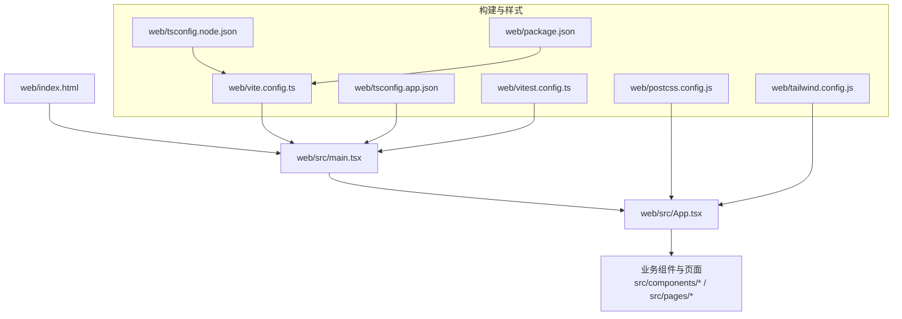
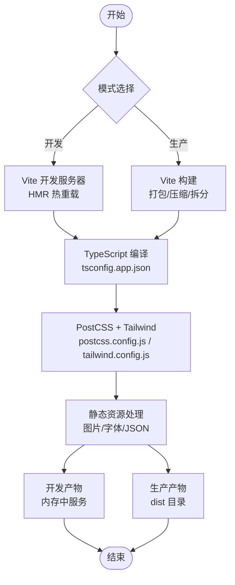
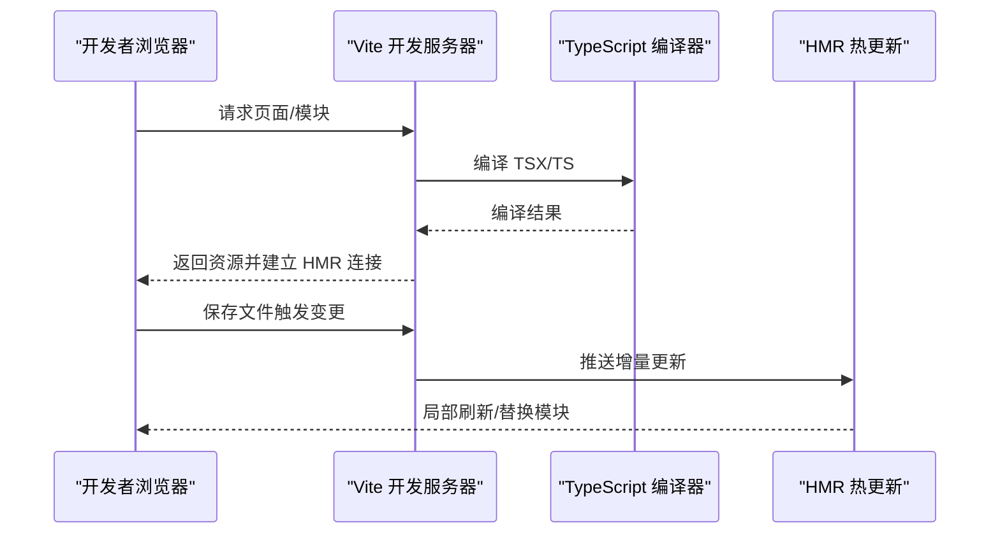
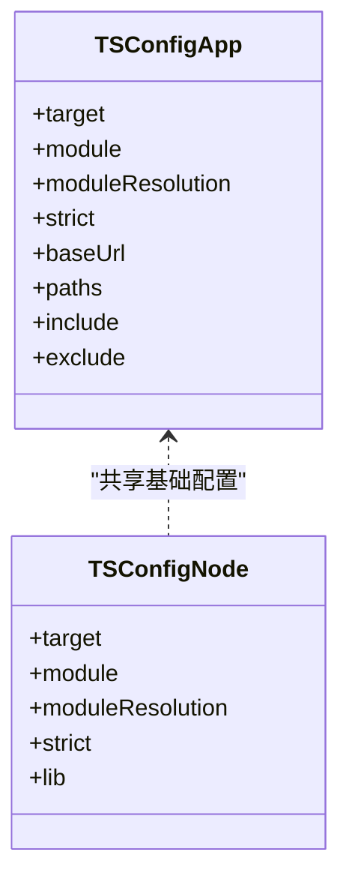
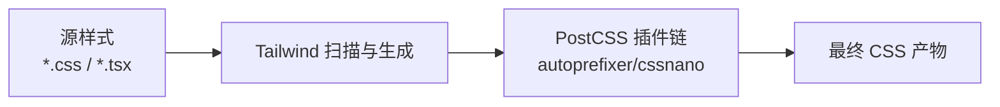
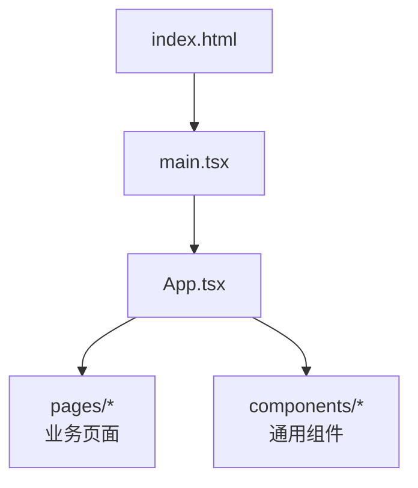
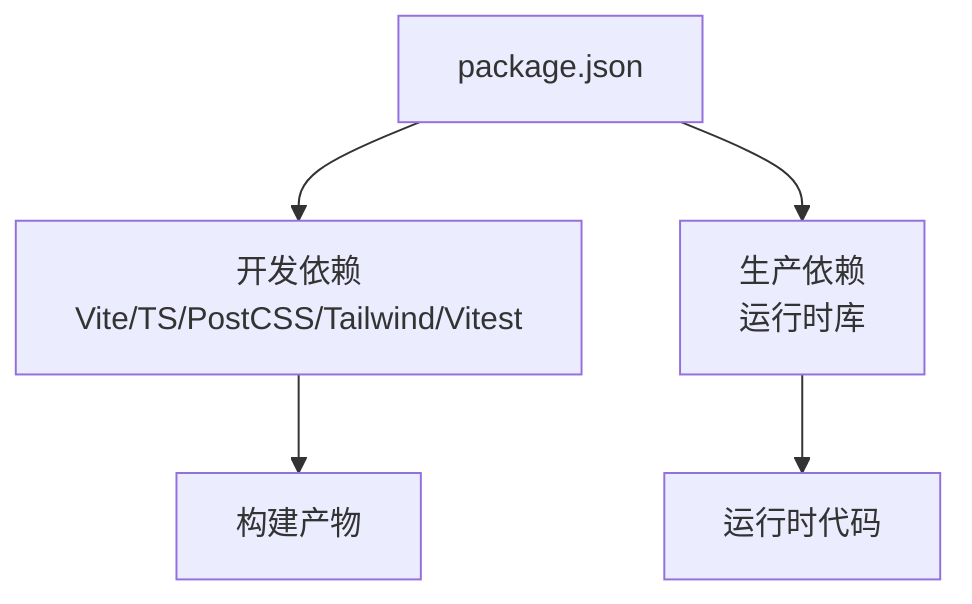

# 构建部署配置

<cite>
**本文引用的文件**   
- [web/vite.config.ts](file://web/vite.config.ts)
- [web/package.json](file://web/package.json)
- [web/tsconfig.app.json](file://web/tsconfig.app.json)
- [web/tsconfig.node.json](file://web/tsconfig.node.json)
- [web/postcss.config.js](file://web/postcss.config.js)
- [web/tailwind.config.js](file://web/tailwind.config.js)
- [web/index.html](file://web/index.html)
- [web/src/main.tsx](file://web/src/main.tsx)
- [web/src/App.tsx](file://web/src/App.tsx)
- [web/vitest.config.ts](file://web/vitest.config.ts)
</cite>

## 目录
1. [简介](#简介)
2. [项目结构](#项目结构)
3. [核心组件](#核心组件)
4. [架构总览](#架构总览)
5. [详细组件分析](#详细组件分析)
6. [依赖分析](#依赖分析)
7. [性能考虑](#性能考虑)
8. [故障排查指南](#故障排查指南)
9. [结论](#结论)
10. [附录](#附录)

## 简介
本文件面向FY200前端（位于 web 目录）的构建与部署配置，聚焦基于 Vite 的现代化前端工具链：开发服务器、热重载、代码分割优化；TypeScript 编译配置；PostCSS/Tailwind 处理；生产环境构建优化（压缩、资源优化、缓存策略）；Docker 容器化与环境变量；以及 CI/CD 流水线、自动化测试与部署监控的实现方案。文档力求对非专业读者友好，同时提供足够的技术细节以便工程落地。

## 项目结构
前端工程位于 web 目录，关键构建与样式相关文件如下：
- 构建入口与插件配置：vite.config.ts
- 包管理与脚本：package.json
- TypeScript 编译：tsconfig.app.json、tsconfig.node.json
- CSS 预处理与原子化样式：postcss.config.js、tailwind.config.js
- HTML 模板：index.html
- 应用入口与根组件：src/main.tsx、src/App.tsx
- 单元测试配置：vitest.config.ts

**图表来源** 
- [web/vite.config.ts](file://web/vite.config.ts)
- [web/postcss.config.js](file://web/postcss.config.js)
- [web/tailwind.config.js](file://web/tailwind.config.js)
- [web/tsconfig.app.json](file://web/tsconfig.app.json)
- [web/tsconfig.node.json](file://web/tsconfig.node.json)
- [web/package.json](file://web/package.json)
- [web/vitest.config.ts](file://web/vitest.config.ts)
- [web/index.html](file://web/index.html)
- [web/src/main.tsx](file://web/src/main.tsx)
- [web/src/App.tsx](file://web/src/App.tsx)

**章节来源**
- [web/vite.config.ts](file://web/vite.config.ts)
- [web/package.json](file://web/package.json)
- [web/tsconfig.app.json](file://web/tsconfig.app.json)
- [web/tsconfig.node.json](file://web/tsconfig.node.json)
- [web/postcss.config.js](file://web/postcss.config.js)
- [web/tailwind.config.js](file://web/tailwind.config.js)
- [web/index.html](file://web/index.html)
- [web/src/main.tsx](file://web/src/main.tsx)
- [web/src/App.tsx](file://web/src/App.tsx)
- [web/vitest.config.ts](file://web/vitest.config.ts)

## 核心组件
- Vite 构建配置：通过 vite.config.ts 组织开发服务器、插件生态、输出产物与优化策略。
- TypeScript 编译：使用 tsconfig.app.json 管理应用源码编译选项，tsconfig.node.json 管理 Node 侧工具链（如 Vite 插件）。
- PostCSS + Tailwind：postcss.config.js 串联 PostCSS 管线，tailwind.config.js 定义样式主题与扫描规则。
- 包管理与脚本：package.json 统一安装依赖、运行脚本（开发、构建、测试等）。
- 测试框架：vitest.config.ts 配置单元测试与集成测试的运行环境。

**章节来源**
- [web/vite.config.ts](file://web/vite.config.ts)
- [web/tsconfig.app.json](file://web/tsconfig.app.json)
- [web/tsconfig.node.json](file://web/tsconfig.node.json)
- [web/postcss.config.js](file://web/postcss.config.js)
- [web/tailwind.config.js](file://web/tailwind.config.js)
- [web/package.json](file://web/package.json)
- [web/vitest.config.ts](file://web/vitest.config.ts)

## 架构总览
下图展示从源码到产物的构建链路，以及开发与生产两种模式的差异。

**图表来源** 
- [web/vite.config.ts](file://web/vite.config.ts)
- [web/tsconfig.app.json](file://web/tsconfig.app.json)
- [web/postcss.config.js](file://web/postcss.config.js)
- [web/tailwind.config.js](file://web/tailwind.config.js)

## 详细组件分析

### Vite 构建与开发服务器
- 开发服务器：启用本地 HTTP 服务与 HMR，支持快速反馈与增量更新。
- 插件生态：可接入 React、Svelte、Vue 等生态插件，按需引入第三方库。
- 代码分割：按路由或大模块进行动态导入，减少首屏体积。
- 代理与跨域：在开发阶段配置后端接口代理，避免 CORS 问题。
- 环境变量：通过 .env.* 注入运行时变量，区分开发与生产。

**图表来源** 
- [web/vite.config.ts](file://web/vite.config.ts)
- [web/tsconfig.app.json](file://web/tsconfig.app.json)

**章节来源**
- [web/vite.config.ts](file://web/vite.config.ts)

### TypeScript 编译配置
- tsconfig.app.json：定义应用源码的编译目标、模块解析、路径别名、严格模式等。
- tsconfig.node.json：定义 Node 侧工具链（如 Vite 插件、脚本）的编译选项。
- 建议：保持严格类型检查，合理设置 baseUrl 与 paths，提升 IDE 体验与构建稳定性。

**图表来源** 
- [web/tsconfig.app.json](file://web/tsconfig.app.json)
- [web/tsconfig.node.json](file://web/tsconfig.node.json)

**章节来源**
- [web/tsconfig.app.json](file://web/tsconfig.app.json)
- [web/tsconfig.node.json](file://web/tsconfig.node.json)

### PostCSS 与 Tailwind 样式处理
- postcss.config.js：串联 PostCSS 插件链，如 autoprefixer、cssnano 等。
- tailwind.config.js：定义主题、自定义颜色、响应式断点、组件扫描范围等。
- 最佳实践：仅扫描必要目录，避免扫描 node_modules；按需生成样式，减小 CSS 体积。

**图表来源** 
- [web/postcss.config.js](file://web/postcss.config.js)
- [web/tailwind.config.js](file://web/tailwind.config.js)

**章节来源**
- [web/postcss.config.js](file://web/postcss.config.js)
- [web/tailwind.config.js](file://web/tailwind.config.js)

### 包管理与脚本
- package.json：集中声明依赖、开发依赖、脚本命令（如 dev/build/test），便于团队协作与 CI 复用。
- 建议：锁定版本（lockfile）、分离 dev/prod 依赖、使用脚本封装复杂命令。

**章节来源**
- [web/package.json](file://web/package.json)

### 测试框架与配置
- vitest.config.ts：配置测试环境、匹配规则、覆盖率、Mock 策略等。
- 建议：为关键组件与工具函数编写单测，结合快照测试保障 UI 稳定性。

**章节来源**
- [web/vitest.config.ts](file://web/vitest.config.ts)

### 应用入口与页面组织
- index.html：作为 SPA 的 HTML 模板，挂载根节点。
- src/main.tsx：初始化应用、注册路由、错误边界、全局状态等。
- src/App.tsx：顶层路由与布局，组合业务页面与公共组件。

**图表来源** 
- [web/index.html](file://web/index.html)
- [web/src/main.tsx](file://web/src/main.tsx)
- [web/src/App.tsx](file://web/src/App.tsx)

**章节来源**
- [web/index.html](file://web/index.html)
- [web/src/main.tsx](file://web/src/main.tsx)
- [web/src/App.tsx](file://web/src/App.tsx)

## 依赖分析
- 构建期依赖：Vite、TypeScript、PostCSS、Tailwind、测试框架等。
- 运行期依赖：React 生态（若使用）、UI 库、图表库、HTTP 客户端等。
- 依赖隔离：开发依赖与生产依赖分离，避免将调试工具带入生产包。
- 版本锁定：使用 lockfile 确保团队与 CI 一致性。

**图表来源** 
- [web/package.json](file://web/package.json)

**章节来源**
- [web/package.json](file://web/package.json)

## 性能考虑
- 代码分割：按路由与大型模块进行懒加载，降低首屏体积。
- 资源优化：图片压缩、字体子集化、静态资源哈希命名以启用强缓存。
- 构建优化：开启 Tree Shaking、Dead Code Elimination、并行构建。
- 缓存策略：利用浏览器缓存与 CDN 缓存，配合版本号/哈希实现长缓存。
- 网络优化：启用 Gzip/Brotli 压缩，合理使用预加载与预取。

[本节为通用指导，不直接分析具体文件]

## 故障排查指南
- 构建失败
  - 检查 TypeScript 错误与类型定义是否完整。
  - 确认 Node 版本与依赖版本兼容。
  - 清理缓存后重试（node_modules/.cache、dist）。
- 样式异常
  - 校验 Tailwind 扫描路径是否正确。
  - 检查 PostCSS 插件顺序与兼容性。
- 运行时错误
  - 检查环境变量注入是否正确。
  - 查看浏览器控制台与网络面板，定位接口与资源加载问题。
- 性能问题
  - 使用构建分析报告定位大包与重复依赖。
  - 评估懒加载与资源体积，必要时拆分或替换库。

[本节为通用指导，不直接分析具体文件]

## 结论
通过对 Vite、TypeScript、PostCSS/Tailwind、包管理与测试配置的梳理，FY200 前端构建了清晰、可扩展且高性能的工具链。在生产环境中应重点关注代码分割、资源优化与缓存策略；在开发环境中强调 HMR 与类型安全；在部署环节采用容器化与 CI/CD 自动化，确保一致性与可观测性。

[本节为总结性内容，不直接分析具体文件]

## 附录

### Docker 容器化部署方案（概念性说明）
- 多阶段构建：第一阶段基于 Node 镜像执行构建，第二阶段基于轻量级静态服务器镜像（如 Nginx）托管 dist 产物。
- 环境变量：通过 .env.production 或运行时环境变量注入 API 地址、功能开关等。
- 健康检查：暴露健康端点，供编排平台探测服务可用性。
- 日志与指标：收集访问日志与应用指标，便于监控与排障。

[本节为概念性说明，不直接分析具体文件]

### CI/CD 流水线（概念性说明）
- 触发条件：Push/Merge Request 事件。
- 步骤：安装依赖 → 类型检查 → 单元测试 → 构建产物 → 生成报告 → 推送镜像 → 部署到目标环境。
- 质量门禁：Lint 检查、覆盖率阈值、构建产物大小限制。
- 回滚策略：保留历史版本镜像与制品，支持一键回滚。

[本节为概念性说明，不直接分析具体文件]

### 环境变量与运行时配置（概念性说明）
- 开发环境：.env.development，包含本地 API 地址、调试开关。
- 生产环境：.env.production，包含线上 API 地址、功能开关、埋点配置。
- 安全建议：敏感信息不入仓，使用密钥管理服务注入。

[本节为概念性说明，不直接分析具体文件]