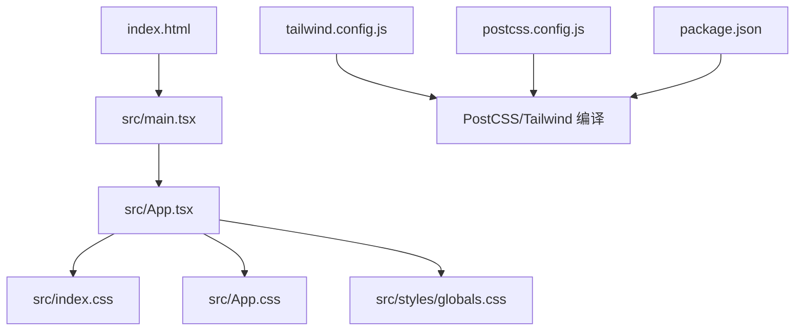
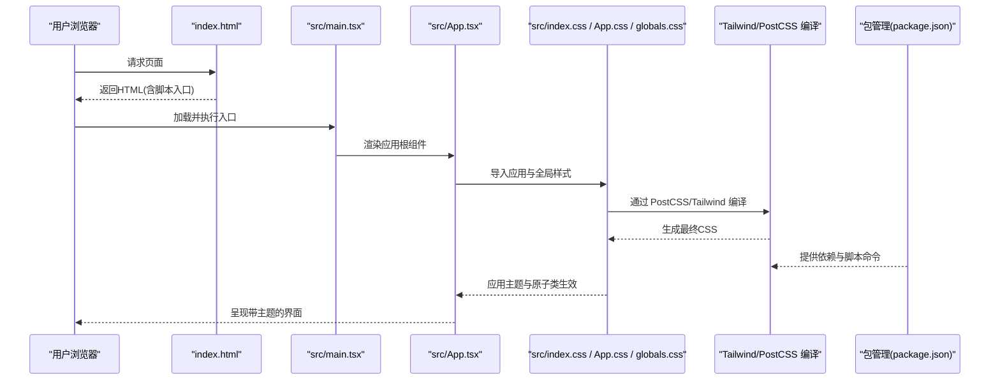
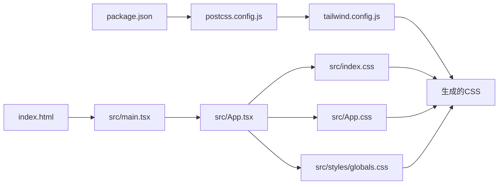

# 样式主题系统

<cite>
**本文引用的文件**   
- [tailwind.config.js](file://web/tailwind.config.js)
- [postcss.config.js](file://web/postcss.config.js)
- [index.html](file://web/index.html)
- [main.tsx](file://web/src/main.tsx)
- [App.tsx](file://web/src/App.tsx)
- [index.css](file://web/src/index.css)
- [globals.css](file://web/src/styles/globals.css)
- [App.css](file://web/src/App.css)
- [package.json](file://web/package.json)
</cite>

## 目录
1. [简介](#简介)
2. [项目结构](#项目结构)
3. [核心组件](#核心组件)
4. [架构总览](#架构总览)
5. [详细组件分析](#详细组件分析)
6. [依赖分析](#依赖分析)
7. [性能考虑](#性能考虑)
8. [故障排查指南](#故障排查指南)
9. [结论](#结论)
10. [附录](#附录)

## 简介
本文件系统化梳理 FY200 前端样式主题体系，围绕基于 Tailwind CSS 的原子化样式架构展开，涵盖自定义主题配置、颜色与字体规范、CSS 模块化策略（全局/组件/页面）、响应式设计与弹性布局、样式复用机制（含 CSS 变量）、动画实现、调试工具、性能优化与跨浏览器兼容性。文档面向不同技术背景的读者，既提供高层概览，也给出代码级定位与可追溯来源。

## 项目结构
FY200 前端位于 web 目录，样式相关的关键位置如下：
- 构建与样式管线：tailwind.config.js、postcss.config.js、package.json
- 入口与根样式：index.html、src/main.tsx、src/index.css、src/App.css
- 应用主题与全局样式：src/styles/globals.css
- 应用主体：src/App.tsx

图表来源
- [index.html:1-50](file://web/index.html#L1-L50)
- [main.tsx:1-40](file://web/src/main.tsx#L1-L40)
- [App.tsx:1-60](file://web/src/App.tsx#L1-L60)
- [index.css:1-40](file://web/src/index.css#L1-L40)
- [App.css:1-40](file://web/src/App.css#L1-L40)
- [globals.css:1-60](file://web/src/styles/globals.css#L1-L60)
- [tailwind.config.js:1-120](file://web/tailwind.config.js#L1-L120)
- [postcss.config.js:1-40](file://web/postcss.config.js#L1-L40)
- [package.json:1-80](file://web/package.json#L1-L80)

章节来源
- [index.html:1-50](file://web/index.html#L1-L50)
- [main.tsx:1-40](file://web/src/main.tsx#L1-L40)
- [App.tsx:1-60](file://web/src/App.tsx#L1-L60)
- [index.css:1-40](file://web/src/index.css#L1-L40)
- [App.css:1-40](file://web/src/App.css#L1-L40)
- [globals.css:1-60](file://web/src/styles/globals.css#L1-L60)
- [tailwind.config.js:1-120](file://web/tailwind.config.js#L1-L120)
- [postcss.config.js:1-40](file://web/postcss.config.js#L1-L40)
- [package.json:1-80](file://web/package.json#L1-L80)

## 核心组件
- 主题配置中心：tailwind.config.js 集中定义颜色、字体、断点、动画等设计令牌，作为原子化样式的唯一真相源。
- PostCSS 管线：postcss.config.js 串联 Tailwind、CSS 变量处理与兼容插件，确保样式在目标浏览器中稳定运行。
- 全局样式层：src/index.css 与 src/styles/globals.css 负责基础重置、CSS 变量注入、全局排版与主题变量导出。
- 应用样式层：src/App.css 承载应用级通用样式与主题覆盖。
- 入口与挂载：index.html 引入构建产物；src/main.tsx 初始化 React 应用并挂载到 DOM；src/App.tsx 组织页面与路由，间接消费样式。

章节来源
- [tailwind.config.js:1-120](file://web/tailwind.config.js#L1-L120)
- [postcss.config.js:1-40](file://web/postcss.config.js#L1-L40)
- [index.css:1-40](file://web/src/index.css#L1-L40)
- [globals.css:1-60](file://web/src/styles/globals.css#L1-L60)
- [App.css:1-40](file://web/src/App.css#L1-L40)
- [index.html:1-50](file://web/index.html#L1-L50)
- [main.tsx:1-40](file://web/src/main.tsx#L1-L40)
- [App.tsx:1-60](file://web/src/App.tsx#L1-L60)

## 架构总览
下图展示从 HTML 入口到 Tailwind 编译产物的完整样式链路，以及主题变量在全局与应用层的传播路径。

图表来源
- [index.html:1-50](file://web/index.html#L1-L50)
- [main.tsx:1-40](file://web/src/main.tsx#L1-L40)
- [App.tsx:1-60](file://web/src/App.tsx#L1-L60)
- [index.css:1-40](file://web/src/index.css#L1-L40)
- [App.css:1-40](file://web/src/App.css#L1-L40)
- [globals.css:1-60](file://web/src/styles/globals.css#L1-L60)
- [tailwind.config.js:1-120](file://web/tailwind.config.js#L1-L120)
- [postcss.config.js:1-40](file://web/postcss.config.js#L1-L40)
- [package.json:1-80](file://web/package.json#L1-L80)

## 详细组件分析

### 主题配置（Tailwind）
- 颜色系统：在 tailwind.config.js 中集中声明品牌色、中性色、语义色（成功/警告/错误等），并通过命名空间暴露给原子类使用。建议以“语义化”命名优先，避免直接引用 RGB/HSL。
- 字体规范：统一设置字体族、字重阶梯、行高与字号阶梯，保证可读性与一致性。
- 断点与布局：扩展或对齐移动端优先的断点策略，配合栅格与间距系统，形成一致的网格与留白节奏。
- 动画与过渡：将常用缓动曲线与时长纳入主题，便于在组件中复用。
- 插件与扩展：按需启用 Tailwind 插件（如 forms、typography），保持样式最小化与可控性。

章节来源
- [tailwind.config.js:1-120](file://web/tailwind.config.js#L1-L120)

### 样式模块化策略
- 全局样式（index.css、globals.css）
  - 作用：CSS Reset、基础排版、CSS 变量注入、主题变量导出、全局动画关键帧。
  - 最佳实践：仅放置与主题相关的“全局”内容，避免组件级样式污染。
- 组件样式（App.css 及组件内样式）
  - 作用：组件级通用样式、主题覆盖、局部交互态。
  - 最佳实践：优先使用 Tailwind 原子类；必要时用 CSS Modules 或 scoped 样式隔离。
- 页面样式
  - 作用：页面级布局与特殊需求，尽量薄且短生命周期。
  - 最佳实践：通过组合原子类与少量必要样式达成，避免重复定义。

章节来源
- [index.css:1-40](file://web/src/index.css#L1-L40)
- [globals.css:1-60](file://web/src/styles/globals.css#L1-L60)
- [App.css:1-40](file://web/src/App.css#L1-L40)

### 响应式设计与弹性布局
- 移动端优先：默认样式针对小屏，通过断点逐步增强。
- 断点管理：在 tailwind.config.js 中统一定义断点，确保与设计稿一致。
- 弹性布局：结合 flex/grid 原子类与主题间距，快速搭建自适应布局。
- 容器查询：如需更细粒度适配，可在 postcss.config.js 中启用相应插件并按需使用。

章节来源
- [tailwind.config.js:1-120](file://web/tailwind.config.js#L1-L120)
- [postcss.config.js:1-40](file://web/postcss.config.js#L1-L40)

### 样式复用机制与 CSS 变量
- 设计令牌：将颜色、字体、圆角、阴影等抽象为 CSS 变量，并在 globals.css 中集中声明。
- 主题切换：通过数据属性或类名切换变量值，实现明暗主题或品牌替换。
- 组件内复用：组件样式通过 var() 引用变量，降低硬编码与重复。

章节来源
- [globals.css:1-60](file://web/src/styles/globals.css#L1-L60)
- [index.css:1-40](file://web/src/index.css#L1-L40)

### 动画效果实现
- 原子化动画：在 tailwind.config.js 中注册缓动曲线与时长，配合原子类快速实现微交互。
- 关键帧与过渡：在 globals.css 中集中定义关键帧，组件通过原子类或轻量样式调用。
- 性能提示：优先使用 transform/opacity 动画，避免触发重排。

章节来源
- [tailwind.config.js:1-120](file://web/tailwind.config.js#L1-L120)
- [globals.css:1-60](file://web/src/styles/globals.css#L1-L60)

### 构建与集成（PostCSS 与包管理）
- PostCSS 管线：postcss.config.js 串联 Tailwind、兼容插件与压缩优化。
- 包管理：package.json 定义开发/构建脚本与依赖版本，确保环境一致性。
- 入口挂载：index.html 引入构建产物，main.tsx 初始化应用，App.tsx 组织视图与样式消费。

章节来源
- [postcss.config.js:1-40](file://web/postcss.config.js#L1-L40)
- [package.json:1-80](file://web/package.json#L1-L80)
- [index.html:1-50](file://web/index.html#L1-L50)
- [main.tsx:1-40](file://web/src/main.tsx#L1-L40)
- [App.tsx:1-60](file://web/src/App.tsx#L1-L60)

## 依赖分析
样式相关依赖关系如下：Tailwind 由 PostCSS 驱动，PostCSS 由 package.json 中的脚本与插件配置驱动；应用入口通过 CSS 文件引入主题与原子类。

图表来源
- [package.json:1-80](file://web/package.json#L1-L80)
- [postcss.config.js:1-40](file://web/postcss.config.js#L1-L40)
- [tailwind.config.js:1-120](file://web/tailwind.config.js#L1-L120)
- [index.html:1-50](file://web/index.html#L1-L50)
- [main.tsx:1-40](file://web/src/main.tsx#L1-L40)
- [App.tsx:1-60](file://web/src/App.tsx#L1-L60)
- [index.css:1-40](file://web/src/index.css#L1-L40)
- [App.css:1-40](file://web/src/App.css#L1-L40)
- [globals.css:1-60](file://web/src/styles/globals.css#L1-L60)

章节来源
- [package.json:1-80](file://web/package.json#L1-L80)
- [postcss.config.js:1-40](file://web/postcss.config.js#L1-L40)
- [tailwind.config.js:1-120](file://web/tailwind.config.js#L1-L120)
- [index.html:1-50](file://web/index.html#L1-L50)
- [main.tsx:1-40](file://web/src/main.tsx#L1-L40)
- [App.tsx:1-60](file://web/src/App.tsx#L1-L60)
- [index.css:1-40](file://web/src/index.css#L1-L40)
- [App.css:1-40](file://web/src/App.css#L1-L40)
- [globals.css:1-60](file://web/src/styles/globals.css#L1-L60)

## 性能考虑
- 样式体积控制
  - 使用 Tailwind 的 Purge 策略，仅保留实际使用的原子类。
  - 拆分 CSS 入口，避免一次性引入过多无关样式。
- 运行时开销
  - 减少复杂选择器与深度嵌套，优先原子类组合。
  - 动画优先使用 transform/opacity，避免重排重绘。
- 构建优化
  - 开启 CSS 压缩与 Source Map（开发环境）。
  - 合理配置 PostCSS 插件顺序，减少重复计算。
- 缓存策略
  - 对静态资源启用强缓存，更新文件名哈希。
  - 利用浏览器缓存与 CDN 加速。

[本节为通用指导，不直接分析具体文件]

## 故障排查指南
- 样式未生效
  - 检查 index.html 是否正确引入构建产物。
  - 确认 main.tsx 已正确挂载应用，App.tsx 是否导入了必要的样式文件。
  - 验证 tailwind.config.js 与 postcss.config.js 配置是否生效。
- 主题变量无效
  - 检查 globals.css 中变量声明与作用域。
  - 确认组件是否通过 var() 引用变量，而非硬编码值。
- 响应式异常
  - 核对断点定义是否与预期一致。
  - 检查是否误用了桌面端优先的写法导致移动端失效。
- 动画卡顿
  - 排查是否触发了重排（修改布局属性）。
  - 使用浏览器性能面板定位瓶颈。

章节来源
- [index.html:1-50](file://web/index.html#L1-L50)
- [main.tsx:1-40](file://web/src/main.tsx#L1-L40)
- [App.tsx:1-60](file://web/src/App.tsx#L1-L60)
- [tailwind.config.js:1-120](file://web/tailwind.config.js#L1-L120)
- [postcss.config.js:1-40](file://web/postcss.config.js#L1-L40)
- [globals.css:1-60](file://web/src/styles/globals.css#L1-L60)

## 结论
FY200 前端样式主题系统以 Tailwind CSS 为核心，通过集中化的主题配置与清晰的 CSS 分层，实现了高内聚、低耦合的原子化样式架构。借助 PostCSS 管线与包管理脚本，保证了构建的一致性与可维护性。遵循本文档的组织策略与优化建议，可在保证视觉一致性的同时，提升开发与迭代效率。

[本节为总结性内容，不直接分析具体文件]

## 附录
- 术语说明
  - 原子化样式：以不可拆分的原子类组合出 UI，强调可预测与可复用。
  - 设计令牌：将颜色、字体、间距等抽象为变量，统一管理。
  - 移动端优先：先写小屏样式，再按断点增强。
- 参考路径
  - 主题配置：[tailwind.config.js](file://web/tailwind.config.js)
  - PostCSS 配置：[postcss.config.js](file://web/postcss.config.js)
  - 全局样式：[globals.css](file://web/src/styles/globals.css)、[index.css](file://web/src/index.css)
  - 应用样式：[App.css](file://web/src/App.css)
  - 入口与挂载：[index.html](file://web/index.html)、[main.tsx](file://web/src/main.tsx)、[App.tsx](file://web/src/App.tsx)
  - 构建脚本与依赖：[package.json](file://web/package.json)

[本节为补充信息，不直接分析具体文件]