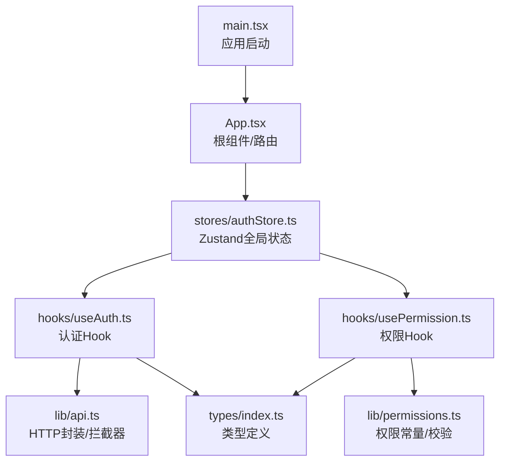
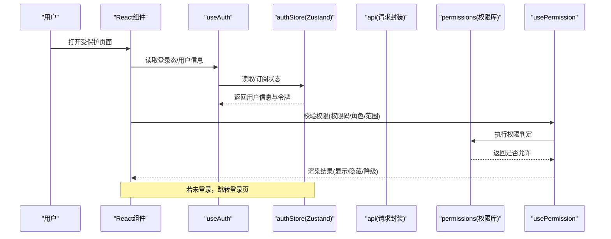
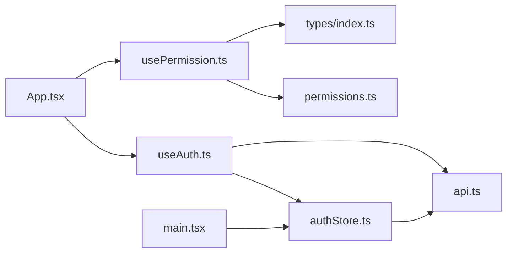

# 状态管理架构

<cite>
**本文引用的文件**   
- [authStore.ts](file://web/src/stores/authStore.ts)
- [useAuth.ts](file://web/src/hooks/useAuth.ts)
- [usePermission.ts](file://web/src/hooks/usePermission.ts)
- [permissions.ts](file://web/src/lib/permissions.ts)
- [api.ts](file://web/src/lib/api.ts)
- [main.tsx](file://web/src/main.tsx)
- [App.tsx](file://web/src/App.tsx)
- [index.ts](file://web/src/types/index.ts)
</cite>

## 目录
1. [简介](#简介)
2. [项目结构](#项目结构)
3. [核心组件](#核心组件)
4. [架构总览](#架构总览)
5. [详细组件分析](#详细组件分析)
6. [依赖关系分析](#依赖关系分析)
7. [性能考虑](#性能考虑)
8. [故障排查指南](#故障排查指南)
9. [结论](#结论)
10. [附录](#附录)

## 简介
本文件面向FY200前端的状态管理，重点阐述基于Zustand的认证与权限状态设计。文档围绕以下目标展开：
- 全局状态管理器authStore的设计与实现
- useAuth自定义钩子的认证状态管理（用户信息、登录态同步、令牌刷新）
- usePermission权限控制钩子（权限验证、角色判断、数据范围控制）
- 状态持久化策略、更新最佳实践与性能优化
- 状态调试工具使用与常见问题解决方案

## 项目结构
与状态管理相关的代码集中在web/src目录下：
- stores/authStore.ts：基于Zustand的全局认证状态管理
- hooks/useAuth.ts：封装认证相关状态与操作的Hook
- hooks/usePermission.ts：封装权限校验与数据范围控制的Hook
- lib/permissions.ts：权限常量与基础校验逻辑
- lib/api.ts：HTTP请求封装（含拦截器、令牌处理）
- main.tsx / App.tsx：应用初始化与路由入口
- types/index.ts：类型定义（用户、权限等）

图表来源
- [main.tsx](file://web/src/main.tsx)
- [App.tsx](file://web/src/App.tsx)
- [authStore.ts](file://web/src/stores/authStore.ts)
- [useAuth.ts](file://web/src/hooks/useAuth.ts)
- [usePermission.ts](file://web/src/hooks/usePermission.ts)
- [permissions.ts](file://web/src/lib/permissions.ts)
- [api.ts](file://web/src/lib/api.ts)
- [index.ts](file://web/src/types/index.ts)

章节来源
- [authStore.ts](file://web/src/stores/authStore.ts)
- [useAuth.ts](file://web/src/hooks/useAuth.ts)
- [usePermission.ts](file://web/src/hooks/usePermission.ts)
- [permissions.ts](file://web/src/lib/permissions.ts)
- [api.ts](file://web/src/lib/api.ts)
- [main.tsx](file://web/src/main.tsx)
- [App.tsx](file://web/src/App.tsx)
- [index.ts](file://web/src/types/index.ts)

## 核心组件
- authStore：集中式认证状态（用户信息、角色、权限集合、登录态、令牌等），提供登录、登出、刷新令牌、设置权限等方法；支持持久化到本地存储，并在应用启动时恢复。
- useAuth：暴露当前认证状态与操作（如获取用户信息、检查是否已登录、触发登录/登出、刷新令牌），在组件中订阅状态变化并驱动UI。
- usePermission：提供权限判定能力（按权限码、角色、数据范围），常用于页面级或按钮级访问控制。
- permissions：权限码与角色映射、默认拒绝策略、数据范围规则。
- api：统一请求封装，包含JWT注入、401自动刷新、错误归一化。

章节来源
- [authStore.ts](file://web/src/stores/authStore.ts)
- [useAuth.ts](file://web/src/hooks/useAuth.ts)
- [usePermission.ts](file://web/src/hooks/usePermission.ts)
- [permissions.ts](file://web/src/lib/permissions.ts)
- [api.ts](file://web/src/lib/api.ts)

## 架构总览
下图展示了从应用启动到认证与权限判定的整体流程，以及Zustand状态在各层之间的流转。

图表来源
- [useAuth.ts](file://web/src/hooks/useAuth.ts)
- [authStore.ts](file://web/src/stores/authStore.ts)
- [api.ts](file://web/src/lib/api.ts)
- [usePermission.ts](file://web/src/hooks/usePermission.ts)
- [permissions.ts](file://web/src/lib/permissions.ts)

## 详细组件分析

### authStore：全局认证状态管理器
职责与边界
- 维护用户信息、角色、权限集合、登录态、令牌（access/refresh）、加载态与错误信息
- 提供登录、登出、刷新令牌、设置权限、清除状态等操作
- 支持本地持久化（例如localStorage），在应用启动时恢复状态
- 通过Zustand的subscribe机制，确保组件按需重渲染

关键概念
- 用户信息：包含用户标识、姓名、角色、权限列表等
- 令牌：access token短期有效，refresh token长期有效；过期时自动刷新
- 权限集合：由后端下发或本地计算得到，用于细粒度控制
- 数据范围：根据角色/组织维度限制可访问的数据集

典型方法
- login(credentials)：提交凭证，成功后保存用户信息与令牌，写入持久化
- logout()：清空状态与持久化，必要时调用后端注销接口
- refreshAccessToken()：使用refresh token换取新access token，失败则登出
- setPermissions(permissions)：更新权限集合，供权限判定使用
- clear()：重置所有状态

持久化策略
- 将敏感信息（如token）加密或安全存储（建议结合浏览器安全特性）
- 非敏感信息（如用户基本信息）可缓存以提升首屏体验
- 监听storage事件或在应用启动时校验令牌有效性

错误处理
- 网络异常、令牌失效、权限不足等错误统一归一化
- 失败时保持状态一致性，避免脏读

章节来源
- [authStore.ts](file://web/src/stores/authStore.ts)

### useAuth：认证状态Hook
职责与边界
- 暴露当前认证状态（是否登录、用户信息、权限集合）
- 提供登录、登出、刷新令牌等操作函数
- 在组件中订阅authStore的变化，最小化重渲染

常用API
- isAuthenticated：是否已登录
- user：当前用户对象
- hasPermission(code)：快速判断某权限码是否存在
- login(credentials)：发起登录流程
- logout()：退出登录
- refresh()：主动刷新令牌

内部流程
- 首次加载：从持久化恢复用户信息与令牌，必要时校验有效性
- 登录成功：更新store，触发订阅者更新
- 登出：清理store与持久化，必要时通知后端失效令牌

章节来源
- [useAuth.ts](file://web/src/hooks/useAuth.ts)
- [authStore.ts](file://web/src/stores/authStore.ts)

### usePermission：权限控制Hook
职责与边界
- 提供权限判定能力：权限码、角色、数据范围
- 支持组合条件（AND/OR）与默认拒绝策略
- 为页面/按钮级控制提供统一入口

判定逻辑
- 权限码匹配：检查用户权限集合是否包含所需权限
- 角色判断：根据用户角色决定访问级别
- 数据范围：根据组织/公司/部门等维度过滤数据

常见用法
- 页面级：进入前检查，无权限则跳转或展示占位
- 按钮级：根据权限动态渲染/禁用
- 数据级：结合后端scope扩展，仅返回授权数据

章节来源
- [usePermission.ts](file://web/src/hooks/usePermission.ts)
- [permissions.ts](file://web/src/lib/permissions.ts)

### permissions：权限常量与校验
内容要点
- 权限码定义：如“报表查看”、“指标编辑”、“管理员”等
- 角色映射：将角色与一组权限码关联
- 默认策略：未明确允许的权限一律拒绝
- 数据范围规则：按组织/公司/部门等维度限定数据可见性

章节来源
- [permissions.ts](file://web/src/lib/permissions.ts)
- [index.ts](file://web/src/types/index.ts)

### api：请求封装与令牌处理
职责与边界
- 统一HTTP请求封装，注入Authorization头
- 处理401响应：自动尝试刷新令牌，失败则登出并重定向
- 错误归一化：将后端错误转换为前端友好提示

刷新流程
- 捕获401 → 检查refresh token → 调用刷新接口 → 更新store中的access token → 重试原请求
- 刷新失败 → 清理状态 → 跳转登录页

章节来源
- [api.ts](file://web/src/lib/api.ts)
- [authStore.ts](file://web/src/stores/authStore.ts)

### 应用初始化与路由入口
- main.tsx：应用启动，初始化全局状态（包括从持久化恢复认证信息）
- App.tsx：配置路由与受保护路由守卫，结合useAuth与usePermission进行访问控制

章节来源
- [main.tsx](file://web/src/main.tsx)
- [App.tsx](file://web/src/App.tsx)

## 依赖关系分析

图表来源
- [authStore.ts](file://web/src/stores/authStore.ts)
- [useAuth.ts](file://web/src/hooks/useAuth.ts)
- [usePermission.ts](file://web/src/hooks/usePermission.ts)
- [permissions.ts](file://web/src/lib/permissions.ts)
- [api.ts](file://web/src/lib/api.ts)
- [main.tsx](file://web/src/main.tsx)
- [App.tsx](file://web/src/App.tsx)
- [index.ts](file://web/src/types/index.ts)

章节来源
- [authStore.ts](file://web/src/stores/authStore.ts)
- [useAuth.ts](file://web/src/hooks/useAuth.ts)
- [usePermission.ts](file://web/src/hooks/usePermission.ts)
- [permissions.ts](file://web/src/lib/permissions.ts)
- [api.ts](file://web/src/lib/api.ts)
- [main.tsx](file://web/src/main.tsx)
- [App.tsx](file://web/src/App.tsx)
- [index.ts](file://web/src/types/index.ts)

## 性能考虑
- 选择器订阅：在useAuth/usePermission中使用Zustand的选择器，仅订阅必要字段，减少不必要的重渲染
- 批量更新：合并多次状态更新，避免频繁触发渲染
- 懒加载：仅在需要时加载权限与用户信息，首屏优先保证登录态恢复
- 防抖/节流：对高频操作（如搜索、筛选）进行节流，降低状态更新频率
- 令牌刷新去重：并发刷新时只进行一次刷新，其余请求排队等待
- 持久化读写：避免每次渲染都读写本地存储，采用内存缓存+惰性持久化

[本节为通用指导，不直接分析具体文件]

## 故障排查指南
常见问题与解决思路
- 登录后仍显示未登录
  - 检查持久化是否正确写入与恢复
  - 确认应用启动时是否调用恢复逻辑
  - 查看store中用户信息与令牌是否完整
- 频繁401或无法刷新令牌
  - 检查refresh token是否有效且未被吊销
  - 确认api拦截器的刷新流程是否被正确触发
  - 查看网络请求与响应日志
- 权限判定不正确
  - 核对权限码与角色映射
  - 确认后端下发的权限集合是否完整
  - 检查usePermission的组合条件是否符合预期
- 状态不一致
  - 检查是否有多个地方直接修改store
  - 确保通过store提供的action更新状态
  - 使用调试工具观察状态变更轨迹

调试工具建议
- 启用Zustand开发中间件，监控状态快照与动作
- 在useAuth/usePermission中加入日志输出，记录关键分支
- 使用浏览器开发者工具的Network面板检查令牌与请求头

章节来源
- [authStore.ts](file://web/src/stores/authStore.ts)
- [useAuth.ts](file://web/src/hooks/useAuth.ts)
- [usePermission.ts](file://web/src/hooks/usePermission.ts)
- [api.ts](file://web/src/lib/api.ts)

## 结论
FY200前端状态管理以Zustand为核心，构建了清晰、可扩展的认证与权限体系。authStore作为单一事实源，配合useAuth与usePermission，实现了从登录态到权限判定的端到端闭环。通过合理的持久化策略、统一的请求封装与完善的错误处理，系统在可用性与性能之间取得平衡。建议在后续迭代中持续优化选择器订阅、刷新去重与调试能力，进一步提升用户体验与可维护性。

[本节为总结性内容，不直接分析具体文件]

## 附录
- 术语表
  - Zustand：轻量级状态管理库，提供简洁的store与Hook
  - access token：短期有效的访问令牌
  - refresh token：长期有效的刷新令牌
  - 权限码：用于细粒度控制的可识别字符串
  - 数据范围：按组织/公司/部门等维度限制数据可见性的规则

[本节为补充说明，不直接分析具体文件]