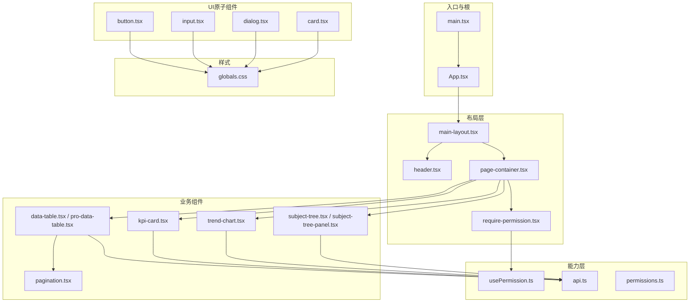
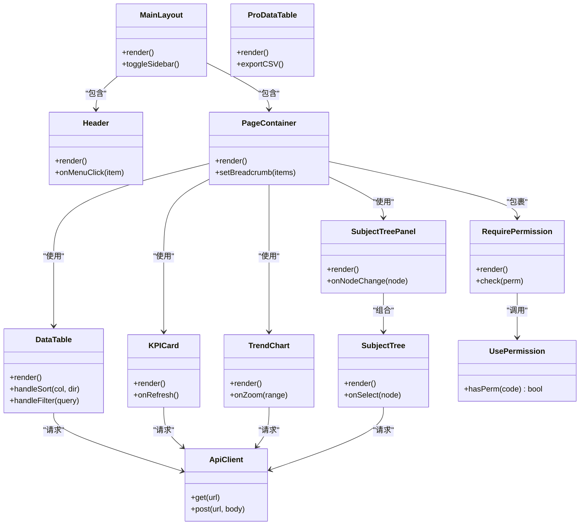
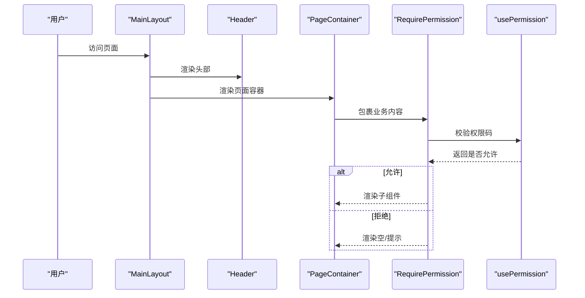
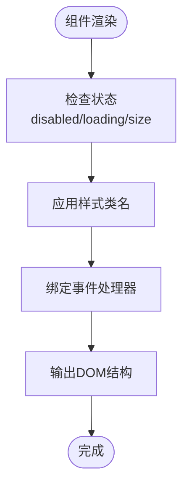
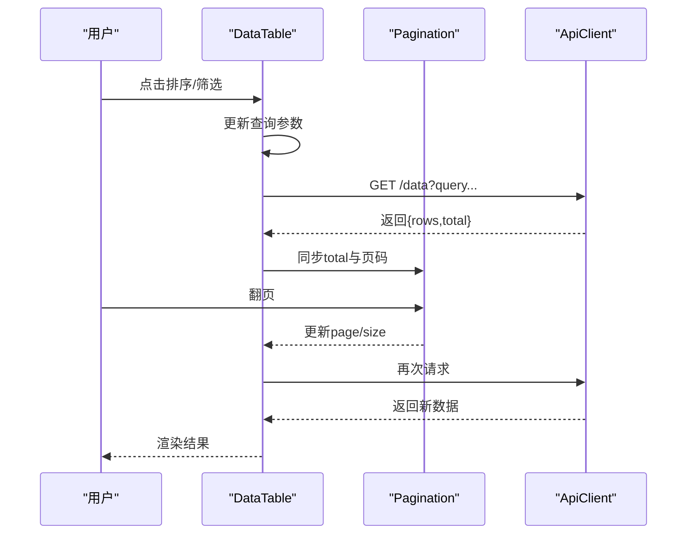
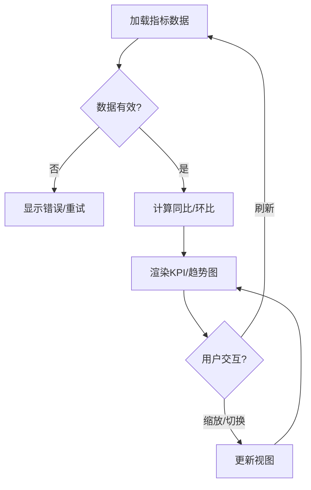
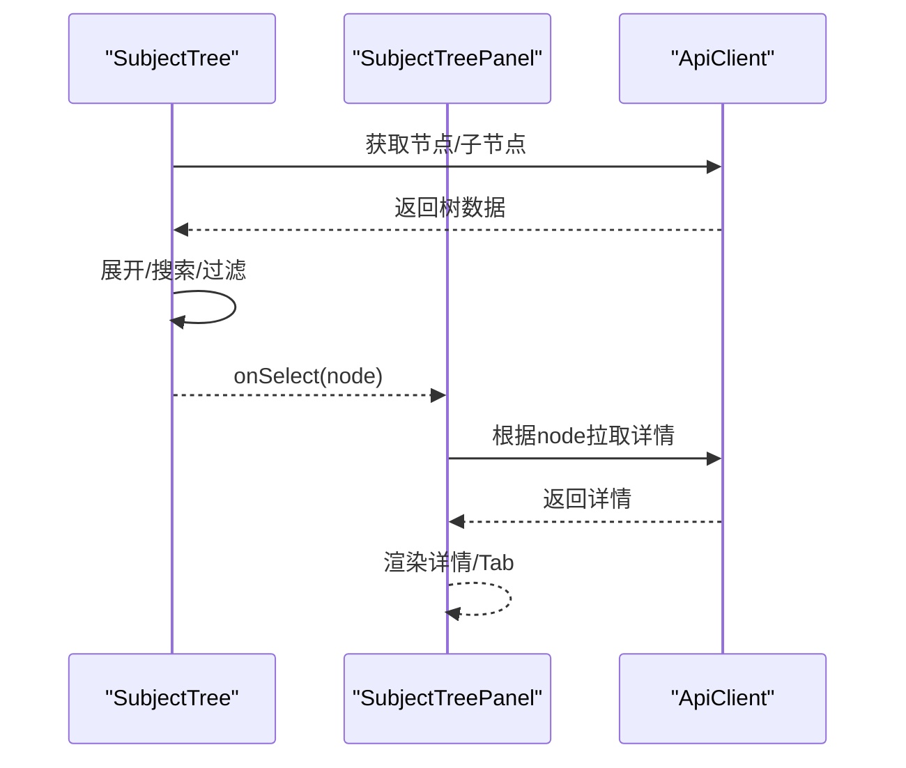
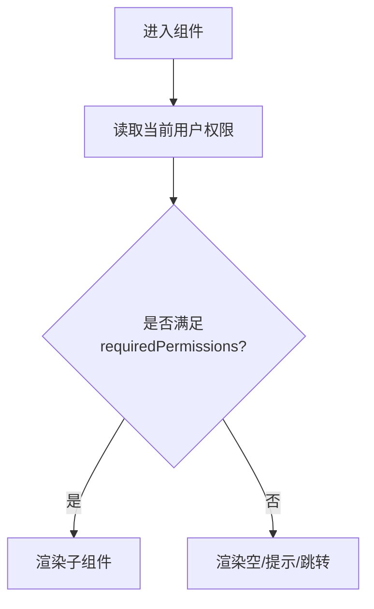
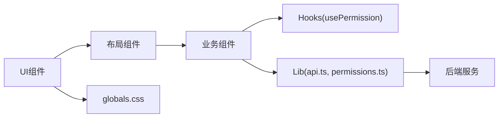

# 组件架构设计

<cite>
**本文引用的文件**   
- [main.tsx](file://web/src/main.tsx)
- [App.tsx](file://web/src/App.tsx)
- [main-layout.tsx](file://web/src/components/layout/main-layout.tsx)
- [header.tsx](file://web/src/components/layout/header.tsx)
- [page-container.tsx](file://web/src/components/layout/page-container.tsx)
- [require-permission.tsx](file://web/src/components/layout/require-permission.tsx)
- [button.tsx](file://web/src/components/ui/button.tsx)
- [input.tsx](file://web/src/components/ui/input.tsx)
- [dialog.tsx](file://web/src/components/ui/dialog.tsx)
- [card.tsx](file://web/src/components/ui/card.tsx)
- [data-table.tsx](file://web/src/components/data-table/data-table.tsx)
- [pro-data-table.tsx](file://web/src/components/data-table/pro-data-table.tsx)
- [pagination.tsx](file://web/src/components/data-table/pagination.tsx)
- [kpi-card.tsx](file://web/src/components/charts/kpi-card.tsx)
- [trend-chart.tsx](file://web/src/components/charts/trend-chart.tsx)
- [subject-tree.tsx](file://web/src/components/subject-tree/subject-tree.tsx)
- [subject-tree-panel.tsx](file://web/src/components/subject-tree/subject-tree-panel.tsx)
- [usePermission.ts](file://web/src/hooks/usePermission.ts)
- [api.ts](file://web/src/lib/api.ts)
- [permissions.ts](file://web/src/lib/permissions.ts)
- [globals.css](file://web/src/styles/globals.css)
</cite>

## 目录
1. [引言](#引言)
2. [项目结构](#项目结构)
3. [核心组件](#核心组件)
4. [架构总览](#架构总览)
5. [详细组件分析](#详细组件分析)
6. [依赖关系分析](#依赖关系分析)
7. [性能考量](#性能考量)
8. [故障排查指南](#故障排查指南)
9. [结论](#结论)
10. [附录](#附录)

## 引言
本文件面向FY200前端（React）组件体系，系统化阐述分层设计原则与实现策略：基础UI组件库、业务组件、布局组件与权限控制。文档覆盖组件职责边界、组合方式、通信机制、Props规范、事件处理模式、复用策略、样式隔离与性能优化，并提供使用示例与最佳实践，帮助开发者快速上手并高质量扩展。

## 项目结构
前端采用按功能域组织源码的目录结构，核心路径如下：
- components/ui：基础UI原子组件（按钮、输入、对话框、卡片等）
- components/data-table：数据表格与分页能力
- components/charts：图表与指标展示组件
- components/subject-tree：主题树与面板封装
- components/layout：主布局、头部、页面容器与权限控制
- hooks：状态与权限相关Hook
- lib：API请求、权限常量与工具函数
- styles：全局样式与主题变量
- pages：页面级路由与页面组装

图示来源 
- [main.tsx](file://web/src/main.tsx)
- [App.tsx](file://web/src/App.tsx)
- [main-layout.tsx](file://web/src/components/layout/main-layout.tsx)
- [header.tsx](file://web/src/components/layout/header.tsx)
- [page-container.tsx](file://web/src/components/layout/page-container.tsx)
- [require-permission.tsx](file://web/src/components/layout/require-permission.tsx)
- [button.tsx](file://web/src/components/ui/button.tsx)
- [input.tsx](file://web/src/components/ui/input.tsx)
- [dialog.tsx](file://web/src/components/ui/dialog.tsx)
- [card.tsx](file://web/src/components/ui/card.tsx)
- [data-table.tsx](file://web/src/components/data-table/data-table.tsx)
- [pro-data-table.tsx](file://web/src/components/data-table/pro-data-table.tsx)
- [pagination.tsx](file://web/src/components/data-table/pagination.tsx)
- [kpi-card.tsx](file://web/src/components/charts/kpi-card.tsx)
- [trend-chart.tsx](file://web/src/components/charts/trend-chart.tsx)
- [subject-tree.tsx](file://web/src/components/subject-tree/subject-tree.tsx)
- [subject-tree-panel.tsx](file://web/src/components/subject-tree/subject-tree-panel.tsx)
- [usePermission.ts](file://web/src/hooks/usePermission.ts)
- [api.ts](file://web/src/lib/api.ts)
- [permissions.ts](file://web/src/lib/permissions.ts)
- [globals.css](file://web/src/styles/globals.css)

章节来源
- [main.tsx](file://web/src/main.tsx)
- [App.tsx](file://web/src/App.tsx)

## 核心组件
- 基础UI组件（button、input、dialog、card等）
  - 职责：提供最小可复用的交互原语，严格受控或半受控，统一样式与无障碍属性。
  - 设计要点：Props命名一致、事件回调语义清晰、支持disabled/loading状态、键盘可达性。
- 数据表格（data-table、pro-data-table、pagination）
  - 职责：列表渲染、排序/筛选/分页/导出；高级版支持列配置、虚拟滚动、批量操作。
  - 设计要点：数据与视图分离、服务端分页优先、列定义与渲染器解耦。
- 图表（kpi-card、trend-chart等）
  - 职责：指标卡、趋势图、迷你图等可视化表达。
  - 设计要点：数据契约稳定、加载态骨架屏、错误态降级。
- 主题树（subject-tree、subject-tree-panel）
  - 职责：科目/指标树形导航与面板联动。
  - 设计要点：懒加载节点、选中态同步、跨组件事件广播。
- 布局（main-layout、header、page-container）
  - 职责：应用壳、顶部导航、页面内容容器与边距/标题管理。
  - 设计要点：响应式、可插拔侧边栏、BEM/Tailwind一致性。
- 权限控制（require-permission）
  - 职责：基于角色/权限码的渲染控制。
  - 设计要点：与usePermission Hook配合，默认拒绝策略。

章节来源
- [button.tsx](file://web/src/components/ui/button.tsx)
- [input.tsx](file://web/src/components/ui/input.tsx)
- [dialog.tsx](file://web/src/components/ui/dialog.tsx)
- [card.tsx](file://web/src/components/ui/card.tsx)
- [data-table.tsx](file://web/src/components/data-table/data-table.tsx)
- [pro-data-table.tsx](file://web/src/components/data-table/pro-data-table.tsx)
- [pagination.tsx](file://web/src/components/data-table/pagination.tsx)
- [kpi-card.tsx](file://web/src/components/charts/kpi-card.tsx)
- [trend-chart.tsx](file://web/src/components/charts/trend-chart.tsx)
- [subject-tree.tsx](file://web/src/components/subject-tree/subject-tree.tsx)
- [subject-tree-panel.tsx](file://web/src/components/subject-tree/subject-tree-panel.tsx)
- [main-layout.tsx](file://web/src/components/layout/main-layout.tsx)
- [header.tsx](file://web/src/components/layout/header.tsx)
- [page-container.tsx](file://web/src/components/layout/page-container.tsx)
- [require-permission.tsx](file://web/src/components/layout/require-permission.tsx)

## 架构总览
整体采用“布局层 → 业务组件层 → UI原子层”的分层架构，通过Hook与lib进行能力下沉，保证高内聚低耦合。

图示来源 
- [main-layout.tsx](file://web/src/components/layout/main-layout.tsx)
- [header.tsx](file://web/src/components/layout/header.tsx)
- [page-container.tsx](file://web/src/components/layout/page-container.tsx)
- [require-permission.tsx](file://web/src/components/layout/require-permission.tsx)
- [data-table.tsx](file://web/src/components/data-table/data-table.tsx)
- [pro-data-table.tsx](file://web/src/components/data-table/pro-data-table.tsx)
- [pagination.tsx](file://web/src/components/data-table/pagination.tsx)
- [kpi-card.tsx](file://web/src/components/charts/kpi-card.tsx)
- [trend-chart.tsx](file://web/src/components/charts/trend-chart.tsx)
- [subject-tree.tsx](file://web/src/components/subject-tree/subject-tree.tsx)
- [subject-tree-panel.tsx](file://web/src/components/subject-tree/subject-tree-panel.tsx)
- [usePermission.ts](file://web/src/hooks/usePermission.ts)
- [api.ts](file://web/src/lib/api.ts)

## 详细组件分析

### 布局组件体系
- main-layout 主布局
  - 职责：应用外壳、侧边栏切换、全局消息与路由占位。
  - 关键点：响应式栅格、侧边栏折叠状态持久化、与Header/PageContainer组合。
- header 头部
  - 职责：品牌、面包屑、用户菜单、通知入口。
  - 关键点：菜单项权限过滤、移动端抽屉菜单。
- page-container 页面容器
  - 职责：页面标题、描述、操作区、内容区与间距管理。
  - 关键点：插槽式children、loading/error骨架屏、统一padding。
- require-permission 权限控制
  - 职责：根据权限码决定是否渲染子组件。
  - 关键点：默认拒绝策略、无权限时显示占位或跳转。

图示来源 
- [main-layout.tsx](file://web/src/components/layout/main-layout.tsx)
- [header.tsx](file://web/src/components/layout/header.tsx)
- [page-container.tsx](file://web/src/components/layout/page-container.tsx)
- [require-permission.tsx](file://web/src/components/layout/require-permission.tsx)
- [usePermission.ts](file://web/src/hooks/usePermission.ts)

章节来源
- [main-layout.tsx](file://web/src/components/layout/main-layout.tsx)
- [header.tsx](file://web/src/components/layout/header.tsx)
- [page-container.tsx](file://web/src/components/layout/page-container.tsx)
- [require-permission.tsx](file://web/src/components/layout/require-permission.tsx)
- [usePermission.ts](file://web/src/hooks/usePermission.ts)

### 基础UI组件库（button、input、dialog、card）
- 设计模式
  - 受控/半受控：value/onChange或defaultValue/onInput，明确单一数据源。
  - 状态透传：disabled、loading、size、variant等通用属性。
  - 无障碍：role、aria-*、tabIndex、键盘导航。
- 样式隔离
  - 使用Tailwind类名+CSS变量，避免全局污染。
  - 组件内部样式与作用域限定，避免选择器冲突。
- 事件处理
  - 标准化事件名（onClick、onSubmit、onFocus、onBlur），禁止直接操作DOM。

章节来源
- [button.tsx](file://web/src/components/ui/button.tsx)
- [input.tsx](file://web/src/components/ui/input.tsx)
- [dialog.tsx](file://web/src/components/ui/dialog.tsx)
- [card.tsx](file://web/src/components/ui/card.tsx)
- [globals.css](file://web/src/styles/globals.css)

### 数据表格（data-table、pro-data-table、pagination）
- 数据契约
  - columns：列定义（key、title、sortable、filterable、formatter）。
  - data：只读数组，分页由服务端驱动。
  - loading/error：统一状态。
- 交互流程
  - 排序/筛选触发查询参数变化，重新拉取数据。
  - 分页组件与表格状态双向绑定。
- 高级能力
  - 列宽拖拽、固定列、行选择、批量导出。

图示来源 
- [data-table.tsx](file://web/src/components/data-table/data-table.tsx)
- [pro-data-table.tsx](file://web/src/components/data-table/pro-data-table.tsx)
- [pagination.tsx](file://web/src/components/data-table/pagination.tsx)
- [api.ts](file://web/src/lib/api.ts)

章节来源
- [data-table.tsx](file://web/src/components/data-table/data-table.tsx)
- [pro-data-table.tsx](file://web/src/components/data-table/pro-data-table.tsx)
- [pagination.tsx](file://web/src/components/data-table/pagination.tsx)
- [api.ts](file://web/src/lib/api.ts)

### 图表与指标（kpi-card、trend-chart）
- KPI卡片
  - 展示关键指标、同比/环比、趋势箭头与刷新按钮。
  - 支持骨架屏与错误降级。
- 趋势图
  - 时间序列折线/面积图，支持缩放、对比维度切换。
  - 大数据量下启用采样与懒加载。

章节来源
- [kpi-card.tsx](file://web/src/components/charts/kpi-card.tsx)
- [trend-chart.tsx](file://web/src/components/charts/trend-chart.tsx)
- [api.ts](file://web/src/lib/api.ts)

### 主题树（subject-tree、subject-tree-panel）
- 主题树
  - 懒加载节点、搜索过滤、多选/单选模式。
  - 选中态与面板联动。
- 面板
  - 承载树的选择结果与详情区域，支持Tab切换。

图示来源 
- [subject-tree.tsx](file://web/src/components/subject-tree/subject-tree.tsx)
- [subject-tree-panel.tsx](file://web/src/components/subject-tree/subject-tree-panel.tsx)
- [api.ts](file://web/src/lib/api.ts)

章节来源
- [subject-tree.tsx](file://web/src/components/subject-tree/subject-tree.tsx)
- [subject-tree-panel.tsx](file://web/src/components/subject-tree/subject-tree-panel.tsx)
- [api.ts](file://web/src/lib/api.ts)

### 权限控制（require-permission 与 usePermission）
- 权限模型
  - 权限码集合与角色映射，默认拒绝。
  - 细粒度到按钮/菜单/页面级别。
- 使用方式
  - 在页面或按钮外层包裹RequirePermission，传入requiredPermissions。
  - Hook中提供hasPerm方法用于条件渲染。

章节来源
- [require-permission.tsx](file://web/src/components/layout/require-permission.tsx)
- [usePermission.ts](file://web/src/hooks/usePermission.ts)
- [permissions.ts](file://web/src/lib/permissions.ts)

## 依赖关系分析
- 组件间通信
  - Props传递：自上而下传递数据与回调，避免深层props drilling，必要时使用Context或事件总线。
  - 事件处理：统一事件命名与参数约定，避免隐式副作用。
- 外部依赖
  - API客户端：集中封装请求、拦截器、错误处理与重试策略。
  - 权限常量：集中维护权限码与角色映射。
  - 样式系统：Tailwind+CSS变量，确保主题一致性。

图示来源 
- [api.ts](file://web/src/lib/api.ts)
- [permissions.ts](file://web/src/lib/permissions.ts)
- [usePermission.ts](file://web/src/hooks/usePermission.ts)
- [globals.css](file://web/src/styles/globals.css)

章节来源
- [api.ts](file://web/src/lib/api.ts)
- [permissions.ts](file://web/src/lib/permissions.ts)
- [usePermission.ts](file://web/src/hooks/usePermission.ts)
- [globals.css](file://web/src/styles/globals.css)

## 性能考量
- 渲染优化
  - React.memo包装纯展示组件，减少重渲染。
  - 列表虚拟化（长列表）、按需加载（路由/组件懒加载）。
- 数据请求
  - 服务端分页与增量更新，避免全量拉取。
  - 请求去抖/节流（搜索、窗口resize）。
  - 缓存策略（内存缓存/浏览器缓存）与失效策略。
- 样式与资源
  - 按需引入样式，避免全局污染。
  - 图片与图标懒加载与压缩。
- 可观测性
  - 埋点关键交互与错误上报，便于定位瓶颈。

[本节为通用指导，不直接分析具体文件]

## 故障排查指南
- 常见问题
  - 权限不足导致空白：检查requiredPermissions与当前用户权限映射。
  - 表格数据不更新：确认分页/筛选参数是否正确传递至API。
  - 图表渲染异常：检查数据格式与空值处理。
  - 样式错乱：检查Tailwind类名冲突与全局样式覆盖。
- 调试建议
  - 使用浏览器网络面板查看API响应与错误码。
  - 在usePermission中打印权限判定过程。
  - 对复杂组件增加日志与边界用例测试。

章节来源
- [require-permission.tsx](file://web/src/components/layout/require-permission.tsx)
- [usePermission.ts](file://web/src/hooks/usePermission.ts)
- [api.ts](file://web/src/lib/api.ts)

## 结论
FY200前端组件架构以清晰的层次划分与严格的Props/事件契约为基础，结合权限控制与统一的API/样式体系，实现了高内聚、低耦合与良好可扩展性。遵循本文档的设计原则与实践指南，可在保证质量的前提下快速迭代与复用。

## 附录
- 使用示例与最佳实践
  - 在页面中使用PageContainer包裹业务内容，并通过RequirePermission限制可见性。
  - 表格组件统一使用columns与data契约，服务端分页优先。
  - 图表组件保持数据契约稳定，提供骨架屏与错误态。
  - 基础UI组件遵循受控/半受控模式，禁用与加载态统一暴露。
  - 样式使用Tailwind类名与CSS变量，避免全局污染。

[本节为概念性说明，不直接分析具体文件]