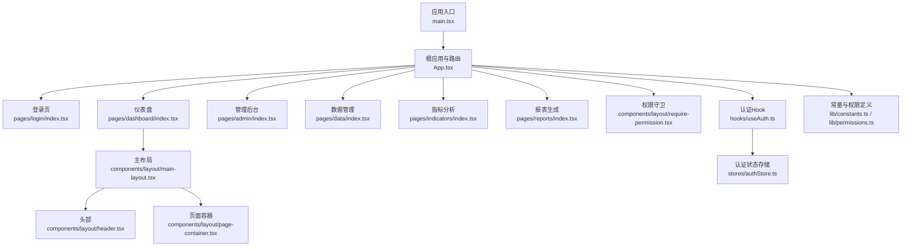
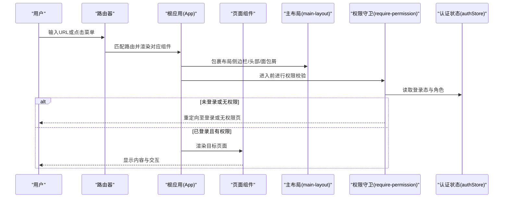
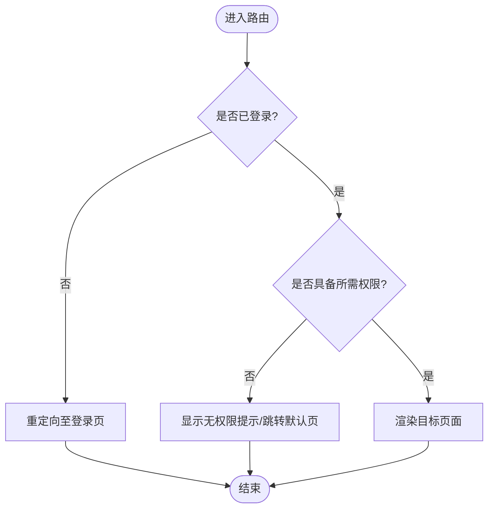
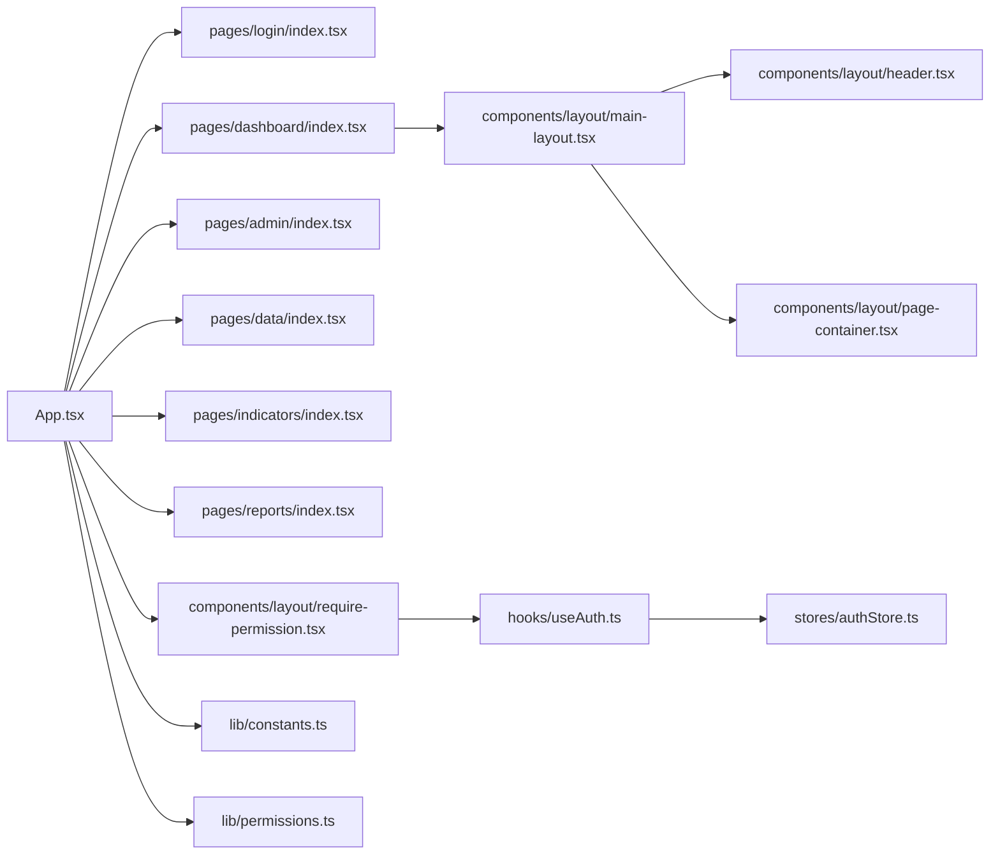

# 路由导航系统

<cite>
**本文引用的文件**   
- [web/src/main.tsx](file://web/src/main.tsx)
- [web/src/App.tsx](file://web/src/App.tsx)
- [web/src/pages/login/index.tsx](file://web/src/pages/login/index.tsx)
- [web/src/pages/dashboard/index.tsx](file://web/src/pages/dashboard/index.tsx)
- [web/src/pages/admin/index.tsx](file://web/src/pages/admin/index.tsx)
- [web/src/pages/data/index.tsx](file://web/src/pages/data/index.tsx)
- [web/src/pages/indicators/index.tsx](file://web/src/pages/indicators/index.tsx)
- [web/src/pages/reports/index.tsx](file://web/src/pages/reports/index.tsx)
- [web/src/components/layout/main-layout.tsx](file://web/src/components/layout/main-layout.tsx)
- [web/src/components/layout/header.tsx](file://web/src/components/layout/header.tsx)
- [web/src/components/layout/page-container.tsx](file://web/src/components/layout/page-container.tsx)
- [web/src/components/layout/require-permission.tsx](file://web/src/components/layout/require-permission.tsx)
- [web/src/hooks/useAuth.ts](file://web/src/hooks/useAuth.ts)
- [web/src/stores/authStore.ts](file://web/src/stores/authStore.ts)
- [web/src/lib/constants.ts](file://web/src/lib/constants.ts)
- [web/src/lib/permissions.ts](file://web/src/lib/permissions.ts)
</cite>

## 目录
1. [简介](#简介)
2. [项目结构](#项目结构)
3. [核心组件](#核心组件)
4. [架构总览](#架构总览)
5. [详细组件分析](#详细组件分析)
6. [依赖关系分析](#依赖关系分析)
7. [性能考量](#性能考量)
8. [故障排查指南](#故障排查指南)
9. [结论](#结论)
10. [附录](#附录)

## 简介
本文件面向FY200前端路由导航系统的实现与使用，聚焦基于React Router的路由配置、页面组织、权限守卫、动态与嵌套路由、懒加载优化，以及面包屑导航、菜单生成与页面标题管理方案。文档兼顾技术深度与可读性，帮助开发者快速理解并扩展路由体系。

## 项目结构
前端采用Vite + React + TypeScript构建，路由相关代码集中在以下位置：
- 应用入口与根路由：main.tsx、App.tsx
- 页面模块：pages/*（login、dashboard、admin、data、indicators、reports等）
- 布局与通用容器：components/layout/*（主布局、头部、页面容器、权限守卫）
- 认证与权限：hooks/useAuth.ts、stores/authStore.ts、lib/permissions.ts、lib/constants.ts

图表来源
- [web/src/main.tsx](file://web/src/main.tsx)
- [web/src/App.tsx](file://web/src/App.tsx)
- [web/src/pages/login/index.tsx](file://web/src/pages/login/index.tsx)
- [web/src/pages/dashboard/index.tsx](file://web/src/pages/dashboard/index.tsx)
- [web/src/pages/admin/index.tsx](file://web/src/pages/admin/index.tsx)
- [web/src/pages/data/index.tsx](file://web/src/pages/data/index.tsx)
- [web/src/pages/indicators/index.tsx](file://web/src/pages/indicators/index.tsx)
- [web/src/pages/reports/index.tsx](file://web/src/pages/reports/index.tsx)
- [web/src/components/layout/main-layout.tsx](file://web/src/components/layout/main-layout.tsx)
- [web/src/components/layout/header.tsx](file://web/src/components/layout/header.tsx)
- [web/src/components/layout/page-container.tsx](file://web/src/components/layout/page-container.tsx)
- [web/src/components/layout/require-permission.tsx](file://web/src/components/layout/require-permission.tsx)
- [web/src/hooks/useAuth.ts](file://web/src/hooks/useAuth.ts)
- [web/src/stores/authStore.ts](file://web/src/stores/authStore.ts)
- [web/src/lib/constants.ts](file://web/src/lib/constants.ts)
- [web/src/lib/permissions.ts](file://web/src/lib/permissions.ts)

章节来源
- [web/src/main.tsx](file://web/src/main.tsx)
- [web/src/App.tsx](file://web/src/App.tsx)

## 核心组件
- 根路由与应用壳：在应用入口处初始化路由与环境，挂载根组件；根组件内集中声明路由表、全局布局与权限守卫。
- 页面模块：每个业务域一个页面文件，职责单一，便于独立开发与维护。
- 布局组件：主布局负责侧边栏、顶部、内容区与面包屑；页面容器统一处理页面级样式、标题与元信息。
- 权限与认证：通过Hook与Store管理登录态与用户角色，结合权限守卫控制访问。

章节来源
- [web/src/App.tsx](file://web/src/App.tsx)
- [web/src/components/layout/main-layout.tsx](file://web/src/components/layout/main-layout.tsx)
- [web/src/components/layout/page-container.tsx](file://web/src/components/layout/page-container.tsx)
- [web/src/components/layout/require-permission.tsx](file://web/src/components/layout/require-permission.tsx)
- [web/src/hooks/useAuth.ts](file://web/src/hooks/useAuth.ts)
- [web/src/stores/authStore.ts](file://web/src/stores/authStore.ts)

## 架构总览
下图展示从浏览器到页面渲染的关键流程，包括路由匹配、布局注入、权限校验与页面加载。

图表来源
- [web/src/App.tsx](file://web/src/App.tsx)
- [web/src/components/layout/main-layout.tsx](file://web/src/components/layout/main-layout.tsx)
- [web/src/components/layout/require-permission.tsx](file://web/src/components/layout/require-permission.tsx)
- [web/src/stores/authStore.ts](file://web/src/stores/authStore.ts)

## 详细组件分析

### 路由配置与页面组织
- 路由表设计：将各功能模块作为独立路由项，按“公开/受保护”分组，便于集中管理与扩展。
- 页面职责划分：
  - 登录页：负责身份认证与跳转。
  - 仪表盘：聚合关键经营指标与趋势概览。
  - 管理后台：用户、角色、权限等系统管理。
  - 数据管理：数据导入、公式维护、主题树管理等。
  - 指标分析：指标计算、维度分析与可视化。
  - 报表生成：报表模板编辑与导出。
- 嵌套路由：为复杂页面（如数据管理、报表编辑器）提供子路由，支持Tab或抽屉式子视图。

章节来源
- [web/src/App.tsx](file://web/src/App.tsx)
- [web/src/pages/login/index.tsx](file://web/src/pages/login/index.tsx)
- [web/src/pages/dashboard/index.tsx](file://web/src/pages/dashboard/index.tsx)
- [web/src/pages/admin/index.tsx](file://web/src/pages/admin/index.tsx)
- [web/src/pages/data/index.tsx](file://web/src/pages/data/index.tsx)
- [web/src/pages/indicators/index.tsx](file://web/src/pages/indicators/index.tsx)
- [web/src/pages/reports/index.tsx](file://web/src/pages/reports/index.tsx)

### 路由守卫：登录验证与权限控制
- 登录验证：通过认证Hook读取Store中的登录态，未登录时重定向至登录页。
- 权限控制：基于角色/权限码的守卫组件，拦截无权限访问并返回提示或默认页。
- 访问限制：对敏感路由（如管理后台）强制校验，确保前后端权限一致。

图表来源
- [web/src/components/layout/require-permission.tsx](file://web/src/components/layout/require-permission.tsx)
- [web/src/hooks/useAuth.ts](file://web/src/hooks/useAuth.ts)
- [web/src/stores/authStore.ts](file://web/src/stores/authStore.ts)

章节来源
- [web/src/components/layout/require-permission.tsx](file://web/src/components/layout/require-permission.tsx)
- [web/src/hooks/useAuth.ts](file://web/src/hooks/useAuth.ts)
- [web/src/stores/authStore.ts](file://web/src/stores/authStore.ts)

### 动态路由与嵌套路由
- 动态路由：用于参数化页面（如报表ID、指标维度），通过路由参数获取上下文。
- 嵌套路由：在数据管理、报表编辑器等复杂场景中，使用子路由组织二级视图，提升可维护性。
- 路由参数校验：在进入页面时校验参数合法性，避免无效请求。

章节来源
- [web/src/pages/data/index.tsx](file://web/src/pages/data/index.tsx)
- [web/src/pages/reports/index.tsx](file://web/src/pages/reports/index.tsx)

### 路由懒加载与性能优化
- 按需加载：对非首屏页面使用动态导入，减少初始包体积。
- 预取策略：对高频访问页面（如仪表盘）进行预加载，提升体验。
- 错误边界：为懒加载组件添加错误边界，避免崩溃。

章节来源
- [web/src/App.tsx](file://web/src/App.tsx)

### 面包屑导航、菜单生成与页面标题管理
- 面包屑：根据当前路由层级自动生成，支持自定义路径映射。
- 菜单生成：基于路由元信息（名称、图标、权限）动态渲染侧边栏菜单。
- 页面标题：在页面容器或路由元信息中设置标题，统一更新文档标题与面包屑。

章节来源
- [web/src/components/layout/main-layout.tsx](file://web/src/components/layout/main-layout.tsx)
- [web/src/components/layout/header.tsx](file://web/src/components/layout/header.tsx)
- [web/src/components/layout/page-container.tsx](file://web/src/components/layout/page-container.tsx)
- [web/src/lib/constants.ts](file://web/src/lib/constants.ts)
- [web/src/lib/permissions.ts](file://web/src/lib/permissions.ts)

## 依赖关系分析
- 路由层依赖布局与页面组件，布局依赖头部与容器。
- 认证与权限贯穿路由守卫，依赖Store与Hook。
- 常量与权限定义被路由元信息与菜单生成共用，保证一致性。

图表来源
- [web/src/App.tsx](file://web/src/App.tsx)
- [web/src/components/layout/main-layout.tsx](file://web/src/components/layout/main-layout.tsx)
- [web/src/components/layout/header.tsx](file://web/src/components/layout/header.tsx)
- [web/src/components/layout/page-container.tsx](file://web/src/components/layout/page-container.tsx)
- [web/src/components/layout/require-permission.tsx](file://web/src/components/layout/require-permission.tsx)
- [web/src/hooks/useAuth.ts](file://web/src/hooks/useAuth.ts)
- [web/src/stores/authStore.ts](file://web/src/stores/authStore.ts)
- [web/src/lib/constants.ts](file://web/src/lib/constants.ts)
- [web/src/lib/permissions.ts](file://web/src/lib/permissions.ts)

章节来源
- [web/src/App.tsx](file://web/src/App.tsx)
- [web/src/components/layout/main-layout.tsx](file://web/src/components/layout/main-layout.tsx)
- [web/src/components/layout/require-permission.tsx](file://web/src/components/layout/require-permission.tsx)
- [web/src/hooks/useAuth.ts](file://web/src/hooks/useAuth.ts)
- [web/src/stores/authStore.ts](file://web/src/stores/authStore.ts)
- [web/src/lib/constants.ts](file://web/src/lib/constants.ts)
- [web/src/lib/permissions.ts](file://web/src/lib/permissions.ts)

## 性能考量
- 首屏优化：仅加载必要路由与布局，其他页面懒加载。
- 缓存策略：对静态资源与接口数据进行合理缓存，减少重复请求。
- 渲染优化：避免不必要的重渲染，合理使用Memo与Key。
- 错误隔离：为懒加载与第三方组件添加错误边界，防止级联失败。

[本节为通用指导，不直接分析具体文件]

## 故障排查指南
- 无法访问受保护页面：检查登录态与权限配置，确认守卫逻辑与权限码一致。
- 面包屑或标题异常：核对路由元信息与页面容器中的标题设置。
- 懒加载失败：查看网络与错误边界日志，确认动态导入路径正确。
- 菜单不显示：检查常量与权限定义是否与路由元信息匹配。

章节来源
- [web/src/components/layout/require-permission.tsx](file://web/src/components/layout/require-permission.tsx)
- [web/src/components/layout/page-container.tsx](file://web/src/components/layout/page-container.tsx)
- [web/src/lib/constants.ts](file://web/src/lib/constants.ts)
- [web/src/lib/permissions.ts](file://web/src/lib/permissions.ts)

## 结论
本路由导航系统以清晰的分层与模块化设计，实现了登录验证、权限控制、动态与嵌套路由、懒加载优化以及面包屑、菜单与标题的统一管理。通过集中化的路由元信息与权限定义，提升了可维护性与扩展性，适合持续迭代的大型内部管理平台。

[本节为总结性内容，不直接分析具体文件]

## 附录
- 最佳实践建议：
  - 将路由元信息（名称、图标、权限）集中管理，避免散落各处。
  - 使用统一的页面容器设置标题与元信息，保持风格一致。
  - 对敏感路由启用强校验，确保前后端权限一致。
  - 对大页面实施懒加载与错误边界，提升稳定性与性能。

[本节为补充说明，不直接分析具体文件]