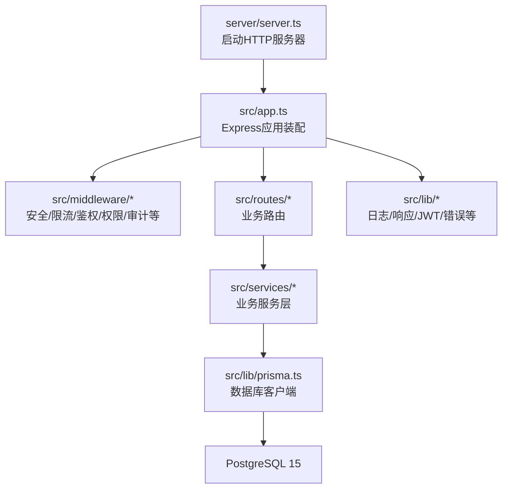
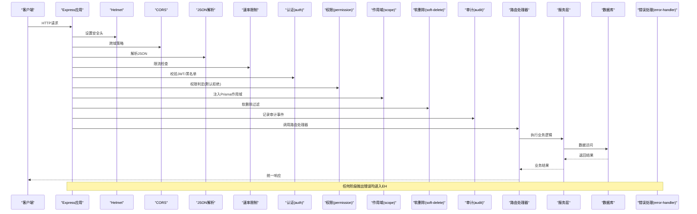
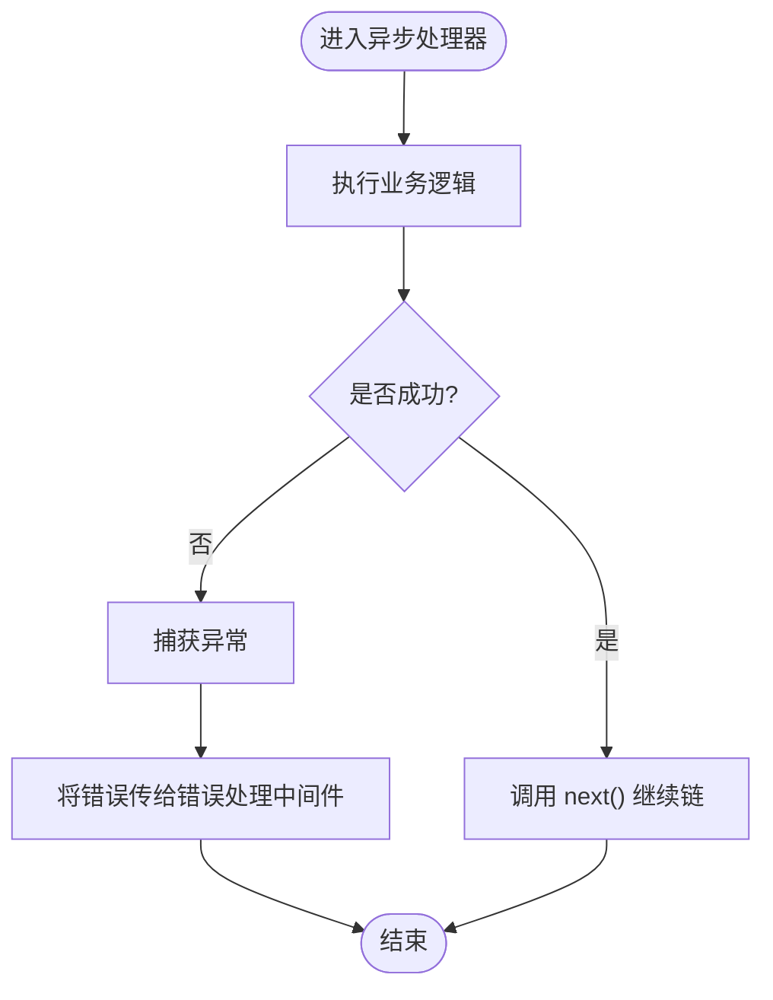
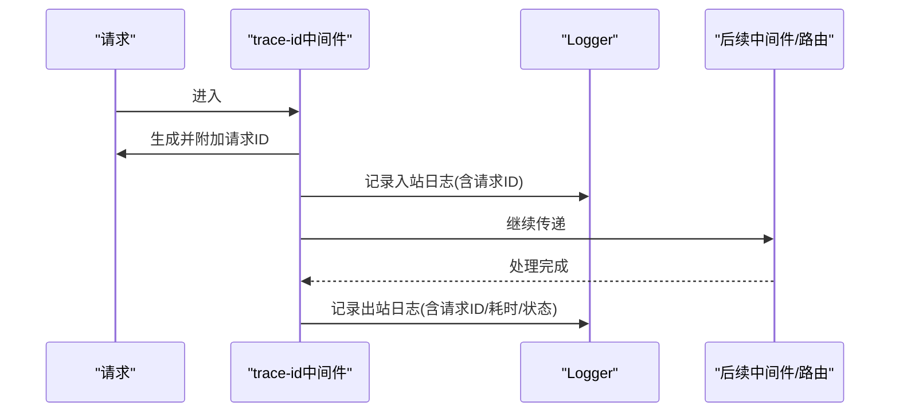
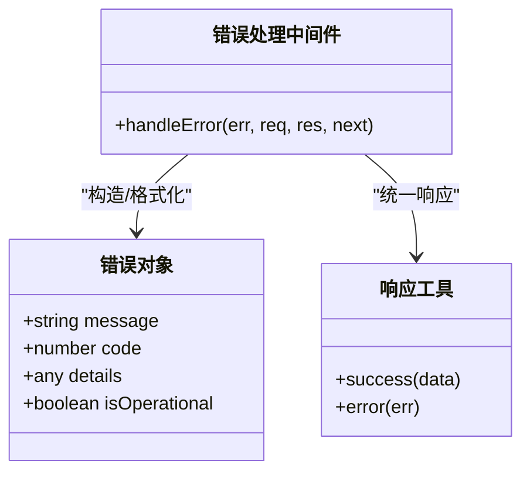
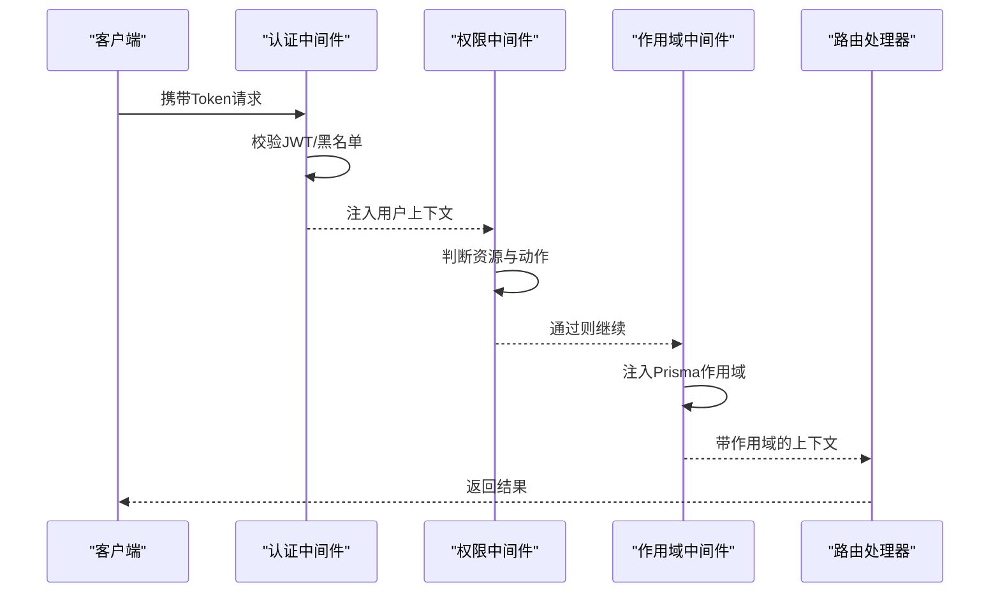
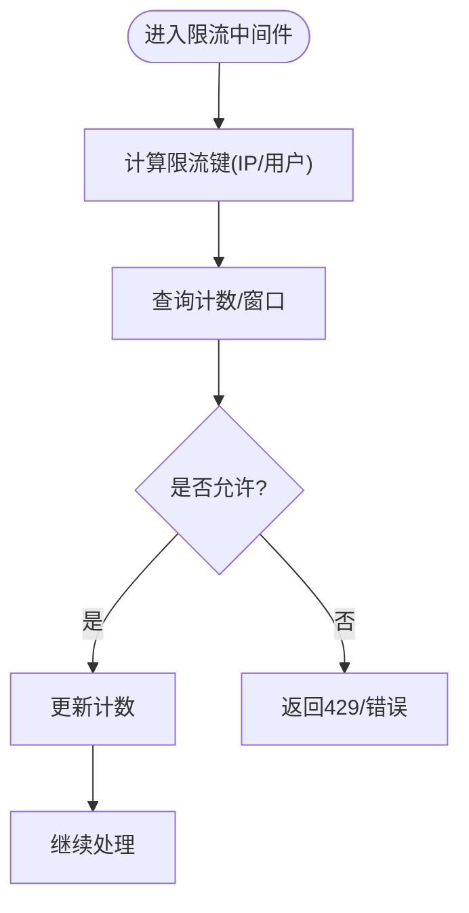
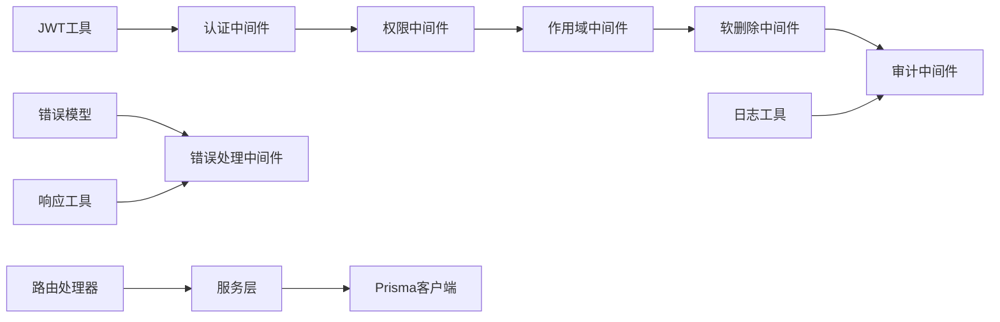

# 中间件开发指南

<cite>
**本文引用的文件**   
- [server.ts](file://server/server.ts)
- [app.ts](file://src/app.ts)
- [env.ts](file://src/config/env.ts)
- [async-handler.ts](file://src/lib/async-handler.ts)
- [errors.ts](file://src/lib/errors.ts)
- [logger.ts](file://src/lib/logger.ts)
- [response.ts](file://src/lib/response.ts)
- [jwt.ts](file://src/lib/jwt.ts)
- [trace-id.ts](file://src/middleware/trace-id.ts)
- [helmet.ts](file://src/middleware/helmet.ts)
- [cors.ts](file://src/middleware/cors.ts)
- [rate-limit.ts](file://src/middleware/rate-limit.ts)
- [auth.ts](file://src/middleware/auth.ts)
- [permission.ts](file://src/middleware/permission.ts)
- [scope.ts](file://src/middleware/scope.ts)
- [soft-delete.ts](file://src/middleware/soft-delete.ts)
- [audit.ts](file://src/middleware/audit.ts)
- [error-handler.ts](file://src/middleware/error-handler.ts)
- [ai-rate-limit.ts](file://src/middleware/ai-rate-limit.ts)
- [express.d.ts](file://src/types/express.d.ts)
</cite>

## 目录
1. [简介](#简介)
2. [项目结构](#项目结构)
3. [核心组件](#核心组件)
4. [架构总览](#架构总览)
5. [详细组件分析](#详细组件分析)
6. [依赖关系分析](#依赖关系分析)
7. [性能考量](#性能考量)
8. [故障排查指南](#故障排查指南)
9. [结论](#结论)
10. [附录：中间件模板与最佳实践](#附录中间件模板与最佳实践)

## 简介
本指南面向FY200后端中间件开发者，聚焦Express中间件的开发模式、异步处理封装与请求追踪机制。结合项目既定执行链顺序（helmet → cors → express.json → rate-limit → auth(JWT+黑名单) → permission(默认拒绝) → scope(Prisma extension) → softDelete → audit → Service → Prisma → PostgreSQL），提供从设计原则到落地实现的完整说明，包括错误传播、性能优化、调试方法与测试策略，并给出可直接复用的中间件开发模板与常见问题解决方案。

## 项目结构
后端服务位于 server/src 目录，中间件集中在 src/middleware，通用工具在 src/lib，路由在 src/routes，应用入口为 server/server.ts 与 src/app.ts。配置通过 src/config/env.ts 管理。类型扩展在 src/types/express.d.ts。

图表来源
- [server.ts:1-200](file://server/server.ts#L1-L200)
- [app.ts:1-200](file://src/app.ts#L1-L200)

章节来源
- [server.ts:1-200](file://server/server.ts#L1-L200)
- [app.ts:1-200](file://src/app.ts#L1-L200)

## 核心组件
- 应用装配与中间件注册：在应用初始化阶段按固定顺序挂载中间件与路由，确保安全、限流、鉴权、权限、作用域、软删除、审计等横切能力稳定生效。
- 异步处理器：统一包装异步路由处理器，避免未捕获的Promise异常导致进程崩溃，并将错误转交给全局错误处理中间件。
- 错误模型与响应：定义标准错误对象与统一响应格式，便于前端一致消费与监控告警。
- 请求追踪：基于请求ID贯穿全链路，配合结构化日志实现端到端可观测性。
- 鉴权与权限：JWT签发/校验与黑名单检查；权限默认拒绝，显式放行。
- 数据作用域：通过Prisma扩展注入租户/组织级数据隔离。
- 审计与软删除：记录关键操作轨迹，支持逻辑删除。

章节来源
- [app.ts:1-200](file://src/app.ts#L1-L200)
- [async-handler.ts:1-120](file://src/lib/async-handler.ts#L1-L120)
- [errors.ts:1-120](file://src/lib/errors.ts#L1-L120)
- [response.ts:1-120](file://src/lib/response.ts#L1-L120)
- [jwt.ts:1-120](file://src/lib/jwt.ts#L1-L120)
- [trace-id.ts:1-120](file://src/middleware/trace-id.ts#L1-L120)
- [auth.ts:1-200](file://src/middleware/auth.ts#L1-L200)
- [permission.ts:1-120](file://src/middleware/permission.ts#L1-L120)
- [scope.ts:1-120](file://src/middleware/scope.ts#L1-L120)
- [soft-delete.ts:1-120](file://src/middleware/soft-delete.ts#L1-L120)
- [audit.ts:1-120](file://src/middleware/audit.ts#L1-L120)

## 架构总览
下图展示一次典型请求在Express中间件链中的流转过程，体现“安全→限流→鉴权→权限→作用域→软删除→审计→业务”的执行顺序与错误传播路径。

图表来源
- [app.ts:1-200](file://src/app.ts#L1-L200)
- [error-handler.ts:1-120](file://src/middleware/error-handler.ts#L1-L120)

章节来源
- [app.ts:1-200](file://src/app.ts#L1-L200)
- [error-handler.ts:1-120](file://src/middleware/error-handler.ts#L1-L120)

## 详细组件分析

### 中间件执行顺序与设计原则
- 固定顺序：安全与CORS优先，随后是请求体解析与限流，再进入鉴权与权限控制，最后进行数据作用域、软删除与审计。
- 幂等与无副作用：除审计外，尽量保持中间件幂等，避免重复写入或状态污染。
- 快速失败：限流、鉴权、权限等应在最短路经返回错误，减少后续开销。
- 可组合：每个中间件职责单一，通过next()串联，便于单元测试与替换。

章节来源
- [app.ts:1-200](file://src/app.ts#L1-L200)

### 异步处理封装
- 目标：将异步路由处理器抛出的异常统一捕获，避免未处理的Promise拒绝导致进程崩溃。
- 行为：成功时透传上下文；失败时将错误对象传递给全局错误处理中间件。
- 适用：所有路由处理器均应使用统一封装，保证错误传播一致性。

图表来源
- [async-handler.ts:1-120](file://src/lib/async-handler.ts#L1-L120)

章节来源
- [async-handler.ts:1-120](file://src/lib/async-handler.ts#L1-L120)

### 请求追踪机制
- 生成唯一请求ID：在请求入口处生成并挂载到请求对象，贯穿整个处理链。
- 结构化日志：所有日志输出包含请求ID，便于聚合与检索。
- 指标埋点：可在关键节点记录耗时与状态码，用于性能分析与告警。

图表来源
- [trace-id.ts:1-120](file://src/middleware/trace-id.ts#L1-L120)
- [logger.ts:1-120](file://src/lib/logger.ts#L1-L120)

章节来源
- [trace-id.ts:1-120](file://src/middleware/trace-id.ts#L1-L120)
- [logger.ts:1-120](file://src/lib/logger.ts#L1-L120)

### 错误处理与传播
- 错误模型：定义标准错误对象，包含消息、代码、详情等字段。
- 统一响应：错误响应遵循统一结构，便于前端与监控消费。
- 全局错误处理：作为最后一个中间件捕获所有未处理错误，输出结构化日志并返回统一响应。
- 传播规则：任何中间件或路由抛出错误都会冒泡至全局错误处理。

图表来源
- [errors.ts:1-120](file://src/lib/errors.ts#L1-L120)
- [response.ts:1-120](file://src/lib/response.ts#L1-L120)
- [error-handler.ts:1-120](file://src/middleware/error-handler.ts#L1-L120)

章节来源
- [errors.ts:1-120](file://src/lib/errors.ts#L1-L120)
- [response.ts:1-120](file://src/lib/response.ts#L1-L120)
- [error-handler.ts:1-120](file://src/middleware/error-handler.ts#L1-L120)

### 鉴权与权限
- 认证(auth)：校验JWT有效性，检查黑名单，填充用户上下文。
- 权限(permission)：默认拒绝，需显式授权；支持细粒度资源与动作控制。
- 作用域(scope)：通过Prisma扩展注入租户/组织范围，自动追加查询条件。

图表来源
- [auth.ts:1-200](file://src/middleware/auth.ts#L1-L200)
- [permission.ts:1-120](file://src/middleware/permission.ts#L1-L120)
- [scope.ts:1-120](file://src/middleware/scope.ts#L1-L120)
- [jwt.ts:1-120](file://src/lib/jwt.ts#L1-L120)

章节来源
- [auth.ts:1-200](file://src/middleware/auth.ts#L1-L200)
- [permission.ts:1-120](file://src/middleware/permission.ts#L1-L120)
- [scope.ts:1-120](file://src/middleware/scope.ts#L1-L120)
- [jwt.ts:1-120](file://src/lib/jwt.ts#L1-L120)

### 限流与AI限流
- 通用限流(rate-limit)：基于IP/用户维度限制请求频率，防止滥用。
- AI限流(ai-rate-limit)：针对AI接口单独限流，保护外部API配额与稳定性。

图表来源
- [rate-limit.ts:1-120](file://src/middleware/rate-limit.ts#L1-L120)
- [ai-rate-limit.ts:1-120](file://src/middleware/ai-rate-limit.ts#L1-L120)

章节来源
- [rate-limit.ts:1-120](file://src/middleware/rate-limit.ts#L1-L120)
- [ai-rate-limit.ts:1-120](file://src/middleware/ai-rate-limit.ts#L1-L120)

### 安全与跨域
- Helmet：设置安全相关响应头，降低常见Web攻击面。
- CORS：配置跨域策略，限定允许的源、方法与头部。

章节来源
- [helmet.ts:1-120](file://src/middleware/helmet.ts#L1-L120)
- [cors.ts:1-120](file://src/middleware/cors.ts#L1-L120)

### 审计与软删除
- 审计(audit)：记录关键操作的主体、时间、资源与结果，便于合规与回溯。
- 软删除(soft-delete)：对支持软删除的实体自动过滤已删除数据，保证查询一致性。

章节来源
- [audit.ts:1-120](file://src/middleware/audit.ts#L1-L120)
- [soft-delete.ts:1-120](file://src/middleware/soft-delete.ts#L1-L120)

### 类型扩展与环境配置
- Express类型扩展：在express.d.ts中扩展req/res类型，如用户上下文、作用域等。
- 环境配置：集中管理环境变量，如JWT密钥、限流阈值、日志级别等。

章节来源
- [express.d.ts:1-120](file://src/types/express.d.ts#L1-L120)
- [env.ts:1-120](file://src/config/env.ts#L1-L120)

## 依赖关系分析
中间件之间的依赖主要体现在执行顺序与上下文共享：
- 认证依赖JWT工具；权限依赖用户上下文；作用域依赖Prisma扩展；审计依赖日志；错误处理依赖错误模型与响应工具。
- 路由处理器依赖服务层；服务层依赖数据库客户端。

图表来源
- [jwt.ts:1-120](file://src/lib/jwt.ts#L1-L120)
- [auth.ts:1-200](file://src/middleware/auth.ts#L1-L200)
- [permission.ts:1-120](file://src/middleware/permission.ts#L1-L120)
- [scope.ts:1-120](file://src/middleware/scope.ts#L1-L120)
- [soft-delete.ts:1-120](file://src/middleware/soft-delete.ts#L1-L120)
- [audit.ts:1-120](file://src/middleware/audit.ts#L1-L120)
- [logger.ts:1-120](file://src/lib/logger.ts#L1-L120)
- [errors.ts:1-120](file://src/lib/errors.ts#L1-L120)
- [response.ts:1-120](file://src/lib/response.ts#L1-L120)
- [error-handler.ts:1-120](file://src/middleware/error-handler.ts#L1-L120)

章节来源
- [app.ts:1-200](file://src/app.ts#L1-L200)

## 性能考量
- 最小化中间件数量：仅保留必要中间件，避免重复工作。
- 快速失败：限流、鉴权、权限尽早返回，减少CPU与IO消耗。
- 缓存热点：对频繁读取的数据引入缓存（如Redis），降低数据库压力。
- 连接池与超时：合理配置数据库连接池大小与超时，避免连接耗尽。
- 日志采样：生产环境对高频日志进行采样，降低I/O开销。
- 指标埋点：统计P95/P99延迟与错误率，持续优化瓶颈。

[本节为通用指导，不直接分析具体文件]

## 故障排查指南
- 定位问题：通过请求ID在日志系统中检索完整链路日志，确认错误发生位置。
- 常见错误：
  - 401/403：检查JWT签名、过期时间与权限配置。
  - 429：检查限流阈值与计数器存储。
  - 500：查看错误模型与堆栈，确认异步处理器是否正确包裹。
- 调试技巧：
  - 开启详细日志级别，观察中间件执行顺序与耗时。
  - 使用本地Mock服务验证外部依赖（如AI API）。
  - 编写单测覆盖边界条件与异常路径。

章节来源
- [error-handler.ts:1-120](file://src/middleware/error-handler.ts#L1-L120)
- [logger.ts:1-120](file://src/lib/logger.ts#L1-L120)
- [errors.ts:1-120](file://src/lib/errors.ts#L1-L120)

## 结论
通过统一的中间件执行顺序、标准化的异步处理与错误传播机制、以及完善的请求追踪与日志体系，FY200后端实现了高内聚、低耦合的可扩展架构。开发者应遵循“安全优先、快速失败、职责单一、可组合”的原则，结合模板与最佳实践，高效构建稳定的中间件生态。

[本节为总结，不直接分析具体文件]

## 附录：中间件模板与最佳实践

### 自定义中间件模板
- 输入：req、res、next
- 行为：校验/转换上下文/记录日志/调用next()
- 错误：抛出标准错误对象或调用next(err)
- 示例结构（以路径描述代替代码）：
  - 生成请求ID并挂载到req
  - 记录入站日志
  - 执行业务逻辑（可选）
  - 记录出站日志与耗时
  - 调用next()或返回响应

章节来源
- [trace-id.ts:1-120](file://src/middleware/trace-id.ts#L1-L120)
- [logger.ts:1-120](file://src/lib/logger.ts#L1-L120)

### 错误处理最佳实践
- 使用统一错误模型，区分操作型与系统型错误。
- 在路由处理器中使用异步封装，避免未捕获异常。
- 全局错误处理中间件负责格式化响应与记录日志。

章节来源
- [errors.ts:1-120](file://src/lib/errors.ts#L1-L120)
- [async-handler.ts:1-120](file://src/lib/async-handler.ts#L1-L120)
- [error-handler.ts:1-120](file://src/middleware/error-handler.ts#L1-L120)

### 性能优化技巧
- 限流策略：按IP/用户维度限制，AI接口单独限流。
- 缓存策略：热点数据缓存，减少数据库压力。
- 连接池：合理配置连接数与超时，避免连接泄漏。
- 日志采样：生产环境降低日志量，提升吞吐。

章节来源
- [rate-limit.ts:1-120](file://src/middleware/rate-limit.ts#L1-L120)
- [ai-rate-limit.ts:1-120](file://src/middleware/ai-rate-limit.ts#L1-L120)
- [logger.ts:1-120](file://src/lib/logger.ts#L1-L120)

### 调试方法
- 启用详细日志，观察中间件执行顺序与耗时。
- 使用请求ID关联日志，快速定位问题。
- 编写单测与集成测试，覆盖正常与异常路径。

章节来源
- [logger.ts:1-120](file://src/lib/logger.ts#L1-L120)
- [trace-id.ts:1-120](file://src/middleware/trace-id.ts#L1-L120)

### 测试策略
- 单元测试：验证中间件逻辑与边界条件。
- 集成测试：模拟HTTP请求，验证中间件链与错误传播。
- 契约测试：确保响应结构与错误码符合约定。

[本节为通用指导，不直接分析具体文件]