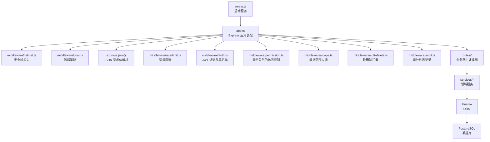
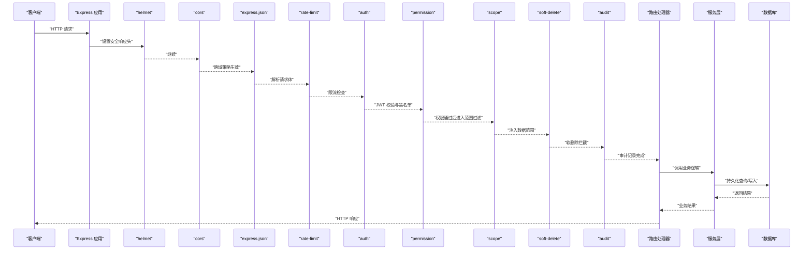
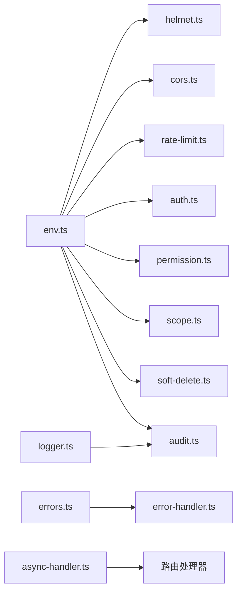
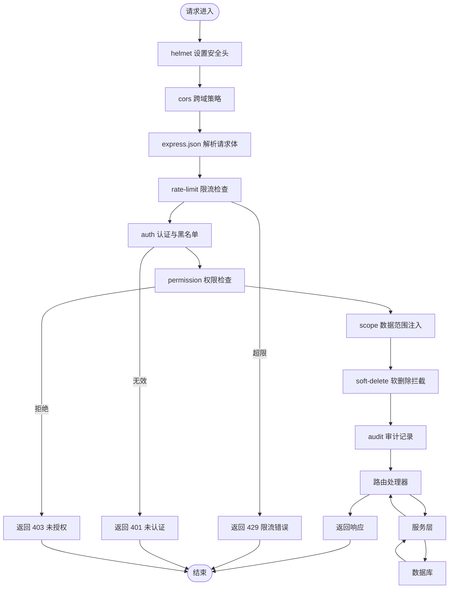

# 中间件执行链

<cite>
**本文引用的文件**   
- [server.ts](file://server/server.ts)
- [app.ts](file://server/src/app.ts)
- [helmet.ts](file://server/src/middleware/helmet.ts)
- [cors.ts](file://server/src/middleware/cors.ts)
- [rate-limit.ts](file://server/src/middleware/rate-limit.ts)
- [auth.ts](file://server/src/middleware/auth.ts)
- [permission.ts](file://server/src/middleware/permission.ts)
- [scope.ts](file://server/src/middleware/scope.ts)
- [soft-delete.ts](file://server/src/middleware/soft-delete.ts)
- [audit.ts](file://server/src/middleware/audit.ts)
- [error-handler.ts](file://server/src/middleware/error-handler.ts)
- [env.ts](file://server/src/config/env.ts)
- [async-handler.ts](file://server/src/lib/async-handler.ts)
- [errors.ts](file://server/src/lib/errors.ts)
- [logger.ts](file://server/src/lib/logger.ts)
</cite>

## 目录
1. [简介](#简介)
2. [项目结构](#项目结构)
3. [核心组件](#核心组件)
4. [架构总览](#架构总览)
5. [详细组件分析](#详细组件分析)
6. [依赖关系分析](#依赖关系分析)
7. [性能考量](#性能考量)
8. [故障排查指南](#故障排查指南)
9. [结论](#结论)
10. [附录](#附录)

## 简介
本文件系统化梳理 FY200 后端 Express 中间件执行链，围绕“安全头 → 跨域 → JSON 解析 → 限流 → 认证 → 权限 → 数据范围 → 软删除 → 审计”的链路展开。文档面向不同技术背景的读者，既提供高层流程与概念说明，也给出代码级实现要点、错误处理机制、调试方法与性能优化建议，并附带常见问题的解决方案。

## 项目结构
FY200 后端采用 Express 应用组织方式：
- 应用入口与中间件注册集中在应用层（app.ts）与服务启动（server.ts）。
- 中间件按职责拆分在 middleware 目录下，每个中间件独立文件，便于组合与测试。
- 配置与环境变量通过 config/env.ts 集中管理。
- 通用工具与错误类型定义位于 lib 目录。

图表来源
- [server.ts](file://server/server.ts)
- [app.ts](file://server/src/app.ts)
- [helmet.ts](file://server/src/middleware/helmet.ts)
- [cors.ts](file://server/src/middleware/cors.ts)
- [rate-limit.ts](file://server/src/middleware/rate-limit.ts)
- [auth.ts](file://server/src/middleware/auth.ts)
- [permission.ts](file://server/src/middleware/permission.ts)
- [scope.ts](file://server/src/middleware/scope.ts)
- [soft-delete.ts](file://server/src/middleware/soft-delete.ts)
- [audit.ts](file://server/src/middleware/audit.ts)

章节来源
- [server.ts](file://server/server.ts)
- [app.ts](file://server/src/app.ts)

## 核心组件
本节聚焦中间件链中的关键组件及其职责边界：
- helmet：设置安全相关的 HTTP 响应头，降低常见 Web 攻击面。
- cors：根据环境配置允许跨域请求，支持预检与凭据策略。
- express.json：解析 application/json 的请求体为 req.body。
- rate-limit：对客户端 IP 或用户维度进行速率限制，防止滥用。
- auth：校验 JWT 令牌有效性，结合黑名单拒绝已注销或异常会话。
- permission：默认拒绝，显式授权后放行，确保最小权限原则。
- scope：基于 Prisma extension 注入数据范围过滤条件。
- softDelete：拦截删除类操作，将物理删除转为状态标记更新。
- audit：统一记录关键操作的审计日志，便于追溯与合规。

章节来源
- [helmet.ts](file://server/src/middleware/helmet.ts)
- [cors.ts](file://server/src/middleware/cors.ts)
- [rate-limit.ts](file://server/src/middleware/rate-limit.ts)
- [auth.ts](file://server/src/middleware/auth.ts)
- [permission.ts](file://server/src/middleware/permission.ts)
- [scope.ts](file://server/src/middleware/scope.ts)
- [soft-delete.ts](file://server/src/middleware/soft-delete.ts)
- [audit.ts](file://server/src/middleware/audit.ts)

## 架构总览
下图展示一次典型请求从进入 Express 到返回响应的完整路径，体现中间件的顺序与职责分工。

图表来源
- [app.ts](file://server/src/app.ts)
- [helmet.ts](file://server/src/middleware/helmet.ts)
- [cors.ts](file://server/src/middleware/cors.ts)
- [rate-limit.ts](file://server/src/middleware/rate-limit.ts)
- [auth.ts](file://server/src/middleware/auth.ts)
- [permission.ts](file://server/src/middleware/permission.ts)
- [scope.ts](file://server/src/middleware/scope.ts)
- [soft-delete.ts](file://server/src/middleware/soft-delete.ts)
- [audit.ts](file://server/src/middleware/audit.ts)

## 详细组件分析

### helmet：安全响应头
- 作用：为所有响应添加安全相关头部（如 X-Content-Type-Options、X-Frame-Options、Strict-Transport-Security 等），减少 XSS、点击劫持等风险。
- 配置：通常由环境变量控制是否启用严格模式、HSTS 时长等。
- 错误处理：一般不抛出业务错误；若配置不当可能影响浏览器兼容性，需通过日志与监控观察。
- 执行时机：最早阶段，确保后续中间件与路由产生的响应均受保护。

章节来源
- [helmet.ts](file://server/src/middleware/helmet.ts)
- [env.ts](file://server/src/config/env.ts)

### cors：跨域处理
- 作用：根据 origin、方法、头、凭据等策略允许跨域请求，处理 OPTIONS 预检。
- 配置：白名单域名、是否允许凭据、允许的头部与方法。
- 错误处理：不符合策略的请求直接拒绝，避免非法来源访问。
- 执行时机：紧随 helmet，确保跨域策略在请求体解析前生效。

章节来源
- [cors.ts](file://server/src/middleware/cors.ts)
- [env.ts](file://server/src/config/env.ts)

### express.json：请求体解析
- 作用：将 application/json 的请求体解析为 JavaScript 对象，挂载到 req.body。
- 配置：大小限制、严格模式、类型转换等。
- 错误处理：格式错误或过大时返回 400/413，避免下游解析失败。
- 执行时机：在限流之前，以便限流器可读取请求体元信息（如需）。

章节来源
- [app.ts](file://server/src/app.ts)

### rate-limit：请求限流
- 作用：限制单位时间内请求次数，支持按 IP、用户或接口维度。
- 配置：窗口时间、最大请求数、存储后端（内存/Redis）、自定义键生成。
- 错误处理：超过阈值返回 429，并附带重试提示。
- 执行时机：在认证之前，减轻未认证请求压力。

章节来源
- [rate-limit.ts](file://server/src/middleware/rate-limit.ts)
- [env.ts](file://server/src/config/env.ts)

### auth：认证（JWT + 黑名单）
- 作用：校验 JWT 令牌的有效性（签名、过期），并结合黑名单拒绝失效或异常会话。
- 配置：密钥、算法、令牌位置（Header/Cookie）、黑名单存储。
- 错误处理：令牌无效或缺失返回 401；黑名单命中返回 403。
- 执行时机：在权限检查之前，确保后续逻辑具备可信身份上下文。

章节来源
- [auth.ts](file://server/src/middleware/auth.ts)
- [env.ts](file://server/src/config/env.ts)

### permission：权限（默认拒绝）
- 作用：基于角色或资源粒度进行访问控制，默认拒绝，显式授权放行。
- 配置：角色映射、资源规则、动态策略函数。
- 错误处理：未授权返回 403，并记录审计事件。
- 执行时机：在数据范围之前，确保仅合法用户进入具体数据过滤。

章节来源
- [permission.ts](file://server/src/middleware/permission.ts)

### scope：数据范围（Prisma extension）
- 作用：通过 Prisma extension 注入 where 条件，限制当前用户可见的数据集合。
- 配置：范围规则（公司、部门、项目等），扩展钩子。
- 错误处理：范围计算失败应回退为最小集合并记录告警。
- 执行时机：在软删除与审计之前，确保后续操作均在限定范围内。

章节来源
- [scope.ts](file://server/src/middleware/scope.ts)

### softDelete：软删除
- 作用：拦截删除类操作，将物理删除改为状态标记更新，保留历史数据。
- 配置：字段名、默认值、覆盖策略。
- 错误处理：非删除操作忽略；删除失败回滚并记录错误。
- 执行时机：在审计之前，确保删除行为被记录。

章节来源
- [soft-delete.ts](file://server/src/middleware/soft-delete.ts)

### audit：审计
- 作用：统一记录关键操作的审计日志（谁、何时、做了什么、影响范围）。
- 配置：敏感字段脱敏、日志级别、存储目标。
- 错误处理：异步记录，失败不影响主流程但需告警。
- 执行时机：在业务逻辑之前或之后均可，推荐在路由处理器前后包裹。

章节来源
- [audit.ts](file://server/src/middleware/audit.ts)

### 错误处理：error-handler
- 作用：集中捕获未处理异常，统一返回结构化错误响应。
- 配置：开发/生产模式差异、堆栈输出控制。
- 错误处理：区分业务错误与系统错误，避免泄露敏感信息。
- 执行时机：作为最后一个中间件，确保所有上游错误都能被捕获。

章节来源
- [error-handler.ts](file://server/src/middleware/error-handler.ts)
- [errors.ts](file://server/src/lib/errors.ts)

## 依赖关系分析
中间件之间的依赖与耦合度较低，主要通过 Express 的 next() 串联。关键依赖包括：
- 配置依赖 env.ts 的环境变量。
- 认证依赖 JWT 库与黑名单存储。
- 范围依赖 Prisma extension API。
- 审计依赖日志与存储后端。

图表来源
- [env.ts](file://server/src/config/env.ts)
- [helmet.ts](file://server/src/middleware/helmet.ts)
- [cors.ts](file://server/src/middleware/cors.ts)
- [rate-limit.ts](file://server/src/middleware/rate-limit.ts)
- [auth.ts](file://server/src/middleware/auth.ts)
- [permission.ts](file://server/src/middleware/permission.ts)
- [scope.ts](file://server/src/middleware/scope.ts)
- [soft-delete.ts](file://server/src/middleware/soft-delete.ts)
- [audit.ts](file://server/src/middleware/audit.ts)
- [error-handler.ts](file://server/src/middleware/error-handler.ts)
- [errors.ts](file://server/src/lib/errors.ts)
- [logger.ts](file://server/src/lib/logger.ts)
- [async-handler.ts](file://server/src/lib/async-handler.ts)

章节来源
- [app.ts](file://server/src/app.ts)

## 性能考量
- 中间件顺序优化：将无状态、快速判断的中间件（如 helmet、cors、rate-limit）前置，减少不必要的 CPU 与 I/O。
- 限流策略：优先使用内存缓存用于本地限流，分布式场景引入 Redis 共享计数。
- 认证开销：JWT 校验尽量轻量，黑名单查询走缓存或索引优化。
- 范围过滤：Prisma extension 的 where 条件应利用数据库索引，避免全表扫描。
- 审计记录：异步落盘，避免阻塞主流程；批量写入提升吞吐。
- 错误处理：尽早返回错误，减少后续中间件执行成本。

[本节为通用指导，无需特定文件引用]

## 故障排查指南
- 跨域失败：检查 cors 配置与前端请求头，确认 origin 白名单与凭据策略。
- 限流触发：查看 rate-limit 统计与阈值，必要时放宽或增加实例。
- 认证失败：核对 JWT 签发与验证参数，检查黑名单存储一致性。
- 权限拒绝：确认 permission 规则与用户角色映射是否正确。
- 数据为空：检查 scope 注入的 where 条件是否过严。
- 删除无效：确认 soft-delete 字段与默认值配置。
- 审计缺失：检查审计中间件是否挂载及异步写入是否成功。
- 错误响应不规范：确认 error-handler 是否最后挂载且正确格式化。

章节来源
- [cors.ts](file://server/src/middleware/cors.ts)
- [rate-limit.ts](file://server/src/middleware/rate-limit.ts)
- [auth.ts](file://server/src/middleware/auth.ts)
- [permission.ts](file://server/src/middleware/permission.ts)
- [scope.ts](file://server/src/middleware/scope.ts)
- [soft-delete.ts](file://server/src/middleware/soft-delete.ts)
- [audit.ts](file://server/src/middleware/audit.ts)
- [error-handler.ts](file://server/src/middleware/error-handler.ts)

## 结论
FY200 后端的中间件执行链以清晰的分层与职责分离为核心，遵循“安全优先、最小权限、可观测性”的设计原则。通过合理的顺序与配置，既能保障安全性与稳定性，又能兼顾性能与可维护性。建议在新增功能时遵循现有模式，保持中间件链的一致性与可测试性。

[本节为总结，无需特定文件引用]

## 附录

### 请求处理流程图（含错误分支）

图表来源
- [app.ts](file://server/src/app.ts)
- [helmet.ts](file://server/src/middleware/helmet.ts)
- [cors.ts](file://server/src/middleware/cors.ts)
- [rate-limit.ts](file://server/src/middleware/rate-limit.ts)
- [auth.ts](file://server/src/middleware/auth.ts)
- [permission.ts](file://server/src/middleware/permission.ts)
- [scope.ts](file://server/src/middleware/scope.ts)
- [soft-delete.ts](file://server/src/middleware/soft-delete.ts)
- [audit.ts](file://server/src/middleware/audit.ts)

### 自定义中间件开发指南
- 命名与职责：单一职责，文件名与功能一致，便于组合与测试。
- 参数与配置：通过闭包接收配置对象，支持环境变量注入。
- 错误处理：明确返回状态码与消息，避免吞掉异常。
- 性能考虑：避免阻塞 I/O，必要时异步处理。
- 可观测性：记录关键指标与审计事件，便于追踪问题。
- 测试覆盖：单元测试覆盖正常与异常路径，集成测试验证链路。

[本节为通用指导，无需特定文件引用]