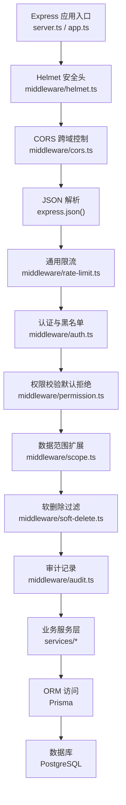
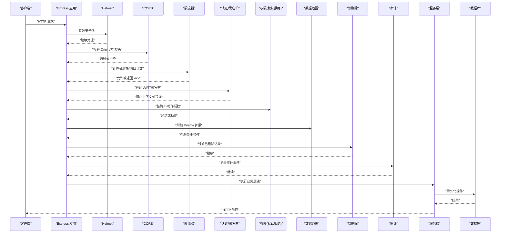

# 安全中间件

<cite>
**本文引用的文件**   
- [server.ts](file://server/server.ts)
- [app.ts](file://server/src/app.ts)
- [helmet.ts](file://server/src/middleware/helmet.ts)
- [cors.ts](file://server/src/middleware/cors.ts)
- [rate-limit.ts](file://server/src/middleware/rate-limit.ts)
- [ai-rate-limit.ts](file://server/src/middleware/ai-rate-limit.ts)
- [auth.ts](file://server/src/middleware/auth.ts)
- [permission.ts](file://server/src/middleware/permission.ts)
- [scope.ts](file://server/src/middleware/scope.ts)
- [soft-delete.ts](file://server/src/middleware/soft-delete.ts)
- [audit.ts](file://server/src/middleware/audit.ts)
- [error-handler.ts](file://server/src/middleware/error-handler.ts)
- [trace-id.ts](file://server/src/middleware/trace-id.ts)
- [env.ts](file://server/src/config/env.ts)
- [express.d.ts](file://server/src/types/express.d.ts)
</cite>

## 目录
1. [简介](#简介)
2. [项目结构](#项目结构)
3. [核心组件](#核心组件)
4. [架构总览](#架构总览)
5. [详细组件分析](#详细组件分析)
6. [依赖关系分析](#依赖关系分析)
7. [性能考量](#性能考量)
8. [故障排查指南](#故障排查指南)
9. [结论](#结论)
10. [附录](#附录)

## 简介
本文件聚焦 FY200 后端安全中间件，围绕 Helmet 安全头、CORS 跨域与 Rate-Limit 限流三大核心能力展开，结合项目既定的中间件执行链顺序，系统阐述配置项、默认策略、自定义规则与错误处理。文档同时给出 HTTP 安全头设置、跨域白名单管理、API 限流算法与优化建议，并总结安全最佳实践与常见威胁防护方案。

## 项目结构
FY200 后端采用 Express 应用，中间件按固定顺序挂载：helmet → cors → express.json → rate-limit → auth → permission → scope → softDelete → audit → Service → Prisma → PostgreSQL。该顺序确保在业务逻辑之前完成安全加固、鉴权与审计。

图表来源
- [server.ts](file://server/server.ts)
- [app.ts](file://server/src/app.ts)
- [helmet.ts](file://server/src/middleware/helmet.ts)
- [cors.ts](file://server/src/middleware/cors.ts)
- [rate-limit.ts](file://server/src/middleware/rate-limit.ts)
- [auth.ts](file://server/src/middleware/auth.ts)
- [permission.ts](file://server/src/middleware/permission.ts)
- [scope.ts](file://server/src/middleware/scope.ts)
- [soft-delete.ts](file://server/src/middleware/soft-delete.ts)
- [audit.ts](file://server/src/middleware/audit.ts)

章节来源
- [server.ts](file://server/server.ts)
- [app.ts](file://server/src/app.ts)

## 核心组件
- Helmet 安全头：统一设置响应安全相关头部，降低常见 Web 攻击面。
- CORS 跨域：基于白名单的源控制，支持预检请求与凭据传递。
- Rate-Limit 限流：通用 API 限流与 AI 专用限流，分别针对接口与资源维度进行速率控制。
- 辅助中间件：认证、权限、数据范围、软删除、审计、错误处理与追踪 ID。

章节来源
- [helmet.ts](file://server/src/middleware/helmet.ts)
- [cors.ts](file://server/src/middleware/cors.ts)
- [rate-limit.ts](file://server/src/middleware/rate-limit.ts)
- [ai-rate-limit.ts](file://server/src/middleware/ai-rate-limit.ts)
- [auth.ts](file://server/src/middleware/auth.ts)
- [permission.ts](file://server/src/middleware/permission.ts)
- [scope.ts](file://server/src/middleware/scope.ts)
- [soft-delete.ts](file://server/src/middleware/soft-delete.ts)
- [audit.ts](file://server/src/middleware/audit.ts)
- [error-handler.ts](file://server/src/middleware/error-handler.ts)
- [trace-id.ts](file://server/src/middleware/trace-id.ts)

## 架构总览
下图展示一次典型请求在安全中间件链中的流转过程，包括安全头注入、跨域校验、限流判定、认证授权与审计记录。

图表来源
- [app.ts](file://server/src/app.ts)
- [helmet.ts](file://server/src/middleware/helmet.ts)
- [cors.ts](file://server/src/middleware/cors.ts)
- [rate-limit.ts](file://server/src/middleware/rate-limit.ts)
- [ai-rate-limit.ts](file://server/src/middleware/ai-rate-limit.ts)
- [auth.ts](file://server/src/middleware/auth.ts)
- [permission.ts](file://server/src/middleware/permission.ts)
- [scope.ts](file://server/src/middleware/scope.ts)
- [soft-delete.ts](file://server/src/middleware/soft-delete.ts)
- [audit.ts](file://server/src/middleware/audit.ts)

## 详细组件分析

### Helmet 安全头
- 作用：为所有响应注入安全相关的 HTTP 头部，减少 XSS、点击劫持、MIME 嗅探等风险。
- 关键配置项（示例性说明）：
  - 内容安全策略 CSP：限制脚本、样式、媒体等资源加载来源。
  - 强制 HTTPS：启用 Strict-Transport-Security。
  - X-Frame-Options/X-Content-Type-Options：防止点击劫持与 MIME 类型混淆。
  - Referrer-Policy/Cookie/SameSite：控制引用信息与 Cookie 行为。
- 默认策略：遵循最小暴露原则，关闭不必要的调试信息，严格限制可执行资源来源。
- 自定义规则：可按环境覆盖 CSP 白名单、是否允许内联脚本、是否允许特定第三方域名。
- 错误处理：若配置不合法，应在启动阶段抛出明确错误；运行时不拦截业务响应，仅追加头部。

章节来源
- [helmet.ts](file://server/src/middleware/helmet.ts)

### CORS 跨域处理
- 作用：控制浏览器跨域请求的来源、方法与头部，保障前后端分离场景下的安全通信。
- 关键配置项：
  - 允许的源白名单：精确匹配或正则匹配，避免使用通配符。
  - 允许的请求方法与头部：仅开放必要集合。
  - 凭据支持：当需要携带 Cookie 时，必须显式开启且不能使用通配符源。
  - 预检缓存：合理设置 Access-Control-Max-Age 以降低重复预检开销。
- 默认策略：默认拒绝所有跨域，仅在白名单命中后放行。
- 自定义规则：按环境区分白名单，敏感接口禁用凭据，动态更新白名单需考虑缓存失效。
- 错误处理：未命中白名单直接返回 403；预检失败返回明确的 4xx 状态码。

章节来源
- [cors.ts](file://server/src/middleware/cors.ts)

### Rate-Limit 通用限流
- 作用：对 API 接口进行速率限制，抵御暴力破解、爬虫与资源耗尽攻击。
- 算法实现要点：
  - 滑动窗口或固定窗口计数：统计单位时间内的请求数。
  - 令牌桶/漏桶：平滑突发流量，保证长期稳定吞吐。
  - 键值维度：按 IP、用户 ID、API Key 或组合键隔离限流。
- 关键配置项：
  - 窗口大小与最大请求数：根据业务峰值与容错能力设定。
  - 存储后端：内存（开发）、Redis（生产），保证分布式一致性。
  - 响应策略：返回 429 并附带重试 After-Retry-After 头。
- 默认策略：对写操作更严格，读操作适度放宽；对高频接口单独降速。
- 自定义规则：按路由或路径前缀差异化限流；对认证失败的请求不计入配额。
- 错误处理：达到阈值立即拒绝并记录审计日志；存储不可用时降级为宽松策略并告警。

章节来源
- [rate-limit.ts](file://server/src/middleware/rate-limit.ts)

### AI 专用限流
- 作用：针对 AI 管道（polish/analyze）的高成本调用进行精细化限流，保护外部 LLM 与内部计算资源。
- 算法实现要点：
  - 双通道限流：文本通道与结构化通道分别计数。
  - 资源维度：按模型、租户、用户与接口组合限流。
  - 退避策略：突发时指数退避，避免雪崩。
- 关键配置项：
  - 每通道 QPS/并发上限、冷却时间、熔断阈值。
  - 优先级队列：高优先级请求优先通过，低优先级排队或丢弃。
- 默认策略：保守限制，优先保障稳定性与公平性。
- 自定义规则：按业务线分配配额，支持动态调整与灰度放量。
- 错误处理：超限返回 429 并附带剩余配额信息；下游异常触发熔断与回退。

章节来源
- [ai-rate-limit.ts](file://server/src/middleware/ai-rate-limit.ts)

### 认证与黑名单（JWT）
- 作用：验证访问令牌有效性，维护黑名单以快速吊销会话。
- 关键点：
  - access token 短生命周期（约 15 分钟），refresh token 长生命周期（约 7 天）。
  - 黑名单存储：Redis 或内存，支持过期自动清理。
  - 刷新流程：无感续期，避免频繁登录。
- 错误处理：无效/过期/黑名单命中返回 401 或 403，并记录审计。

章节来源
- [auth.ts](file://server/src/middleware/auth.ts)

### 权限（默认拒绝）
- 作用：基于路由/动作的最小权限模型，默认拒绝所有未显式授权的访问。
- 关键点：
  - 角色与资源映射，支持细粒度到字段级。
  - 与审计联动，记录授权决策。
- 错误处理：未授权返回 403，附带原因与可用动作列表。

章节来源
- [permission.ts](file://server/src/middleware/permission.ts)

### 数据范围（Prisma 扩展）
- 作用：在查询层自动附加数据范围条件，确保多租户与部门隔离。
- 关键点：
  - 通过 Prisma extension 注入 where 条件。
  - 与权限层协同，决定可见范围。
- 错误处理：范围解析失败返回 400，提示参数问题。

章节来源
- [scope.ts](file://server/src/middleware/scope.ts)

### 软删除
- 作用：查询时自动过滤已删除记录，写入时标记删除而非物理删除。
- 关键点：
  - 全局钩子或中间件注入 isDeleted 条件。
  - 恢复与彻底删除的独立接口。
- 错误处理：非法操作返回 400/404。

章节来源
- [soft-delete.ts](file://server/src/middleware/soft-delete.ts)

### 审计
- 作用：记录关键操作的审计事件，便于追溯与合规。
- 关键点：
  - 记录请求元数据、操作主体、目标资源与结果。
  - 异步落库，避免阻塞主链路。
- 错误处理：审计失败不影响业务，但需告警。

章节来源
- [audit.ts](file://server/src/middleware/audit.ts)

### 错误处理与追踪
- 错误处理中间件：统一捕获异常，返回标准化错误体，隐藏堆栈细节。
- 追踪 ID：为每个请求生成 traceId，贯穿日志与审计，便于定位问题。

章节来源
- [error-handler.ts](file://server/src/middleware/error-handler.ts)
- [trace-id.ts](file://server/src/middleware/trace-id.ts)

## 依赖关系分析
安全中间件之间的耦合与协作如下：
- helmet 与 cors 位于最前端，影响所有后续处理的响应头与跨域策略。
- rate-limit 与 ai-rate-limit 依赖共享存储（如 Redis），需保证高可用。
- auth 依赖 JWT 密钥与黑名单存储；permission 依赖角色/资源映射。
- scope 与 soft-delete 依赖 ORM 扩展机制。
- audit 依赖消息队列或异步任务。

图表来源
- [app.ts](file://server/src/app.ts)
- [helmet.ts](file://server/src/middleware/helmet.ts)
- [cors.ts](file://server/src/middleware/cors.ts)
- [rate-limit.ts](file://server/src/middleware/rate-limit.ts)
- [ai-rate-limit.ts](file://server/src/middleware/ai-rate-limit.ts)
- [auth.ts](file://server/src/middleware/auth.ts)
- [permission.ts](file://server/src/middleware/permission.ts)
- [scope.ts](file://server/src/middleware/scope.ts)
- [soft-delete.ts](file://server/src/middleware/soft-delete.ts)
- [audit.ts](file://server/src/middleware/audit.ts)
- [error-handler.ts](file://server/src/middleware/error-handler.ts)
- [trace-id.ts](file://server/src/middleware/trace-id.ts)

章节来源
- [app.ts](file://server/src/app.ts)

## 性能考量
- 限流存储：生产环境使用 Redis 集群，避免单点瓶颈；合理设置连接池与超时。
- 预检缓存：CORS Max-Age 设置为分钟级，减少 OPTIONS 请求。
- 头部注入：Helmet 配置尽量静态化，避免运行时计算。
- 异步审计：审计写入走队列，避免阻塞主线程。
- 指标监控：暴露限流命中率、CORS 拒绝率、认证失败率等关键指标。

[本节为通用指导，不直接分析具体文件]

## 故障排查指南
- 常见问题
  - 跨域被拒：检查 Origin 是否在白名单，是否误用通配符，凭据开关是否正确。
  - 限流触发：确认限流键维度、窗口大小与阈值；查看存储健康状态。
  - 认证失败：核对 JWT 签名、过期时间与黑名单同步。
  - 权限拒绝：检查路由/动作授权配置与角色映射。
- 诊断步骤
  - 查看错误处理中间件的标准化响应体。
  - 通过追踪 ID 串联日志与审计事件。
  - 启用调试模式输出中间件耗时与命中情况。
- 恢复策略
  - 临时放宽限流阈值或添加例外白名单。
  - 快速吊销/恢复黑名单条目。
  - 降级非关键功能（如审计）保障可用性。

章节来源
- [error-handler.ts](file://server/src/middleware/error-handler.ts)
- [trace-id.ts](file://server/src/middleware/trace-id.ts)

## 结论
FY200 后端安全中间件以“最小暴露、默认拒绝、纵深防御”为原则，通过 Helmet、CORS、Rate-Limit 与认证/权限/审计等组件形成完整的安全闭环。建议在部署时严格遵循环境差异配置，持续监控关键指标，定期评审白名单与限流策略，确保系统在安全与性能之间取得平衡。

[本节为总结性内容，不直接分析具体文件]

## 附录
- 环境变量参考：安全相关配置（如跨域白名单、限流阈值、JWT 密钥）应通过配置文件集中管理。
- 类型扩展：Express 请求对象扩展用于承载用户上下文与追踪信息。

章节来源
- [env.ts](file://server/src/config/env.ts)
- [express.d.ts](file://server/src/types/express.d.ts)