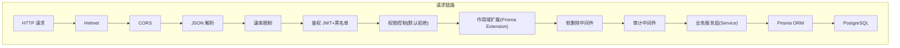
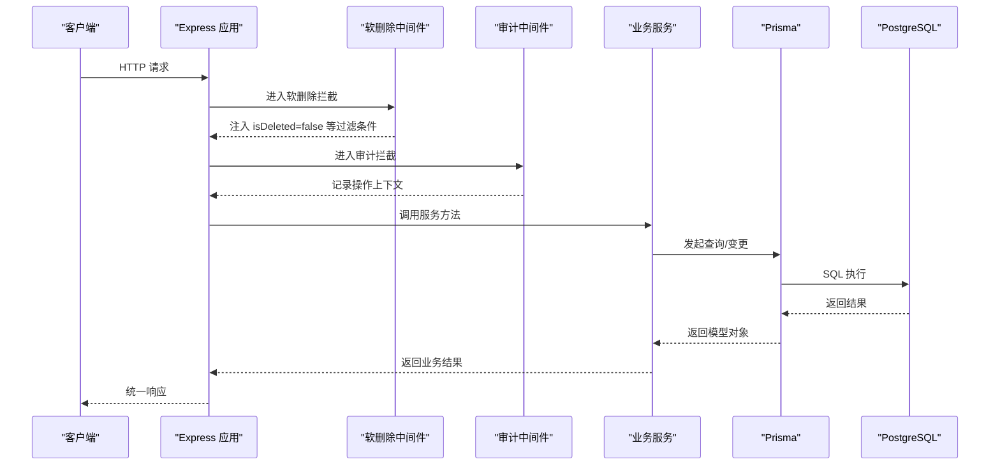
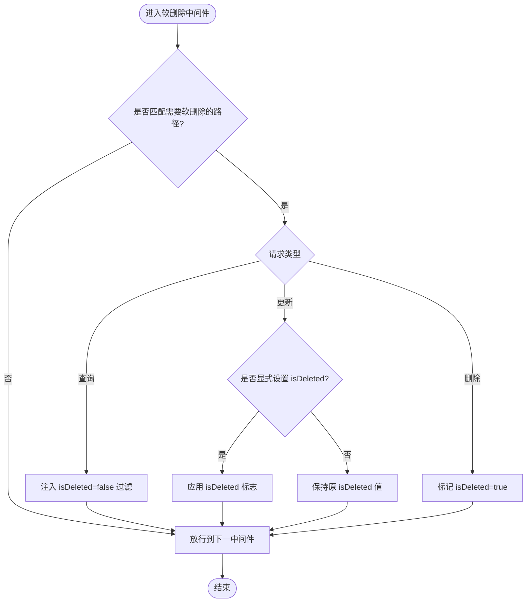
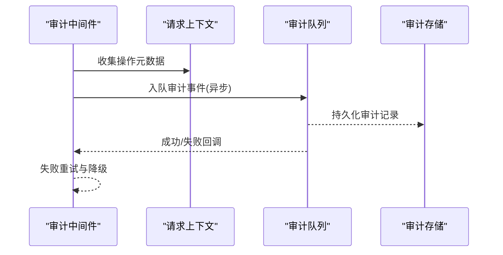
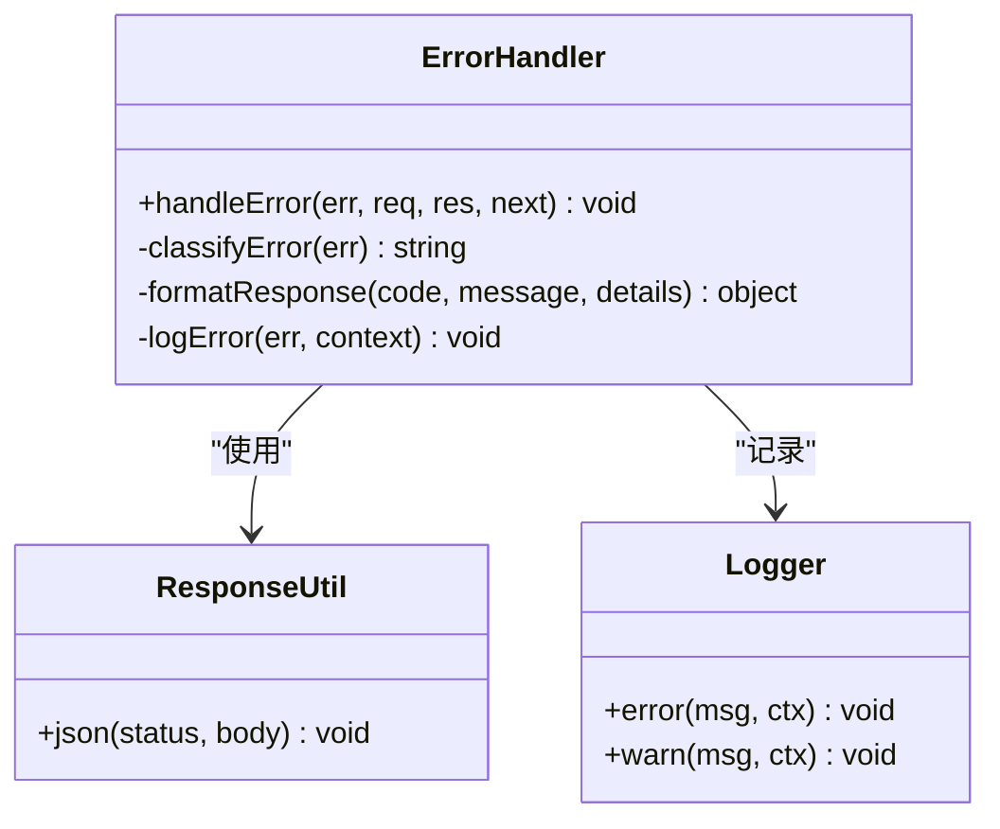
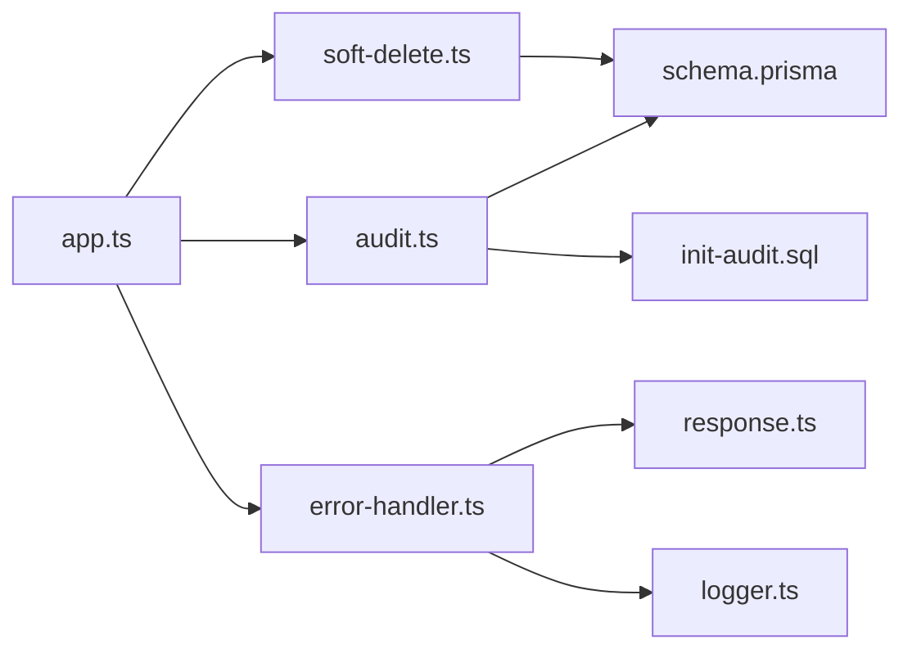

# 数据处理中间件

<cite>
**本文引用的文件**   
- [server/src/middleware/soft-delete.ts](file://server/src/middleware/soft-delete.ts)
- [server/src/middleware/audit.ts](file://server/src/middleware/audit.ts)
- [server/src/middleware/error-handler.ts](file://server/src/middleware/error-handler.ts)
- [server/src/lib/errors.ts](file://server/src/lib/errors.ts)
- [server/src/lib/logger.ts](file://server/src/lib/logger.ts)
- [server/src/lib/response.ts](file://server/src/lib/response.ts)
- [server/src/app.ts](file://server/src/app.ts)
- [server/prisma/schema.prisma](file://server/prisma/schema.prisma)
- [server/prisma/init-audit.sql](file://server/prisma/init-audit.sql)
</cite>

## 目录
1. [简介](#简介)
2. [项目结构](#项目结构)
3. [核心组件](#核心组件)
4. [架构总览](#架构总览)
5. [详细组件分析](#详细组件分析)
6. [依赖关系分析](#依赖关系分析)
7. [性能考虑](#性能考虑)
8. [故障排查指南](#故障排查指南)
9. [结论](#结论)
10. [附录](#附录)

## 简介
本文件聚焦 FY200 后端数据处理中间件，围绕软删除机制、审计日志记录与全局错误处理三大能力进行系统化说明。文档面向开发与运维人员，既提供架构级概览，也深入到中间件实现细节、数据流与控制流、错误分类与统一响应格式、日志规范与监控指标，并给出数据恢复方法与问题定位步骤。

## 项目结构
FY200 后端采用 Express 4 + Prisma 5 + PostgreSQL 15 的技术栈。中间件执行链顺序为：helmet → cors → express.json → rate-limit → auth（JWT+黑名单）→ permission（默认拒绝）→ scope（Prisma extension）→ softDelete → audit → Service → Prisma → PostgreSQL。软删除、审计与错误处理分别由独立中间件承担职责，并通过统一的错误与响应库保持一致性。

图表来源
- [server/src/app.ts](file://server/src/app.ts)

章节来源
- [server/src/app.ts](file://server/src/app.ts)

## 核心组件
- 软删除中间件：在查询与更新路径上注入逻辑删除条件，确保已删除数据不可见；对删除操作按策略标记而非物理删除。
- 审计中间件：捕获关键数据变更事件，记录操作人、动作类型、目标实体、变更摘要等，写入审计表或外部系统。
- 全局错误处理中间件：统一捕获异常，分类输出标准错误响应，避免堆栈泄露，同时记录结构化错误日志。

章节来源
- [server/src/middleware/soft-delete.ts](file://server/src/middleware/soft-delete.ts)
- [server/src/middleware/audit.ts](file://server/src/middleware/audit.ts)
- [server/src/middleware/error-handler.ts](file://server/src/middleware/error-handler.ts)
- [server/src/lib/errors.ts](file://server/src/lib/errors.ts)
- [server/src/lib/response.ts](file://server/src/lib/response.ts)

## 架构总览
下图展示了从请求进入至数据库落盘的关键阶段，以及软删除、审计与错误处理的介入点。

图表来源
- [server/src/app.ts](file://server/src/app.ts)
- [server/src/middleware/soft-delete.ts](file://server/src/middleware/soft-delete.ts)
- [server/src/middleware/audit.ts](file://server/src/middleware/audit.ts)

## 详细组件分析

### 软删除中间件（softDelete）
- 设计目标
  - 保证所有读/写路径对“已删除”数据透明屏蔽，避免业务侧重复注入过滤条件。
  - 支持按资源维度配置是否启用软删除，便于灰度与差异化治理。
- 行为规则
  - 查询类操作自动附加 isDeleted=false 条件，确保不返回已删除记录。
  - 更新类操作在命中主键时，若未显式指定 isDeleted，则保持原值；若显式设置为 true，则走逻辑删除流程。
  - 删除类操作将 isDeleted 置为 true，并保留原始数据用于审计与恢复。
- 数据一致性
  - 与 Prisma 扩展协作，确保事务内过滤一致。
  - 对批量操作需逐条判断，避免误删非目标记录。
- 边界与例外
  - 管理后台的“彻底删除”入口应绕过软删除中间件，通过受控 API 直接物理清理。
  - 历史报表与归档查询可关闭过滤以读取已删除数据。

图表来源
- [server/src/middleware/soft-delete.ts](file://server/src/middleware/soft-delete.ts)

章节来源
- [server/src/middleware/soft-delete.ts](file://server/src/middleware/soft-delete.ts)

### 审计中间件（audit）
- 设计目标
  - 对关键数据变更进行可追溯记录，满足合规与排障需求。
  - 统一审计字段与格式，便于集中采集与分析。
- 记录内容
  - 操作时间、操作人（来自鉴权上下文）、IP、请求ID、HTTP 方法、路由、状态码。
  - 操作类型（创建/更新/删除/导入/导出等）、目标实体与主键、变更摘要（脱敏后）。
- 写入策略
  - 异步写入，避免阻塞主链路。
  - 失败重试与降级：本地队列暂存，失败时回退到静默丢弃并告警。
- 安全与隐私
  - 敏感字段脱敏后再入审计，遵循最小可见原则。
  - 审计表与日志分离存储，访问权限隔离。

图表来源
- [server/src/middleware/audit.ts](file://server/src/middleware/audit.ts)
- [server/prisma/init-audit.sql](file://server/prisma/init-audit.sql)

章节来源
- [server/src/middleware/audit.ts](file://server/src/middleware/audit.ts)
- [server/prisma/init-audit.sql](file://server/prisma/init-audit.sql)

### 全局错误处理中间件（error-handler）
- 设计目标
  - 统一错误响应格式，避免堆栈泄露。
  - 区分业务错误、参数校验错误、系统异常等类别，输出不同状态码与消息。
- 错误分类
  - 参数错误：400，提示具体字段与原因。
  - 认证/授权错误：401/403，提示登录或权限不足。
  - 业务错误：4xx/5xx，携带可读消息与追踪ID。
  - 未知异常：500，仅暴露通用消息，内部记录完整堆栈。
- 响应格式
  - 包含 code、message、traceId、timestamp、details（可选）等字段。
- 日志与监控
  - 结构化日志记录错误上下文与堆栈。
  - 上报关键指标（错误率、P95/P99 延迟、Top 错误）。

图表来源
- [server/src/middleware/error-handler.ts](file://server/src/middleware/error-handler.ts)
- [server/src/lib/response.ts](file://server/src/lib/response.ts)
- [server/src/lib/logger.ts](file://server/src/lib/logger.ts)

章节来源
- [server/src/middleware/error-handler.ts](file://server/src/middleware/error-handler.ts)
- [server/src/lib/errors.ts](file://server/src/lib/errors.ts)
- [server/src/lib/response.ts](file://server/src/lib/response.ts)
- [server/src/lib/logger.ts](file://server/src/lib/logger.ts)

## 依赖关系分析
- 中间件耦合
  - softDelete 依赖 Prisma 扩展与路由白名单，避免对无关接口生效。
  - audit 依赖鉴权上下文与异步队列，强依赖审计表结构与写入通道。
  - error-handler 依赖 response 与 logger，统一输出与记录。
- 外部依赖
  - Prisma 与 PostgreSQL：软删除字段与审计表结构。
  - 日志与监控：结构化日志与指标上报。

图表来源
- [server/src/middleware/soft-delete.ts](file://server/src/middleware/soft-delete.ts)
- [server/src/middleware/audit.ts](file://server/src/middleware/audit.ts)
- [server/src/middleware/error-handler.ts](file://server/src/middleware/error-handler.ts)
- [server/src/lib/response.ts](file://server/src/lib/response.ts)
- [server/src/lib/logger.ts](file://server/src/lib/logger.ts)
- [server/prisma/schema.prisma](file://server/prisma/schema.prisma)
- [server/prisma/init-audit.sql](file://server/prisma/init-audit.sql)
- [server/src/app.ts](file://server/src/app.ts)

章节来源
- [server/src/app.ts](file://server/src/app.ts)
- [server/prisma/schema.prisma](file://server/prisma/schema.prisma)
- [server/prisma/init-audit.sql](file://server/prisma/init-audit.sql)

## 性能考虑
- 软删除
  - 通过索引优化 isDeleted 字段，提升过滤查询性能。
  - 批量操作分批提交，避免长事务锁竞争。
- 审计
  - 异步写入，限流与背压保护，防止雪崩。
  - 审计记录压缩与合并，降低 I/O 压力。
- 错误处理
  - 快速失败与短路，减少不必要的日志与序列化开销。
  - 错误采样与采样率动态调整，平衡观测性与性能。

[本节为通用指导，无需引用具体文件]

## 故障排查指南
- 软删除相关问题
  - 现象：数据仍可见或无法恢复。
  - 排查：检查路由白名单与过滤注入逻辑；确认 isDeleted 字段与索引；验证事务内一致性。
  - 恢复：通过管理接口执行“恢复已删除”，将 isDeleted 置为 false；必要时从备份恢复。
- 审计缺失或异常
  - 现象：审计记录不完整或丢失。
  - 排查：检查审计队列消费情况与写入通道；确认脱敏规则与字段映射；查看降级与重试日志。
  - 修复：补发审计事件；扩容队列消费者；修复脱敏映射。
- 错误响应不一致
  - 现象：前端无法解析错误结构。
  - 排查：确认 error-handler 注册位置与顺序；检查自定义错误类型是否被正确分类；核对响应字段。
  - 修复：统一错误枚举与响应模板；补充单元测试覆盖。

章节来源
- [server/src/middleware/soft-delete.ts](file://server/src/middleware/soft-delete.ts)
- [server/src/middleware/audit.ts](file://server/src/middleware/audit.ts)
- [server/src/middleware/error-handler.ts](file://server/src/middleware/error-handler.ts)
- [server/src/lib/errors.ts](file://server/src/lib/errors.ts)
- [server/src/lib/response.ts](file://server/src/lib/response.ts)
- [server/src/lib/logger.ts](file://server/src/lib/logger.ts)

## 结论
软删除、审计与全局错误处理构成了 FY200 后端数据处理的三大基石。通过中间件化的解耦设计，系统在安全性、可追溯性与稳定性方面得到显著提升。建议在生产环境持续完善索引与监控，结合审计与错误日志形成闭环排障体系。

[本节为总结性内容，无需引用具体文件]

## 附录
- 数据恢复方法
  - 逻辑恢复：通过受控接口将 isDeleted 重置为 false，并记录审计事件。
  - 物理恢复：仅在极端情况下使用，需审批与双人复核，保留完整审计轨迹。
- 日志格式规范
  - 关键字段：traceId、level、msg、ctx、stack（仅错误）、ts。
  - 脱敏策略：金额区间化、公司名映射、手机号/邮箱掩码。
- 监控指标
  - 错误率、P95/P99 延迟、审计写入耗时、队列积压、软删除命中率。

[本节为通用指导，无需引用具体文件]