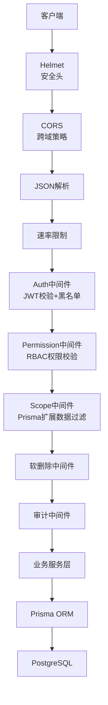
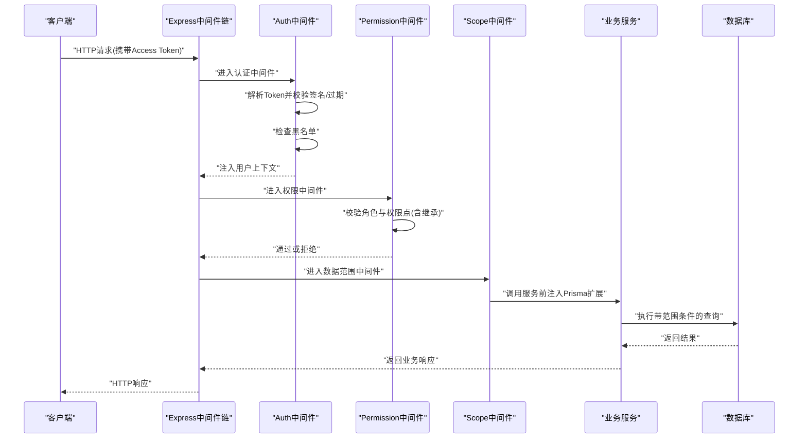
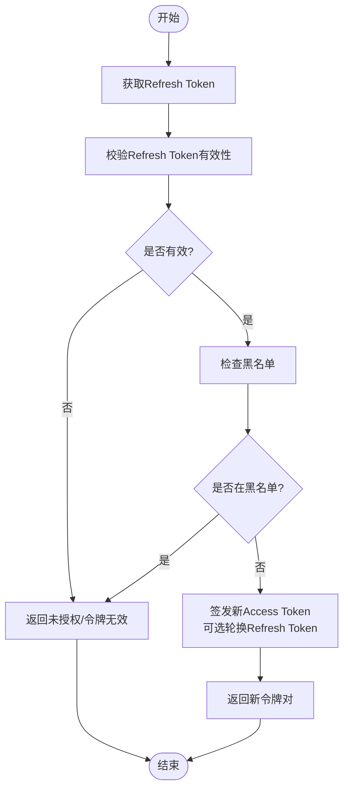
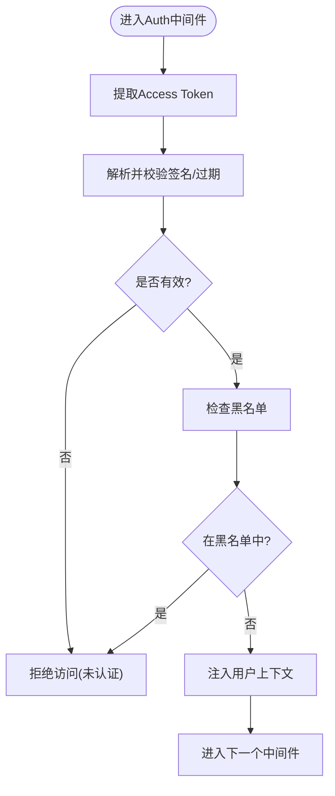
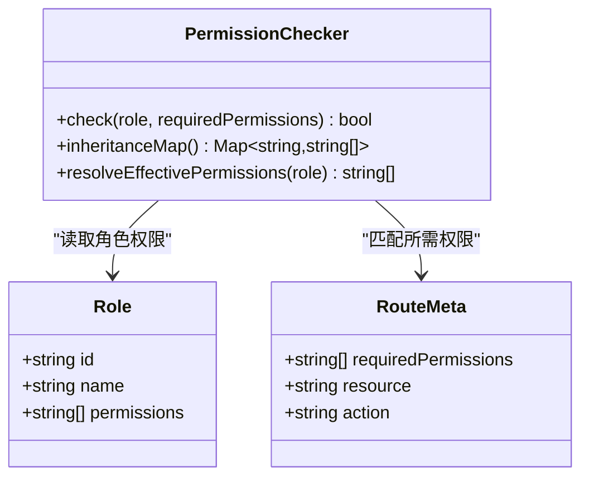
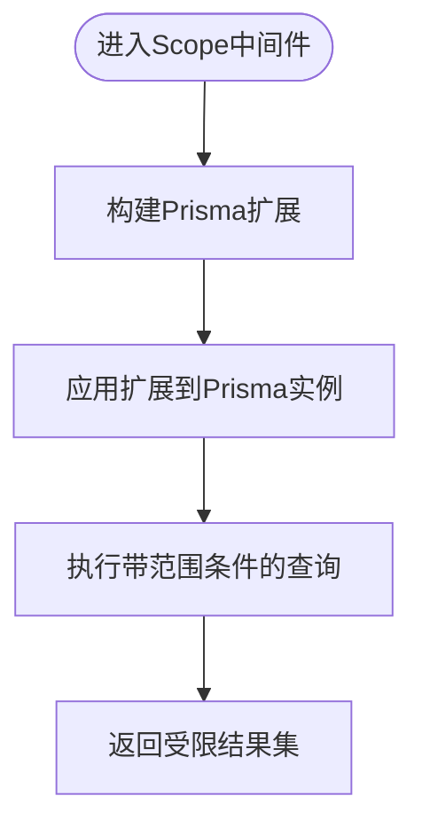
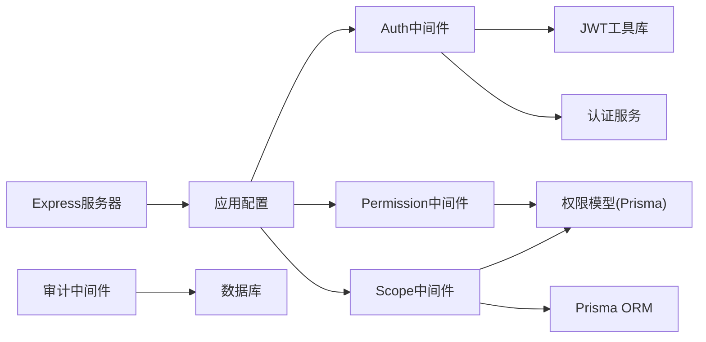

# 认证授权中间件

<cite>
**本文引用的文件**   
- [server.ts](file://server/src/server.ts)
- [app.ts](file://server/src/app.ts)
- [auth.ts](file://server/src/middleware/auth.ts)
- [permission.ts](file://server/src/middleware/permission.ts)
- [scope.ts](file://server/src/middleware/scope.ts)
- [jwt.ts](file://server/src/lib/jwt.ts)
- [AuthService.ts](file://server/src/services/AuthService.ts)
- [schema.prisma](file://server/prisma/schema.prisma)
- [env.ts](file://server/src/config/env.ts)
- [error-handler.ts](file://server/src/middleware/error-handler.ts)
- [audit.ts](file://server/src/middleware/audit.ts)
- [soft-delete.ts](file://server/src/middleware/soft-delete.ts)
- [rate-limit.ts](file://server/src/middleware/rate-limit.ts)
- [cors.ts](file://server/src/middleware/cors.ts)
- [helmet.ts](file://server/src/middleware/helmet.ts)
- [routes/auth.ts](file://server/src/routes/auth.ts)
</cite>

## 目录
1. [简介](#简介)
2. [项目结构](#项目结构)
3. [核心组件](#核心组件)
4. [架构总览](#架构总览)
5. [详细组件分析](#详细组件分析)
6. [依赖关系分析](#依赖关系分析)
7. [性能考量](#性能考量)
8. [故障排查指南](#故障排查指南)
9. [结论](#结论)
10. [附录](#附录)

## 简介
本文件面向FY200后端认证与授权中间件的实现，系统性阐述JWT双令牌机制（access token 15分钟 + refresh token 7天轮转）、RBAC权限模型与数据范围控制（Prisma扩展）的完整流程。文档覆盖：
- auth中间件：token校验、黑名单检查、用户上下文注入
- permission中间件：基于角色的访问控制与权限继承
- scope中间件：基于Prisma extension的数据隔离与过滤
- 安全审计与错误处理
- 调试与排障方法

## 项目结构
后端采用Express中间件链式处理请求，关键顺序为：
helmet → cors → express.json → rate-limit → auth(JWT+黑名单) → permission(默认拒绝) → scope(Prisma extension) → softDelete → audit → Service → Prisma → PostgreSQL

图表来源
- [server.ts:1-200](file://server/src/server.ts#L1-L200)
- [app.ts:1-200](file://server/src/app.ts#L1-L200)

章节来源
- [server.ts:1-200](file://server/src/server.ts#L1-L200)
- [app.ts:1-200](file://server/src/app.ts#L1-L200)

## 核心组件
- JWT工具库：负责签发、验证、刷新与过期管理
- AuthService：登录、登出、刷新令牌、黑名单管理
- Auth中间件：从请求头提取并校验access token，检查黑名单，注入用户上下文
- Permission中间件：基于角色与权限点做细粒度校验，支持权限继承
- Scope中间件：通过Prisma扩展将当前租户/组织/部门等范围注入查询条件
- 审计与错误处理：记录操作审计日志，统一异常响应

章节来源
- [jwt.ts:1-200](file://server/src/lib/jwt.ts#L1-L200)
- [AuthService.ts:1-300](file://server/src/services/AuthService.ts#L1-L300)
- [auth.ts:1-200](file://server/src/middleware/auth.ts#L1-L200)
- [permission.ts:1-200](file://server/src/middleware/permission.ts#L1-L200)
- [scope.ts:1-200](file://server/src/middleware/scope.ts#L1-L200)

## 架构总览
下图展示一次受保护API请求在中间件链中的流转过程，包括认证、鉴权、数据范围过滤与审计。

图表来源
- [server.ts:1-200](file://server/src/server.ts#L1-L200)
- [auth.ts:1-200](file://server/src/middleware/auth.ts#L1-L200)
- [permission.ts:1-200](file://server/src/middleware/permission.ts#L1-L200)
- [scope.ts:1-200](file://server/src/middleware/scope.ts#L1-L200)

## 详细组件分析

### JWT双令牌机制（access 15分钟 + refresh 7天轮转）
- access token短期有效，用于高频接口调用；refresh token长期有效，用于无感续期
- 刷新流程：使用refresh token换取新的access token，必要时轮换refresh token以增强安全性
- 黑名单机制：登出或强制下线时将token加入黑名单，服务端校验时拒绝

图表来源
- [jwt.ts:1-200](file://server/src/lib/jwt.ts#L1-L200)
- [AuthService.ts:1-300](file://server/src/services/AuthService.ts#L1-L300)

章节来源
- [jwt.ts:1-200](file://server/src/lib/jwt.ts#L1-L200)
- [AuthService.ts:1-300](file://server/src/services/AuthService.ts#L1-L300)

### Auth中间件（token验证与黑名单检查）
职责：
- 从请求头提取access token
- 校验签名、过期时间、格式
- 检查黑名单（已注销/被吊销的token）
- 将用户信息注入到请求上下文供后续中间件使用

图表来源
- [auth.ts:1-200](file://server/src/middleware/auth.ts#L1-L200)
- [jwt.ts:1-200](file://server/src/lib/jwt.ts#L1-L200)

章节来源
- [auth.ts:1-200](file://server/src/middleware/auth.ts#L1-L200)
- [jwt.ts:1-200](file://server/src/lib/jwt.ts#L1-L200)

### Permission中间件（RBAC权限校验与继承）
职责：
- 基于角色与权限点进行细粒度授权
- 支持权限继承（如管理员继承所有子权限）
- 默认拒绝策略：未显式允许的访问一律拒绝
- 可结合路由元数据定义所需权限点

图表来源
- [permission.ts:1-200](file://server/src/middleware/permission.ts#L1-L200)
- [schema.prisma:1-200](file://server/prisma/schema.prisma#L1-L200)

章节来源
- [permission.ts:1-200](file://server/src/middleware/permission.ts#L1-L200)
- [schema.prisma:1-200](file://server/prisma/schema.prisma#L1-L200)

### Scope中间件（Prisma扩展数据过滤）
职责：
- 根据当前用户上下文动态注入Prisma扩展
- 自动附加数据范围条件（如公司、部门、项目等）
- 确保查询结果仅包含用户有权访问的数据集

图表来源
- [scope.ts:1-200](file://server/src/middleware/scope.ts#L1-L200)
- [schema.prisma:1-200](file://server/prisma/schema.prisma#L1-L200)

章节来源
- [scope.ts:1-200](file://server/src/middleware/scope.ts#L1-L200)
- [schema.prisma:1-200](file://server/prisma/schema.prisma#L1-L200)

### 认证失败与错误处理
- 未认证：缺少或无效token
- 未授权：权限不足或角色不匹配
- 令牌失效：过期或被拉黑
- 统一错误响应格式，便于前端处理与日志追踪

章节来源
- [error-handler.ts:1-200](file://server/src/middleware/error-handler.ts#L1-L200)
- [auth.ts:1-200](file://server/src/middleware/auth.ts#L1-L200)
- [permission.ts:1-200](file://server/src/middleware/permission.ts#L1-L200)

### 安全审计
- 记录关键操作（登录、登出、权限变更、敏感数据访问）
- 关联用户ID、IP、请求路径、耗时与结果状态
- 支持审计日志导出与分析

章节来源
- [audit.ts:1-200](file://server/src/middleware/audit.ts#L1-L200)

### 软删除与数据一致性
- 逻辑删除标记，避免物理删除导致的数据不一致
- 查询时自动过滤已删除记录，保证数据可见性

章节来源
- [soft-delete.ts:1-200](file://server/src/middleware/soft-delete.ts#L1-L200)

## 依赖关系分析
中间件与服务的依赖关系如下：

图表来源
- [server.ts:1-200](file://server/src/server.ts#L1-L200)
- [app.ts:1-200](file://server/src/app.ts#L1-L200)
- [auth.ts:1-200](file://server/src/middleware/auth.ts#L1-L200)
- [permission.ts:1-200](file://server/src/middleware/permission.ts#L1-L200)
- [scope.ts:1-200](file://server/src/middleware/scope.ts#L1-L200)
- [jwt.ts:1-200](file://server/src/lib/jwt.ts#L1-L200)
- [AuthService.ts:1-300](file://server/src/services/AuthService.ts#L1-L300)
- [schema.prisma:1-200](file://server/prisma/schema.prisma#L1-L200)

章节来源
- [server.ts:1-200](file://server/src/server.ts#L1-L200)
- [app.ts:1-200](file://server/src/app.ts#L1-L200)

## 性能考量
- JWT校验为CPU密集型但开销较小，建议缓存公钥或密钥元数据
- 黑名单检查建议使用内存缓存（如Redis）以降低数据库压力
- Prisma扩展应在连接池初始化时一次性构建，避免重复构建
- 审计日志异步写入，避免阻塞主流程
- 合理设置rate-limit阈值，防止恶意刷接口

[本节为通用指导，无需特定文件引用]

## 故障排查指南
常见问题与定位步骤：
- 未认证错误
  - 检查请求头是否携带正确的Authorization字段
  - 确认access token未过期且未被拉黑
  - 查看JWT签名与密钥配置是否正确
- 未授权错误
  - 核对用户角色与权限点映射
  - 检查权限继承规则是否生效
  - 确认路由元数据定义的requiredPermissions
- 数据范围异常
  - 检查Prisma扩展是否正确注入
  - 确认用户上下文中范围参数（公司/部门/项目）是否完整
- 审计与日志
  - 查看审计日志记录是否完整
  - 结合trace-id追踪请求链路

章节来源
- [error-handler.ts:1-200](file://server/src/middleware/error-handler.ts#L1-L200)
- [auth.ts:1-200](file://server/src/middleware/auth.ts#L1-L200)
- [permission.ts:1-200](file://server/src/middleware/permission.ts#L1-L200)
- [scope.ts:1-200](file://server/src/middleware/scope.ts#L1-L200)
- [audit.ts:1-200](file://server/src/middleware/audit.ts#L1-L200)

## 结论
FY200后端的认证授权体系通过JWT双令牌、RBAC与Prisma扩展实现了高安全、可扩展、易维护的访问控制方案。中间件链式设计清晰，职责单一，便于扩展与测试。建议在生产环境启用黑名单缓存、审计异步化与监控告警，进一步提升稳定性与可观测性。

[本节为总结性内容，无需特定文件引用]

## 附录
- 环境变量与安全配置
  - JWT密钥、过期时间、黑名单存储地址等应通过环境变量管理
- 路由与权限示例
  - 登录、登出、刷新令牌等接口位于routes/auth.ts
- 参考规范
  - 安全与权限规范、数据模型规范详见docs/plans

章节来源
- [env.ts:1-200](file://server/src/config/env.ts#L1-L200)
- [routes/auth.ts:1-200](file://server/src/routes/auth.ts#L1-200)