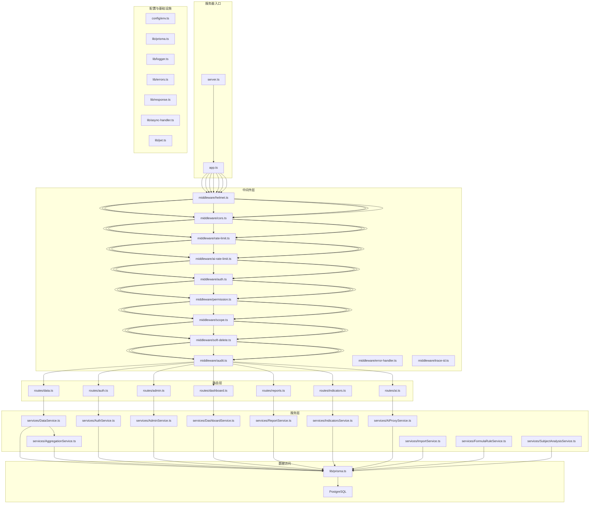
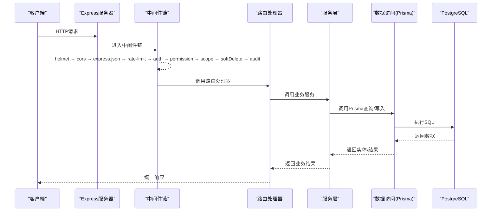
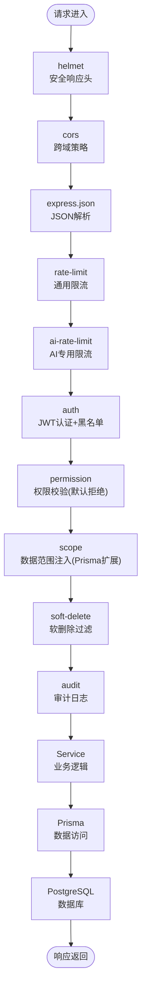
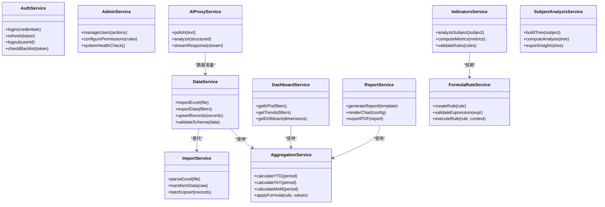
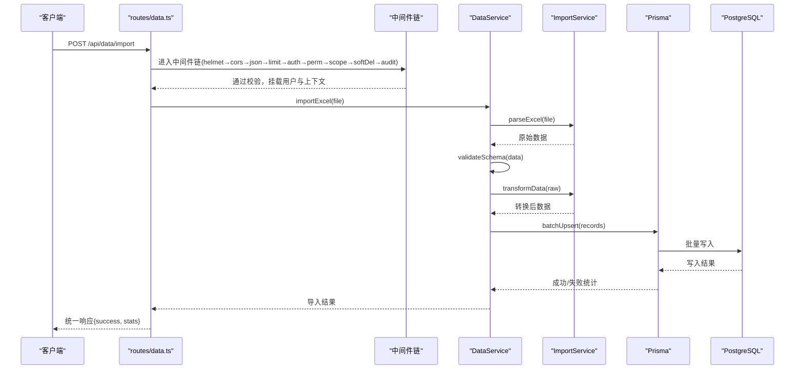
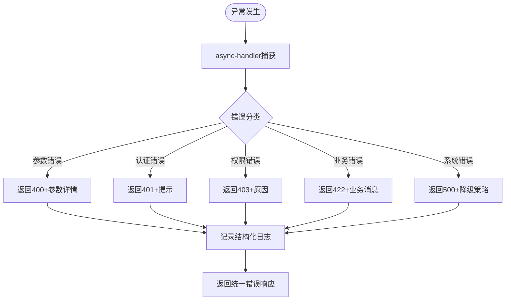
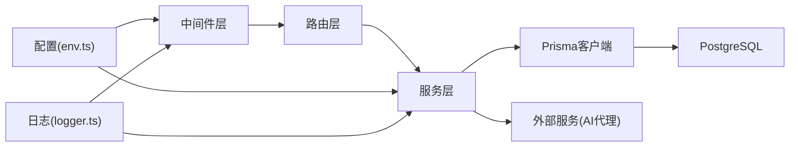

# 后端架构

<cite>
**本文引用的文件**   
- [server.ts](file://server/server.ts)
- [app.ts](file://server/src/app.ts)
- [env.ts](file://server/src/config/env.ts)
- [prisma.ts](file://server/src/lib/prisma.ts)
- [logger.ts](file://server/src/lib/logger.ts)
- [errors.ts](file://server/src/lib/errors.ts)
- [response.ts](file://server/src/lib/response.ts)
- [async-handler.ts](file://server/src/lib/async-handler.ts)
- [jwt.ts](file://server/src/lib/jwt.ts)
- [helmet.ts](file://server/src/middleware/helmet.ts)
- [cors.ts](file://server/src/middleware/cors.ts)
- [rate-limit.ts](file://server/src/middleware/rate-limit.ts)
- [ai-rate-limit.ts](file://server/src/middleware/ai-rate-limit.ts)
- [auth.ts](file://server/src/middleware/auth.ts)
- [permission.ts](file://server/src/middleware/permission.ts)
- [scope.ts](file://server/src/middleware/scope.ts)
- [soft-delete.ts](file://server/src/middleware/soft-delete.ts)
- [audit.ts](file://server/src/middleware/audit.ts)
- [error-handler.ts](file://server/src/middleware/error-handler.ts)
- [trace-id.ts](file://server/src/middleware/trace-id.ts)
- [routes/auth.ts](file://server/src/routes/auth.ts)
- [routes/data.ts](file://server/src/routes/data.ts)
- [routes/admin.ts](file://server/src/routes/admin.ts)
- [routes/ai.ts](file://server/src/routes/ai.ts)
- [routes/dashboard.ts](file://server/src/routes/dashboard.ts)
- [routes/reports.ts](file://server/src/routes/reports.ts)
- [routes/indicators.ts](file://server/src/routes/indicators.ts)
- [AuthService.ts](file://server/src/services/AuthService.ts)
- [DataService.ts](file://server/src/services/DataService.ts)
- [AggregationService.ts](file://server/src/services/AggregationService.ts)
- [AdminService.ts](file://server/src/services/AdminService.ts)
- [DashboardService.ts](file://server/src/services/DashboardService.ts)
- [ReportService.ts](file://server/src/services/ReportService.ts)
- [IndicatorsService.ts](file://server/src/services/IndicatorsService.ts)
- [AIProxyService.ts](file://server/src/services/AIProxyService.ts)
- [ImportService.ts](file://server/src/services/ImportService.ts)
- [FormulaRuleService.ts](file://server/src/services/FormulaRuleService.ts)
- [SubjectAnalysisService.ts](file://server/src/services/SubjectAnalysisService.ts)
</cite>

## 目录
1. [简介](#简介)
2. [项目结构](#项目结构)
3. [核心组件](#核心组件)
4. [架构总览](#架构总览)
5. [详细组件分析](#详细组件分析)
6. [依赖关系分析](#依赖关系分析)
7. [性能考量](#性能考量)
8. [故障排查指南](#故障排查指南)
9. [结论](#结论)
10. [附录](#附录)

## 简介
本文件面向FY200后端（Express + Prisma + PostgreSQL）的架构与实现，重点阐述：
- Express服务器的模块化设计：路由层、中间件层、服务层、数据访问层的职责分离。
- 中间件执行链的设计原理与顺序：安全头 → 跨域 → JSON解析 → 限流 → 认证 → 权限 → 数据范围 → 软删除 → 审计 → 业务逻辑 → 数据访问 → 数据库。
- 关键中间件的实现细节、配置项与执行顺序。
- 服务层设计模式与各服务的职责划分和依赖关系。
- 请求处理流程图、错误处理机制与日志记录策略。

本项目为浙江壹品慧财年经营数据分析平台，定位“Excel进、看板/报表出”的内部管理口径财务数据平台，单位统一为万元/人民币。技术栈包括Express 4、Prisma 5、PostgreSQL 15、JWT（access 15分钟 + refresh 7天轮转）、DeepSeek API（SSE流式）。计算类指标使用安全公式解析（白名单算子），同比/环比由后端实时计算不存库。AI双管道：polish（文本→脱敏→LLM→还原）/ analyze（结构化→计算→脱敏→LLM→生成），脱敏规则：绝对金额→区间，公司名→动态映射。

## 项目结构
后端代码位于 server 目录，采用分层组织：
- src/config：环境配置与环境变量校验。
- src/lib：通用工具与基础设施（日志、错误、响应封装、异步处理器、JWT、Prisma客户端等）。
- src/middleware：Express中间件（安全、跨域、限流、鉴权、权限、数据范围、软删除、审计、错误处理、追踪ID等）。
- src/routes：按领域划分的Express Router（认证、数据、管理、AI、仪表盘、报表、指标等）。
- src/services：业务服务层（认证、数据、聚合、管理、仪表盘、报表、指标、AI代理、导入、公式规则、科目分析等）。
- prisma：Prisma Schema、迁移、种子数据与审计初始化脚本。
- scripts：辅助脚本（本地DB、CORS检查、AI冒烟测试等）。

图表来源
- [server.ts](file://server/server.ts)
- [app.ts](file://server/src/app.ts)
- [env.ts](file://server/src/config/env.ts)
- [prisma.ts](file://server/src/lib/prisma.ts)
- [logger.ts](file://server/src/lib/logger.ts)
- [errors.ts](file://server/src/lib/errors.ts)
- [response.ts](file://server/src/lib/response.ts)
- [async-handler.ts](file://server/src/lib/async-handler.ts)
- [jwt.ts](file://server/src/lib/jwt.ts)
- [helmet.ts](file://server/src/middleware/helmet.ts)
- [cors.ts](file://server/src/middleware/cors.ts)
- [rate-limit.ts](file://server/src/middleware/rate-limit.ts)
- [ai-rate-limit.ts](file://server/src/middleware/ai-rate-limit.ts)
- [auth.ts](file://server/src/middleware/auth.ts)
- [permission.ts](file://server/src/middleware/permission.ts)
- [scope.ts](file://server/src/middleware/scope.ts)
- [soft-delete.ts](file://server/src/middleware/soft-delete.ts)
- [audit.ts](file://server/src/middleware/audit.ts)
- [error-handler.ts](file://server/src/middleware/error-handler.ts)
- [trace-id.ts](file://server/src/middleware/trace-id.ts)
- [routes/auth.ts](file://server/src/routes/auth.ts)
- [routes/data.ts](file://server/src/routes/data.ts)
- [routes/admin.ts](file://server/src/routes/admin.ts)
- [routes/ai.ts](file://server/src/routes/ai.ts)
- [routes/dashboard.ts](file://server/src/routes/dashboard.ts)
- [routes/reports.ts](file://server/src/routes/reports.ts)
- [routes/indicators.ts](file://server/src/routes/indicators.ts)
- [AuthService.ts](file://server/src/services/AuthService.ts)
- [DataService.ts](file://server/src/services/DataService.ts)
- [AggregationService.ts](file://server/src/services/AggregationService.ts)
- [AdminService.ts](file://server/src/services/AdminService.ts)
- [DashboardService.ts](file://server/src/services/DashboardService.ts)
- [ReportService.ts](file://server/src/services/ReportService.ts)
- [IndicatorsService.ts](file://server/src/services/IndicatorsService.ts)
- [AIProxyService.ts](file://server/src/services/AIProxyService.ts)
- [ImportService.ts](file://server/src/services/ImportService.ts)
- [FormulaRuleService.ts](file://server/src/services/FormulaRuleService.ts)
- [SubjectAnalysisService.ts](file://server/src/services/SubjectAnalysisService.ts)

章节来源
- [server.ts](file://server/server.ts)
- [app.ts](file://server/src/app.ts)
- [env.ts](file://server/src/config/env.ts)

## 核心组件
- 服务器入口与装配
  - server.ts：启动HTTP服务，监听端口，加载环境变量，注册全局错误处理与日志。
  - app.ts：创建Express实例，装配中间件链与路由，导出应用实例供外部使用。
- 配置与基础设施
  - config/env.ts：集中读取并校验环境变量（如数据库连接、JWT密钥、限流参数、CORS设置等）。
  - lib/prisma.ts：单例化Prisma客户端，提供事务与扩展能力。
  - lib/logger.ts：结构化日志（JSON格式），支持分级输出与上下文注入（traceId、用户信息等）。
  - lib/errors.ts：自定义错误类型与状态码映射，便于统一错误处理。
  - lib/response.ts：统一响应包装（成功/失败、分页、元数据）。
  - lib/async-handler.ts：将异步路由处理器包装为同步形式，自动捕获异常并转发至错误处理中间件。
  - lib/jwt.ts：JWT签发、验证、刷新与黑名单校验。
- 中间件层
  - helmet.ts：安全响应头（X-Content-Type-Options、X-Frame-Options、HSTS等）。
  - cors.ts：跨域策略（允许源、方法、头部、凭证、预检缓存）。
  - rate-limit.ts / ai-rate-limit.ts：通用与AI专用限流（IP/用户维度、窗口、令牌桶/固定窗口）。
  - auth.ts：JWT认证（access token校验、黑名单、会话信息挂载）。
  - permission.ts：基于角色/资源的权限控制（默认拒绝，显式授权）。
  - scope.ts：数据范围注入（通过Prisma extension在查询中附加租户/公司/部门过滤）。
  - soft-delete.ts：软删除拦截（查询自动追加未删除条件，写入标记删除时间）。
  - audit.ts：审计日志（操作主体、资源、动作、差异、结果）。
  - error-handler.ts：全局错误处理（分类、降级、标准化响应）。
  - trace-id.ts：请求追踪ID生成与透传（链路追踪）。
- 路由层
  - routes/*：按领域划分REST接口，仅负责参数校验、调用服务层、返回统一响应。
- 服务层
  - services/*：业务编排与领域逻辑，组合多个数据访问与服务调用，保证事务与一致性。
- 数据访问
  - lib/prisma.ts：Prisma客户端与扩展（scope、审计、软删除等）。
  - PostgreSQL：关系型数据存储。

章节来源
- [server.ts](file://server/server.ts)
- [app.ts](file://server/src/app.ts)
- [env.ts](file://server/src/config/env.ts)
- [prisma.ts](file://server/src/lib/prisma.ts)
- [logger.ts](file://server/src/lib/logger.ts)
- [errors.ts](file://server/src/lib/errors.ts)
- [response.ts](file://server/src/lib/response.ts)
- [async-handler.ts](file://server/src/lib/async-handler.ts)
- [jwt.ts](file://server/src/lib/jwt.ts)

## 架构总览
整体架构遵循“路由-中间件-服务-数据访问”的分层模型，强调单一职责与可插拔性。中间件以洋葱模型串联，确保横切关注点（安全、鉴权、限流、审计等）与业务解耦。服务层作为业务编排中心，协调数据访问与外部服务（如AI代理）。数据访问通过Prisma抽象SQL，结合PostgreSQL实现强一致性与复杂查询。

图表来源
- [app.ts](file://server/src/app.ts)
- [auth.ts](file://server/src/middleware/auth.ts)
- [permission.ts](file://server/src/middleware/permission.ts)
- [scope.ts](file://server/src/middleware/scope.ts)
- [soft-delete.ts](file://server/src/middleware/soft-delete.ts)
- [audit.ts](file://server/src/middleware/audit.ts)
- [rate-limit.ts](file://server/src/middleware/rate-limit.ts)
- [ai-rate-limit.ts](file://server/src/middleware/ai-rate-limit.ts)
- [helmet.ts](file://server/src/middleware/helmet.ts)
- [cors.ts](file://server/src/middleware/cors.ts)
- [prisma.ts](file://server/src/lib/prisma.ts)

## 详细组件分析

### 中间件执行链与设计原理
中间件执行顺序严格遵循：helmet → cors → express.json → rate-limit → auth → permission → scope → softDelete → audit → Service → Prisma → PostgreSQL。每个中间件承担明确职责，并通过req/res扩展或Prisma扩展传递上下文。

图表来源
- [helmet.ts](file://server/src/middleware/helmet.ts)
- [cors.ts](file://server/src/middleware/cors.ts)
- [rate-limit.ts](file://server/src/middleware/rate-limit.ts)
- [ai-rate-limit.ts](file://server/src/middleware/ai-rate-limit.ts)
- [auth.ts](file://server/src/middleware/auth.ts)
- [permission.ts](file://server/src/middleware/permission.ts)
- [scope.ts](file://server/src/middleware/scope.ts)
- [soft-delete.ts](file://server/src/middleware/soft-delete.ts)
- [audit.ts](file://server/src/middleware/audit.ts)
- [prisma.ts](file://server/src/lib/prisma.ts)

#### 各中间件实现要点
- helmet：启用安全头（禁止嗅探、限制点击劫持、强制HTTPS等），可通过环境变量开关。
- cors：允许指定源、方法、头部，支持凭证与预检缓存；用于前后端联调与生产部署。
- rate-limit：基于IP或用户标识的限流，支持滑动窗口与令牌桶；AI专用限流独立阈值。
- auth：校验access token有效性、黑名单命中、挂载用户上下文到req.user。
- permission：基于资源与动作的RBAC，默认拒绝，需显式声明允许列表。
- scope：通过Prisma扩展注入租户/公司/部门过滤条件，所有查询自动受限。
- soft-delete：查询自动追加未删除条件，更新时标记删除时间与操作者。
- audit：记录操作主体、资源、动作、差异、结果，支持异步落库与批量上报。
- error-handler：捕获未处理异常，分类错误（参数、认证、权限、业务、系统），返回标准错误体。
- trace-id：生成唯一追踪ID，贯穿日志与链路追踪。

章节来源
- [helmet.ts](file://server/src/middleware/helmet.ts)
- [cors.ts](file://server/src/middleware/cors.ts)
- [rate-limit.ts](file://server/src/middleware/rate-limit.ts)
- [ai-rate-limit.ts](file://server/src/middleware/ai-rate-limit.ts)
- [auth.ts](file://server/src/middleware/auth.ts)
- [permission.ts](file://server/src/middleware/permission.ts)
- [scope.ts](file://server/src/middleware/scope.ts)
- [soft-delete.ts](file://server/src/middleware/soft-delete.ts)
- [audit.ts](file://server/src/middleware/audit.ts)
- [error-handler.ts](file://server/src/middleware/error-handler.ts)
- [trace-id.ts](file://server/src/middleware/trace-id.ts)

### 服务层设计与职责划分
服务层采用“单一职责 + 组合编排”的模式，各服务专注于特定领域逻辑，依赖Prisma进行数据访问，必要时调用外部服务（如AI代理）。

图表来源
- [AuthService.ts](file://server/src/services/AuthService.ts)
- [DataService.ts](file://server/src/services/DataService.ts)
- [AggregationService.ts](file://server/src/services/AggregationService.ts)
- [AdminService.ts](file://server/src/services/AdminService.ts)
- [DashboardService.ts](file://server/src/services/DashboardService.ts)
- [ReportService.ts](file://server/src/services/ReportService.ts)
- [IndicatorsService.ts](file://server/src/services/IndicatorsService.ts)
- [AIProxyService.ts](file://server/src/services/AIProxyService.ts)
- [ImportService.ts](file://server/src/services/ImportService.ts)
- [FormulaRuleService.ts](file://server/src/services/FormulaRuleService.ts)
- [SubjectAnalysisService.ts](file://server/src/services/SubjectAnalysisService.ts)

章节来源
- [AuthService.ts](file://server/src/services/AuthService.ts)
- [DataService.ts](file://server/src/services/DataService.ts)
- [AggregationService.ts](file://server/src/services/AggregationService.ts)
- [AdminService.ts](file://server/src/services/AdminService.ts)
- [DashboardService.ts](file://server/src/services/DashboardService.ts)
- [ReportService.ts](file://server/src/services/ReportService.ts)
- [IndicatorsService.ts](file://server/src/services/IndicatorsService.ts)
- [AIProxyService.ts](file://server/src/services/AIProxyService.ts)
- [ImportService.ts](file://server/src/services/ImportService.ts)
- [FormulaRuleService.ts](file://server/src/services/FormulaRuleService.ts)
- [SubjectAnalysisService.ts](file://server/src/services/SubjectAnalysisService.ts)

### 请求处理流程（示例：数据导入）
以下序列图展示数据导入的典型流程：路由接收请求 → 中间件链校验 → 服务层编排 → 数据导入与转换 → 批量写入 → 返回结果。

图表来源
- [routes/data.ts](file://server/src/routes/data.ts)
- [DataService.ts](file://server/src/services/DataService.ts)
- [ImportService.ts](file://server/src/services/ImportService.ts)
- [prisma.ts](file://server/src/lib/prisma.ts)

章节来源
- [routes/data.ts](file://server/src/routes/data.ts)
- [DataService.ts](file://server/src/services/DataService.ts)
- [ImportService.ts](file://server/src/services/ImportService.ts)

### 错误处理机制
- 统一错误类型：定义业务错误、参数错误、认证错误、权限错误、系统错误等，携带状态码与消息。
- 全局错误处理：error-handler中间件捕获未处理异常，分类处理并返回标准错误体。
- 异步处理器：async-handler包装路由处理器，自动捕获异常并转发。
- 日志记录：错误堆栈、上下文（traceId、用户、资源）记录到结构化日志。

图表来源
- [errors.ts](file://server/src/lib/errors.ts)
- [error-handler.ts](file://server/src/middleware/error-handler.ts)
- [async-handler.ts](file://server/src/lib/async-handler.ts)
- [logger.ts](file://server/src/lib/logger.ts)

章节来源
- [errors.ts](file://server/src/lib/errors.ts)
- [error-handler.ts](file://server/src/middleware/error-handler.ts)
- [async-handler.ts](file://server/src/lib/async-handler.ts)
- [logger.ts](file://server/src/lib/logger.ts)

### 日志记录策略
- 结构化日志：JSON格式，包含时间戳、级别、traceId、用户、资源、动作、耗时等。
- 分级输出：debug、info、warn、error，支持按模块或环境过滤。
- 敏感信息脱敏：金额、公司名等按规则脱敏（绝对金额→区间，公司名→动态映射）。
- 审计日志：关键操作（登录、修改、删除）记录到独立表，支持回溯与合规。

章节来源
- [logger.ts](file://server/src/lib/logger.ts)
- [audit.ts](file://server/src/middleware/audit.ts)

## 依赖关系分析
- 低耦合高内聚：路由仅调用服务，服务组合数据访问与外部服务，中间件横切关注点独立。
- 依赖注入：通过构造函数或模块级单例注入（如Prisma客户端、配置对象）。
- 扩展点：Prisma扩展（scope、审计、软删除）与中间件链可插拔。
- 外部依赖：PostgreSQL（数据库）、DeepSeek API（AI代理）、JWT（认证）。

图表来源
- [app.ts](file://server/src/app.ts)
- [env.ts](file://server/src/config/env.ts)
- [prisma.ts](file://server/src/lib/prisma.ts)
- [logger.ts](file://server/src/lib/logger.ts)

章节来源
- [app.ts](file://server/src/app.ts)
- [env.ts](file://server/src/config/env.ts)
- [prisma.ts](file://server/src/lib/prisma.ts)
- [logger.ts](file://server/src/lib/logger.ts)

## 性能考量
- 中间件优化：限流避免过载，CORS预检缓存减少重复请求，安全头按需启用。
- 数据库优化：Prisma连接池、索引设计、批量写入、事务合并。
- 计算优化：同比/环比实时计算，避免冗余存储；公式解析白名单防止恶意表达式。
- AI流式：SSE流式响应降低延迟，分块传输大结果集。
- 缓存策略：热点数据缓存（Redis可选），审计日志异步落库。

[本节为通用指导，无需引用具体文件]

## 故障排查指南
- 常见问题
  - 认证失败：检查JWT密钥、过期时间、黑名单配置。
  - 权限拒绝：确认权限规则与资源映射是否正确。
  - 数据范围错误：核查scope注入条件与租户隔离。
  - 软删除问题：确认查询是否自动追加未删除条件。
  - 限流触发：调整rate-limit阈值或扩容实例。
- 调试步骤
  - 查看traceId关联日志，定位请求链路。
  - 启用debug级别日志，观察中间件执行顺序。
  - 检查Prisma查询日志，分析SQL性能。
  - 使用scripts/cors-check.ts验证跨域配置。
- 恢复策略
  - 错误降级：AI服务不可用时回退静态数据。
  - 熔断保护：外部API超时或错误率过高时熔断。
  - 数据修复：审计日志辅助数据修复与回溯。

章节来源
- [error-handler.ts](file://server/src/middleware/error-handler.ts)
- [logger.ts](file://server/src/lib/logger.ts)
- [audit.ts](file://server/src/middleware/audit.ts)
- [cors.ts](file://server/src/middleware/cors.ts)

## 结论
FY200后端架构通过清晰的层次划分与中间件链设计，实现了安全、可扩展、易维护的企业级API服务。服务层聚焦业务编排，数据访问通过Prisma抽象，PostgreSQL提供强一致存储。统一的错误处理与日志策略保障了可观测性与可运维性。未来可引入缓存、消息队列与分布式追踪进一步提升性能与可靠性。

[本节为总结，无需引用具体文件]

## 附录
- 环境变量参考：数据库连接、JWT密钥、限流参数、CORS设置、AI API密钥等。
- API文档：参考.wiki/API-Reference.md与docs/references/backend.md。
- 数据库Schema：参考prisma/schema.prisma与.wiki/Database-Schema.md。
- 快速开始：参考.wiki/Getting-Started.md与scripts/local-db.ts。

[本节为参考信息，无需引用具体文件]