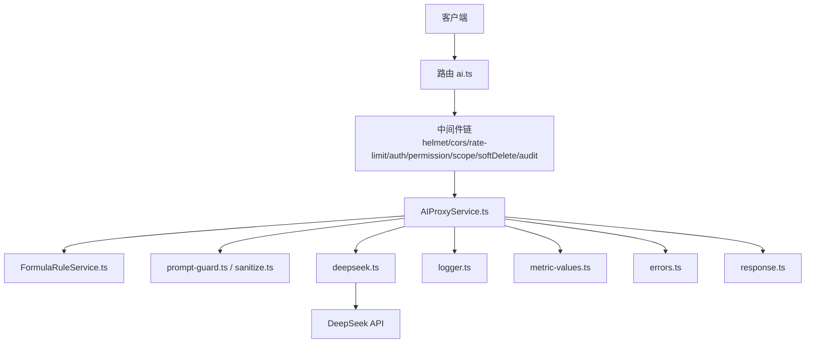
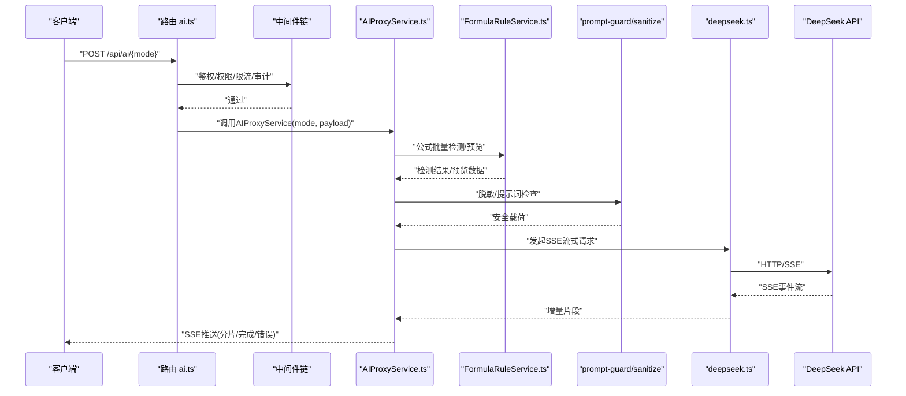
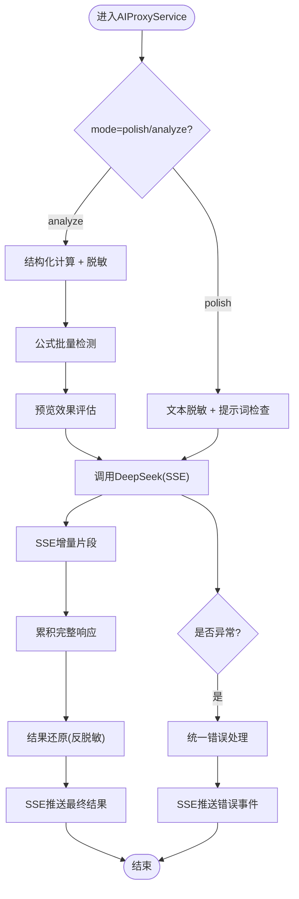
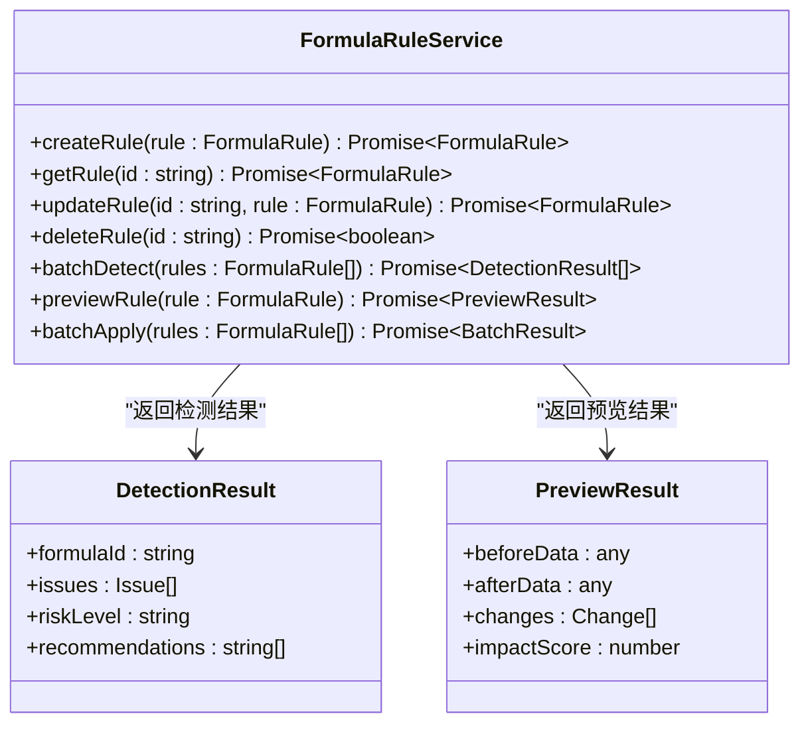
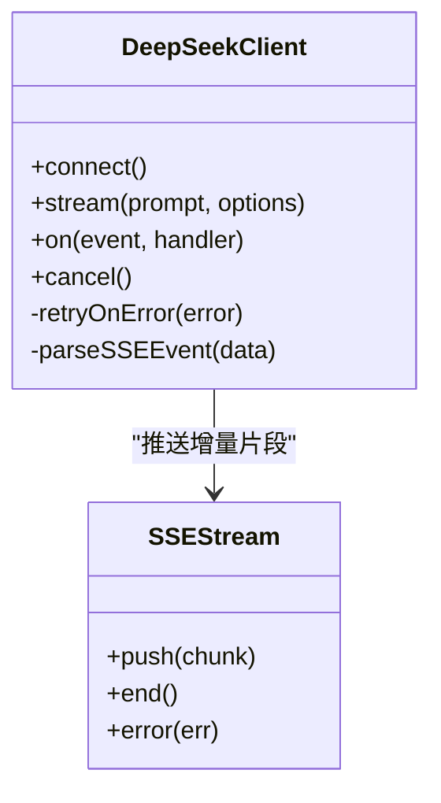
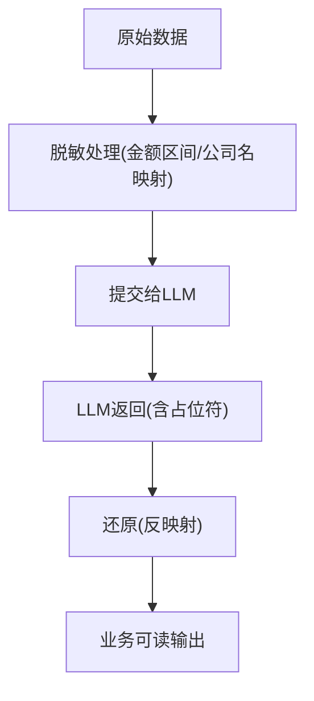
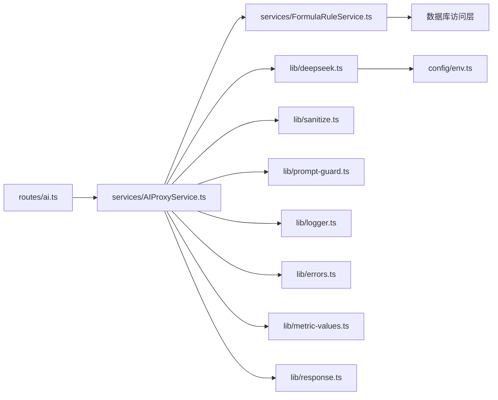

# AI代理服务 (AIProxyService)

<cite>
**本文引用的文件**   
- [AIProxyService.ts](file://server/src/services/AIProxyService.ts)
- [FormulaRuleService.ts](file://server/src/services/FormulaRuleService.ts)
- [deepseek.ts](file://server/src/lib/deepseek.ts)
- [ai-rate-limit.ts](file://server/src/middleware/ai-rate-limit.ts)
- [prompt-guard.ts](file://server/src/lib/prompt-guard.ts)
- [sanitize.ts](file://server/src/lib/sanitize.ts)
- [errors.ts](file://server/src/lib/errors.ts)
- [logger.ts](file://server/src/lib/logger.ts)
- [metric-values.ts](file://server/src/lib/metric-values.ts)
- [response.ts](file://server/src/lib/response.ts)
- [env.ts](file://server/src/config/env.ts)
- [ai.ts](file://server/src/routes/ai.ts)
- [app.ts](file://server/src/app.ts)
- [server.ts](file://server/src/server.ts)
</cite>

## 更新摘要
**所做更改**   
- 新增公式批量检测功能，支持对大量公式进行智能分析和验证
- 增强预览能力，提供公式应用前的效果预览和风险评估
- 实现批量应用功能，支持一次性应用多个公式规则
- 改进公式规则管理，完善CRUD操作接口
- 优化AI代理服务的公式处理管道

## 目录
1. [简介](#简介)
2. [项目结构](#项目结构)
3. [核心组件](#核心组件)
4. [架构总览](#架构总览)
5. [详细组件分析](#详细组件分析)
6. [依赖关系分析](#依赖关系分析)
7. [性能与监控](#性能与监控)
8. [故障排查指南](#故障排查指南)
9. [结论](#结论)
10. [附录：调用示例与提示词模板](#附录调用示例与提示词模板)

## 简介
本文件面向FY200财年经营数据分析平台的AI代理服务，聚焦AIProxyService的双管道架构设计（polish文本润色、analyze结构化分析），并详细说明DeepSeek API集成、SSE流式响应、数据脱敏规则与结果还原机制。文档还涵盖请求限流、错误重试与性能监控实践，并提供AI功能调用示例与自定义提示词模板建议，帮助开发者快速集成与优化。

**更新** 本次更新重点增强了公式处理能力，包括批量检测、预览功能和改进的规则管理CRUD操作。

## 项目结构
围绕AI代理服务的后端实现主要位于server/src目录下，关键路径如下：
- 服务层：services/AIProxyService.ts、services/FormulaRuleService.ts
- 外部API客户端：lib/deepseek.ts
- 中间件：middleware/ai-rate-limit.ts
- 安全与输入校验：lib/prompt-guard.ts、lib/sanitize.ts
- 错误与日志：lib/errors.ts、lib/logger.ts
- 指标与度量：lib/metric-values.ts
- 统一响应封装：lib/response.ts
- 配置与环境变量：config/env.ts
- 路由入口：routes/ai.ts
- 应用装配：app.ts、server.ts

图表来源
- [ai.ts](file://server/src/routes/ai.ts)
- [AIProxyService.ts](file://server/src/services/AIProxyService.ts)
- [FormulaRuleService.ts](file://server/src/services/FormulaRuleService.ts)
- [deepseek.ts](file://server/src/lib/deepseek.ts)
- [prompt-guard.ts](file://server/src/lib/prompt-guard.ts)
- [sanitize.ts](file://server/src/lib/sanitize.ts)
- [logger.ts](file://server/src/lib/logger.ts)
- [metric-values.ts](file://server/src/lib/metric-values.ts)
- [errors.ts](file://server/src/lib/errors.ts)
- [response.ts](file://server/src/lib/response.ts)

章节来源
- [ai.ts](file://server/src/routes/ai.ts)
- [app.ts](file://server/src/app.ts)
- [server.ts](file://server/src/server.ts)

## 核心组件
- AIProxyService：双管道编排器，负责接收请求、选择处理模式（polish/analyze）、执行脱敏与还原、调用DeepSeek、组装SSE流式响应与错误处理。
- FormulaRuleService：公式规则管理服务，提供完整的CRUD操作、批量检测和预览功能。
- deepseek.ts：封装DeepSeek HTTP/SSE客户端，提供流式读取、超时控制、重试策略与指标上报。
- ai-rate-limit.ts：针对AI接口的独立限流中间件，按用户/IP维度限制并发与QPS。
- prompt-guard.ts：提示词安全检查，防止注入与越权指令。
- sanitize.ts：数据脱敏与还原工具，支持金额区间化、公司名动态映射等规则。
- errors.ts：统一异常定义与转换。
- logger.ts：结构化日志输出。
- metric-values.ts：指标采集与上报（延迟、吞吐、错误率）。
- response.ts：统一响应格式封装。
- env.ts：环境变量加载与校验（如DeepSeek密钥、模型名称、超时、重试次数等）。

**更新** 新增了FormulaRuleService来专门处理公式相关的业务逻辑，包括批量操作和预览功能。

章节来源
- [AIProxyService.ts](file://server/src/services/AIProxyService.ts)
- [FormulaRuleService.ts](file://server/src/services/FormulaRuleService.ts)
- [deepseek.ts](file://server/src/lib/deepseek.ts)
- [ai-rate-limit.ts](file://server/src/middleware/ai-rate-limit.ts)
- [prompt-guard.ts](file://server/src/lib/prompt-guard.ts)
- [sanitize.ts](file://server/src/lib/sanitize.ts)
- [errors.ts](file://server/src/lib/errors.ts)
- [logger.ts](file://server/src/lib/logger.ts)
- [metric-values.ts](file://server/src/lib/metric-values.ts)
- [response.ts](file://server/src/lib/response.ts)
- [env.ts](file://server/src/config/env.ts)

## 架构总览
AI代理服务采用"双管道"架构：
- polish（文本润色）：将原始文本进行脱敏后提交给LLM，返回结果再还原为业务可读内容。
- analyze（结构化分析）：对结构化数据进行计算与聚合，再进行脱敏，提交给LLM生成分析报告，最后还原敏感字段。

**更新** 新增公式处理管道，支持批量检测和预览功能。

图表来源
- [ai.ts](file://server/src/routes/ai.ts)
- [AIProxyService.ts](file://server/src/services/AIProxyService.ts)
- [FormulaRuleService.ts](file://server/src/services/FormulaRuleService.ts)
- [deepseek.ts](file://server/src/lib/deepseek.ts)

章节来源
- [AIProxyService.ts](file://server/src/services/AIProxyService.ts)
- [FormulaRuleService.ts](file://server/src/services/FormulaRuleService.ts)
- [deepseek.ts](file://server/src/lib/deepseek.ts)
- [ai.ts](file://server/src/routes/ai.ts)

## 详细组件分析

### AIProxyService 双管道架构
- 模式选择：根据路由参数或请求体中的mode字段决定走polish还是analyze流程。
- 输入预处理：
  - polish：对纯文本进行脱敏（金额→区间、公司名→映射标记），并进行提示词安全检查。
  - analyze：对结构化数据进行计算（同比/环比、汇总等），再脱敏敏感字段。
- LLM调用：使用deepseek.ts发起SSE流式请求，实时转发增量片段至客户端。
- 结果还原：在收到完整响应后，按脱敏规则反向还原敏感信息，确保输出符合业务口径。
- 错误处理：捕获网络、解析、业务异常，转换为统一错误格式，并通过SSE推送错误事件。
- 指标与日志：记录请求耗时、Token用量、错误码、重试次数等，便于监控与排障。

**更新** 新增公式处理管道，支持批量检测和预览功能，提高公式管理的效率和准确性。

图表来源
- [AIProxyService.ts](file://server/src/services/AIProxyService.ts)
- [FormulaRuleService.ts](file://server/src/services/FormulaRuleService.ts)
- [deepseek.ts](file://server/src/lib/deepseek.ts)
- [prompt-guard.ts](file://server/src/lib/prompt-guard.ts)
- [sanitize.ts](file://server/src/lib/sanitize.ts)

章节来源
- [AIProxyService.ts](file://server/src/services/AIProxyService.ts)

### FormulaRuleService 公式规则管理
- CRUD操作：提供公式规则的创建、读取、更新、删除等完整操作接口。
- 批量检测：支持对大量公式进行智能分析和验证，识别潜在问题和风险。
- 预览功能：在应用公式前提供效果预览，帮助用户评估变更影响。
- 批量应用：支持一次性应用多个公式规则，提高管理效率。
- 版本控制：维护公式规则的版本历史，支持回滚和对比。

**新增** FormulaRuleService专门处理公式相关的业务逻辑，提供完整的CRUD操作和批量处理能力。

图表来源
- [FormulaRuleService.ts](file://server/src/services/FormulaRuleService.ts)

章节来源
- [FormulaRuleService.ts](file://server/src/services/FormulaRuleService.ts)

### DeepSeek API 集成与SSE流式
- 客户端封装：提供连接建立、请求头设置（鉴权、模型、系统提示）、SSE事件监听、超时与重试。
- 流式处理：逐条消费SSE事件，拼接增量文本，支持中断与取消。
- 重试策略：对可恢复错误（如网络抖动、临时限流）进行指数退避重试，避免雪崩。
- 指标上报：统计首字节延迟、总时延、事件数、错误率、重试次数。

图表来源
- [deepseek.ts](file://server/src/lib/deepseek.ts)

章节来源
- [deepseek.ts](file://server/src/lib/deepseek.ts)

### 数据脱敏与还原
- 脱敏规则：
  - 绝对金额→区间（例如以万元为单位划分区间，避免泄露精确数值）。
  - 公司名→动态映射（替换为占位符或别名，后续还原）。
- 还原机制：基于占位符映射表，在服务端对LLM返回结果进行反向替换，保证输出可读性与合规性。
- 扩展性：新增脱敏规则需同时维护映射与还原逻辑，确保一致性。

图表来源
- [sanitize.ts](file://server/src/lib/sanitize.ts)

章节来源
- [sanitize.ts](file://server/src/lib/sanitize.ts)

### 提示词安全与输入校验
- 提示词检查：过滤恶意指令、禁止越权操作、限制敏感关键词。
- 输入校验：对请求体字段类型、长度、枚举值进行校验，减少无效请求。
- 白名单策略：仅允许受控的提示词模板与变量注入点。

章节来源
- [prompt-guard.ts](file://server/src/lib/prompt-guard.ts)

### 请求限流与错误重试
- 限流：ai-rate-limit.ts按用户/IP维度限制并发与QPS，保护下游LLM与服务稳定性。
- 重试：deepseek.ts对可恢复错误进行指数退避重试，避免瞬时失败影响用户体验。
- 熔断与降级：当错误率超过阈值时，快速失败并返回友好提示。

章节来源
- [ai-rate-limit.ts](file://server/src/middleware/ai-rate-limit.ts)
- [deepseek.ts](file://server/src/lib/deepseek.ts)

### 性能监控与日志
- 指标：首字节延迟、端到端时延、事件数、错误率、重试次数、Token用量。
- 日志：结构化日志记录请求上下文、输入摘要、输出摘要、错误堆栈。
- 告警：关键指标超阈触发告警（如错误率飙升、延迟过高）。

章节来源
- [metric-values.ts](file://server/src/lib/metric-values.ts)
- [logger.ts](file://server/src/lib/logger.ts)

## 依赖关系分析
- 路由ai.ts依赖中间件链与AIProxyService。
- AIProxyService依赖FormulaRuleService、deepseek.ts、sanitize.ts、prompt-guard.ts、logger.ts、errors.ts、metric-values.ts、response.ts。
- FormulaRuleService依赖数据库访问层和业务逻辑层。
- deepseek.ts依赖环境变量配置（模型、密钥、超时、重试策略）。

**更新** 新增FormulaRuleService依赖关系，形成更完整的服务架构。

图表来源
- [ai.ts](file://server/src/routes/ai.ts)
- [AIProxyService.ts](file://server/src/services/AIProxyService.ts)
- [FormulaRuleService.ts](file://server/src/services/FormulaRuleService.ts)
- [deepseek.ts](file://server/src/lib/deepseek.ts)
- [sanitize.ts](file://server/src/lib/sanitize.ts)
- [prompt-guard.ts](file://server/src/lib/prompt-guard.ts)
- [logger.ts](file://server/src/lib/logger.ts)
- [errors.ts](file://server/src/lib/errors.ts)
- [metric-values.ts](file://server/src/lib/metric-values.ts)
- [response.ts](file://server/src/lib/response.ts)
- [env.ts](file://server/src/config/env.ts)

章节来源
- [ai.ts](file://server/src/routes/ai.ts)
- [AIProxyService.ts](file://server/src/services/AIProxyService.ts)
- [FormulaRuleService.ts](file://server/src/services/FormulaRuleService.ts)
- [deepseek.ts](file://server/src/lib/deepseek.ts)

## 性能与监控
- 流式传输：SSE增量推送降低首屏延迟，提升交互体验。
- 缓存与复用：对相同提示词与参数组合可考虑短期缓存（注意隐私与时效性）。
- 资源控制：限制并发连接、合理设置超时与重试上限，避免资源耗尽。
- 监控看板：集中展示延迟、吞吐、错误率、重试次数等关键指标。
- **更新** 新增公式处理的性能监控，包括批量操作的吞吐量、预览功能的响应时间等。

## 故障排查指南
- 常见问题：
  - 网络连接失败：检查网络连通性、代理配置、防火墙策略。
  - 鉴权失败：确认DeepSeek密钥与模型名称配置正确。
  - 限流触发：检查ai-rate-limit配置与上游流量峰值。
  - 解析错误：核对SSE事件格式与字段完整性。
  - 脱敏还原不一致：检查映射表与还原逻辑一致性。
  - 公式检测失败：检查公式语法和依赖关系。
  - 预览功能异常：验证数据源和计算逻辑。
- 定位方法：
  - 查看结构化日志，关注错误堆栈与上下文。
  - 检查指标看板，识别异常时段与热点接口。
  - 复现最小用例，逐步隔离问题模块。
  - **更新** 使用公式调试工具验证规则和计算逻辑。

章节来源
- [errors.ts](file://server/src/lib/errors.ts)
- [logger.ts](file://server/src/lib/logger.ts)
- [metric-values.ts](file://server/src/lib/metric-values.ts)

## 结论
AIProxyService通过双管道架构实现了灵活、安全的AI能力接入：polish模式专注文本润色，analyze模式聚焦结构化分析与报告生成。结合DeepSeek SSE流式、严格的数据脱敏与还原、完善的限流与重试机制，以及全面的监控与日志，平台能够在保障数据安全与稳定性的前提下，提供高性能的AI服务体验。

**更新** 新增的FormulaRuleService进一步完善了公式管理能力，通过批量检测、预览功能和CRUD操作，显著提升了公式管理的效率和准确性。

## 附录：调用示例与提示词模板
- 调用示例（概念性说明）：
  - polish：发送包含待润色文本的请求，服务端脱敏后提交LLM，返回润色后的文本并还原敏感信息。
  - analyze：发送结构化数据（如指标、时间范围、维度），服务端计算后再提交LLM生成分析报告，最后还原敏感字段。
  - **更新** 公式批量检测：发送多个公式进行智能分析和验证，返回检测结果和改进建议。
  - **更新** 公式预览：在应用公式前预览效果，评估变更影响和风险等级。
  - **更新** 批量应用：一次性应用多个公式规则，返回批量操作结果。
- 提示词模板建议：
  - 明确任务目标与输出格式（如JSON、Markdown）。
  - 限定语言风格与专业术语（财务/经营分析口径）。
  - 指定约束条件（如单位、精度、忽略空值）。
  - 提供样例输入输出以引导模型行为。
  - **更新** 公式相关提示词应包含语法验证、依赖检查和性能优化建议。
- 最佳实践：
  - 使用最小必要信息，避免泄露敏感数据。
  - 对长文本进行分段处理，提高稳定性。
  - 对关键输出进行二次校验与格式化。
  - **更新** 公式管理应采用版本控制和灰度发布策略。