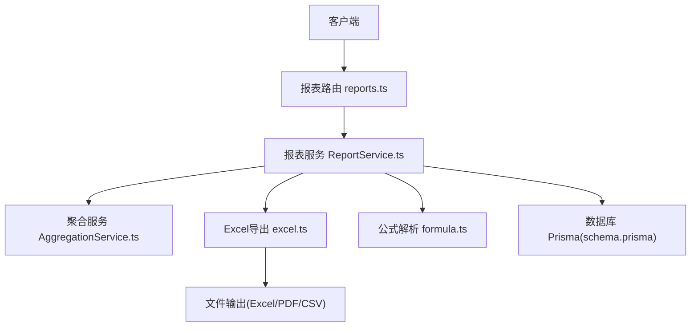
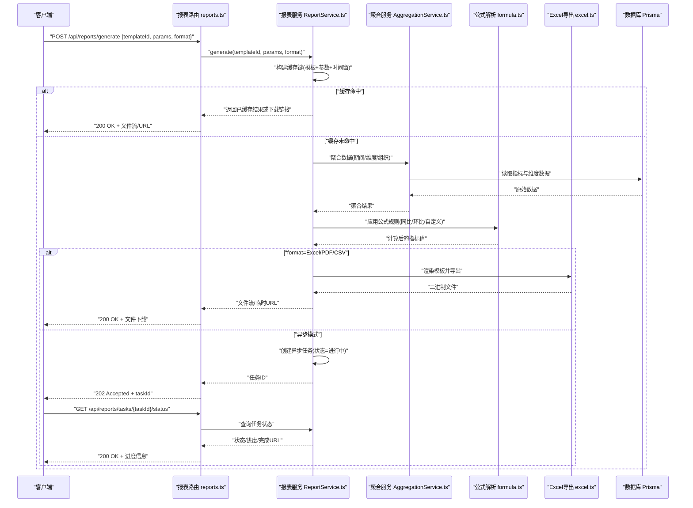
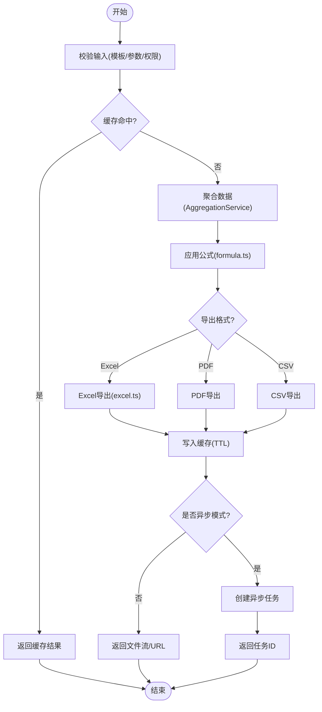
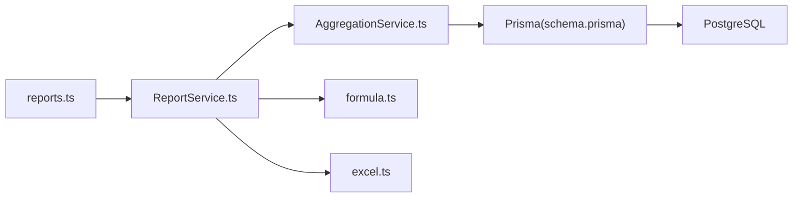

# 报表服务 (ReportService)

<cite>
**本文引用的文件**   
- [ReportService.ts](file://server/src/services/ReportService.ts)
- [reports.ts](file://server/src/routes/reports.ts)
- [AggregationService.ts](file://server/src/services/AggregationService.ts)
- [excel.ts](file://server/src/lib/excel.ts)
- [formula.ts](file://server/src/lib/formula.ts)
- [schema.prisma](file://server/prisma/schema.prisma)
- [reports-http.test.ts](file://server/src/test/reports-http.test.ts)
- [ReportService.test.ts](file://server/src/services/ReportService.test.ts)
</cite>

## 目录
1. [简介](#简介)
2. [项目结构](#项目结构)
3. [核心组件](#核心组件)
4. [架构总览](#架构总览)
5. [详细组件分析](#详细组件分析)
6. [依赖关系分析](#依赖关系分析)
7. [性能考量](#性能考量)
8. [故障排查指南](#故障排查指南)
9. [结论](#结论)
10. [附录：模板设计与API示例](#附录模板设计与api示例)

## 简介
本文件面向FY200财年经营数据分析平台的“报表服务”模块，聚焦 ReportService 的报表生成能力。内容涵盖动态报表模板、数据聚合与格式化输出、Excel导出、PDF生成与多格式支持、缓存策略、异步生成与进度跟踪机制，并提供模板设计方法与API调用示例，帮助开发者快速集成与扩展。

## 项目结构
报表相关代码主要位于后端 server 目录：
- 路由层：HTTP接口定义与参数校验
- 服务层：ReportService 负责报表编排、模板渲染、数据聚合、导出与缓存
- 工具库：Excel/PDF导出、公式解析等
- 数据模型：Prisma schema 定义指标、维度、公式规则等
- 测试：HTTP集成测试与服务单元测试

图表来源
- [reports.ts](file://server/src/routes/reports.ts)
- [ReportService.ts](file://server/src/services/ReportService.ts)
- [AggregationService.ts](file://server/src/services/AggregationService.ts)
- [excel.ts](file://server/src/lib/excel.ts)
- [formula.ts](file://server/src/lib/formula.ts)
- [schema.prisma](file://server/prisma/schema.prisma)

章节来源
- [reports.ts](file://server/src/routes/reports.ts)
- [ReportService.ts](file://server/src/services/ReportService.ts)
- [AggregationService.ts](file://server/src/services/AggregationService.ts)
- [excel.ts](file://server/src/lib/excel.ts)
- [formula.ts](file://server/src/lib/formula.ts)
- [schema.prisma](file://server/prisma/schema.prisma)

## 核心组件
- 报表路由（reports.ts）：暴露REST端点，接收报表查询参数（时间范围、组织维度、指标集合、导出格式等），并委托给 ReportService。
- 报表服务（ReportService.ts）：核心编排器，负责：
  - 动态模板解析与渲染
  - 指标计算与同比/环比（通过 AggregationService）
  - 公式规则执行（通过 formula.ts）
  - 数据聚合与分页/分片
  - 导出为Excel/PDF/CSV
  - 缓存命中与失效策略
  - 异步任务与进度跟踪
- 聚合服务（AggregationService.ts）：提供按期间、维度、组织的聚合能力，以及YTD、同比、环比等计算。
- 工具库（excel.ts、formula.ts）：Excel读写、样式与单元格公式；安全公式解析引擎（白名单算子）。
- 数据模型（schema.prisma）：指标、维度、公司、公式规则、审计日志等实体定义。

章节来源
- [ReportService.ts](file://server/src/services/ReportService.ts)
- [AggregationService.ts](file://server/src/services/AggregationService.ts)
- [excel.ts](file://server/src/lib/excel.ts)
- [formula.ts](file://server/src/lib/formula.ts)
- [schema.prisma](file://server/prisma/schema.prisma)

## 架构总览
下图展示一次报表请求从前端到后端再到导出的完整流程，包括缓存命中、异步任务与进度跟踪。

图表来源
- [reports.ts](file://server/src/routes/reports.ts)
- [ReportService.ts](file://server/src/services/ReportService.ts)
- [AggregationService.ts](file://server/src/services/AggregationService.ts)
- [formula.ts](file://server/src/lib/formula.ts)
- [excel.ts](file://server/src/lib/excel.ts)
- [schema.prisma](file://server/prisma/schema.prisma)

## 详细组件分析

### 报表服务 ReportService
职责与能力
- 动态模板渲染：根据模板ID与参数动态组装行列、分组、过滤条件与样式。
- 数据聚合：基于期间、组织、科目树进行多维度聚合，支持YTD、同比、环比。
- 公式计算：通过公式引擎对指标进行二次加工，确保安全性（白名单算子）。
- 导出引擎：统一封装Excel/PDF/CSV导出，支持分页、合并单元格、样式与标题页。
- 缓存策略：基于模板哈希、参数序列化、时间窗口生成缓存键；支持TTL与主动失效。
- 异步生成：大报表采用后台任务队列，提供任务ID与进度查询接口。

关键流程要点
- 输入校验：模板存在性、参数合法性、权限与范围检查。
- 缓存优先：命中则直接返回；未命中则进入聚合与计算。
- 导出选择：根据format决定渲染管线（Excel/PDF/CSV）。
- 异步任务：当数据量大或导出耗时较长时，切换为异步模式并返回任务ID。
- 进度跟踪：任务状态机（待处理/进行中/已完成/失败），支持轮询获取进度与下载链接。

图表来源
- [ReportService.ts](file://server/src/services/ReportService.ts)
- [AggregationService.ts](file://server/src/services/AggregationService.ts)
- [formula.ts](file://server/src/lib/formula.ts)
- [excel.ts](file://server/src/lib/excel.ts)

章节来源
- [ReportService.ts](file://server/src/services/ReportService.ts)
- [ReportService.test.ts](file://server/src/services/ReportService.test.ts)

### 路由层 reports.ts
职责
- 定义报表生成、预览、导出、任务状态查询等HTTP端点。
- 参数校验与鉴权（JWT、权限、范围）。
- 将请求委派给 ReportService，并处理响应（文件流、JSON、任务ID）。

典型端点
- POST /api/reports/generate：生成报表（同步/异步）
- GET /api/reports/tasks/:taskId/status：查询任务状态与进度
- GET /api/reports/tasks/:taskId/download：下载生成的文件

章节来源
- [reports.ts](file://server/src/routes/reports.ts)

### 聚合服务 AggregationService
职责
- 按期间、组织、科目树进行数据聚合。
- 计算YTD、同比、环比等时间序列指标。
- 提供可复用的聚合函数与维度映射。

关键点
- 使用Prisma extension实现scope隔离（如组织范围）。
- 支持增量聚合与分批查询，避免一次性加载过大数据集。

章节来源
- [AggregationService.ts](file://server/src/services/AggregationService.ts)

### 公式解析 formula.ts
职责
- 安全公式解析引擎，仅允许白名单算子（加减乘除、括号等）。
- 将模板中的公式表达式转换为可执行的计算步骤。
- 错误捕获与诊断，防止非法表达式注入。

章节来源
- [formula.ts](file://server/src/lib/formula.ts)

### Excel导出 excel.ts
职责
- 生成Excel工作簿，支持多Sheet、合并单元格、样式、冻结行、标题页。
- 支持单元格公式写入（由 formula.ts 提供安全表达式）。
- 大数据量下的流式写入与分页。

章节来源
- [excel.ts](file://server/src/lib/excel.ts)

### 数据模型 schema.prisma
职责
- 定义指标、维度、公司、公式规则、审计日志等实体。
- 支撑报表的数据源与元数据管理。

章节来源
- [schema.prisma](file://server/prisma/schema.prisma)

## 依赖关系分析
- 路由层依赖服务层，服务层依赖聚合服务、公式解析与导出库。
- 聚合服务依赖Prisma与PostgreSQL。
- 导出库依赖Excel/PDF渲染引擎。
- 缓存与任务系统可由内存缓存与消息队列实现（可扩展至Redis/队列中间件）。

图表来源
- [reports.ts](file://server/src/routes/reports.ts)
- [ReportService.ts](file://server/src/services/ReportService.ts)
- [AggregationService.ts](file://server/src/services/AggregationService.ts)
- [formula.ts](file://server/src/lib/formula.ts)
- [excel.ts](file://server/src/lib/excel.ts)
- [schema.prisma](file://server/prisma/schema.prisma)

章节来源
- [reports.ts](file://server/src/routes/reports.ts)
- [ReportService.ts](file://server/src/services/ReportService.ts)
- [AggregationService.ts](file://server/src/services/AggregationService.ts)
- [formula.ts](file://server/src/lib/formula.ts)
- [excel.ts](file://server/src/lib/excel.ts)
- [schema.prisma](file://server/prisma/schema.prisma)

## 性能考量
- 缓存策略
  - 缓存键：模板哈希 + 参数序列化 + 时间窗口
  - TTL：按报表类型设置不同过期时间
  - 失效：模板更新或基础数据变更时主动失效
- 异步生成
  - 大数据集自动切换异步模式，避免阻塞请求
  - 任务状态机：待处理/进行中/已完成/失败
  - 进度上报：百分比与阶段性摘要
- 聚合优化
  - 分批查询与增量聚合
  - 索引建议：期间、组织、科目树路径
- 导出优化
  - 流式写入减少内存占用
  - 分页与分Sheet降低单文件大小

[本节为通用指导，不直接分析具体文件]

## 故障排查指南
常见问题与定位
- 模板不存在或参数非法：检查路由参数校验与模板注册表
- 公式解析失败：查看公式白名单与表达式语法
- 聚合超时或内存溢出：调整分批大小与索引
- 导出失败：确认Excel/PDF引擎可用性与权限
- 异步任务卡住：检查任务队列与状态更新逻辑

调试建议
- 启用审计日志与Trace ID
- 在ReportService中增加关键步骤耗时统计
- 使用测试用例验证端到端流程

章节来源
- [reports-http.test.ts](file://server/src/test/reports-http.test.ts)
- [ReportService.test.ts](file://server/src/services/ReportService.test.ts)

## 结论
ReportService作为FY200报表服务的核心，提供了从模板渲染、数据聚合、公式计算到多格式导出的完整能力。通过缓存与异步机制保障性能与用户体验，结合安全公式解析与权限控制确保稳定性与合规性。建议在大规模场景下引入外部缓存与队列以进一步提升弹性与可观测性。

[本节为总结性内容，不直接分析具体文件]

## 附录：模板设计与API示例

### 模板设计要点
- 模板结构：包含标题、分组、行列维度、过滤条件、样式与公式占位符
- 动态字段：支持变量替换与条件显示
- 公式规则：通过公式引擎注入计算逻辑，避免硬编码
- 版本管理：模板变更需触发缓存失效

### API调用示例（概念性）
- 生成报表（同步）
  - 方法：POST /api/reports/generate
  - 请求体：{ templateId, params, format }
  - 响应：文件流或下载URL
- 生成报表（异步）
  - 方法：POST /api/reports/generate
  - 请求体：{ templateId, params, format, async: true }
  - 响应：{ taskId }
- 查询任务状态
  - 方法：GET /api/reports/tasks/:taskId/status
  - 响应：{ status, progress, downloadUrl? }
- 下载文件
  - 方法：GET /api/reports/tasks/:taskId/download
  - 响应：文件二进制流

章节来源
- [reports.ts](file://server/src/routes/reports.ts)
- [ReportService.ts](file://server/src/services/ReportService.ts)
- [reports-http.test.ts](file://server/src/test/reports-http.test.ts)