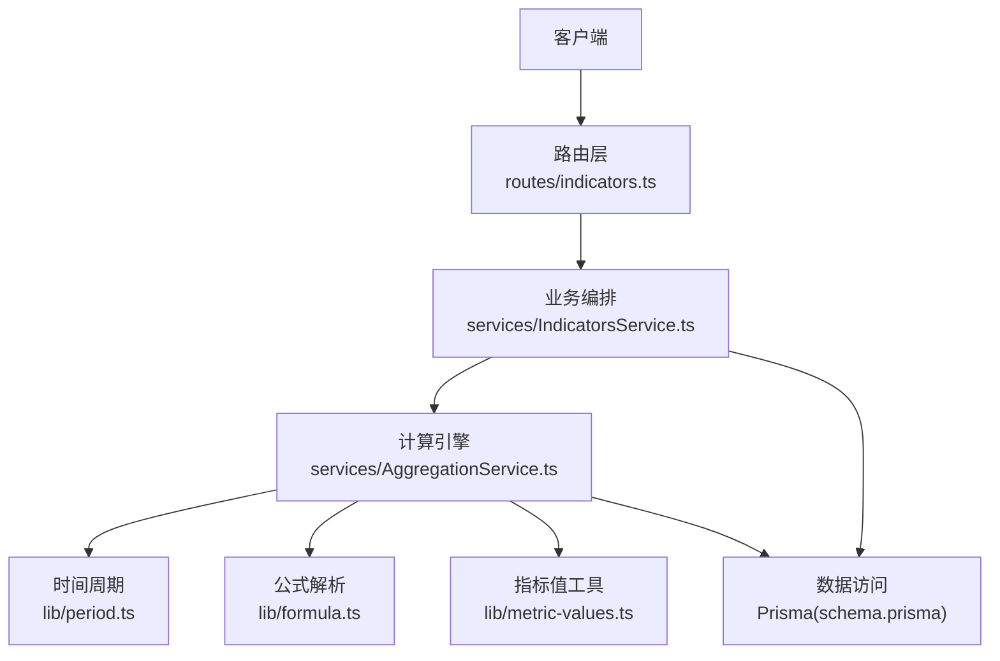
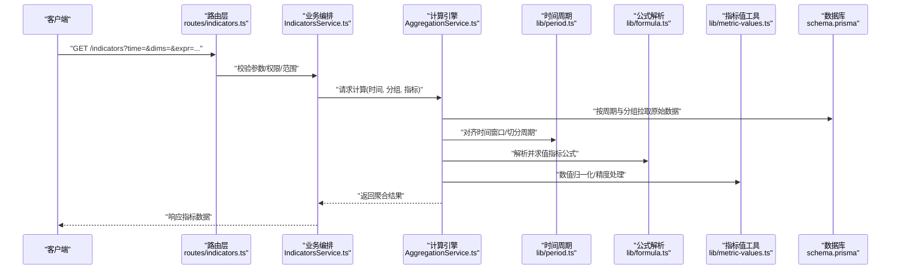
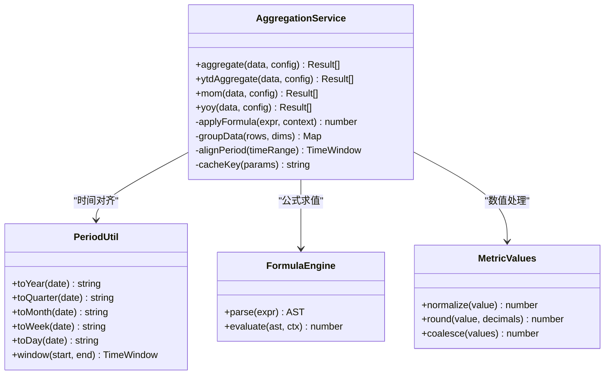
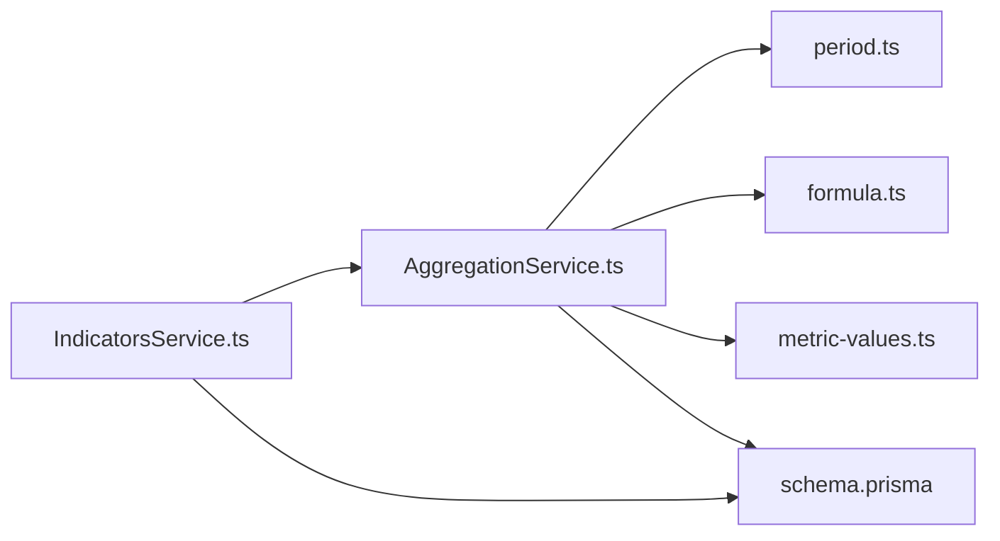

# 指标计算服务 (AggregationService)

<cite>
**本文引用的文件**   
- [AggregationService.ts](file://server/src/services/AggregationService.ts)
- [AggregationService.calc.test.ts](file://server/src/services/AggregationService.calc.test.ts)
- [AggregationService.static.test.ts](file://server/src/services/AggregationService.static.test.ts)
- [AggregationService.ytd.test.ts](file://server/src/services/AggregationService.ytd.test.ts)
- [period.ts](file://server/src/lib/period.ts)
- [formula.ts](file://server/src/lib/formula.ts)
- [metric-values.ts](file://server/src/lib/metric-values.ts)
- [IndicatorsService.ts](file://server/src/services/IndicatorsService.ts)
- [indicators.ts](file://server/src/routes/indicators.ts)
- [schema.prisma](file://server/prisma/schema.prisma)
</cite>

## 目录
1. [简介](#简介)
2. [项目结构](#项目结构)
3. [核心组件](#核心组件)
4. [架构总览](#架构总览)
5. [详细组件分析](#详细组件分析)
6. [依赖关系分析](#依赖关系分析)
7. [性能考量](#性能考量)
8. [故障排查指南](#故障排查指南)
9. [结论](#结论)
10. [附录](#附录)

## 简介
本文件面向FY200财年经营数据分析平台的“指标计算服务”，重点解析 AggregationService 的多维度指标计算引擎。内容涵盖：
- 同比/环比实时计算（不存库，后端即时计算）
- YTD累计计算与时间周期处理
- 自定义聚合函数与指标公式解析（安全白名单算子）
- 数据分组策略、缓存机制与错误恢复策略
- 指标配置示例与查询接口使用方法

平台定位与约束：
- Excel进、看板/报表出；单位统一为万元/人民币
- 后端技术栈：Express 4 + Prisma 5 + PostgreSQL 15 + JWT + DeepSeek API（SSE流式）
- 中间件执行链顺序：helmet → cors → express.json → rate-limit → auth(JWT+黑名单) → permission(默认拒绝) → scope(Prisma extension) → softDelete → audit → Service → Prisma → PostgreSQL
- 计算类指标使用安全公式解析（白名单算子 +-*/()，禁止 eval），同比/环比由后端实时计算不存库

## 项目结构
围绕指标计算的核心代码主要位于 server/src/services 与 server/src/lib 目录：
- services/AggregationService.ts：多维度指标计算引擎（同比/环比/YTD/自定义聚合）
- lib/period.ts：时间周期工具（年/季/月/周/日等）
- lib/formula.ts：安全公式解析器（白名单算子）
- lib/metric-values.ts：指标值类型与转换工具
- routes/indicators.ts：指标查询API路由
- services/IndicatorsService.ts：指标业务编排层
- prisma/schema.prisma：数据库模型定义（指标、公式规则、主题树等）

图表来源
- [indicators.ts](file://server/src/routes/indicators.ts)
- [IndicatorsService.ts](file://server/src/services/IndicatorsService.ts)
- [AggregationService.ts](file://server/src/services/AggregationService.ts)
- [period.ts](file://server/src/lib/period.ts)
- [formula.ts](file://server/src/lib/formula.ts)
- [metric-values.ts](file://server/src/lib/metric-values.ts)
- [schema.prisma](file://server/prisma/schema.prisma)

章节来源
- [AggregationService.ts](file://server/src/services/AggregationService.ts)
- [period.ts](file://server/src/lib/period.ts)
- [formula.ts](file://server/src/lib/formula.ts)
- [metric-values.ts](file://server/src/lib/metric-values.ts)
- [IndicatorsService.ts](file://server/src/services/IndicatorsService.ts)
- [indicators.ts](file://server/src/routes/indicators.ts)
- [schema.prisma](file://server/prisma/schema.prisma)

## 核心组件
- AggregationService：提供多维指标计算能力，包括基础聚合、同比/环比、YTD累计、自定义聚合函数与公式组合。
- period：时间周期抽象与对齐（财年、季度、月度、周、日）、窗口切分、边界处理。
- formula：安全公式解析与求值（仅允许 +-*/() 等白名单算子），支持变量替换与上下文注入。
- metric-values：数值类型归一化、空值处理、精度控制与单位换算（万元）。
- IndicatorsService：对外暴露的指标查询编排，负责参数校验、权限与范围过滤、结果组装。
- indicators 路由：HTTP接口定义，接收查询参数并调用业务服务。

章节来源
- [AggregationService.ts](file://server/src/services/AggregationService.ts)
- [period.ts](file://server/src/lib/period.ts)
- [formula.ts](file://server/src/lib/formula.ts)
- [metric-values.ts](file://server/src/lib/metric-values.ts)
- [IndicatorsService.ts](file://server/src/services/IndicatorsService.ts)
- [indicators.ts](file://server/src/routes/indicators.ts)

## 架构总览
指标计算的整体流程如下：
- 客户端通过 /indicators 接口发起查询（时间范围、维度分组、指标表达式、是否计算同比/环比/YTD等）
- 路由层鉴权与限流后，进入 IndicatorsService 进行参数校验与范围裁剪
- AggregationService 根据时间周期与分组策略拉取数据，执行聚合、公式求值、同比/环比与YTD计算
- 结果经 metric-values 标准化后返回

图表来源
- [indicators.ts](file://server/src/routes/indicators.ts)
- [IndicatorsService.ts](file://server/src/services/IndicatorsService.ts)
- [AggregationService.ts](file://server/src/services/AggregationService.ts)
- [period.ts](file://server/src/lib/period.ts)
- [formula.ts](file://server/src/lib/formula.ts)
- [metric-values.ts](file://server/src/lib/metric-values.ts)
- [schema.prisma](file://server/prisma/schema.prisma)

## 详细组件分析

### AggregationService 计算引擎
职责与能力：
- 基础聚合：SUM/COUNT/AVG/MIN/MAX 等，支持多字段组合
- 同比/环比：基于 period 对齐历史周期，实时计算增长率
- YTD累计：按财年/自然年累计求和或聚合
- 自定义聚合函数：通过公式引擎组合多个指标与算子
- 数据分组：按公司、部门、科目、时间粒度等多维分组
- 缓存与容错：对热点查询结果做短期缓存；异常降级与重试

关键设计要点：
- 时间周期处理：统一将输入时间转换为标准周期（年/季/月/周/日），并对齐起止边界
- 分组策略：先按维度分组，再按时间窗口聚合，避免重复扫描
- 公式解析：仅允许白名单算子，防止任意代码执行风险
- 指标值处理：统一单位（万元）、处理空值与NaN、控制小数位数

图表来源
- [AggregationService.ts](file://server/src/services/AggregationService.ts)
- [period.ts](file://server/src/lib/period.ts)
- [formula.ts](file://server/src/lib/formula.ts)
- [metric-values.ts](file://server/src/lib/metric-values.ts)

章节来源
- [AggregationService.ts](file://server/src/services/AggregationService.ts)
- [AggregationService.calc.test.ts](file://server/src/services/AggregationService.calc.test.ts)
- [AggregationService.static.test.ts](file://server/src/services/AggregationService.static.test.ts)
- [AggregationService.ytd.test.ts](file://server/src/services/AggregationService.ytd.test.ts)

### 时间周期处理（period.ts）
- 支持的周期：年、季度、月、周、日
- 功能：日期到周期字符串转换、时间窗口生成、边界对齐（如月初/月末、季度初/末）
- 应用场景：同比/环比需要严格对齐历史周期；YTD需按财年或自然年累计

章节来源
- [period.ts](file://server/src/lib/period.ts)

### 指标公式解析（formula.ts）
- 安全白名单：仅允许 +-*/() 等基础算子，禁止 eval 与危险函数
- 解析流程：词法分析→语法树构建→上下文变量替换→求值
- 上下文变量：来自分组键与当前周期的指标值（如 revenue_q1、cost_q2）
- 错误处理：非法表达式、除零、溢出等均有明确错误码与降级策略

章节来源
- [formula.ts](file://server/src/lib/formula.ts)

### 指标值处理（metric-values.ts）
- 数值归一化：统一单位（万元）、处理空值与NaN
- 精度控制：四舍五入至指定小数位
- 聚合兼容：与 SUM/COUNT/AVG 等聚合函数无缝对接

章节来源
- [metric-values.ts](file://server/src/lib/metric-values.ts)

### 指标查询编排（IndicatorsService.ts）
- 参数校验：时间范围合法性、维度有效性、指标表达式安全性
- 权限与范围：结合JWT与scope扩展，限制可访问公司与科目
- 结果组装：合并基础聚合、同比/环比、YTD与自定义公式结果

章节来源
- [IndicatorsService.ts](file://server/src/services/IndicatorsService.ts)

### 指标查询接口（routes/indicators.ts）
- 接口路径：/indicators
- 常用参数：
  - time：时间范围（如 2024Q1~2024Q3）
  - dims：分组维度（如 company, subject, month）
  - expr：指标表达式（如 revenue - cost）
  - ytd：是否计算YTD累计
  - mom/yoy：是否计算环比/同比
- 返回结构：包含各分组下的指标值、同比/环比、YTD累计等

章节来源
- [indicators.ts](file://server/src/routes/indicators.ts)

## 依赖关系分析
- AggregationService 依赖 period、formula、metric-values 三个核心库
- IndicatorsService 作为编排层，协调路由与计算引擎
- 所有数据访问通过 Prisma 与 schema.prisma 定义的模型进行

图表来源
- [IndicatorsService.ts](file://server/src/services/IndicatorsService.ts)
- [AggregationService.ts](file://server/src/services/AggregationService.ts)
- [period.ts](file://server/src/lib/period.ts)
- [formula.ts](file://server/src/lib/formula.ts)
- [metric-values.ts](file://server/src/lib/metric-values.ts)
- [schema.prisma](file://server/prisma/schema.prisma)

章节来源
- [IndicatorsService.ts](file://server/src/services/IndicatorsService.ts)
- [AggregationService.ts](file://server/src/services/AggregationService.ts)
- [schema.prisma](file://server/prisma/schema.prisma)

## 性能考量
- 时间窗口预对齐：在拉取数据前完成周期对齐，减少后续计算开销
- 分组优先：先按维度分组，再按时间窗口聚合，降低重复扫描
- 公式求值优化：AST缓存与上下文复用，避免重复解析
- 缓存机制：对热点查询（相同时间范围与分组）启用短期内存缓存
- 并发控制：对高负载场景采用限流与队列，避免数据库压力过大
- 增量更新：对于YTD累计，尽量利用上次结果增量计算

[本节为通用性能建议，不直接分析具体文件]

## 故障排查指南
常见问题与处理：
- 指标表达式非法：检查公式是否包含非白名单字符，确认变量名正确
- 同比/环比结果为空：确认时间范围是否完整覆盖历史周期，检查数据缺失
- YTD累计异常：确认财年设置与自然年差异，检查累计起始点
- 数值精度问题：调整小数位数，检查单位换算是否正确
- 权限不足：检查JWT与scope配置，确认用户可访问的公司与科目范围

章节来源
- [AggregationService.calc.test.ts](file://server/src/services/AggregationService.calc.test.ts)
- [AggregationService.static.test.ts](file://server/src/services/AggregationService.static.test.ts)
- [AggregationService.ytd.test.ts](file://server/src/services/AggregationService.ytd.test.ts)

## 结论
AggregationService 作为FY200指标计算的核心引擎，提供了强大的多维度指标计算能力。通过安全公式解析、精确时间周期处理与高效分组策略，实现了高性能的同比/环比与YTD累计计算。配合完善的错误恢复与缓存机制，确保了系统的稳定性与可扩展性。

[本节为总结性内容，不直接分析具体文件]

## 附录

### 指标配置示例
- 基础聚合：
  - 指标：收入
  - 分组：公司、季度
  - 时间：2024Q1~2024Q3
- 自定义公式：
  - 指标：利润 = 收入 - 成本
  - 分组：部门、月份
  - 时间：2024年全年度
- 同比/环比：
  - 开启 yoy/mom
  - 时间：2024Q1~2024Q3
- YTD累计：
  - 开启 ytd
  - 时间：2024年全年度

[本节为概念性说明，不直接分析具体文件]

### 查询接口使用方法
- 接口：GET /indicators
- 参数：
  - time：时间范围（如 2024Q1~2024Q3）
  - dims：分组维度（如 company,subject,month）
  - expr：指标表达式（如 revenue - cost）
  - ytd：是否计算YTD累计（true/false）
  - mom/yoy：是否计算环比/同比（true/false）
- 返回：包含各分组下的指标值、同比/环比、YTD累计等

章节来源
- [indicators.ts](file://server/src/routes/indicators.ts)