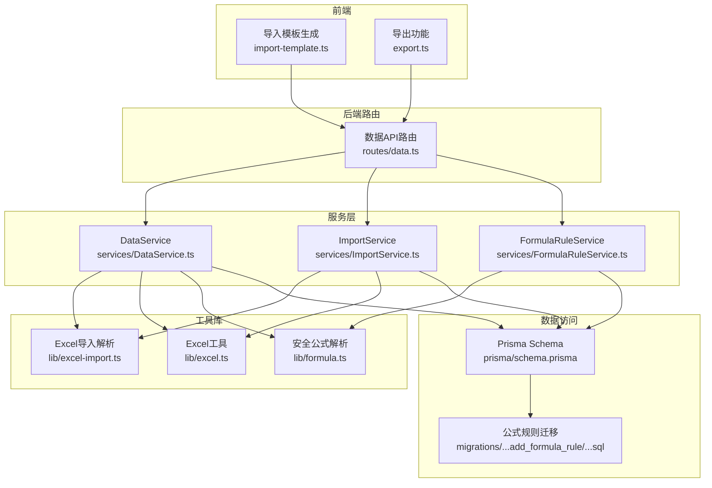
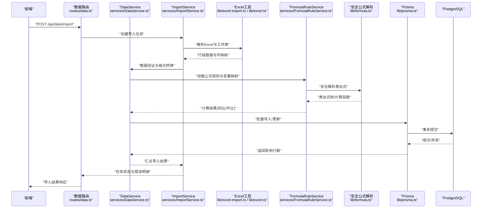
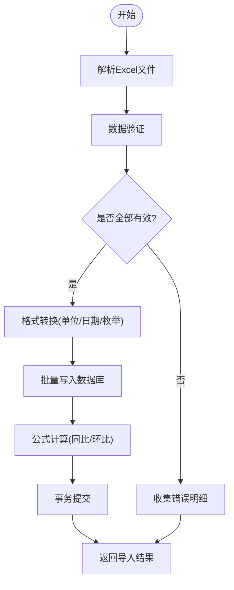
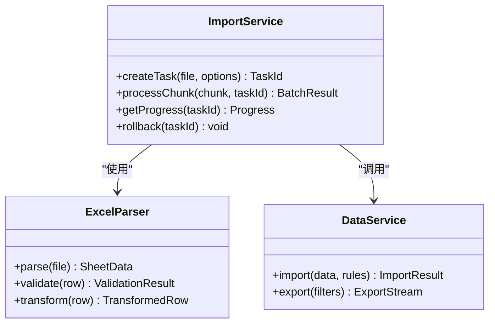
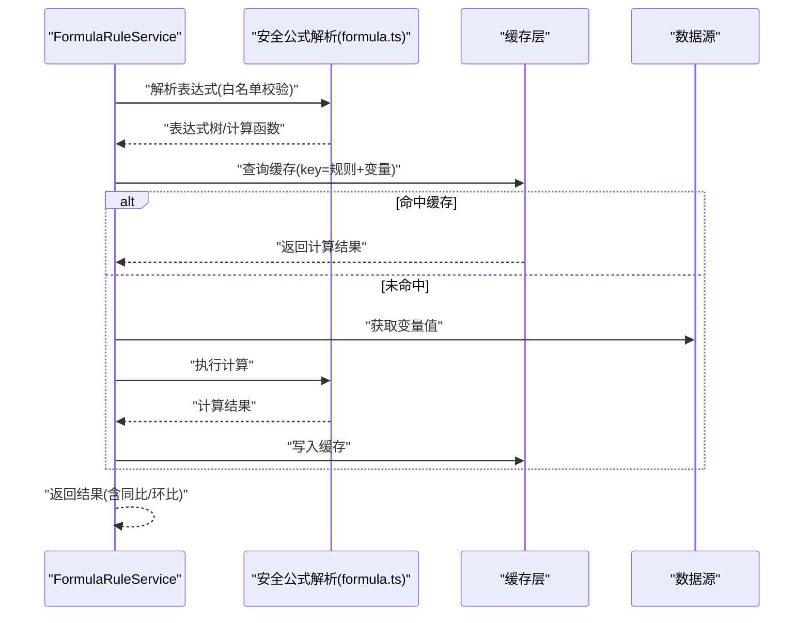
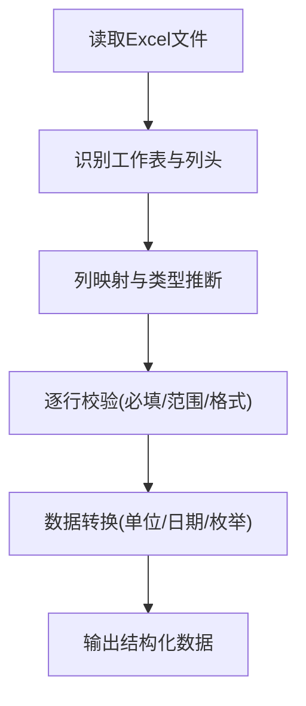
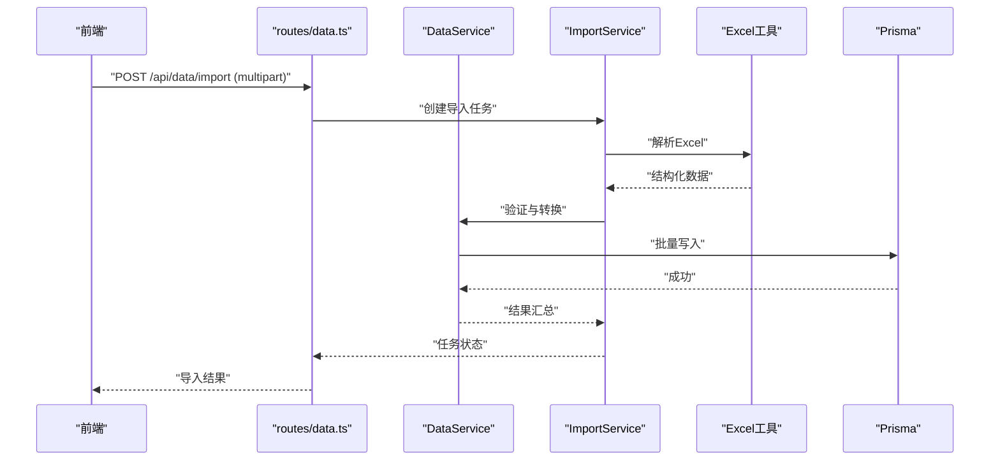
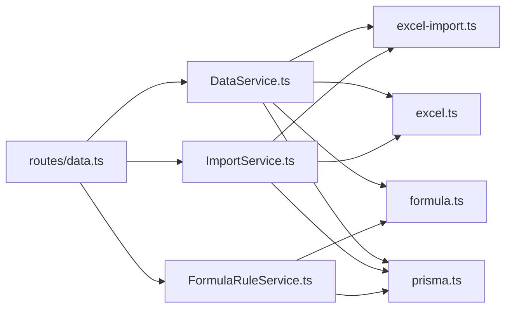

# 数据管理服务 (DataService)

<cite>
**本文引用的文件**   
- [server/src/services/DataService.ts](file://server/src/services/DataService.ts)
- [server/src/services/ImportService.ts](file://server/src/services/ImportService.ts)
- [server/src/lib/excel-import.ts](file://server/src/lib/excel-import.ts)
- [server/src/lib/excel.ts](file://server/src/lib/excel.ts)
- [server/src/lib/formula.ts](file://server/src/lib/formula.ts)
- [server/src/services/FormulaRuleService.ts](file://server/src/services/FormulaRuleService.ts)
- [server/src/routes/data.ts](file://server/src/routes/data.ts)
- [server/src/middleware/error-handler.ts](file://server/src/middleware/error-handler.ts)
- [server/src/lib/errors.ts](file://server/src/lib/errors.ts)
- [server/src/lib/prisma.ts](file://server/src/lib/prisma.ts)
- [server/prisma/schema.prisma](file://server/prisma/schema.prisma)
- [server/prisma/migrations/20260722142144_add_formula_rule/migration.sql](file://server/prisma/migrations/20260722142144_add_formula_rule/migration.sql)
- [web/src/lib/import-template.ts](file://web/src/lib/import-template.ts)
- [web/src/lib/export.ts](file://web/src/lib/export.ts)
</cite>

## 目录
1. [简介](#简介)
2. [项目结构](#项目结构)
3. [核心组件](#核心组件)
4. [架构总览](#架构总览)
5. [详细组件分析](#详细组件分析)
6. [依赖关系分析](#依赖关系分析)
7. [性能考量](#性能考量)
8. [故障排查指南](#故障排查指南)
9. [结论](#结论)
10. [附录](#附录)

## 简介
本文件面向FY200数据管理服务（DataService），聚焦数据导入导出、公式规则引擎与数据完整性保障。系统遵循“Excel进、看板/报表出”的设计目标，单位统一为万元/人民币，计算类指标通过安全公式解析（白名单算子）实时计算，不持久化中间结果。整体后端技术栈为Express + Prisma + PostgreSQL，结合JWT鉴权与权限控制中间件链，确保数据安全与可审计。

## 项目结构
围绕数据管理的关键代码分布在服务端服务层、工具库、路由与数据库定义中：
- 服务层：DataService负责数据主流程编排；ImportService负责导入任务编排；FormulaRuleService负责公式规则管理与执行上下文。
- 工具库：excel-import与excel负责Excel解析、校验与转换；formula实现安全公式解析与计算。
- 路由层：data.ts暴露数据导入/导出、公式规则等API。
- 数据库：schema.prisma与迁移脚本定义数据模型与索引策略。
- 前端：import-template与export.ts提供导入模板生成与导出能力。

**图表来源** 
- [server/src/routes/data.ts](file://server/src/routes/data.ts)
- [server/src/services/DataService.ts](file://server/src/services/DataService.ts)
- [server/src/services/ImportService.ts](file://server/src/services/ImportService.ts)
- [server/src/services/FormulaRuleService.ts](file://server/src/services/FormulaRuleService.ts)
- [server/src/lib/excel-import.ts](file://server/src/lib/excel-import.ts)
- [server/src/lib/excel.ts](file://server/src/lib/excel.ts)
- [server/src/lib/formula.ts](file://server/src/lib/formula.ts)
- [server/prisma/schema.prisma](file://server/prisma/schema.prisma)
- [server/prisma/migrations/20260722142144_add_formula_rule/migration.sql](file://server/prisma/migrations/20260722142144_add_formula_rule/migration.sql)

**章节来源**
- [server/src/routes/data.ts](file://server/src/routes/data.ts)
- [server/src/services/DataService.ts](file://server/src/services/DataService.ts)
- [server/src/services/ImportService.ts](file://server/src/services/ImportService.ts)
- [server/src/services/FormulaRuleService.ts](file://server/src/services/FormulaRuleService.ts)
- [server/src/lib/excel-import.ts](file://server/src/lib/excel-import.ts)
- [server/src/lib/excel.ts](file://server/src/lib/excel.ts)
- [server/src/lib/formula.ts](file://server/src/lib/formula.ts)
- [server/prisma/schema.prisma](file://server/prisma/schema.prisma)
- [server/prisma/migrations/20260722142144_add_formula_rule/migration.sql](file://server/prisma/migrations/20260722142144_add_formula_rule/migration.sql)

## 核心组件
- DataService：数据导入导出的主入口，协调Excel解析、数据验证、格式转换、批量写入与公式计算。
- ImportService：导入任务编排器，支持分片处理、错误隔离、进度反馈与事务边界控制。
- FormulaRuleService：公式规则管理，维护白名单算子、变量映射、缓存策略与执行上下文。
- Excel工具库：excel-import与excel负责读取工作表、列映射、类型转换、空值与范围校验。
- 安全公式解析：formula基于白名单算子构建表达式树，禁止eval，支持实时计算与结果缓存。

**章节来源**
- [server/src/services/DataService.ts](file://server/src/services/DataService.ts)
- [server/src/services/ImportService.ts](file://server/src/services/ImportService.ts)
- [server/src/services/FormulaRuleService.ts](file://server/src/services/FormulaRuleService.ts)
- [server/src/lib/excel-import.ts](file://server/src/lib/excel-import.ts)
- [server/src/lib/excel.ts](file://server/src/lib/excel.ts)
- [server/src/lib/formula.ts](file://server/src/lib/formula.ts)

## 架构总览
数据导入导出与公式计算的端到端流程如下：
- 前端通过data路由发起导入/导出请求。
- 路由层调用对应服务（DataService/ImportService/FormulaRuleService）。
- 服务层使用Excel工具解析文件、进行数据验证与格式转换。
- 公式规则服务根据白名单算子与安全解析器计算指标，必要时启用缓存。
- 数据访问层通过Prisma与PostgreSQL完成持久化或查询。

**图表来源** 
- [server/src/routes/data.ts](file://server/src/routes/data.ts)
- [server/src/services/DataService.ts](file://server/src/services/DataService.ts)
- [server/src/services/ImportService.ts](file://server/src/services/ImportService.ts)
- [server/src/lib/excel-import.ts](file://server/src/lib/excel-import.ts)
- [server/src/lib/excel.ts](file://server/src/lib/excel.ts)
- [server/src/services/FormulaRuleService.ts](file://server/src/services/FormulaRuleService.ts)
- [server/src/lib/formula.ts](file://server/src/lib/formula.ts)
- [server/src/lib/prisma.ts](file://server/src/lib/prisma.ts)

## 详细组件分析

### 数据导入导出（DataService）
- 职责：接收导入请求，协调Excel解析、数据校验、格式转换、批量写入与公式计算；导出时按维度聚合并生成Excel。
- 关键流程：
  - 解析Excel：读取工作表、识别列头、建立列映射、提取数值与文本。
  - 数据验证：必填字段检查、数值范围校验、重复键检测、时间格式校验。
  - 格式转换：统一单位为万元，日期标准化，枚举映射。
  - 批量操作：分批次写入，错误隔离，回滚策略。
  - 公式计算：调用公式规则服务，实时计算同比/环比等指标。
- 错误处理：记录每行错误原因，支持部分成功与重试机制。

**图表来源** 
- [server/src/services/DataService.ts](file://server/src/services/DataService.ts)
- [server/src/lib/excel-import.ts](file://server/src/lib/excel-import.ts)
- [server/src/lib/excel.ts](file://server/src/lib/excel.ts)
- [server/src/lib/formula.ts](file://server/src/lib/formula.ts)

**章节来源**
- [server/src/services/DataService.ts](file://server/src/services/DataService.ts)
- [server/src/lib/excel-import.ts](file://server/src/lib/excel-import.ts)
- [server/src/lib/excel.ts](file://server/src/lib/excel.ts)

### 导入任务编排（ImportService）
- 职责：管理导入生命周期，包括任务创建、分片处理、进度上报、错误隔离与最终状态。
- 关键特性：
  - 分片处理：将大文件拆分为多个批次，避免内存溢出。
  - 错误隔离：单行失败不影响其他行，记录错误位置与原因。
  - 事务边界：每个批次在独立事务中执行，保证一致性。
  - 进度反馈：实时更新任务状态，便于前端展示。

**图表来源** 
- [server/src/services/ImportService.ts](file://server/src/services/ImportService.ts)
- [server/src/lib/excel-import.ts](file://server/src/lib/excel-import.ts)
- [server/src/services/DataService.ts](file://server/src/services/DataService.ts)

**章节来源**
- [server/src/services/ImportService.ts](file://server/src/services/ImportService.ts)

### 公式规则引擎（FormulaRuleService + formula）
- 职责：维护公式规则、变量映射、白名单算子与缓存策略；提供安全解析与实时计算。
- 关键特性：
  - 白名单算子：仅允许+-*/()等基础运算，禁止eval与危险函数。
  - 表达式树：将字符串表达式解析为AST，便于校验与优化。
  - 实时计算：同比/环比等指标由后端实时计算，不存库。
  - 缓存策略：对稳定输入的结果进行缓存，提升性能。
  - 错误处理：语法错误、变量缺失、除零等异常捕获与提示。

**图表来源** 
- [server/src/services/FormulaRuleService.ts](file://server/src/services/FormulaRuleService.ts)
- [server/src/lib/formula.ts](file://server/src/lib/formula.ts)

**章节来源**
- [server/src/services/FormulaRuleService.ts](file://server/src/services/FormulaRuleService.ts)
- [server/src/lib/formula.ts](file://server/src/lib/formula.ts)

### Excel解析与验证（excel-import + excel）
- 职责：读取Excel文件，识别工作表与列头，进行数据类型转换与校验。
- 关键特性：
  - 多工作表支持：自动识别首行为列头，支持合并单元格处理。
  - 类型转换：数值、日期、布尔值与文本的自动推断与转换。
  - 校验规则：必填、范围、格式、唯一性约束。
  - 错误定位：精确到行列号，便于用户修正。

**图表来源** 
- [server/src/lib/excel-import.ts](file://server/src/lib/excel-import.ts)
- [server/src/lib/excel.ts](file://server/src/lib/excel.ts)

**章节来源**
- [server/src/lib/excel-import.ts](file://server/src/lib/excel-import.ts)
- [server/src/lib/excel.ts](file://server/src/lib/excel.ts)

### API使用示例（routes/data.ts）
- 导入接口：POST /api/data/import，支持multipart/form-data上传Excel，返回任务ID与进度。
- 导出接口：GET /api/data/export，支持过滤条件与维度选择，返回Excel流。
- 公式规则接口：CRUD公式规则，支持白名单配置与变量映射。

**图表来源** 
- [server/src/routes/data.ts](file://server/src/routes/data.ts)
- [server/src/services/DataService.ts](file://server/src/services/DataService.ts)
- [server/src/services/ImportService.ts](file://server/src/services/ImportService.ts)
- [server/src/lib/excel-import.ts](file://server/src/lib/excel-import.ts)
- [server/src/lib/prisma.ts](file://server/src/lib/prisma.ts)

**章节来源**
- [server/src/routes/data.ts](file://server/src/routes/data.ts)

## 依赖关系分析
- 服务层依赖工具库：DataService与ImportService依赖excel-import与excel进行文件解析；FormulaRuleService依赖formula进行表达式解析。
- 数据访问依赖Prisma：所有服务通过Prisma与PostgreSQL交互，确保类型安全与事务一致性。
- 路由层与服务层解耦：routes/data.ts仅负责参数校验与调用服务，业务逻辑集中在服务层。

**图表来源** 
- [server/src/routes/data.ts](file://server/src/routes/data.ts)
- [server/src/services/DataService.ts](file://server/src/services/DataService.ts)
- [server/src/services/ImportService.ts](file://server/src/services/ImportService.ts)
- [server/src/services/FormulaRuleService.ts](file://server/src/services/FormulaRuleService.ts)
- [server/src/lib/excel-import.ts](file://server/src/lib/excel-import.ts)
- [server/src/lib/excel.ts](file://server/src/lib/excel.ts)
- [server/src/lib/formula.ts](file://server/src/lib/formula.ts)
- [server/src/lib/prisma.ts](file://server/src/lib/prisma.ts)

**章节来源**
- [server/src/routes/data.ts](file://server/src/routes/data.ts)
- [server/src/lib/prisma.ts](file://server/src/lib/prisma.ts)

## 性能考量
- 分片处理：大文件导入采用分片策略，降低内存占用与超时风险。
- 批量写入：使用Prisma的批量操作减少数据库往返次数。
- 公式缓存：对稳定输入的结果进行缓存，避免重复计算。
- 异步处理：导入任务异步执行，前端轮询进度，提升用户体验。
- 索引优化：针对常用查询字段建立索引，提升导出与报表性能。

[本节为通用指导，无需特定文件引用]

## 故障排查指南
- 常见错误：
  - Excel解析失败：检查文件格式、列头命名与编码。
  - 数据验证失败：核对必填字段、数值范围与日期格式。
  - 公式解析错误：确认白名单算子与变量映射是否正确。
  - 事务失败：检查数据库连接与锁竞争情况。
- 调试建议：
  - 查看错误日志与堆栈信息。
  - 使用测试用例复现问题。
  - 逐步禁用功能模块定位根因。

**章节来源**
- [server/src/middleware/error-handler.ts](file://server/src/middleware/error-handler.ts)
- [server/src/lib/errors.ts](file://server/src/lib/errors.ts)

## 结论
FY200数据管理服务通过清晰的分层架构与模块化设计，实现了高效的Excel导入导出、安全的公式计算与可靠的数据完整性保障。未来可进一步优化缓存策略、扩展更多校验规则与提升并发处理能力。

[本节为总结性内容，无需特定文件引用]

## 附录
- 数据模型：参考schema.prisma与迁移脚本了解数据结构。
- 导入模板：前端import-template.ts提供标准模板下载与生成。
- 导出功能：前端export.ts支持多维度导出与格式化。

**章节来源**
- [server/prisma/schema.prisma](file://server/prisma/schema.prisma)
- [server/prisma/migrations/20260722142144_add_formula_rule/migration.sql](file://server/prisma/migrations/20260722142144_add_formula_rule/migration.sql)
- [web/src/lib/import-template.ts](file://web/src/lib/import-template.ts)
- [web/src/lib/export.ts](file://web/src/lib/export.ts)