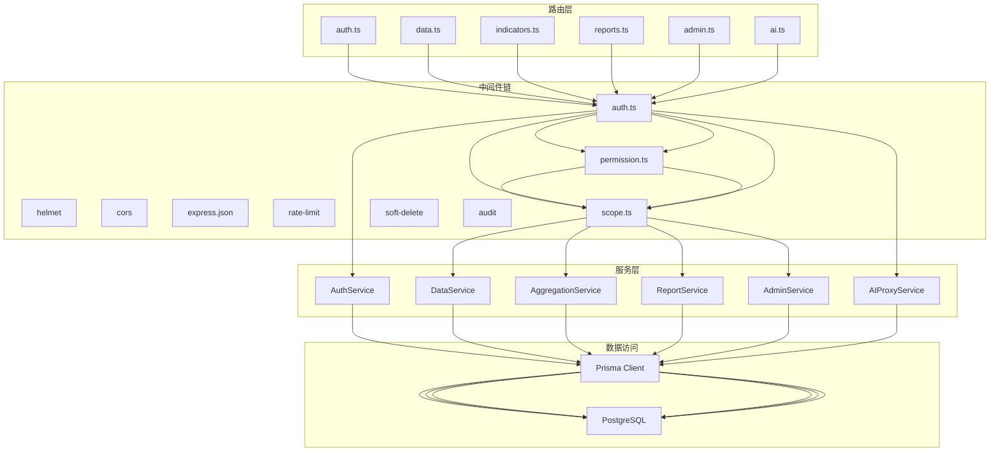
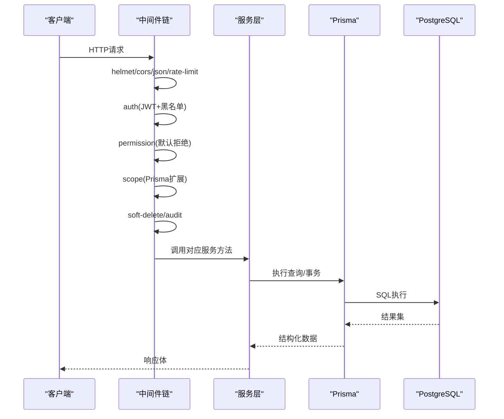
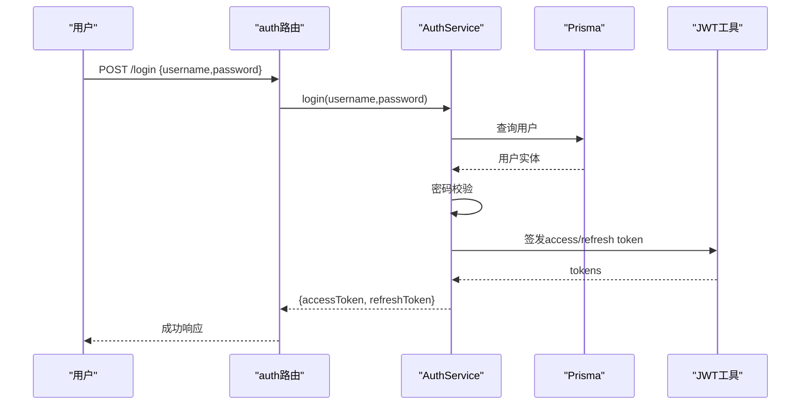
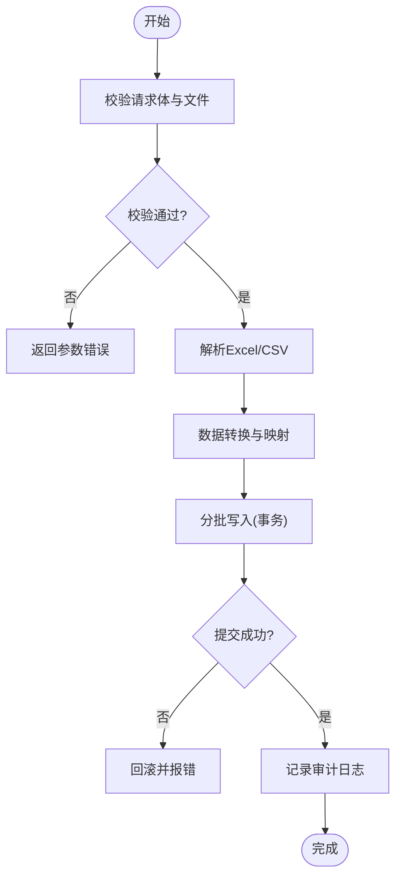
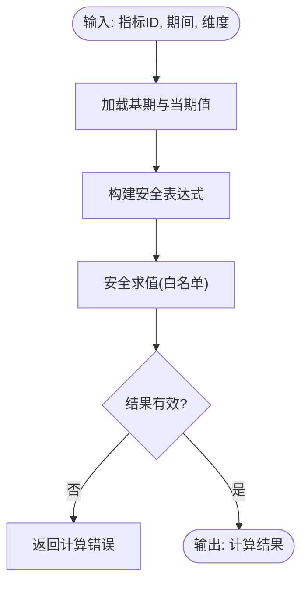
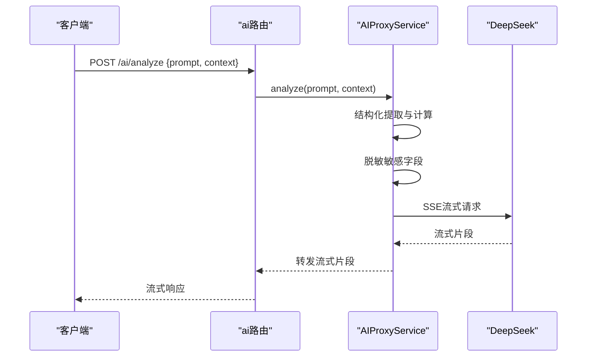
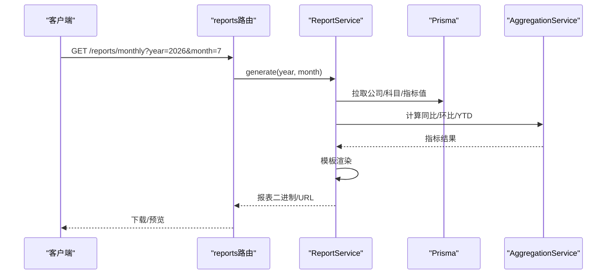
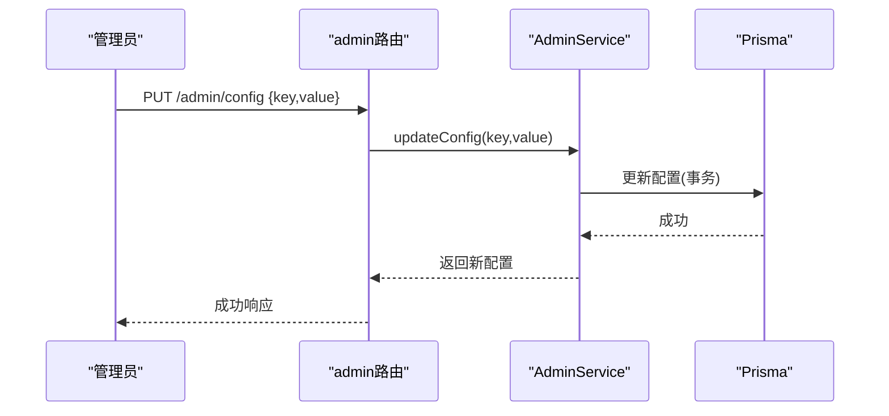
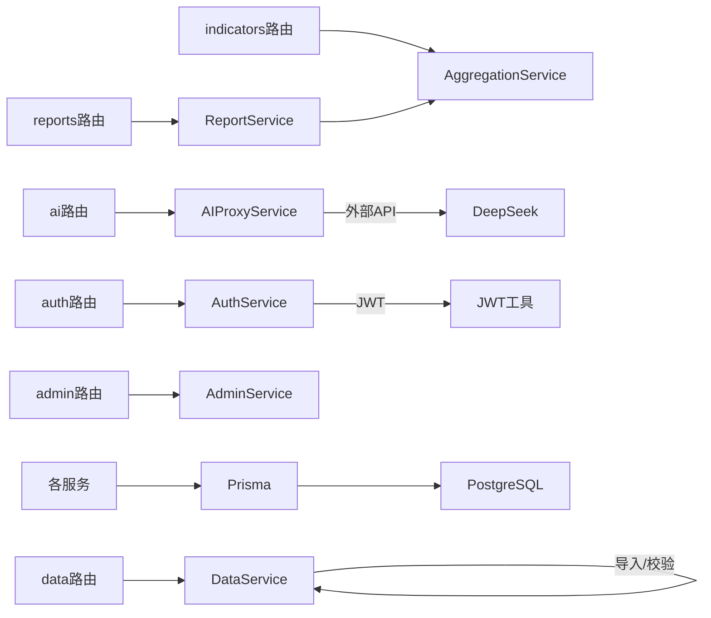

# 服务层设计

<cite>
**本文引用的文件**   
- [server/src/app.ts](file://server/src/app.ts)
- [server/src/server.ts](file://server/src/server.ts)
- [server/src/middleware/auth.ts](file://server/src/middleware/auth.ts)
- [server/src/middleware/permission.ts](file://server/src/middleware/permission.ts)
- [server/src/middleware/scope.ts](file://server/src/middleware/scope.ts)
- [server/src/middleware/error-handler.ts](file://server/src/middleware/error-handler.ts)
- [server/src/lib/errors.ts](file://server/src/lib/errors.ts)
- [server/src/lib/prisma.ts](file://server/src/lib/prisma.ts)
- [server/src/services/AuthService.ts](file://server/src/services/AuthService.ts)
- [server/src/services/DataService.ts](file://server/src/services/DataService.ts)
- [server/src/services/AggregationService.ts](file://server/src/services/AggregationService.ts)
- [server/src/services/AIProxyService.ts](file://server/src/services/AIProxyService.ts)
- [server/src/services/ReportService.ts](file://server/src/services/ReportService.ts)
- [server/src/services/AdminService.ts](file://server/src/services/AdminService.ts)
- [server/src/routes/auth.ts](file://server/src/routes/auth.ts)
- [server/src/routes/data.ts](file://server/src/routes/data.ts)
- [server/src/routes/indicators.ts](file://server/src/routes/indicators.ts)
- [server/src/routes/reports.ts](file://server/src/routes/reports.ts)
- [server/src/routes/admin.ts](file://server/src/routes/admin.ts)
- [server/src/routes/ai.ts](file://server/src/routes/ai.ts)
- [server/src/lib/formula.ts](file://server/src/lib/formula.ts)
- [server/src/lib/jwt.ts](file://server/src/lib/jwt.ts)
- [server/src/lib/deepseek.ts](file://server/src/lib/deepseek.ts)
</cite>

## 目录
1. [简介](#简介)
2. [项目结构](#项目结构)
3. [核心组件](#核心组件)
4. [架构总览](#架构总览)
5. [详细组件分析](#详细组件分析)
6. [依赖关系分析](#依赖关系分析)
7. [性能考量](#性能考量)
8. [故障排查指南](#故障排查指南)
9. [结论](#结论)
10. [附录](#附录)

## 简介
本文件面向FY200后端服务层设计与实现，聚焦Express + Prisma + PostgreSQL技术栈下的服务层职责划分、接口契约、错误处理与事务管理。围绕AuthService（用户认证）、DataService（数据管理）、AggregationService（指标计算）、AIProxyService（AI代理）、ReportService（报表生成）、AdminService（系统管理）六大核心服务，给出分层架构、调用序列、依赖关系与扩展策略，并配套测试策略与性能优化建议。

## 项目结构
后端采用“路由层 → 中间件链 → 服务层 → 数据访问层”的分层模式：
- 路由层：定义HTTP端点，参数校验与鉴权委派给中间件，业务逻辑委派给服务层。
- 中间件链：helmet → cors → express.json → rate-limit → auth(JWT+黑名单) → permission(默认拒绝) → scope(Prisma extension) → softDelete → audit → Service → Prisma → PostgreSQL。
- 服务层：按领域拆分服务类，封装业务规则、跨域调用与事务边界。
- 数据访问层：通过Prisma Client统一访问PostgreSQL，支持扩展（如scope）。

图表来源
- [server/src/app.ts](file://server/src/app.ts)
- [server/src/server.ts](file://server/src/server.ts)
- [server/src/middleware/auth.ts](file://server/src/middleware/auth.ts)
- [server/src/middleware/permission.ts](file://server/src/middleware/permission.ts)
- [server/src/middleware/scope.ts](file://server/src/middleware/scope.ts)
- [server/src/routes/auth.ts](file://server/src/routes/auth.ts)
- [server/src/routes/data.ts](file://server/src/routes/data.ts)
- [server/src/routes/indicators.ts](file://server/src/routes/indicators.ts)
- [server/src/routes/reports.ts](file://server/src/routes/reports.ts)
- [server/src/routes/admin.ts](file://server/src/routes/admin.ts)
- [server/src/routes/ai.ts](file://server/src/routes/ai.ts)

章节来源
- [server/src/app.ts](file://server/src/app.ts)
- [server/src/server.ts](file://server/src/server.ts)

## 核心组件
- AuthService：负责登录、令牌签发与刷新、黑名单校验、会话状态查询等认证相关能力。
- DataService：提供公司、科目、组织、指标值等基础数据的CRUD与导入导出能力。
- AggregationService：基于安全公式解析器进行同比/环比/YTD等指标计算，保证表达式白名单安全。
- AIProxyService：封装DeepSeek API的SSE流式调用，提供polish与analyze双管道。
- ReportService：聚合多源数据，生成报表模板渲染与导出。
- AdminService：系统配置、字典、审计日志、权限与角色管理等管理功能。

章节来源
- [server/src/services/AuthService.ts](file://server/src/services/AuthService.ts)
- [server/src/services/DataService.ts](file://server/src/services/DataService.ts)
- [server/src/services/AggregationService.ts](file://server/src/services/AggregationService.ts)
- [server/src/services/AIProxyService.ts](file://server/src/services/AIProxyService.ts)
- [server/src/services/ReportService.ts](file://server/src/services/ReportService.ts)
- [server/src/services/AdminService.ts](file://server/src/services/AdminService.ts)

## 架构总览
整体遵循“请求进入→鉴权授权→作用域过滤→业务服务→数据库”的标准链路。关键要点：
- 鉴权：JWT access token短期有效，refresh token长期轮转；支持黑名单拦截。
- 授权：permission中间件默认拒绝，需显式放行或匹配角色/资源。
- 作用域：scope中间件通过Prisma extension注入租户/公司维度过滤。
- 软删除：对可删除实体统一追加isDeleted过滤。
- 审计：记录关键操作上下文与结果摘要。

图表来源
- [server/src/middleware/auth.ts](file://server/src/middleware/auth.ts)
- [server/src/middleware/permission.ts](file://server/src/middleware/permission.ts)
- [server/src/middleware/scope.ts](file://server/src/middleware/scope.ts)
- [server/src/lib/prisma.ts](file://server/src/lib/prisma.ts)

## 详细组件分析

### AuthService（用户认证）
职责
- 登录校验、签发access/refresh token、刷新token、登出加入黑名单、当前用户信息获取。
- 与JWT库集成，结合黑名单机制保障安全性。

依赖
- JWT工具模块、Prisma（用户表/黑名单表）、错误模块。

典型流程（登录）

错误处理
- 用户名不存在、密码错误、黑名单命中、JWT签名失败等统一抛出领域异常，由全局错误处理器返回标准格式。

事务与一致性
- 登录与刷新不涉及写多表，无需事务；登出加入黑名单为单写操作。

章节来源
- [server/src/services/AuthService.ts](file://server/src/services/AuthService.ts)
- [server/src/lib/jwt.ts](file://server/src/lib/jwt.ts)
- [server/src/lib/errors.ts](file://server/src/lib/errors.ts)
- [server/src/routes/auth.ts](file://server/src/routes/auth.ts)

### DataService（数据管理）
职责
- 公司、科目、组织、指标值等实体的增删改查与批量导入。
- 数据校验、去重、幂等性控制。

依赖
- Prisma、Excel导入工具、错误模块、审计中间件。

典型流程（导入指标值）

事务与一致性
- 批量导入使用事务包裹，确保部分失败整体回滚。

章节来源
- [server/src/services/DataService.ts](file://server/src/services/DataService.ts)
- [server/src/lib/excel-import.ts](file://server/src/lib/excel-import.ts)
- [server/src/routes/data.ts](file://server/src/routes/data.ts)

### AggregationService（指标计算）
职责
- 基于安全公式解析器计算同比、环比、YTD等指标。
- 严格白名单算子（+-*/()），禁止eval，防止注入。

依赖
- 公式解析器、Period工具、Prisma。

计算流程（示例：同比）

性能与安全
- 表达式预编译缓存、批量查询减少往返。
- 全量禁用危险函数，仅允许算术运算。

章节来源
- [server/src/services/AggregationService.ts](file://server/src/services/AggregationService.ts)
- [server/src/lib/formula.ts](file://server/src/lib/formula.ts)
- [server/src/routes/indicators.ts](file://server/src/routes/indicators.ts)

### AIProxyService（AI代理）
职责
- 封装DeepSeek API的SSE流式调用，提供polish（文本脱敏→LLM→还原）与analyze（结构化→计算→脱敏→LLM→生成）双管道。

依赖
- DeepSeek客户端、流式处理工具、错误模块。

典型流程（analyze）

错误处理
- 网络超时、API限流、非法输入均捕获并返回标准化错误码。

章节来源
- [server/src/services/AIProxyService.ts](file://server/src/services/AIProxyService.ts)
- [server/src/lib/deepseek.ts](file://server/src/lib/deepseek.ts)
- [server/src/routes/ai.ts](file://server/src/routes/ai.ts)

### ReportService（报表生成）
职责
- 聚合多源数据，渲染报表模板，支持导出（如Excel/PDF）。

依赖
- Prisma、模板引擎、导出工具、AggregationService（可选）。

典型流程（生成月度经营报表）

章节来源
- [server/src/services/ReportService.ts](file://server/src/services/ReportService.ts)
- [server/src/routes/reports.ts](file://server/src/routes/reports.ts)

### AdminService（系统管理）
职责
- 系统配置、字典维护、审计日志查询、角色与权限管理。

依赖
- Prisma、权限模型、审计中间件。

典型流程（更新系统配置）

章节来源
- [server/src/services/AdminService.ts](file://server/src/services/AdminService.ts)
- [server/src/routes/admin.ts](file://server/src/routes/admin.ts)

## 依赖关系分析
服务间依赖清晰，低耦合高内聚：
- 路由层仅做参数校验与鉴权委派，不承载业务。
- 服务层之间通过接口调用协作，避免循环依赖。
- 数据访问统一经Prisma，便于扩展与替换。

图表来源
- [server/src/routes/auth.ts](file://server/src/routes/auth.ts)
- [server/src/routes/data.ts](file://server/src/routes/data.ts)
- [server/src/routes/indicators.ts](file://server/src/routes/indicators.ts)
- [server/src/routes/reports.ts](file://server/src/routes/reports.ts)
- [server/src/routes/admin.ts](file://server/src/routes/admin.ts)
- [server/src/routes/ai.ts](file://server/src/routes/ai.ts)
- [server/src/services/AuthService.ts](file://server/src/services/AuthService.ts)
- [server/src/services/DataService.ts](file://server/src/services/DataService.ts)
- [server/src/services/AggregationService.ts](file://server/src/services/AggregationService.ts)
- [server/src/services/AIProxyService.ts](file://server/src/services/AIProxyService.ts)
- [server/src/services/ReportService.ts](file://server/src/services/ReportService.ts)
- [server/src/services/AdminService.ts](file://server/src/services/AdminService.ts)
- [server/src/lib/jwt.ts](file://server/src/lib/jwt.ts)
- [server/src/lib/deepseek.ts](file://server/src/lib/deepseek.ts)
- [server/src/lib/prisma.ts](file://server/src/lib/prisma.ts)

## 性能考量
- 查询优化
  - 使用Prisma select/include精准选择字段，避免N+1。
  - 对高频查询建立索引（公司、科目、期间、维度）。
- 计算优化
  - 公式表达式预编译与缓存，避免重复解析。
  - 批量聚合与窗口函数替代多次往返。
- I/O优化
  - 大文件导入分片处理与内存池复用。
  - SSE流式响应降低首字节延迟。
- 并发与限流
  - 全局rate-limit保护热点接口。
  - 异步任务队列（可扩展）处理耗时导出/导入。
- 缓存策略
  - 只读指标结果可按维度+期间缓存（TTL短）。
  - 字典与配置缓存于内存或Redis。

[本节为通用指导，不直接分析具体文件]

## 故障排查指南
常见问题与定位步骤：
- 鉴权失败
  - 检查JWT是否过期、黑名单是否命中、请求头是否正确。
  - 查看中间件auth与permission日志。
- 权限不足
  - 确认permission中间件放行策略与角色/资源映射。
- 数据越权
  - 检查scope中间件是否注入正确租户/公司过滤条件。
- 导入失败
  - 核对Excel模板与字段映射，查看导入日志与事务回滚原因。
- 指标计算异常
  - 验证公式白名单与输入数据类型，检查周期对齐。
- AI调用失败
  - 检查网络连通、API密钥、限流与重试策略。

错误处理策略
- 统一错误类型与错误码，由全局错误处理器转换为标准响应。
- 区分客户端错误与服务端错误，避免泄露内部细节。

章节来源
- [server/src/middleware/error-handler.ts](file://server/src/middleware/error-handler.ts)
- [server/src/lib/errors.ts](file://server/src/lib/errors.ts)

## 结论
FY200后端服务层以清晰的职责边界与严格的中间件链保障了安全、可控与可观测性。服务层聚焦业务编排与事务边界，数据访问统一化，计算与AI能力解耦。通过合理的缓存、批处理与流式响应，兼顾性能与用户体验。后续可在异步任务、缓存层与可观测性方面持续演进。

[本节为总结性内容，不直接分析具体文件]

## 附录
- 最佳实践
  - 路由层只做入参校验与鉴权委派，不写业务逻辑。
  - 服务层保持无状态，依赖注入Prisma与第三方客户端。
  - 所有对外错误统一包装，包含可读消息与调试标识。
  - 对敏感数据进行脱敏与最小化传输。
  - 对关键路径添加审计与追踪ID。
- 测试策略
  - 单元测试：服务方法纯逻辑断言（如公式计算、权限判定）。
  - 集成测试：Mock数据库与外部API，覆盖事务与异常分支。
  - E2E测试：端到端登录、导入、报表生成与AI流式响应。
  - 性能测试：压测热点接口与导入导出场景。

[本节为通用指导，不直接分析具体文件]