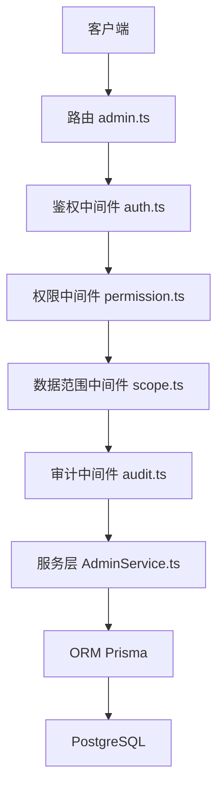
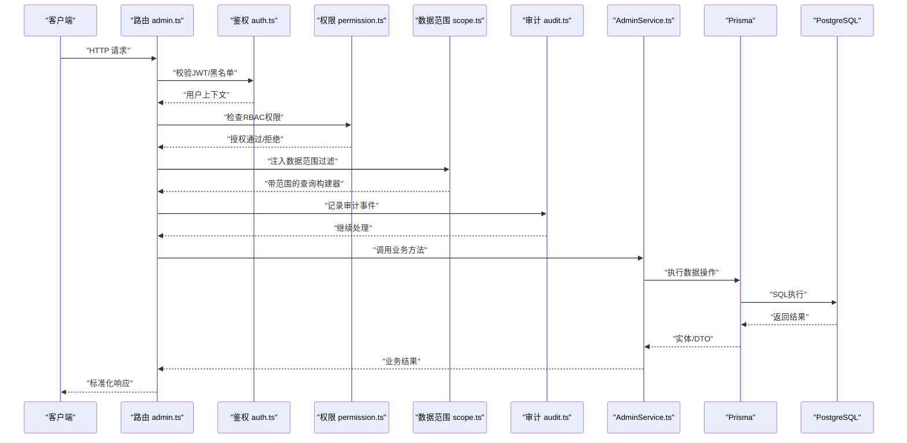
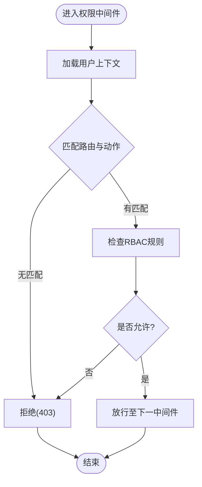
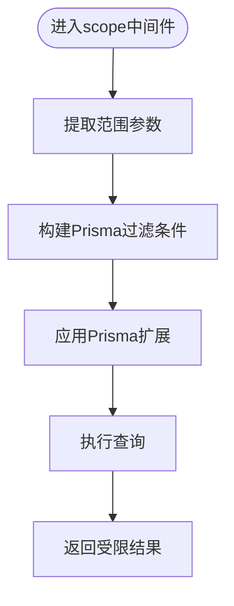
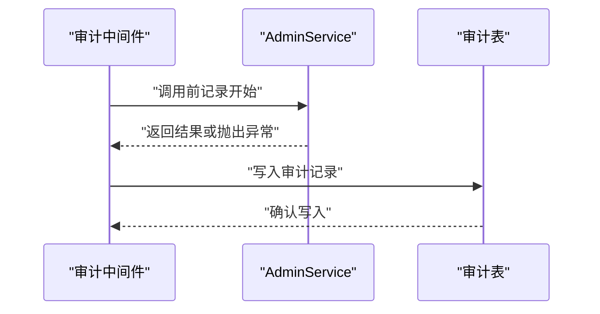
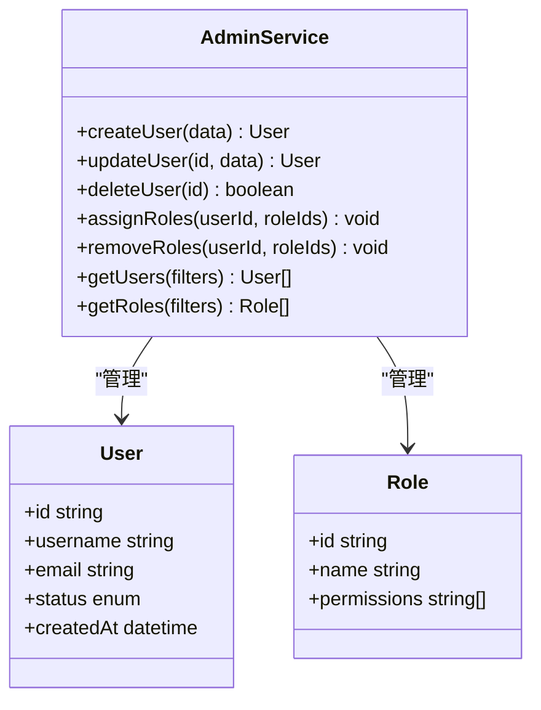
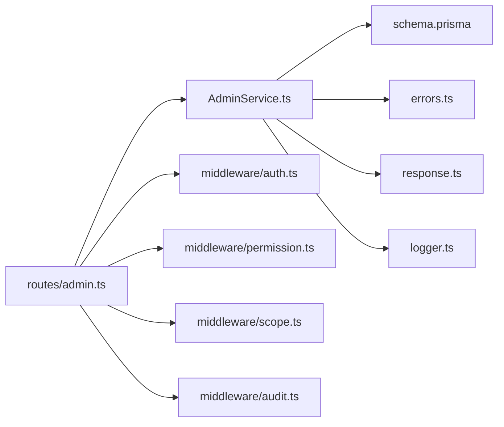
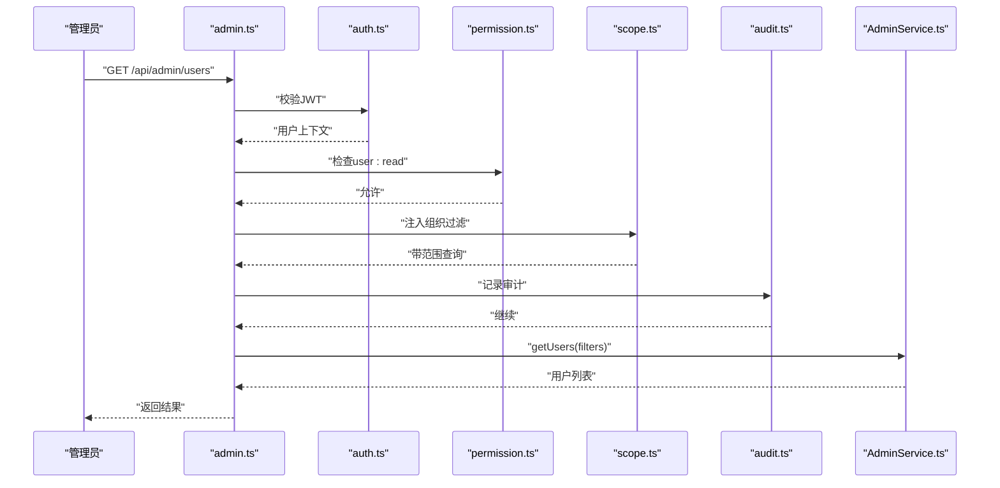

# 系统管理服务 (AdminService)

<cite>
**本文引用的文件**   
- [server/src/services/AdminService.ts](file://server/src/services/AdminService.ts)
- [server/src/routes/admin.ts](file://server/src/routes/admin.ts)
- [server/src/middleware/auth.ts](file://server/src/middleware/auth.ts)
- [server/src/middleware/permission.ts](file://server/src/middleware/permission.ts)
- [server/src/middleware/scope.ts](file://server/src/middleware/scope.ts)
- [server/src/middleware/audit.ts](file://server/src/middleware/audit.ts)
- [server/src/lib/jwt.ts](file://server/src/lib/jwt.ts)
- [server/src/lib/logger.ts](file://server/src/lib/logger.ts)
- [server/src/lib/errors.ts](file://server/src/lib/errors.ts)
- [server/src/lib/response.ts](file://server/src/lib/response.ts)
- [server/prisma/schema.prisma](file://server/prisma/schema.prisma)
</cite>

## 目录
1. [简介](#简介)
2. [项目结构](#项目结构)
3. [核心组件](#核心组件)
4. [架构总览](#架构总览)
5. [详细组件分析](#详细组件分析)
6. [依赖分析](#依赖分析)
7. [性能考虑](#性能考虑)
8. [故障诊断指南](#故障诊断指南)
9. [结论](#结论)
10. [附录：管理API与使用示例](#附录管理api与使用示例)

## 简介
本文件面向FY200系统管理服务（AdminService）的开发者与运维人员，系统性阐述用户管理、角色权限控制（RBAC）、审计日志与数据范围隔离等能力。文档同时覆盖系统配置管理、性能监控与故障诊断工具，并提供管理端API接口说明与使用示例，帮助读者快速理解并安全高效地使用AdminService。

## 项目结构
后端采用Express 4 + Prisma 5 + PostgreSQL 15，中间件执行链顺序为：helmet → cors → express.json → rate-limit → auth(JWT+黑名单) → permission(默认拒绝) → scope(Prisma extension) → softDelete → audit → Service → Prisma → PostgreSQL。AdminService位于服务层，通过路由暴露管理端API，受鉴权、授权、数据范围与审计中间件保护。

**图表来源**
- [server/src/routes/admin.ts](file://server/src/routes/admin.ts)
- [server/src/middleware/auth.ts](file://server/src/middleware/auth.ts)
- [server/src/middleware/permission.ts](file://server/src/middleware/permission.ts)
- [server/src/middleware/scope.ts](file://server/src/middleware/scope.ts)
- [server/src/middleware/audit.ts](file://server/src/middleware/audit.ts)
- [server/src/services/AdminService.ts](file://server/src/services/AdminService.ts)
- [server/prisma/schema.prisma](file://server/prisma/schema.prisma)

**章节来源**
- [server/src/routes/admin.ts](file://server/src/routes/admin.ts)
- [server/src/services/AdminService.ts](file://server/src/services/AdminService.ts)
- [server/prisma/schema.prisma](file://server/prisma/schema.prisma)

## 核心组件
- AdminService：封装用户、角色、权限、审计与数据范围相关的业务逻辑，提供统一的CRUD与查询方法。
- 鉴权中间件（auth）：校验JWT访问令牌与刷新令牌轮转，维护黑名单。
- 权限中间件（permission）：基于RBAC进行资源级与方法级授权，默认拒绝未显式允许的操作。
- 数据范围中间件（scope）：通过Prisma扩展注入租户/组织维度过滤条件，实现数据隔离。
- 审计中间件（audit）：记录关键操作上下文与结果，便于追踪与合规审计。
- JWT工具（jwt）：生成/验证令牌，支持短期access与长期refresh策略。
- 错误处理与响应（errors, response）：统一异常类型与HTTP响应格式。

**章节来源**
- [server/src/services/AdminService.ts](file://server/src/services/AdminService.ts)
- [server/src/middleware/auth.ts](file://server/src/middleware/auth.ts)
- [server/src/middleware/permission.ts](file://server/src/middleware/permission.ts)
- [server/src/middleware/scope.ts](file://server/src/middleware/scope.ts)
- [server/src/middleware/audit.ts](file://server/src/middleware/audit.ts)
- [server/src/lib/jwt.ts](file://server/src/lib/jwt.ts)
- [server/src/lib/errors.ts](file://server/src/lib/errors.ts)
- [server/src/lib/response.ts](file://server/src/lib/response.ts)

## 架构总览
AdminService在Express请求链路中处于服务层，上游由路由与中间件负责鉴权、授权、数据范围与审计，下游通过Prisma访问数据库。该分层确保关注点分离与安全边界清晰。

**图表来源**
- [server/src/routes/admin.ts](file://server/src/routes/admin.ts)
- [server/src/middleware/auth.ts](file://server/src/middleware/auth.ts)
- [server/src/middleware/permission.ts](file://server/src/middleware/permission.ts)
- [server/src/middleware/scope.ts](file://server/src/middleware/scope.ts)
- [server/src/middleware/audit.ts](file://server/src/middleware/audit.ts)
- [server/src/services/AdminService.ts](file://server/src/services/AdminService.ts)
- [server/prisma/schema.prisma](file://server/prisma/schema.prisma)

## 详细组件分析

### RBAC权限模型与授权流程
- 模型要点
  - 角色（Role）与权限（Permission）多对多关系，用户（User）与角色多对多关系。
  - 权限粒度包含资源与动作（如 user:read, user:write）。
  - 默认拒绝策略：未在权限白名单中的操作一律拒绝。
- 授权流程
  - 鉴权后从JWT或会话提取用户上下文。
  - 权限中间件根据请求路径与动作匹配RBAC规则。
  - 若命中则放行，否则返回403。
- 扩展建议
  - 支持动态权限（运行时计算）与继承角色。
  - 引入资源级权限（如按公司/部门隔离）。

**图表来源**
- [server/src/middleware/permission.ts](file://server/src/middleware/permission.ts)
- [server/src/lib/jwt.ts](file://server/src/lib/jwt.ts)

**章节来源**
- [server/src/middleware/permission.ts](file://server/src/middleware/permission.ts)
- [server/src/lib/jwt.ts](file://server/src/lib/jwt.ts)

### 数据范围隔离机制（Scope）
- 设计目标
  - 基于租户/组织维度自动注入WHERE条件，防止越权访问。
- 实现方式
  - 通过Prisma扩展在查询前注入过滤条件。
  - 支持多种范围策略（当前用户所属组织、指定公司ID等）。
- 最佳实践
  - 所有敏感查询必须经过scope中间件。
  - 避免绕过scope的直接数据库访问。

**图表来源**
- [server/src/middleware/scope.ts](file://server/src/middleware/scope.ts)
- [server/prisma/schema.prisma](file://server/prisma/schema.prisma)

**章节来源**
- [server/src/middleware/scope.ts](file://server/src/middleware/scope.ts)
- [server/prisma/schema.prisma](file://server/prisma/schema.prisma)

### 审计日志与操作追踪
- 记录内容
  - 操作人、时间、IP、请求路径、方法、参数摘要、结果状态、耗时。
- 触发点
  - 在Service层前后记录开始与结束，失败时记录异常信息。
- 存储与查询
  - 写入审计表，支持按用户、时间范围、资源类型检索。
- 隐私保护
  - 敏感字段脱敏（如密码、手机号），金额区间化。

**图表来源**
- [server/src/middleware/audit.ts](file://server/src/middleware/audit.ts)
- [server/src/services/AdminService.ts](file://server/src/services/AdminService.ts)

**章节来源**
- [server/src/middleware/audit.ts](file://server/src/middleware/audit.ts)
- [server/src/services/AdminService.ts](file://server/src/services/AdminService.ts)

### 用户与角色管理（AdminService）
- 功能范围
  - 用户CRUD、启用/禁用、重置密码、批量导入导出。
  - 角色CRUD、权限分配、角色继承。
  - 用户-角色关联管理。
- 数据一致性
  - 事务性更新用户与角色关系，保证一致性。
- 输入校验
  - 参数合法性校验、重复性检查、权限前置校验。

**图表来源**
- [server/src/services/AdminService.ts](file://server/src/services/AdminService.ts)
- [server/prisma/schema.prisma](file://server/prisma/schema.prisma)

**章节来源**
- [server/src/services/AdminService.ts](file://server/src/services/AdminService.ts)
- [server/prisma/schema.prisma](file://server/prisma/schema.prisma)

### 系统配置管理
- 配置项
  - 认证策略（JWT过期时间、刷新策略）、权限策略（默认拒绝开关）、数据范围策略（默认租户/组织）。
- 变更流程
  - 配置变更需审计记录，支持热更新或重启生效。
- 安全要求
  - 敏感配置加密存储，访问需管理员权限。

**章节来源**
- [server/src/services/AdminService.ts](file://server/src/services/AdminService.ts)

### 性能监控与指标
- 指标采集
  - 接口耗时、错误率、QPS、慢查询统计。
- 采样与上报
  - 关键路径打点，异步上报到监控系统。
- 告警规则
  - 错误率阈值、响应时间阈值、数据库连接池耗尽告警。

**章节来源**
- [server/src/lib/logger.ts](file://server/src/lib/logger.ts)
- [server/src/services/AdminService.ts](file://server/src/services/AdminService.ts)

### 故障诊断工具
- 日志聚合
  - 结构化日志输出，支持按traceId追踪请求链路。
- 健康检查
  - /health端点返回依赖服务状态（DB、缓存等）。
- 调试模式
  - 开启详细错误堆栈与入参打印（生产环境关闭）。

**章节来源**
- [server/src/lib/logger.ts](file://server/src/lib/logger.ts)
- [server/src/lib/errors.ts](file://server/src/lib/errors.ts)

## 依赖分析
AdminService依赖中间件与ORM，形成清晰的单向依赖关系，降低耦合度。

**图表来源**
- [server/src/services/AdminService.ts](file://server/src/services/AdminService.ts)
- [server/src/routes/admin.ts](file://server/src/routes/admin.ts)
- [server/src/middleware/auth.ts](file://server/src/middleware/auth.ts)
- [server/src/middleware/permission.ts](file://server/src/middleware/permission.ts)
- [server/src/middleware/scope.ts](file://server/src/middleware/scope.ts)
- [server/src/middleware/audit.ts](file://server/src/middleware/audit.ts)
- [server/prisma/schema.prisma](file://server/prisma/schema.prisma)
- [server/src/lib/errors.ts](file://server/src/lib/errors.ts)
- [server/src/lib/response.ts](file://server/src/lib/response.ts)
- [server/src/lib/logger.ts](file://server/src/lib/logger.ts)

**章节来源**
- [server/src/services/AdminService.ts](file://server/src/services/AdminService.ts)
- [server/src/routes/admin.ts](file://server/src/routes/admin.ts)
- [server/prisma/schema.prisma](file://server/prisma/schema.prisma)

## 性能考虑
- 查询优化
  - 合理使用索引（用户、角色、审计表常见过滤字段）。
  - 分页与限流结合，避免大结果集拖垮服务。
- 事务与锁
  - 批量更新使用事务，减少锁竞争。
- 缓存策略
  - 热点配置与权限缓存，注意失效策略。
- 异步处理
  - 审计写入与指标上报异步化，降低主链路延迟。

[本节为通用指导，不直接分析具体文件]

## 故障诊断指南
- 常见问题
  - 401/403：JWT无效或权限不足，检查令牌与RBAC配置。
  - 数据不一致：检查事务回滚与并发冲突。
  - 慢查询：定位慢SQL与缺失索引。
- 诊断步骤
  - 查看审计日志与错误日志，结合traceId定位。
  - 使用健康检查与指标面板观察依赖服务状态。
  - 复现问题并开启调试模式获取详细堆栈。

**章节来源**
- [server/src/lib/logger.ts](file://server/src/lib/logger.ts)
- [server/src/lib/errors.ts](file://server/src/lib/errors.ts)

## 结论
AdminService以RBAC为核心，结合数据范围隔离与审计追踪，构建了安全、可控、可观测的系统管理能力。通过中间件链与ORM解耦，保证了高内聚低耦合与可扩展性。建议在后续迭代中完善动态权限、细粒度资源级权限与更丰富的监控告警能力。

[本节为总结，不直接分析具体文件]

## 附录：管理API与使用示例
- 接口概览
  - 用户管理：创建、更新、删除、查询、批量导入导出。
  - 角色管理：创建、更新、删除、查询、权限分配。
  - 用户-角色关联：分配、移除、查询。
  - 审计查询：按用户、时间、资源类型检索。
- 鉴权与授权
  - 所有接口需携带有效JWT；权限由permission中间件判定。
- 数据范围
  - 查询自动注入租户/组织过滤，避免越权。
- 示例流程
  - 登录获取JWT → 调用用户列表接口 → 返回受限结果 → 审计记录写入。

**图表来源**
- [server/src/routes/admin.ts](file://server/src/routes/admin.ts)
- [server/src/middleware/auth.ts](file://server/src/middleware/auth.ts)
- [server/src/middleware/permission.ts](file://server/src/middleware/permission.ts)
- [server/src/middleware/scope.ts](file://server/src/middleware/scope.ts)
- [server/src/middleware/audit.ts](file://server/src/middleware/audit.ts)
- [server/src/services/AdminService.ts](file://server/src/services/AdminService.ts)

**章节来源**
- [server/src/routes/admin.ts](file://server/src/routes/admin.ts)
- [server/src/services/AdminService.ts](file://server/src/services/AdminService.ts)