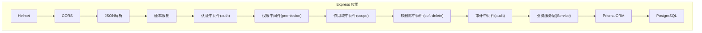
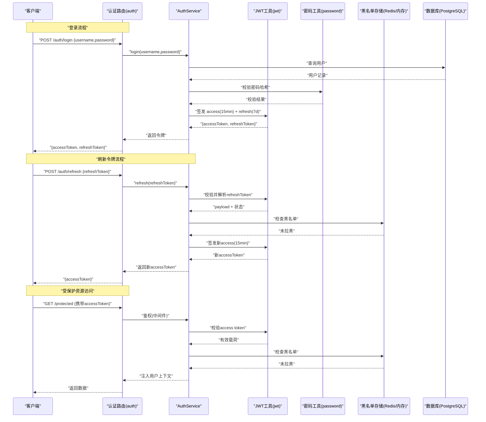
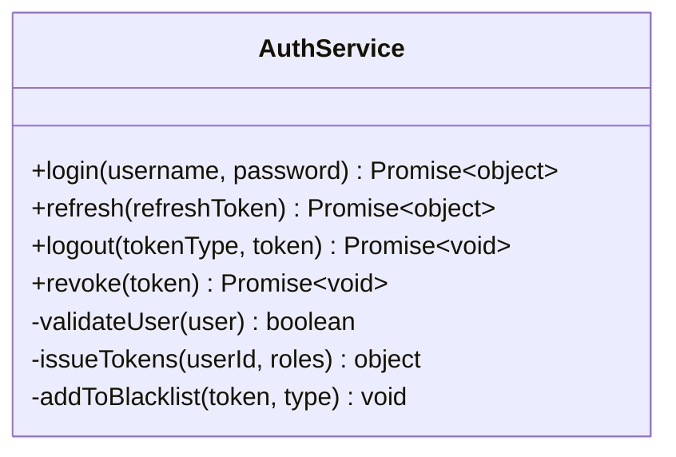
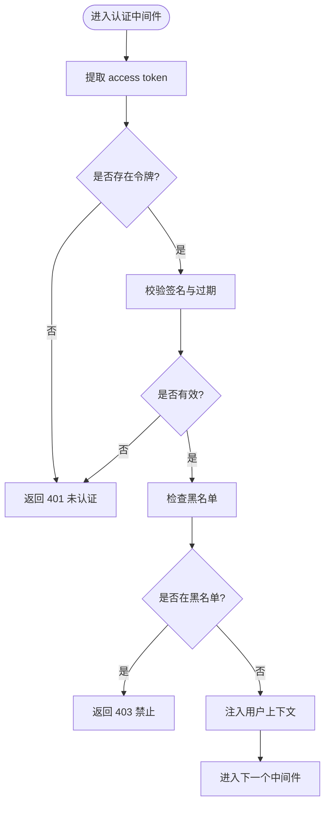
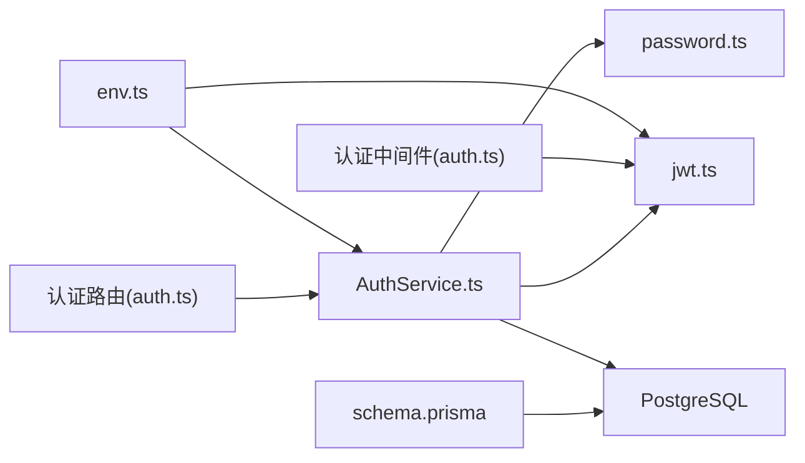

# 认证服务 (AuthService)

<cite>
**本文引用的文件**   
- [server/src/services/AuthService.ts](file://server/src/services/AuthService.ts)
- [server/src/middleware/auth.ts](file://server/src/middleware/auth.ts)
- [server/src/routes/auth.ts](file://server/src/routes/auth.ts)
- [server/src/lib/jwt.ts](file://server/src/lib/jwt.ts)
- [server/src/lib/password.ts](file://server/src/lib/password.ts)
- [server/src/config/env.ts](file://server/src/config/env.ts)
- [server/src/middleware/permission.ts](file://server/src/middleware/permission.ts)
- [server/src/middleware/scope.ts](file://server/src/middleware/scope.ts)
- [server/src/middleware/rate-limit.ts](file://server/src/middleware/rate-limit.ts)
- [server/src/middleware/helmet.ts](file://server/src/middleware/helmet.ts)
- [server/src/middleware/cors.ts](file://server/src/middleware/cors.ts)
- [server/src/middleware/error-handler.ts](file://server/src/middleware/error-handler.ts)
- [server/src/lib/errors.ts](file://server/src/lib/errors.ts)
- [server/src/lib/response.ts](file://server/src/lib/response.ts)
- [server/prisma/schema.prisma](file://server/prisma/schema.prisma)
</cite>

## 目录
1. [简介](#简介)
2. [项目结构](#项目结构)
3. [核心组件](#核心组件)
4. [架构总览](#架构总览)
5. [详细组件分析](#详细组件分析)
6. [依赖关系分析](#依赖关系分析)
7. [性能考虑](#性能考虑)
8. [故障排查指南](#故障排查指南)
9. [结论](#结论)
10. [附录：API调用示例与集成指南](#附录api调用示例与集成指南)

## 简介
本文件面向FY200财年经营数据分析平台的认证子系统，聚焦 AuthService 的用户认证机制与相关中间件链。文档围绕以下目标展开：
- 双令牌（access token 15分钟 + refresh token 7天）的生成、验证与轮转策略
- 用户登录流程、密码加密存储、黑名单机制与会话管理
- 认证中间件的执行逻辑、权限验证流程与错误处理策略
- API调用示例与前后端集成要点

本项目后端技术栈为 Express 4 + Prisma 5 + PostgreSQL 15 + JWT（access 15min + refresh 7day 轮转）。中间件执行顺序固定为：helmet → cors → express.json → rate-limit → auth(JWT+黑名单) → permission(默认拒绝) → scope(Prisma extension) → softDelete → audit → Service → Prisma → PostgreSQL。

## 项目结构
认证相关代码主要分布在以下模块：
- 服务层：AuthService（业务逻辑：登录、注册、刷新令牌、登出等）
- 路由层：auth（HTTP接口定义）
- 中间件：auth（JWT校验与黑名单）、permission（权限控制）、scope（数据范围扩展）
- 工具库：jwt（令牌签发与校验）、password（密码哈希）
- 配置：env（环境变量：密钥、过期时间、黑名单存储等）
- 数据库：schema.prisma（用户表、会话/黑名单等实体）

图表来源
- [server/src/middleware/helmet.ts](file://server/src/middleware/helmet.ts)
- [server/src/middleware/cors.ts](file://server/src/middleware/cors.ts)
- [server/src/middleware/rate-limit.ts](file://server/src/middleware/rate-limit.ts)
- [server/src/middleware/auth.ts](file://server/src/middleware/auth.ts)
- [server/src/middleware/permission.ts](file://server/src/middleware/permission.ts)
- [server/src/middleware/scope.ts](file://server/src/middleware/scope.ts)
- [server/src/middleware/soft-delete.ts](file://server/src/middleware/soft-delete.ts)
- [server/src/middleware/audit.ts](file://server/src/middleware/audit.ts)

章节来源
- [server/src/app.ts](file://server/src/app.ts)
- [server/src/server.ts](file://server/src/server.ts)

## 核心组件
- AuthService：封装认证相关的业务逻辑，包括用户登录、注册、令牌签发与刷新、登出、黑名单管理等。
- 认证中间件（auth）：在请求进入业务前校验 access token，检查黑名单，并将用户上下文注入到请求对象。
- 权限中间件（permission）：基于角色或权限点做访问控制，默认拒绝未显式授权的路径。
- 作用域中间件（scope）：通过 Prisma extension 对查询施加数据范围限制（如公司/组织维度）。
- JWT工具（jwt）：负责 access/refresh 令牌的签发、解码、校验与黑名单标记。
- 密码工具（password）：使用安全算法进行密码哈希与比对。
- 错误处理（error-handler）：统一异常捕获与响应格式化。

章节来源
- [server/src/services/AuthService.ts](file://server/src/services/AuthService.ts)
- [server/src/middleware/auth.ts](file://server/src/middleware/auth.ts)
- [server/src/middleware/permission.ts](file://server/src/middleware/permission.ts)
- [server/src/middleware/scope.ts](file://server/src/middleware/scope.ts)
- [server/src/lib/jwt.ts](file://server/src/lib/jwt.ts)
- [server/src/lib/password.ts](file://server/src/lib/password.ts)
- [server/src/middleware/error-handler.ts](file://server/src/middleware/error-handler.ts)

## 架构总览
下图展示了从客户端发起登录到获取受保护资源的完整调用链，以及令牌刷新流程。

图表来源
- [server/src/routes/auth.ts](file://server/src/routes/auth.ts)
- [server/src/services/AuthService.ts](file://server/src/services/AuthService.ts)
- [server/src/lib/jwt.ts](file://server/src/lib/jwt.ts)
- [server/src/lib/password.ts](file://server/src/lib/password.ts)

## 详细组件分析

### 用户认证与服务层（AuthService）
- 登录
  - 输入：用户名、密码
  - 行为：查询用户、校验密码哈希、签发双令牌（access 15分钟、refresh 7天）
  - 输出：{ accessToken, refreshToken }
- 刷新令牌
  - 输入：refreshToken
  - 行为：校验refreshToken、检查黑名单、签发新的accessToken
  - 输出：{ accessToken }
- 登出
  - 输入：accessToken 或 refreshToken
  - 行为：将对应令牌加入黑名单（支持按类型区分），可选清理会话
  - 输出：成功状态
- 注销/吊销
  - 输入：token
  - 行为：将token加入黑名单，阻止后续使用
- 会话管理
  - 基于无状态JWT；如需有状态会话，可在黑名单或独立会话表中维护状态（例如设备指纹、IP白名单等）

图表来源
- [server/src/services/AuthService.ts](file://server/src/services/AuthService.ts)

章节来源
- [server/src/services/AuthService.ts](file://server/src/services/AuthService.ts)

### 认证中间件（auth）
- 职责
  - 从请求头提取 access token
  - 校验签名与过期时间
  - 检查黑名单（若存在）
  - 将用户信息注入到请求上下文（req.user）
- 失败处理
  - 未携带令牌：返回401
  - 令牌无效/过期：返回401
  - 令牌被拉黑：返回403
- 与权限中间件协作
  - 认证通过后进入权限校验阶段，默认拒绝未授权路径

图表来源
- [server/src/middleware/auth.ts](file://server/src/middleware/auth.ts)
- [server/src/lib/jwt.ts](file://server/src/lib/jwt.ts)

章节来源
- [server/src/middleware/auth.ts](file://server/src/middleware/auth.ts)

### 权限中间件（permission）
- 默认拒绝策略：未显式声明允许的角色/权限点时，直接拒绝访问
- 常见用法：在路由级别声明所需权限，中间件根据用户上下文中的角色/权限点进行判断
- 与认证中间件配合：仅当认证成功后才进行权限校验

章节来源
- [server/src/middleware/permission.ts](file://server/src/middleware/permission.ts)

### 作用域中间件（scope）
- 通过 Prisma extension 对查询施加数据范围限制（如公司、部门、租户等）
- 结合用户上下文中的组织/公司ID，自动附加过滤条件，防止越权访问

章节来源
- [server/src/middleware/scope.ts](file://server/src/middleware/scope.ts)

### JWT工具（jwt）
- 签发
  - access token：短期（15分钟），包含用户标识与必要声明
  - refresh token：长期（7天），用于换取新的 access token
- 校验
  - 验证签名、过期时间、黑名单状态
- 黑名单
  - 支持按令牌类型（access/refresh）加入黑名单，阻止后续使用

章节来源
- [server/src/lib/jwt.ts](file://server/src/lib/jwt.ts)

### 密码工具（password）
- 使用安全的哈希算法对密码进行加密存储
- 提供比对方法，确保明文密码不入库

章节来源
- [server/src/lib/password.ts](file://server/src/lib/password.ts)

### 错误处理（error-handler）
- 统一捕获异常，转换为标准响应格式
- 区分业务错误与系统错误，便于前端友好提示

章节来源
- [server/src/middleware/error-handler.ts](file://server/src/middleware/error-handler.ts)
- [server/src/lib/errors.ts](file://server/src/lib/errors.ts)
- [server/src/lib/response.ts](file://server/src/lib/response.ts)

## 依赖关系分析
- 路由层依赖服务层：auth路由调用AuthService完成登录、刷新、登出等业务
- 服务层依赖工具库：AuthService依赖jwt与password工具
- 中间件依赖工具库：auth中间件依赖jwt进行令牌校验
- 配置依赖：env提供密钥、过期时间、黑名单存储地址等
- 数据持久化：Prisma与PostgreSQL用于用户信息与可能的会话/黑名单存储

图表来源
- [server/src/routes/auth.ts](file://server/src/routes/auth.ts)
- [server/src/services/AuthService.ts](file://server/src/services/AuthService.ts)
- [server/src/lib/jwt.ts](file://server/src/lib/jwt.ts)
- [server/src/lib/password.ts](file://server/src/lib/password.ts)
- [server/src/config/env.ts](file://server/src/config/env.ts)
- [server/prisma/schema.prisma](file://server/prisma/schema.prisma)

章节来源
- [server/src/routes/auth.ts](file://server/src/routes/auth.ts)
- [server/src/services/AuthService.ts](file://server/src/services/AuthService.ts)
- [server/src/lib/jwt.ts](file://server/src/lib/jwt.ts)
- [server/src/lib/password.ts](file://server/src/lib/password.ts)
- [server/src/config/env.ts](file://server/src/config/env.ts)
- [server/prisma/schema.prisma](file://server/prisma/schema.prisma)

## 性能考虑
- 令牌签发与校验：尽量使用无状态JWT减少数据库压力；黑名单存储建议使用高性能KV（如Redis）
- 密码哈希：选择合适强度（兼顾安全与性能），避免频繁重算
- 中间件链：保持最小化处理逻辑，避免阻塞关键路径
- 缓存策略：对热点用户信息可加缓存，但需保证一致性

[本节为通用指导，无需特定文件引用]

## 故障排查指南
- 常见问题
  - 401 未认证：检查请求头是否携带正确的 access token，确认签名与过期时间
  - 403 禁止：检查令牌是否在黑名单中，或权限不足
  - 登录失败：核对用户名与密码是否正确，查看密码哈希比对逻辑
  - 刷新失败：确认 refreshToken 是否有效且未被拉黑
- 日志与监控
  - 启用审计中间件记录关键操作（登录、刷新、登出、拉黑）
  - 关注错误处理中间件的统一错误码与消息

章节来源
- [server/src/middleware/error-handler.ts](file://server/src/middleware/error-handler.ts)
- [server/src/lib/errors.ts](file://server/src/lib/errors.ts)
- [server/src/lib/response.ts](file://server/src/lib/response.ts)

## 结论
AuthService 通过双令牌机制实现了安全、高效的认证体系。结合中间件链（认证、权限、作用域）与统一的错误处理，能够保障系统的可用性与安全性。建议在生产环境中：
- 严格管理密钥与过期时间
- 使用可靠的黑名单存储（如Redis）
- 完善审计与监控，及时发现异常行为

[本节为总结性内容，无需特定文件引用]

## 附录：API调用示例与集成指南

### 登录
- 方法：POST
- 路径：/auth/login
- 请求体：{ username, password }
- 响应：{ accessToken, refreshToken }
- 说明：成功后前端应保存两个令牌，并在后续请求中携带 accessToken

章节来源
- [server/src/routes/auth.ts](file://server/src/routes/auth.ts)
- [server/src/services/AuthService.ts](file://server/src/services/AuthService.ts)

### 刷新令牌
- 方法：POST
- 路径：/auth/refresh
- 请求体：{ refreshToken }
- 响应：{ accessToken }
- 说明：仅在 refreshToken 有效且未被拉黑时返回新的 accessToken

章节来源
- [server/src/routes/auth.ts](file://server/src/routes/auth.ts)
- [server/src/services/AuthService.ts](file://server/src/services/AuthService.ts)

### 登出
- 方法：POST
- 路径：/auth/logout
- 请求体：{ token, tokenType }
- 响应：成功状态
- 说明：将指定类型的令牌加入黑名单，阻止后续使用

章节来源
- [server/src/routes/auth.ts](file://server/src/routes/auth.ts)
- [server/src/services/AuthService.ts](file://server/src/services/AuthService.ts)

### 受保护资源访问
- 方法：GET/POST/...（依具体路由而定）
- 路径：/protected（示例）
- 请求头：Authorization: Bearer <accessToken>
- 响应：业务数据
- 说明：认证中间件会校验令牌有效性并注入用户上下文

章节来源
- [server/src/middleware/auth.ts](file://server/src/middleware/auth.ts)
- [server/src/middleware/permission.ts](file://server/src/middleware/permission.ts)

### 集成要点
- 前端存储：建议将 accessToken 放在内存或短期存储，refreshToken 放在更安全的位置（如httpOnly cookie）
- 自动刷新：在 accessToken 即将过期时，使用 refreshToken 主动刷新
- 错误处理：对401/403进行友好提示，必要时引导重新登录
- 安全建议：启用HTTPS、设置合理的CORS策略、启用速率限制

章节来源
- [server/src/middleware/cors.ts](file://server/src/middleware/cors.ts)
- [server/src/middleware/rate-limit.ts](file://server/src/middleware/rate-limit.ts)
- [server/src/middleware/helmet.ts](file://server/src/middleware/helmet.ts)