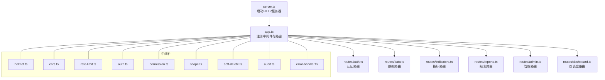
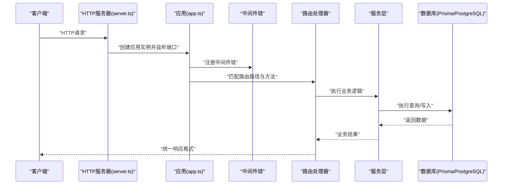
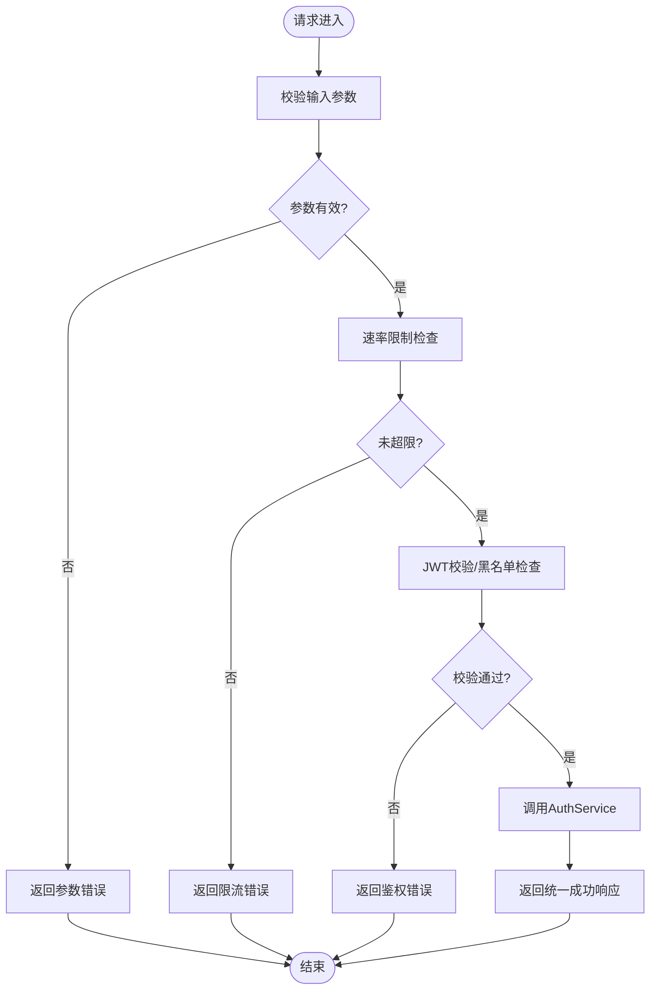
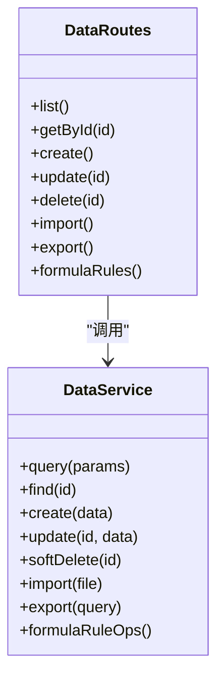
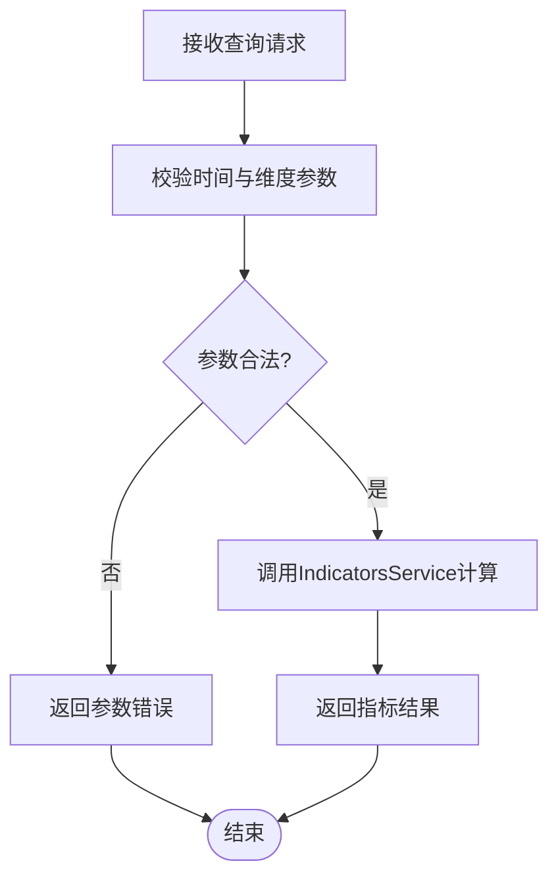
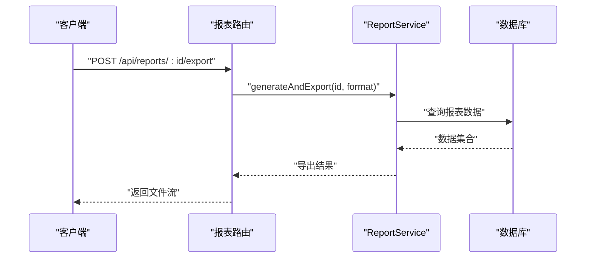
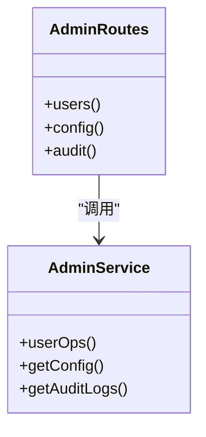
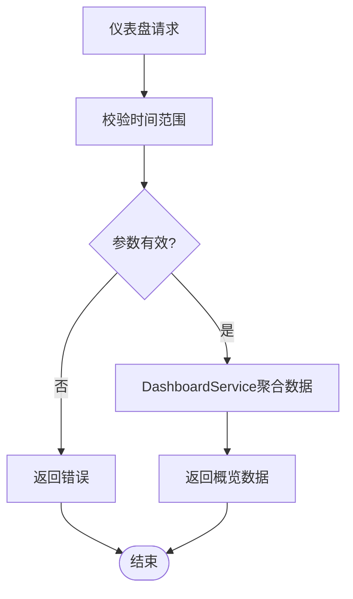
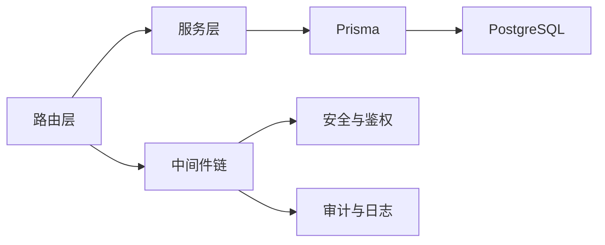

# 路由系统

<cite>
**本文引用的文件**   
- [server/src/app.ts](file://server/src/app.ts)
- [server/src/server.ts](file://server/src/server.ts)
- [server/src/routes/auth.ts](file://server/src/routes/auth.ts)
- [server/src/routes/data.ts](file://server/src/routes/data.ts)
- [server/src/routes/indicators.ts](file://server/src/routes/indicators.ts)
- [server/src/routes/reports.ts](file://server/src/routes/reports.ts)
- [server/src/routes/admin.ts](file://server/src/routes/admin.ts)
- [server/src/routes/dashboard.ts](file://server/src/routes/dashboard.ts)
- [server/src/middleware/auth.ts](file://server/src/middleware/auth.ts)
- [server/src/middleware/permission.ts](file://server/src/middleware/permission.ts)
- [server/src/middleware/scope.ts](file://server/src/middleware/scope.ts)
- [server/src/middleware/error-handler.ts](file://server/src/middleware/error-handler.ts)
- [server/src/middleware/rate-limit.ts](file://server/src/middleware/rate-limit.ts)
- [server/src/middleware/cors.ts](file://server/src/middleware/cors.ts)
- [server/src/middleware/helmet.ts](file://server/src/middleware/helmet.ts)
- [server/src/middleware/audit.ts](file://server/src/middleware/audit.ts)
- [server/src/middleware/soft-delete.ts](file://server/src/middleware/soft-delete.ts)
- [server/src/lib/response.ts](file://server/src/lib/response.ts)
- [server/src/lib/errors.ts](file://server/src/lib/errors.ts)
- [server/src/services/AuthService.ts](file://server/src/services/AuthService.ts)
- [server/src/services/DataService.ts](file://server/src/services/DataService.ts)
- [server/src/services/IndicatorsService.ts](file://server/src/services/IndicatorsService.ts)
- [server/src/services/ReportService.ts](file://server/src/services/ReportService.ts)
- [server/src/services/AdminService.ts](file://server/src/services/AdminService.ts)
- [server/src/services/DashboardService.ts](file://server/src/services/DashboardService.ts)
</cite>

## 目录
1. [简介](#简介)
2. [项目结构](#项目结构)
3. [核心组件](#核心组件)
4. [架构总览](#架构总览)
5. [详细组件分析](#详细组件分析)
6. [依赖分析](#依赖分析)
7. [性能考虑](#性能考虑)
8. [故障排查指南](#故障排查指南)
9. [结论](#结论)
10. [附录](#附录)

## 简介
本文件面向FY200后端路由系统的实现与使用，聚焦Express路由的组织结构与设计原则，覆盖RESTful API规范、路由分组策略、参数验证与响应格式标准化。文档还详细说明认证、数据、指标、报表、管理与仪表盘等模块的路由定义，并阐述中间件集成方式、错误处理机制与API版本控制策略，最后给出测试方法与性能优化建议。

## 项目结构
后端采用Express 4，按“功能域”划分路由文件，统一挂载于应用入口；中间件链遵循固定顺序，确保安全、鉴权、权限、作用域、审计与错误处理的一致性。服务层封装业务逻辑，通过路由控制器调用。

图表来源
- [server/src/server.ts](file://server/src/server.ts)
- [server/src/app.ts](file://server/src/app.ts)

章节来源
- [server/src/server.ts](file://server/src/server.ts)
- [server/src/app.ts](file://server/src/app.ts)

## 核心组件
- 路由组织：按功能域拆分路由文件，集中挂载到应用实例，便于维护与扩展。
- 中间件链：helmet → cors → express.json → rate-limit → auth → permission → scope → softDelete → audit → Service → Prisma → PostgreSQL。
- 响应格式：统一响应包装器，保证成功/失败结构一致，便于前端解析与错误处理。
- 错误处理：全局错误中间件捕获异常，输出标准错误结构，避免堆栈泄露。
- 鉴权与权限：JWT校验（access/refresh轮转）、黑名单检查、基于角色的权限控制。
- 作用域：Prisma扩展注入租户/公司维度过滤，保障数据隔离。
- 审计与软删除：操作审计日志、逻辑删除支持。

章节来源
- [server/src/app.ts](file://server/src/app.ts)
- [server/src/middleware/auth.ts](file://server/src/middleware/auth.ts)
- [server/src/middleware/permission.ts](file://server/src/middleware/permission.ts)
- [server/src/middleware/scope.ts](file://server/src/middleware/scope.ts)
- [server/src/middleware/error-handler.ts](file://server/src/middleware/error-handler.ts)
- [server/src/lib/response.ts](file://server/src/lib/response.ts)
- [server/src/lib/errors.ts](file://server/src/lib/errors.ts)

## 架构总览
下图展示一次典型请求从进入HTTP服务器到返回响应的完整流程，体现中间件链与服务层协作关系。

图表来源
- [server/src/server.ts](file://server/src/server.ts)
- [server/src/app.ts](file://server/src/app.ts)

## 详细组件分析

### 认证路由（/api/auth）
- 设计目标：提供登录、登出、刷新令牌、令牌校验等能力，支持JWT双令牌轮转与黑名单。
- 主要端点：
  - POST /api/auth/login：用户名密码登录，返回access与refresh token。
  - POST /api/auth/logout：注销，将token加入黑名单。
  - POST /api/auth/refresh：使用refresh token换取新的access token。
  - GET /api/auth/me：获取当前用户信息。
- 参数验证：用户名、密码必填；长度与复杂度校验；防重放与限流。
- 响应格式：统一成功/失败结构，包含消息与必要字段。
- 中间件：rate-limit、auth（可选用于保护敏感接口）。

图表来源
- [server/src/routes/auth.ts](file://server/src/routes/auth.ts)
- [server/src/middleware/rate-limit.ts](file://server/src/middleware/rate-limit.ts)
- [server/src/middleware/auth.ts](file://server/src/middleware/auth.ts)
- [server/src/services/AuthService.ts](file://server/src/services/AuthService.ts)

章节来源
- [server/src/routes/auth.ts](file://server/src/routes/auth.ts)
- [server/src/middleware/auth.ts](file://server/src/middleware/auth.ts)
- [server/src/services/AuthService.ts](file://server/src/services/AuthService.ts)

### 数据路由（/api/data）
- 设计目标：提供数据实体的CRUD、导入导出、公式规则维护等能力。
- 主要端点：
  - GET /api/data/list：分页查询、筛选、排序。
  - GET /api/data/:id：获取单条记录。
  - POST /api/data/create：新增记录。
  - PUT /api/data/:id/update：更新记录。
  - DELETE /api/data/:id/delete：软删除。
  - POST /api/data/import：Excel导入。
  - GET /api/data/export：导出为Excel。
  - 公式相关：GET/POST/PUT/DELETE /api/data/formula-rules/*。
- 参数验证：分页参数范围、筛选条件类型校验、导入文件格式与大小限制。
- 作用域：通过scope中间件自动注入公司/租户过滤。
- 响应格式：分页对象、列表或单条记录。

图表来源
- [server/src/routes/data.ts](file://server/src/routes/data.ts)
- [server/src/services/DataService.ts](file://server/src/services/DataService.ts)

章节来源
- [server/src/routes/data.ts](file://server/src/routes/data.ts)
- [server/src/services/DataService.ts](file://server/src/services/DataService.ts)

### 指标路由（/api/indicators）
- 设计目标：提供指标计算、同比/环比、趋势分析等能力。
- 主要端点：
  - GET /api/indicators/query：按时间范围、维度、指标聚合查询。
  - GET /api/indicators/trend：趋势与同比环比计算。
  - GET /api/indicators/analysis：多维分析。
- 计算策略：安全公式解析（白名单算子），实时计算不存库。
- 参数验证：时间范围合法性、维度枚举校验、指标ID有效性。
- 响应格式：指标值、时间序列、对比结果。

图表来源
- [server/src/routes/indicators.ts](file://server/src/routes/indicators.ts)
- [server/src/services/IndicatorsService.ts](file://server/src/services/IndicatorsService.ts)

章节来源
- [server/src/routes/indicators.ts](file://server/src/routes/indicators.ts)
- [server/src/services/IndicatorsService.ts](file://server/src/services/IndicatorsService.ts)

### 报表路由（/api/reports）
- 设计目标：提供报表模板管理、生成、预览与导出。
- 主要端点：
  - GET /api/reports/templates：模板列表。
  - GET /api/reports/:id/generate：生成报表。
  - GET /api/reports/:id/preview：预览。
  - POST /api/reports/:id/export：导出PDF/Excel。
- 参数验证：模板ID存在性、导出格式合法性。
- 响应格式：报表数据、下载链接或二进制流。

图表来源
- [server/src/routes/reports.ts](file://server/src/routes/reports.ts)
- [server/src/services/ReportService.ts](file://server/src/services/ReportService.ts)

章节来源
- [server/src/routes/reports.ts](file://server/src/routes/reports.ts)
- [server/src/services/ReportService.ts](file://server/src/services/ReportService.ts)

### 管理路由（/api/admin）
- 设计目标：管理员操作，如用户管理、系统配置、审计日志查看。
- 主要端点：
  - GET /api/admin/users：用户列表。
  - POST /api/admin/users/create：创建用户。
  - PUT /api/admin/users/:id/update：更新用户。
  - DELETE /api/admin/users/:id/delete：删除用户。
  - GET /api/admin/config：系统配置。
  - GET /api/admin/audit：审计日志。
- 权限控制：仅管理员角色可访问。
- 响应格式：管理操作结果与详情。

图表来源
- [server/src/routes/admin.ts](file://server/src/routes/admin.ts)
- [server/src/services/AdminService.ts](file://server/src/services/AdminService.ts)

章节来源
- [server/src/routes/admin.ts](file://server/src/routes/admin.ts)
- [server/src/services/AdminService.ts](file://server/src/services/AdminService.ts)

### 仪表盘路由（/api/dashboard）
- 设计目标：提供仪表盘关键指标、概览数据与快速统计。
- 主要端点：
  - GET /api/dashboard/overview：总体概览。
  - GET /api/dashboard/kpis：关键绩效指标。
  - GET /api/dashboard/trends：趋势摘要。
- 参数验证：时间范围与维度选择。
- 响应格式：聚合后的仪表盘数据。

图表来源
- [server/src/routes/dashboard.ts](file://server/src/routes/dashboard.ts)
- [server/src/services/DashboardService.ts](file://server/src/services/DashboardService.ts)

章节来源
- [server/src/routes/dashboard.ts](file://server/src/routes/dashboard.ts)
- [server/src/services/DashboardService.ts](file://server/src/services/DashboardService.ts)

## 依赖分析
- 路由与服务层解耦：路由仅负责参数校验与调用服务，业务逻辑在服务层实现。
- 中间件依赖：所有路由均受全局中间件链保护，确保一致性。
- 外部依赖：Prisma ORM、PostgreSQL、JWT库、DeepSeek API（AI管道）。

图表来源
- [server/src/app.ts](file://server/src/app.ts)
- [server/src/middleware/auth.ts](file://server/src/middleware/auth.ts)
- [server/src/middleware/audit.ts](file://server/src/middleware/audit.ts)

章节来源
- [server/src/app.ts](file://server/src/app.ts)

## 性能考虑
- 数据库查询优化：合理使用索引、分页、投影字段，避免N+1查询。
- 缓存策略：对热点指标与仪表盘数据进行短期缓存（内存或Redis）。
- 异步处理：耗时任务（如导入导出）采用队列与异步处理。
- 连接池：合理配置Prisma连接池大小，避免连接耗尽。
- 限流与降级：对高频接口实施限流，必要时降级返回部分数据。

[本节为通用指导，无需特定文件引用]

## 故障排查指南
- 常见错误：
  - 参数校验失败：检查请求体结构与类型。
  - 鉴权失败：确认token有效且未被拉黑。
  - 权限不足：检查用户角色与资源权限。
  - 数据库错误：查看SQL与约束冲突。
- 调试步骤：
  - 启用详细日志，定位错误堆栈。
  - 使用统一错误响应结构分析错误码与消息。
  - 逐步禁用中间件定位问题环节。

章节来源
- [server/src/middleware/error-handler.ts](file://server/src/middleware/error-handler.ts)
- [server/src/lib/errors.ts](file://server/src/lib/errors.ts)

## 结论
FY200后端路由系统以模块化与中间件链为核心，实现了清晰的分层架构与一致的错误处理。通过RESTful规范、统一响应格式与严格的鉴权权限控制，保障了系统的安全性与可维护性。未来可进一步优化缓存与异步处理能力，提升整体性能与用户体验。

[本节为总结性内容，无需特定文件引用]

## 附录
- API版本控制策略：建议在URL前缀中使用版本号（如/api/v1），或在请求头中指定版本，便于向后兼容与平滑升级。
- 测试方法：
  - 单元测试：针对服务层函数进行断言。
  - 集成测试：模拟HTTP请求，验证端到端流程。
  - 性能测试：使用压测工具评估高并发场景。

[本节为补充说明，无需特定文件引用]