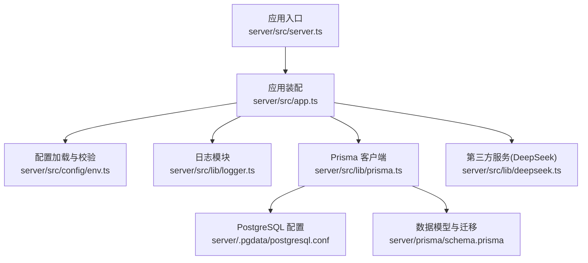
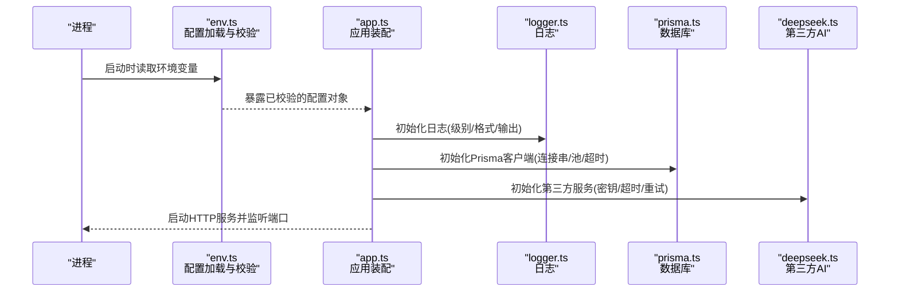
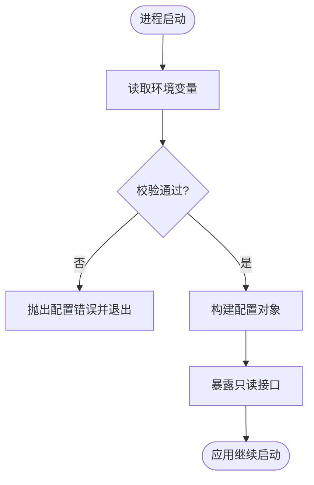
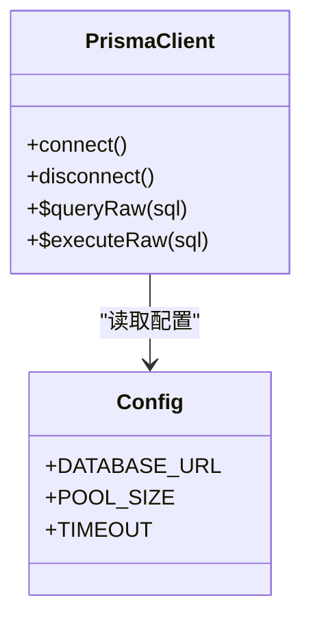
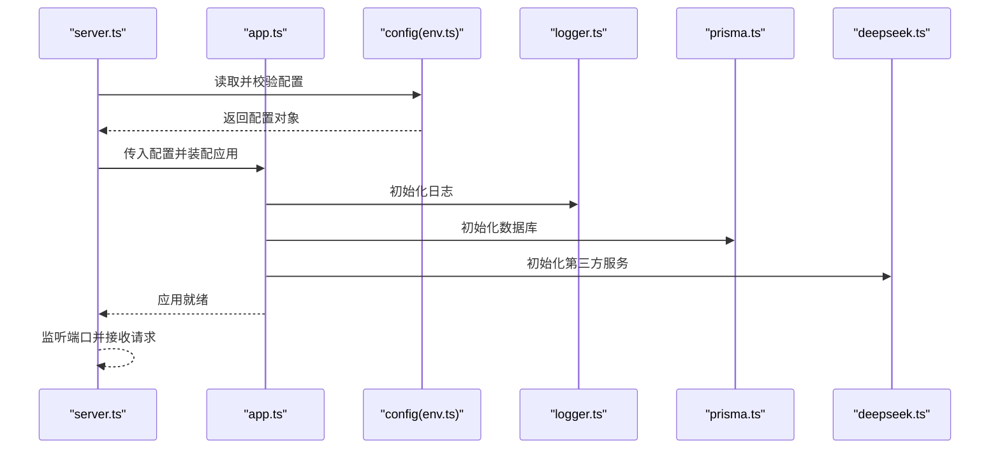
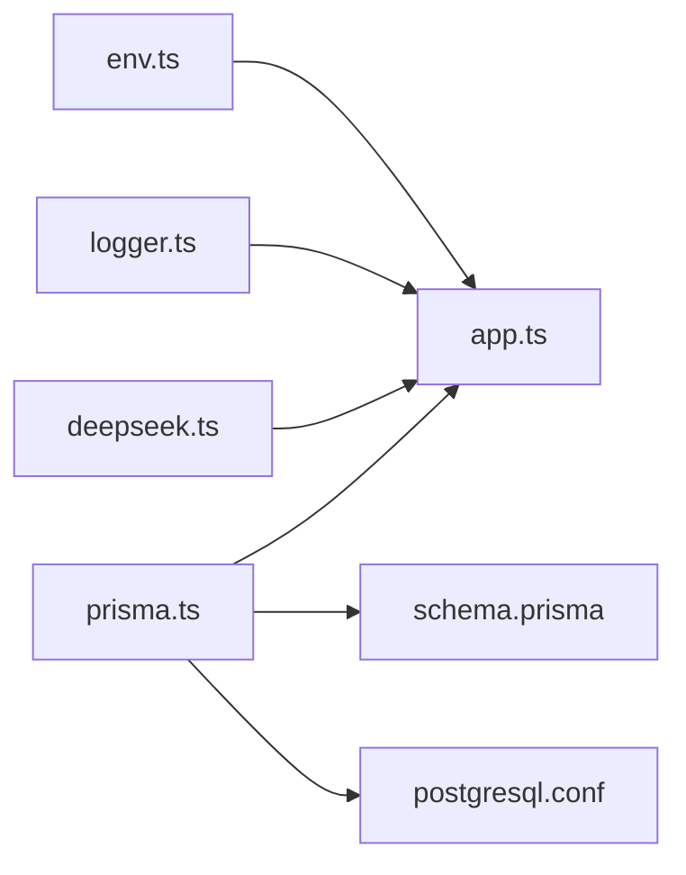

# 配置管理

<cite>
**本文引用的文件**   
- [server/src/config/env.ts](file://server/src/config/env.ts)
- [server/src/lib/logger.ts](file://server/src/lib/logger.ts)
- [server/src/lib/prisma.ts](file://server/src/lib/prisma.ts)
- [server/src/lib/deepseek.ts](file://server/src/lib/deepseek.ts)
- [server/src/app.ts](file://server/src/app.ts)
- [server/src/server.ts](file://server/src/server.ts)
- [server/.pgdata/postgresql.conf](file://server/.pgdata/postgresql.conf)
- [server/prisma/schema.prisma](file://server/prisma/schema.prisma)
</cite>

## 目录
1. [简介](#简介)
2. [项目结构](#项目结构)
3. [核心组件](#核心组件)
4. [架构总览](#架构总览)
5. [详细组件分析](#详细组件分析)
6. [依赖分析](#依赖分析)
7. [性能考虑](#性能考虑)
8. [故障排查指南](#故障排查指南)
9. [结论](#结论)
10. [附录](#附录)

## 简介
本文件聚焦 FY200 后端（Express + Prisma + PostgreSQL）的配置管理体系，围绕环境变量与配置文件组织、验证与默认值、热重载机制、日志/数据库/第三方服务配置策略、安全与多环境部署、以及配置迁移方案展开。目标是帮助开发者快速理解并正确维护系统配置，确保在不同环境中稳定运行与安全可控。

## 项目结构
后端配置相关代码主要位于 server 目录下：
- 环境变量加载与校验：server/src/config/env.ts
- 日志配置：server/src/lib/logger.ts
- 数据库连接与 Prisma 客户端：server/src/lib/prisma.ts
- 第三方服务（DeepSeek AI）配置：server/src/lib/deepseek.ts
- 应用启动与中间件装配：server/src/app.ts、server/src/server.ts
- 数据库初始化与迁移：server/prisma/schema.prisma、server/.pgdata/postgresql.conf

图表来源
- [server/src/server.ts](file://server/src/server.ts)
- [server/src/app.ts](file://server/src/app.ts)
- [server/src/config/env.ts](file://server/src/config/env.ts)
- [server/src/lib/logger.ts](file://server/src/lib/logger.ts)
- [server/src/lib/prisma.ts](file://server/src/lib/prisma.ts)
- [server/src/lib/deepseek.ts](file://server/src/lib/deepseek.ts)
- [server/.pgdata/postgresql.conf](file://server/.pgdata/postgresql.conf)
- [server/prisma/schema.prisma](file://server/prisma/schema.prisma)

章节来源
- [server/src/config/env.ts](file://server/src/config/env.ts)
- [server/src/lib/logger.ts](file://server/src/lib/logger.ts)
- [server/src/lib/prisma.ts](file://server/src/lib/prisma.ts)
- [server/src/lib/deepseek.ts](file://server/src/lib/deepseek.ts)
- [server/src/app.ts](file://server/src/app.ts)
- [server/src/server.ts](file://server/src/server.ts)
- [server/.pgdata/postgresql.conf](file://server/.pgdata/postgresql.conf)
- [server/prisma/schema.prisma](file://server/prisma/schema.prisma)

## 核心组件
- 环境变量与配置中心
  - 统一从进程环境变量读取配置，集中定义键名、类型、默认值与校验规则。
  - 提供强类型访问接口，避免运行时拼写错误与类型不一致。
- 日志配置
  - 基于环境变量控制日志级别、输出目标与格式，支持开发/测试/生产差异化。
- 数据库连接配置
  - 通过环境变量注入连接串与池参数，结合 Prisma 客户端进行连接管理与健康检查。
- 第三方服务配置
  - DeepSeek API 的密钥、超时、重试等参数由环境变量驱动，便于多环境切换与权限隔离。

章节来源
- [server/src/config/env.ts](file://server/src/config/env.ts)
- [server/src/lib/logger.ts](file://server/src/lib/logger.ts)
- [server/src/lib/prisma.ts](file://server/src/lib/prisma.ts)
- [server/src/lib/deepseek.ts](file://server/src/lib/deepseek.ts)

## 架构总览
配置在应用启动时按顺序完成加载、校验与注入，随后各子系统按需消费配置。

图表来源
- [server/src/config/env.ts](file://server/src/config/env.ts)
- [server/src/app.ts](file://server/src/app.ts)
- [server/src/lib/logger.ts](file://server/src/lib/logger.ts)
- [server/src/lib/prisma.ts](file://server/src/lib/prisma.ts)
- [server/src/lib/deepseek.ts](file://server/src/lib/deepseek.ts)

## 详细组件分析

### 环境变量与配置中心（env.ts）
- 设计要点
  - 单一事实源：所有配置项集中声明，避免散落各处。
  - 类型与默认值：为每个变量定义类型、默认值与可选性，降低空值风险。
  - 校验规则：对关键变量进行格式与范围校验（如端口、URL、布尔开关）。
  - 访问接口：以只读对象形式对外暴露，防止外部篡改。
- 典型变量类别
  - 应用基础：端口、主机、环境标识、调试开关
  - 安全与认证：JWT 密钥、过期时间、黑名单策略
  - 日志：级别、输出目标、格式化选项
  - 数据库：连接串、池大小、超时、SSL
  - 第三方：API 密钥、端点、超时、重试次数
- 热重载机制
  - 当前实现以启动时一次性加载为主；如需热重载，可在配置变更事件触发后重建受影响的单例（如日志器、Prisma 客户端），并平滑替换引用。

图表来源
- [server/src/config/env.ts](file://server/src/config/env.ts)

章节来源
- [server/src/config/env.ts](file://server/src/config/env.ts)

### 日志配置（logger.ts）
- 能力概览
  - 根据环境变量设置日志级别（如 debug/info/warn/error）。
  - 支持控制台与文件输出，生产环境建议写入文件或日志收集系统。
  - 结构化日志字段包含请求上下文、用户信息、耗时等。
- 最佳实践
  - 开发环境开启详细日志，生产环境仅记录必要信息。
  - 敏感字段脱敏（如密码、令牌）后再输出。
  - 使用统一的日志门面，避免在各模块重复初始化。

章节来源
- [server/src/lib/logger.ts](file://server/src/lib/logger.ts)

### 数据库连接配置（prisma.ts）
- 能力概览
  - 通过环境变量注入数据库连接串与连接池参数。
  - 封装 Prisma 客户端实例，提供连接健康检查与优雅关闭。
  - 与 schema.prisma 协同，确保模型与迁移一致。
- 连接与健康检查
  - 启动时建立连接，失败则快速失败并给出明确错误信息。
  - 定期或按需执行简单查询验证连接可用性。
- 迁移与版本管理
  - 使用 Prisma Migrate 管理数据库版本，确保多环境一致性。

图表来源
- [server/src/lib/prisma.ts](file://server/src/lib/prisma.ts)
- [server/prisma/schema.prisma](file://server/prisma/schema.prisma)

章节来源
- [server/src/lib/prisma.ts](file://server/src/lib/prisma.ts)
- [server/prisma/schema.prisma](file://server/prisma/schema.prisma)

### 第三方服务配置（deepseek.ts）
- 能力概览
  - 通过环境变量管理 API 密钥、端点、超时与重试策略。
  - 对网络异常与鉴权失败进行统一处理与降级。
- 安全建议
  - 密钥不硬编码，仅通过环境变量注入。
  - 限制调用频率与并发，避免滥用与雪崩。

章节来源
- [server/src/lib/deepseek.ts](file://server/src/lib/deepseek.ts)

### 应用装配与启动（app.ts、server.ts）
- 职责划分
  - app.ts：注册中间件、路由与服务，装配配置依赖。
  - server.ts：创建 HTTP 服务器，监听端口，处理进程信号。
- 启动流程
  - 加载配置 → 初始化日志 → 初始化数据库 → 初始化第三方服务 → 启动 HTTP 服务。

图表来源
- [server/src/server.ts](file://server/src/server.ts)
- [server/src/app.ts](file://server/src/app.ts)
- [server/src/config/env.ts](file://server/src/config/env.ts)
- [server/src/lib/logger.ts](file://server/src/lib/logger.ts)
- [server/src/lib/prisma.ts](file://server/src/lib/prisma.ts)
- [server/src/lib/deepseek.ts](file://server/src/lib/deepseek.ts)

章节来源
- [server/src/app.ts](file://server/src/app.ts)
- [server/src/server.ts](file://server/src/server.ts)

## 依赖分析
- 模块耦合
  - app.ts 依赖 env.ts、logger.ts、prisma.ts、deepseek.ts。
  - prisma.ts 依赖数据库配置与 schema.prisma。
  - deepseek.ts 依赖网络与超时/重试策略配置。
- 外部依赖
  - PostgreSQL：通过连接串与池参数管理。
  - DeepSeek API：通过密钥与端点管理。
- 潜在循环依赖
  - 配置模块应保持无副作用与单向依赖，避免反向引入业务模块。

图表来源
- [server/src/config/env.ts](file://server/src/config/env.ts)
- [server/src/app.ts](file://server/src/app.ts)
- [server/src/lib/logger.ts](file://server/src/lib/logger.ts)
- [server/src/lib/prisma.ts](file://server/src/lib/prisma.ts)
- [server/src/lib/deepseek.ts](file://server/src/lib/deepseek.ts)
- [server/prisma/schema.prisma](file://server/prisma/schema.prisma)
- [server/.pgdata/postgresql.conf](file://server/.pgdata/postgresql.conf)

章节来源
- [server/src/config/env.ts](file://server/src/config/env.ts)
- [server/src/app.ts](file://server/src/app.ts)
- [server/src/lib/logger.ts](file://server/src/lib/logger.ts)
- [server/src/lib/prisma.ts](file://server/src/lib/prisma.ts)
- [server/src/lib/deepseek.ts](file://server/src/lib/deepseek.ts)
- [server/prisma/schema.prisma](file://server/prisma/schema.prisma)
- [server/.pgdata/postgresql.conf](file://server/.pgdata/postgresql.conf)

## 性能考虑
- 配置加载开销
  - 启动时一次性加载与校验，避免请求路径上的额外解析。
- 连接池与超时
  - 合理设置数据库连接池大小与超时，避免资源耗尽与慢查询阻塞。
- 日志 I/O
  - 生产环境采用异步写入与批量落盘，减少同步阻塞。
- 第三方调用
  - 设置合理的超时与重试上限，启用熔断与降级策略。

[本节为通用指导，不涉及具体文件分析]

## 故障排查指南
- 常见配置问题
  - 环境变量缺失或类型错误：检查 env.ts 中必填项与类型校验。
  - 数据库连接失败：核对 DATABASE_URL、网络可达性与 pg_hba.conf 权限。
  - 第三方 API 鉴权失败：确认密钥有效且端点可访问。
  - 日志无输出：检查日志级别与输出目标配置。
- 定位步骤
  - 查看启动日志中的配置加载与初始化阶段输出。
  - 使用最小化环境变量复现问题，逐步添加变量定位。
  - 对数据库与第三方服务进行独立连通性测试。

章节来源
- [server/src/config/env.ts](file://server/src/config/env.ts)
- [server/src/lib/logger.ts](file://server/src/lib/logger.ts)
- [server/src/lib/prisma.ts](file://server/src/lib/prisma.ts)
- [server/src/lib/deepseek.ts](file://server/src/lib/deepseek.ts)

## 结论
FY200 后端的配置管理以环境变量为核心，配合集中式校验与类型约束，确保跨环境一致性与安全性。日志、数据库与第三方服务均通过配置驱动，便于部署与运维。建议在现有基础上完善配置热重载与更严格的校验规则，进一步提升系统的弹性与可观测性。

[本节为总结性内容，不涉及具体文件分析]

## 附录

### 环境变量清单与说明（示例）
- 应用基础
  - PORT：服务监听端口
  - HOST：绑定主机
  - NODE_ENV：运行环境（development/test/production）
  - DEBUG：是否开启调试模式
- 安全与认证
  - JWT_SECRET：JWT 签名密钥
  - JWT_ACCESS_EXPIRES：访问令牌过期时间
  - JWT_REFRESH_EXPIRES：刷新令牌过期时间
- 日志
  - LOG_LEVEL：日志级别
  - LOG_OUTPUT：输出目标（console/file）
  - LOG_FORMAT：日志格式（json/text）
- 数据库
  - DATABASE_URL：PostgreSQL 连接串
  - DB_POOL_SIZE：连接池大小
  - DB_TIMEOUT_MS：连接超时毫秒
- 第三方服务（DeepSeek）
  - DEEPSEEK_API_KEY：API 密钥
  - DEEPSEEK_ENDPOINT：API 端点
  - DEEPSEEK_TIMEOUT_MS：请求超时
  - DEEPSEEK_RETRY_COUNT：重试次数

[本节为概念性清单，不直接分析具体文件]

### 多环境部署配置建议
- 开发环境
  - 开启详细日志与调试，允许本地数据库与模拟第三方服务。
- 测试环境
  - 使用独立数据库与限流策略，确保测试隔离。
- 生产环境
  - 严格的最小权限原则，禁用调试，启用审计与告警。

[本节为概念性建议，不直接分析具体文件]

### 配置迁移方案
- 新增配置项
  - 在 env.ts 中声明新变量与默认值，补充校验规则。
  - 更新依赖模块的初始化逻辑，确保向后兼容。
- 废弃配置项
  - 保留旧变量并输出弃用警告，逐步迁移至新变量。
- 数据库迁移
  - 使用 Prisma Migrate 管理变更，确保幂等与回滚能力。

[本节为概念性方案，不直接分析具体文件]