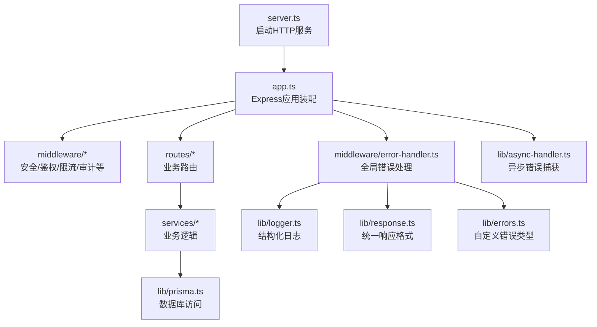
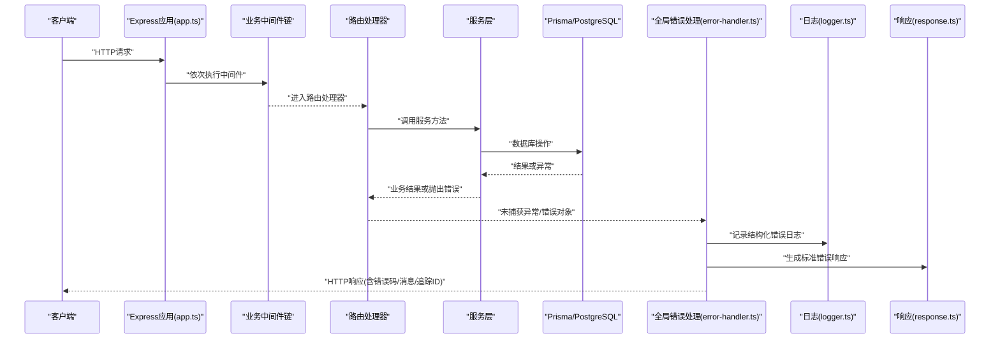
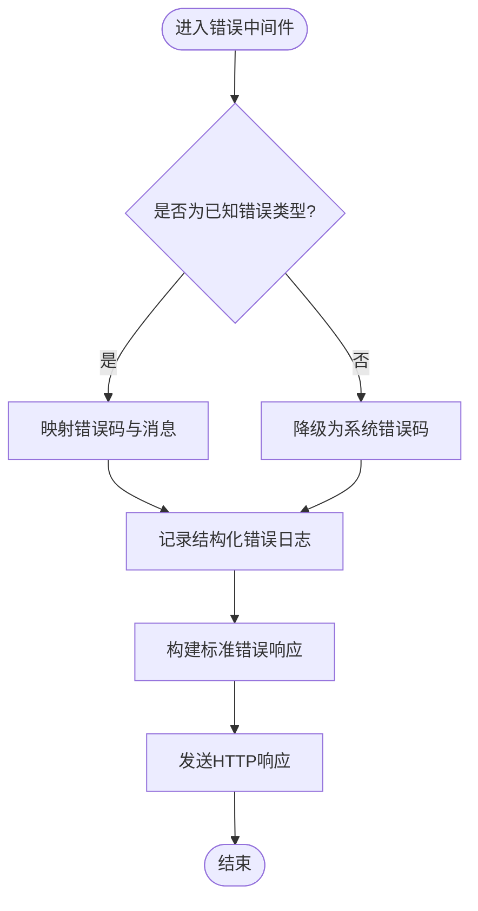
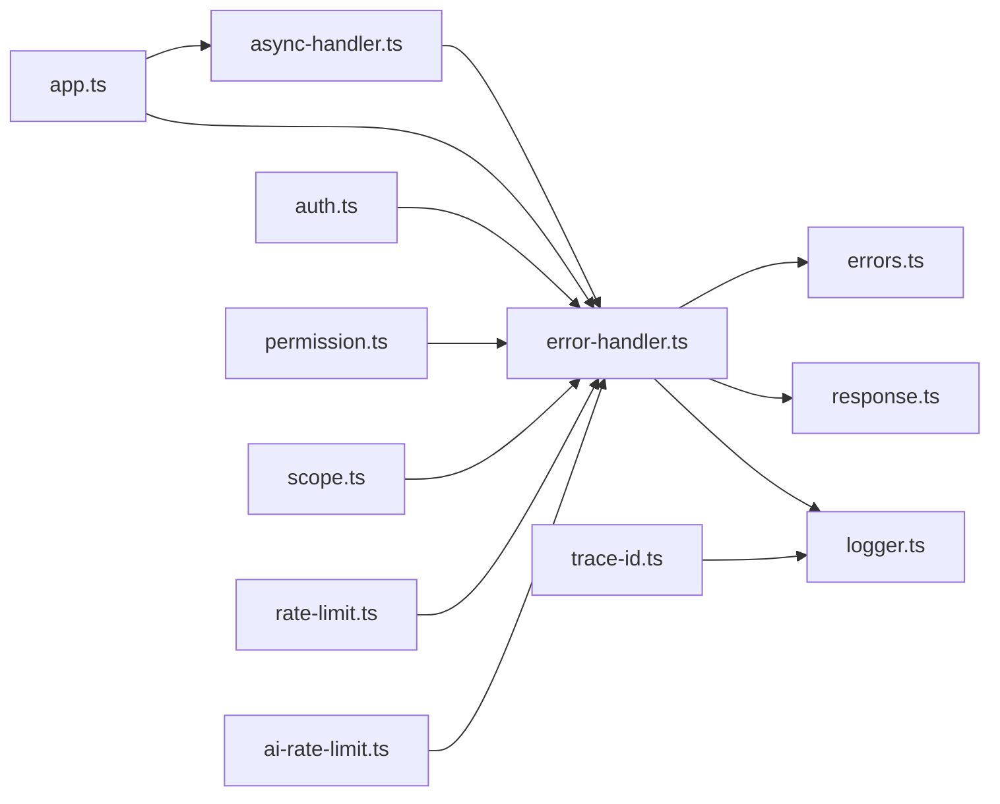

# 错误处理机制

<cite>
**本文引用的文件**   
- [server.ts](file://server/src/server.ts)
- [app.ts](file://server/src/app.ts)
- [error-handler.ts](file://server/src/middleware/error-handler.ts)
- [async-handler.ts](file://server/src/lib/async-handler.ts)
- [errors.ts](file://server/src/lib/errors.ts)
- [response.ts](file://server/src/lib/response.ts)
- [logger.ts](file://server/src/lib/logger.ts)
- [auth.ts](file://server/src/middleware/auth.ts)
- [permission.ts](file://server/src/middleware/permission.ts)
- [scope.ts](file://server/src/middleware/scope.ts)
- [ai-rate-limit.ts](file://server/src/middleware/ai-rate-limit.ts)
- [rate-limit.ts](file://server/src/middleware/rate-limit.ts)
- [cors.ts](file://server/src/middleware/cors.ts)
- [helmet.ts](file://server/src/middleware/helmet.ts)
- [audit.ts](file://server/src/middleware/audit.ts)
- [soft-delete.ts](file://server/src/middleware/soft-delete.ts)
- [trace-id.ts](file://server/src/middleware/trace-id.ts)
- [env.ts](file://server/src/config/env.ts)
</cite>

## 目录
1. [简介](#简介)
2. [项目结构](#项目结构)
3. [核心组件](#核心组件)
4. [架构总览](#架构总览)
5. [详细组件分析](#详细组件分析)
6. [依赖关系分析](#依赖关系分析)
7. [性能考量](#性能考量)
8. [故障排查指南](#故障排查指南)
9. [结论](#结论)
10. [附录](#附录)

## 简介
本文件系统化阐述 FY200 后端错误处理机制，覆盖统一错误处理的设计理念、自定义错误类型与错误码规范、错误响应格式化、日志记录策略，以及全局错误处理中间件在异步、同步和第三方库异常场景下的捕获与恢复。文档同时给出错误分类策略、监控集成建议与故障排查流程，并提供可落地的最佳实践与代码片段路径，帮助开发者快速定位问题并提升系统稳定性。

## 项目结构
FY200 后端基于 Express 4，错误处理贯穿中间件链与路由服务层。关键位置包括：
- 应用初始化与中间件注册（入口）
- 全局错误处理中间件
- 统一错误类型与响应封装
- 异步请求包装器
- 日志与配置

**图表来源** 
- [server.ts](file://server/src/server.ts)
- [app.ts](file://server/src/app.ts)
- [error-handler.ts](file://server/src/middleware/error-handler.ts)
- [async-handler.ts](file://server/src/lib/async-handler.ts)
- [errors.ts](file://server/src/lib/errors.ts)
- [response.ts](file://server/src/lib/response.ts)
- [logger.ts](file://server/src/lib/logger.ts)

**章节来源**
- [server.ts](file://server/src/server.ts)
- [app.ts](file://server/src/app.ts)

## 核心组件
- 自定义错误类型与错误码规范：集中定义业务与系统错误类别、错误码、消息模板及上下文字段，便于前端展示与日志追踪。
- 统一响应格式：将成功与失败响应标准化，包含状态码、错误码、消息、数据体与追踪ID等。
- 全局错误处理中间件：统一捕获同步/异步/第三方异常，输出结构化日志，返回标准错误响应。
- 异步错误捕获：为路由处理器提供统一的 Promise 错误包装，避免未捕获的 Promise 拒绝导致进程崩溃。
- 日志与追踪：结合 traceId、请求摘要与堆栈信息，形成可检索的错误事件。

**章节来源**
- [errors.ts](file://server/src/lib/errors.ts)
- [response.ts](file://server/src/lib/response.ts)
- [error-handler.ts](file://server/src/middleware/error-handler.ts)
- [async-handler.ts](file://server/src/lib/async-handler.ts)
- [logger.ts](file://server/src/lib/logger.ts)

## 架构总览
错误处理在 Express 中间件链中处于“最后兜底”的位置，确保所有上游未处理的异常都能被捕获并规范化输出。

**图表来源** 
- [app.ts](file://server/src/app.ts)
- [error-handler.ts](file://server/src/middleware/error-handler.ts)
- [logger.ts](file://server/src/lib/logger.ts)
- [response.ts](file://server/src/lib/response.ts)

## 详细组件分析

### 自定义错误类型与错误码规范
- 设计目标
  - 统一错误语义：区分业务错误、参数校验错误、权限错误、外部依赖错误与未知错误。
  - 稳定错误码：采用分层编码（模块+子域+具体错误），保证前后端一致且可演进。
  - 丰富上下文：携带请求ID、用户ID、资源标识等，便于追踪与聚合分析。
- 常见分类
  - 业务错误：如数据不存在、状态不合法、计算规则冲突。
  - 参数错误：必填缺失、类型不符、范围越界。
  - 权限错误：未认证、无权限、越权访问。
  - 外部错误：第三方API失败、网络超时、配额限制。
  - 系统错误：内部异常、未预期异常、资源不可用。
- 错误码规范建议
  - 前缀表示子系统（如 AUTH、DATA、AI、SYS）。
  - 中段表示领域（如 USER、REPORT、FORMULA）。
  - 后缀表示具体错误（如 NOT_FOUND、RATE_LIMITED）。
- 示例字段
  - code：字符串错误码
  - message：可读消息
  - details：可选详情（字段级错误、约束说明）
  - traceId：链路追踪ID
  - timestamp：时间戳
  - request：可选的请求摘要（脱敏后）

**章节来源**
- [errors.ts](file://server/src/lib/errors.ts)

### 统一响应格式
- 成功响应
  - 包含 data、message、traceId、timestamp 等字段。
- 错误响应
  - 包含 error.code、error.message、error.details、error.traceId、error.timestamp。
- 设计要点
  - 始终返回一致的JSON结构，便于前端统一处理。
  - 错误响应不暴露敏感信息，仅保留必要调试字段。
  - 通过 traceId 关联日志与请求。

**章节来源**
- [response.ts](file://server/src/lib/response.ts)

### 全局错误处理中间件
- 职责
  - 捕获同步异常、Promise 拒绝与第三方库抛出的错误。
  - 识别错误类型，映射到标准错误码与消息。
  - 记录结构化日志（含堆栈、请求摘要、traceId）。
  - 返回标准错误响应。
- 实现要点
  - 使用 Express 错误处理签名 (err, req, res, next)。
  - 对未捕获的 Promise 拒绝进行全局监听，避免进程崩溃。
  - 对已知错误类型直接复用 code/message，未知错误降级为通用错误码。
  - 根据环境控制日志级别与是否输出堆栈。
- 与中间件链的关系
  - 位于中间件链末尾，确保所有上游未处理异常均能落入该中间件。

**图表来源** 
- [error-handler.ts](file://server/src/middleware/error-handler.ts)
- [logger.ts](file://server/src/lib/logger.ts)
- [response.ts](file://server/src/lib/response.ts)

**章节来源**
- [error-handler.ts](file://server/src/middleware/error-handler.ts)

### 异步错误捕获
- 目的
  - 避免路由处理器中 Promise 未捕获拒绝导致 500 或进程崩溃。
- 方案
  - 为每个异步路由处理器包裹统一的 asyncHandler，自动捕获异常并交由 Express 错误处理。
  - 支持在中间件或服务层抛出自定义错误，保持错误语义一致性。
- 适用场景
  - 所有路由处理器、回调函数、事件处理器。

**章节来源**
- [async-handler.ts](file://server/src/lib/async-handler.ts)

### 第三方库错误处理
- 策略
  - 对第三方 API（如 DeepSeek SSE）进行异常分类：网络错误、超时、配额限制、解析失败。
  - 将第三方错误转换为内部错误类型，附带原始错误信息与重试策略。
  - 在错误中间件中统一记录与响应，避免泄露敏感细节。
- 监控与告警
  - 对高频失败的外部依赖设置阈值告警。
  - 记录失败率、延迟分布与错误码分布。

**章节来源**
- [errors.ts](file://server/src/lib/errors.ts)
- [error-handler.ts](file://server/src/middleware/error-handler.ts)

### 鉴权与权限中间件的错误处理
- 鉴权错误
  - 未认证：返回未授权错误码与提示。
  - 令牌过期/黑名单：返回会话失效错误码。
- 权限错误
  - 无权限：返回权限不足错误码，附带资源与操作信息。
- 审计与范围
  - 审计中间件记录访问行为；范围中间件基于 Prisma extension 限制数据可见性。

**章节来源**
- [auth.ts](file://server/src/middleware/auth.ts)
- [permission.ts](file://server/src/middleware/permission.ts)
- [scope.ts](file://server/src/middleware/scope.ts)

### 限流与速率控制错误处理
- AI 限流
  - 针对 AI 接口设置独立限流策略，超限返回限流错误码。
- 通用限流
  - 全局限流拦截恶意请求，返回标准限流响应。

**章节来源**
- [ai-rate-limit.ts](file://server/src/middleware/ai-rate-limit.ts)
- [rate-limit.ts](file://server/src/middleware/rate-limit.ts)

### 安全与跨域中间件
- Helmet
  - 设置安全相关响应头，减少常见攻击面。
- CORS
  - 配置允许的源、方法与头部，跨域失败时返回标准错误。

**章节来源**
- [helmet.ts](file://server/src/middleware/helmet.ts)
- [cors.ts](file://server/src/middleware/cors.ts)

### 审计与软删除中间件
- 审计
  - 记录关键操作的审计日志，便于合规与回溯。
- 软删除
  - 查询与更新时自动附加软删除条件，避免误删数据。

**章节来源**
- [audit.ts](file://server/src/middleware/audit.ts)
- [soft-delete.ts](file://server/src/middleware/soft-delete.ts)

### 追踪ID与日志
- TraceId
  - 为每个请求生成唯一追踪ID，贯穿中间件与服务层，便于链路追踪。
- 日志
  - 结构化日志包含请求摘要、错误堆栈、traceId、时间戳与环境信息。
  - 生产环境隐藏敏感字段，仅保留必要调试信息。

**章节来源**
- [trace-id.ts](file://server/src/middleware/trace-id.ts)
- [logger.ts](file://server/src/lib/logger.ts)
- [env.ts](file://server/src/config/env.ts)

## 依赖关系分析
错误处理组件之间的依赖关系如下：

**图表来源** 
- [error-handler.ts](file://server/src/middleware/error-handler.ts)
- [errors.ts](file://server/src/lib/errors.ts)
- [response.ts](file://server/src/lib/response.ts)
- [logger.ts](file://server/src/lib/logger.ts)
- [async-handler.ts](file://server/src/lib/async-handler.ts)
- [app.ts](file://server/src/app.ts)
- [auth.ts](file://server/src/middleware/auth.ts)
- [permission.ts](file://server/src/middleware/permission.ts)
- [scope.ts](file://server/src/middleware/scope.ts)
- [rate-limit.ts](file://server/src/middleware/rate-limit.ts)
- [ai-rate-limit.ts](file://server/src/middleware/ai-rate-limit.ts)
- [trace-id.ts](file://server/src/middleware/trace-id.ts)

**章节来源**
- [app.ts](file://server/src/app.ts)
- [error-handler.ts](file://server/src/middleware/error-handler.ts)
- [async-handler.ts](file://server/src/lib/async-handler.ts)

## 性能考量
- 错误日志写入应异步化，避免阻塞请求链路。
- 堆栈信息仅在开发环境输出，生产环境关闭以减少序列化开销。
- 错误响应体尽量精简，避免大对象序列化。
- 对高频错误进行采样与聚合，降低日志存储压力。
- 限流与鉴权前置，尽早失败，减少无效计算。

[本节为通用指导，无需特定文件引用]

## 故障排查指南
- 定位步骤
  - 从错误响应中提取 traceId。
  - 在日志系统中按 traceId 检索完整请求链路。
  - 检查错误码与消息，判断错误分类（业务/参数/权限/外部/系统）。
  - 查看堆栈信息（开发环境）确认抛出点。
- 常见问题
  - 未捕获 Promise 拒绝：检查路由处理器是否使用 asyncHandler。
  - 第三方 API 失败：检查网络、超时、配额与重试策略。
  - 权限错误：检查 JWT 有效性、角色与资源权限配置。
  - 限流触发：检查限流阈值与客户端请求频率。
- 监控与告警
  - 建立错误率、延迟与外部依赖失败率的看板。
  - 对关键错误码设置告警阈值，及时通知运维与研发。

**章节来源**
- [error-handler.ts](file://server/src/middleware/error-handler.ts)
- [logger.ts](file://server/src/lib/logger.ts)
- [errors.ts](file://server/src/lib/errors.ts)

## 结论
FY200 后端的错误处理机制以“统一类型、统一响应、统一日志、统一追踪”为核心原则，通过全局错误中间件与异步包装器，确保各类异常都能被稳定捕获与规范化输出。配合鉴权、权限、限流、审计与安全中间件，形成完整的错误治理体系。建议在后续迭代中持续完善错误码字典、增强监控告警与自动化修复能力，进一步提升系统的可观测性与可靠性。

[本节为总结性内容，无需特定文件引用]

## 附录
- 最佳实践清单
  - 所有路由处理器必须使用异步包装器。
  - 在服务层抛出自定义错误类型，避免直接使用原生 Error。
  - 对外部依赖错误进行分类与重试策略。
  - 生产环境关闭敏感信息输出，启用结构化日志。
  - 为关键错误码建立监控与告警。
- 参考文件路径
  - 自定义错误类型：[errors.ts](file://server/src/lib/errors.ts)
  - 统一响应格式：[response.ts](file://server/src/lib/response.ts)
  - 全局错误处理：[error-handler.ts](file://server/src/middleware/error-handler.ts)
  - 异步错误捕获：[async-handler.ts](file://server/src/lib/async-handler.ts)
  - 日志与追踪：[logger.ts](file://server/src/lib/logger.ts)、[trace-id.ts](file://server/src/middleware/trace-id.ts)
  - 鉴权与权限：[auth.ts](file://server/src/middleware/auth.ts)、[permission.ts](file://server/src/middleware/permission.ts)
  - 限流：[rate-limit.ts](file://server/src/middleware/rate-limit.ts)、[ai-rate-limit.ts](file://server/src/middleware/ai-rate-limit.ts)
  - 安全与跨域：[helmet.ts](file://server/src/middleware/helmet.ts)、[cors.ts](file://server/src/middleware/cors.ts)
  - 审计与软删除：[audit.ts](file://server/src/middleware/audit.ts)、[soft-delete.ts](file://server/src/middleware/soft-delete.ts)
  - 应用装配：[app.ts](file://server/src/app.ts)、[server.ts](file://server/src/server.ts)