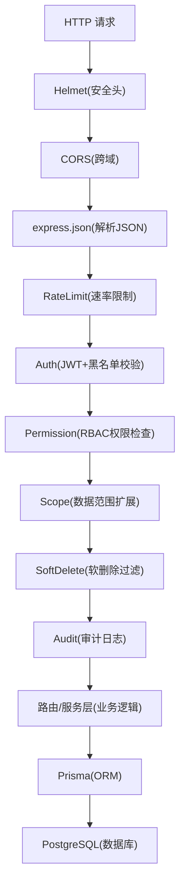
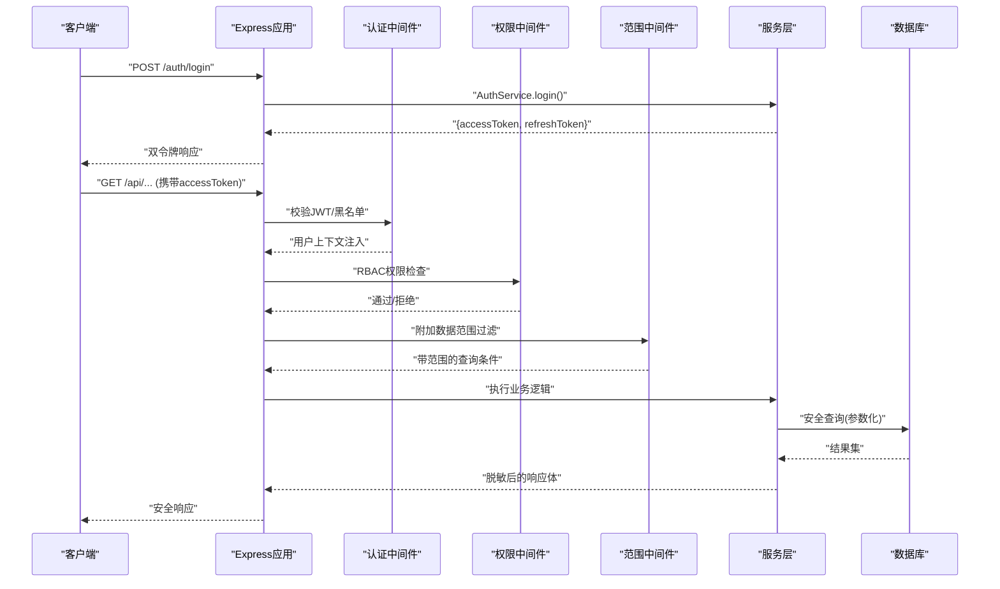
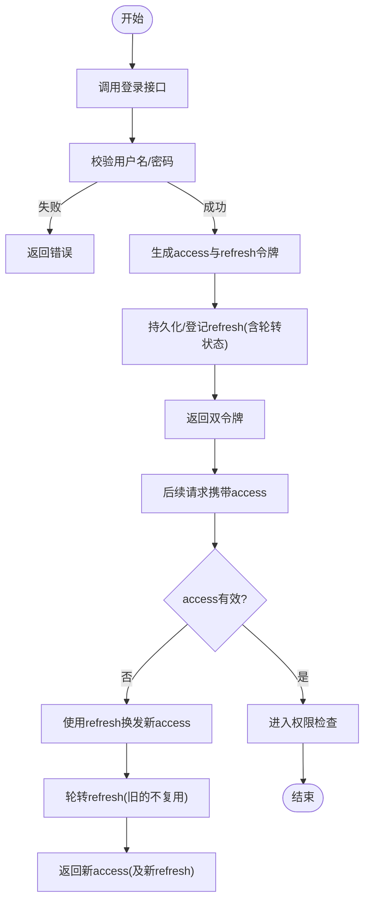
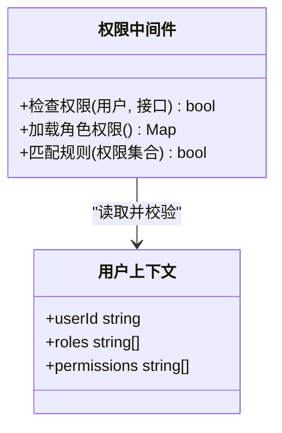
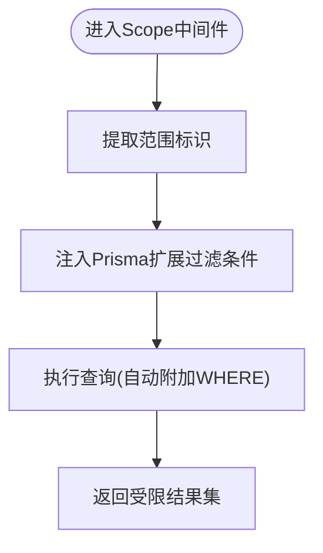
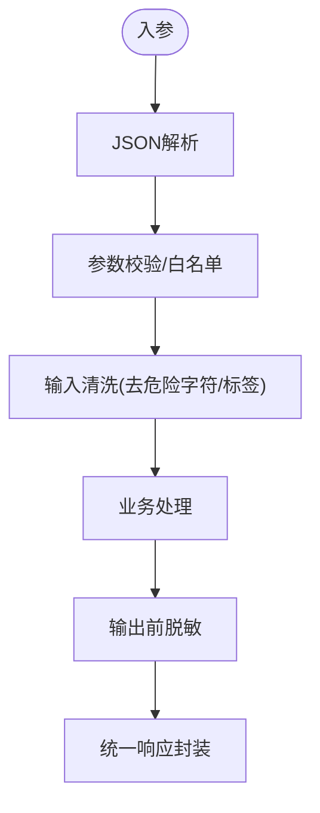
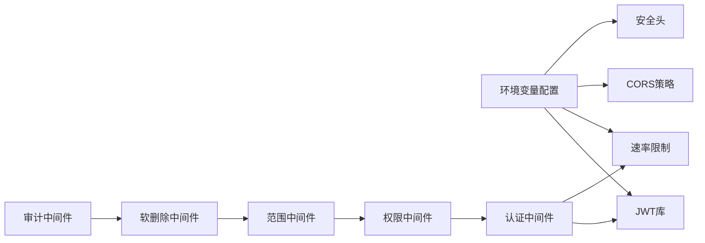
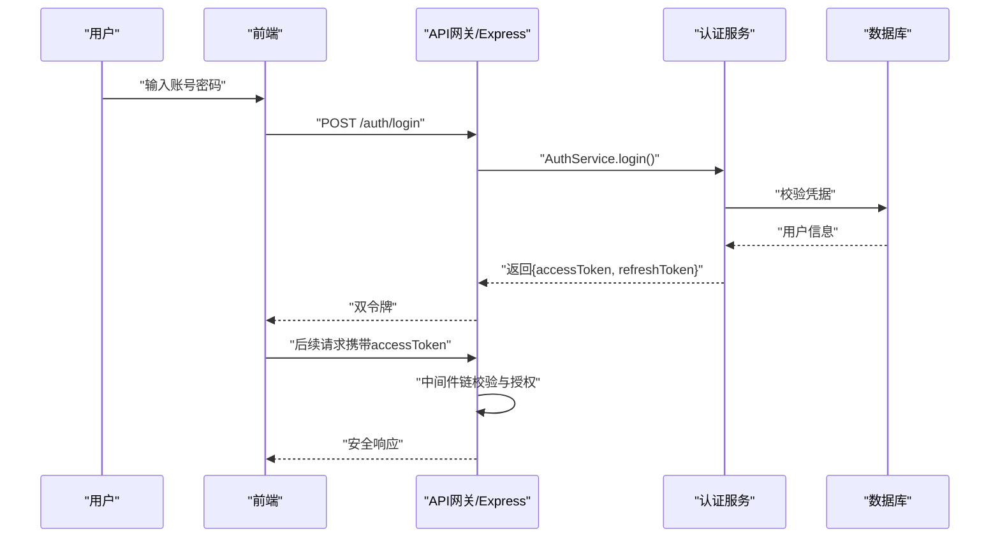

# 安全架构

<cite>
**本文引用的文件**   
- [server/src/app.ts](file://server/src/app.ts)
- [server/src/server.ts](file://server/src/server.ts)
- [server/src/middleware/helmet.ts](file://server/src/middleware/helmet.ts)
- [server/src/middleware/cors.ts](file://server/src/middleware/cors.ts)
- [server/src/middleware/rate-limit.ts](file://server/src/middleware/rate-limit.ts)
- [server/src/middleware/auth.ts](file://server/src/middleware/auth.ts)
- [server/src/middleware/permission.ts](file://server/src/middleware/permission.ts)
- [server/src/middleware/scope.ts](file://server/src/middleware/scope.ts)
- [server/src/middleware/soft-delete.ts](file://server/src/middleware/soft-delete.ts)
- [server/src/middleware/audit.ts](file://server/src/middleware/audit.ts)
- [server/src/lib/jwt.ts](file://server/src/lib/jwt.ts)
- [server/src/lib/sanitize.ts](file://server/src/lib/sanitize.ts)
- [server/src/lib/desensitize.test.ts](file://server/src/lib/desensitize.test.ts)
- [server/src/lib/errors.ts](file://server/src/lib/errors.ts)
- [server/src/lib/response.ts](file://server/src/lib/response.ts)
- [server/src/routes/auth.ts](file://server/src/routes/auth.ts)
- [server/src/services/AuthService.ts](file://server/src/services/AuthService.ts)
- [server/prisma/schema.prisma](file://server/prisma/schema.prisma)
- [server/src/config/env.ts](file://server/src/config/env.ts)
- [docs/plans/安全与权限规范.md](file://docs/plans/安全与权限规范.md)
</cite>

## 目录
1. [引言](#引言)
2. [项目结构](#项目结构)
3. [核心组件](#核心组件)
4. [架构总览](#架构总览)
5. [详细组件分析](#详细组件分析)
6. [依赖关系分析](#依赖关系分析)
7. [性能考量](#性能考量)
8. [故障排查指南](#故障排查指南)
9. [结论](#结论)
10. [附录](#附录)

## 引言
本文件面向FY200财年经营数据分析平台的安全架构，系统性阐述多层安全防护体系的设计与实现。重点覆盖：
- JWT双令牌认证机制（access token 15分钟 + refresh token 7天轮转）
- RBAC权限模型、数据范围控制（scope）
- 输入验证与输出脱敏
- 认证流程：登录验证 → Token生成 → 请求拦截 → 权限检查 → 数据过滤
- 授权机制：角色定义 → 权限分配 → 动态检查 → 资源隔离
- 数据安全策略：敏感信息脱敏、SQL注入防护、XSS攻击防护、CSRF防护
- 审计日志记录策略与安全事件响应流程
- 威胁模型分析与防护措施

## 项目结构
后端采用Express中间件链式处理，按固定顺序执行安全相关中间件，确保在业务逻辑之前完成鉴权、限流、输入清洗与审计等关键动作。

**图示来源** 
- [server/src/app.ts](file://server/src/app.ts)
- [server/src/middleware/helmet.ts](file://server/src/middleware/helmet.ts)
- [server/src/middleware/cors.ts](file://server/src/middleware/cors.ts)
- [server/src/middleware/rate-limit.ts](file://server/src/middleware/rate-limit.ts)
- [server/src/middleware/auth.ts](file://server/src/middleware/auth.ts)
- [server/src/middleware/permission.ts](file://server/src/middleware/permission.ts)
- [server/src/middleware/scope.ts](file://server/src/middleware/scope.ts)
- [server/src/middleware/soft-delete.ts](file://server/src/middleware/soft-delete.ts)
- [server/src/middleware/audit.ts](file://server/src/middleware/audit.ts)

**章节来源**
- [server/src/app.ts](file://server/src/app.ts)
- [server/src/server.ts](file://server/src/server.ts)

## 核心组件
- 认证与令牌管理
  - JWT签发与校验、黑名单管理、刷新令牌轮转
  - 入口：登录接口返回access与refresh双令牌；后续请求携带access，过期时用refresh续期
- 权限与范围控制
  - RBAC：基于角色的访问控制，默认拒绝，显式放行
  - Scope：通过Prisma扩展对查询自动附加租户/组织/公司维度过滤
- 输入与输出安全
  - 输入：JSON解析、速率限制、可选的输入清洗
  - 输出：统一响应封装、敏感字段脱敏
- 审计与可观测性
  - 全链路审计日志、错误统一处理、指标与追踪

**章节来源**
- [server/src/middleware/auth.ts](file://server/src/middleware/auth.ts)
- [server/src/lib/jwt.ts](file://server/src/lib/jwt.ts)
- [server/src/middleware/permission.ts](file://server/src/middleware/permission.ts)
- [server/src/middleware/scope.ts](file://server/src/middleware/scope.ts)
- [server/src/lib/sanitize.ts](file://server/src/lib/sanitize.ts)
- [server/src/lib/response.ts](file://server/src/lib/response.ts)
- [server/src/middleware/audit.ts](file://server/src/middleware/audit.ts)

## 架构总览
下图展示从客户端到数据库的完整安全处理链，以及关键安全决策点。

**图示来源** 
- [server/src/routes/auth.ts](file://server/src/routes/auth.ts)
- [server/src/services/AuthService.ts](file://server/src/services/AuthService.ts)
- [server/src/middleware/auth.ts](file://server/src/middleware/auth.ts)
- [server/src/middleware/permission.ts](file://server/src/middleware/permission.ts)
- [server/src/middleware/scope.ts](file://server/src/middleware/scope.ts)

## 详细组件分析

### 认证与令牌管理（JWT双令牌）
- 设计要点
  - access token有效期短（约15分钟），减少泄露风险
  - refresh token有效期长（约7天），用于无感续期
  - 支持令牌黑名单（登出或强制下线）
  - 刷新令牌轮转：每次使用refresh后发放新的refresh，旧的不复可用
- 流程说明
  - 登录成功返回双令牌
  - 受保护接口仅校验access
  - access过期时前端用refresh换取新access（必要时刷新refresh）
- 关键实现位置
  - 令牌签发与校验：[server/src/lib/jwt.ts](file://server/src/lib/jwt.ts)
  - 认证中间件：[server/src/middleware/auth.ts](file://server/src/middleware/auth.ts)
  - 登录路由与服务：[server/src/routes/auth.ts](file://server/src/routes/auth.ts)、[server/src/services/AuthService.ts](file://server/src/services/AuthService.ts)

**图示来源** 
- [server/src/lib/jwt.ts](file://server/src/lib/jwt.ts)
- [server/src/middleware/auth.ts](file://server/src/middleware/auth.ts)
- [server/src/services/AuthService.ts](file://server/src/services/AuthService.ts)

**章节来源**
- [server/src/lib/jwt.ts](file://server/src/lib/jwt.ts)
- [server/src/middleware/auth.ts](file://server/src/middleware/auth.ts)
- [server/src/routes/auth.ts](file://server/src/routes/auth.ts)
- [server/src/services/AuthService.ts](file://server/src/services/AuthService.ts)

### RBAC权限模型与动态检查
- 角色与权限
  - 角色定义与权限集合由数据模型与配置共同决定
  - 默认拒绝策略：未显式授权的接口一律拒绝
- 动态检查
  - 中间件根据当前用户角色与接口所需权限进行比对
  - 支持细粒度资源级控制（如按模块/功能点）
- 关键实现位置
  - 权限中间件：[server/src/middleware/permission.ts](file://server/src/middleware/permission.ts)
  - 权限常量与工具：[web/src/lib/permissions.ts](file://web/src/lib/permissions.ts)（前端辅助）

**图示来源** 
- [server/src/middleware/permission.ts](file://server/src/middleware/permission.ts)

**章节来源**
- [server/src/middleware/permission.ts](file://server/src/middleware/permission.ts)
- [docs/plans/安全与权限规范.md](file://docs/plans/安全与权限规范.md)

### 数据范围控制（Scope）
- 目标
  - 防止越权访问其他租户/组织/公司的数据
  - 通过Prisma扩展在查询层自动注入过滤条件
- 机制
  - 中间件从用户上下文提取范围标识（如company_id、org_id）
  - 将范围条件注入到所有数据查询中，避免业务代码遗漏
- 关键实现位置
  - 范围中间件：[server/src/middleware/scope.ts](file://server/src/middleware/scope.ts)
  - Prisma扩展与Schema：[server/prisma/schema.prisma](file://server/prisma/schema.prisma)

**图示来源** 
- [server/src/middleware/scope.ts](file://server/src/middleware/scope.ts)
- [server/prisma/schema.prisma](file://server/prisma/schema.prisma)

**章节来源**
- [server/src/middleware/scope.ts](file://server/src/middleware/scope.ts)
- [server/prisma/schema.prisma](file://server/prisma/schema.prisma)

### 输入验证与输出脱敏
- 输入侧
  - JSON解析与基础校验
  - 速率限制防刷
  - 可选的输入清洗（防XSS/注入）
- 输出侧
  - 统一响应封装
  - 敏感字段脱敏（金额区间化、公司名称映射等）
- 关键实现位置
  - 输入清洗：[server/src/lib/sanitize.ts](file://server/src/lib/sanitize.ts)
  - 脱敏测试用例：[server/src/lib/desensitize.test.ts](file://server/src/lib/desensitize.test.ts)
  - 统一响应：[server/src/lib/response.ts](file://server/src/lib/response.ts)

**图示来源** 
- [server/src/lib/sanitize.ts](file://server/src/lib/sanitize.ts)
- [server/src/lib/desensitize.test.ts](file://server/src/lib/desensitize.test.ts)
- [server/src/lib/response.ts](file://server/src/lib/response.ts)

**章节来源**
- [server/src/lib/sanitize.ts](file://server/src/lib/sanitize.ts)
- [server/src/lib/desensitize.test.ts](file://server/src/lib/desensitize.test.ts)
- [server/src/lib/response.ts](file://server/src/lib/response.ts)

### 安全头与跨域控制
- Helmet：设置安全响应头（HSTS、X-Frame-Options、Content-Security-Policy等）
- CORS：严格限定允许的源、方法与头部
- 关键实现位置
  - Helmet中间件：[server/src/middleware/helmet.ts](file://server/src/middleware/helmet.ts)
  - CORS中间件：[server/src/middleware/cors.ts](file://server/src/middleware/cors.ts)

**章节来源**
- [server/src/middleware/helmet.ts](file://server/src/middleware/helmet.ts)
- [server/src/middleware/cors.ts](file://server/src/middleware/cors.ts)

### 速率限制与抗滥用
- 目的：防止暴力破解、枚举、DDoS
- 策略：按IP/用户维度限流，结合指数退避与告警
- 关键实现位置
  - 速率限制中间件：[server/src/middleware/rate-limit.ts](file://server/src/middleware/rate-limit.ts)

**章节来源**
- [server/src/middleware/rate-limit.ts](file://server/src/middleware/rate-limit.ts)

### 软删除与数据可见性
- 目的：保证逻辑删除的数据不可见，避免误暴露
- 机制：中间件自动为查询附加isDeleted=false条件
- 关键实现位置
  - 软删除中间件：[server/src/middleware/soft-delete.ts](file://server/src/middleware/soft-delete.ts)

**章节来源**
- [server/src/middleware/soft-delete.ts](file://server/src/middleware/soft-delete.ts)

### 审计日志与安全事件
- 记录内容：请求路径、方法、用户、耗时、结果码、关键参数（脱敏后）
- 触发时机：每个受保护请求进入与离开审计中间件
- 关键实现位置
  - 审计中间件：[server/src/middleware/audit.ts](file://server/src/middleware/audit.ts)

**章节来源**
- [server/src/middleware/audit.ts](file://server/src/middleware/audit.ts)

## 依赖关系分析
- 中间件依赖顺序严格，任何错位都会导致安全漏洞
- 认证依赖JWT库与环境变量配置
- 权限与范围依赖用户上下文与数据模型
- 输入/输出安全依赖清洗与脱敏工具

**图示来源** 
- [server/src/config/env.ts](file://server/src/config/env.ts)
- [server/src/lib/jwt.ts](file://server/src/lib/jwt.ts)
- [server/src/middleware/rate-limit.ts](file://server/src/middleware/rate-limit.ts)
- [server/src/middleware/cors.ts](file://server/src/middleware/cors.ts)
- [server/src/middleware/helmet.ts](file://server/src/middleware/helmet.ts)
- [server/src/middleware/auth.ts](file://server/src/middleware/auth.ts)
- [server/src/middleware/permission.ts](file://server/src/middleware/permission.ts)
- [server/src/middleware/scope.ts](file://server/src/middleware/scope.ts)
- [server/src/middleware/soft-delete.ts](file://server/src/middleware/soft-delete.ts)
- [server/src/middleware/audit.ts](file://server/src/middleware/audit.ts)

**章节来源**
- [server/src/config/env.ts](file://server/src/config/env.ts)
- [server/src/lib/jwt.ts](file://server/src/lib/jwt.ts)

## 性能考量
- 令牌校验开销低，建议缓存黑名单与角色权限映射
- 范围过滤在Prisma层执行，避免N+1与过度过滤
- 脱敏与清洗应在必要处启用，避免全量字符串操作
- 速率限制应分级配置，区分登录与常规接口

[本节为通用指导，不直接分析具体文件]

## 故障排查指南
- 常见问题
  - 401/403：检查JWT有效性、黑名单、RBAC权限配置
  - 数据越权：确认Scope是否正确注入，用户上下文是否包含范围标识
  - 脱敏异常：核对脱敏规则与字段映射
  - 限流触发：查看限流阈值与计数键
- 定位手段
  - 审计日志：快速定位请求轨迹与耗时
  - 错误统一处理：查看标准化错误信息
  - 单元测试：参考现有测试用例验证行为

**章节来源**
- [server/src/lib/errors.ts](file://server/src/lib/errors.ts)
- [server/src/lib/response.ts](file://server/src/lib/response.ts)
- [server/src/middleware/audit.ts](file://server/src/middleware/audit.ts)

## 结论
FY200安全架构以“最小权限、纵深防御”为原则，通过严格的中间件链、JWT双令牌、RBAC与Scope控制、输入输出安全与审计，构建了覆盖认证、授权、数据与传输的全栈防护体系。建议在持续演进中强化威胁建模、渗透测试与自动化安全扫描，确保系统长期稳健。

[本节为总结性内容，不直接分析具体文件]

## 附录

### 威胁模型与防护措施
- 威胁类别
  - 令牌劫持与重放：短期access、HTTPS、黑名单、刷新轮转
  - 越权访问：RBAC默认拒绝、Scope强制过滤
  - 注入与XSS：参数化查询、输入清洗、CSP与安全头
  - CSRF：SameSite Cookie、严格CORS、自定义Header校验
  - 滥用与DDoS：速率限制、熔断与降级
- 防护矩阵
  - 认证：JWT签名校验、黑名单、刷新轮转
  - 授权：RBAC、资源级权限、默认拒绝
  - 数据：Prisma参数化、Scope注入、软删除
  - 传输：TLS、CSP、HSTS、CORS白名单
  - 审计：全链路日志、敏感信息脱敏、告警

[本节为概念性内容，不直接分析具体文件]

### 认证流程图（端到端）

**图示来源** 
- [server/src/routes/auth.ts](file://server/src/routes/auth.ts)
- [server/src/services/AuthService.ts](file://server/src/services/AuthService.ts)
- [server/src/middleware/auth.ts](file://server/src/middleware/auth.ts)
- [server/src/middleware/permission.ts](file://server/src/middleware/permission.ts)
- [server/src/middleware/scope.ts](file://server/src/middleware/scope.ts)