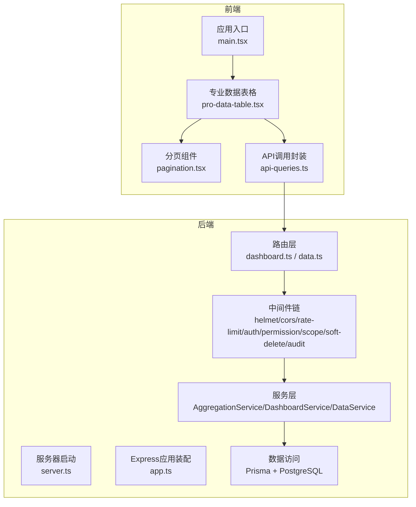
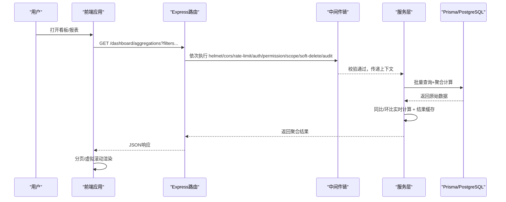
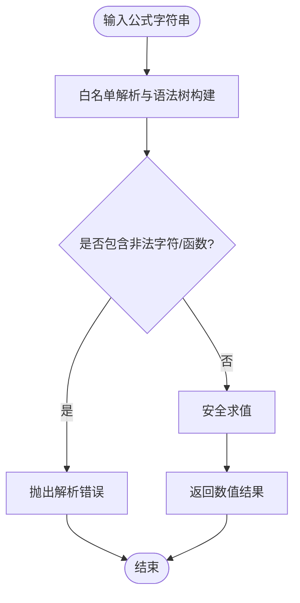
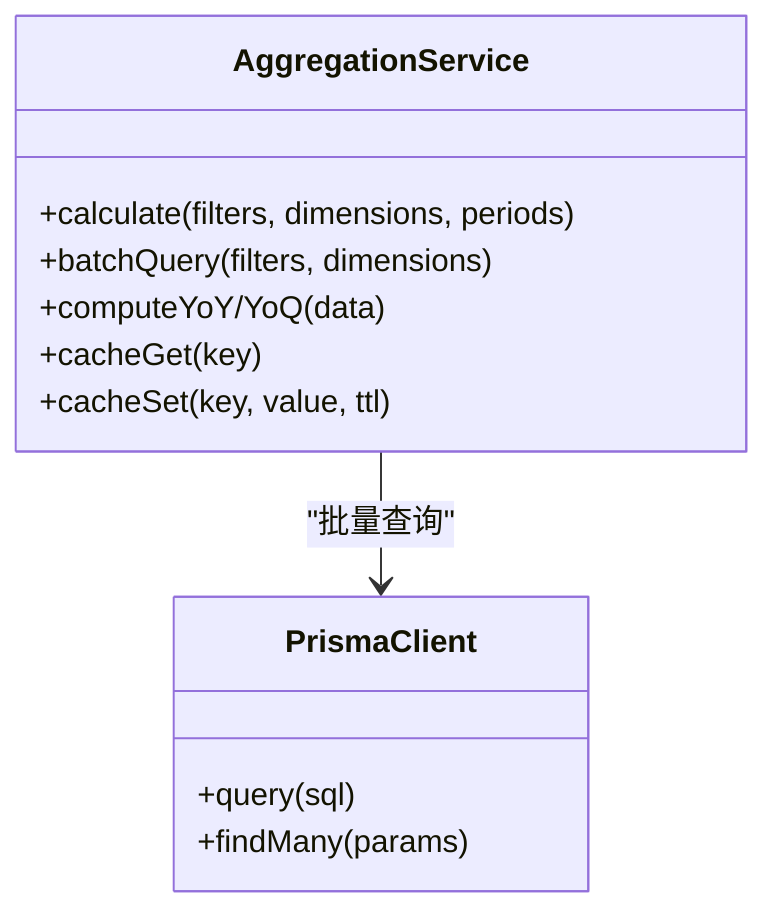
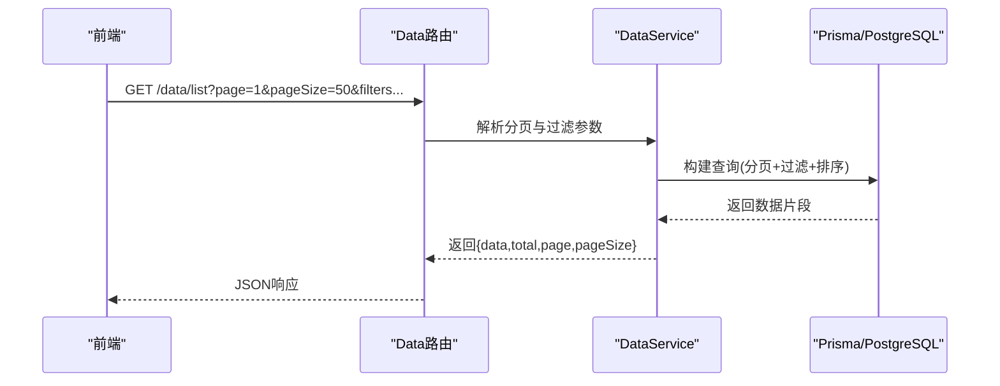
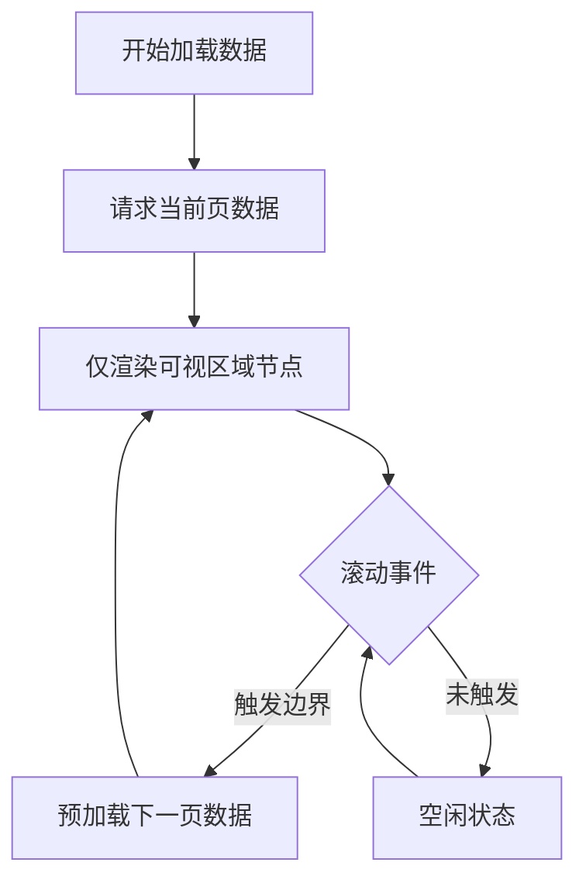
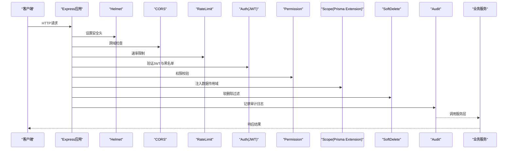
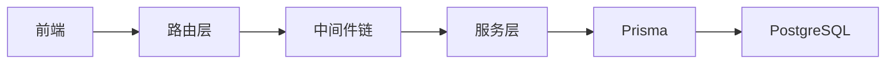

# 性能架构

<cite>
**本文引用的文件**   
- [server/src/app.ts](file://server/src/app.ts)
- [server/src/server.ts](file://server/src/server.ts)
- [server/src/config/env.ts](file://server/src/config/env.ts)
- [server/src/middleware/helmet.ts](file://server/src/middleware/helmet.ts)
- [server/src/middleware/cors.ts](file://server/src/middleware/cors.ts)
- [server/src/middleware/rate-limit.ts](file://server/src/middleware/rate-limit.ts)
- [server/src/middleware/auth.ts](file://server/src/middleware/auth.ts)
- [server/src/middleware/permission.ts](file://server/src/middleware/permission.ts)
- [server/src/middleware/scope.ts](file://server/src/middleware/scope.ts)
- [server/src/middleware/soft-delete.ts](file://server/src/middleware/soft-delete.ts)
- [server/src/middleware/audit.ts](file://server/src/middleware/audit.ts)
- [server/src/middleware/error-handler.ts](file://server/src/middleware/error-handler.ts)
- [server/src/middleware/trace-id.ts](file://server/src/middleware/trace-id.ts)
- [server/src/lib/formula.ts](file://server/src/lib/formula.ts)
- [server/src/services/AggregationService.ts](file://server/src/services/AggregationService.ts)
- [server/src/services/DashboardService.ts](file://server/src/services/DashboardService.ts)
- [server/src/services/DataService.ts](file://server/src/services/DataService.ts)
- [server/src/routes/dashboard.ts](file://server/src/routes/dashboard.ts)
- [server/src/routes/data.ts](file://server/src/routes/data.ts)
- [server/src/lib/prisma.ts](file://server/src/lib/prisma.ts)
- [server/prisma/schema.prisma](file://server/prisma/schema.prisma)
- [web/src/components/data-table/pro-data-table.tsx](file://web/src/components/data-table/pro-data-table.tsx)
- [web/src/components/data-table/pagination.tsx](file://web/src/components/data-table/pagination.tsx)
- [web/src/hooks/api-queries.ts](file://web/src/hooks/api-queries.ts)
- [web/vite.config.ts](file://web/vite.config.ts)
- [docs/references/performance.md](file://docs/references/performance.md)
</cite>

## 目录
1. [引言](#引言)
2. [项目结构](#项目结构)
3. [核心组件](#核心组件)
4. [架构总览](#架构总览)
5. [详细组件分析](#详细组件分析)
6. [依赖分析](#依赖分析)
7. [性能考量](#性能考量)
8. [故障排查指南](#故障排查指南)
9. [结论](#结论)
10. [附录](#附录)

## 引言
本文件面向FY200（浙江壹品慧财年经营数据分析平台）的性能架构，聚焦“Excel进、看板/报表出”的业务场景，围绕数据库查询优化、内存缓存策略、异步处理机制与前端渲染优化等层次化策略展开。文档同时覆盖关键瓶颈的解决方案：公式计算的白名单解析避免eval开销、聚合服务的批量计算与结果缓存、大数据表格的分页加载与虚拟滚动；并给出监控诊断、性能测试与基准、水平/垂直扩展方案，以及CDN与静态资源优化、浏览器缓存策略的实践建议。

## 项目结构
后端采用Express中间件链式处理请求，结合Prisma与PostgreSQL进行数据访问；服务层封装业务逻辑（如聚合、指标、报表、导入导出等），路由层负责接口编排。前端基于React/Vite构建，提供专业数据表格、图表与页面布局，强调分页与虚拟滚动以提升大数据渲染性能。

**图示来源** 
- [server/src/server.ts](file://server/src/server.ts)
- [server/src/app.ts](file://server/src/app.ts)
- [server/src/routes/dashboard.ts](file://server/src/routes/dashboard.ts)
- [server/src/routes/data.ts](file://server/src/routes/data.ts)
- [server/src/middleware/helmet.ts](file://server/src/middleware/helmet.ts)
- [server/src/middleware/cors.ts](file://server/src/middleware/cors.ts)
- [server/src/middleware/rate-limit.ts](file://server/src/middleware/rate-limit.ts)
- [server/src/middleware/auth.ts](file://server/src/middleware/auth.ts)
- [server/src/middleware/permission.ts](file://server/src/middleware/permission.ts)
- [server/src/middleware/scope.ts](file://server/src/middleware/scope.ts)
- [server/src/middleware/soft-delete.ts](file://server/src/middleware/soft-delete.ts)
- [server/src/middleware/audit.ts](file://server/src/middleware/audit.ts)
- [server/src/services/AggregationService.ts](file://server/src/services/AggregationService.ts)
- [server/src/services/DashboardService.ts](file://server/src/services/DashboardService.ts)
- [server/src/services/DataService.ts](file://server/src/services/DataService.ts)
- [server/src/lib/prisma.ts](file://server/src/lib/prisma.ts)
- [web/src/components/data-table/pro-data-table.tsx](file://web/src/components/data-table/pro-data-table.tsx)
- [web/src/components/data-table/pagination.tsx](file://web/src/components/data-table/pagination.tsx)
- [web/src/hooks/api-queries.ts](file://web/src/hooks/api-queries.ts)

**章节来源**
- [server/src/server.ts](file://server/src/server.ts)
- [server/src/app.ts](file://server/src/app.ts)
- [server/src/config/env.ts](file://server/src/config/env.ts)

## 核心组件
- 安全公式解析器：通过白名单算子（加减乘除与括号）实现表达式求值，避免使用eval带来的安全风险与性能抖动。
- 聚合服务：对多维指标进行批量计算，支持同比/环比实时计算与结果缓存，降低重复计算开销。
- 数据服务：封装分页、过滤、排序与导出能力，配合Prisma高效查询与索引优化。
- 中间件链：按顺序执行安全、限流、鉴权、权限、作用域、软删除、审计等横切关注点，保障系统稳定与安全。
- 前端专业表格：分页加载与虚拟滚动，减少DOM节点数量，提升大数据渲染性能。

**章节来源**
- [server/src/lib/formula.ts](file://server/src/lib/formula.ts)
- [server/src/services/AggregationService.ts](file://server/src/services/AggregationService.ts)
- [server/src/services/DataService.ts](file://server/src/services/DataService.ts)
- [server/src/middleware/auth.ts](file://server/src/middleware/auth.ts)
- [server/src/middleware/permission.ts](file://server/src/middleware/permission.ts)
- [server/src/middleware/scope.ts](file://server/src/middleware/scope.ts)
- [server/src/middleware/soft-delete.ts](file://server/src/middleware/soft-delete.ts)
- [server/src/middleware/audit.ts](file://server/src/middleware/audit.ts)
- [web/src/components/data-table/pro-data-table.tsx](file://web/src/components/data-table/pro-data-table.tsx)
- [web/src/components/data-table/pagination.tsx](file://web/src/components/data-table/pagination.tsx)

## 架构总览
整体架构遵循“前端轻量渲染 + 后端强计算 + 数据库精准查询”的分层模式。请求进入后，经过中间件链完成安全加固、限流、鉴权、权限与作用域控制，再交由服务层进行业务计算与数据组装，最终通过Prisma访问PostgreSQL。前端通过分页与虚拟滚动降低渲染压力，并通过缓存与懒加载提升交互体验。

**图示来源** 
- [server/src/app.ts](file://server/src/app.ts)
- [server/src/routes/dashboard.ts](file://server/src/routes/dashboard.ts)
- [server/src/middleware/helmet.ts](file://server/src/middleware/helmet.ts)
- [server/src/middleware/cors.ts](file://server/src/middleware/cors.ts)
- [server/src/middleware/rate-limit.ts](file://server/src/middleware/rate-limit.ts)
- [server/src/middleware/auth.ts](file://server/src/middleware/auth.ts)
- [server/src/middleware/permission.ts](file://server/src/middleware/permission.ts)
- [server/src/middleware/scope.ts](file://server/src/middleware/scope.ts)
- [server/src/middleware/soft-delete.ts](file://server/src/middleware/soft-delete.ts)
- [server/src/middleware/audit.ts](file://server/src/middleware/audit.ts)
- [server/src/services/AggregationService.ts](file://server/src/services/AggregationService.ts)
- [server/src/lib/prisma.ts](file://server/src/lib/prisma.ts)

## 详细组件分析

### 安全公式解析与计算（避免eval开销）
- 设计要点：仅允许白名单算子（+-*/()），在解析阶段进行语法树构建与校验，运行时直接求值，避免动态代码执行的安全风险与性能抖动。
- 性能影响：相比eval，解析器具备更稳定的时间复杂度与可预测的内存占用，适合高频计算场景。
- 适用场景：指标公式、自定义规则、动态计算字段。

**图示来源** 
- [server/src/lib/formula.ts](file://server/src/lib/formula.ts)

**章节来源**
- [server/src/lib/formula.ts](file://server/src/lib/formula.ts)

### 聚合服务（批量计算与结果缓存）
- 设计要点：将多维度指标聚合为批处理任务，利用Prisma批量查询与SQL聚合函数减少往返次数；对热点查询结果进行内存缓存（键由过滤条件、维度、时间窗口组成）。
- 性能影响：显著降低数据库负载与CPU峰值，提高QPS与P95延迟稳定性。
- 适用场景：看板指标、报表汇总、同比/环比计算。

**图示来源** 
- [server/src/services/AggregationService.ts](file://server/src/services/AggregationService.ts)
- [server/src/lib/prisma.ts](file://server/src/lib/prisma.ts)

**章节来源**
- [server/src/services/AggregationService.ts](file://server/src/services/AggregationService.ts)

### 数据服务（分页、过滤、排序与导出）
- 设计要点：统一封装分页参数（page、pageSize）、过滤条件与排序字段，结合Prisma的where与orderBy生成高效查询；导出功能采用流式写入以减少内存峰值。
- 性能影响：避免全表扫描与大对象传输，提升列表页与导出任务的吞吐。
- 适用场景：交易明细、科目分析、库存清单等大数据集展示与导出。

**图示来源** 
- [server/src/routes/data.ts](file://server/src/routes/data.ts)
- [server/src/services/DataService.ts](file://server/src/services/DataService.ts)
- [server/src/lib/prisma.ts](file://server/src/lib/prisma.ts)

**章节来源**
- [server/src/routes/data.ts](file://server/src/routes/data.ts)
- [server/src/services/DataService.ts](file://server/src/services/DataService.ts)

### 前端专业表格（分页加载与虚拟滚动）
- 设计要点：分页加载减少首屏数据量，虚拟滚动仅渲染可视区域节点，避免大量DOM导致的卡顿；结合骨架屏与懒加载提升感知性能。
- 性能影响：大幅降低主线程阻塞与内存占用，提升滚动流畅度。
- 适用场景：大数据表格、交易流水、科目明细等。

**图示来源** 
- [web/src/components/data-table/pro-data-table.tsx](file://web/src/components/data-table/pro-data-table.tsx)
- [web/src/components/data-table/pagination.tsx](file://web/src/components/data-table/pagination.tsx)
- [web/src/hooks/api-queries.ts](file://web/src/hooks/api-queries.ts)

**章节来源**
- [web/src/components/data-table/pro-data-table.tsx](file://web/src/components/data-table/pro-data-table.tsx)
- [web/src/components/data-table/pagination.tsx](file://web/src/components/data-table/pagination.tsx)
- [web/src/hooks/api-queries.ts](file://web/src/hooks/api-queries.ts)

### 中间件链（安全、限流、鉴权、权限、作用域、软删除、审计）
- 设计要点：严格顺序执行，确保每个请求都经过安全加固、速率限制、身份认证、授权校验、数据作用域注入、软删除过滤与审计记录。
- 性能影响：合理配置限流与缓存可减少无效请求与重复计算；作用域过滤避免越权与不必要的数据扫描。
- 适用场景：所有HTTP请求的统一横切处理。

**图示来源** 
- [server/src/app.ts](file://server/src/app.ts)
- [server/src/middleware/helmet.ts](file://server/src/middleware/helmet.ts)
- [server/src/middleware/cors.ts](file://server/src/middleware/cors.ts)
- [server/src/middleware/rate-limit.ts](file://server/src/middleware/rate-limit.ts)
- [server/src/middleware/auth.ts](file://server/src/middleware/auth.ts)
- [server/src/middleware/permission.ts](file://server/src/middleware/permission.ts)
- [server/src/middleware/scope.ts](file://server/src/middleware/scope.ts)
- [server/src/middleware/soft-delete.ts](file://server/src/middleware/soft-delete.ts)
- [server/src/middleware/audit.ts](file://server/src/middleware/audit.ts)

**章节来源**
- [server/src/app.ts](file://server/src/app.ts)
- [server/src/middleware/helmet.ts](file://server/src/middleware/helmet.ts)
- [server/src/middleware/cors.ts](file://server/src/middleware/cors.ts)
- [server/src/middleware/rate-limit.ts](file://server/src/middleware/rate-limit.ts)
- [server/src/middleware/auth.ts](file://server/src/middleware/auth.ts)
- [server/src/middleware/permission.ts](file://server/src/middleware/permission.ts)
- [server/src/middleware/scope.ts](file://server/src/middleware/scope.ts)
- [server/src/middleware/soft-delete.ts](file://server/src/middleware/soft-delete.ts)
- [server/src/middleware/audit.ts](file://server/src/middleware/audit.ts)

## 依赖分析
- 模块耦合：路由层依赖中间件与服务层；服务层依赖Prisma与PostgreSQL；前端依赖API封装与UI组件。
- 外部依赖：Express、Prisma、PostgreSQL、JWT、DeepSeek API（SSE流式）。
- 潜在循环依赖：服务层应避免反向引用路由或中间件，保持单向依赖。

**图示来源** 
- [server/src/app.ts](file://server/src/app.ts)
- [server/src/lib/prisma.ts](file://server/src/lib/prisma.ts)
- [server/prisma/schema.prisma](file://server/prisma/schema.prisma)

**章节来源**
- [server/src/app.ts](file://server/src/app.ts)
- [server/src/lib/prisma.ts](file://server/src/lib/prisma.ts)
- [server/prisma/schema.prisma](file://server/prisma/schema.prisma)

## 性能考量
- 数据库查询优化
  - 使用Prisma的批量查询与SQL聚合函数，减少往返次数与网络开销。
  - 针对高频过滤字段建立索引，避免全表扫描。
  - 分页与游标结合，避免大偏移量查询。
- 内存缓存策略
  - 热点聚合结果按查询键缓存，设置合理TTL与失效策略。
  - 缓存命中率监控与动态扩容，防止内存泄漏。
- 异步处理机制
  - 耗时任务（如导入、导出、AI分析）采用队列与异步执行，避免阻塞主线程。
  - SSE流式响应用于AI管道，提升用户体验。
- 前端渲染优化
  - 分页加载与虚拟滚动降低DOM压力。
  - 懒加载与骨架屏提升首屏感知速度。
  - 静态资源压缩与按需打包（Vite）减少体积。

[本节为通用指导，不直接分析具体文件]

## 故障排查指南
- 性能指标收集
  - 使用中间件记录请求耗时、状态码分布与错误率。
  - 服务层埋点关键路径（解析、查询、计算、缓存命中）。
- 慢查询分析
  - 开启PostgreSQL慢查询日志，定位高耗时SQL。
  - 使用EXPLAIN ANALYZE分析执行计划，优化索引与查询结构。
- 内存泄漏检测
  - 监控Node.js堆内存与GC频率，识别异常增长。
  - 缓存键空间清理与TTL校验，避免过期条目堆积。
- 常见错误
  - 公式解析失败：检查白名单与语法树构建。
  - 鉴权失败：确认JWT有效性与黑名单状态。
  - 权限不足：校验角色与资源范围。

**章节来源**
- [server/src/middleware/error-handler.ts](file://server/src/middleware/error-handler.ts)
- [server/src/middleware/audit.ts](file://server/src/middleware/audit.ts)
- [server/src/lib/logger.ts](file://server/src/lib/logger.ts)

## 结论
FY200性能架构通过多层次优化策略，实现了从数据库到前端的端到端性能提升。安全公式解析、聚合服务缓存、分页与虚拟滚动是关键瓶颈的有效解法。结合监控诊断与基准测试，持续迭代优化，可支撑大规模数据与高并发场景。水平扩展适用于无状态服务与缓存层，垂直扩展适用于计算密集型任务与数据库调优。CDN与静态资源优化进一步提升前端交付效率。

[本节为总结性内容，不直接分析具体文件]

## 附录
- 性能测试策略
  - 使用压测工具模拟多用户并发，评估QPS、延迟与错误率。
  - 针对热点接口进行专项测试，验证缓存命中与降级策略。
- 基准测试结果
  - 记录不同数据规模下的响应时间与资源占用，形成基线对比。
- 优化案例
  - 公式解析替换eval后，CPU峰值下降，延迟抖动减少。
  - 聚合服务引入缓存后，P95延迟显著改善。
- 扩展方案
  - 水平扩展：增加服务实例与缓存节点，负载均衡分发请求。
  - 垂直扩展：提升CPU/内存与数据库I/O，优化索引与查询。
- CDN与静态资源优化
  - 启用CDN缓存静态资源，缩短首屏加载时间。
  - 使用浏览器缓存策略（Cache-Control、ETag）减少重复下载。

[本节为补充信息，不直接分析具体文件]