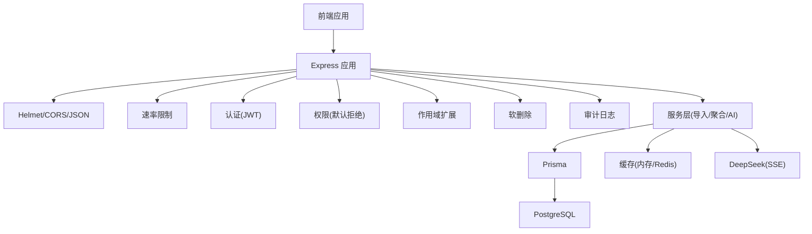
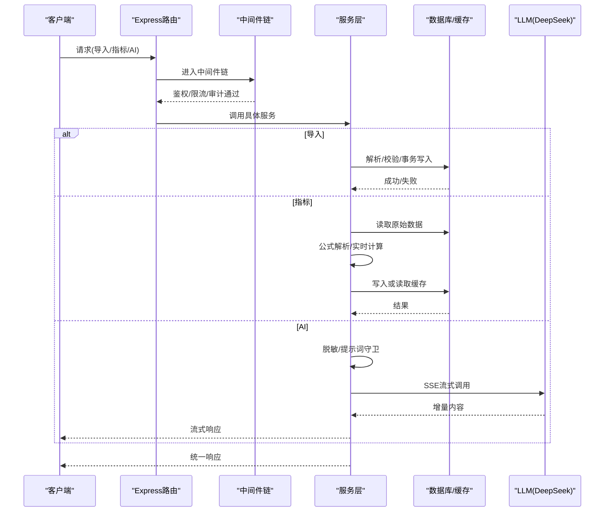
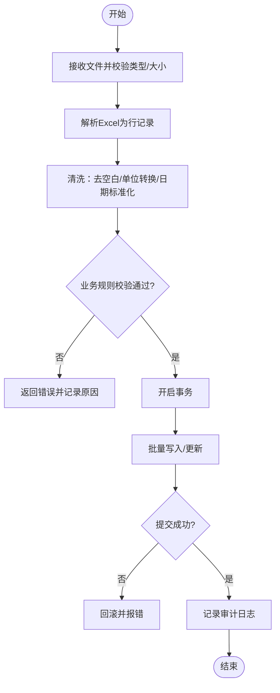
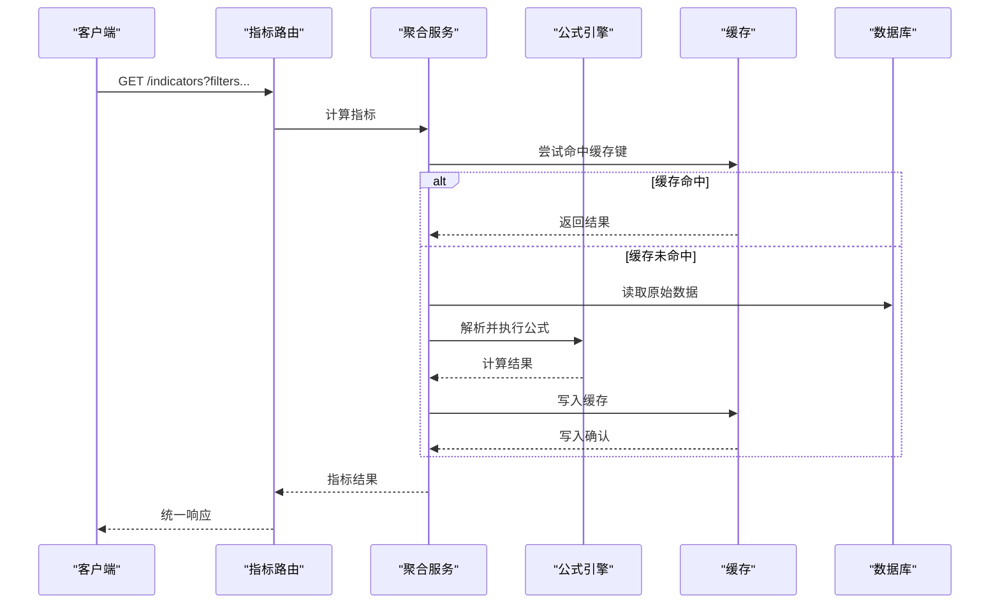
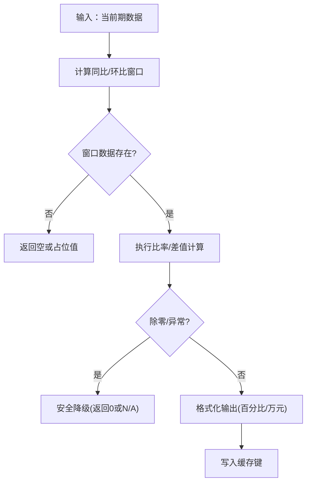
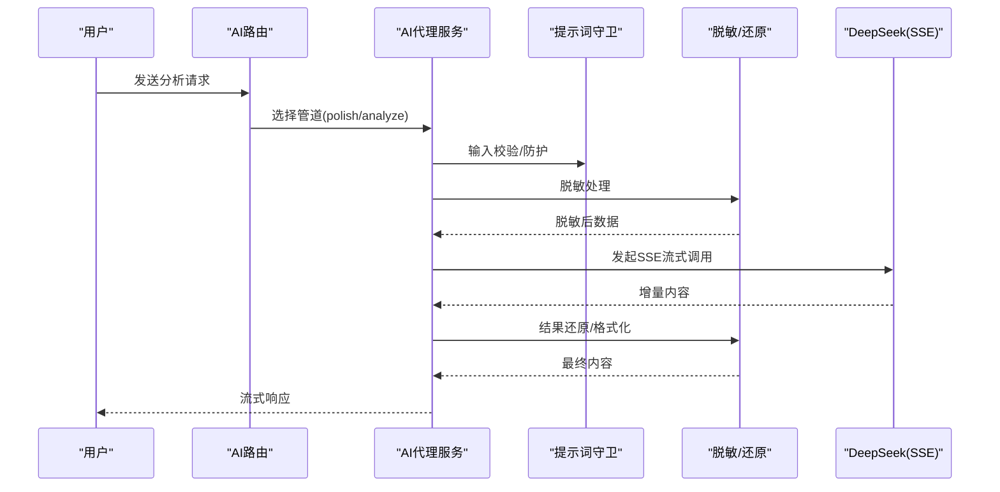
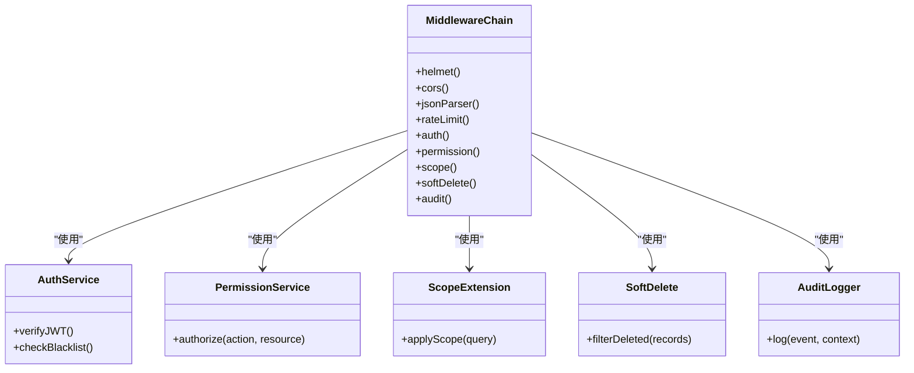
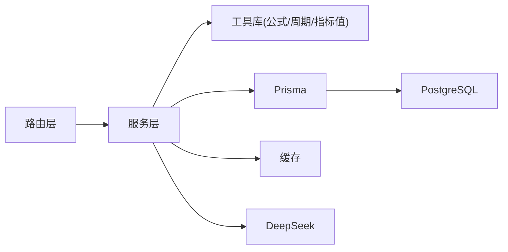

# 数据流设计

<cite>
**本文引用的文件**   
- [server/src/app.ts](file://server/src/app.ts)
- [server/src/server.ts](file://server/src/server.ts)
- [server/src/middleware/auth.ts](file://server/src/middleware/auth.ts)
- [server/src/middleware/permission.ts](file://server/src/middleware/permission.ts)
- [server/src/middleware/scope.ts](file://server/src/middleware/scope.ts)
- [server/src/middleware/soft-delete.ts](file://server/src/middleware/soft-delete.ts)
- [server/src/middleware/audit.ts](file://server/src/middleware/audit.ts)
- [server/src/middleware/rate-limit.ts](file://server/src/middleware/rate-limit.ts)
- [server/src/middleware/ai-rate-limit.ts](file://server/src/middleware/ai-rate-limit.ts)
- [server/src/routes/data.ts](file://server/src/routes/data.ts)
- [server/src/routes/indicators.ts](file://server/src/routes/indicators.ts)
- [server/src/routes/ai.ts](file://server/src/routes/ai.ts)
- [server/src/services/ImportService.ts](file://server/src/services/ImportService.ts)
- [server/src/lib/excel-import.ts](file://server/src/lib/excel-import.ts)
- [server/src/lib/formula.ts](file://server/src/lib/formula.ts)
- [server/src/services/AggregationService.ts](file://server/src/services/AggregationService.ts)
- [server/src/lib/metric-values.ts](file://server/src/lib/metric-values.ts)
- [server/src/lib/period.ts](file://server/src/lib/period.ts)
- [server/src/services/AIProxyService.ts](file://server/src/services/AIProxyService.ts)
- [server/src/lib/deepseek.ts](file://server/src/lib/deepseek.ts)
- [server/src/lib/desensitize.ts](file://server/src/lib/desensitize.ts)
- [server/src/lib/prompt-guard.ts](file://server/src/lib/prompt-guard.ts)
- [server/src/lib/errors.ts](file://server/src/lib/errors.ts)
- [server/src/lib/response.ts](file://server/src/lib/response.ts)
- [server/src/lib/prisma.ts](file://server/src/lib/prisma.ts)
- [server/prisma/schema.prisma](file://server/prisma/schema.prisma)
</cite>

## 目录
1. [引言](#引言)
2. [项目结构](#项目结构)
3. [核心组件](#核心组件)
4. [架构总览](#架构总览)
5. [详细组件分析](#详细组件分析)
6. [依赖关系分析](#依赖关系分析)
7. [性能考量](#性能考量)
8. [故障排查指南](#故障排查指南)
9. [结论](#结论)
10. [附录](#附录)

## 引言
本文件面向FY200系统的数据流设计，围绕“Excel进、看板/报表出”的核心目标，完整描述从Excel导入到数据分析展示的端到端数据流转。重点覆盖：
- 数据导入流程：文件上传 → 格式验证 → 数据清洗 → 业务规则校验 → 数据库存储
- 指标计算数据流：原始数据 → 公式解析 → 实时计算 → 结果缓存 → API响应
- 同比/环比算法实现与性能优化策略
- AI分析数据流：用户输入 → 数据脱敏 → LLM调用 → 结果还原 → 格式化输出
- 数据一致性保证、事务处理与并发控制策略
- 错误恢复机制与可观测性

## 项目结构
后端采用Express路由+中间件链式处理，服务层按职责拆分（导入、聚合、AI代理等），Prisma作为ORM访问PostgreSQL。前端通过API与后端交互，展示看板与报表。

图表来源
- [server/src/app.ts](file://server/src/app.ts)
- [server/src/server.ts](file://server/src/server.ts)
- [server/src/middleware/rate-limit.ts](file://server/src/middleware/rate-limit.ts)
- [server/src/middleware/auth.ts](file://server/src/middleware/auth.ts)
- [server/src/middleware/permission.ts](file://server/src/middleware/permission.ts)
- [server/src/middleware/scope.ts](file://server/src/middleware/scope.ts)
- [server/src/middleware/soft-delete.ts](file://server/src/middleware/soft-delete.ts)
- [server/src/middleware/audit.ts](file://server/src/middleware/audit.ts)
- [server/src/lib/prisma.ts](file://server/src/lib/prisma.ts)

章节来源
- [server/src/app.ts](file://server/src/app.ts)
- [server/src/server.ts](file://server/src/server.ts)

## 核心组件
- 导入服务：负责Excel解析、字段映射、清洗、校验与批量入库
- 聚合服务：基于安全公式引擎进行指标计算，支持同比/环比
- AI代理服务：双管道（polish/analyze）完成文本与结构化数据的LLM调用
- 指标值工具：提供指标值的标准化与缓存键生成
- 周期工具：时间维度与同比/环比窗口计算
- Prisma与数据库：统一数据访问与迁移管理

章节来源
- [server/src/services/ImportService.ts](file://server/src/services/ImportService.ts)
- [server/src/lib/excel-import.ts](file://server/src/lib/excel-import.ts)
- [server/src/services/AggregationService.ts](file://server/src/services/AggregationService.ts)
- [server/src/lib/formula.ts](file://server/src/lib/formula.ts)
- [server/src/lib/metric-values.ts](file://server/src/lib/metric-values.ts)
- [server/src/lib/period.ts](file://server/src/lib/period.ts)
- [server/src/services/AIProxyService.ts](file://server/src/services/AIProxyService.ts)
- [server/src/lib/deepseek.ts](file://server/src/lib/deepseek.ts)
- [server/src/lib/desensitize.ts](file://server/src/lib/desensitize.ts)
- [server/src/lib/prompt-guard.ts](file://server/src/lib/prompt-guard.ts)
- [server/prisma/schema.prisma](file://server/prisma/schema.prisma)

## 架构总览
整体数据流遵循“中间件链 → 路由 → 服务层 → 数据源/外部服务”的清晰分层。关键路径包括：
- 导入链路：路由(data) → ImportService → Excel解析 → 校验 → 事务写入
- 指标链路：路由(indicators) → AggregationService → 公式引擎 → 实时计算 → 缓存 → 返回
- AI链路：路由(ai) → AIProxyService → 脱敏/守卫 → DeepSeek(SSE) → 还原/格式化

图表来源
- [server/src/routes/data.ts](file://server/src/routes/data.ts)
- [server/src/routes/indicators.ts](file://server/src/routes/indicators.ts)
- [server/src/routes/ai.ts](file://server/src/routes/ai.ts)
- [server/src/services/ImportService.ts](file://server/src/services/ImportService.ts)
- [server/src/services/AggregationService.ts](file://server/src/services/AggregationService.ts)
- [server/src/services/AIProxyService.ts](file://server/src/services/AIProxyService.ts)
- [server/src/lib/deepseek.ts](file://server/src/lib/deepseek.ts)

## 详细组件分析

### 数据导入流程（Excel → 清洗 → 校验 → 入库）
- 文件上传与类型校验：限制文件类型、大小，确保为Excel格式
- 解析与映射：读取工作表，按模板列名映射到内部模型
- 数据清洗：去除空白、统一单位（万元）、规范化日期/数值
- 业务规则校验：必填项、枚举值、范围约束、重复检测
- 事务写入：批量插入/更新，失败回滚，记录审计日志

图表来源
- [server/src/routes/data.ts](file://server/src/routes/data.ts)
- [server/src/services/ImportService.ts](file://server/src/services/ImportService.ts)
- [server/src/lib/excel-import.ts](file://server/src/lib/excel-import.ts)

章节来源
- [server/src/routes/data.ts](file://server/src/routes/data.ts)
- [server/src/services/ImportService.ts](file://server/src/services/ImportService.ts)
- [server/src/lib/excel-import.ts](file://server/src/lib/excel-import.ts)

### 指标计算数据流（原始数据 → 公式解析 → 实时计算 → 缓存 → API响应）
- 原始数据读取：按维度（公司/科目/期间）拉取基础数据
- 公式解析：白名单算子（+-*/()）安全解析，禁止eval
- 实时计算：在内存中执行表达式，避免频繁IO
- 结果缓存：按查询条件生成缓存键，命中则直接返回
- API响应：统一包装成功/分页/错误信息

图表来源
- [server/src/routes/indicators.ts](file://server/src/routes/indicators.ts)
- [server/src/services/AggregationService.ts](file://server/src/services/AggregationService.ts)
- [server/src/lib/formula.ts](file://server/src/lib/formula.ts)
- [server/src/lib/metric-values.ts](file://server/src/lib/metric-values.ts)

章节来源
- [server/src/routes/indicators.ts](file://server/src/routes/indicators.ts)
- [server/src/services/AggregationService.ts](file://server/src/services/AggregationService.ts)
- [server/src/lib/formula.ts](file://server/src/lib/formula.ts)
- [server/src/lib/metric-values.ts](file://server/src/lib/metric-values.ts)

### 同比/环比计算算法与优化
- 算法实现：基于周期工具计算同比/环比窗口，对同一维度不同期间的数据进行比率差值计算
- 性能优化：
  - 预聚合：按维度预聚合减少重复计算
  - 惰性计算：仅在需要时触发计算，结合缓存键避免重复
  - 批量化：批量拉取与计算，降低数据库往返
- 边界处理：除零保护、空值填充、负数与百分比格式化

图表来源
- [server/src/lib/period.ts](file://server/src/lib/period.ts)
- [server/src/services/AggregationService.ts](file://server/src/services/AggregationService.ts)

章节来源
- [server/src/lib/period.ts](file://server/src/lib/period.ts)
- [server/src/services/AggregationService.ts](file://server/src/services/AggregationService.ts)

### AI分析数据流（用户输入 → 脱敏 → LLM调用 → 还原 → 格式化输出）
- 双管道架构：
  - polish：文本→脱敏→LLM→还原→格式化
  - analyze：结构化→计算→脱敏→LLM→生成
- 脱敏规则：绝对金额→区间；公司名→动态映射；敏感字段遮蔽
- 提示词守卫：过滤恶意输入，保障输出合规
- 流式响应：SSE增量推送，提升用户体验

图表来源
- [server/src/routes/ai.ts](file://server/src/routes/ai.ts)
- [server/src/services/AIProxyService.ts](file://server/src/services/AIProxyService.ts)
- [server/src/lib/deepseek.ts](file://server/src/lib/deepseek.ts)
- [server/src/lib/desensitize.ts](file://server/src/lib/desensitize.ts)
- [server/src/lib/prompt-guard.ts](file://server/src/lib/prompt-guard.ts)

章节来源
- [server/src/routes/ai.ts](file://server/src/routes/ai.ts)
- [server/src/services/AIProxyService.ts](file://server/src/services/AIProxyService.ts)
- [server/src/lib/deepseek.ts](file://server/src/lib/deepseek.ts)
- [server/src/lib/desensitize.ts](file://server/src/lib/desensitize.ts)
- [server/src/lib/prompt-guard.ts](file://server/src/lib/prompt-guard.ts)

### 中间件链与权限控制
- 执行顺序：helmet → cors → express.json → rate-limit → auth(JWT+黑名单) → permission(默认拒绝) → scope(Prisma extension) → softDelete → audit → Service → Prisma → PostgreSQL
- 权限模型：默认拒绝，显式授权；结合scope进行数据范围控制
- 软删除：逻辑删除标记，查询自动过滤已删除记录
- 审计：记录关键操作上下文，便于追踪与合规

图表来源
- [server/src/middleware/auth.ts](file://server/src/middleware/auth.ts)
- [server/src/middleware/permission.ts](file://server/src/middleware/permission.ts)
- [server/src/middleware/scope.ts](file://server/src/middleware/scope.ts)
- [server/src/middleware/soft-delete.ts](file://server/src/middleware/soft-delete.ts)
- [server/src/middleware/audit.ts](file://server/src/middleware/audit.ts)
- [server/src/middleware/rate-limit.ts](file://server/src/middleware/rate-limit.ts)

章节来源
- [server/src/middleware/auth.ts](file://server/src/middleware/auth.ts)
- [server/src/middleware/permission.ts](file://server/src/middleware/permission.ts)
- [server/src/middleware/scope.ts](file://server/src/middleware/scope.ts)
- [server/src/middleware/soft-delete.ts](file://server/src/middleware/soft-delete.ts)
- [server/src/middleware/audit.ts](file://server/src/middleware/audit.ts)
- [server/src/middleware/rate-limit.ts](file://server/src/middleware/rate-limit.ts)

## 依赖关系分析
- 路由依赖服务层，服务层依赖工具库与ORM
- 中间件贯穿所有请求，提供横切关注点
- 外部依赖：PostgreSQL、DeepSeek API
- 缓存策略：内存/Redis（根据部署配置），按查询条件生成唯一键

图表来源
- [server/src/routes/data.ts](file://server/src/routes/data.ts)
- [server/src/routes/indicators.ts](file://server/src/routes/indicators.ts)
- [server/src/routes/ai.ts](file://server/src/routes/ai.ts)
- [server/src/services/ImportService.ts](file://server/src/services/ImportService.ts)
- [server/src/services/AggregationService.ts](file://server/src/services/AggregationService.ts)
- [server/src/services/AIProxyService.ts](file://server/src/services/AIProxyService.ts)
- [server/src/lib/prisma.ts](file://server/src/lib/prisma.ts)

章节来源
- [server/src/routes/data.ts](file://server/src/routes/data.ts)
- [server/src/routes/indicators.ts](file://server/src/routes/indicators.ts)
- [server/src/routes/ai.ts](file://server/src/routes/ai.ts)
- [server/src/lib/prisma.ts](file://server/src/lib/prisma.ts)

## 性能考量
- 导入性能：批量写入、事务合并、异步校验、分片处理大文件
- 指标计算：公式引擎内存计算、缓存命中优先、预聚合减少重复
- AI调用：SSE流式传输、超时重试、令牌桶限流
- 数据库：索引优化、连接池、慢查询监控
- 缓存策略：短TTL热点数据、失效策略（写扩散/懒加载）

[本节为通用指导，不直接分析具体文件]

## 故障排查指南
- 导入失败：检查文件格式、字段映射、业务规则校验错误日志
- 指标计算异常：查看公式语法、除零保护、缓存键冲突
- AI调用失败：检查网络、令牌、提示词守卫拦截、SSE中断
- 权限问题：确认JWT有效、权限配置、作用域限制
- 数据库错误：连接池耗尽、锁等待、迁移状态不一致

章节来源
- [server/src/lib/errors.ts](file://server/src/lib/errors.ts)
- [server/src/lib/response.ts](file://server/src/lib/response.ts)
- [server/src/middleware/error-handler.ts](file://server/src/middleware/error-handler.ts)

## 结论
FY200系统通过清晰的中间件链与服务层分工，实现了从Excel导入到指标计算与AI分析的完整数据流。安全公式解析、双管道AI架构、事务与缓存策略共同保障了系统的稳定性与性能。建议持续优化缓存命中率、监控外部依赖可用性，并完善错误恢复与可观测性。

[本节为总结，不直接分析具体文件]

## 附录
- 数据模型参考：见Prisma Schema定义
- 接口规范：见路由定义与响应封装
- 测试用例：各服务与工具的单元测试与集成测试

[本节为补充说明，不直接分析具体文件]