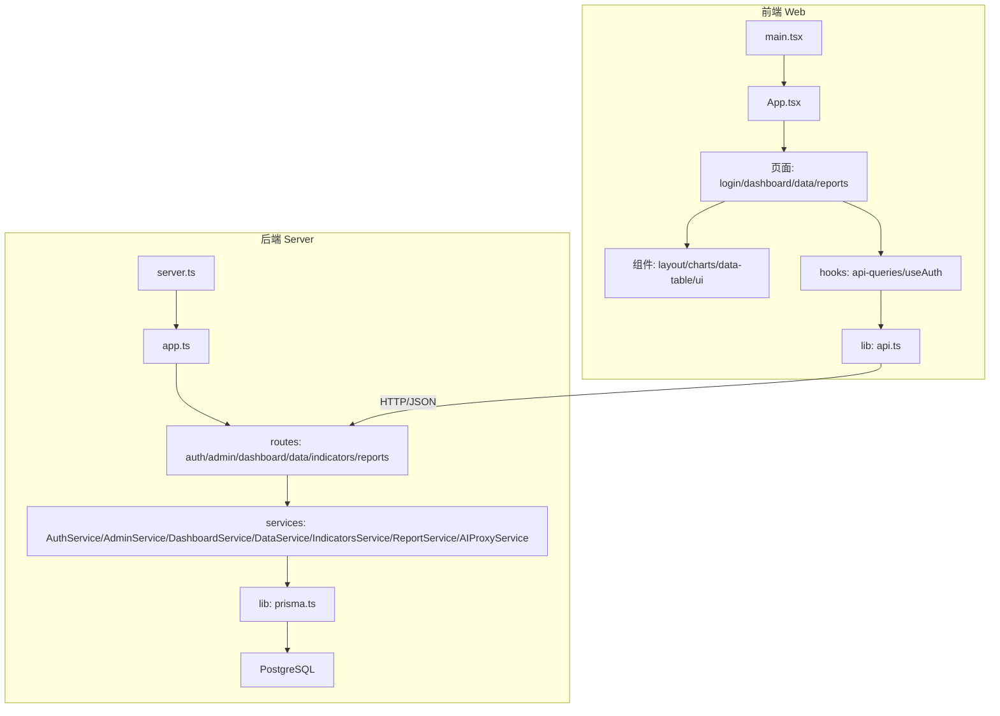
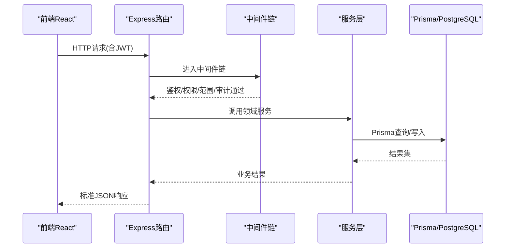
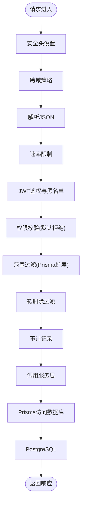
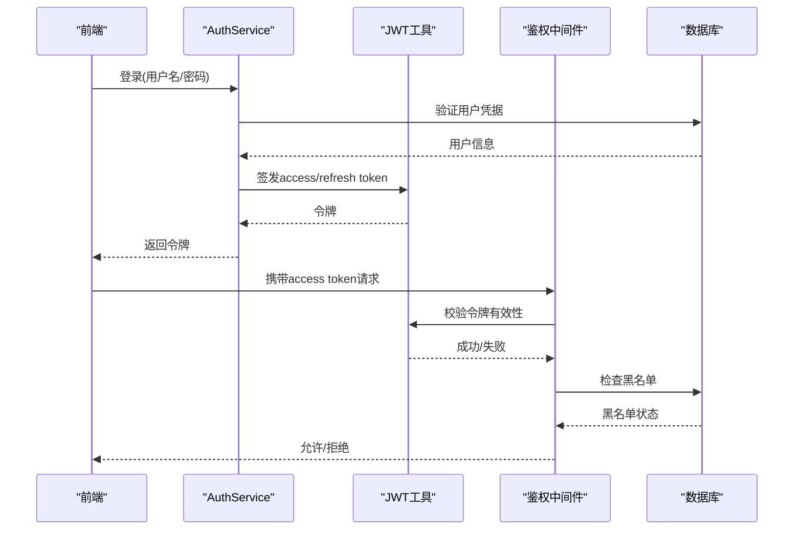
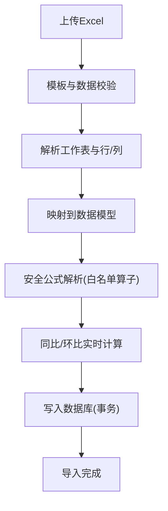
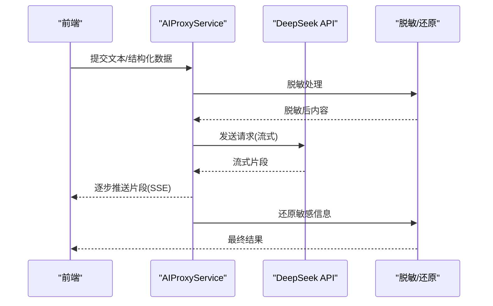
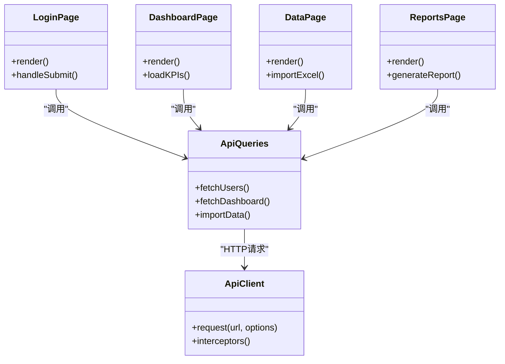
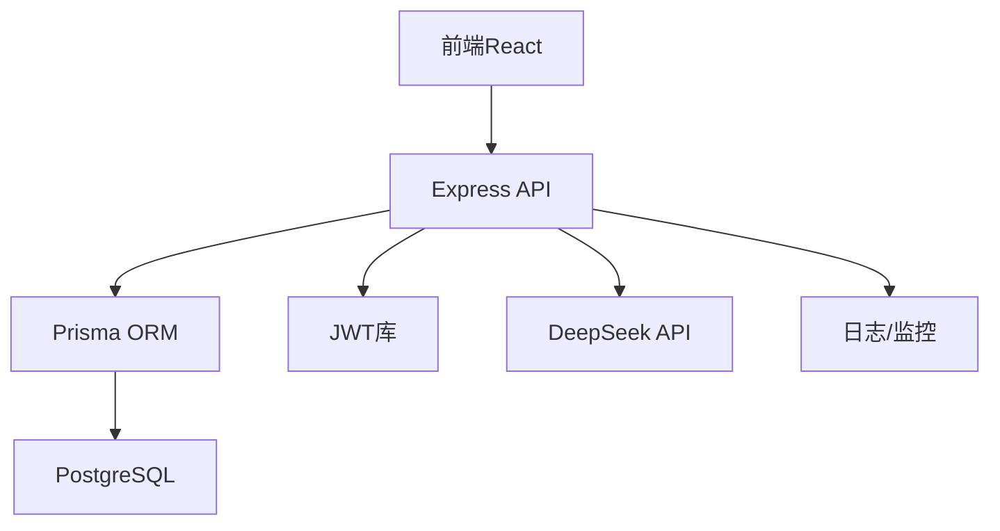
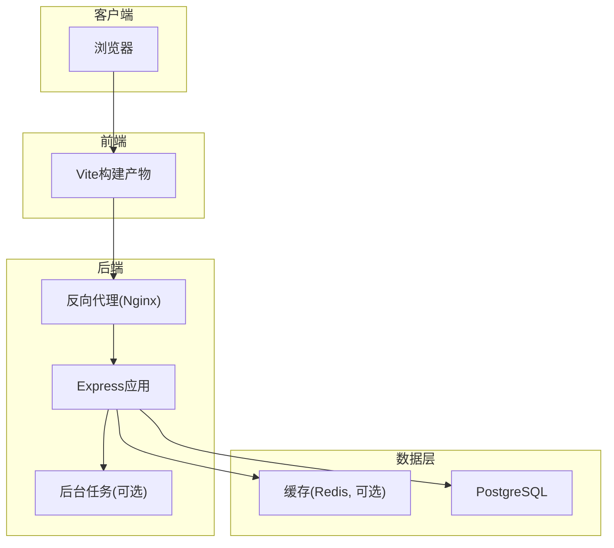
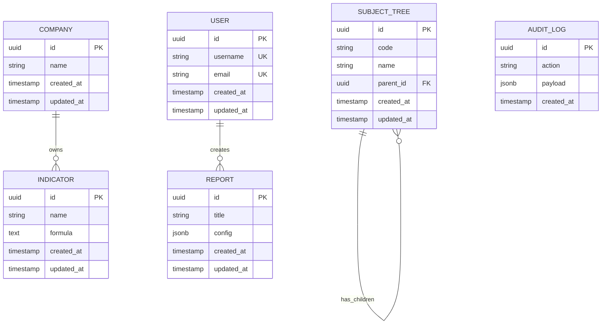

# 整体架构设计

<cite>
**本文引用的文件**   
- [server/src/app.ts](file://server/src/app.ts)
- [server/src/server.ts](file://server/src/server.ts)
- [server/src/config/env.ts](file://server/src/config/env.ts)
- [server/src/lib/prisma.ts](file://server/src/lib/prisma.ts)
- [server/src/middleware/auth.ts](file://server/src/middleware/auth.ts)
- [server/src/middleware/permission.ts](file://server/src/middleware/permission.ts)
- [server/src/middleware/scope.ts](file://server/src/middleware/scope.ts)
- [server/src/middleware/soft-delete.ts](file://server/src/middleware/soft-delete.ts)
- [server/src/middleware/audit.ts](file://server/src/middleware/audit.ts)
- [server/src/middleware/rate-limit.ts](file://server/src/middleware/rate-limit.ts)
- [server/src/middleware/cors.ts](file://server/src/middleware/cors.ts)
- [server/src/middleware/helmet.ts](file://server/src/middleware/helmet.ts)
- [server/src/routes/auth.ts](file://server/src/routes/auth.ts)
- [server/src/routes/admin.ts](file://server/src/routes/admin.ts)
- [server/src/routes/dashboard.ts](file://server/src/routes/dashboard.ts)
- [server/src/routes/data.ts](file://server/src/routes/data.ts)
- [server/src/routes/indicators.ts](file://server/src/routes/indicators.ts)
- [server/src/routes/reports.ts](file://server/src/routes/reports.ts)
- [server/src/services/AuthService.ts](file://server/src/services/AuthService.ts)
- [server/src/services/AdminService.ts](file://server/src/services/AdminService.ts)
- [server/src/services/DashboardService.ts](file://server/src/services/DashboardService.ts)
- [server/src/services/DataService.ts](file://server/src/services/DataService.ts)
- [server/src/services/IndicatorsService.ts](file://server/src/services/IndicatorsService.ts)
- [server/src/services/ReportService.ts](file://server/src/services/ReportService.ts)
- [server/src/services/AIProxyService.ts](file://server/src/services/AIProxyService.ts)
- [server/src/lib/jwt.ts](file://server/src/lib/jwt.ts)
- [server/src/lib/formula.ts](file://server/src/lib/formula.ts)
- [server/src/lib/excel-import.ts](file://server/src/lib/excel-import.ts)
- [server/src/lib/logger.ts](file://server/src/lib/logger.ts)
- [server/src/lib/errors.ts](file://server/src/lib/errors.ts)
- [server/src/lib/response.ts](file://server/src/lib/response.ts)
- [server/prisma/schema.prisma](file://server/prisma/schema.prisma)
- [web/src/main.tsx](file://web/src/main.tsx)
- [web/src/App.tsx](file://web/src/App.tsx)
- [web/src/hooks/api-queries.ts](file://web/src/hooks/api-queries.ts)
- [web/src/lib/api.ts](file://web/src/lib/api.ts)
- [web/src/pages/login/index.tsx](file://web/src/pages/login/index.tsx)
- [web/src/pages/dashboard/index.tsx](file://web/src/pages/dashboard/index.tsx)
- [web/src/pages/data/index.tsx](file://web/src/pages/data/index.tsx)
- [web/src/pages/reports/index.tsx](file://web/src/pages/reports/index.tsx)
- [web/src/components/layout/main-layout.tsx](file://web/src/components/layout/main-layout.tsx)
</cite>

## 目录
1. [引言](#引言)
2. [项目结构](#项目结构)
3. [核心组件](#核心组件)
4. [架构总览](#架构总览)
5. [详细组件分析](#详细组件分析)
6. [依赖关系分析](#依赖关系分析)
7. [性能考量](#性能考量)
8. [故障排查指南](#故障排查指南)
9. [结论](#结论)
10. [附录](#附录)

## 引言
FY200系统为浙江壹品慧财年经营数据分析平台，定位“Excel进、看板/报表出”的内部管理口径财务数据平台，单位统一为万元/人民币。系统采用前后端分离架构：前端基于React构建用户界面与交互逻辑，后端基于Express提供REST API与AI代理能力，数据持久化使用PostgreSQL并通过Prisma进行类型安全的ORM访问。中间件链严格遵循安全与可观测性要求，计算类指标通过安全公式解析实现同比/环比等实时计算，AI功能采用双管道（polish/analyze）保障敏感信息脱敏与结构化处理。

## 项目结构
- 后端服务（server）
  - Express应用入口与路由注册
  - 中间件链：helmet → cors → express.json → rate-limit → auth → permission → scope → softDelete → audit
  - 服务层：按领域划分（认证、仪表盘、数据导入、指标、报表、AI代理等）
  - 数据访问：Prisma ORM + PostgreSQL
  - 工具库：JWT、公式解析、Excel导入、日志、错误与响应封装
- 前端应用（web）
  - React + Vite + Tailwind
  - 页面与组件：登录、仪表盘、数据维护、指标分析、报表编辑
  - 状态与API：hooks封装查询、统一HTTP客户端、权限控制
- 文档与计划（docs/.wiki）
  - API参考、数据库Schema、开发指南与安全规范等

**图示来源** 
- [server/src/server.ts](file://server/src/server.ts)
- [server/src/app.ts](file://server/src/app.ts)
- [web/src/main.tsx](file://web/src/main.tsx)
- [web/src/App.tsx](file://web/src/App.tsx)

**章节来源**
- [server/src/server.ts](file://server/src/server.ts)
- [server/src/app.ts](file://server/src/app.ts)
- [web/src/main.tsx](file://web/src/main.tsx)
- [web/src/App.tsx](file://web/src/App.tsx)

## 核心组件
- 表现层（React）
  - 页面级组件负责路由与布局，业务组件负责具体展示与交互
  - hooks封装数据获取、鉴权与权限判断，统一调用后端API
- 业务逻辑层（服务层）
  - 各领域Service封装复杂流程：认证流转、指标聚合、报表生成、AI代理等
  - 对输入校验、权限检查、范围过滤、审计记录进行编排
- 数据访问层（Prisma ORM）
  - 通过Prisma Client访问PostgreSQL，提供类型安全的数据操作
  - 结合扩展（scope）实现多租户/组织范围的数据隔离
- 基础设施层
  - Express中间件链提供安全、限流、鉴权、审计、软删除等横切能力
  - 配置与环境变量管理、日志、错误与响应标准化

**章节来源**
- [server/src/middleware/auth.ts](file://server/src/middleware/auth.ts)
- [server/src/middleware/permission.ts](file://server/src/middleware/permission.ts)
- [server/src/middleware/scope.ts](file://server/src/middleware/scope.ts)
- [server/src/middleware/soft-delete.ts](file://server/src/middleware/soft-delete.ts)
- [server/src/middleware/audit.ts](file://server/src/middleware/audit.ts)
- [server/src/lib/prisma.ts](file://server/src/lib/prisma.ts)
- [server/src/config/env.ts](file://server/src/config/env.ts)

## 架构总览
系统采用分层架构与前后端分离模式，模块间通过REST API通信，关键特性包括：
- 安全与合规：Helmet安全头、CORS策略、速率限制、JWT鉴权与黑名单、权限与范围控制、审计日志
- 数据一致性：Prisma事务与迁移、软删除策略、字段脱敏
- 计算与AI：安全公式解析（白名单算子）、同比/环比实时计算、AI双管道（polish/analyze）与SSE流式输出

**图示来源** 
- [server/src/app.ts](file://server/src/app.ts)
- [server/src/middleware/auth.ts](file://server/src/middleware/auth.ts)
- [server/src/middleware/permission.ts](file://server/src/middleware/permission.ts)
- [server/src/middleware/scope.ts](file://server/src/middleware/scope.ts)
- [server/src/middleware/audit.ts](file://server/src/middleware/audit.ts)
- [server/src/lib/prisma.ts](file://server/src/lib/prisma.ts)

## 详细组件分析

### 后端中间件链与执行顺序
- 执行顺序：helmet → cors → express.json → rate-limit → auth(JWT+黑名单) → permission(默认拒绝) → scope(Prisma extension) → softDelete → audit → Service → Prisma → PostgreSQL
- 作用：
  - helmet/cors：安全头与跨域策略
  - rate-limit：防刷与资源保护
  - auth：JWT校验与黑名单拦截
  - permission：基于角色的访问控制（RBAC），默认拒绝
  - scope：基于组织/公司范围的Prisma扩展过滤
  - softDelete：查询自动过滤已删除记录
  - audit：审计日志记录关键操作

**图示来源** 
- [server/src/middleware/helmet.ts](file://server/src/middleware/helmet.ts)
- [server/src/middleware/cors.ts](file://server/src/middleware/cors.ts)
- [server/src/middleware/rate-limit.ts](file://server/src/middleware/rate-limit.ts)
- [server/src/middleware/auth.ts](file://server/src/middleware/auth.ts)
- [server/src/middleware/permission.ts](file://server/src/middleware/permission.ts)
- [server/src/middleware/scope.ts](file://server/src/middleware/scope.ts)
- [server/src/middleware/soft-delete.ts](file://server/src/middleware/soft-delete.ts)
- [server/src/middleware/audit.ts](file://server/src/middleware/audit.ts)

**章节来源**
- [server/src/middleware/auth.ts](file://server/src/middleware/auth.ts)
- [server/src/middleware/permission.ts](file://server/src/middleware/permission.ts)
- [server/src/middleware/scope.ts](file://server/src/middleware/scope.ts)
- [server/src/middleware/soft-delete.ts](file://server/src/middleware/soft-delete.ts)
- [server/src/middleware/audit.ts](file://server/src/middleware/audit.ts)

### 认证与授权流程
- JWT令牌：access token短期有效（约15分钟），refresh token长期有效（约7天），支持轮转
- 黑名单：登出或强制下线时将token加入黑名单，后续请求被拒绝
- 权限模型：默认拒绝，需显式授予角色/权限；结合scope实现组织维度隔离

**图示来源** 
- [server/src/services/AuthService.ts](file://server/src/services/AuthService.ts)
- [server/src/lib/jwt.ts](file://server/src/lib/jwt.ts)
- [server/src/middleware/auth.ts](file://server/src/middleware/auth.ts)

**章节来源**
- [server/src/services/AuthService.ts](file://server/src/services/AuthService.ts)
- [server/src/lib/jwt.ts](file://server/src/lib/jwt.ts)
- [server/src/middleware/auth.ts](file://server/src/middleware/auth.ts)

### 数据导入与公式计算
- Excel导入：支持模板校验、批量导入、异常回滚
- 公式解析：白名单算子（加减乘除括号），禁止eval，确保安全性
- 指标计算：同比/环比由后端实时计算，不持久化，保证口径一致

**图示来源** 
- [server/src/lib/excel-import.ts](file://server/src/lib/excel-import.ts)
- [server/src/lib/formula.ts](file://server/src/lib/formula.ts)

**章节来源**
- [server/src/lib/excel-import.ts](file://server/src/lib/excel-import.ts)
- [server/src/lib/formula.ts](file://server/src/lib/formula.ts)

### AI代理与双管道
- polish管道：文本→脱敏→LLM→还原，用于文案润色与敏感信息保护
- analyze管道：结构化数据→计算→脱敏→LLM→生成，用于指标分析与洞察
- SSE流式：大模型响应以流式方式推送，提升用户体验

**图示来源** 
- [server/src/services/AIProxyService.ts](file://server/src/services/AIProxyService.ts)

**章节来源**
- [server/src/services/AIProxyService.ts](file://server/src/services/AIProxyService.ts)

### 前端页面与API集成
- 页面：登录、仪表盘、数据维护、指标分析、报表编辑
- hooks：api-queries封装CRUD与分页、useAuth管理会话
- lib/api：统一HTTP客户端，处理错误、拦截器、超时与重试

**图示来源** 
- [web/src/pages/login/index.tsx](file://web/src/pages/login/index.tsx)
- [web/src/pages/dashboard/index.tsx](file://web/src/pages/dashboard/index.tsx)
- [web/src/pages/data/index.tsx](file://web/src/pages/data/index.tsx)
- [web/src/pages/reports/index.tsx](file://web/src/pages/reports/index.tsx)
- [web/src/hooks/api-queries.ts](file://web/src/hooks/api-queries.ts)
- [web/src/lib/api.ts](file://web/src/lib/api.ts)

**章节来源**
- [web/src/pages/login/index.tsx](file://web/src/pages/login/index.tsx)
- [web/src/pages/dashboard/index.tsx](file://web/src/pages/dashboard/index.tsx)
- [web/src/pages/data/index.tsx](file://web/src/pages/data/index.tsx)
- [web/src/pages/reports/index.tsx](file://web/src/pages/reports/index.tsx)
- [web/src/hooks/api-queries.ts](file://web/src/hooks/api-queries.ts)
- [web/src/lib/api.ts](file://web/src/lib/api.ts)

## 依赖关系分析
- 后端依赖
  - Express框架与中间件生态
  - Prisma ORM与PostgreSQL驱动
  - JWT库与加密工具
  - DeepSeek API（SSE流式）
- 前端依赖
  - React生态（Vite、Tailwind）
  - HTTP客户端与状态管理
- 部署依赖
  - Node.js运行时
  - PostgreSQL数据库实例
  - 可选：反向代理（Nginx/Caddy）与容器编排（Docker/K8s）

**图示来源** 
- [server/src/app.ts](file://server/src/app.ts)
- [server/src/lib/prisma.ts](file://server/src/lib/prisma.ts)
- [server/src/lib/jwt.ts](file://server/src/lib/jwt.ts)
- [server/src/services/AIProxyService.ts](file://server/src/services/AIProxyService.ts)

**章节来源**
- [server/src/app.ts](file://server/src/app.ts)
- [server/src/lib/prisma.ts](file://server/src/lib/prisma.ts)
- [server/src/lib/jwt.ts](file://server/src/lib/jwt.ts)
- [server/src/services/AIProxyService.ts](file://server/src/services/AIProxyService.ts)

## 性能考量
- 数据库优化
  - 合理索引与查询计划，避免N+1问题
  - 使用Prisma事务减少往返次数
  - 分页与增量加载降低内存占用
- 缓存策略
  - 热点数据缓存（Redis可选）
  - 静态资源CDN加速
- 并发与限流
  - 速率限制保护后端
  - 连接池与异步任务队列（BullMQ可选）
- 前端优化
  - 代码分割与懒加载
  - 图表虚拟化与增量更新
  - SSE流式渲染提升感知性能

[本节为通用指导，无需特定文件引用]

## 故障排查指南
- 常见问题
  - 鉴权失败：检查JWT签名、过期时间、黑名单状态
  - 权限不足：确认角色与权限配置，默认拒绝策略生效
  - 数据范围错误：检查scope扩展是否正确注入
  - 导入失败：核对Excel模板、字段映射与约束
  - AI流式中断：检查网络与SSE连接稳定性
- 诊断工具
  - 日志：集中化日志与链路追踪
  - 监控：APM与数据库慢查询分析
  - 测试：单元测试与集成测试覆盖关键路径

**章节来源**
- [server/src/lib/logger.ts](file://server/src/lib/logger.ts)
- [server/src/lib/errors.ts](file://server/src/lib/errors.ts)
- [server/src/lib/response.ts](file://server/src/lib/response.ts)

## 结论
FY200系统通过前后端分离与分层架构实现了高内聚、低耦合的设计目标。Express作为轻量高效的API网关，配合Prisma与PostgreSQL提供稳定可靠的数据服务；React前端提供灵活的交互体验。中间件链确保安全与可观测性，服务层封装领域逻辑，AI双管道增强智能分析能力。未来可在微服务拆分、缓存与消息队列、可观测性与治理等方面持续演进。

[本节为总结性内容，无需特定文件引用]

## 附录

### 技术选型与权衡
- Express vs Koa/Next.js
  - Express生态成熟、中间件丰富，适合快速迭代与定制化
  - Koa更现代但生态相对较小；Next.js更适合SSR/全栈场景，当前以SPA为主
- React vs Vue/Angular
  - React生态强大、组件化与Hooks范式成熟，便于大型项目管理
  - Vue上手快但生态略弱；Angular重型且学习曲线陡峭
- Prisma vs TypeORM/Sequelize
  - Prisma类型安全、迁移友好，开发体验佳
- PostgreSQL
  - 强一致性、扩展性强，适合复杂查询与事务

[本节为概念性说明，无需特定文件引用]

### 部署拓扑图

**图示来源** 
- [server/src/server.ts](file://server/src/server.ts)
- [web/src/main.tsx](file://web/src/main.tsx)

### 数据库Schema概览
- 实体：用户、公司、科目树、指标、报表、公式规则、审计日志等
- 关系：多对一、一对多、自引用（科目树）
- 约束：唯一键、外键、非空、枚举值

**图示来源** 
- [server/prisma/schema.prisma](file://server/prisma/schema.prisma)