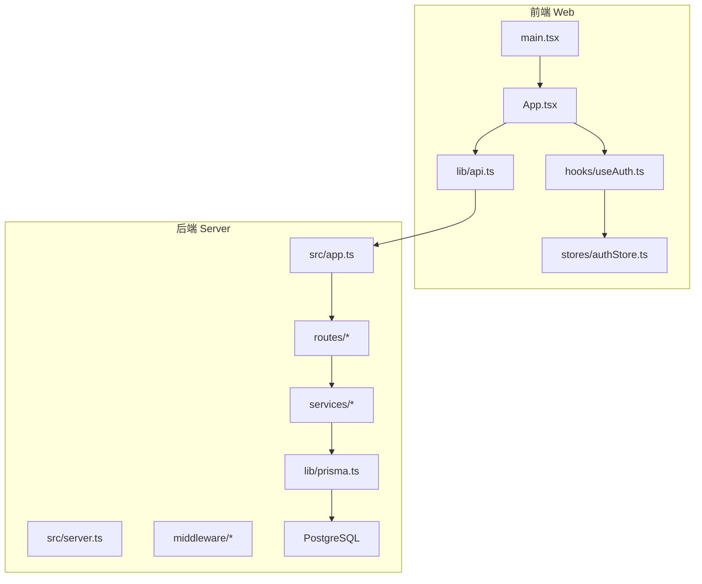
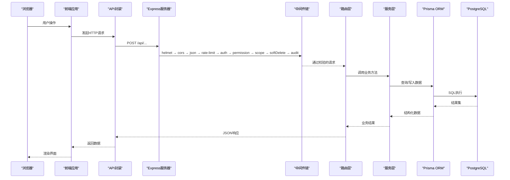
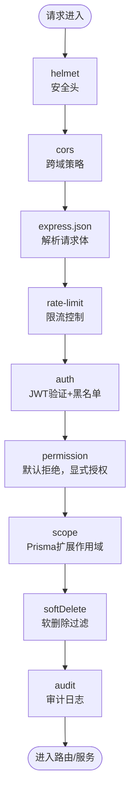
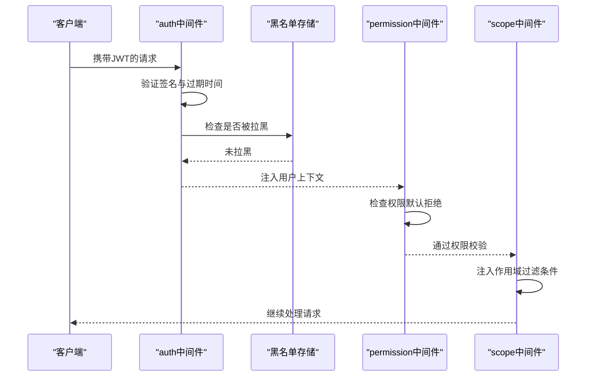
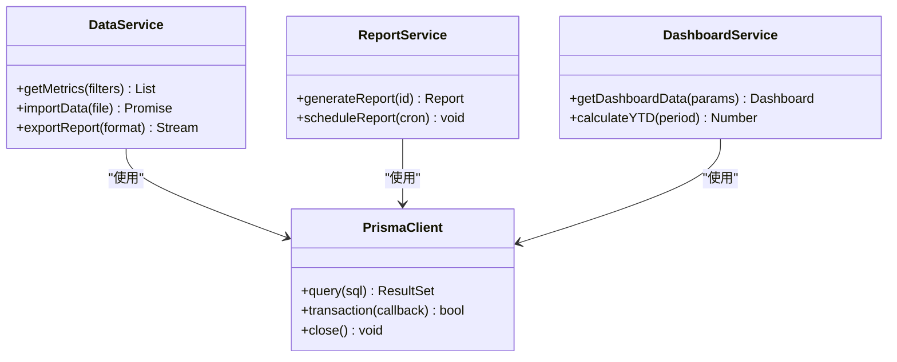
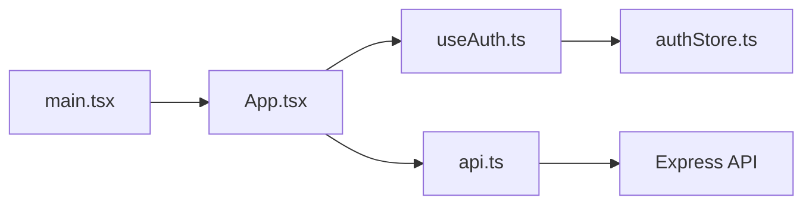
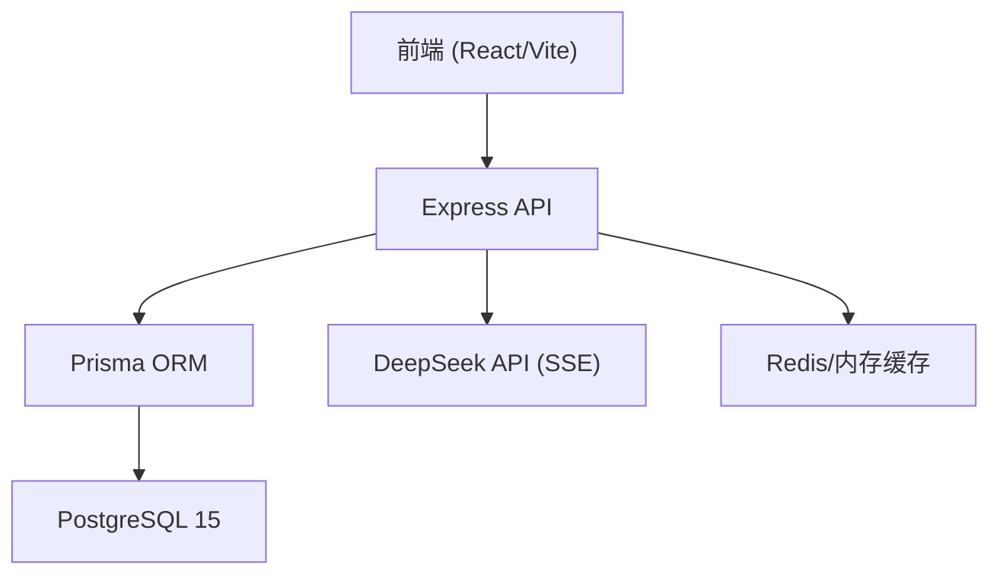

# 系统架构

<cite>
**本文引用的文件**   
- [server/src/app.ts](file://server/src/app.ts)
- [server/src/server.ts](file://server/src/server.ts)
- [server/src/middleware/helmet.ts](file://server/src/middleware/helmet.ts)
- [server/src/middleware/cors.ts](file://server/src/middleware/cors.ts)
- [server/src/middleware/rate-limit.ts](file://server/src/middleware/rate-limit.ts)
- [server/src/middleware/auth.ts](file://server/src/middleware/auth.ts)
- [server/src/middleware/permission.ts](file://server/src/middleware/permission.ts)
- [server/src/middleware/scope.ts](file://server/src/middleware/scope.ts)
- [server/src/middleware/soft-delete.ts](file://server/src/middleware/soft-delete.ts)
- [server/src/middleware/audit.ts](file://server/src/middleware/audit.ts)
- [server/src/lib/prisma.ts](file://server/src/lib/prisma.ts)
- [server/src/lib/jwt.ts](file://server/src/lib/jwt.ts)
- [server/src/lib/logger.ts](file://server/src/lib/logger.ts)
- [server/src/lib/errors.ts](file://server/src/lib/errors.ts)
- [server/src/lib/response.ts](file://server/src/lib/response.ts)
- [server/src/routes/admin.ts](file://server/src/routes/admin.ts)
- [server/src/routes/auth.ts](file://server/src/routes/auth.ts)
- [server/src/routes/dashboard.ts](file://server/src/routes/dashboard.ts)
- [server/src/routes/data.ts](file://server/src/routes/data.ts)
- [server/src/routes/indicators.ts](file://server/src/routes/indicators.ts)
- [server/src/routes/reports.ts](file://server/src/routes/reports.ts)
- [server/src/services/AuthService.ts](file://server/src/services/AuthService.ts)
- [server/src/services/DashboardService.ts](file://server/src/services/DashboardService.ts)
- [server/src/services/DataService.ts](file://server/src/services/DataService.ts)
- [server/src/services/IndicatorsService.ts](file://server/src/services/IndicatorsService.ts)
- [server/src/services/ReportService.ts](file://server/src/services/ReportService.ts)
- [server/prisma/schema.prisma](file://server/prisma/schema.prisma)
- [web/src/main.tsx](file://web/src/main.tsx)
- [web/src/App.tsx](file://web/src/App.tsx)
- [web/src/hooks/useAuth.ts](file://web/src/hooks/useAuth.ts)
- [web/src/stores/authStore.ts](file://web/src/stores/authStore.ts)
- [web/src/lib/api.ts](file://web/src/lib/api.ts)
- [web/package.json](file://web/package.json)
- [server/package.json](file://server/package.json)
</cite>

## 目录
1. [简介](#简介)
2. [项目结构](#项目结构)
3. [核心组件](#核心组件)
4. [架构总览](#架构总览)
5. [详细组件分析](#详细组件分析)
6. [依赖关系分析](#依赖关系分析)
7. [性能考虑](#性能考虑)
8. [故障排查指南](#故障排查指南)
9. [结论](#结论)
10. [附录](#附录)

## 简介
FY200系统是浙江壹品慧财年经营数据分析平台，定位为“Excel进、看板/报表出”的内部管理口径财务数据平台。系统采用前后端分离架构：后端基于Express + Prisma + PostgreSQL，提供REST API与AI流式接口；前端基于React（Vite构建），通过API层与服务端交互，实现指标看板、报表编辑、数据导入导出等功能。中间件执行链遵循严格顺序，确保安全、鉴权、权限、作用域、软删除、审计等横切关注点统一处理。

## 项目结构
- 后端服务位于 server 目录，包含应用入口、路由、中间件、服务层、Prisma模型与迁移、脚本与测试。
- 前端应用位于 web 目录，包含页面、组件、状态管理、API封装、工具库与测试。
- 文档与计划位于 docs 目录，涵盖前后端参考、可观测性、运维与性能等。

**图示来源** 
- [server/src/app.ts](file://server/src/app.ts)
- [server/src/server.ts](file://server/src/server.ts)
- [web/src/main.tsx](file://web/src/main.tsx)
- [web/src/App.tsx](file://web/src/App.tsx)
- [web/src/hooks/useAuth.ts](file://web/src/hooks/useAuth.ts)
- [web/src/stores/authStore.ts](file://web/src/stores/authStore.ts)
- [web/src/lib/api.ts](file://web/src/lib/api.ts)

**章节来源**
- [server/src/app.ts](file://server/src/app.ts)
- [server/src/server.ts](file://server/src/server.ts)
- [web/src/main.tsx](file://web/src/main.tsx)
- [web/src/App.tsx](file://web/src/App.tsx)

## 核心组件
- Express应用与服务器启动：负责注册中间件、挂载路由、错误处理与优雅关闭。
- 中间件链：helmet → cors → express.json → rate-limit → auth(JWT+黑名单) → permission(默认拒绝) → scope(Prisma extension) → softDelete → audit。
- 路由层：按领域划分（auth、dashboard、data、indicators、reports、admin）。
- 服务层：业务逻辑封装，调用Prisma进行数据访问。
- Prisma ORM：类型安全的数据库访问，结合扩展实现scope过滤、审计与软删除增强。
- 前端：React应用，使用Vite构建，状态管理与API封装，JWT认证与会话管理。

**章节来源**
- [server/src/app.ts](file://server/src/app.ts)
- [server/src/middleware/auth.ts](file://server/src/middleware/auth.ts)
- [server/src/middleware/permission.ts](file://server/src/middleware/permission.ts)
- [server/src/middleware/scope.ts](file://server/src/middleware/scope.ts)
- [server/src/middleware/soft-delete.ts](file://server/src/middleware/soft-delete.ts)
- [server/src/middleware/audit.ts](file://server/src/middleware/audit.ts)
- [server/src/lib/prisma.ts](file://server/src/lib/prisma.ts)
- [web/src/lib/api.ts](file://web/src/lib/api.ts)

## 架构总览
系统采用前后端分离模式，请求从浏览器发起，经HTTP到达Express服务器，依次经过安全、跨域、限流、鉴权、权限、作用域、软删除、审计等中间件后进入路由与服务层，最终通过Prisma访问PostgreSQL。前端通过统一的API层与服务端交互，维护认证状态与权限信息。

**图示来源** 
- [server/src/app.ts](file://server/src/app.ts)
- [server/src/middleware/auth.ts](file://server/src/middleware/auth.ts)
- [server/src/middleware/permission.ts](file://server/src/middleware/permission.ts)
- [server/src/middleware/scope.ts](file://server/src/middleware/scope.ts)
- [server/src/middleware/soft-delete.ts](file://server/src/middleware/soft-delete.ts)
- [server/src/middleware/audit.ts](file://server/src/middleware/audit.ts)
- [server/src/lib/prisma.ts](file://server/src/lib/prisma.ts)
- [web/src/lib/api.ts](file://web/src/lib/api.ts)

## 详细组件分析

### 中间件执行链与职责
中间件按固定顺序执行，确保每个横切关注点在合适的阶段处理：
- helmet：设置安全响应头，防护常见Web攻击。
- cors：配置跨域策略，允许前端域名访问。
- express.json：解析JSON请求体。
- rate-limit：限制请求频率，防止滥用。
- auth：验证JWT令牌，检查黑名单，注入用户上下文。
- permission：默认拒绝，显式授权访问。
- scope：通过Prisma扩展注入租户/组织作用域过滤。
- softDelete：对软删除字段进行自动过滤与更新。
- audit：记录关键操作的审计日志。

**图示来源** 
- [server/src/middleware/helmet.ts](file://server/src/middleware/helmet.ts)
- [server/src/middleware/cors.ts](file://server/src/middleware/cors.ts)
- [server/src/middleware/rate-limit.ts](file://server/src/middleware/rate-limit.ts)
- [server/src/middleware/auth.ts](file://server/src/middleware/auth.ts)
- [server/src/middleware/permission.ts](file://server/src/middleware/permission.ts)
- [server/src/middleware/scope.ts](file://server/src/middleware/scope.ts)
- [server/src/middleware/soft-delete.ts](file://server/src/middleware/soft-delete.ts)
- [server/src/middleware/audit.ts](file://server/src/middleware/audit.ts)

**章节来源**
- [server/src/middleware/helmet.ts](file://server/src/middleware/helmet.ts)
- [server/src/middleware/cors.ts](file://server/src/middleware/cors.ts)
- [server/src/middleware/rate-limit.ts](file://server/src/middleware/rate-limit.ts)
- [server/src/middleware/auth.ts](file://server/src/middleware/auth.ts)
- [server/src/middleware/permission.ts](file://server/src/middleware/permission.ts)
- [server/src/middleware/scope.ts](file://server/src/middleware/scope.ts)
- [server/src/middleware/soft-delete.ts](file://server/src/middleware/soft-delete.ts)
- [server/src/middleware/audit.ts](file://server/src/middleware/audit.ts)

### 认证与授权流程
- JWT令牌：access token有效期短（如15分钟），refresh token有效期长（如7天）并支持轮转。
- 黑名单：登出或强制下线时将token加入黑名单，阻止后续请求。
- 权限模型：默认拒绝，需显式授予角色或资源权限。
- 作用域：通过Prisma扩展在查询时自动注入组织/公司维度过滤。

**图示来源** 
- [server/src/middleware/auth.ts](file://server/src/middleware/auth.ts)
- [server/src/lib/jwt.ts](file://server/src/lib/jwt.ts)
- [server/src/middleware/permission.ts](file://server/src/middleware/permission.ts)
- [server/src/middleware/scope.ts](file://server/src/middleware/scope.ts)

**章节来源**
- [server/src/middleware/auth.ts](file://server/src/middleware/auth.ts)
- [server/src/lib/jwt.ts](file://server/src/lib/jwt.ts)
- [server/src/middleware/permission.ts](file://server/src/middleware/permission.ts)
- [server/src/middleware/scope.ts](file://server/src/middleware/scope.ts)

### 数据访问层（Prisma + PostgreSQL）
- Prisma Schema：定义实体、关系、索引与约束。
- 扩展机制：通过Prisma Client扩展实现作用域过滤、软删除与审计增强。
- 服务层：封装业务逻辑，调用Prisma进行CRUD操作，避免直接SQL。

**图示来源** 
- [server/src/lib/prisma.ts](file://server/src/lib/prisma.ts)
- [server/src/services/DataService.ts](file://server/src/services/DataService.ts)
- [server/src/services/ReportService.ts](file://server/src/services/ReportService.ts)
- [server/src/services/DashboardService.ts](file://server/src/services/DashboardService.ts)
- [server/prisma/schema.prisma](file://server/prisma/schema.prisma)

**章节来源**
- [server/src/lib/prisma.ts](file://server/src/lib/prisma.ts)
- [server/prisma/schema.prisma](file://server/prisma/schema.prisma)
- [server/src/services/DataService.ts](file://server/src/services/DataService.ts)
- [server/src/services/ReportService.ts](file://server/src/services/ReportService.ts)
- [server/src/services/DashboardService.ts](file://server/src/services/DashboardService.ts)

### 前端架构与状态管理
- React应用：使用Vite构建，模块化组件与页面。
- 认证状态：useAuth钩子与authStore管理登录态与权限。
- API封装：统一请求拦截、错误处理与重试机制。

**图示来源** 
- [web/src/main.tsx](file://web/src/main.tsx)
- [web/src/App.tsx](file://web/src/App.tsx)
- [web/src/hooks/useAuth.ts](file://web/src/hooks/useAuth.ts)
- [web/src/stores/authStore.ts](file://web/src/stores/authStore.ts)
- [web/src/lib/api.ts](file://web/src/lib/api.ts)

**章节来源**
- [web/src/main.tsx](file://web/src/main.tsx)
- [web/src/App.tsx](file://web/src/App.tsx)
- [web/src/hooks/useAuth.ts](file://web/src/hooks/useAuth.ts)
- [web/src/stores/authStore.ts](file://web/src/stores/authStore.ts)
- [web/src/lib/api.ts](file://web/src/lib/api.ts)

## 依赖关系分析
- 后端依赖：Express、Prisma、PostgreSQL、JWT库、DeepSeek API（SSE流式）。
- 前端依赖：React、Vite、Tailwind CSS、状态管理库。
- 版本兼容性：Node.js LTS、PostgreSQL 15、Prisma 5、React 18+。

**图示来源** 
- [server/package.json](file://server/package.json)
- [web/package.json](file://web/package.json)
- [server/src/lib/prisma.ts](file://server/src/lib/prisma.ts)

**章节来源**
- [server/package.json](file://server/package.json)
- [web/package.json](file://web/package.json)

## 性能考虑
- 数据库优化：合理使用索引、分页查询、连接池配置。
- 缓存策略：热点数据缓存（如指标计算结果）、CDN静态资源。
- 异步处理：AI流式响应、批量导入导出任务队列。
- 监控告警：APM、日志聚合、慢查询监控。

[本节为通用指导，无需特定文件引用]

## 故障排查指南
- 常见问题：JWT失效、权限不足、作用域过滤异常、软删除数据不可见。
- 调试工具：日志级别调整、请求追踪ID、数据库慢查询分析。
- 恢复策略：备份恢复、灰度发布、回滚机制。

**章节来源**
- [server/src/lib/logger.ts](file://server/src/lib/logger.ts)
- [server/src/lib/errors.ts](file://server/src/lib/errors.ts)
- [server/src/lib/response.ts](file://server/src/lib/response.ts)

## 结论
FY200系统通过清晰的分层架构与严格的中间件链设计，实现了安全、可扩展、易维护的财务数据分析平台。前后端分离模式便于独立演进，Prisma ORM提升开发效率与类型安全，AI双管道架构满足智能化需求。建议持续优化性能监控、灾难恢复与自动化部署流程。

[本节为总结性内容，无需特定文件引用]

## 附录
- 技术栈版本：Node.js 18+、Express 4.x、Prisma 5.x、PostgreSQL 15、React 18+、Vite 5+。
- 第三方依赖：JWT库、DeepSeek API、Excel处理库、图表库。
- 部署拓扑：Docker容器化、Kubernetes编排、CI/CD流水线。

[本节为补充信息，无需特定文件引用]