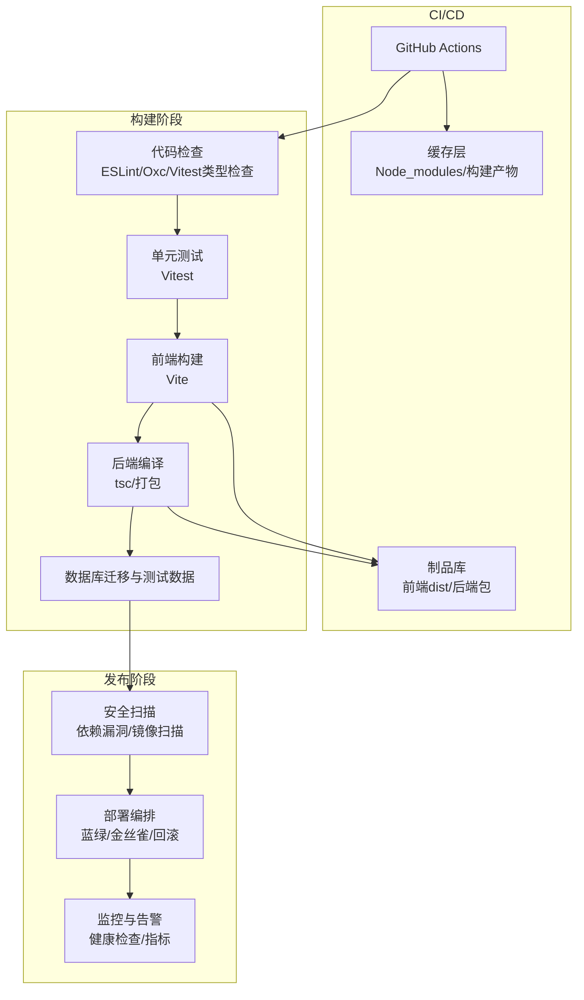
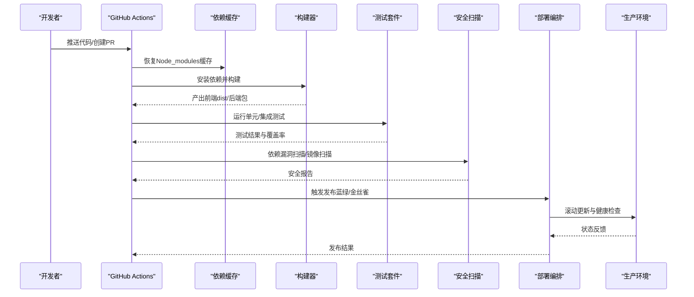
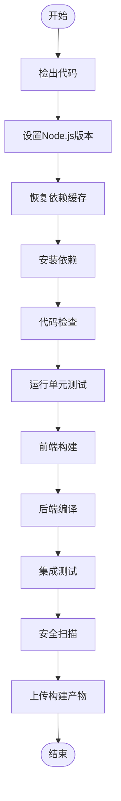
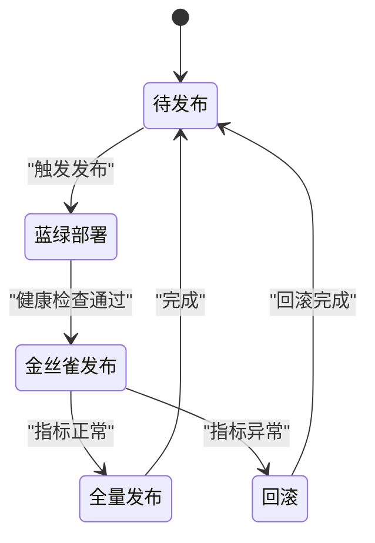
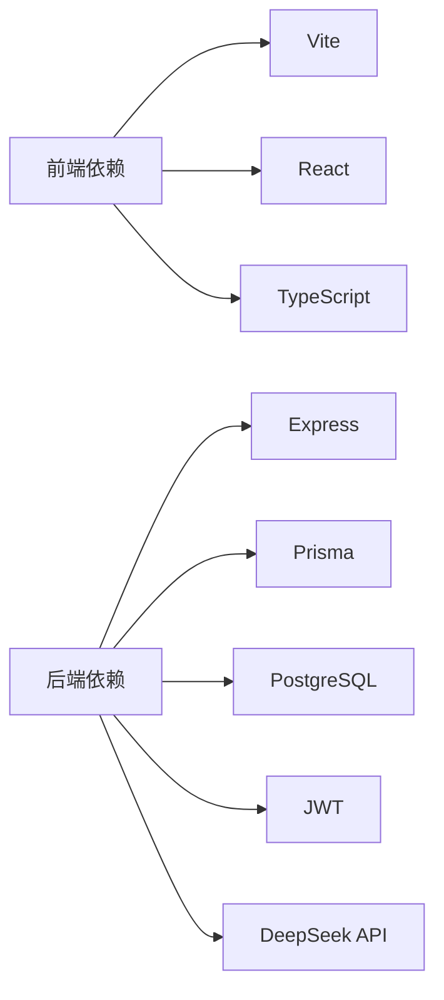

# CI/CD流水线

<cite>
**本文引用的文件**   
- [server/package.json](file://server/package.json)
- [web/package.json](file://web/package.json)
- [server/vitest.config.ts](file://server/vitest.config.ts)
- [web/vitest.config.ts](file://web/vitest.config.ts)
- [server/src/app.ts](file://server/src/app.ts)
- [server/src/server.ts](file://server/src/server.ts)
- [server/src/middleware/auth.ts](file://server/src/middleware/auth.ts)
- [server/src/middleware/cors.ts](file://server/src/middleware/cors.ts)
- [server/src/middleware/helmet.ts](file://server/src/middleware/helmet.ts)
- [server/src/middleware/rate-limit.ts](file://server/src/middleware/rate-limit.ts)
- [server/src/lib/prisma.ts](file://server/src/lib/prisma.ts)
- [server/prisma/schema.prisma](file://server/prisma/schema.prisma)
- [web/vite.config.ts](file://web/vite.config.ts)
- [web/tsconfig.app.json](file://web/tsconfig.app.json)
- [web/tsconfig.node.json](file://web/tsconfig.node.json)
- [server/src/test/setup.ts](file://server/src/test/setup.ts)
- [web/src/test/setup.ts](file://web/src/test/setup.ts)
</cite>

## 目录
1. [简介](#简介)
2. [项目结构](#项目结构)
3. [核心组件](#核心组件)
4. [架构总览](#架构总览)
5. [详细组件分析](#详细组件分析)
6. [依赖关系分析](#依赖关系分析)
7. [性能考量](#性能考量)
8. [故障排除指南](#故障排除指南)
9. [结论](#结论)
10. [附录](#附录)

## 简介
本文件为FY200项目的CI/CD流水线文档，覆盖持续集成与持续交付的完整流程：代码检查、单元测试、集成测试、代码质量分析、前端打包、后端编译与依赖管理、自动化部署（蓝绿/金丝雀/回滚）、安全扫描与合规检查、以及流水线监控与排障。项目采用前后端分离架构：后端基于Express + Prisma + PostgreSQL，前端基于Vite + React + TypeScript。中间件执行链顺序严格遵循安全与可观测性要求。

## 项目结构
仓库包含两个主要子工程：
- server：后端服务，使用TypeScript、Express、Prisma、PostgreSQL，提供REST API与AI代理能力。
- web：前端应用，使用Vite、React、TypeScript、TailwindCSS，构建静态资源供Nginx或CDN托管。

**图表来源** 
- [server/package.json](file://server/package.json)
- [web/package.json](file://web/package.json)
- [web/vite.config.ts](file://web/vite.config.ts)

**章节来源**
- [server/package.json](file://server/package.json)
- [web/package.json](file://web/package.json)

## 核心组件
- 代码检查与类型校验：前端使用Oxc/ESLint与TypeScript配置；后端使用TypeScript编译与可选ESLint规则。
- 单元测试：前后端均使用Vitest，支持异步与Mock。
- 集成测试：后端通过Prisma与本地PostgreSQL进行端到端API验证。
- 构建：前端Vite输出静态资源；后端TypeScript编译并生成可执行包。
- 依赖管理：npm/yarn锁定版本，CI中缓存依赖加速构建。
- 数据库：Prisma迁移与种子数据在CI中执行，确保测试环境一致性。

**章节来源**
- [server/vitest.config.ts](file://server/vitest.config.ts)
- [web/vitest.config.ts](file://web/vitest.config.ts)
- [web/vite.config.ts](file://web/vite.config.ts)
- [server/src/lib/prisma.ts](file://server/src/lib/prisma.ts)
- [server/prisma/schema.prisma](file://server/prisma/schema.prisma)

## 架构总览
CI/CD流水线分为四个阶段：准备、构建、测试、发布。每个阶段都有明确的输入输出与质量门禁。

**图表来源** 
- [server/package.json](file://server/package.json)
- [web/package.json](file://web/package.json)
- [web/vite.config.ts](file://web/vite.config.ts)

## 详细组件分析

### 持续集成流水线（GitHub Actions）
- 触发条件：push到主分支、创建或更新PR。
- 矩阵策略：并行构建前端与后端，提升效率。
- 缓存策略：缓存node_modules与构建产物，缩短冷启动时间。
- 环境变量：敏感信息通过GitHub Secrets注入，如数据库连接、JWT密钥、第三方API密钥。
- 工件管理：构建产物上传至GitHub Actions Artifacts，便于后续下载与部署。

**图表来源** 
- [server/package.json](file://server/package.json)
- [web/package.json](file://web/package.json)

**章节来源**
- [server/package.json](file://server/package.json)
- [web/package.json](file://web/package.json)

### 代码检查与质量门禁
- 前端：Oxc/ESLint规则统一风格，TypeScript编译检查类型错误。
- 后端：TypeScript编译检查，可选ESLint规则。
- 质量门禁：lint失败或类型错误将阻断流水线。

**章节来源**
- [web/tsconfig.app.json](file://web/tsconfig.app.json)
- [web/tsconfig.node.json](file://web/tsconfig.node.json)

### 单元测试与覆盖率
- 工具：Vitest，支持异步测试与Mock。
- 配置：前后端分别配置vitest.config.ts，定义测试环境与全局Setup。
- 覆盖率：收集覆盖率报告，设定阈值作为质量门禁。

**章节来源**
- [server/vitest.config.ts](file://server/vitest.config.ts)
- [web/vitest.config.ts](file://web/vitest.config.ts)
- [server/src/test/setup.ts](file://server/src/test/setup.ts)
- [web/src/test/setup.ts](file://web/src/test/setup.ts)

### 集成测试与数据库
- 数据库：使用Prisma与PostgreSQL，CI中执行迁移与种子数据。
- 测试策略：API端到端测试，模拟用户请求并验证响应。
- 隔离：每次测试前重置数据库状态，确保测试独立性。

**章节来源**
- [server/src/lib/prisma.ts](file://server/src/lib/prisma.ts)
- [server/prisma/schema.prisma](file://server/prisma/schema.prisma)

### 前端构建与优化
- 构建工具：Vite，支持快速热重载与生产优化。
- 输出：静态资源（HTML/CSS/JS），由Nginx或CDN托管。
- 环境变量：通过Vite环境变量注入，区分开发与生产。

**章节来源**
- [web/vite.config.ts](file://web/vite.config.ts)

### 后端编译与打包
- 编译：TypeScript编译为JavaScript，输出到dist目录。
- 依赖：Prisma客户端生成，确保类型安全。
- 启动：Express服务器启动，加载中间件链。

**章节来源**
- [server/src/app.ts](file://server/src/app.ts)
- [server/src/server.ts](file://server/src/server.ts)

### 安全扫描与合规检查
- 依赖漏洞：使用npm audit或Snyk扫描依赖漏洞。
- 镜像扫描：容器镜像扫描（如Trivy）。
- 合规检查：代码规范与安全规则检查，违规阻断发布。

**章节来源**
- [server/package.json](file://server/package.json)
- [web/package.json](file://web/package.json)

### 自动化部署策略
- 蓝绿部署：同时运行新旧版本，流量切换至新版本，失败则回滚。
- 金丝雀发布：逐步放量，监控指标后决定是否全量。
- 回滚机制：自动检测健康检查失败，立即回滚至上一版本。

**图表来源** 
- [server/src/middleware/auth.ts](file://server/src/middleware/auth.ts)
- [server/src/middleware/cors.ts](file://server/src/middleware/cors.ts)
- [server/src/middleware/helmet.ts](file://server/src/middleware/helmet.ts)
- [server/src/middleware/rate-limit.ts](file://server/src/middleware/rate-limit.ts)

## 依赖关系分析
前后端依赖管理清晰，CI中通过缓存加速构建。关键依赖包括：
- 前端：React、Vite、TypeScript、TailwindCSS。
- 后端：Express、Prisma、PostgreSQL、JWT、DeepSeek API。

**图表来源** 
- [web/package.json](file://web/package.json)
- [server/package.json](file://server/package.json)

**章节来源**
- [web/package.json](file://web/package.json)
- [server/package.json](file://server/package.json)

## 性能考量
- 依赖缓存：CI中缓存node_modules与构建产物，减少重复安装。
- 并行构建：前后端独立构建，提升整体速度。
- 增量构建：Vite与TypeScript支持增量编译，缩短冷启动时间。
- 资源优化：前端压缩与懒加载，后端连接池与查询优化。

[本节为通用指导，无需特定文件引用]

## 故障排除指南
- 构建失败：检查Node.js版本与依赖安装日志，确认环境变量正确。
- 测试失败：查看测试输出与覆盖率报告，定位失败用例。
- 部署失败：检查健康检查与日志，确认服务状态与依赖可用性。
- 安全扫描失败：修复依赖漏洞或调整规则阈值。

**章节来源**
- [server/src/test/setup.ts](file://server/src/test/setup.ts)
- [web/src/test/setup.ts](file://web/src/test/setup.ts)

## 结论
本CI/CD流水线覆盖了从代码检查到自动化部署的完整生命周期，确保代码质量、安全性与稳定性。通过蓝绿/金丝雀部署与自动回滚，实现零停机发布。建议持续优化缓存策略与并行化，进一步提升构建效率。

[本节为总结，无需特定文件引用]

## 附录
- 环境变量管理：所有敏感信息通过GitHub Secrets注入，避免硬编码。
- 制品管理：构建产物上传至Artifacts，便于版本追溯与回滚。
- 监控与告警：集成健康检查与指标采集，实时监控服务状态。

[本节为补充说明，无需特定文件引用]