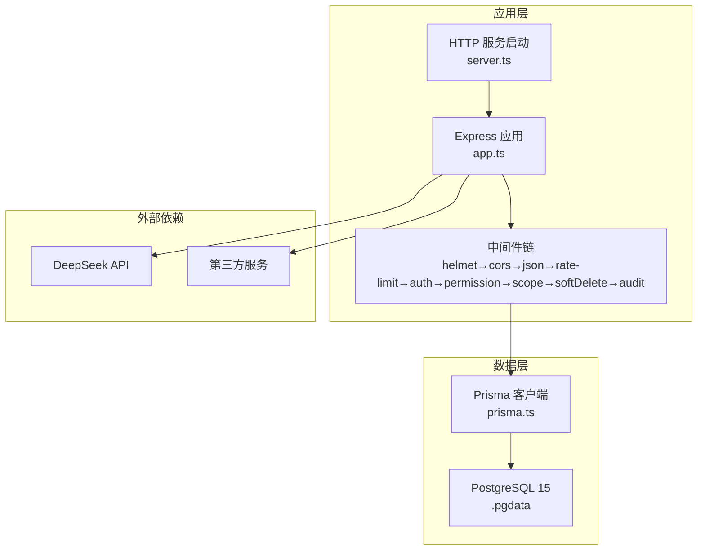
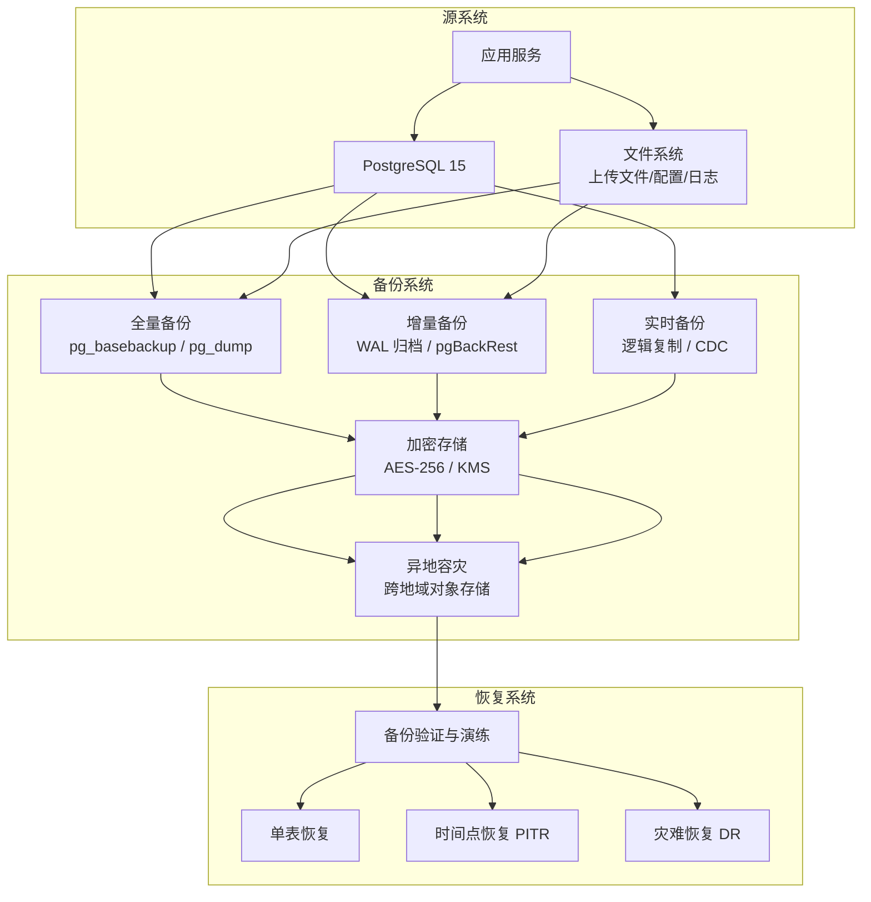
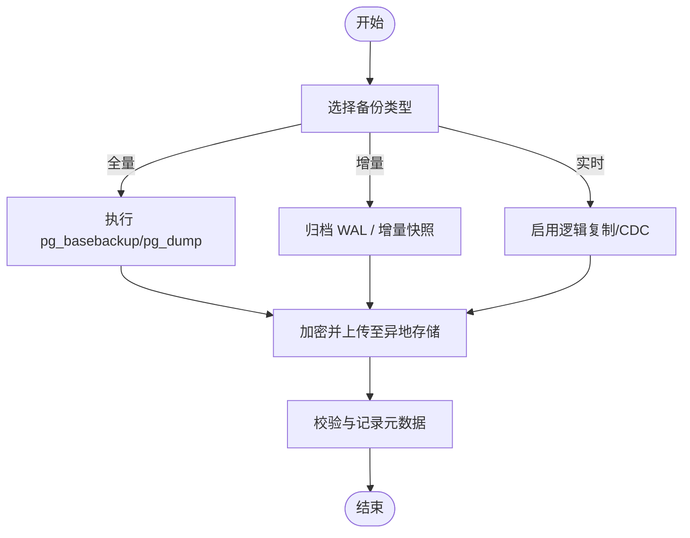
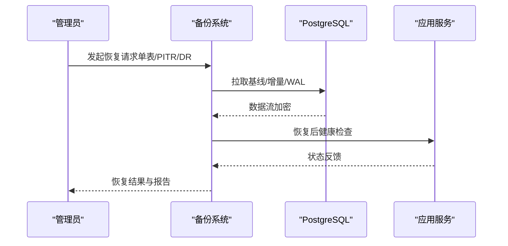
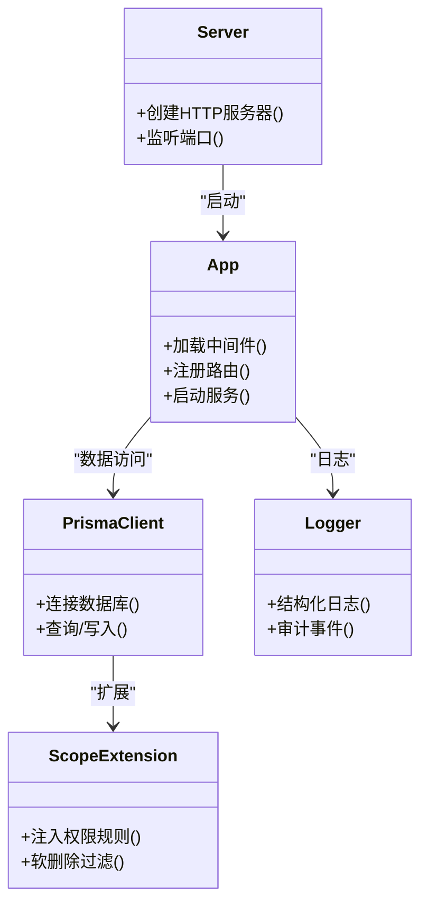

# 备份恢复

<cite>
**本文引用的文件**   
- [postgresql.conf](file://server/.pgdata/postgresql.conf)
- [postmaster.opts](file://server/.pgdata/postmaster.opts)
- [schema.prisma](file://server/prisma/schema.prisma)
- [env.ts](file://server/src/config/env.ts)
- [logger.ts](file://server/src/lib/logger.ts)
- [app.ts](file://server/src/app.ts)
- [server.ts](file://server/src/server.ts)
- [cors.ts](file://server/src/middleware/cors.ts)
- [rate-limit.ts](file://server/src/middleware/rate-limit.ts)
- [auth.ts](file://server/src/middleware/auth.ts)
- [permission.ts](file://server/src/middleware/permission.ts)
- [scope.ts](file://server/src/middleware/scope.ts)
- [soft-delete.ts](file://server/src/middleware/soft-delete.ts)
- [audit.ts](file://server/src/middleware/audit.ts)
- [error-handler.ts](file://server/src/middleware/error-handler.ts)
- [prisma.ts](file://server/src/lib/prisma.ts)
- [express.d.ts](file://server/src/types/express.d.ts)
</cite>

## 目录
1. [简介](#简介)
2. [项目结构](#项目结构)
3. [核心组件](#核心组件)
4. [架构总览](#架构总览)
5. [详细组件分析](#详细组件分析)
6. [依赖关系分析](#依赖关系分析)
7. [性能考虑](#性能考虑)
8. [故障排查指南](#故障排查指南)
9. [结论](#结论)
10. [附录](#附录)

## 简介
本文件为 FY200（浙江壹品慧财年经营数据分析平台）的备份与恢复规范，覆盖数据库、文件与配置、加密存储与异地容灾、恢复流程（单表恢复、时间点恢复、灾难恢复）、备份验证与演练、自动化脚本与监控告警。项目采用 Express + Prisma + PostgreSQL 15，中间件链顺序固定，计算类指标由后端实时计算不入库，AI 双管道涉及脱敏与还原。

## 项目结构
FY200 包含前端 web、后端 server、PostgreSQL 数据目录 .pgdata、Prisma 迁移与种子数据等。备份恢复相关的关键位置：
- 数据库实例数据目录：server/.pgdata
- 应用配置与环境变量：server/src/config/env.ts
- 日志输出：server/src/lib/logger.ts
- 应用入口与中间件链：server/src/app.ts, server/src/server.ts
- 数据库连接与扩展：server/src/lib/prisma.ts, server/src/middleware/scope.ts
- 权限与审计：server/src/middleware/permission.ts, server/src/middleware/audit.ts

图表来源
- [app.ts](file://server/src/app.ts)
- [server.ts](file://server/src/server.ts)
- [prisma.ts](file://server/src/lib/prisma.ts)
- [postgresql.conf](file://server/.pgdata/postgresql.conf)

章节来源
- [app.ts](file://server/src/app.ts)
- [server.ts](file://server/src/server.ts)
- [prisma.ts](file://server/src/lib/prisma.ts)
- [postgresql.conf](file://server/.pgdata/postgresql.conf)

## 核心组件
- 数据库：PostgreSQL 15，数据目录位于 server/.pgdata，使用 WAL 归档支持时间点恢复。
- ORM：Prisma 5，通过 prisma.ts 初始化连接，配合 scope 扩展实现行级权限与软删除。
- 应用：Express 4，严格中间件顺序保障安全与可观测性。
- 日志：统一 logger.ts 输出结构化日志，便于审计与回溯。
- 配置：env.ts 集中管理环境变量（如数据库连接、密钥、开关）。

章节来源
- [postgresql.conf](file://server/.pgdata/postgresql.conf)
- [postmaster.opts](file://server/.pgdata/postmaster.opts)
- [prisma.ts](file://server/src/lib/prisma.ts)
- [env.ts](file://server/src/config/env.ts)
- [logger.ts](file://server/src/lib/logger.ts)

## 架构总览
备份恢复体系围绕“数据库+文件+配置”三类对象，结合加密与异地容灾，形成多副本、多策略、可验证的闭环。

图表来源
- [postgresql.conf](file://server/.pgdata/postgresql.conf)
- [prisma.ts](file://server/src/lib/prisma.ts)
- [logger.ts](file://server/src/lib/logger.ts)

## 详细组件分析

### 数据库备份策略
- 全量备份
  - 目标：周期性完整快照，作为恢复基线。
  - 工具：pg_basebackup 或 pg_dump（按库/按表导出）。
  - 频率：每日一次，保留 N 天滚动。
  - 校验：校验和、元数据清单、恢复演练抽样。
- 增量备份
  - 目标：基于 WAL 的增量归档，降低备份窗口与存储成本。
  - 工具：WAL 归档（archive_command）或 pgBackRest。
  - 频率：持续归档，按时间/大小切分。
  - 校验：WAL 完整性校验、回放测试。
- 实时备份
  - 目标：近零丢失的数据同步。
  - 方案：PostgreSQL 逻辑复制（发布/订阅）或 CDC 工具。
  - 频率：毫秒~秒级延迟。
  - 校验：延迟监控、一致性比对。

图表来源
- [postgresql.conf](file://server/.pgdata/postgresql.conf)
- [postmaster.opts](file://server/.pgdata/postmaster.opts)

章节来源
- [postgresql.conf](file://server/.pgdata/postgresql.conf)
- [postmaster.opts](file://server/.pgdata/postmaster.opts)

### 文件备份方案
- 用户上传文件
  - 范围：业务导入/导出的 Excel、报表附件等。
  - 策略：对象存储多副本 + 版本控制；定期快照。
  - 安全：传输 TLS、静态 AES-256 加密、访问最小权限。
- 配置文件
  - 范围：应用配置、密钥、证书、Nginx/反向代理配置。
  - 策略：集中化配置中心或加密文件存储；变更留痕。
  - 安全：KMS 管理密钥，禁止明文落盘。
- 日志文件
  - 范围：应用日志、访问日志、审计日志。
  - 策略：轮转压缩、远端归档（S3/OSS），保留期合规。
  - 安全：脱敏敏感字段，限制访问。

章节来源
- [logger.ts](file://server/src/lib/logger.ts)
- [env.ts](file://server/src/config/env.ts)

### 加密存储与异地容灾
- 加密策略
  - 传输加密：TLS 1.2+。
  - 静态加密：AES-256，密钥由 KMS 托管。
  - 备份元数据：签名与哈希校验。
- 异地容灾
  - 多地域对象存储，开启版本控制与生命周期策略。
  - 跨区域复制，设置 RPO/RTO 目标。
  - 定期跨域恢复演练，验证可用性。

章节来源
- [env.ts](file://server/src/config/env.ts)
- [logger.ts](file://server/src/lib/logger.ts)

### 数据恢复流程
- 单表恢复
  - 适用：误删/误改的单表数据修复。
  - 步骤：定位最近有效备份 → 导出目标表 → 在隔离环境导入 → 校验 → 回写生产。
- 时间点恢复（PITR）
  - 适用：恢复到指定时间戳或事务号。
  - 步骤：准备基线全量 → 回放 WAL 至目标时间 → 验证一致性 → 切换流量。
- 灾难恢复（DR）
  - 适用：主站点不可用。
  - 步骤：拉起备用环境 → 从异地恢复基线与增量 → 应用配置与密钥 → 验证服务与健康检查 → 切换域名/IP。

图表来源
- [postgresql.conf](file://server/.pgdata/postgresql.conf)
- [prisma.ts](file://server/src/lib/prisma.ts)

章节来源
- [postgresql.conf](file://server/.pgdata/postgresql.conf)
- [prisma.ts](file://server/src/lib/prisma.ts)

### 备份验证与恢复演练最佳实践
- 自动校验
  - 备份完成后进行完整性校验（哈希/校验和）。
  - 随机抽取备份集进行恢复演练，记录耗时与成功率。
- 演练计划
  - 月度单表恢复演练，季度 PITR 演练，年度 DR 演练。
  - 演练前冻结变更，演练后清理临时资源。
- 度量与报告
  - 统计 RPO/RTO、失败率、恢复时长趋势。
  - 生成审计报告并归档。

章节来源
- [logger.ts](file://server/src/lib/logger.ts)
- [env.ts](file://server/src/config/env.ts)

### 自动化备份脚本与监控告警
- 自动化
  - 定时任务：cron/systemd timer 触发全量/增量/归档。
  - 幂等设计：断点续传、去重、重试与退避。
  - 通知：成功/失败邮件/IM 通知，附带摘要。
- 监控告警
  - 指标：备份时长、失败次数、WAL 延迟、存储空间、复制延迟。
  - 阈值：超过 SLA 即告警，分级处理（警告/严重/致命）。
  - 看板：可视化展示备份健康度与恢复演练结果。

章节来源
- [logger.ts](file://server/src/lib/logger.ts)
- [env.ts](file://server/src/config/env.ts)

## 依赖关系分析
- 应用与服务
  - app.ts 定义路由与中间件挂载，server.ts 启动 HTTP 服务。
  - 中间件链顺序固定，确保鉴权、限流、审计等前置生效。
- 数据访问
  - prisma.ts 初始化 Prisma 客户端，scope.ts 注入权限扩展。
  - 数据库连接参数来自 env.ts。
- 日志与错误
  - logger.ts 统一输出，error-handler.ts 捕获异常并上报。

图表来源
- [app.ts](file://server/src/app.ts)
- [server.ts](file://server/src/server.ts)
- [prisma.ts](file://server/src/lib/prisma.ts)
- [scope.ts](file://server/src/middleware/scope.ts)
- [logger.ts](file://server/src/lib/logger.ts)

章节来源
- [app.ts](file://server/src/app.ts)
- [server.ts](file://server/src/server.ts)
- [prisma.ts](file://server/src/lib/prisma.ts)
- [scope.ts](file://server/src/middleware/scope.ts)
- [logger.ts](file://server/src/lib/logger.ts)

## 性能考虑
- 备份窗口
  - 全量备份选择低峰时段，增量与实时备份对在线影响最小化。
- I/O 与 CPU
  - 备份进程限制并发与带宽，避免与应用争抢资源。
- WAL 与复制
  - 合理设置 WAL 保留与归档策略，避免磁盘爆满。
- 恢复效率
  - 预冷缓存、并行导入、分批提交，缩短恢复时间。

[本节为通用指导，无需特定文件引用]

## 故障排查指南
- 常见问题
  - 备份失败：检查磁盘空间、网络连通、权限与密钥。
  - 恢复失败：确认备份集完整性、WAL 连续性、目标库状态。
  - 延迟过高：检查复制链路、网络抖动、下游负载。
- 诊断步骤
  - 查看日志：应用日志、数据库日志、备份任务日志。
  - 校验元数据：哈希、校验和、清单对比。
  - 模拟恢复：在隔离环境复现问题，逐步定位根因。
- 应急措施
  - 暂停非关键任务，释放资源。
  - 切换到备用路径（异地恢复），优先恢复核心功能。

章节来源
- [logger.ts](file://server/src/lib/logger.ts)
- [error-handler.ts](file://server/src/middleware/error-handler.ts)

## 结论
FY200 的备份恢复体系以 PostgreSQL WAL 为核心，结合全量、增量与实时备份，辅以文件与配置的加密与异地容灾，形成高可用、可验证、可演练的闭环。通过严格的中间件链与统一的日志审计，保障数据安全与可追溯性。建议持续完善自动化与监控，定期演练，确保 RPO/RTO 达标。

[本节为总结，无需特定文件引用]

## 附录
- 术语
  - RPO：恢复点目标（允许的最大数据丢失时间）。
  - RTO：恢复时间目标（允许的最大恢复时长）。
  - PITR：时间点恢复。
  - WAL：Write-Ahead Logging。
- 参考
  - PostgreSQL 官方文档：备份与恢复、WAL 归档、逻辑复制。
  - Prisma 文档：连接与扩展。
  - 企业级对象存储：版本控制、跨区域复制、生命周期策略。

[本节为概念说明，无需特定文件引用]