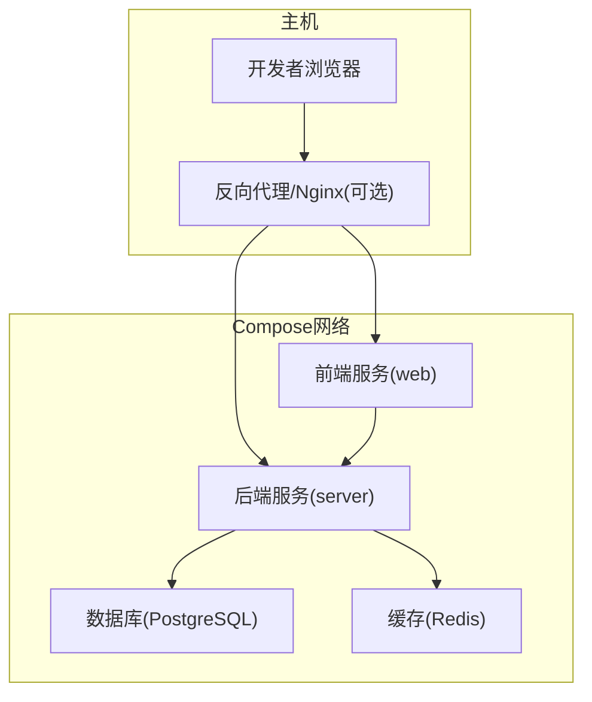
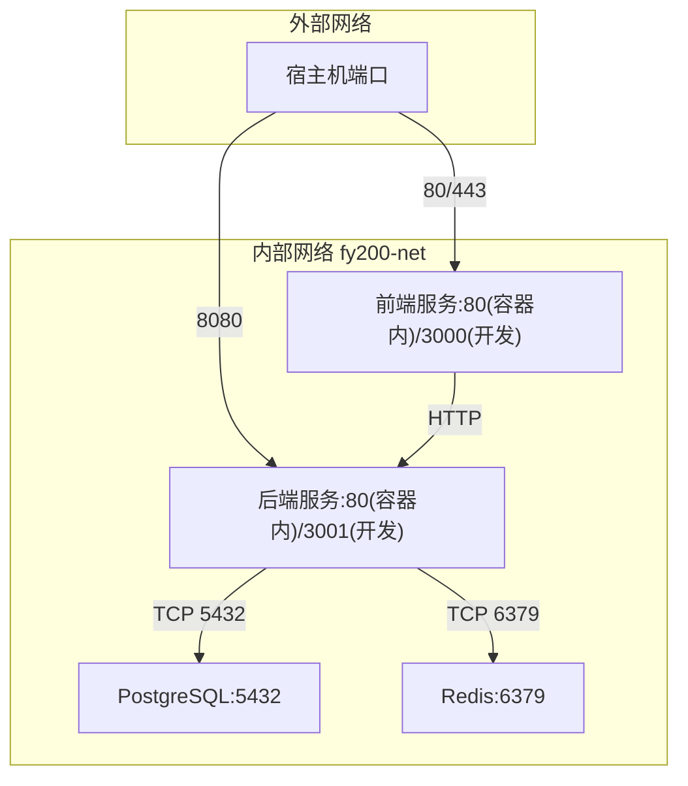
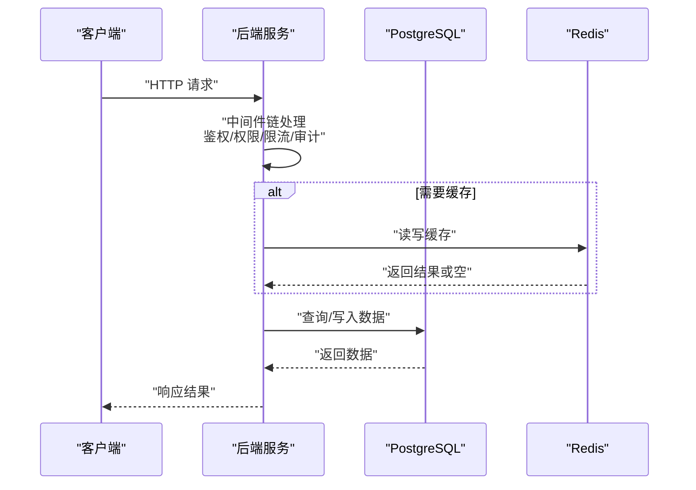
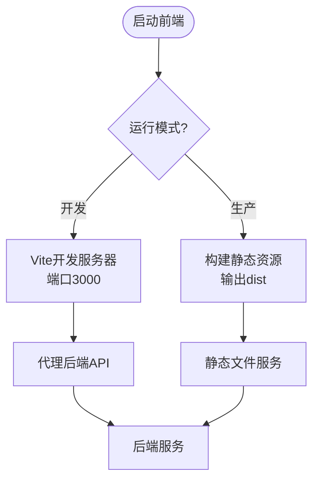
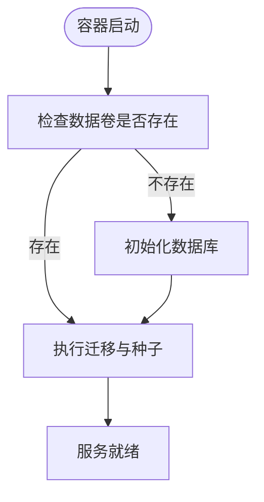
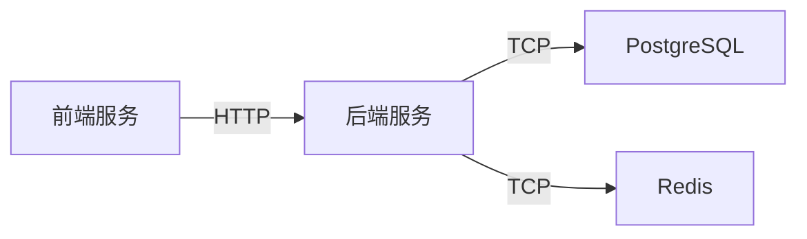

# Docker Compose编排

<cite>
**本文引用的文件**   
- [server/package.json](file://server/package.json)
- [server/src/config/env.ts](file://server/src/config/env.ts)
- [server/src/app.ts](file://server/src/app.ts)
- [server/src/server.ts](file://server/src/server.ts)
- [server/prisma/schema.prisma](file://server/prisma/schema.prisma)
- [web/package.json](file://web/package.json)
- [web/vite.config.ts](file://web/vite.config.ts)
- [web/src/lib/api.ts](file://web/src/lib/api.ts)
- [server/.pgdata/postgresql.conf](file://server/.pgdata/postgresql.conf)
</cite>

## 目录
1. [简介](#简介)
2. [项目结构](#项目结构)
3. [核心组件](#核心组件)
4. [架构总览](#架构总览)
5. [详细组件分析](#详细组件分析)
6. [依赖关系分析](#依赖关系分析)
7. [性能与资源建议](#性能与资源建议)
8. [故障排查指南](#故障排查指南)
9. [结论](#结论)
10. [附录：Compose配置清单](#附录compose配置清单)

## 简介
本文件为FY200项目的Docker Compose编排文档，面向开发与生产环境，覆盖前后端应用、PostgreSQL数据库、Redis缓存服务的定义与依赖关系；阐述网络隔离与服务间通信、端口映射、数据持久化、环境变量与Secret管理；并给出健康检查、重启策略、资源限制以及开发/生产差异。

## 项目结构
FY200采用前后端分离架构：
- 后端服务（Express + Prisma）位于 server 目录，依赖 PostgreSQL 与可选 Redis。
- 前端应用（Vite + React）位于 web 目录，构建后由静态服务器或反向代理提供。
- 数据库初始化与迁移通过 Prisma 管理，迁移脚本位于 server/prisma/migrations。
- 运行时配置通过环境变量注入，敏感信息通过Secret管理。

[本图为概念性架构图，不直接映射具体源码文件]

## 核心组件
- 后端服务（server）
  - 技术栈：Express 4、Prisma 5、JWT鉴权、SSE流式AI调用。
  - 关键入口：应用初始化与路由注册在 app.ts，HTTP监听在 server.ts。
  - 配置加载：环境变量读取与校验在 config/env.ts。
  - 数据库：连接字符串、迁移与种子数据通过 Prisma 管理。
- 前端服务（web）
  - 技术栈：Vite + React，开发时热重载，生产构建静态资源。
  - API访问：通过 lib/api.ts 统一请求封装，支持相对路径或代理转发。
- 数据库（PostgreSQL）
  - 版本：PostgreSQL 15，数据卷持久化到宿主机或命名卷。
  - 配置：可通过挂载自定义 postgresql.conf 调整参数。
- 缓存（Redis）
  - 用途：会话、限流、临时缓存等（按需启用）。
  - 数据：默认无状态，可按需开启持久化。

**章节来源**
- [server/src/app.ts](file://server/src/app.ts)
- [server/src/server.ts](file://server/src/server.ts)
- [server/src/config/env.ts](file://server/src/config/env.ts)
- [server/prisma/schema.prisma](file://server/prisma/schema.prisma)
- [web/src/lib/api.ts](file://web/src/lib/api.ts)
- [web/vite.config.ts](file://web/vite.config.ts)
- [server/.pgdata/postgresql.conf](file://server/.pgdata/postgresql.conf)

## 架构总览
下图展示Compose中各服务间的依赖与通信关系，包括网络隔离、端口映射与数据卷挂载。

**图表来源**
- [server/src/server.ts](file://server/src/server.ts)
- [web/vite.config.ts](file://web/vite.config.ts)

**章节来源**
- [server/src/server.ts](file://server/src/server.ts)
- [web/vite.config.ts](file://web/vite.config.ts)

## 详细组件分析

### 后端服务（server）
- 启动流程
  - 应用初始化：加载中间件链（helmet → cors → express.json → rate-limit → auth → permission → scope → softDelete → audit），注册路由与错误处理。
  - HTTP监听：根据环境变量决定端口与绑定地址。
- 配置与环境变量
  - 数据库连接串、JWT密钥、速率限制、CORS、日志级别等通过环境变量注入。
  - 敏感信息（如DB密码、JWT密钥、第三方API密钥）应使用Secret管理。
- 数据库与迁移
  - 使用Prisma Client连接PostgreSQL，运行迁移与种子数据。
  - 建议在容器启动前执行迁移，确保Schema一致。
- 健康检查
  - 暴露健康检查端点（如 /health），返回服务状态与依赖可用性。
- 资源限制
  - 设置CPU与内存上限，避免单实例占用过多资源。

**图表来源**
- [server/src/app.ts](file://server/src/app.ts)
- [server/src/config/env.ts](file://server/src/config/env.ts)

**章节来源**
- [server/src/app.ts](file://server/src/app.ts)
- [server/src/config/env.ts](file://server/src/config/env.ts)
- [server/package.json](file://server/package.json)

### 前端服务（web）
- 开发模式
  - Vite开发服务器，端口通常为3000，支持热重载与代理后端API。
  - 代理配置指向后端服务域名或IP，避免跨域问题。
- 生产模式
  - 构建静态资源，由Nginx或反向代理提供服务。
  - API请求使用相对路径，由反向代理转发至后端。
- 健康检查
  - 可暴露 /health 或 /status 端点，用于探针检测。

**图表来源**
- [web/vite.config.ts](file://web/vite.config.ts)
- [web/src/lib/api.ts](file://web/src/lib/api.ts)

**章节来源**
- [web/package.json](file://web/package.json)
- [web/vite.config.ts](file://web/vite.config.ts)
- [web/src/lib/api.ts](file://web/src/lib/api.ts)

### 数据库（PostgreSQL）
- 数据持久化
  - 将PostgreSQL数据目录挂载到宿主机或命名卷，确保重启不丢失。
- 配置管理
  - 可挂载自定义配置文件（postgresql.conf）以调整连接数、内存、日志等。
- 初始化
  - 首次启动执行Prisma迁移与种子数据，确保Schema与初始数据就绪。
- 安全
  - 通过环境变量设置强密码，禁止远程访问（仅内部网络）。

**图表来源**
- [server/prisma/schema.prisma](file://server/prisma/schema.prisma)
- [server/.pgdata/postgresql.conf](file://server/.pgdata/postgresql.conf)

**章节来源**
- [server/prisma/schema.prisma](file://server/prisma/schema.prisma)
- [server/.pgdata/postgresql.conf](file://server/.pgdata/postgresql.conf)

### 缓存（Redis）
- 用途
  - 会话存储、接口限流、热点数据缓存。
- 配置
  - 默认无状态，可按需开启AOF/RDB持久化。
- 安全
  - 设置访问密码，限制仅内部网络访问。

**章节来源**
- [server/src/config/env.ts](file://server/src/config/env.ts)

## 依赖关系分析
- 服务依赖
  - 后端依赖PostgreSQL与Redis（可选）。
  - 前端依赖后端API（开发时代理，生产时反向代理）。
- 网络隔离
  - 所有服务加入同一内部网络，禁止直接暴露数据库与缓存端口到宿主机。
- 端口映射
  - 仅暴露前端与后端端口到宿主机，数据库与缓存端口保持内部访问。

**图表来源**
- [server/src/server.ts](file://server/src/server.ts)
- [web/vite.config.ts](file://web/vite.config.ts)

**章节来源**
- [server/src/server.ts](file://server/src/server.ts)
- [web/vite.config.ts](file://web/vite.config.ts)

## 性能与资源建议
- 后端服务
  - 设置合理的CPU与内存限制，避免OOM。
  - 调整连接池大小与超时时间，匹配数据库负载。
- 数据库
  - 根据内存大小调整shared_buffers、work_mem等参数。
  - 启用慢查询日志，定期分析优化。
- 缓存
  - 合理设置过期时间与最大内存，避免缓存穿透与雪崩。
- 前端
  - 生产环境启用Gzip/Brotli压缩，减少传输体积。

[本节为通用性能建议，不直接分析具体文件]

## 故障排查指南
- 后端无法连接数据库
  - 检查数据库连接串、用户名、密码是否正确。
  - 确认数据库服务已启动且端口可达。
- 前端无法访问后端API
  - 开发环境检查代理配置是否正确。
  - 生产环境检查反向代理规则与防火墙设置。
- 健康检查失败
  - 检查服务日志与依赖状态。
  - 验证健康检查端点是否可访问。

**章节来源**
- [server/src/config/env.ts](file://server/src/config/env.ts)
- [server/src/app.ts](file://server/src/app.ts)

## 结论
通过Docker Compose编排FY200项目，可实现前后端、数据库与缓存的统一管理与自动化部署。遵循本文的网络隔离、数据持久化、环境变量与Secret管理、健康检查与资源限制等最佳实践，可显著提升开发与生产环境的稳定性与可维护性。

[本节为总结性内容，不直接分析具体文件]

## 附录：Compose配置清单
以下为推荐的Compose配置要点（以说明为主，非代码片段）：
- 服务定义
  - 前端服务：基于Node.js镜像，开发模式启动Vite，生产模式提供静态资源。
  - 后端服务：基于Node.js镜像，安装依赖、执行迁移、启动应用。
  - 数据库服务：基于PostgreSQL镜像，挂载数据卷与配置文件。
  - 缓存服务：基于Redis镜像，按需挂载数据卷。
- 网络配置
  - 创建内部网络，服务间通过服务名通信。
  - 仅映射前端与后端端口到宿主机。
- 数据卷
  - 数据库数据卷：持久化PostgreSQL数据目录。
  - 配置文件卷：挂载自定义配置文件（如postgresql.conf）。
- 环境变量
  - 数据库连接串、JWT密钥、第三方API密钥等通过环境变量注入。
  - 敏感信息使用Secret管理，避免硬编码。
- 健康检查
  - 后端暴露健康检查端点，定期检查服务状态。
  - 数据库与缓存可通过内置命令检查可用性。
- 重启策略
  - 设置自动重启策略，确保服务异常时自动恢复。
- 资源限制
  - 为每个服务设置CPU与内存上限，避免资源争用。

[本节为配置要点说明，不直接分析具体文件]