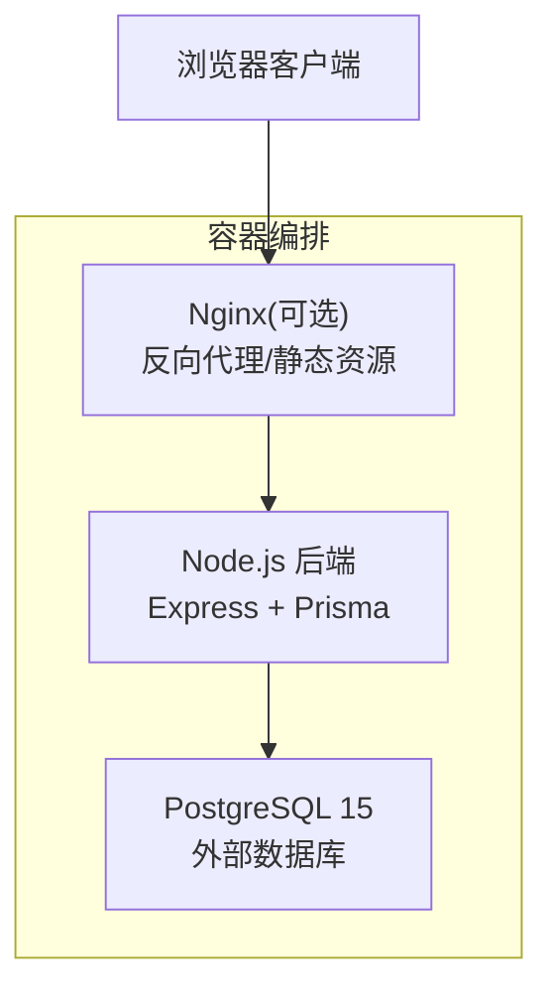
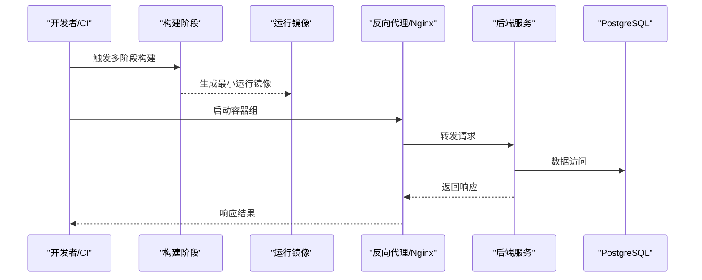
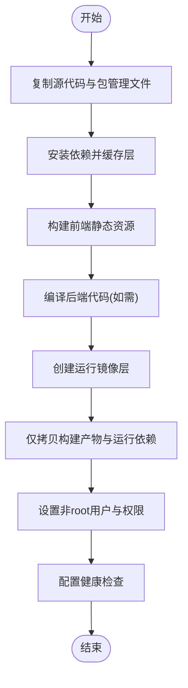
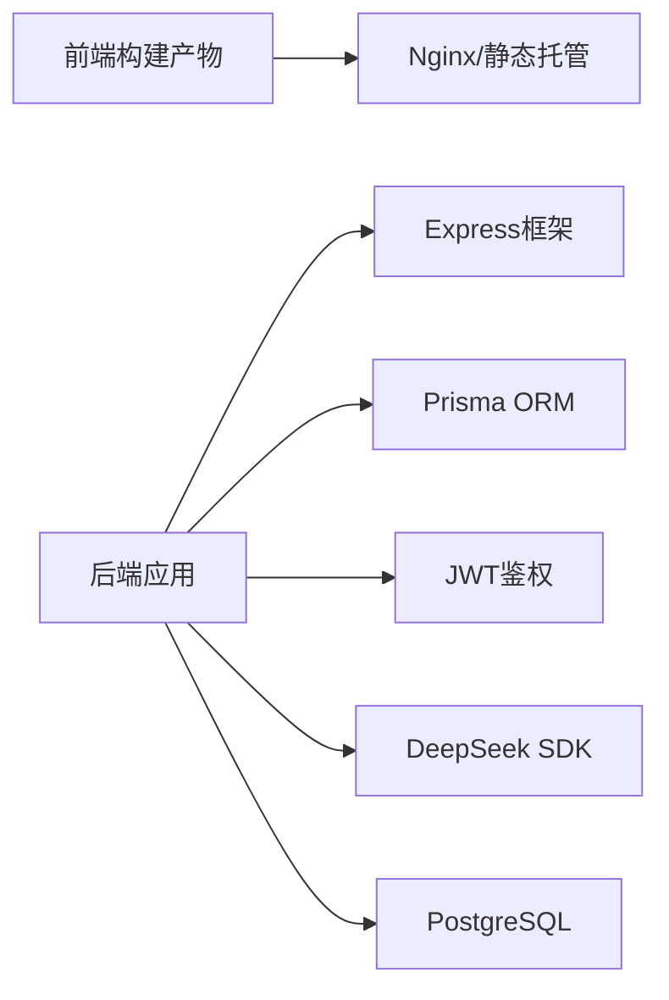

# Docker容器化

<cite>
**本文引用的文件**   
- [server/package.json](file://server/package.json)
- [server/src/app.ts](file://server/src/app.ts)
- [server/src/server.ts](file://server/src/server.ts)
- [server/src/config/env.ts](file://server/src/config/env.ts)
- [web/package.json](file://web/package.json)
- [web/vite.config.ts](file://web/vite.config.ts)
- [web/index.html](file://web/index.html)
</cite>

## 目录
1. [简介](#简介)
2. [项目结构](#项目结构)
3. [核心组件](#核心组件)
4. [架构总览](#架构总览)
5. [详细组件分析](#详细组件分析)
6. [依赖关系分析](#依赖关系分析)
7. [性能与体积优化](#性能与体积优化)
8. [安全与漏洞扫描](#安全与漏洞扫描)
9. [本地开发与生产发布流程](#本地开发与生产发布流程)
10. [故障排查指南](#故障排查指南)
11. [结论](#结论)

## 简介
本文件为FY200项目的Docker容器化指南，覆盖多阶段镜像构建、前后端打包策略、Dockerfile编写规范、镜像分层优化、安全扫描与漏洞检测、以及本地开发容器化与生产发布流程。目标是提供可复现、可审计、可扩展的容器化方案，确保在开发与生产环境一致性与安全性。

## 项目结构
FY200采用前后端分离：
- 后端：Express + Prisma + PostgreSQL（运行期连接外部PostgreSQL）
- 前端：Vite构建静态资源，由Nginx或反向代理提供服务
- 根级包含锁文件与文档，服务配置位于各自子目录

[本图为概念性架构图，不直接映射具体源码文件]

## 核心组件
- 后端应用入口与中间件链：Express应用初始化、中间件顺序与安全头设置
- 环境变量与配置：运行时配置读取与校验
- 前端构建产物：Vite构建输出到静态目录，供反向代理托管

关键路径参考：
- 后端入口与中间件：[server/src/app.ts](file://server/src/app.ts)、[server/src/server.ts](file://server/src/server.ts)
- 环境变量配置：[server/src/config/env.ts](file://server/src/config/env.ts)
- 后端依赖与脚本：[server/package.json](file://server/package.json)
- 前端构建配置与产物：[web/vite.config.ts](file://web/vite.config.ts)、[web/package.json](file://web/package.json)、[web/index.html](file://web/index.html)

**章节来源**
- [server/src/app.ts](file://server/src/app.ts)
- [server/src/server.ts](file://server/src/server.ts)
- [server/src/config/env.ts](file://server/src/config/env.ts)
- [server/package.json](file://server/package.json)
- [web/vite.config.ts](file://web/vite.config.ts)
- [web/package.json](file://web/package.json)
- [web/index.html](file://web/index.html)

## 架构总览
容器化架构建议：
- 使用多阶段构建：第一阶段构建前端静态资源；第二阶段仅包含运行期依赖与编译产物
- 后端以非root用户运行，最小基础镜像，禁用调试信息
- 通过环境变量注入敏感配置，避免写入镜像层
- 使用只读文件系统与最小权限原则

[本图为概念性流程图，不直接映射具体源码文件]

## 详细组件分析

### 后端容器化要点
- 基础镜像选择：使用精简的Node.js LTS镜像，如alpine或slim变体
- 依赖安装优化：先复制package.json与lock文件，缓存node_modules层
- 构建产物：若存在TypeScript编译，应在构建阶段完成，运行镜像仅含dist
- 环境变量：通过ENV或docker-compose注入，运行时读取
- 健康检查：暴露健康检查端点，便于编排平台探测

关键实现参考：
- 应用初始化与中间件链：[server/src/app.ts](file://server/src/app.ts)
- 服务器启动：[server/src/server.ts](file://server/src/server.ts)
- 环境变量读取：[server/src/config/env.ts](file://server/src/config/env.ts)
- 依赖与脚本定义：[server/package.json](file://server/package.json)

**章节来源**
- [server/src/app.ts](file://server/src/app.ts)
- [server/src/server.ts](file://server/src/server.ts)
- [server/src/config/env.ts](file://server/src/config/env.ts)
- [server/package.json](file://server/package.json)

### 前端容器化要点
- 构建阶段：基于Node镜像执行npm install与构建命令，输出静态资源
- 运行阶段：使用Nginx或轻量HTTP服务器托管静态资源
- 缓存优化：利用构建缓存与CDN策略提升加载速度
- 环境变量：通过构建时替换或运行时注入

关键实现参考：
- 构建配置与输出目录：[web/vite.config.ts](file://web/vite.config.ts)
- 依赖与脚本：[web/package.json](file://web/package.json)
- 入口HTML：[web/index.html](file://web/index.html)

**章节来源**
- [web/vite.config.ts](file://web/vite.config.ts)
- [web/package.json](file://web/package.json)
- [web/index.html](file://web/index.html)

### 多阶段构建策略
- 阶段一（构建器）：安装依赖、执行测试与构建，产出静态资源与编译产物
- 阶段二（运行器）：仅拷贝必要文件，设置非root用户，暴露端口，健康检查
- 共享层：将公共依赖与配置文件抽离，提高缓存命中率

[本图为概念性流程图，不直接映射具体源码文件]

### Dockerfile编写规范
- 基础镜像：选择官方LTS版本，优先slim/alpine以减少体积
- 依赖安装：先复制package*.json，再复制源码，最大化利用缓存
- 环境变量：使用ENV声明默认值，运行时通过参数覆盖
- 安全最佳实践：
  - 非root用户运行
  - 关闭调试模式与日志输出到stdout
  - 最小权限与只读文件系统
  - 定期更新基础镜像与依赖

[本节为通用规范说明，不直接引用具体文件]

### 镜像分层优化技巧
- 分层策略：将频繁变更的代码与稳定依赖分开放置
- 缓存命中：合理排序COPY指令，确保依赖层不被重复构建
- 清理无用文件：删除临时文件与构建工具，减少镜像体积
- 多阶段复用：在不同服务间共享构建阶段，减少重复工作

[本节为通用优化建议，不直接引用具体文件]

### 安全扫描与漏洞检测
- 扫描工具：使用Trivy、Snyk或Clair对镜像进行漏洞扫描
- 扫描范围：操作系统包与Node.js依赖
- 报告处理：将扫描结果纳入CI门禁，阻断高危漏洞发布
- 基线策略：设定允许的漏洞等级与修复SLA

[本节为通用安全实践，不直接引用具体文件]

## 依赖关系分析
- 后端依赖：Express、Prisma、JWT、DeepSeek SDK等
- 前端依赖：Vite、React生态、图表库等
- 运行时依赖：Node.js运行时、系统库（如libpq）

[本图为概念性依赖图，不直接映射具体源码文件]

**章节来源**
- [server/package.json](file://server/package.json)
- [web/package.json](file://web/package.json)

## 性能与体积优化
- 构建优化：启用并行构建、增量编译、缓存依赖
- 镜像优化：移除调试符号、压缩资源、使用多阶段构建
- 网络优化：CDN加速静态资源、Gzip/Brotli压缩
- 运行时优化：连接池、缓存策略、异步处理

[本节为通用性能建议，不直接引用具体文件]

## 安全与漏洞扫描
- 镜像签名：使用Cosign或Notary对镜像签名验证
- 密钥管理：使用Secrets管理敏感信息，避免硬编码
- 访问控制：最小权限原则，限制容器网络与存储
- 审计日志：集中收集容器日志，便于追踪与分析

[本节为通用安全实践，不直接引用具体文件]

## 本地开发与生产发布流程
- 本地开发：
  - 使用docker-compose编排后端、数据库与可选的前端代理
  - 热重载与调试支持
- 生产发布：
  - CI/CD流水线执行构建、测试、扫描与推送
  - 版本标签与回滚策略
  - 监控与告警集成

[本节为通用流程说明，不直接引用具体文件]

## 故障排查指南
- 常见问题：
  - 环境变量未正确注入
  - 端口冲突或网络不可达
  - 依赖缺失或版本不兼容
  - 权限问题导致文件读写失败
- 诊断步骤：
  - 查看容器日志与状态
  - 进入容器执行命令调试
  - 检查健康检查端点
  - 验证数据库连接与迁移

[本节为通用排错建议，不直接引用具体文件]

## 结论
通过多阶段构建、分层优化与安全扫描，FY200项目可实现高效、安全、可维护的容器化部署。建议在CI/CD中固化最佳实践，持续改进镜像质量与运行稳定性。