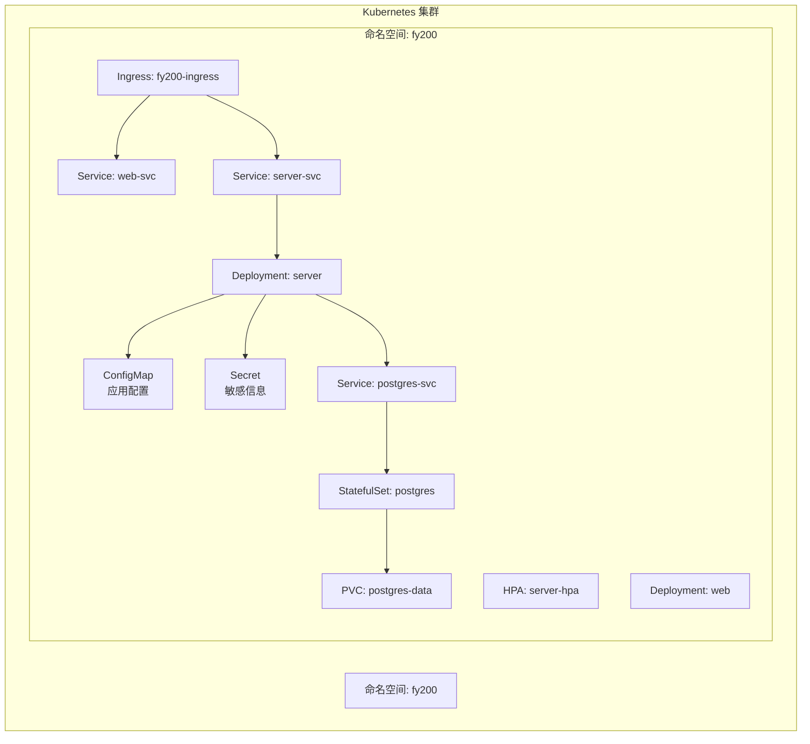
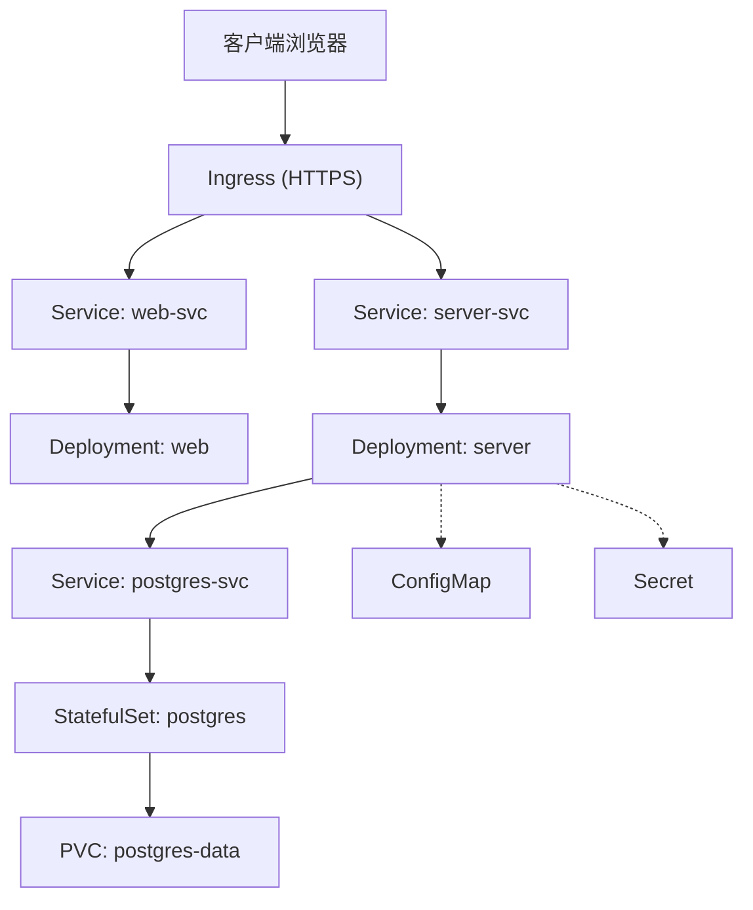
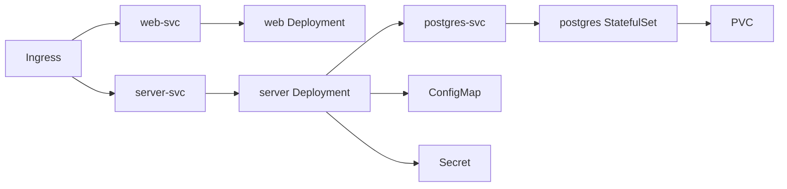

# Kubernetes部署

<cite>
**本文档引用的文件**   
- [server/src/config/env.ts](file://server/src/config/env.ts)
- [server/src/app.ts](file://server/src/app.ts)
- [server/src/server.ts](file://server/src/server.ts)
- [server/package.json](file://server/package.json)
- [web/vite.config.ts](file://web/vite.config.ts)
- [web/package.json](file://web/package.json)
- [server/prisma/schema.prisma](file://server/prisma/schema.prisma)
- [server/.pgdata/postgresql.conf](file://server/.pgdata/postgresql.conf)
- [server/.pgdata/pg_hba.conf](file://server/.pgdata/pg_hba.conf)
- [docs/references/backend.md](file://docs/references/backend.md)
- [docs/references/devops.md](file://docs/references/devops.md)
- [docs/references/observability.md](file://docs/references/observability.md)
</cite>

## 目录
1. [简介](#简介)
2. [项目结构](#项目结构)
3. [核心组件](#核心组件)
4. [架构总览](#架构总览)
5. [详细组件分析](#详细组件分析)
6. [依赖关系分析](#依赖关系分析)
7. [性能考虑](#性能考虑)
8. [故障排查指南](#故障排查指南)
9. [结论](#结论)
10. [附录](#附录)

## 简介
本文件为FY200项目的Kubernetes部署文档，面向运维与研发人员，提供完整的K8s资源定义、命名空间规划、Ingress与HTTPS证书管理、存储类与数据持久化、HPA水平扩缩容与滚动更新策略、日志监控告警与故障排查方案，以及集群环境准备与部署脚本。项目定位为“Excel进、看板/报表出”的内部管理口径财务数据分析平台，后端基于Express + Prisma + PostgreSQL，前端为静态站点构建产物。

## 项目结构
FY200包含前后端两个应用：
- 后端（server）：Node.js Express服务，使用Prisma访问PostgreSQL，提供REST API与AI代理能力。
- 前端（web）：Vite构建的静态资源，通过Nginx或Ingress暴露。

图表来源
- [server/src/app.ts](file://server/src/app.ts)
- [server/src/server.ts](file://server/src/server.ts)
- [server/package.json](file://server/package.json)
- [web/vite.config.ts](file://web/vite.config.ts)
- [web/package.json](file://web/package.json)
- [server/prisma/schema.prisma](file://server/prisma/schema.prisma)
- [server/.pgdata/postgresql.conf](file://server/.pgdata/postgresql.conf)
- [server/.pgdata/pg_hba.conf](file://server/.pgdata/pg_hba.conf)

章节来源
- [server/src/app.ts](file://server/src/app.ts)
- [server/src/server.ts](file://server/src/server.ts)
- [server/package.json](file://server/package.json)
- [web/vite.config.ts](file://web/vite.config.ts)
- [web/package.json](file://web/package.json)
- [server/prisma/schema.prisma](file://server/prisma/schema.prisma)
- [server/.pgdata/postgresql.conf](file://server/.pgdata/postgresql.conf)
- [server/.pgdata/pg_hba.conf](file://server/.pgdata/pg_hba.conf)

## 核心组件
- 命名空间与隔离
  - 命名空间：fy200
  - 资源隔离：所有Pod、Service、ConfigMap、Secret、PVC等统一置于fy200命名空间；RBAC按角色最小权限分配。
- 应用配置与密钥
  - ConfigMap：存放非敏感配置（如数据库连接参数、端口、环境变量）。
  - Secret：存放敏感信息（数据库密码、JWT密钥、第三方API Key）。
- 工作负载
  - Deployment：后端server与前端web无状态副本，支持滚动更新与回滚。
  - StatefulSet：PostgreSQL有状态数据库，绑定PVC实现数据持久化。
- 服务发现与负载均衡
  - Service：后端server-svc与前端web-svc暴露ClusterIP；Ingress对外暴露HTTP/HTTPS。
- Ingress与HTTPS
  - 使用Ingress Controller（如nginx或traefik），TLS证书由cert-manager自动签发与管理。
- 存储类与持久化
  - StorageClass：根据云厂商选择高性能SSD或通用盘；PostgreSQL数据目录挂载PVC。
- 水平扩缩容与滚动更新
  - HPA：基于CPU/内存或自定义指标对server进行扩缩容。
  - RollingUpdate：Deployment默认滚动策略，保证零停机发布。
- 可观测性
  - 日志：容器stdout/stderr采集至集中式日志系统（如EFK/PLG）。
  - 监控：Prometheus抓取K8s与应用指标，Grafana可视化，AlertManager告警。
  - 追踪：可选OpenTelemetry接入链路追踪。

章节来源
- [server/src/config/env.ts](file://server/src/config/env.ts)
- [server/src/app.ts](file://server/src/app.ts)
- [server/src/server.ts](file://server/src/server.ts)
- [server/package.json](file://server/package.json)
- [web/vite.config.ts](file://web/vite.config.ts)
- [web/package.json](file://web/package.json)
- [server/prisma/schema.prisma](file://server/prisma/schema.prisma)
- [server/.pgdata/postgresql.conf](file://server/.pgdata/postgresql.conf)
- [server/.pgdata/pg_hba.conf](file://server/.pgdata/pg_hba.conf)

## 架构总览
FY200在K8s中的运行架构如下：
- 外部用户通过域名访问Ingress，Ingress将请求路由到web-svc（前端静态资源）或server-svc（后端API）。
- server通过Prisma连接postgres-svc，数据落盘于PVC。
- 所有配置通过ConfigMap注入，敏感信息通过Secret注入。
- HPA根据负载自动扩缩容server副本数。
- 日志与监控通过Sidecar或DaemonSet收集并上报。

图表来源
- [server/src/app.ts](file://server/src/app.ts)
- [server/src/server.ts](file://server/src/server.ts)
- [server/package.json](file://server/package.json)
- [web/vite.config.ts](file://web/vite.config.ts)
- [web/package.json](file://web/package.json)
- [server/prisma/schema.prisma](file://server/prisma/schema.prisma)
- [server/.pgdata/postgresql.conf](file://server/.pgdata/postgresql.conf)
- [server/.pgdata/pg_hba.conf](file://server/.pgdata/pg_hba.conf)

## 详细组件分析

### 命名空间与资源隔离
- 命名空间：fy200
- 隔离策略：
  - 所有资源统一归属fy200命名空间。
  - RBAC：为不同角色（开发、运维、只读）创建Role/RoleBinding，限制对ConfigMap、Secret、Deployment、StatefulSet等的操作权限。
  - NetworkPolicy：限制跨命名空间访问，仅允许Ingress与Service间通信。

章节来源
- [server/src/app.ts](file://server/src/app.ts)
- [server/src/server.ts](file://server/src/server.ts)

### 配置与密钥（ConfigMap与Secret）
- ConfigMap：
  - 键值包括：数据库连接字符串、端口、节点环境、功能开关等。
  - 通过环境变量或文件卷挂载注入到Pod。
- Secret：
  - 键值包括：数据库密码、JWT密钥、第三方API Key等。
  - 建议使用Opaque类型，并通过kubectl或CI/CD安全注入。

章节来源
- [server/src/config/env.ts](file://server/src/config/env.ts)
- [server/package.json](file://server/package.json)

### 后端服务（Deployment与Service）
- Deployment：
  - 镜像：后端构建镜像，包含Express应用与依赖。
  - 副本数：初始2-3个，HPA动态调整。
  - 健康检查：livenessProbe与readinessProbe基于HTTP探针。
  - 滚动更新：maxUnavailable=1，maxSurge=1。
- Service：
  - ClusterIP暴露后端API，供Ingress与内部调用。

章节来源
- [server/src/app.ts](file://server/src/app.ts)
- [server/src/server.ts](file://server/src/server.ts)
- [server/package.json](file://server/package.json)

### 前端服务（Deployment与Service）
- Deployment：
  - 镜像：Vite构建的静态资源镜像（Nginx基础镜像）。
  - 副本数：1-2个。
  - 健康检查：HTTP探针探测根路径。
- Service：
  - ClusterIP暴露静态资源，供Ingress路由。

章节来源
- [web/vite.config.ts](file://web/vite.config.ts)
- [web/package.json](file://web/package.json)

### 数据库（StatefulSet与PVC）
- StatefulSet：
  - 镜像：PostgreSQL 15。
  - 存储：PVC绑定StorageClass，数据目录挂载到/var/lib/postgresql/data。
  - 初始化：可通过Init Container执行迁移脚本（Prisma migrate）。
- Service：
  - ClusterIP暴露数据库端口，供后端连接。

章节来源
- [server/prisma/schema.prisma](file://server/prisma/schema.prisma)
- [server/.pgdata/postgresql.conf](file://server/.pgdata/postgresql.conf)
- [server/.pgdata/pg_hba.conf](file://server/.pgdata/pg_hba.conf)

### Ingress与HTTPS证书管理
- Ingress：
  - 入口控制器：nginx或traefik。
  - 路由规则：/api指向server-svc，/指向web-svc。
  - TLS：配置域名与证书，启用HTTPS。
- 证书管理：
  - cert-manager自动申请Let's Encrypt证书，或通过私有CA签发。
  - 证书存储在Secret中，Ingress引用该Secret。

章节来源
- [server/src/app.ts](file://server/src/app.ts)
- [server/src/server.ts](file://server/src/server.ts)

### HPA水平扩缩容与滚动更新
- HPA：
  - 目标指标：CPU利用率>70%或内存利用率>80%时扩容。
  - 最小/最大副本数：根据业务峰值设定。
- 滚动更新：
  - Deployment策略：RollingUpdate，确保零停机发布。
  - 版本管理：保留历史Revision以便快速回滚。

章节来源
- [server/src/app.ts](file://server/src/app.ts)
- [server/src/server.ts](file://server/src/server.ts)

### 日志、监控与告警
- 日志：
  - 容器输出到stdout/stderr，由DaemonSet（Fluent Bit/Fluentd）采集至Elasticsearch或对象存储。
- 监控：
  - Prometheus抓取K8s与Node指标，应用暴露Prometheus指标端点。
  - Grafana展示仪表盘，AlertManager发送告警（邮件、企业微信、钉钉）。
- 追踪：
  - 可选OpenTelemetry Collector收集Span，发送至Jaeger或Zipkin。

章节来源
- [docs/references/observability.md](file://docs/references/observability.md)

## 依赖关系分析
FY200在K8s中的依赖关系如下：
- server依赖postgres（通过Service发现）。
- web与server均为无状态服务，依赖Ingress与Service。
- 配置与密钥通过ConfigMap与Secret注入。
- 数据存储依赖PVC与StorageClass。

图表来源
- [server/src/app.ts](file://server/src/app.ts)
- [server/src/server.ts](file://server/src/server.ts)
- [server/package.json](file://server/package.json)
- [web/vite.config.ts](file://web/vite.config.ts)
- [web/package.json](file://web/package.json)
- [server/prisma/schema.prisma](file://server/prisma/schema.prisma)
- [server/.pgdata/postgresql.conf](file://server/.pgdata/postgresql.conf)
- [server/.pgdata/pg_hba.conf](file://server/.pgdata/pg_hba.conf)

章节来源
- [server/src/app.ts](file://server/src/app.ts)
- [server/src/server.ts](file://server/src/server.ts)
- [server/package.json](file://server/package.json)
- [web/vite.config.ts](file://web/vite.config.ts)
- [web/package.json](file://web/package.json)
- [server/prisma/schema.prisma](file://server/prisma/schema.prisma)
- [server/.pgdata/postgresql.conf](file://server/.pgdata/postgresql.conf)
- [server/.pgdata/pg_hba.conf](file://server/.pgdata/pg_hba.conf)

## 性能考虑
- 资源配额：为命名空间设置ResourceQuota与LimitRange，防止资源争用。
- 缓存：Redis可作为热点数据缓存层，减轻数据库压力。
- 连接池：Prisma连接池大小根据并发量调优。
- I/O优化：选择高性能StorageClass，启用SSD或NVMe磁盘。
- 网络优化：启用TCP_NODELAY与HTTP/2，减少延迟。

[本节为通用指导，不直接分析具体文件]

## 故障排查指南
- Pod无法启动：
  - 检查事件：kubectl describe pod <pod-name>
  - 查看日志：kubectl logs <pod-name> --previous
- 数据库连接失败：
  - 验证Secret与ConfigMap是否正确注入。
  - 检查NetworkPolicy是否允许server到postgres的流量。
- Ingress无法访问：
  - 检查Ingress Controller状态与证书是否有效。
  - 确认域名解析与TLS配置正确。
- 性能问题：
  - 查看HPA状态与资源使用率。
  - 分析慢查询与连接池使用情况。

章节来源
- [docs/references/backend.md](file://docs/references/backend.md)
- [docs/references/devops.md](file://docs/references/devops.md)
- [docs/references/observability.md](file://docs/references/observability.md)

## 结论
本文档提供了FY200项目在Kubernetes上的完整部署方案，涵盖命名空间规划、资源配置、Ingress与HTTPS、存储持久化、HPA与滚动更新、日志监控与故障排查。建议结合CI/CD流水线自动化部署，确保一致性与可追溯性。

[本节为总结，不直接分析具体文件]

## 附录

### K8s资源清单（YAML示例说明）
- Namespace：fy200
- ConfigMap：应用配置
- Secret：敏感信息
- Deployment：server与web
- Service：server-svc与web-svc
- StatefulSet：postgres
- PVC：postgres-data
- Ingress：fy200-ingress
- HPA：server-hpa

[本节为概念性说明，不直接分析具体文件]

### 部署脚本（步骤说明）
- 环境准备：
  - 安装K8s集群与Ingress Controller。
  - 安装cert-manager与Prometheus Operator。
- 创建命名空间与RBAC。
- 应用ConfigMap与Secret。
- 部署StatefulSet与PVC。
- 部署Deployment与Service。
- 配置Ingress与TLS。
- 启用HPA与滚动更新。
- 验证服务与监控。

[本节为概念性说明，不直接分析具体文件]