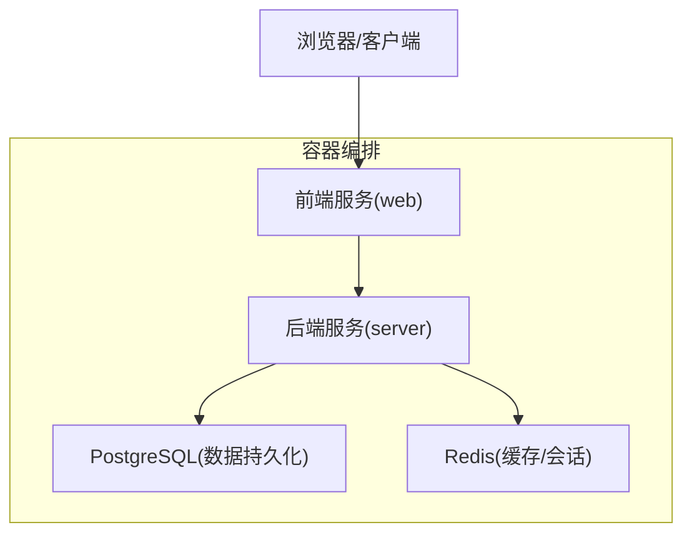
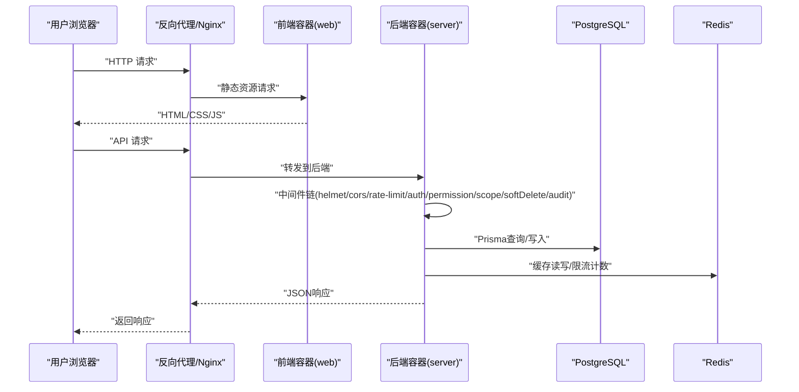

# 容器化部署

<cite>
**本文引用的文件**   
- [server/package.json](file://server/package.json)
- [server/src/app.ts](file://server/src/app.ts)
- [server/src/server.ts](file://server/src/server.ts)
- [server/src/config/env.ts](file://server/src/config/env.ts)
- [server/src/lib/logger.ts](file://server/src/lib/logger.ts)
- [server/prisma/schema.prisma](file://server/prisma/schema.prisma)
- [web/package.json](file://web/package.json)
- [web/vite.config.ts](file://web/vite.config.ts)
- [web/index.html](file://web/index.html)
</cite>

## 目录
1. [简介](#简介)
2. [项目结构](#项目结构)
3. [核心组件](#核心组件)
4. [架构总览](#架构总览)
5. [详细组件分析](#详细组件分析)
6. [依赖关系分析](#依赖关系分析)
7. [性能考量](#性能考量)
8. [故障排除指南](#故障排除指南)
9. [结论](#结论)
10. [附录](#附录)

## 简介
本文件面向FY200项目的容器化部署，覆盖Docker镜像构建（含多阶段优化与安全扫描）、Docker Compose编排（前后端、PostgreSQL、Redis）、Kubernetes资源定义（Deployment、Service、ConfigMap、Secret等）、健康检查、日志收集与持久化存储、资源限制、网络与服务发现，以及最佳实践与故障排除。项目为浙江壹品慧财年经营数据分析平台，后端采用Express + Prisma + PostgreSQL，前端为静态站点由Vite构建，中间件链包含安全、鉴权、限流、审计等。

## 项目结构
仓库包含前后端两个应用：
- server：Node.js/TypeScript后端，使用Express、Prisma ORM、PostgreSQL数据库，提供REST API与AI代理能力。
- web：React/Vite前端，构建后输出静态资源，通常由Nginx或反向代理提供服务。



[无图表来源：该图为概念性架构图]

**章节来源**
- [server/package.json](file://server/package.json)
- [web/package.json](file://web/package.json)

## 核心组件
- 后端服务：基于Express的API服务，集成JWT鉴权、权限控制、范围查询、软删除、审计、速率限制、CORS与Helmet安全头。
- 数据库：PostgreSQL 15，通过Prisma进行类型安全的ORM访问。
- 缓存：Redis用于会话、限流计数、热点数据缓存。
- 前端：Vite构建的SPA，生产环境以静态文件形式提供。

关键入口与配置：
- 后端入口：应用初始化与路由挂载、中间件链顺序。
- 环境变量：数据库连接、JWT密钥、第三方API密钥等。
- 前端构建：Vite配置与产物输出路径。

**章节来源**
- [server/src/app.ts](file://server/src/app.ts)
- [server/src/server.ts](file://server/src/server.ts)
- [server/src/config/env.ts](file://server/src/config/env.ts)
- [web/vite.config.ts](file://web/vite.config.ts)

## 架构总览
下图展示容器化后的服务交互与数据流向，包括请求处理链路、数据库与缓存访问、以及前端静态资源服务。



**图表来源**
- [server/src/app.ts](file://server/src/app.ts)
- [server/src/server.ts](file://server/src/server.ts)
- [server/src/config/env.ts](file://server/src/config/env.ts)

**章节来源**
- [server/src/app.ts](file://server/src/app.ts)
- [server/src/server.ts](file://server/src/server.ts)

## 详细组件分析

### Docker镜像构建（多阶段与优化）
- 后端镜像（Node.js/TypeScript）
  - 构建阶段：安装依赖、编译TypeScript、生成Prisma客户端。
  - 运行阶段：仅包含运行时依赖与编译产物，减小镜像体积。
  - 安全扫描：在CI中执行镜像漏洞扫描并阻断高危漏洞。
- 前端镜像（静态资源）
  - 构建阶段：安装依赖、构建Vite产物。
  - 运行阶段：使用轻量Nginx镜像托管静态文件。

建议要点：
- 使用多阶段构建，分离构建与运行环境。
- 利用.dockerignore排除无关文件。
- 固定基础镜像版本，避免漂移。
- 启用非root用户运行容器。
- 在CI中集成Trivy或Snyk进行镜像扫描。

[无章节来源：本节为通用构建指导，不直接分析具体文件]

### Docker Compose编排（前后端、PostgreSQL、Redis）
- 服务定义
  - backend：后端服务，暴露端口，挂载环境变量，依赖数据库与缓存。
  - frontend：前端服务，反向代理静态资源。
  - postgres：PostgreSQL数据库，持久化数据卷。
  - redis：Redis缓存，可选持久化。
- 网络与依赖
  - 自定义网络隔离服务间通信。
  - 使用depends_on确保启动顺序（配合健康检查）。
- 环境变量与配置
  - 数据库连接串、JWT密钥、第三方API密钥通过环境变量注入。
  - 敏感信息建议使用Compose secrets或外部密钥管理。

健康检查示例思路：
- 后端：HTTP探针探测根路径或专用健康接口。
- 数据库：pg_isready或TCP端口探测。
- Redis：redis-cli ping。

[无章节来源：本节为通用编排指导，不直接分析具体文件]

### Kubernetes部署（Deployment、Service、ConfigMap、Secret）
- Deployment
  - 后端：副本数、资源限制、探针、滚动更新策略。
  - 前端：静态资源服务副本与负载均衡。
- Service
  - ClusterIP暴露后端API，Ingress或LoadBalancer暴露前端。
- ConfigMap
  - 非敏感配置（如日志级别、功能开关）集中管理。
- Secret
  - 敏感信息（数据库密码、JWT密钥、第三方API密钥）加密存储。
- 存储卷
  - PostgreSQL数据持久化至PV/PVC。
  - 日志与指标可挂载共享卷或使用侧车采集。

探针与就绪：
- Liveness：检测进程存活。
- Readiness：检测依赖可用（数据库、缓存连通）。
- Startup：针对冷启动较长的场景设置宽松超时。

[无章节来源：本节为通用K8s部署指导，不直接分析具体文件]

### 健康检查、日志与存储
- 健康检查
  - 后端：实现健康端点，检查数据库连接、缓存连通、磁盘空间阈值。
  - 数据库：使用官方健康命令或探针。
  - 缓存：Ping命令或键值探测。
- 日志收集
  - 统一结构化日志（JSON），输出到stdout/stderr。
  - 容器化环境下由日志采集器（Fluent Bit/Vector）收集并转发至ELK/Loki。
- 存储卷挂载
  - 数据库数据目录持久化。
  - 上传文件与导出报表目录持久化。
  - 日志目录按天轮转，避免单文件过大。

[无章节来源：本节为通用运维指导，不直接分析具体文件]

### 资源限制、网络与服务发现
- 资源限制
  - CPU与内存requests/limits合理设置，避免过度分配。
  - 根据压测结果调整副本数与资源配额。
- 网络配置
  - 服务间通过内部DNS解析，避免硬编码IP。
  - 入站流量经Ingress控制器，出站流量通过egress规则限制。
- 服务发现
  - K8s Service提供稳定Endpoint集合。
  - 使用命名空间隔离不同环境（dev/staging/prod）。

[无章节来源：本节为通用网络与调度指导，不直接分析具体文件]

### 安全加固与最小权限
- 镜像安全
  - 定期扫描基础镜像与应用依赖漏洞。
  - 禁用不必要的包与系统工具。
- 运行时安全
  - 非root用户运行，只读根文件系统。
  - 限制capabilities，关闭不必要端口。
- 配置安全
  - 敏感信息通过Secret注入，禁止明文写在代码或镜像中。
  - 启用HTTPS与强密码策略。

[无章节来源：本节为通用安全指导，不直接分析具体文件]

## 依赖关系分析
后端依赖PostgreSQL与Redis，前端依赖后端API。Prisma负责数据库模型与迁移。环境变量驱动运行时行为。

```mermaid
graph LR
FE["前端(web)"] --> BE["后端(server)"]
BE --> DB["PostgreSQL"]
BE --> RC["Redis"]
BE --> ENV["环境变量/ConfigMap/Secret"]
```

**图表来源**
- [server/package.json](file://server/package.json)
- [web/package.json](file://web/package.json)
- [server/prisma/schema.prisma](file://server/prisma/schema.prisma)

**章节来源**
- [server/package.json](file://server/package.json)
- [web/package.json](file://web/package.json)
- [server/prisma/schema.prisma](file://server/prisma/schema.prisma)

## 性能考量
- 构建优化
  - 多阶段构建减少镜像体积。
  - 依赖层缓存加速CI构建。
- 运行时优化
  - 连接池：数据库连接池大小与并发匹配。
  - 缓存命中：热点数据优先从Redis读取。
  - 压缩与CDN：前端静态资源启用Gzip/Brotli与CDN缓存。
- 监控与调优
  - 指标采集（Prometheus）与告警（阈值）。
  - 慢查询分析与索引优化。

[无章节来源：本节为通用性能指导，不直接分析具体文件]

## 故障排除指南
常见问题与排查步骤：
- 后端无法启动
  - 检查环境变量是否完整（数据库连接串、JWT密钥）。
  - 查看容器日志定位错误堆栈。
  - 验证数据库与Redis连通性。
- 数据库连接失败
  - 确认PostgreSQL服务健康与端口可达。
  - 检查Prisma迁移是否成功执行。
  - 核对用户名、密码与权限。
- 前端无法访问API
  - 检查反向代理配置与CORS设置。
  - 确认后端健康端点正常。
  - 校验域名与证书配置。
- 性能问题
  - 观察CPU/内存使用率与GC情况。
  - 分析慢查询与锁竞争。
  - 检查缓存命中率与连接池利用率。

**章节来源**
- [server/src/config/env.ts](file://server/src/config/env.ts)
- [server/src/lib/logger.ts](file://server/src/lib/logger.ts)

## 结论
通过多阶段构建、安全扫描、合理的编排与Kubernetes资源定义，FY200项目可实现高可用、可扩展且安全的容器化部署。结合健康检查、日志收集、存储持久化与资源限制，能够保障生产环境的稳定性与可观测性。遵循最佳实践与故障排除指南，有助于快速定位与解决问题，提升交付质量与运维效率。

[无章节来源：本节为总结性内容，不直接分析具体文件]

## 附录
- 环境变量清单
  - DATABASE_URL：PostgreSQL连接串。
  - JWT_SECRET：JWT签名密钥。
  - REDIS_URL：Redis连接串。
  - LOG_LEVEL：日志级别。
  - AI_API_KEY：第三方AI服务密钥。
- 健康端点建议
  - /health：返回服务状态与依赖检查结果。
  - /ready：返回就绪状态（依赖可用）。
- 日志格式建议
  - JSON结构化字段：timestamp、level、message、trace_id、service、version。

[无章节来源：本节为补充信息，不直接分析具体文件]