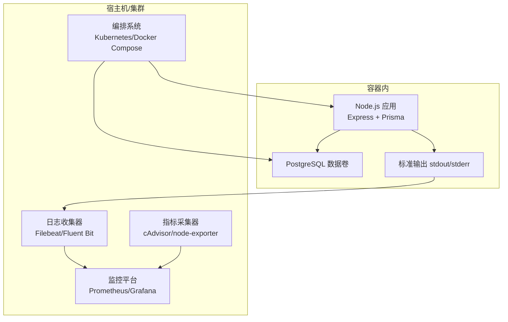
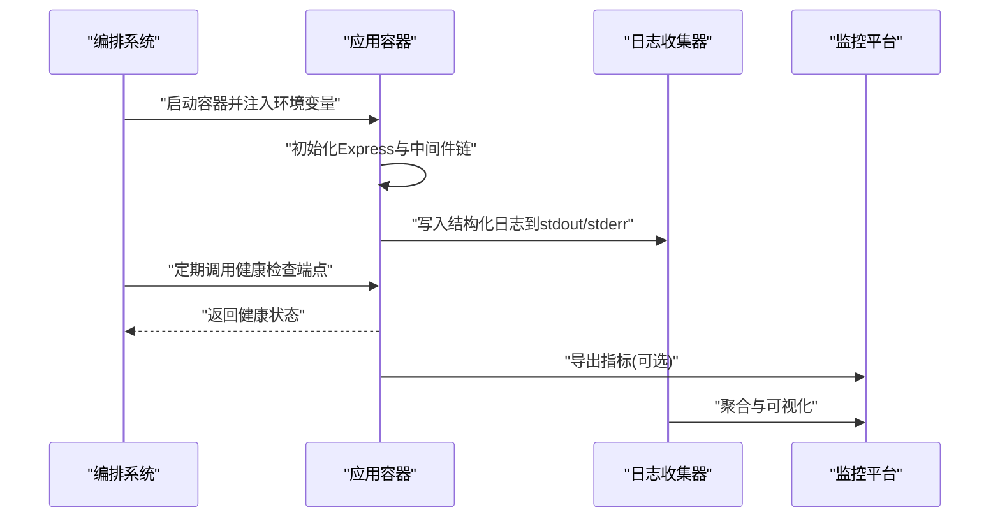
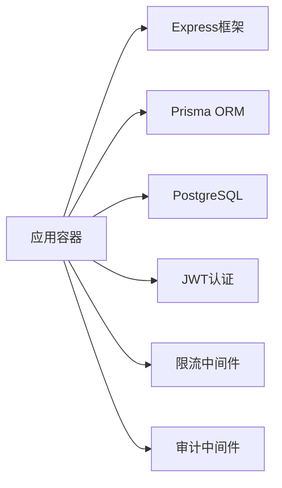

# 容器监控与运维

<cite>
**本文引用的文件**   
- [server/src/server.ts](file://server/src/server.ts)
- [server/src/app.ts](file://server/src/app.ts)
- [server/src/middleware/error-handler.ts](file://server/src/middleware/error-handler.ts)
- [server/src/lib/logger.ts](file://server/src/lib/logger.ts)
- [server/src/lib/errors.ts](file://server/src/lib/errors.ts)
- [server/src/config/env.ts](file://server/src/config/env.ts)
- [server/src/lib/prisma.ts](file://server/src/lib/prisma.ts)
- [server/package.json](file://server/package.json)
- [server/.pgdata/postgresql.conf](file://server/.pgdata/postgresql.conf)
- [docs/references/observability.md](file://docs/references/observability.md)
- [docs/references/performance.md](file://docs/references/performance.md)
</cite>

## 目录
1. [简介](#简介)
2. [项目结构](#项目结构)
3. [核心组件](#核心组件)
4. [架构总览](#架构总览)
5. [详细组件分析](#详细组件分析)
6. [依赖关系分析](#依赖关系分析)
7. [性能考量](#性能考量)
8. [故障排查指南](#故障排查指南)
9. [结论](#结论)
10. [附录](#附录)

## 简介
本文件面向FY200项目的容器化部署与运维，聚焦以下目标：
- 日志采集与集中化管理：统一stdout/stderr输出、结构化日志格式、可观测性对接。
- 性能监控指标：CPU、内存、磁盘I/O、网络使用率等关键指标的采集与告警。
- 健康检查与存活探针：服务可用性保障与自动恢复策略。
- 资源限制与配额管理：防止资源争用，确保多租户/多实例稳定运行。
- 故障自动恢复与滚动更新：零停机发布与自愈能力。
- 调试技巧与常见问题排查：快速定位问题并恢复业务。

## 项目结构
FY200后端为Express应用，基于Prisma访问PostgreSQL，提供REST API与AI代理能力。容器化运维需围绕应用进程、数据库进程以及中间件链路进行设计。

[无图表来源：该图为概念性架构图，不直接映射具体源码文件]

## 核心组件
- 应用入口与中间件链：Express应用初始化、安全与鉴权、限流、审计、软删除、权限控制等中间件顺序执行。
- 日志模块：结构化日志输出，便于日志收集与检索。
- 错误处理：统一异常捕获与响应格式化。
- 配置与环境变量：运行时参数、密钥与外部服务接入。
- 数据库连接：Prisma客户端与连接池配置。

章节来源
- [server/src/app.ts](file://server/src/app.ts)
- [server/src/middleware/error-handler.ts](file://server/src/middleware/error-handler.ts)
- [server/src/lib/logger.ts](file://server/src/lib/logger.ts)
- [server/src/config/env.ts](file://server/src/config/env.ts)
- [server/src/lib/prisma.ts](file://server/src/lib/prisma.ts)

## 架构总览
从容器视角看，应用进程通过标准输出打印结构化日志，由日志收集器抓取并转发至集中式存储；同时通过容器编排系统暴露健康检查端点，配合指标采集器上报资源使用情况。

[无图表来源：该图为概念性流程，不直接映射具体源码文件]

## 详细组件分析

### 日志采集与集中化管理
- 输出方式：应用将日志写入stdout/stderr，避免在容器内落盘，便于日志收集器统一采集。
- 结构化格式：建议采用JSON格式，包含时间戳、级别、请求ID、模块、消息体等字段，便于检索与分析。
- 采集策略：使用Filebeat或Fluent Bit监听容器日志路径，按服务名与实例标签分类，转发至Elasticsearch/ClickHouse等。
- 敏感信息脱敏：对金额、公司名等敏感字段进行脱敏后再输出，遵循项目脱敏规则。

章节来源
- [server/src/lib/logger.ts](file://server/src/lib/logger.ts)
- [server/src/middleware/error-handler.ts](file://server/src/middleware/error-handler.ts)

### 性能监控指标
- CPU与内存：通过cAdvisor或node-exporter采集容器级指标，设置阈值告警（如CPU使用率>80%持续5分钟）。
- 磁盘I/O：监控PostgreSQL数据卷的读写延迟与吞吐，避免I/O瓶颈。
- 网络使用率：统计入站/出站流量，识别异常峰值。
- 应用层指标：QPS、平均响应时延、错误率、数据库连接池使用率、慢查询数量。

章节来源
- [docs/references/performance.md](file://docs/references/performance.md)

### 健康检查与存活探针
- 就绪探针：检测应用是否完成初始化、数据库连接是否正常、依赖服务可用。
- 存活探针：周期性探测HTTP端点或进程心跳，失败则重启容器。
- 配置建议：初始延迟、周期、超时、失败阈值合理设置，避免误判。

章节来源
- [server/src/app.ts](file://server/src/app.ts)
- [server/src/server.ts](file://server/src/server.ts)

### 资源限制与配额管理
- CPU与内存限制：为每个容器设置requests与limits，防止单实例占用过多资源。
- 磁盘配额：限制PostgreSQL数据卷大小，避免无限增长。
- 网络带宽：限制出站带宽，防止对外部服务造成压力。
- 多实例隔离：通过命名空间与资源组实现租户隔离。

章节来源
- [server/package.json](file://server/package.json)
- [server/.pgdata/postgresql.conf](file://server/.pgdata/postgresql.conf)

### 故障自动恢复与滚动更新
- 自动恢复：结合存活探针与编排系统的重启策略，实现故障自愈。
- 滚动更新：逐步替换旧实例，确保服务连续性；配合就绪探针避免流量进入未就绪实例。
- 回滚策略：保留历史版本镜像，出现问题快速回滚。

章节来源
- [server/src/app.ts](file://server/src/app.ts)
- [server/src/server.ts](file://server/src/server.ts)

### 调试技巧与常见问题排查
- 日志定位：通过请求ID关联上下游日志，快速定位问题链路。
- 指标分析：查看CPU、内存、I/O、网络指标，识别瓶颈点。
- 数据库诊断：启用慢查询日志，分析锁等待与连接池耗尽。
- 常见错误：连接超时、权限不足、内存溢出、磁盘满等，提供对应处理步骤。

章节来源
- [server/src/lib/errors.ts](file://server/src/lib/errors.ts)
- [server/src/config/env.ts](file://server/src/config/env.ts)

## 依赖关系分析
应用依赖Express框架、Prisma ORM、PostgreSQL数据库，以及JWT认证、限流、审计等中间件。容器化后，这些依赖以独立容器或共享卷形式存在。

[无图表来源：该图为概念性依赖图，不直接映射具体源码文件]

## 性能考量
- 连接池优化：调整Prisma连接池大小，避免数据库连接耗尽。
- 缓存策略：对热点数据使用Redis缓存，降低数据库压力。
- 异步处理：长耗时任务放入队列，避免阻塞主线程。
- 监控告警：建立多维度告警规则，及时发现异常。

章节来源
- [docs/references/performance.md](file://docs/references/performance.md)

## 故障排查指南
- 日志收集：确认日志收集器正常运行，日志格式符合预期。
- 健康检查：检查探针配置是否正确，端点响应是否符合预期。
- 资源使用：查看容器资源使用曲线，识别异常峰值。
- 数据库连接：检查连接池状态、慢查询日志、锁等待情况。
- 网络问题：排查DNS解析、防火墙规则、负载均衡配置。

章节来源
- [server/src/middleware/error-handler.ts](file://server/src/middleware/error-handler.ts)
- [server/src/lib/logger.ts](file://server/src/lib/logger.ts)

## 结论
通过标准化的日志采集、全面的性能监控、合理的健康检查与资源限制，结合自动恢复与滚动更新策略，FY200项目可实现高可用、易维护的容器化部署。建议持续优化监控指标与告警规则，提升故障发现与处理能力。

## 附录
- 环境变量清单：列出所有必需的环境变量及其默认值。
- 健康检查端点定义：明确端点路径、响应格式与状态码。
- 监控指标字典：定义各指标含义、单位与采集频率。
- 故障处理手册：提供常见问题的处理步骤与联系方式。