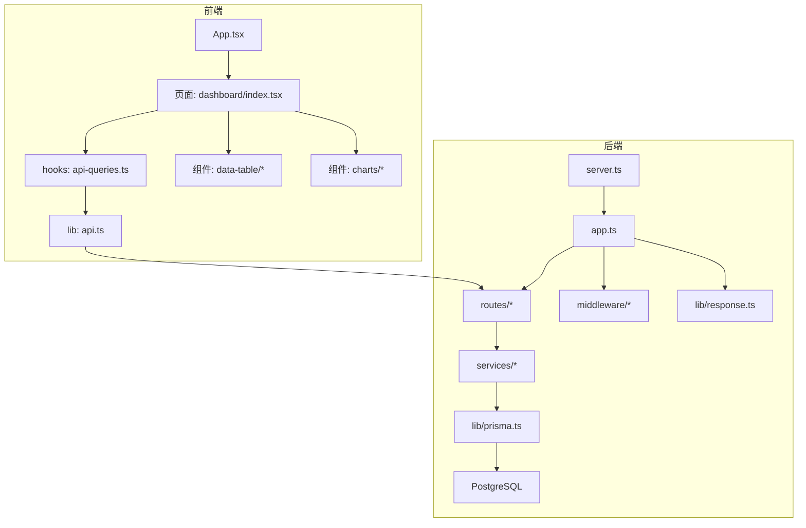
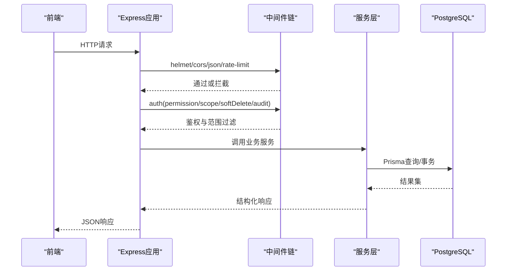
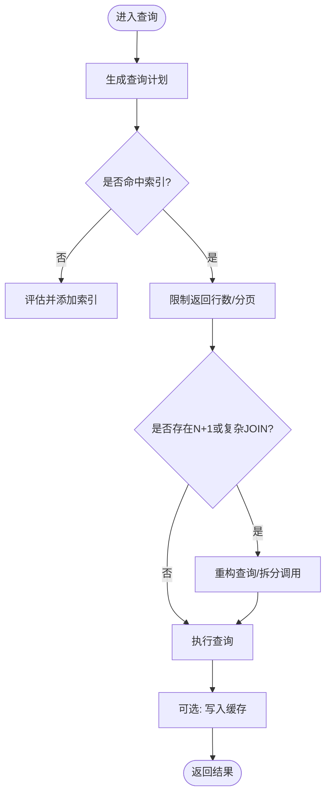
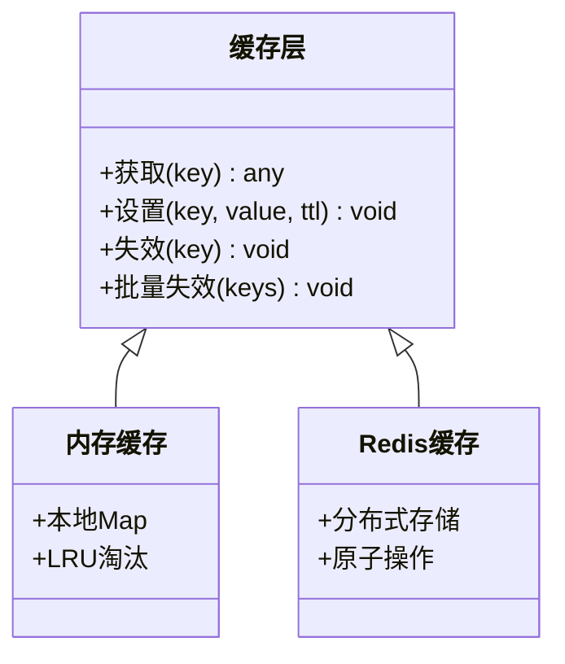
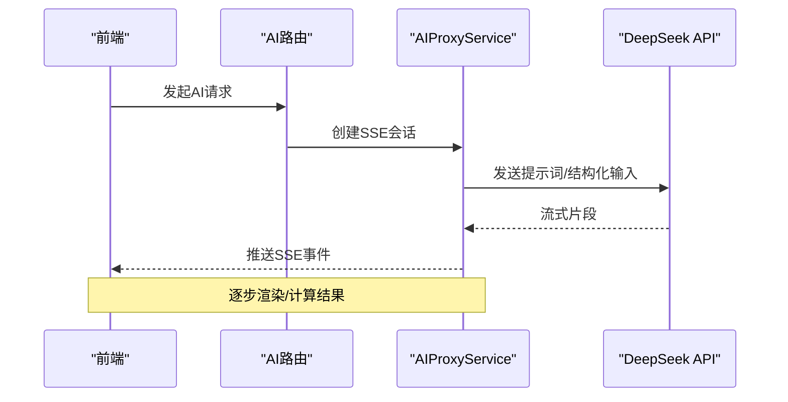
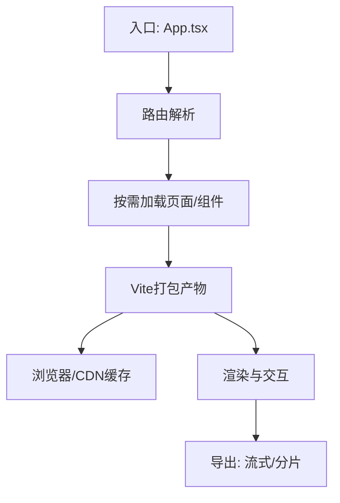
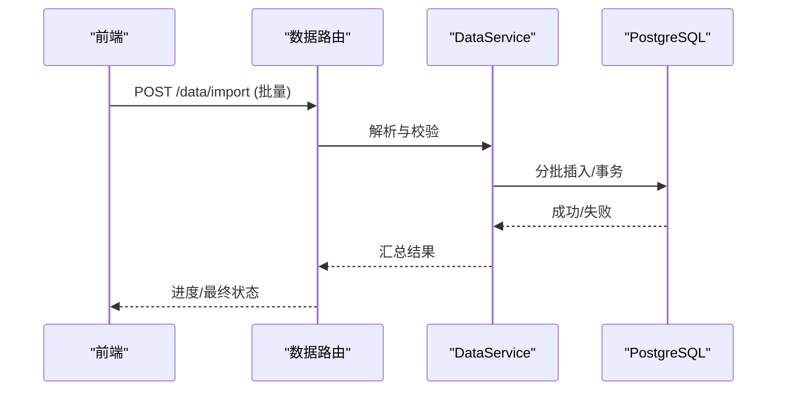
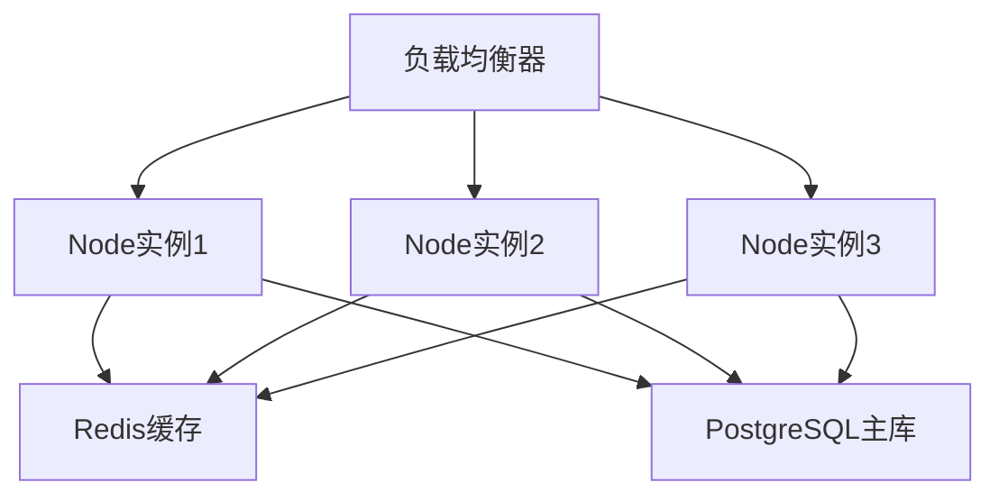
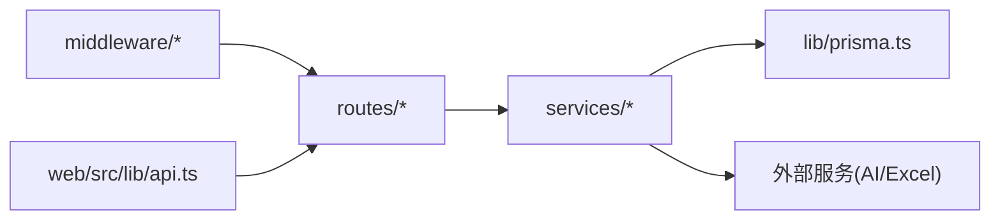

# 性能优化

<cite>
**本文引用的文件**   
- [server/src/app.ts](file://server/src/app.ts)
- [server/src/server.ts](file://server/src/server.ts)
- [server/src/config/env.ts](file://server/src/config/env.ts)
- [server/src/middleware/rate-limit.ts](file://server/src/middleware/rate-limit.ts)
- [server/src/middleware/auth.ts](file://server/src/middleware/auth.ts)
- [server/src/middleware/permission.ts](file://server/src/middleware/permission.ts)
- [server/src/middleware/scope.ts](file://server/src/middleware/scope.ts)
- [server/src/middleware/soft-delete.ts](file://server/src/middleware/soft-delete.ts)
- [server/src/middleware/audit.ts](file://server/src/middleware/audit.ts)
- [server/src/lib/prisma.ts](file://server/src/lib/prisma.ts)
- [server/src/lib/logger.ts](file://server/src/lib/logger.ts)
- [server/src/lib/response.ts](file://server/src/lib/response.ts)
- [server/src/lib/jwt.ts](file://server/src/lib/jwt.ts)
- [server/src/lib/formula.ts](file://server/src/lib/formula.ts)
- [server/src/lib/excel-import.ts](file://server/src/lib/excel-import.ts)
- [server/src/services/AggregationService.ts](file://server/src/services/AggregationService.ts)
- [server/src/services/DashboardService.ts](file://server/src/services/DashboardService.ts)
- [server/src/services/DataService.ts](file://server/src/services/DataService.ts)
- [server/src/routes/dashboard.ts](file://server/src/routes/dashboard.ts)
- [server/src/routes/data.ts](file://server/src/routes/data.ts)
- [server/src/routes/reports.ts](file://server/src/routes/reports.ts)
- [server/src/routes/admin.ts](file://server/src/routes/admin.ts)
- [server/src/routes/ai.ts](file://server/src/routes/ai.ts)
- [web/vite.config.ts](file://web/vite.config.ts)
- [web/src/App.tsx](file://web/src/App.tsx)
- [web/src/pages/dashboard/index.tsx](file://web/src/pages/dashboard/index.tsx)
- [web/src/hooks/api-queries.ts](file://web/src/hooks/api-queries.ts)
- [web/src/lib/api.ts](file://web/src/lib/api.ts)
- [web/src/components/data-table/pagination.tsx](file://web/src/components/data-table/pagination.tsx)
- [web/src/components/data-table/pro-data-table.tsx](file://web/src/components/data-table/pro-data-table.tsx)
- [web/src/components/data-table/pro-table-inner.tsx](file://web/src/components/data-table/pro-table-inner.tsx)
- [web/src/lib/export.ts](file://web/src/lib/export.ts)
- [web/src/lib/report-export.ts](file://web/src/lib/report-export.ts)
- [server/prisma/schema.prisma](file://server/prisma/schema.prisma)
- [server/scripts/local-db.ts](file://server/scripts/local-db.ts)
</cite>

## 目录
1. [简介](#简介)
2. [项目结构](#项目结构)
3. [核心组件](#核心组件)
4. [架构总览](#架构总览)
5. [详细组件分析](#详细组件分析)
6. [依赖关系分析](#依赖关系分析)
7. [性能考量](#性能考量)
8. [故障排查指南](#故障排查指南)
9. [结论](#结论)
10. [附录](#附录)

## 简介
本文件面向FY200项目的性能优化，覆盖后端数据库查询、缓存与异步处理，前端代码分割、懒加载与资源压缩，API接口分页、批量操作与响应压缩，负载均衡与水平扩展配置，以及性能监控与分析工具的使用。文档同时给出瓶颈定位方法与优化案例，帮助团队快速落地可衡量的性能改进。

## 项目结构
FY200采用前后端分离：
- 后端：Express 4 + Prisma 5 + PostgreSQL 15，中间件链包含安全、鉴权、权限、范围、软删除、审计等；服务层封装业务逻辑，路由层组织接口。
- 前端：React + Vite，按页面与功能模块拆分组件，提供数据表格、图表、导出等功能。

**图示来源** 
- [server/src/server.ts](file://server/src/server.ts)
- [server/src/app.ts](file://server/src/app.ts)
- [web/src/App.tsx](file://web/src/App.tsx)
- [web/src/pages/dashboard/index.tsx](file://web/src/pages/dashboard/index.tsx)
- [web/src/hooks/api-queries.ts](file://web/src/hooks/api-queries.ts)
- [web/src/lib/api.ts](file://web/src/lib/api.ts)

**章节来源**
- [server/src/server.ts](file://server/src/server.ts)
- [server/src/app.ts](file://server/src/app.ts)
- [web/src/App.tsx](file://web/src/App.tsx)

## 核心组件
- 应用启动与中间件链：Express应用初始化、全局中间件顺序与安全策略。
- 鉴权与权限：JWT校验、黑名单、默认拒绝的权限模型与范围控制（Prisma扩展）。
- 数据访问：Prisma连接池、查询构建、事务与并发控制。
- 业务服务：聚合计算、看板数据、数据导入导出、报表生成。
- 前端请求与渲染：Vite打包、按需加载、表格分页与导出。

**章节来源**
- [server/src/app.ts](file://server/src/app.ts)
- [server/src/middleware/auth.ts](file://server/src/middleware/auth.ts)
- [server/src/middleware/permission.ts](file://server/src/middleware/permission.ts)
- [server/src/middleware/scope.ts](file://server/src/middleware/scope.ts)
- [server/src/lib/prisma.ts](file://server/src/lib/prisma.ts)
- [server/src/services/AggregationService.ts](file://server/src/services/AggregationService.ts)
- [server/src/services/DashboardService.ts](file://server/src/services/DashboardService.ts)
- [server/src/services/DataService.ts](file://server/src/services/DataService.ts)
- [web/src/hooks/api-queries.ts](file://web/src/hooks/api-queries.ts)
- [web/src/lib/api.ts](file://web/src/lib/api.ts)

## 架构总览
后端中间件执行链顺序为：helmet → cors → express.json → rate-limit → auth(JWT+黑名单) → permission(默认拒绝) → scope(Prisma extension) → softDelete → audit → Service → Prisma → PostgreSQL。该顺序确保安全性、限流、鉴权、权限、数据范围与审计在业务逻辑之前生效。

**图示来源** 
- [server/src/app.ts](file://server/src/app.ts)
- [server/src/middleware/rate-limit.ts](file://server/src/middleware/rate-limit.ts)
- [server/src/middleware/auth.ts](file://server/src/middleware/auth.ts)
- [server/src/middleware/permission.ts](file://server/src/middleware/permission.ts)
- [server/src/middleware/scope.ts](file://server/src/middleware/scope.ts)
- [server/src/middleware/soft-delete.ts](file://server/src/middleware/soft-delete.ts)
- [server/src/middleware/audit.ts](file://server/src/middleware/audit.ts)
- [server/src/lib/prisma.ts](file://server/src/lib/prisma.ts)

## 详细组件分析

### 后端数据库查询优化
- 连接池与并发：合理设置Prisma连接池大小，避免过多连接导致PostgreSQL压力过大；在高并发场景下结合连接复用与超时配置。
- 索引与查询计划：针对高频过滤条件建立复合索引，使用EXPLAIN ANALYZE验证查询计划，避免全表扫描与不必要的排序。
- 分页与游标：列表接口优先使用分页参数（limit/offset）或基于主键的游标分页，减少大偏移量带来的性能退化。
- 只读与写分离：对读多写少的看板与报表接口启用只读副本或缓存层，降低主库压力。
- 事务边界：将短事务用于一致性要求高的写入，长事务拆分为多个小事务，避免锁竞争。

**图示来源** 
- [server/src/lib/prisma.ts](file://server/src/lib/prisma.ts)
- [server/src/services/AggregationService.ts](file://server/src/services/AggregationService.ts)
- [server/src/services/DashboardService.ts](file://server/src/services/DashboardService.ts)
- [server/src/services/DataService.ts](file://server/src/services/DataService.ts)

**章节来源**
- [server/src/lib/prisma.ts](file://server/src/lib/prisma.ts)
- [server/src/services/AggregationService.ts](file://server/src/services/AggregationService.ts)
- [server/src/services/DashboardService.ts](file://server/src/services/DashboardService.ts)
- [server/src/services/DataService.ts](file://server/src/services/DataService.ts)

### 缓存策略
- 多级缓存：浏览器缓存（ETag/Last-Modified）、CDN静态资源缓存、服务端内存缓存（热点数据）、Redis分布式缓存（跨实例共享）。
- 缓存粒度：按接口维度缓存聚合结果，避免细粒度碎片化；对频繁读取但更新不频繁的看板指标设置TTL。
- 失效策略：基于版本号或时间戳失效，配合发布事件主动清理；对增量更新采用局部失效。
- 缓存穿透与雪崩：空值缓存、随机过期抖动、热点Key保护与降级回源。

**图示来源** 
- [server/src/lib/response.ts](file://server/src/lib/response.ts)
- [server/src/services/DashboardService.ts](file://server/src/services/DashboardService.ts)

**章节来源**
- [server/src/lib/response.ts](file://server/src/lib/response.ts)
- [server/src/services/DashboardService.ts](file://server/src/services/DashboardService.ts)

### 异步处理
- SSE流式AI：AI管道采用Server-Sent Events进行文本与结构化数据的流式输出，提升交互体验与首屏反馈。
- 任务队列：对耗时操作（Excel导入、报表生成、指标重算）采用后台任务队列，避免阻塞HTTP请求。
- 并发控制：对第三方API调用与外部I/O进行限流与重试，防止下游过载。

**图示来源** 
- [server/src/routes/ai.ts](file://server/src/routes/ai.ts)
- [server/src/services/AIProxyService.ts](file://server/src/services/AIProxyService.ts)

**章节来源**
- [server/src/routes/ai.ts](file://server/src/routes/ai.ts)
- [server/src/services/AIProxyService.ts](file://server/src/services/AIProxyService.ts)

### 前端性能优化
- 代码分割与懒加载：按路由与功能模块拆分bundle，使用动态import实现按需加载，减少首屏体积。
- 资源压缩：启用Gzip/Brotli压缩，图片与字体使用现代格式与尺寸适配，静态资源开启长期缓存。
- 列表与表格：虚拟滚动、分页加载、去抖搜索、合并请求，避免一次性渲染大数据集。
- 导出优化：服务端流式导出，前端分片下载与进度展示，避免大对象序列化阻塞。

**图示来源** 
- [web/src/App.tsx](file://web/src/App.tsx)
- [web/vite.config.ts](file://web/vite.config.ts)
- [web/src/components/data-table/pagination.tsx](file://web/src/components/data-table/pagination.tsx)
- [web/src/lib/export.ts](file://web/src/lib/export.ts)
- [web/src/lib/report-export.ts](file://web/src/lib/report-export.ts)

**章节来源**
- [web/src/App.tsx](file://web/src/App.tsx)
- [web/vite.config.ts](file://web/vite.config.ts)
- [web/src/components/data-table/pagination.tsx](file://web/src/components/data-table/pagination.tsx)
- [web/src/lib/export.ts](file://web/src/lib/export.ts)
- [web/src/lib/report-export.ts](file://web/src/lib/report-export.ts)

### API接口优化
- 分页查询：统一分页参数与返回结构，支持页码、每页大小、排序字段与方向。
- 批量操作：合并多次写入为一次事务，减少往返与锁竞争；对大批量导入采用流式处理与分批提交。
- 响应压缩：启用gzip/brotli压缩，减少传输体积；对大对象进行字段裁剪与延迟加载。
- 幂等与重试：对外部依赖调用实现幂等键与指数退避重试，保障稳定性。

**图示来源** 
- [server/src/routes/data.ts](file://server/src/routes/data.ts)
- [server/src/services/DataService.ts](file://server/src/services/DataService.ts)
- [server/src/lib/excel-import.ts](file://server/src/lib/excel-import.ts)

**章节来源**
- [server/src/routes/data.ts](file://server/src/routes/data.ts)
- [server/src/services/DataService.ts](file://server/src/services/DataService.ts)
- [server/src/lib/excel-import.ts](file://server/src/lib/excel-import.ts)

### 负载均衡与水平扩展
- 进程级扩展：Node.js多进程部署（PM2集群模式），利用CPU核数提升吞吐。
- 反向代理：Nginx/云负载均衡器进行健康检查、会话保持与流量分发。
- 无状态设计：会话与状态外置（Redis），保证任意节点可处理请求。
- 数据库扩展：读写分离、连接池上限与慢查询告警，避免单点瓶颈。

[此图为概念性架构图，无需图示来源]

### 性能监控与分析
- APM与日志：集成APM工具采集请求时延、错误率与依赖调用链路；结构化日志记录关键路径。
- 指标与告警：暴露系统指标（QPS、P95/P99、GC、线程池），设置阈值告警。
- 剖析工具：使用Node.js内置profiler与火焰图定位CPU热点；数据库慢查询日志与EXPLAIN分析。
- 前端性能：Lighthouse与Performance面板分析首屏、交互延迟与资源加载。

**章节来源**
- [server/src/lib/logger.ts](file://server/src/lib/logger.ts)
- [server/src/lib/response.ts](file://server/src/lib/response.ts)

## 依赖关系分析
后端各模块之间的依赖关系如下：
- 路由层依赖服务层，服务层依赖Prisma与外部服务（如AI）。
- 中间件贯穿请求生命周期，影响鉴权、限流、审计等行为。
- 前端通过api.ts统一发起请求，hooks封装数据获取与状态管理。

**图示来源** 
- [server/src/routes/dashboard.ts](file://server/src/routes/dashboard.ts)
- [server/src/routes/data.ts](file://server/src/routes/data.ts)
- [server/src/routes/reports.ts](file://server/src/routes/reports.ts)
- [server/src/routes/admin.ts](file://server/src/routes/admin.ts)
- [server/src/services/AggregationService.ts](file://server/src/services/AggregationService.ts)
- [server/src/services/DashboardService.ts](file://server/src/services/DashboardService.ts)
- [server/src/services/DataService.ts](file://server/src/services/DataService.ts)
- [server/src/lib/prisma.ts](file://server/src/lib/prisma.ts)
- [web/src/lib/api.ts](file://web/src/lib/api.ts)

**章节来源**
- [server/src/routes/dashboard.ts](file://server/src/routes/dashboard.ts)
- [server/src/routes/data.ts](file://server/src/routes/data.ts)
- [server/src/routes/reports.ts](file://server/src/routes/reports.ts)
- [server/src/routes/admin.ts](file://server/src/routes/admin.ts)
- [server/src/services/AggregationService.ts](file://server/src/services/AggregationService.ts)
- [server/src/services/DashboardService.ts](file://server/src/services/DashboardService.ts)
- [server/src/services/DataService.ts](file://server/src/services/DataService.ts)
- [server/src/lib/prisma.ts](file://server/src/lib/prisma.ts)
- [web/src/lib/api.ts](file://web/src/lib/api.ts)

## 性能考量
- 数据库层面：索引优化、查询计划分析、连接池调优、事务拆分与只读副本。
- 缓存层面：多级缓存、TTL与失效策略、热点Key保护与降级。
- 异步与并发：SSE流式、任务队列、限流与重试、背压控制。
- 前端层面：代码分割、懒加载、资源压缩、虚拟滚动与分页。
- 部署层面：多进程扩展、负载均衡、无状态设计与弹性伸缩。
- 监控层面：APM、日志、指标与告警、剖析工具与慢查询分析。

[本节为通用指导，无需章节来源]

## 故障排查指南
- 常见瓶颈：数据库慢查询、连接池耗尽、缓存未命中、前端大对象渲染、第三方API超时。
- 定位方法：查看APM链路、数据库慢查询日志、Node.js CPU/内存快照、前端网络与渲染面板。
- 修复建议：补充索引、调整分页与查询、增加缓存命中率、拆分请求与懒加载、引入重试与熔断。

**章节来源**
- [server/src/lib/logger.ts](file://server/src/lib/logger.ts)
- [server/src/lib/response.ts](file://server/src/lib/response.ts)

## 结论
通过数据库查询优化、多级缓存与异步处理、前端代码分割与懒加载、API分页与批量操作、负载均衡与水平扩展，以及完善的监控与分析体系，FY200项目可在高并发与大数据量场景下保持稳定与高效。建议持续跟踪指标、定期复盘与迭代优化，形成闭环的性能治理机制。

[本节为总结，无需章节来源]

## 附录
- 公式与计算：计算类指标使用安全公式解析（白名单算子），同比/环比由后端实时计算不存库。
- AI双管道：polish（文本→脱敏→LLM→还原）/ analyze（结构化→计算→脱敏→LLM→生成），脱敏规则：绝对金额→区间，公司名→动态映射。
- 环境配置：参考环境变量与本地数据库脚本，确保开发与生产一致。

**章节来源**
- [server/src/lib/formula.ts](file://server/src/lib/formula.ts)
- [server/src/routes/ai.ts](file://server/src/routes/ai.ts)
- [server/src/config/env.ts](file://server/src/config/env.ts)
- [server/scripts/local-db.ts](file://server/scripts/local-db.ts)