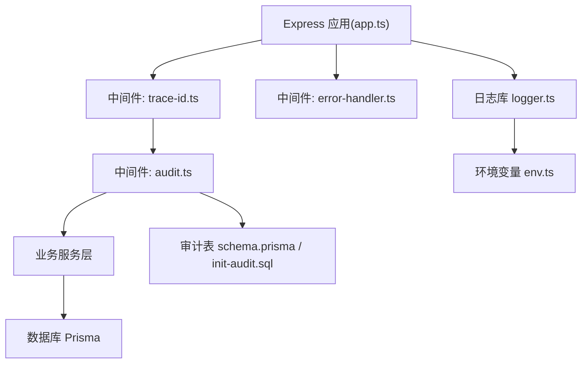
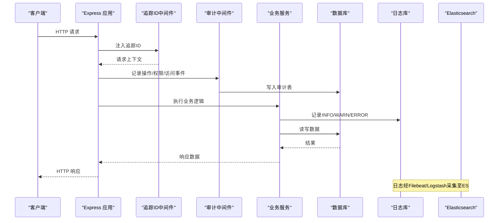
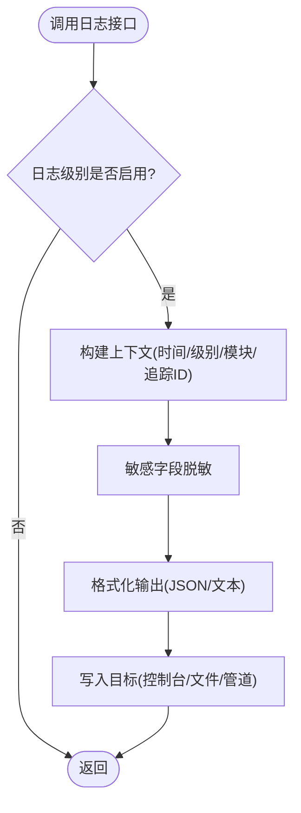
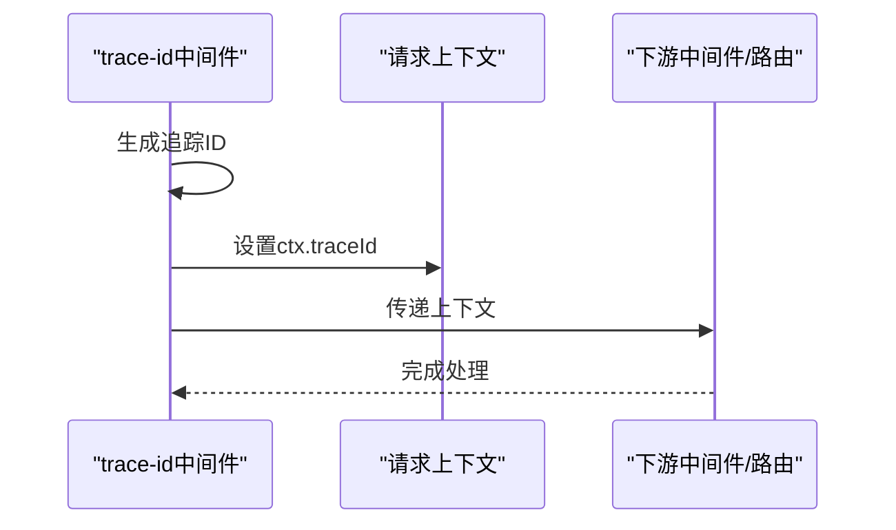
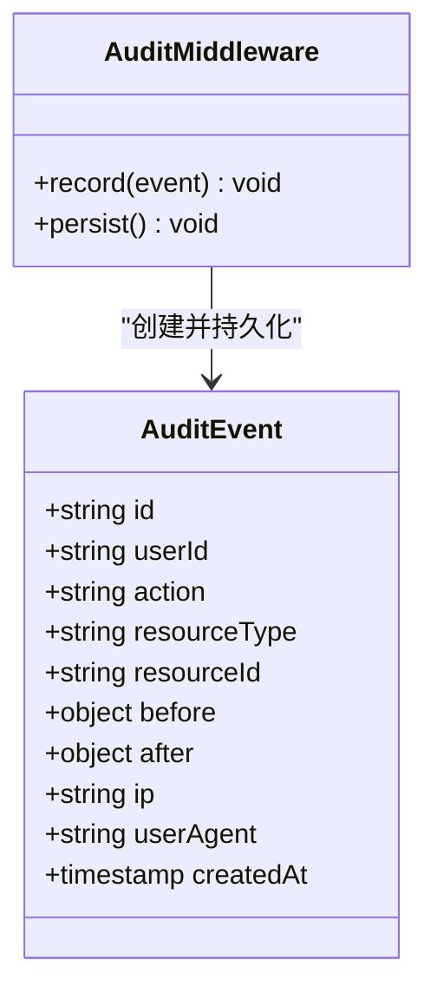
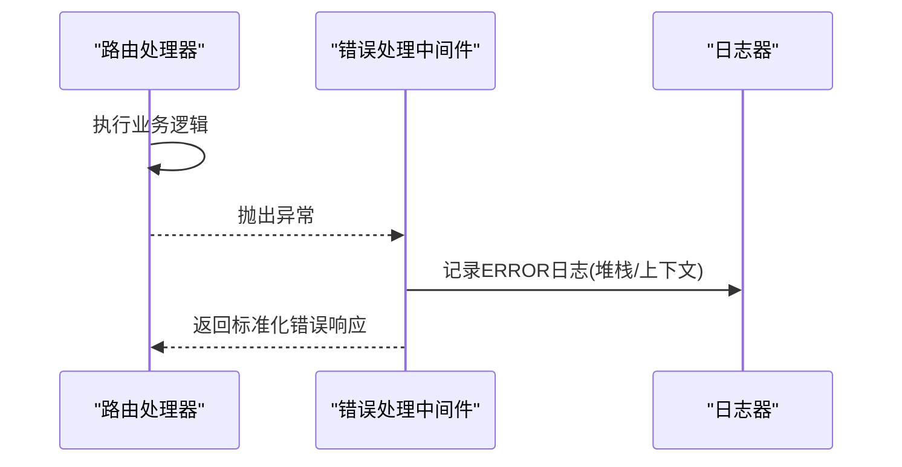
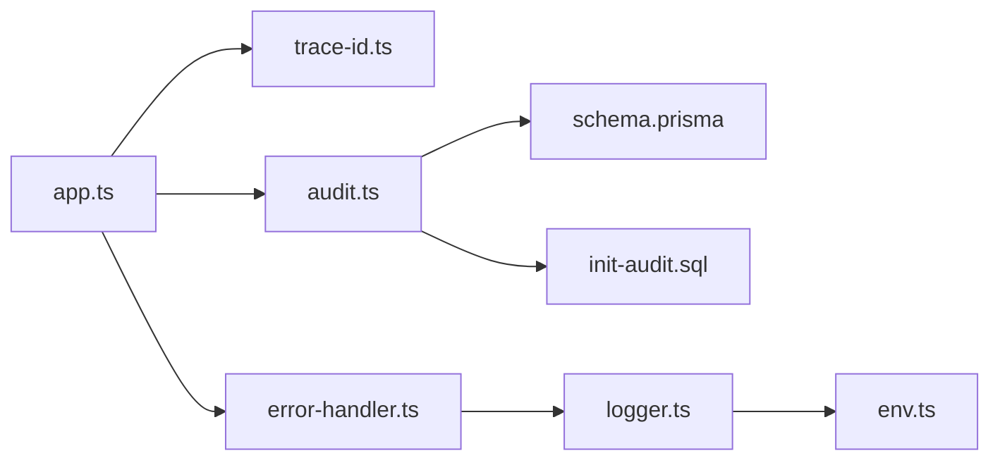

# 日志管理

<cite>
**本文引用的文件**   
- [logger.ts](file://server/src/lib/logger.ts)
- [trace-id.ts](file://server/src/middleware/trace-id.ts)
- [audit.ts](file://server/src/middleware/audit.ts)
- [error-handler.ts](file://server/src/middleware/error-handler.ts)
- [env.ts](file://server/src/config/env.ts)
- [app.ts](file://server/src/app.ts)
- [schema.prisma](file://server/prisma/schema.prisma)
- [init-audit.sql](file://server/prisma/init-audit.sql)
- [observability.md](file://docs/references/observability.md)
</cite>

## 目录
1. [简介](#简介)
2. [项目结构](#项目结构)
3. [核心组件](#核心组件)
4. [架构总览](#架构总览)
5. [详细组件分析](#详细组件分析)
6. [依赖分析](#依赖分析)
7. [性能考虑](#性能考虑)
8. [故障排查指南](#故障排查指南)
9. [结论](#结论)
10. [附录](#附录)

## 简介
本文件为 FY200 项目的日志管理文档，覆盖日志级别配置与使用规范、结构化日志格式设计（统一字段、上下文信息、追踪ID）、审计日志实现（用户操作记录、权限变更、数据访问审计）、日志收集架构（Filebeat、Logstash、Elasticsearch）集成方案，以及日志轮转、压缩与归档策略。同时提供日志分析与故障排查工具使用方法，帮助开发与运维团队高效定位问题并保障系统可观测性。

## 项目结构
后端 Express 应用通过中间件链对请求进行统一处理，其中日志与审计贯穿全链路：
- 结构化日志封装位于 lib/logger.ts
- 追踪ID注入位于 middleware/trace-id.ts
- 审计日志写入位于 middleware/audit.ts
- 错误处理与异常日志位于 middleware/error-handler.ts
- 环境变量与日志级别控制位于 config/env.ts
- 应用初始化与中间件注册位于 app.ts
- 审计表结构与初始化脚本位于 prisma/schema.prisma 与 prisma/init-audit.sql
- 可观测性参考文档位于 docs/references/observability.md

**图表来源** 
- [app.ts](file://server/src/app.ts)
- [trace-id.ts](file://server/src/middleware/trace-id.ts)
- [audit.ts](file://server/src/middleware/audit.ts)
- [error-handler.ts](file://server/src/middleware/error-handler.ts)
- [logger.ts](file://server/src/lib/logger.ts)
- [env.ts](file://server/src/config/env.ts)
- [schema.prisma](file://server/prisma/schema.prisma)
- [init-audit.sql](file://server/prisma/init-audit.sql)

**章节来源**
- [app.ts](file://server/src/app.ts)
- [logger.ts](file://server/src/lib/logger.ts)
- [trace-id.ts](file://server/src/middleware/trace-id.ts)
- [audit.ts](file://server/src/middleware/audit.ts)
- [error-handler.ts](file://server/src/middleware/error-handler.ts)
- [env.ts](file://server/src/config/env.ts)
- [schema.prisma](file://server/prisma/schema.prisma)
- [init-audit.sql](file://server/prisma/init-audit.sql)

## 核心组件
- 结构化日志器(logger.ts)
  - 提供统一的日志接口，支持 INFO、WARN、ERROR 等级别
  - 自动附加时间戳、级别、模块、消息及扩展字段
  - 支持敏感信息脱敏与输出格式化
- 追踪ID注入(trace-id.ts)
  - 为每个请求生成唯一追踪ID，贯穿中间件与服务调用
  - 便于跨服务关联日志与链路追踪
- 审计日志(audit.ts)
  - 记录用户操作、权限变更、数据访问等关键事件
  - 将审计事件持久化到审计表，支持后续检索与分析
- 错误处理(error-handler.ts)
  - 捕获未处理异常，记录错误堆栈与上下文
  - 返回标准化错误响应，避免泄露敏感信息
- 环境配置(env.ts)
  - 定义日志级别、输出目标、采样率等开关
  - 支持按环境区分开发/测试/生产行为

**章节来源**
- [logger.ts](file://server/src/lib/logger.ts)
- [trace-id.ts](file://server/src/middleware/trace-id.ts)
- [audit.ts](file://server/src/middleware/audit.ts)
- [error-handler.ts](file://server/src/middleware/error-handler.ts)
- [env.ts](file://server/src/config/env.ts)

## 架构总览
FY200 的日志架构以“结构化日志 + 审计表”为核心，结合中间件链实现全链路可观测性。生产环境中建议引入 Filebeat 采集 Node.js 进程标准输出或文件日志，经 Logstash 清洗与路由后写入 Elasticsearch，供 Kibana 可视化查询。

**图表来源** 
- [app.ts](file://server/src/app.ts)
- [trace-id.ts](file://server/src/middleware/trace-id.ts)
- [audit.ts](file://server/src/middleware/audit.ts)
- [logger.ts](file://server/src/lib/logger.ts)
- [schema.prisma](file://server/prisma/schema.prisma)

## 详细组件分析

### 结构化日志器(logger.ts)
- 功能要点
  - 统一日志接口，支持多级别输出
  - 自动附加时间戳、级别、模块名、消息体
  - 支持扩展字段（如用户ID、租户ID、请求路径）
  - 敏感字段脱敏（金额区间化、公司名映射）
- 使用规范
  - INFO：业务流程关键点、参数校验结果、外部调用摘要
  - WARN：可恢复异常、降级策略触发、性能阈值告警
  - ERROR：不可恢复错误、外部依赖失败、数据一致性异常
- 复杂度与性能
  - 对象序列化开销可控，建议避免在高频路径中构造大对象
  - 异步写入与缓冲策略可减少同步阻塞

**图表来源** 
- [logger.ts](file://server/src/lib/logger.ts)

**章节来源**
- [logger.ts](file://server/src/lib/logger.ts)

### 追踪ID注入(trace-id.ts)
- 功能要点
  - 为每个请求生成唯一追踪ID
  - 注入到请求上下文，贯穿中间件与服务调用
  - 便于跨模块关联日志与链路追踪
- 使用规范
  - 所有中间件与服务应读取并透传追踪ID
  - 日志输出必须包含追踪ID字段

**图表来源** 
- [trace-id.ts](file://server/src/middleware/trace-id.ts)

**章节来源**
- [trace-id.ts](file://server/src/middleware/trace-id.ts)

### 审计日志(audit.ts)
- 功能要点
  - 记录用户操作（增删改查）、权限变更、数据访问
  - 将审计事件持久化到审计表，支持检索与分析
  - 与追踪ID关联，便于问题回溯
- 数据结构
  - 用户标识、操作类型、资源标识、变更前后值、IP地址、UA、时间戳
  - 审计表结构由 schema.prisma 与 init-audit.sql 定义
- 使用规范
  - 关键业务操作必须记录审计日志
  - 敏感字段需脱敏后再写入

**图表来源** 
- [audit.ts](file://server/src/middleware/audit.ts)
- [schema.prisma](file://server/prisma/schema.prisma)
- [init-audit.sql](file://server/prisma/init-audit.sql)

**章节来源**
- [audit.ts](file://server/src/middleware/audit.ts)
- [schema.prisma](file://server/prisma/schema.prisma)
- [init-audit.sql](file://server/prisma/init-audit.sql)

### 错误处理(error-handler.ts)
- 功能要点
  - 捕获未处理异常，记录错误堆栈与上下文
  - 返回标准化错误响应，避免泄露敏感信息
  - 与日志器协作，输出ERROR级别日志
- 使用规范
  - 所有路由与服务应包裹错误处理中间件
  - 自定义错误类型应包含错误码与消息

**图表来源** 
- [error-handler.ts](file://server/src/middleware/error-handler.ts)
- [logger.ts](file://server/src/lib/logger.ts)

**章节来源**
- [error-handler.ts](file://server/src/middleware/error-handler.ts)
- [logger.ts](file://server/src/lib/logger.ts)

### 环境配置(env.ts)
- 功能要点
  - 定义日志级别、输出目标、采样率等开关
  - 支持按环境区分开发/测试/生产行为
- 使用规范
  - 生产环境建议开启结构化JSON输出
  - 敏感信息禁止输出到控制台

**章节来源**
- [env.ts](file://server/src/config/env.ts)

## 依赖分析
FY200 的日志与审计依赖关系如下：
- app.ts 注册中间件链，依赖 trace-id、audit、error-handler
- audit.ts 依赖 Prisma 与审计表结构
- logger.ts 依赖 env.ts 获取配置
- error-handler.ts 依赖 logger.ts 输出错误日志

**图表来源** 
- [app.ts](file://server/src/app.ts)
- [trace-id.ts](file://server/src/middleware/trace-id.ts)
- [audit.ts](file://server/src/middleware/audit.ts)
- [error-handler.ts](file://server/src/middleware/error-handler.ts)
- [logger.ts](file://server/src/lib/logger.ts)
- [env.ts](file://server/src/config/env.ts)
- [schema.prisma](file://server/prisma/schema.prisma)
- [init-audit.sql](file://server/prisma/init-audit.sql)

**章节来源**
- [app.ts](file://server/src/app.ts)
- [logger.ts](file://server/src/lib/logger.ts)
- [trace-id.ts](file://server/src/middleware/trace-id.ts)
- [audit.ts](file://server/src/middleware/audit.ts)
- [error-handler.ts](file://server/src/middleware/error-handler.ts)
- [env.ts](file://server/src/config/env.ts)
- [schema.prisma](file://server/prisma/schema.prisma)
- [init-audit.sql](file://server/prisma/init-audit.sql)

## 性能考虑
- 日志级别控制：生产环境默认仅输出 WARN/ERROR，减少IO开销
- 异步写入：日志写入采用异步队列，避免阻塞主线程
- 采样策略：高频INFO日志可按比例采样，降低存储压力
- 脱敏成本：敏感字段脱敏应在必要路径执行，避免热点路径重复计算
- 审计写入：批量写入与事务控制，确保一致性与性能平衡

[本节为通用指导，不直接分析具体文件]

## 故障排查指南
- 快速定位问题
  - 使用追踪ID在日志系统中过滤相关请求
  - 检查ERROR级别日志中的堆栈与上下文信息
  - 查看审计日志确认用户操作与权限变更
- 常用查询示例
  - 按追踪ID检索：trace_id = "xxx"
  - 按用户ID检索：user_id = "xxx" AND level = "ERROR"
  - 按资源类型检索：resource_type = "report" AND action = "update"
- 工具推荐
  - Kibana：可视化查询与仪表盘
  - Logstash：日志清洗与路由规则
  - Filebeat：轻量级日志采集器

**章节来源**
- [observability.md](file://docs/references/observability.md)

## 结论
FY200 的日志管理体系以结构化日志与审计表为核心，结合中间件链实现全链路可观测性。通过统一的日志格式、追踪ID与审计记录，开发与运维团队能够高效定位问题、分析用户行为与系统性能。在生产环境中，建议完善日志采集与存储架构，提升系统的可维护性与可靠性。

[本节为总结性内容，不直接分析具体文件]

## 附录

### 日志级别配置与使用规范
- INFO：业务流程关键点、参数校验结果、外部调用摘要
- WARN：可恢复异常、降级策略触发、性能阈值告警
- ERROR：不可恢复错误、外部依赖失败、数据一致性异常
- 配置项：日志级别、输出目标、采样率、脱敏开关

**章节来源**
- [env.ts](file://server/src/config/env.ts)
- [logger.ts](file://server/src/lib/logger.ts)

### 结构化日志格式设计
- 统一字段：时间戳、级别、模块、消息、追踪ID、用户ID、租户ID
- 上下文信息：请求路径、方法、状态码、耗时、IP地址、UA
- 追踪ID：全局唯一，贯穿中间件与服务调用

**章节来源**
- [logger.ts](file://server/src/lib/logger.ts)
- [trace-id.ts](file://server/src/middleware/trace-id.ts)

### 审计日志实现
- 用户操作记录：登录、登出、数据增删改查
- 权限变更：角色分配、权限授予/撤销
- 数据访问审计：敏感数据访问、批量导出、报表生成

**章节来源**
- [audit.ts](file://server/src/middleware/audit.ts)
- [schema.prisma](file://server/prisma/schema.prisma)
- [init-audit.sql](file://server/prisma/init-audit.sql)

### 日志收集架构集成
- Filebeat：采集Node.js进程标准输出或文件日志
- Logstash：清洗、解析、路由日志到不同索引
- Elasticsearch：存储与索引日志数据
- Kibana：可视化查询与仪表盘

**章节来源**
- [observability.md](file://docs/references/observability.md)

### 日志轮转、压缩与归档策略
- 轮转策略：按大小或时间轮转，保留最近N天日志
- 压缩策略：Gzip压缩历史日志，节省存储空间
- 归档策略：冷数据迁移到对象存储，长期保留

[本节为通用指导，不直接分析具体文件]

### 日志分析与故障排查工具
- Kibana：可视化查询、仪表盘、告警规则
- Logstash：日志清洗、字段提取、路由规则
- Filebeat：轻量采集、多输入源、输出到多种目标

**章节来源**
- [observability.md](file://docs/references/observability.md)