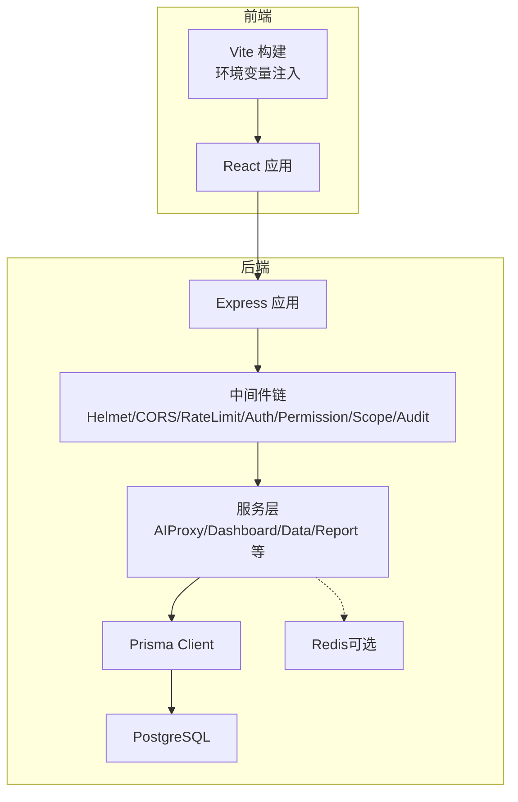
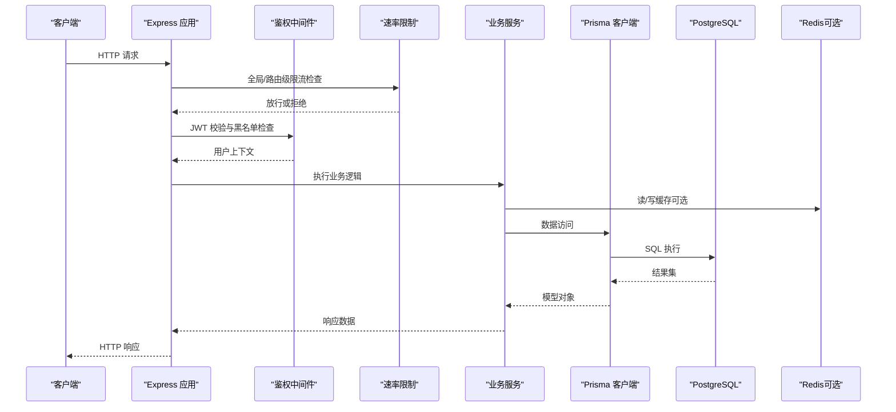
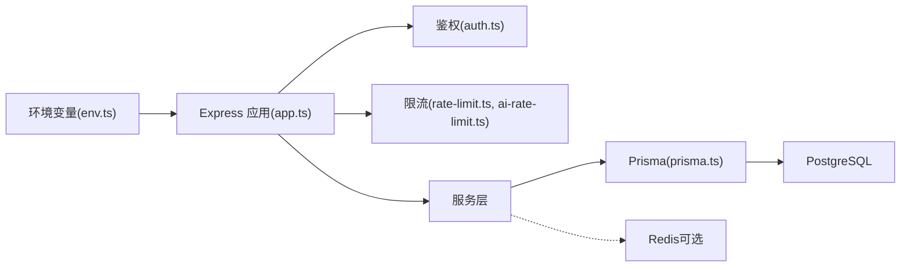

# 环境配置

<cite>
**本文引用的文件**   
- [server/src/config/env.ts](file://server/src/config/env.ts)
- [server/src/lib/prisma.ts](file://server/src/lib/prisma.ts)
- [server/src/middleware/auth.ts](file://server/src/middleware/auth.ts)
- [server/src/middleware/rate-limit.ts](file://server/src/middleware/rate-limit.ts)
- [server/src/middleware/ai-rate-limit.ts](file://server/src/middleware/ai-rate-limit.ts)
- [server/src/lib/logger.ts](file://server/src/lib/logger.ts)
- [server/src/app.ts](file://server/src/app.ts)
- [server/src/server.ts](file://server/src/server.ts)
- [server/package.json](file://server/package.json)
- [server/.pgdata/postgresql.conf](file://server/.pgdata/postgresql.conf)
- [server/prisma/schema.prisma](file://server/prisma/schema.prisma)
- [web/vite.config.ts](file://web/vite.config.ts)
- [web/package.json](file://web/package.json)
</cite>

## 目录
1. [简介](#简介)
2. [项目结构与环境概览](#项目结构与环境概览)
3. [核心配置组件](#核心配置组件)
4. [架构总览](#架构总览)
5. [详细组件分析](#详细组件分析)
6. [依赖关系分析](#依赖关系分析)
7. [性能与启动参数](#性能与启动参数)
8. [故障排查指南](#故障排查指南)
9. [结论](#结论)
10. [附录：环境变量清单与命名规范](#附录环境变量清单与命名规范)

## 简介
本文件为 FY200（浙江壹品慧财年经营数据分析平台）的环境配置文档，面向开发、测试与生产三类环境的部署与运维。内容涵盖数据库连接、API 密钥管理、Redis 缓存（如启用）、环境变量命名规范、配置文件结构、敏感信息管理策略（含密钥轮换与访问控制）、不同环境的启动参数与性能调优选项，以及常见问题排查方法与最佳实践。

## 项目结构与环境概览
FY200 采用前后端分离架构：
- 后端：Express + Prisma + PostgreSQL，JWT 鉴权，可选 Redis 限流/会话，SSE 流式 AI 调用。
- 前端：Vite + React，构建期通过环境变量注入 API 基础地址等。

典型环境差异要点：
- 开发环境：本地 PostgreSQL 实例，宽松速率限制，详细日志，允许跨域调试。
- 测试环境：隔离数据库，严格速率限制，结构化日志，关闭调试特性。
- 生产环境：高可用数据库与缓存，严格安全策略（CSP/Helmet），最小权限运行，审计与监控开启。

图表来源
- [server/src/app.ts](file://server/src/app.ts)
- [server/src/server.ts](file://server/src/server.ts)
- [server/src/lib/prisma.ts](file://server/src/lib/prisma.ts)
- [server/src/middleware/rate-limit.ts](file://server/src/middleware/rate-limit.ts)
- [server/src/middleware/ai-rate-limit.ts](file://server/src/middleware/ai-rate-limit.ts)

章节来源
- [server/src/app.ts](file://server/src/app.ts)
- [server/src/server.ts](file://server/src/server.ts)
- [server/package.json](file://server/package.json)
- [web/vite.config.ts](file://web/vite.config.ts)

## 核心配置组件
- 环境变量加载与校验：集中读取并校验运行时所需变量，提供默认值与类型转换。
- 数据库连接：基于 Prisma 的数据库客户端初始化，支持多环境连接串与连接池参数。
- 鉴权与令牌：JWT 签名密钥、过期时间、刷新令牌策略。
- 速率限制：全局与 AI 专用通道限流，支持内存或 Redis 存储。
- 日志与可观测性：日志级别、输出格式、采样率。
- 前端构建变量：Vite 构建期注入的前端可见变量。

章节来源
- [server/src/config/env.ts](file://server/src/config/env.ts)
- [server/src/lib/prisma.ts](file://server/src/lib/prisma.ts)
- [server/src/middleware/auth.ts](file://server/src/middleware/auth.ts)
- [server/src/middleware/rate-limit.ts](file://server/src/middleware/rate-limit.ts)
- [server/src/middleware/ai-rate-limit.ts](file://server/src/middleware/ai-rate-limit.ts)
- [server/src/lib/logger.ts](file://server/src/lib/logger.ts)
- [web/vite.config.ts](file://web/vite.config.ts)

## 架构总览
下图展示从请求进入 Express 到数据库访问的关键路径，以及环境变量在各层的消费点。

图表来源
- [server/src/app.ts](file://server/src/app.ts)
- [server/src/middleware/auth.ts](file://server/src/middleware/auth.ts)
- [server/src/middleware/rate-limit.ts](file://server/src/middleware/rate-limit.ts)
- [server/src/middleware/ai-rate-limit.ts](file://server/src/middleware/ai-rate-limit.ts)
- [server/src/lib/prisma.ts](file://server/src/lib/prisma.ts)

## 详细组件分析

### 环境变量与配置加载
- 职责：统一读取、校验、暴露运行时配置；提供默认值与类型转换；在应用启动时完成校验。
- 关键行为：
  - 区分开发/测试/生产模式，动态调整默认值与开关。
  - 对必填项进行存在性与格式校验，失败时快速失败。
  - 将配置以只读形式导出，避免运行时被篡改。
- 建议：
  - 所有外部依赖的连接信息均通过环境变量注入，禁止硬编码。
  - 使用分层覆盖策略：基础默认值 → 环境特定默认值 → 环境变量覆盖。

章节来源
- [server/src/config/env.ts](file://server/src/config/env.ts)

### 数据库连接与迁移
- 职责：初始化 Prisma 客户端，设置连接串、连接池大小、超时、SSL 等参数。
- 关键行为：
  - 根据环境变量生成数据库连接串。
  - 在测试环境使用独立库名或临时实例。
  - 在生产环境启用连接池与重试策略。
- 迁移与种子：
  - 使用 Prisma Migrate 管理 schema 变更。
  - 种子脚本用于填充初始数据（仅开发/测试）。

章节来源
- [server/src/lib/prisma.ts](file://server/src/lib/prisma.ts)
- [server/prisma/schema.prisma](file://server/prisma/schema.prisma)

### 鉴权与令牌管理（JWT）
- 职责：签发与校验 access/refresh 令牌，维护黑名单（可选），绑定用户上下文。
- 关键行为：
  - access 短过期（例如分钟级），refresh 长过期（例如天级），支持轮转。
  - 黑名单存储于内存或 Redis，支持登出与强制失效。
  - 结合权限与范围中间件实现细粒度控制。
- 安全建议：
  - 密钥必须来自环境变量，定期轮换；支持双密钥并行验证以实现平滑轮换。
  - 生产环境启用 HTTPS，严格 Cookie 属性（Secure/HttpOnly/SameSite）。

章节来源
- [server/src/middleware/auth.ts](file://server/src/middleware/auth.ts)

### 速率限制（全局与 AI 通道）
- 职责：防止滥用与资源耗尽，保护后端与第三方 AI 接口。
- 关键行为：
  - 全局限流：按 IP/用户维度计数，支持滑动窗口。
  - AI 专用限流：针对 /ai 路由单独配额，避免挤占通用资源。
  - 存储后端：内存（开发/测试）或 Redis（生产）。
- 调优建议：
  - 根据压测结果设定 QPS 上限与突发阈值。
  - 对慢查询与外部调用增加熔断与退避。

章节来源
- [server/src/middleware/rate-limit.ts](file://server/src/middleware/rate-limit.ts)
- [server/src/middleware/ai-rate-limit.ts](file://server/src/middleware/ai-rate-limit.ts)

### 日志与可观测性
- 职责：统一日志采集、格式化、分级输出，便于问题定位与审计。
- 关键行为：
  - 根据环境切换日志级别（开发 verbose，生产 warn/error）。
  - 结构化 JSON 输出，包含 traceId、userId、耗时等字段。
  - 敏感字段脱敏（密码、令牌、身份证号等）。
- 建议：
  - 接入集中式日志系统（如 ELK/Loki）。
  - 关键操作记录审计日志（登录、权限变更、数据导入导出）。

章节来源
- [server/src/lib/logger.ts](file://server/src/lib/logger.ts)

### 前端构建期环境变量
- 职责：在 Vite 构建时将必要变量注入前端代码（如 API 基础地址、功能开关）。
- 关键行为：
  - 仅暴露非敏感变量给前端。
  - 构建产物不包含源码中的敏感信息。
- 建议：
  - 使用 .env.development/.env.production 区分环境。
  - 通过 CI/CD 注入真实值，避免提交至仓库。

章节来源
- [web/vite.config.ts](file://web/vite.config.ts)
- [web/package.json](file://web/package.json)

## 依赖关系分析
- 后端模块耦合：
  - app.ts 装配中间件与服务，依赖 env.ts 获取配置。
  - prisma.ts 提供数据库客户端，被各服务层复用。
  - auth.ts、rate-limit.ts、ai-rate-limit.ts 作为横切关注点，贯穿请求链路。
- 外部依赖：
  - PostgreSQL：主数据存储。
  - Redis：可选，用于限流、黑名单、缓存。
  - DeepSeek API：SSE 流式调用，需配置密钥与超时。

图表来源
- [server/src/config/env.ts](file://server/src/config/env.ts)
- [server/src/app.ts](file://server/src/app.ts)
- [server/src/middleware/auth.ts](file://server/src/middleware/auth.ts)
- [server/src/middleware/rate-limit.ts](file://server/src/middleware/rate-limit.ts)
- [server/src/middleware/ai-rate-limit.ts](file://server/src/middleware/ai-rate-limit.ts)
- [server/src/lib/prisma.ts](file://server/src/lib/prisma.ts)

章节来源
- [server/src/app.ts](file://server/src/app.ts)
- [server/src/config/env.ts](file://server/src/config/env.ts)
- [server/src/lib/prisma.ts](file://server/src/lib/prisma.ts)

## 性能与启动参数
- Node.js 进程：
  - 根据 CPU 核数设置集群模式或 PM2 实例数。
  - 合理设置堆大小与 GC 参数，避免频繁 Full GC。
- 数据库连接池：
  - 连接池大小与并发度匹配，避免过多空闲连接。
  - 超时与重试策略需与数据库最大连接数协调。
- Redis 缓存：
  - 命中率优化：热点数据缓存、合理的 TTL。
  - 序列化与压缩：大对象压缩传输。
- 限流与降级：
  - 根据压测结果调整 QPS 与突发阈值。
  - 对第三方 API 调用增加超时与熔断。
- 启动参数示例（概念性）：
  - NODE_ENV=production
  - PORT=端口号
  - DATABASE_URL=数据库连接串
  - REDIS_URL=Redis 连接串（可选）
  - JWT_SECRET=签名密钥
  - LOG_LEVEL=日志级别
  - DEEPSEEK_API_KEY=AI 密钥

章节来源
- [server/package.json](file://server/package.json)
- [server/.pgdata/postgresql.conf](file://server/.pgdata/postgresql.conf)

## 故障排查指南
- 无法连接数据库：
  - 检查 DATABASE_URL 是否正确，网络连通性与防火墙规则。
  - 确认 Prisma 迁移已执行，schema 版本一致。
- 鉴权失败：
  - 核对 JWT_SECRET 是否一致，令牌是否过期或被拉黑。
  - 检查 CORS 与 Cookie 属性（Secure/HttpOnly/SameSite）。
- 限流触发：
  - 查看限流统计与阈值，必要时扩容或放宽配额。
  - 检查 Redis 连通性与内存占用。
- 日志无输出或级别不对：
  - 确认 LOG_LEVEL 与环境变量生效。
  - 检查日志输出目标（stdout/文件/远程收集器）。
- 前端无法访问 API：
  - 检查构建期环境变量是否注入正确的基础地址。
  - 确认代理与跨域配置。

章节来源
- [server/src/lib/logger.ts](file://server/src/lib/logger.ts)
- [server/src/middleware/auth.ts](file://server/src/middleware/auth.ts)
- [server/src/middleware/rate-limit.ts](file://server/src/middleware/rate-limit.ts)
- [server/src/middleware/ai-rate-limit.ts](file://server/src/middleware/ai-rate-limit.ts)
- [server/src/lib/prisma.ts](file://server/src/lib/prisma.ts)

## 结论
通过统一的环境变量管理与严格的配置校验，FY200 能够在开发、测试与生产环境中保持一致的行为与安全基线。结合限流、鉴权、审计与结构化日志，系统在稳定性、安全性与可观测性方面具备良好基础。建议在上线前完成压测与安全检查，确保各项阈值与策略符合预期。

## 附录：环境变量清单与命名规范
- 命名规范：
  - 全大写，下划线分隔，按模块分组（如 DATABASE_*、JWT_*、REDIS_*、LOG_*、DEEPSEEK_*）。
  - 区分环境前缀（可选）或在 CI/CD 中按环境注入。
- 关键变量（示例类别，具体键名以实际实现为准）：
  - 运行时：NODE_ENV、PORT、HOST
  - 数据库：DATABASE_URL、PG_*（如 PG_HOST、PG_PORT、PG_USER、PG_PASSWORD、PG_DB）
  - 缓存：REDIS_URL、REDIS_*（如 REDIS_HOST、REDIS_PORT、REDIS_PASSWORD）
  - 鉴权：JWT_SECRET、JWT_ACCESS_EXPIRES、JWT_REFRESH_EXPIRES、BLACKLIST_STORE（memory|redis）
  - 日志：LOG_LEVEL、LOG_FORMAT、LOG_OUTPUT（stdout|file）
  - AI：DEEPSEEK_API_KEY、DEEPSEEK_BASE_URL、DEEPSEEK_TIMEOUT_MS
  - 前端构建：VITE_APP_API_BASE_URL、VITE_FEATURE_*（功能开关）
- 敏感信息管理策略：
  - 密钥轮换：支持双密钥并行验证，逐步淘汰旧密钥；在低峰期切换。
  - 访问控制：最小权限原则，数据库账号按角色拆分；Redis 启用认证与 ACL。
  - 存储安全：使用密钥管理服务（如 Vault/KMS），避免明文落盘。
  - 审计与告警：记录密钥访问与变更事件，异常行为实时告警。

章节来源
- [server/src/config/env.ts](file://server/src/config/env.ts)
- [server/src/middleware/auth.ts](file://server/src/middleware/auth.ts)
- [server/src/middleware/rate-limit.ts](file://server/src/middleware/rate-limit.ts)
- [server/src/middleware/ai-rate-limit.ts](file://server/src/middleware/ai-rate-limit.ts)
- [server/src/lib/logger.ts](file://server/src/lib/logger.ts)
- [web/vite.config.ts](file://web/vite.config.ts)