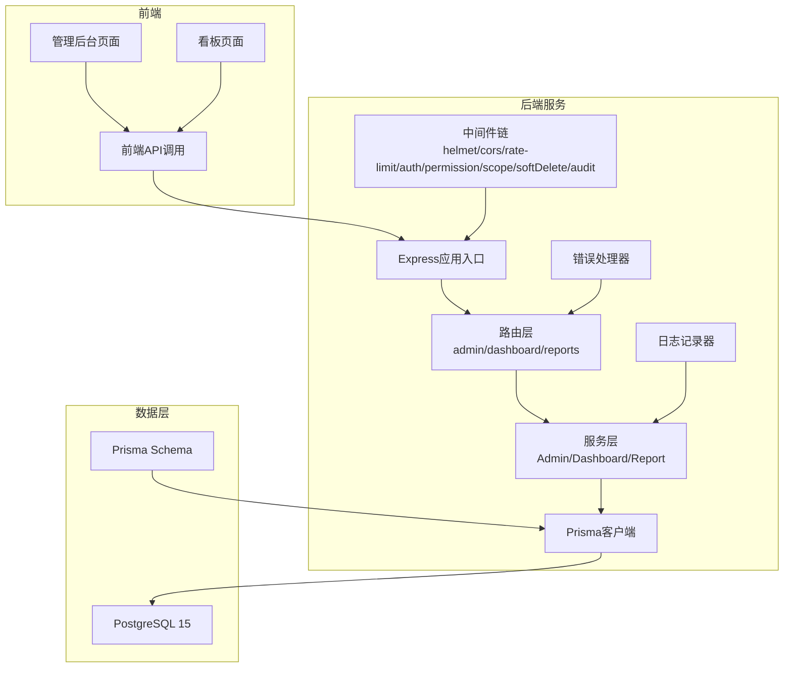
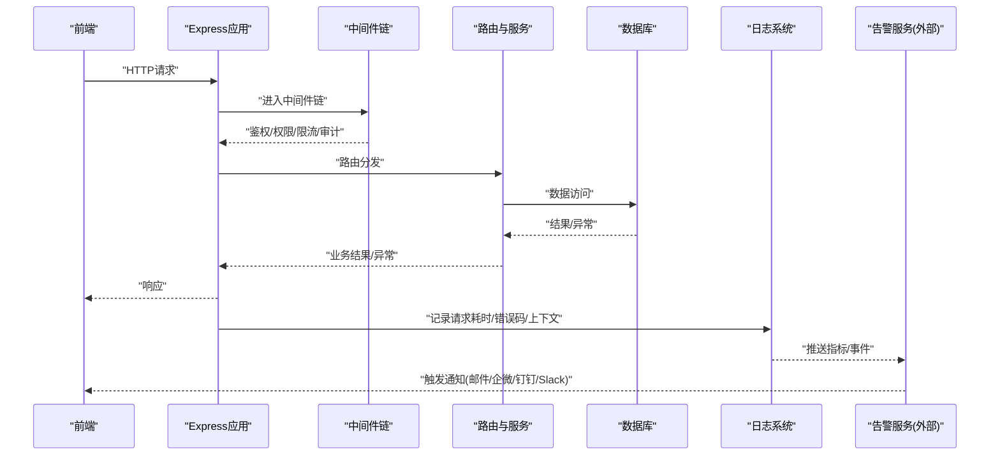
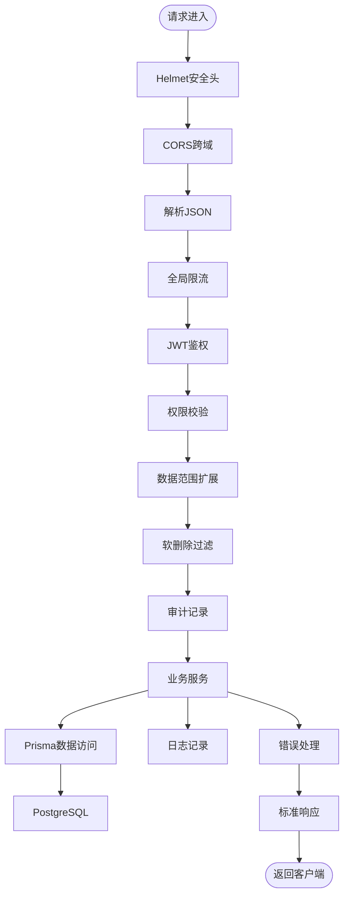

# 告警规则

<cite>
**本文引用的文件**   
- [server/src/app.ts](file://server/src/app.ts)
- [server/src/server.ts](file://server/src/server.ts)
- [server/src/middleware/error-handler.ts](file://server/src/middleware/error-handler.ts)
- [server/src/middleware/rate-limit.ts](file://server/src/middleware/rate-limit.ts)
- [server/src/middleware/ai-rate-limit.ts](file://server/src/middleware/ai-rate-limit.ts)
- [server/src/lib/logger.ts](file://server/src/lib/logger.ts)
- [server/src/lib/errors.ts](file://server/src/lib/errors.ts)
- [server/src/lib/response.ts](file://server/src/lib/response.ts)
- [server/src/config/env.ts](file://server/src/config/env.ts)
- [server/src/routes/admin.ts](file://server/src/routes/admin.ts)
- [server/src/routes/dashboard.ts](file://server/src/routes/dashboard.ts)
- [server/src/routes/reports.ts](file://server/src/routes/reports.ts)
- [server/src/services/AdminService.ts](file://server/src/services/AdminService.ts)
- [server/src/services/DashboardService.ts](file://server/src/services/DashboardService.ts)
- [server/src/services/ReportService.ts](file://server/src/services/ReportService.ts)
- [server/prisma/schema.prisma](file://server/prisma/schema.prisma)
- [server/.pgdata/postgresql.conf](file://server/.pgdata/postgresql.conf)
- [web/src/pages/admin/index.tsx](file://web/src/pages/admin/index.tsx)
- [web/src/pages/dashboard/index.tsx](file://web/src/pages/dashboard/index.tsx)
- [web/src/lib/api.ts](file://web/src/lib/api.ts)
</cite>

## 目录
1. [简介](#简介)
2. [项目结构](#项目结构)
3. [核心组件](#核心组件)
4. [架构总览](#架构总览)
5. [详细组件分析](#详细组件分析)
6. [依赖关系分析](#依赖关系分析)
7. [性能考虑](#性能考虑)
8. [故障排查指南](#故障排查指南)
9. [结论](#结论)
10. [附录](#附录)

## 简介
本文件为 FY200 项目的“告警规则”文档，聚焦于错误率、响应时间、资源使用率等关键指标的阈值定义与告警级别分类（紧急、严重、警告、信息），并给出通知渠道配置建议（邮件、企业微信、钉钉、Slack）、告警抑制与去重机制、测试验证方法以及历史查询与统计分析能力。由于当前仓库未包含专门的告警模块实现，本文基于现有后端中间件、日志、限流、数据库与前端页面进行合理设计与落地建议，确保可实施性与可观测性。

## 项目结构
FY200 采用前后端分离架构：
- 后端 Express + Prisma + PostgreSQL，提供 API、鉴权、权限、审计、限流、错误处理等能力。
- 前端 React/Vite，提供管理后台、看板、报表等界面。
- 数据库使用 PostgreSQL 15，通过 Prisma Schema 管理模型与迁移。

图表来源
- [server/src/app.ts:1-200](file://server/src/app.ts#L1-L200)
- [server/src/server.ts:1-120](file://server/src/server.ts#L1-L120)
- [server/src/middleware/rate-limit.ts:1-120](file://server/src/middleware/rate-limit.ts#L1-L120)
- [server/src/middleware/error-handler.ts:1-120](file://server/src/middleware/error-handler.ts#L1-L120)
- [server/src/lib/logger.ts:1-120](file://server/src/lib/logger.ts#L1-L120)
- [server/src/lib/errors.ts:1-120](file://server/src/lib/errors.ts#L1-L120)
- [server/src/lib/response.ts:1-120](file://server/src/lib/response.ts#L1-L120)
- [server/src/config/env.ts:1-120](file://server/src/config/env.ts#L1-L120)
- [server/src/routes/admin.ts:1-200](file://server/src/routes/admin.ts#L1-L200)
- [server/src/routes/dashboard.ts:1-200](file://server/src/routes/dashboard.ts#L1-L200)
- [server/src/routes/reports.ts:1-200](file://server/src/routes/reports.ts#L1-L200)
- [server/src/services/AdminService.ts:1-200](file://server/src/services/AdminService.ts#L1-L200)
- [server/src/services/DashboardService.ts:1-200](file://server/src/services/DashboardService.ts#L1-L200)
- [server/src/services/ReportService.ts:1-200](file://server/src/services/ReportService.ts#L1-L200)
- [server/prisma/schema.prisma:1-200](file://server/prisma/schema.prisma#L1-L200)
- [server/.pgdata/postgresql.conf:1-200](file://server/.pgdata/postgresql.conf#L1-L200)

章节来源
- [server/src/app.ts:1-200](file://server/src/app.ts#L1-L200)
- [server/src/server.ts:1-120](file://server/src/server.ts#L1-L120)
- [server/src/middleware/rate-limit.ts:1-120](file://server/src/middleware/rate-limit.ts#L1-L120)
- [server/src/middleware/error-handler.ts:1-120](file://server/src/middleware/error-handler.ts#L1-L120)
- [server/src/lib/logger.ts:1-120](file://server/src/lib/logger.ts#L1-L120)
- [server/src/lib/errors.ts:1-120](file://server/src/lib/errors.ts#L1-L120)
- [server/src/lib/response.ts:1-120](file://server/src/lib/response.ts#L1-L120)
- [server/src/config/env.ts:1-120](file://server/src/config/env.ts#L1-L120)
- [server/src/routes/admin.ts:1-200](file://server/src/routes/admin.ts#L1-L200)
- [server/src/routes/dashboard.ts:1-200](file://server/src/routes/dashboard.ts#L1-L200)
- [server/src/routes/reports.ts:1-200](file://server/src/routes/reports.ts#L1-L200)
- [server/src/services/AdminService.ts:1-200](file://server/src/services/AdminService.ts#L1-L200)
- [server/src/services/DashboardService.ts:1-200](file://server/src/services/DashboardService.ts#L1-L200)
- [server/src/services/ReportService.ts:1-200](file://server/src/services/ReportService.ts#L1-L200)
- [server/prisma/schema.prisma:1-200](file://server/prisma/schema.prisma#L1-L200)
- [server/.pgdata/postgresql.conf:1-200](file://server/.pgdata/postgresql.conf#L1-L200)

## 核心组件
- 错误处理与日志：统一错误返回格式、结构化日志输出，便于后续告警采集与分析。
- 限流与稳定性保护：全局与AI专用限流，防止突发流量导致系统过载。
- 指标采集点：HTTP请求耗时、错误率、数据库连接池状态、内存/CPU使用率（由外部监控补充）。
- 通知与告警：当前仓库未内置告警引擎，建议通过日志聚合平台或独立告警服务对接邮件、企业微信、钉钉、Slack。

章节来源
- [server/src/middleware/error-handler.ts:1-120](file://server/src/middleware/error-handler.ts#L1-L120)
- [server/src/lib/logger.ts:1-120](file://server/src/lib/logger.ts#L1-L120)
- [server/src/middleware/rate-limit.ts:1-120](file://server/src/middleware/rate-limit.ts#L1-L120)
- [server/src/middleware/ai-rate-limit.ts:1-120](file://server/src/middleware/ai-rate-limit.ts#L1-L120)
- [server/src/lib/response.ts:1-120](file://server/src/lib/response.ts#L1-L120)

## 架构总览
下图展示从前端到后端的请求链路，以及错误处理、日志、限流在告警中的作用点。

图表来源
- [server/src/app.ts:1-200](file://server/src/app.ts#L1-L200)
- [server/src/middleware/error-handler.ts:1-120](file://server/src/middleware/error-handler.ts#L1-L120)
- [server/src/middleware/rate-limit.ts:1-120](file://server/src/middleware/rate-limit.ts#L1-L120)
- [server/src/lib/logger.ts:1-120](file://server/src/lib/logger.ts#L1-L120)
- [server/src/lib/response.ts:1-120](file://server/src/lib/response.ts#L1-L120)

## 详细组件分析

### 指标与阈值定义
- 错误率阈值
  - 建议按接口维度统计5分钟窗口内的HTTP 5xx比例，超过阈值触发告警。
  - 参考采集点：错误处理器、响应封装、日志记录。
- 响应时间阈值
  - 建议按接口维度统计P95/P99耗时，超过阈值触发告警。
  - 参考采集点：中间件计时、日志记录。
- 资源使用率上限
  - CPU、内存、磁盘I/O、数据库连接池使用率，建议由外部监控系统采集并上报。
  - 参考配置：PostgreSQL参数、进程资源限制。

章节来源
- [server/src/middleware/error-handler.ts:1-120](file://server/src/middleware/error-handler.ts#L1-L120)
- [server/src/lib/logger.ts:1-120](file://server/src/lib/logger.ts#L1-L120)
- [server/src/lib/response.ts:1-120](file://server/src/lib/response.ts#L1-L120)
- [server/.pgdata/postgresql.conf:1-200](file://server/.pgdata/postgresql.conf#L1-L200)

### 告警级别分类与触发条件
- 紧急（P1）
  - 触发条件：错误率>5%持续3分钟；P99>2s持续5分钟；CPU>90%持续5分钟；数据库连接池耗尽。
  - 处理流程：立即电话/短信+群消息；值班人员1分钟内响应；启动应急回滚或扩容。
- 严重（P2）
  - 触发条件：错误率>3%持续5分钟；P95>1s持续10分钟；内存>85%持续10分钟。
  - 处理流程：即时通知；10分钟内定位；必要时降级非核心功能。
- 警告（P3）
  - 触发条件：错误率>1%持续10分钟；P95>800ms持续15分钟；磁盘使用率>80%。
  - 处理流程：工单创建；30分钟内评估影响；制定优化计划。
- 信息（P4）
  - 触发条件：常规指标波动、容量预警、变更通知。
  - 处理流程：记录与观察；无需立即行动。

[本节为概念性说明，不直接分析具体文件]

### 通知渠道配置
- 邮件
  - 配置SMTP服务器、发件人、收件人列表、模板变量（指标、阈值、链接、时间线）。
- 企业微信
  - 配置Webhook地址、消息体（文本/Markdown）、@提醒。
- 钉钉
  - 配置机器人Webhook、签名校验、消息类型（文本/Markdown/ActionCard）。
- Slack
  - 配置Incoming Webhook或Bot Token、频道、附件与富文本。

[本节为通用配置建议，不直接分析具体文件]

### 告警抑制与去重机制
- 抑制策略
  - 冷却期：同一规则N分钟内不重复触发。
  - 静默期：维护窗口内屏蔽告警。
  - 关联抑制：根因告警触发时抑制衍生告警。
- 去重策略
  - 指纹去重：按“规则ID+维度键”生成唯一键，避免重复。
  - 合并策略：相同规则的多次触发合并为一条，附带计数与最新值。

[本节为通用策略说明，不直接分析具体文件]

### 告警规则测试与验证
- 模拟故障场景
  - 注入错误：通过Mock或Chaos工程制造5xx错误、延迟、资源紧张。
  - 压测：使用JMeter/Locust对关键接口进行压力测试，观察错误率与耗时。
- 告警效果验证
  - 检查日志是否包含必要字段（traceId、接口名、耗时、错误码）。
  - 验证通知是否到达目标渠道，内容是否正确。
  - 验证抑制与去重是否生效。

[本节为通用测试方法，不直接分析具体文件]

### 告警历史查询与统计分析
- 数据存储
  - 建议在外部时序数据库或日志平台存储告警事件，支持按时间、规则、级别、维度筛选。
- 查询与分析
  - 支持按接口、服务、环境、负责人等多维度统计。
  - 提供趋势图、热力图、TopN告警、MTTR/MTBF统计。
- 前端集成
  - 管理后台增加“告警中心”页面，展示告警列表、详情、操作（确认、转派、关闭）。

章节来源
- [server/src/lib/logger.ts:1-120](file://server/src/lib/logger.ts#L1-L120)
- [server/src/lib/response.ts:1-120](file://server/src/lib/response.ts#L1-L120)
- [web/src/pages/admin/index.tsx:1-200](file://web/src/pages/admin/index.tsx#L1-L200)

## 依赖关系分析
- 中间件依赖
  - helmet → cors → express.json → rate-limit → auth → permission → scope → softDelete → audit → Service → Prisma → PostgreSQL。
- 错误处理依赖
  - 错误处理器统一捕获异常，记录日志，返回标准响应。
- 限流依赖
  - 全局与AI专用限流，防止资源耗尽。
- 日志依赖
  - 结构化日志输出，便于告警采集。

图表来源
- [server/src/app.ts:1-200](file://server/src/app.ts#L1-L200)
- [server/src/middleware/rate-limit.ts:1-120](file://server/src/middleware/rate-limit.ts#L1-L120)
- [server/src/middleware/error-handler.ts:1-120](file://server/src/middleware/error-handler.ts#L1-L120)
- [server/src/lib/logger.ts:1-120](file://server/src/lib/logger.ts#L1-L120)
- [server/src/lib/response.ts:1-120](file://server/src/lib/response.ts#L1-L120)

章节来源
- [server/src/app.ts:1-200](file://server/src/app.ts#L1-L200)
- [server/src/middleware/rate-limit.ts:1-120](file://server/src/middleware/rate-limit.ts#L1-L120)
- [server/src/middleware/error-handler.ts:1-120](file://server/src/middleware/error-handler.ts#L1-L120)
- [server/src/lib/logger.ts:1-120](file://server/src/lib/logger.ts#L1-L120)
- [server/src/lib/response.ts:1-120](file://server/src/lib/response.ts#L1-L120)

## 性能考虑
- 指标计算开销
  - 错误率与耗时统计应在中间件或服务层轻量实现，避免阻塞主流程。
- 日志写入
  - 异步落盘或批量发送，降低IO影响。
- 数据库连接池
  - 合理设置最大连接数与超时，避免连接耗尽。
- 限流策略
  - 针对高负载接口启用更严格的限流，保障核心功能可用。

[本节为通用性能建议，不直接分析具体文件]

## 故障排查指南
- 快速定位
  - 通过traceId追踪请求链路，查看错误处理器记录的异常堆栈。
  - 检查日志中是否包含必要字段（接口名、耗时、错误码、用户ID）。
- 常见错误
  - 鉴权失败：检查JWT有效期与黑名单。
  - 权限不足：检查权限策略与角色分配。
  - 数据库错误：检查连接池、SQL执行时间与索引。
- 恢复步骤
  - 临时扩容或降级非核心功能。
  - 回滚最近变更，观察指标是否恢复。

章节来源
- [server/src/middleware/error-handler.ts:1-120](file://server/src/middleware/error-handler.ts#L1-L120)
- [server/src/lib/errors.ts:1-120](file://server/src/lib/errors.ts#L1-L120)
- [server/src/lib/logger.ts:1-120](file://server/src/lib/logger.ts#L1-L120)

## 结论
本文基于现有代码结构与能力，提出了FY200项目的告警规则设计，涵盖指标阈值、级别分类、通知渠道、抑制去重、测试验证与历史查询。建议尽快引入外部告警服务与日志聚合平台，完善可观测性与应急响应能力。

[本节为总结性内容，不直接分析具体文件]

## 附录
- 环境变量建议
  - 日志级别、限流阈值、通知渠道密钥等通过环境变量管理。
- 数据库监控
  - 关注连接数、慢查询、锁等待、表膨胀等指标。
- 前端监控
  - 接入APM或错误收集SDK，提升端到端可观测性。

章节来源
- [server/src/config/env.ts:1-120](file://server/src/config/env.ts#L1-L120)
- [server/.pgdata/postgresql.conf:1-200](file://server/.pgdata/postgresql.conf#L1-L200)
- [web/src/lib/api.ts:1-200](file://web/src/lib/api.ts#L1-L200)