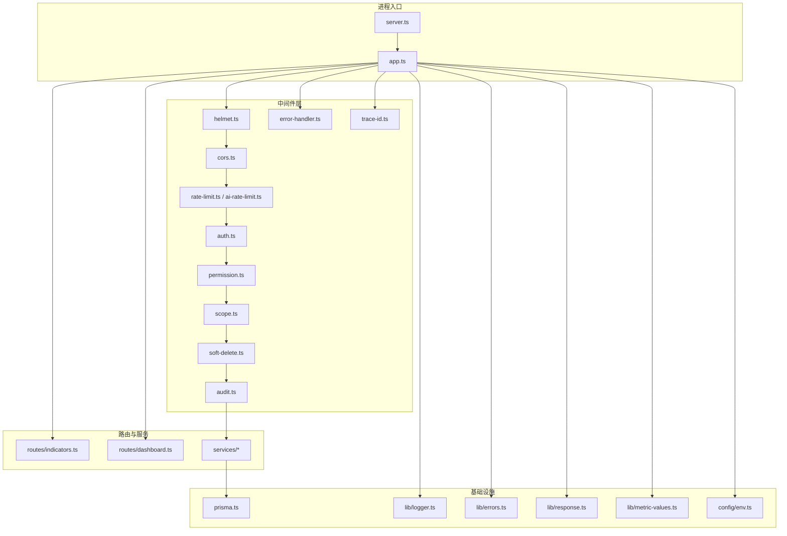
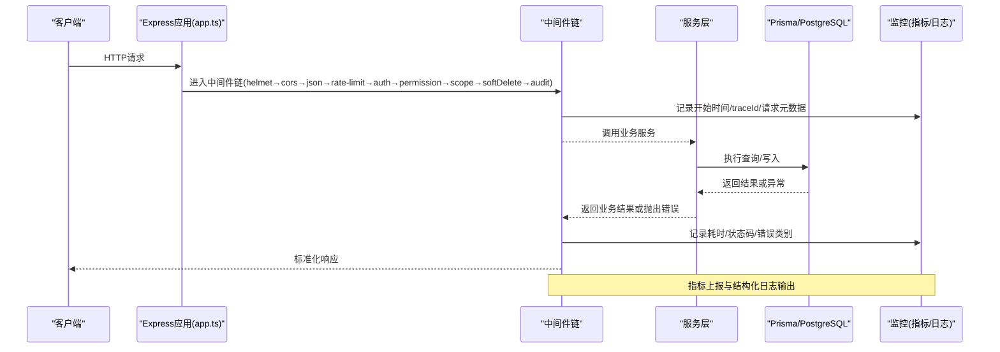
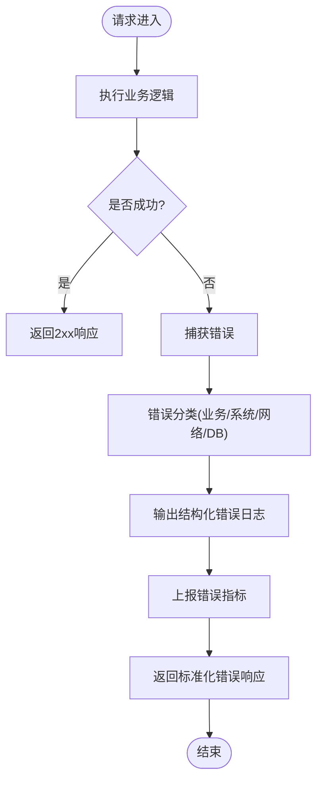
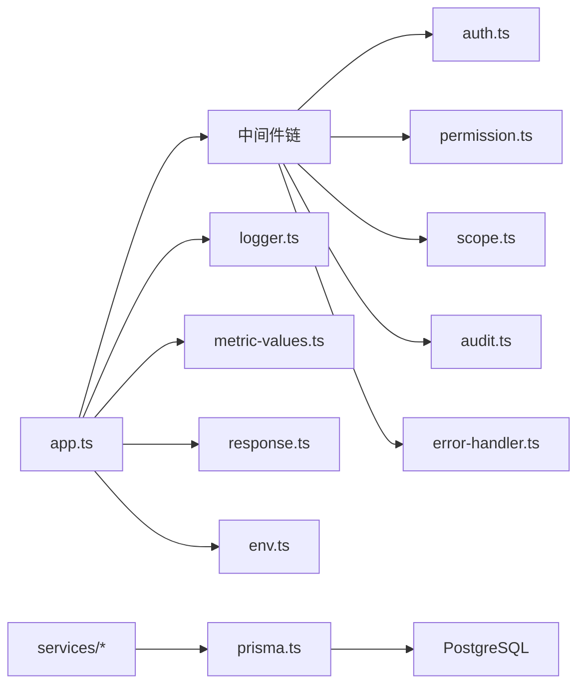

# 应用监控

<cite>
**本文引用的文件**   
- [server.ts](file://server/server.ts)
- [app.ts](file://server/src/app.ts)
- [env.ts](file://server/src/config/env.ts)
- [logger.ts](file://server/src/lib/logger.ts)
- [errors.ts](file://server/src/lib/errors.ts)
- [error-handler.ts](file://server/src/middleware/error-handler.ts)
- [trace-id.ts](file://server/src/middleware/trace-id.ts)
- [rate-limit.ts](file://server/src/middleware/rate-limit.ts)
- [ai-rate-limit.ts](file://server/src/middleware/ai-rate-limit.ts)
- [auth.ts](file://server/src/middleware/auth.ts)
- [permission.ts](file://server/src/middleware/permission.ts)
- [scope.ts](file://server/src/middleware/scope.ts)
- [soft-delete.ts](file://server/src/middleware/soft-delete.ts)
- [audit.ts](file://server/src/middleware/audit.ts)
- [cors.ts](file://server/src/middleware/cors.ts)
- [helmet.ts](file://server/src/middleware/helmet.ts)
- [response.ts](file://server/src/lib/response.ts)
- [metric-values.ts](file://server/src/lib/metric-values.ts)
- [async-handler.ts](file://server/src/lib/async-handler.ts)
- [prisma.ts](file://server/src/lib/prisma.ts)
- [indicators.ts](file://server/src/routes/indicators.ts)
- [dashboard.ts](file://server/src/routes/dashboard.ts)
- [observability.md](file://docs/references/observability.md)
- [performance.md](file://docs/references/performance.md)
</cite>

## 目录
1. [简介](#简介)
2. [项目结构](#项目结构)
3. [核心组件](#核心组件)
4. [架构总览](#架构总览)
5. [详细组件分析](#详细组件分析)
6. [依赖关系分析](#依赖关系分析)
7. [性能考量](#性能考量)
8. [故障排查指南](#故障排查指南)
9. [结论](#结论)
10. [附录](#附录)

## 简介
本监控文档面向FY200项目的Express后端，围绕请求响应时间、错误率与异常捕获、结构化日志、性能指标采集与暴露、健康检查与基准测试等主题进行系统化说明。结合中间件执行链顺序（helmet → cors → express.json → rate-limit → auth → permission → scope → softDelete → audit → Service → Prisma → PostgreSQL），为可观测性建设提供落地方案与配置示例，确保在Prometheus与Grafana体系下实现统一的指标可视化与告警。

## 项目结构
后端采用分层组织：入口服务、应用装配、中间件、路由、服务层、工具库与配置。监控相关能力主要分布在以下位置：
- 入口与应用装配：server.ts、app.ts
- 配置与环境：config/env.ts
- 日志与错误：lib/logger.ts、lib/errors.ts、middleware/error-handler.ts
- 链路追踪与审计：middleware/trace-id.ts、middleware/audit.ts
- 限流与安全：middleware/rate-limit.ts、middleware/ai-rate-limit.ts、middleware/helmet.ts、middleware/cors.ts
- 鉴权与权限：middleware/auth.ts、middleware/permission.ts、middleware/scope.ts、middleware/soft-delete.ts
- 指标与响应：lib/response.ts、lib/metric-values.ts
- 数据库连接：lib/prisma.ts
- 指标与健康端点：routes/indicators.ts、routes/dashboard.ts

图表来源
- [server.ts](file://server/server.ts)
- [app.ts](file://server/src/app.ts)
- [env.ts](file://server/src/config/env.ts)
- [logger.ts](file://server/src/lib/logger.ts)
- [errors.ts](file://server/src/lib/errors.ts)
- [error-handler.ts](file://server/src/middleware/error-handler.ts)
- [trace-id.ts](file://server/src/middleware/trace-id.ts)
- [rate-limit.ts](file://server/src/middleware/rate-limit.ts)
- [ai-rate-limit.ts](file://server/src/middleware/ai-rate-limit.ts)
- [auth.ts](file://server/src/middleware/auth.ts)
- [permission.ts](file://server/src/middleware/permission.ts)
- [scope.ts](file://server/src/middleware/scope.ts)
- [soft-delete.ts](file://server/src/middleware/soft-delete.ts)
- [audit.ts](file://server/src/middleware/audit.ts)
- [cors.ts](file://server/src/middleware/cors.ts)
- [helmet.ts](file://server/src/middleware/helmet.ts)
- [response.ts](file://server/src/lib/response.ts)
- [metric-values.ts](file://server/src/lib/metric-values.ts)
- [prisma.ts](file://server/src/lib/prisma.ts)
- [indicators.ts](file://server/src/routes/indicators.ts)
- [dashboard.ts](file://server/src/routes/dashboard.ts)

章节来源
- [server.ts](file://server/server.ts)
- [app.ts](file://server/src/app.ts)
- [env.ts](file://server/src/config/env.ts)

## 核心组件
- 请求生命周期与耗时统计
  - 通过全局中间件记录每个请求的开始时间、方法、路径、状态码、耗时，并输出结构化日志。
  - 关键指标：HTTP请求总数、按状态码分类的请求数、P50/P95/P99延迟直方图、慢请求计数。
- 错误率与异常捕获
  - 统一错误类型定义与抛出；全局错误处理器捕获未处理异常与业务错误，返回标准化错误响应。
  - 指标：错误总数、按错误类别分组的错误数、5xx比例、异常堆栈采样。
- 结构化日志与聚合
  - 统一日志格式（JSON），包含traceId、级别、模块、消息、上下文字段；支持按环境切换级别。
  - 建议接入集中式日志系统（如Elasticsearch/ Loki）进行聚合与检索。
- 性能指标采集与暴露
  - 使用Prometheus客户端暴露标准指标与自定义指标；提供健康检查端点。
  - 指标维度：process、node、http、db、business（业务指标）。
- 健康检查与基准测试
  - 提供健康检查接口，返回服务可用性、依赖健康状态。
  - 基准测试覆盖关键API的吞吐与延迟，生成报告用于回归对比。

章节来源
- [logger.ts](file://server/src/lib/logger.ts)
- [errors.ts](file://server/src/lib/errors.ts)
- [error-handler.ts](file://server/src/middleware/error-handler.ts)
- [metric-values.ts](file://server/src/lib/metric-values.ts)
- [response.ts](file://server/src/lib/response.ts)
- [indicators.ts](file://server/src/routes/indicators.ts)
- [observability.md](file://docs/references/observability.md)
- [performance.md](file://docs/references/performance.md)

## 架构总览
下图展示从请求进入Express到数据库访问的全链路监控点，以及指标与日志的采集位置。

图表来源
- [app.ts](file://server/src/app.ts)
- [trace-id.ts](file://server/src/middleware/trace-id.ts)
- [rate-limit.ts](file://server/src/middleware/rate-limit.ts)
- [ai-rate-limit.ts](file://server/src/middleware/ai-rate-limit.ts)
- [auth.ts](file://server/src/middleware/auth.ts)
- [permission.ts](file://server/src/middleware/permission.ts)
- [scope.ts](file://server/src/middleware/scope.ts)
- [soft-delete.ts](file://server/src/middleware/soft-delete.ts)
- [audit.ts](file://server/src/middleware/audit.ts)
- [prisma.ts](file://server/src/lib/prisma.ts)
- [logger.ts](file://server/src/lib/logger.ts)
- [metric-values.ts](file://server/src/lib/metric-values.ts)

## 详细组件分析

### 请求响应时间与中间件执行时间
- 设计要点
  - 在每个请求开始时记录时间戳与traceId，并在响应结束时计算耗时。
  - 对关键中间件（鉴权、权限、限流、审计）分别埋点，便于定位瓶颈。
  - 将耗时以直方图形式上报Prometheus，支持P50/P95/P99分位统计。
- 指标建议
  - http_request_duration_seconds{method,path,status}
  - middleware_duration_seconds{stage}
  - slow_requests_total{threshold_ms}
- 实现参考
  - 在应用装配处注册计时与日志中间件，确保所有路由均被覆盖。
  - 在中间件内部记录阶段耗时，避免重复计算。

章节来源
- [app.ts](file://server/src/app.ts)
- [trace-id.ts](file://server/src/middleware/trace-id.ts)
- [audit.ts](file://server/src/middleware/audit.ts)
- [metric-values.ts](file://server/src/lib/metric-values.ts)

### 错误率监控与异常捕获机制
- 统一错误类型
  - 定义业务错误与系统错误的基类，携带错误码、消息、上下文。
  - 区分可恢复错误与不可恢复错误，便于告警策略差异化。
- 全局错误处理器
  - 捕获未处理异常与中间件抛出的错误，输出结构化日志并返回标准化错误响应。
  - 记录错误类别、堆栈摘要、请求上下文（traceId、用户、路径、参数脱敏）。
- 指标与告警
  - 错误总数、按错误类别分组、5xx比例、异常采样率。
  - 针对高频错误设置阈值告警，联动通知渠道。

图表来源
- [errors.ts](file://server/src/lib/errors.ts)
- [error-handler.ts](file://server/src/middleware/error-handler.ts)
- [logger.ts](file://server/src/lib/logger.ts)
- [response.ts](file://server/src/lib/response.ts)

章节来源
- [errors.ts](file://server/src/lib/errors.ts)
- [error-handler.ts](file://server/src/middleware/error-handler.ts)
- [logger.ts](file://server/src/lib/logger.ts)
- [response.ts](file://server/src/lib/response.ts)

### 日志收集与分析
- 结构化日志格式
  - JSON格式，包含字段：timestamp、level、service、traceId、module、message、context（脱敏后）、duration_ms、status_code。
- 日志级别配置
  - 根据环境变量控制级别（debug/info/warn/error），生产默认info及以上。
- 日志聚合方案
  - 推荐接入集中式日志平台（ELK/Loki），按服务与traceId索引，支持关联查询与告警。
- 敏感信息保护
  - 对金额、公司名等敏感字段进行脱敏或区间化处理，避免泄露。

章节来源
- [logger.ts](file://server/src/lib/logger.ts)
- [env.ts](file://server/src/config/env.ts)
- [observability.md](file://docs/references/observability.md)

### 性能指标收集与暴露
- 指标维度
  - 进程指标：CPU、内存、句柄数、事件循环延迟。
  - HTTP指标：请求速率、延迟分布、错误率、活跃连接数。
  - 数据库指标：连接池大小、查询耗时、事务次数。
  - 业务指标：导入成功率、公式解析失败率、AI代理调用成功率。
- 暴露方式
  - 使用Prometheus客户端暴露/metrics端点，按标签维度聚合。
  - 提供健康检查端点/health，返回服务与依赖状态。
- 关键指标示例
  - process_cpu_usage_percent、process_memory_rss_bytes、node_eventloop_lag_seconds
  - http_requests_total{method,path,status}、http_request_duration_seconds_bucket
  - db_connections_active、db_query_duration_seconds
  - business_import_success_total、business_formula_parse_error_total、business_ai_proxy_success_total

章节来源
- [metric-values.ts](file://server/src/lib/metric-values.ts)
- [indicators.ts](file://server/src/routes/indicators.ts)
- [observability.md](file://docs/references/observability.md)

### Prometheus指标暴露与Grafana仪表板
- 指标暴露
  - 在应用启动时注册指标收集器，暴露/metrics端点。
  - 确保指标标签稳定且可控，避免高基数标签导致存储膨胀。
- Grafana仪表板
  - 创建“应用概览”面板：QPS、延迟分位、错误率、资源使用。
  - 创建“中间件耗时”面板：各阶段耗时占比与Top慢请求。
  - 创建“数据库健康”面板：连接池、慢查询、事务失败率。
  - 创建“业务指标”面板：导入、公式、AI代理成功率与失败原因分布。
- 告警规则
  - 错误率超过阈值（如5分钟>5%）触发告警。
  - P95延迟超过阈值（如>2s）触发告警。
  - 内存使用持续增长无回落触发告警。

章节来源
- [indicators.ts](file://server/src/routes/indicators.ts)
- [observability.md](file://docs/references/observability.md)

### 健康检查端点与性能基准测试
- 健康检查
  - 提供/health端点，返回服务状态、依赖健康（数据库、外部API）。
  - 支持就绪探针与存活探针，配合容器编排进行自动重启与流量摘除。
- 基准测试
  - 使用压测工具（如k6、autocannon）对关键API进行并发压测。
  - 指标包括吞吐（RPS）、延迟分位、错误率、资源使用峰值。
  - 建立基准报告，纳入CI流水线进行回归对比。

章节来源
- [indicators.ts](file://server/src/routes/indicators.ts)
- [performance.md](file://docs/references/performance.md)

## 依赖关系分析
- 中间件耦合与内聚
  - 中间件按职责单一原则拆分，低耦合高内聚；通过应用装配串联。
  - 审计与追踪中间件应置于鉴权之后，确保上下文完整。
- 外部依赖
  - Prisma与PostgreSQL：连接池、超时、重试策略需纳入监控。
  - AI代理：SSE流式响应需关注延迟与断连重连。
- 潜在循环依赖
  - 避免在服务层反向依赖中间件；通过接口抽象解耦。

图表来源
- [app.ts](file://server/src/app.ts)
- [auth.ts](file://server/src/middleware/auth.ts)
- [permission.ts](file://server/src/middleware/permission.ts)
- [scope.ts](file://server/src/middleware/scope.ts)
- [audit.ts](file://server/src/middleware/audit.ts)
- [error-handler.ts](file://server/src/middleware/error-handler.ts)
- [logger.ts](file://server/src/lib/logger.ts)
- [metric-values.ts](file://server/src/lib/metric-values.ts)
- [response.ts](file://server/src/lib/response.ts)
- [env.ts](file://server/src/config/env.ts)
- [prisma.ts](file://server/src/lib/prisma.ts)

章节来源
- [app.ts](file://server/src/app.ts)
- [prisma.ts](file://server/src/lib/prisma.ts)

## 性能考量
- 指标采集开销
  - 直方图与计数器在高QPS场景下可能带来GC压力，需合理采样与标签基数控制。
- 日志I/O
  - 异步写入与批量发送，避免阻塞主线程；生产环境降低调试级别。
- 数据库连接池
  - 监控连接池使用率与等待队列，调整最大连接数与超时。
- 内存泄漏检测
  - 定期快照堆转储，分析对象增长趋势；关注闭包与缓存未释放。
- 限流与降级
  - 针对AI代理与导入接口实施限流与熔断，保障整体稳定性。

[本节为通用指导，不直接分析具体文件]

## 故障排查指南
- 常见问题定位
  - 慢请求：查看中间件耗时与数据库慢查询，定位热点SQL与外部调用。
  - 错误突增：检查错误类别分布与最近变更，快速回滚或扩容。
  - 内存飙升：分析堆快照与事件循环延迟，定位泄漏点。
- 诊断步骤
  - 通过traceId关联日志与指标，缩小问题范围。
  - 启用更详细的日志级别，复现问题后恢复默认级别。
  - 使用健康检查与依赖探测确认服务状态。
- 恢复策略
  - 自动扩缩容、流量切换、降级开关、熔断隔离。

章节来源
- [error-handler.ts](file://server/src/middleware/error-handler.ts)
- [logger.ts](file://server/src/lib/logger.ts)
- [indicators.ts](file://server/src/routes/indicators.ts)

## 结论
通过对Express全链路的监控建设，实现了请求耗时、错误率、结构化日志与性能指标的全面可观测。结合Prometheus与Grafana，形成统一的指标可视化与告警体系，支撑生产环境的稳定性与性能优化。建议持续完善指标维度、优化采集开销、强化自动化基准测试与回归对比，持续提升系统可靠性与可维护性。

[本节为总结性内容，不直接分析具体文件]

## 附录
- 指标命名规范
  - 使用单位后缀（seconds、bytes、total），标签键值语义清晰，避免高基数。
- 日志字段字典
  - traceId、level、service、module、message、context、duration_ms、status_code。
- 健康检查协议
  - GET /health，返回status、checks（db、ai-proxy）、uptime、version。
- 基准测试脚本
  - 使用k6脚本定义场景，输出CSV与HTML报告，纳入CI。

[本节为补充信息，不直接分析具体文件]