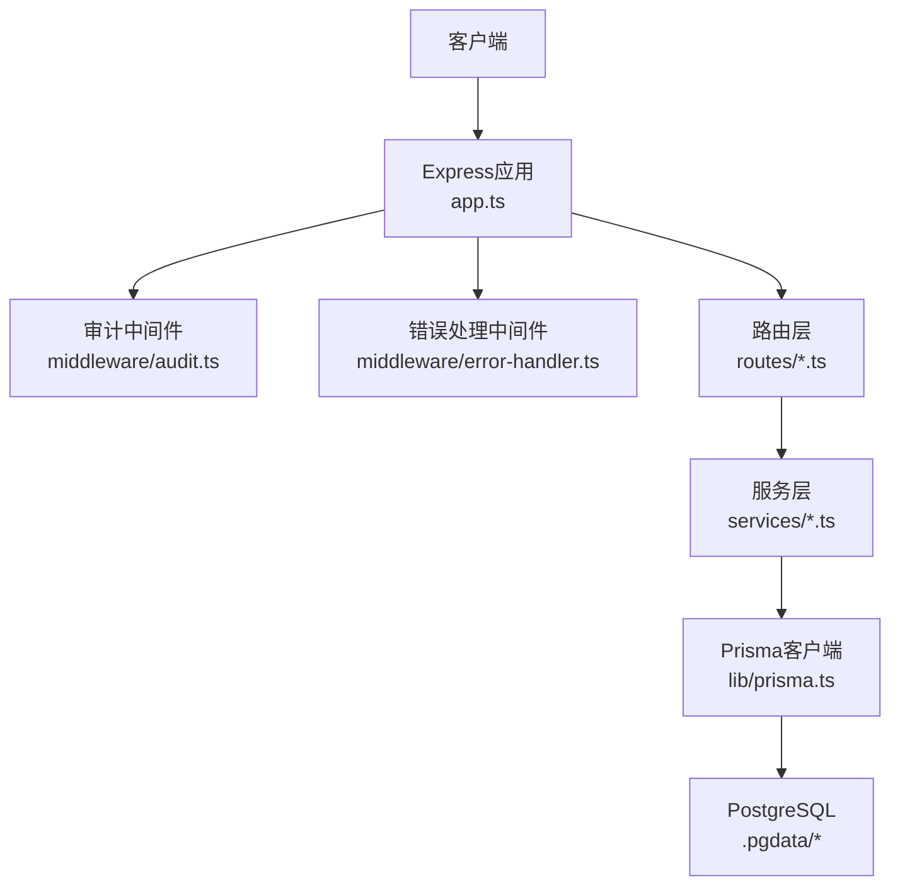
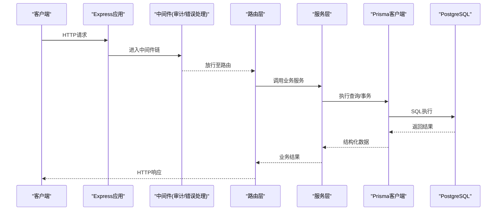
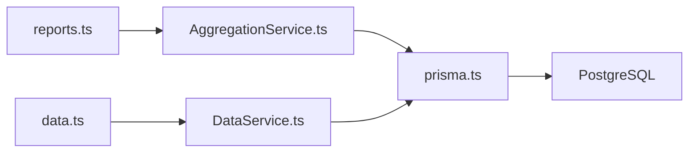

# 数据库监控

<cite>
**本文引用的文件**   
- [server/src/lib/prisma.ts](file://server/src/lib/prisma.ts)
- [server/prisma/schema.prisma](file://server/prisma/schema.prisma)
- [server/src/config/env.ts](file://server/src/config/env.ts)
- [server/.pgdata/postgresql.conf](file://server/.pgdata/postgresql.conf)
- [server/.pgdata/pg_hba.conf](file://server/.pgdata/pg_hba.conf)
- [server/src/middleware/audit.ts](file://server/src/middleware/audit.ts)
- [server/src/middleware/error-handler.ts](file://server/src/middleware/error-handler.ts)
- [server/src/services/AggregationService.ts](file://server/src/services/AggregationService.ts)
- [server/src/services/DataService.ts](file://server/src/services/DataService.ts)
- [server/src/routes/reports.ts](file://server/src/routes/reports.ts)
- [server/src/routes/data.ts](file://server/src/routes/data.ts)
- [server/src/app.ts](file://server/src/app.ts)
- [server/package.json](file://server/package.json)
</cite>

## 目录
1. [简介](#简介)
2. [项目结构](#项目结构)
3. [核心组件](#核心组件)
4. [架构总览](#架构总览)
5. [详细组件分析](#详细组件分析)
6. [依赖关系分析](#依赖关系分析)
7. [性能考虑](#性能考虑)
8. [故障排查指南](#故障排查指南)
9. [结论](#结论)
10. [附录](#附录)

## 简介
本文件为FY200项目的数据库监控与优化指南，聚焦PostgreSQL连接池监控、慢查询分析与优化、数据库资源监控、Prisma ORM性能监控、备份与恢复演练以及容量规划与扩展策略。文档面向运维与后端工程师，提供可操作的指标采集方法、告警阈值建议与调优步骤，并结合项目现有代码路径给出落地方案。

## 项目结构
本项目后端采用Express + Prisma + PostgreSQL技术栈，数据库相关的关键位置如下：
- Prisma客户端与连接池配置位于 server/src/lib/prisma.ts
- 数据模型与迁移位于 server/prisma/schema.prisma 及 migrations
- 环境变量（含数据库连接串）位于 server/src/config/env.ts
- PostgreSQL实例配置文件位于 server/.pgdata/postgresql.conf 与 pg_hba.conf
- 审计与错误处理中间件位于 server/src/middleware/audit.ts 与 error-handler.ts
- 聚合与数据服务层位于 server/src/services/AggregationService.ts 与 DataService.ts
- 报表与数据API路由位于 server/src/routes/reports.ts 与 data.ts
- 应用入口与中间件链在 server/src/app.ts

图表来源
- [server/src/app.ts](file://server/src/app.ts)
- [server/src/middleware/audit.ts](file://server/src/middleware/audit.ts)
- [server/src/middleware/error-handler.ts](file://server/src/middleware/error-handler.ts)
- [server/src/routes/reports.ts](file://server/src/routes/reports.ts)
- [server/src/routes/data.ts](file://server/src/routes/data.ts)
- [server/src/services/AggregationService.ts](file://server/src/services/AggregationService.ts)
- [server/src/services/DataService.ts](file://server/src/services/DataService.ts)
- [server/src/lib/prisma.ts](file://server/src/lib/prisma.ts)
- [server/.pgdata/postgresql.conf](file://server/.pgdata/postgresql.conf)

章节来源
- [server/src/app.ts](file://server/src/app.ts)
- [server/src/lib/prisma.ts](file://server/src/lib/prisma.ts)
- [server/prisma/schema.prisma](file://server/prisma/schema.prisma)
- [server/src/config/env.ts](file://server/src/config/env.ts)
- [server/.pgdata/postgresql.conf](file://server/.pgdata/postgresql.conf)
- [server/.pgdata/pg_hba.conf](file://server/.pgdata/pg_hba.conf)

## 核心组件
- Prisma连接池与超时控制：通过Prisma客户端初始化参数管理连接数、超时与重试行为，确保在高并发下稳定访问数据库。
- 审计与追踪：审计中间件记录关键操作上下文，便于定位慢查询与异常调用链。
- 服务层聚合与批量：聚合服务与数据服务封装复杂查询与批量写入，减少往返次数，降低N+1风险。
- 路由与接口：报表与数据接口暴露查询入口，结合限流与鉴权保障稳定性。

章节来源
- [server/src/lib/prisma.ts](file://server/src/lib/prisma.ts)
- [server/src/middleware/audit.ts](file://server/src/middleware/audit.ts)
- [server/src/services/AggregationService.ts](file://server/src/services/AggregationService.ts)
- [server/src/services/DataService.ts](file://server/src/services/DataService.ts)
- [server/src/routes/reports.ts](file://server/src/routes/reports.ts)
- [server/src/routes/data.ts](file://server/src/routes/data.ts)

## 架构总览
下图展示从请求到数据库的完整链路，包括中间件、服务层、ORM与PostgreSQL之间的交互关系。

图表来源
- [server/src/app.ts](file://server/src/app.ts)
- [server/src/middleware/audit.ts](file://server/src/middleware/audit.ts)
- [server/src/middleware/error-handler.ts](file://server/src/middleware/error-handler.ts)
- [server/src/routes/reports.ts](file://server/src/routes/reports.ts)
- [server/src/routes/data.ts](file://server/src/routes/data.ts)
- [server/src/services/AggregationService.ts](file://server/src/services/AggregationService.ts)
- [server/src/services/DataService.ts](file://server/src/services/DataService.ts)
- [server/src/lib/prisma.ts](file://server/src/lib/prisma.ts)

## 详细组件分析

### PostgreSQL连接池监控
- 关键指标
  - 活跃连接数、空闲连接数、最大连接数
  - 等待队列长度（排队中的连接请求）
  - 连接建立耗时、连接超时次数
  - 连接回收与泄漏检测
- 监控实现建议
  - 使用Prisma客户端的连接池参数进行上限与超时控制，避免无界增长
  - 在应用层统计连接获取与释放事件，计算等待队列与超时率
  - 定期采集PostgreSQL系统视图（如进程与锁信息），评估连接压力
- 告警阈值建议
  - 活跃连接接近上限的80%时触发预警
  - 连接超时率超过1%或等待队列持续大于0时触发严重告警
  - 连接泄漏（未释放）超过阈值立即告警并自动回滚

章节来源
- [server/src/lib/prisma.ts](file://server/src/lib/prisma.ts)
- [server/.pgdata/postgresql.conf](file://server/.pgdata/postgresql.conf)

### 慢查询分析与优化
- 分析方法
  - 启用查询日志与慢查询阈值，收集执行计划与耗时
  - 使用EXPLAIN/EXPLAIN ANALYZE分析热点SQL的执行计划
  - 关注全表扫描、临时表、排序与哈希操作等低效计划
- 索引优化
  - 基于高频过滤条件与JOIN键创建合适索引
  - 避免过度索引导致写入放大
  - 定期重建与更新统计信息，保证优化器选择最优计划
- 查询重构
  - 将多次小查询合并为批量操作，减少往返
  - 使用分页与限制返回字段，降低网络与内存开销
  - 对聚合类查询在服务层预计算，避免重复计算

章节来源
- [server/src/services/AggregationService.ts](file://server/src/services/AggregationService.ts)
- [server/src/services/DataService.ts](file://server/src/services/DataService.ts)
- [server/.pgdata/postgresql.conf](file://server/.pgdata/postgresql.conf)

### 数据库资源监控
- CPU使用率
  - 监控PostgreSQL进程的CPU占用与等待I/O比例
  - 识别长时间运行的查询与锁竞争导致的CPU抖动
- 内存占用
  - 监控共享缓冲命中率和临时文件使用量
  - 调整工作内存与排序缓冲区，减少磁盘排序
- 磁盘I/O
  - 监控读写延迟与吞吐，关注顺序与随机I/O差异
  - 对热点表进行分区或归档，降低I/O压力
- 网络带宽
  - 监控数据库连接的网络流量与丢包情况
  - 合理设置连接池大小，避免拥塞

章节来源
- [server/.pgdata/postgresql.conf](file://server/.pgdata/postgresql.conf)

### Prisma ORM性能监控
- 查询生成分析
  - 开启Prisma查询日志，捕获生成的SQL与参数
  - 对比不同查询方式的SQL差异，识别冗余JOIN与子查询
- N+1问题检测
  - 在服务层统一组装数据，避免循环内逐条查询
  - 使用批量查询与关联加载，减少往返次数
- 批量操作优化
  - 使用事务包裹批量写入，提升一致性与吞吐
  - 分批提交，避免长事务与锁竞争

章节来源
- [server/src/lib/prisma.ts](file://server/src/lib/prisma.ts)
- [server/src/services/AggregationService.ts](file://server/src/services/AggregationService.ts)
- [server/src/services/DataService.ts](file://server/src/services/DataService.ts)

### 备份监控与恢复演练
- 备份策略
  - 定期逻辑备份与物理快照结合，确保数据可恢复性
  - 备份完整性校验与异地存储
- 恢复演练
  - 制定恢复SOP，明确RTO/RPO目标
  - 定期演练恢复流程，验证备份可用性与恢复时间

章节来源
- [server/.pgdata/postgresql.conf](file://server/.pgdata/postgresql.conf)

### 容量规划与扩展策略
- 容量规划
  - 基于历史增长趋势预测存储需求
  - 评估连接数与查询负载，预留扩容空间
- 扩展策略
  - 垂直扩展：提升单机CPU、内存与I/O能力
  - 水平扩展：读写分离与分库分表，提升并发与可用性

章节来源
- [server/.pgdata/postgresql.conf](file://server/.pgdata/postgresql.conf)

## 依赖关系分析
Prisma客户端与服务层、路由层之间的依赖关系如下：

图表来源
- [server/src/routes/reports.ts](file://server/src/routes/reports.ts)
- [server/src/routes/data.ts](file://server/src/routes/data.ts)
- [server/src/services/AggregationService.ts](file://server/src/services/AggregationService.ts)
- [server/src/services/DataService.ts](file://server/src/services/DataService.ts)
- [server/src/lib/prisma.ts](file://server/src/lib/prisma.ts)

章节来源
- [server/src/routes/reports.ts](file://server/src/routes/reports.ts)
- [server/src/routes/data.ts](file://server/src/routes/data.ts)
- [server/src/services/AggregationService.ts](file://server/src/services/AggregationService.ts)
- [server/src/services/DataService.ts](file://server/src/services/DataService.ts)
- [server/src/lib/prisma.ts](file://server/src/lib/prisma.ts)

## 性能考虑
- 连接池调优：根据并发峰值设置合理的最大连接数与超时时间，避免连接耗尽与频繁重连
- 查询优化：优先使用索引覆盖与选择性高的过滤条件，减少排序与临时表
- 批量写入：使用事务与分批提交，平衡一致性与吞吐
- 缓存策略：对热点读数据进行应用层缓存，降低数据库压力
- 监控告警：建立完善的指标采集与告警机制，及时发现瓶颈

[本节为通用指导，不直接分析具体文件]

## 故障排查指南
- 常见问题
  - 连接池耗尽：检查连接泄漏与超时设置，增加连接上限或优化查询
  - 慢查询频发：分析执行计划，补充索引或重构SQL
  - 锁竞争：识别长事务与热点行，拆分事务或使用乐观锁
  - 备份失败：校验备份脚本与权限，检查存储空间与网络
- 排查步骤
  - 查看应用日志与审计记录，定位异常请求
  - 使用数据库视图与工具分析锁、进程与IO
  - 逐步缩小范围，复现问题并验证修复效果

章节来源
- [server/src/middleware/error-handler.ts](file://server/src/middleware/error-handler.ts)
- [server/src/middleware/audit.ts](file://server/src/middleware/audit.ts)

## 结论
通过系统的连接池监控、慢查询优化、资源监控与Prisma性能调优，结合备份恢复与容量规划，可显著提升FY200项目的数据库稳定性与性能。建议持续完善监控体系与自动化运维流程，确保在高负载场景下的可靠运行。

[本节为总结性内容，不直接分析具体文件]

## 附录
- 环境变量与配置参考
  - 数据库连接串与连接池参数位于环境变量配置中
  - PostgreSQL主配置包含性能与安全相关参数
- 数据模型与迁移
  - 数据模型定义与迁移脚本位于Prisma目录
- 包依赖
  - 后端依赖与版本信息位于package.json

章节来源
- [server/src/config/env.ts](file://server/src/config/env.ts)
- [server/.pgdata/postgresql.conf](file://server/.pgdata/postgresql.conf)
- [server/prisma/schema.prisma](file://server/prisma/schema.prisma)
- [server/package.json](file://server/package.json)