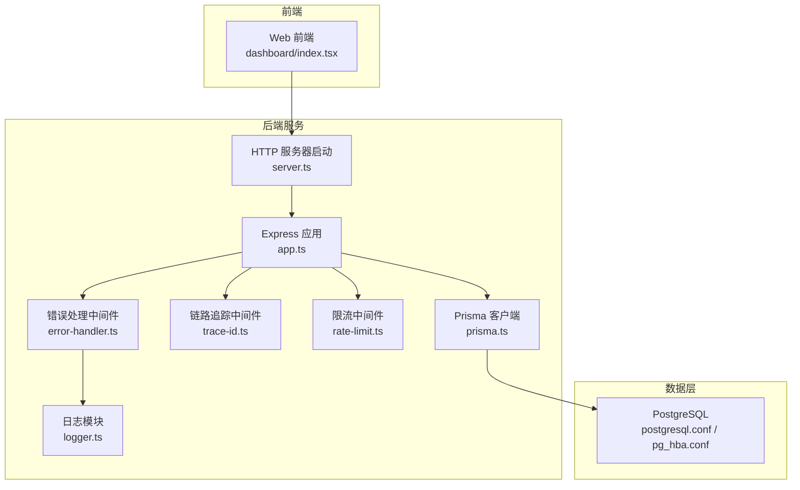
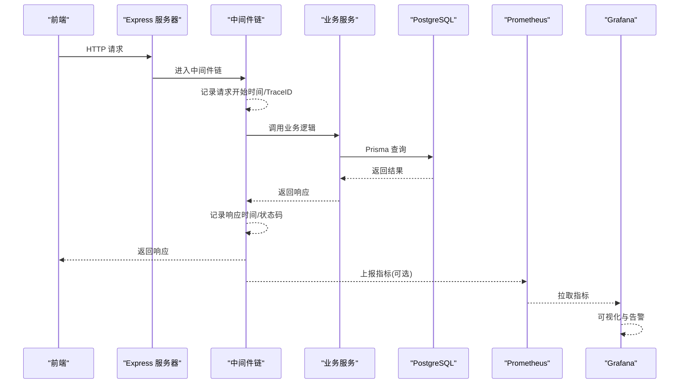
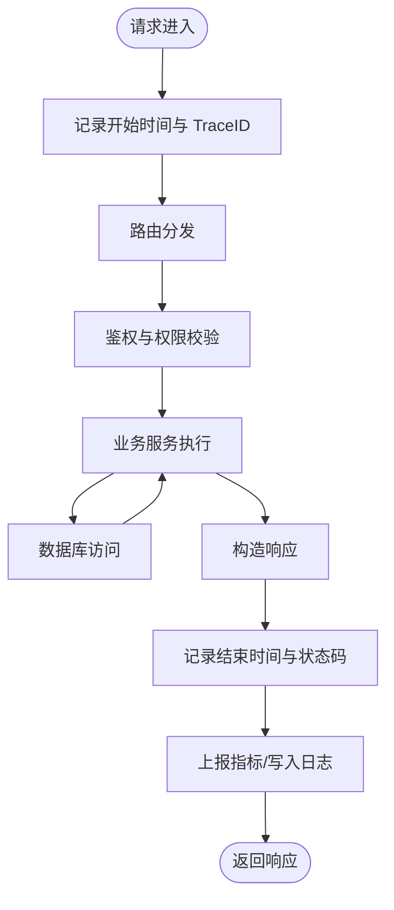
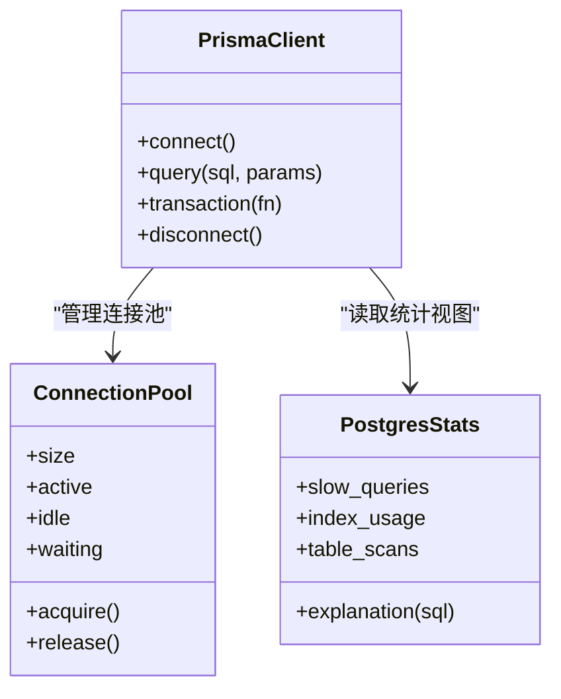
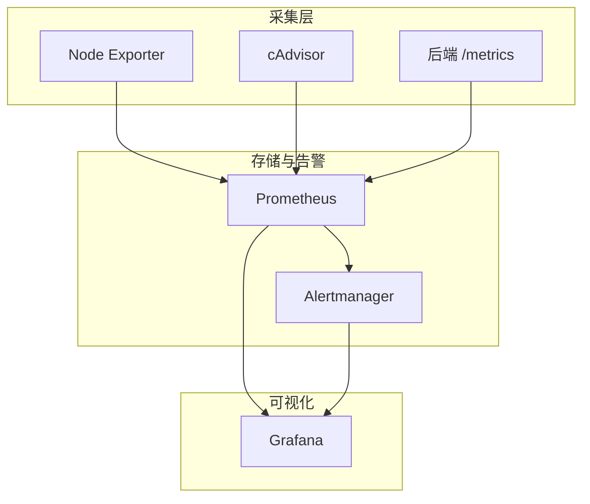

# 监控告警

<cite>
**本文引用的文件**   
- [server/src/app.ts](file://server/src/app.ts)
- [server/src/server.ts](file://server/src/server.ts)
- [server/src/middleware/error-handler.ts](file://server/src/middleware/error-handler.ts)
- [server/src/middleware/trace-id.ts](file://server/src/middleware/trace-id.ts)
- [server/src/middleware/rate-limit.ts](file://server/src/middleware/rate-limit.ts)
- [server/src/lib/logger.ts](file://server/src/lib/logger.ts)
- [server/src/lib/prisma.ts](file://server/src/lib/prisma.ts)
- [server/.pgdata/postgresql.conf](file://server/.pgdata/postgresql.conf)
- [server/.pgdata/pg_hba.conf](file://server/.pgdata/pg_hba.conf)
- [server/package.json](file://server/package.json)
- [web/src/pages/dashboard/index.tsx](file://web/src/pages/dashboard/index.tsx)
</cite>

## 目录
1. [简介](#简介)
2. [项目结构](#项目结构)
3. [核心组件](#核心组件)
4. [架构总览](#架构总览)
5. [详细组件分析](#详细组件分析)
6. [依赖关系分析](#依赖关系分析)
7. [性能考虑](#性能考虑)
8. [故障排查指南](#故障排查指南)
9. [结论](#结论)
10. [附录](#附录)

## 简介
本文件为 FY200（财年经营数据分析平台）的监控与告警方案文档，覆盖应用性能监控、数据库监控、系统资源监控、告警规则配置以及 Prometheus/Grafana 集成。目标是帮助运维与研发快速建立可观测性体系，实现请求响应时间、错误率、吞吐量的采集与可视化，并配套慢查询、连接池、索引使用等数据库侧监控能力，确保问题早发现、快定位、稳恢复。

## 项目结构
FY200 采用前后端分离架构：
- 后端 Express + Prisma + PostgreSQL，中间件链包含安全、鉴权、限流、审计等。
- 前端 React/Vite，提供看板与报表页面。
- 监控相关代码集中在服务端中间件、日志与数据库驱动层；数据库配置文件位于 .pgdata。

**图表来源** 
- [server/src/app.ts](file://server/src/app.ts)
- [server/src/server.ts](file://server/src/server.ts)
- [server/src/middleware/error-handler.ts](file://server/src/middleware/error-handler.ts)
- [server/src/middleware/trace-id.ts](file://server/src/middleware/trace-id.ts)
- [server/src/middleware/rate-limit.ts](file://server/src/middleware/rate-limit.ts)
- [server/src/lib/logger.ts](file://server/src/lib/logger.ts)
- [server/src/lib/prisma.ts](file://server/src/lib/prisma.ts)
- [server/.pgdata/postgresql.conf](file://server/.pgdata/postgresql.conf)
- [server/.pgdata/pg_hba.conf](file://server/.pgdata/pg_hba.conf)

**章节来源**
- [server/src/app.ts](file://server/src/app.ts)
- [server/src/server.ts](file://server/src/server.ts)
- [server/src/middleware/error-handler.ts](file://server/src/middleware/error-handler.ts)
- [server/src/middleware/trace-id.ts](file://server/src/middleware/trace-id.ts)
- [server/src/middleware/rate-limit.ts](file://server/src/middleware/rate-limit.ts)
- [server/src/lib/logger.ts](file://server/src/lib/logger.ts)
- [server/src/lib/prisma.ts](file://server/src/lib/prisma.ts)
- [server/.pgdata/postgresql.conf](file://server/.pgdata/postgresql.conf)
- [server/.pgdata/pg_hba.conf](file://server/.pgdata/pg_hba.conf)
- [web/src/pages/dashboard/index.tsx](file://web/src/pages/dashboard/index.tsx)

## 核心组件
- 应用性能监控（APM）
  - 请求级指标：通过中间件收集请求开始/结束时间，计算响应时延；统计状态码分布，计算错误率；累计 QPS/TPS。
  - 关键路径埋点：鉴权、权限校验、业务 Service、Prisma 查询均建议记录耗时与异常。
- 数据库监控
  - 慢查询：启用 PostgreSQL 慢查询日志，结合导出工具入 Prometheus 或时序库。
  - 连接池：监控 Prisma 连接池大小、活跃/空闲连接数、等待队列长度。
  - 索引使用：基于 pg_stat_user_indexes 统计索引命中率与扫描次数。
- 系统资源监控
  - CPU、内存、磁盘 I/O、网络：通过 Node.js 进程指标与主机 exporter（如 node_exporter）采集。
- 日志与追踪
  - 结构化日志统一输出，Trace ID 贯穿请求链路，便于跨服务关联。

**章节来源**
- [server/src/middleware/error-handler.ts](file://server/src/middleware/error-handler.ts)
- [server/src/middleware/trace-id.ts](file://server/src/middleware/trace-id.ts)
- [server/src/middleware/rate-limit.ts](file://server/src/middleware/rate-limit.ts)
- [server/src/lib/logger.ts](file://server/src/lib/logger.ts)
- [server/src/lib/prisma.ts](file://server/src/lib/prisma.ts)
- [server/.pgdata/postgresql.conf](file://server/.pgdata/postgresql.conf)

## 架构总览
下图展示从前端到数据库的可观测性数据流，以及 Prometheus/Grafana 的集成位置。

**图表来源** 
- [server/src/server.ts](file://server/src/server.ts)
- [server/src/app.ts](file://server/src/app.ts)
- [server/src/middleware/error-handler.ts](file://server/src/middleware/error-handler.ts)
- [server/src/middleware/trace-id.ts](file://server/src/middleware/trace-id.ts)
- [server/src/lib/prisma.ts](file://server/src/lib/prisma.ts)
- [server/.pgdata/postgresql.conf](file://server/.pgdata/postgresql.conf)

## 详细组件分析

### 应用性能监控（APM）
- 指标定义
  - 请求响应时间：P50/P90/P99，按路由维度聚合。
  - 错误率：HTTP 4xx/5xx 占比，按路由与上游服务拆分。
  - 吞吐量：QPS、并发数、排队延迟。
- 采集方式
  - 在中间件层统一打点，避免侵入业务代码。
  - 对关键 Service 方法增加耗时埋点与异常计数。
- 可视化与告警
  - Grafana 面板：请求时延趋势、错误率热力图、Top N 慢接口。
  - 告警：错误率突增、P99 超阈值、QPS 断崖式下降。

**图表来源** 
- [server/src/middleware/trace-id.ts](file://server/src/middleware/trace-id.ts)
- [server/src/middleware/error-handler.ts](file://server/src/middleware/error-handler.ts)
- [server/src/lib/logger.ts](file://server/src/lib/logger.ts)

**章节来源**
- [server/src/middleware/trace-id.ts](file://server/src/middleware/trace-id.ts)
- [server/src/middleware/error-handler.ts](file://server/src/middleware/error-handler.ts)
- [server/src/lib/logger.ts](file://server/src/lib/logger.ts)

### 数据库监控方案
- 慢查询分析
  - 启用 PostgreSQL 慢查询日志，设置最小执行时长阈值，将日志导出至 Prometheus 或对象存储后由解析器入库。
  - 结合 EXPLAIN/EXPLAIN ANALYZE 定位热点 SQL。
- 连接池监控
  - 监控 Prisma 连接池大小、活跃/空闲连接、等待队列长度与超时次数。
  - 关注连接泄漏与长事务导致的池耗尽。
- 索引使用情况
  - 基于 pg_stat_user_indexes 统计索引命中、顺序扫描与全表扫描比例。
  - 针对高频慢查询补充缺失索引或优化现有索引。

**图表来源** 
- [server/src/lib/prisma.ts](file://server/src/lib/prisma.ts)
- [server/.pgdata/postgresql.conf](file://server/.pgdata/postgresql.conf)

**章节来源**
- [server/src/lib/prisma.ts](file://server/src/lib/prisma.ts)
- [server/.pgdata/postgresql.conf](file://server/.pgdata/postgresql.conf)

### 系统资源监控
- 采集目标
  - Node.js 进程：CPU、内存、事件循环延迟、GC 频率。
  - 主机：CPU、内存、磁盘 I/O、网络带宽与丢包。
- 采集工具
  - Node Exporter：主机指标。
  - cAdvisor：容器化部署时的容器指标。
  - 自定义指标：通过 prom-client 暴露 /metrics 端点。
- 可视化与告警
  - 资源使用率趋势、GC 停顿、I/O 等待、网络拥塞。
  - 告警：CPU 持续高负载、内存泄漏迹象、磁盘空间不足、网络丢包率上升。

**章节来源**
- [server/package.json](file://server/package.json)

### 告警规则配置
- 阈值建议
  - 错误率：5 分钟内 > 5% 触发警告，> 10% 严重。
  - P99 响应时间：> 2s 警告，> 5s 严重。
  - QPS：较基线下降 > 50% 警告。
  - 数据库慢查询：每分钟 > 20 条警告，> 50 条严重。
  - 连接池：等待队列 > 10 持续 1 分钟警告，> 50 严重。
  - 资源：CPU > 80% 持续 5 分钟警告，> 95% 严重；内存使用 > 85% 警告。
- 告警级别
  - 信息：容量预警、计划内变更。
  - 警告：性能退化、潜在风险。
  - 严重：服务不可用、数据丢失风险。
- 通知渠道
  - 企业微信/钉钉机器人、邮件、短信、电话（紧急）。
  - 分级路由：不同级别走不同通道，避免噪音。

**章节来源**
- [server/src/middleware/error-handler.ts](file://server/src/middleware/error-handler.ts)
- [server/src/middleware/rate-limit.ts](file://server/src/middleware/rate-limit.ts)

### Prometheus/Grafana 集成配置
- 指标暴露
  - 后端通过 prom-client 暴露 /metrics 端点，包含 HTTP、数据库、自定义业务指标。
  - 主机与容器指标通过 Node Exporter/cAdvisor 暴露。
- 抓取与存储
  - Prometheus 定期抓取各 exporter 与后端 /metrics。
  - 长期存储可使用 Thanos/Cortex（可选）。
- 可视化与告警
  - Grafana 导入标准仪表盘，创建自定义面板。
  - Alertmanager 接收 Prometheus 告警，进行去重、分组与路由。

[本图为概念性集成示意，不直接映射具体源码文件]

### 监控数据分析和故障定位
- 分析方法
  - 先看大盘：错误率、P99、QPS、资源使用率是否异常。
  - 再下钻：按路由/用户/租户维度查看 Top 慢接口与错误热点。
  - 查日志：通过 Trace ID 串联请求链路，定位中间件与 Service 异常。
  - 查数据库：慢查询、锁等待、连接池耗尽、索引失效。
- 常见场景
  - 突发错误率升高：检查上游依赖、限流策略、数据库连接池。
  - 响应变慢：热点 SQL、缓存击穿、GC 停顿、CPU 争用。
  - 资源告警：扩容、降级、限流、清理临时文件。

**章节来源**
- [server/src/middleware/trace-id.ts](file://server/src/middleware/trace-id.ts)
- [server/src/middleware/error-handler.ts](file://server/src/middleware/error-handler.ts)
- [server/src/lib/logger.ts](file://server/src/lib/logger.ts)
- [server/src/lib/prisma.ts](file://server/src/lib/prisma.ts)

## 依赖关系分析
- 中间件依赖
  - helmet → cors → express.json → rate-limit → auth → permission → scope → softDelete → audit → Service → Prisma → PostgreSQL。
- 监控依赖
  - 日志模块用于统一输出；错误处理中间件捕获异常并上报；Trace ID 贯穿链路；Prisma 负责数据库连接与统计。

**图表来源** 
- [server/src/app.ts](file://server/src/app.ts)
- [server/src/middleware/rate-limit.ts](file://server/src/middleware/rate-limit.ts)
- [server/src/lib/prisma.ts](file://server/src/lib/prisma.ts)

**章节来源**
- [server/src/app.ts](file://server/src/app.ts)
- [server/src/middleware/rate-limit.ts](file://server/src/middleware/rate-limit.ts)
- [server/src/lib/prisma.ts](file://server/src/lib/prisma.ts)

## 性能考虑
- 指标上报开销控制：批量上报、采样上报、异步写入，避免阻塞主流程。
- 数据库查询优化：分页限制、必要字段选择、合理索引、避免 N+1。
- 连接池调优：根据并发与查询耗时调整最大连接数与超时时间。
- 缓存策略：热点数据缓存、失效策略与一致性保障。
- 限流与熔断：保护下游与自身稳定性，防止雪崩。

[本节为通用指导，无需特定文件引用]

## 故障排查指南
- 快速定位
  - 通过 Trace ID 在日志中检索完整请求链路。
  - 查看错误处理中间件的异常堆栈与上下文。
  - 检查限流中间件是否触发限流导致 429。
- 数据库问题
  - 慢查询日志导出与分析，必要时开启 pg_stat_statements。
  - 连接池耗尽：检查长事务、未释放连接、死锁。
  - 索引失效：对比 pg_stat_user_indexes 与 EXPLAIN 结果。
- 资源问题
  - CPU 高：热点函数、锁竞争、频繁 GC。
  - 内存泄漏：堆快照分析、对象增长趋势。
  - 磁盘 I/O：大文件读写、日志膨胀、备份任务。
  - 网络：带宽饱和、DNS 解析失败、上游超时。

**章节来源**
- [server/src/middleware/error-handler.ts](file://server/src/middleware/error-handler.ts)
- [server/src/middleware/rate-limit.ts](file://server/src/middleware/rate-limit.ts)
- [server/src/lib/logger.ts](file://server/src/lib/logger.ts)
- [server/src/lib/prisma.ts](file://server/src/lib/prisma.ts)
- [server/.pgdata/postgresql.conf](file://server/.pgdata/postgresql.conf)

## 结论
通过统一的中间件埋点、结构化日志与链路追踪，结合 Prometheus/Grafana 的采集与可视化，FY200 可实现端到端的可观测性。数据库侧慢查询、连接池与索引监控能有效提升稳定性与性能。配合合理的告警阈值与通知渠道，可在问题发生早期发现并快速定位，保障系统稳定运行。

[本节为总结性内容，无需特定文件引用]

## 附录
- 常用面板建议
  - 应用概览：QPS、错误率、P50/P90/P99、Top 慢接口。
  - 数据库：慢查询数量、连接池状态、索引命中率、锁等待。
  - 资源：CPU、内存、磁盘 I/O、网络带宽与丢包。
- 告警模板
  - 错误率突增、P99 超标、QPS 断崖、慢查询激增、连接池耗尽、资源超限。
- 排障清单
  - 检查限流与鉴权、查看 Trace ID 日志、分析慢查询与索引、评估连接池与缓存、确认资源水位。

[本节为补充信息，无需特定文件引用]