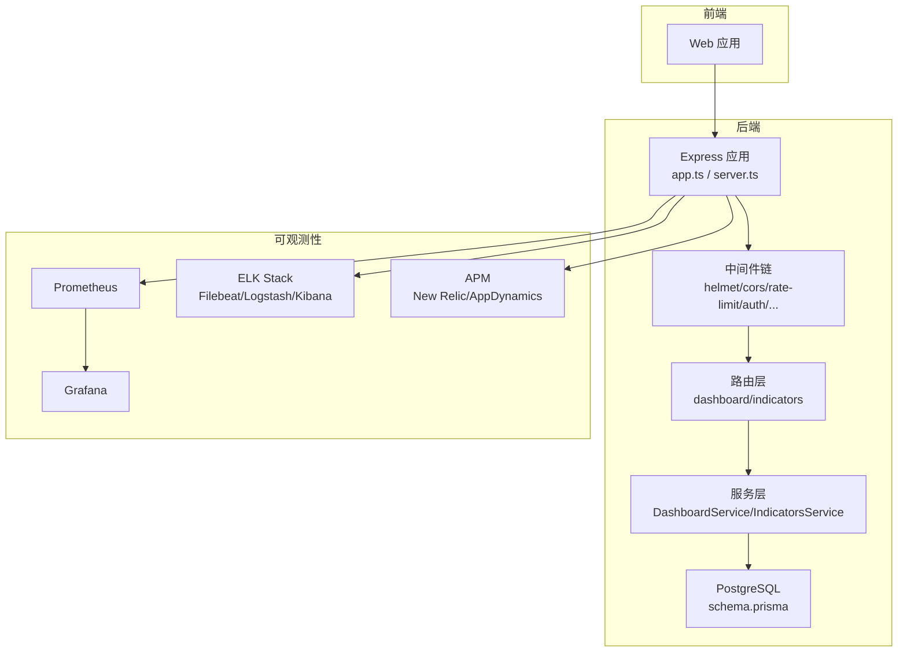
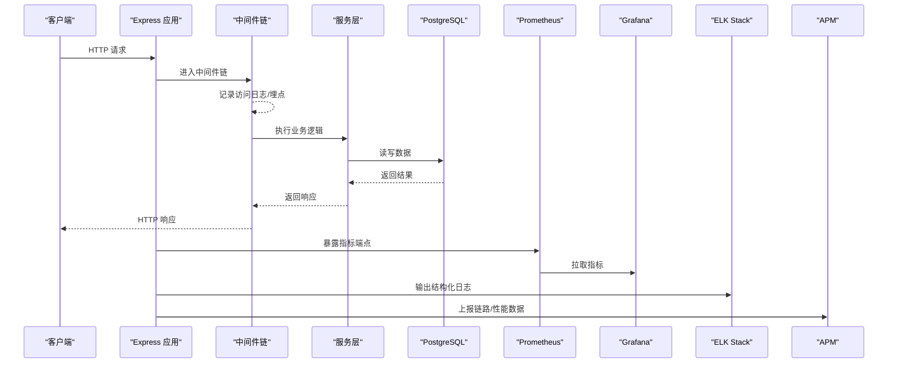
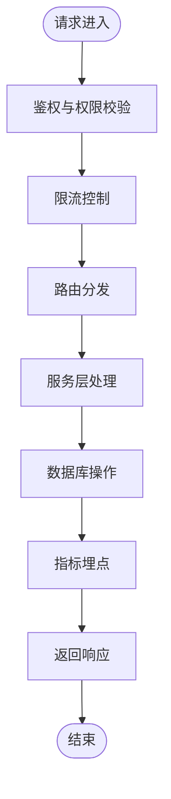
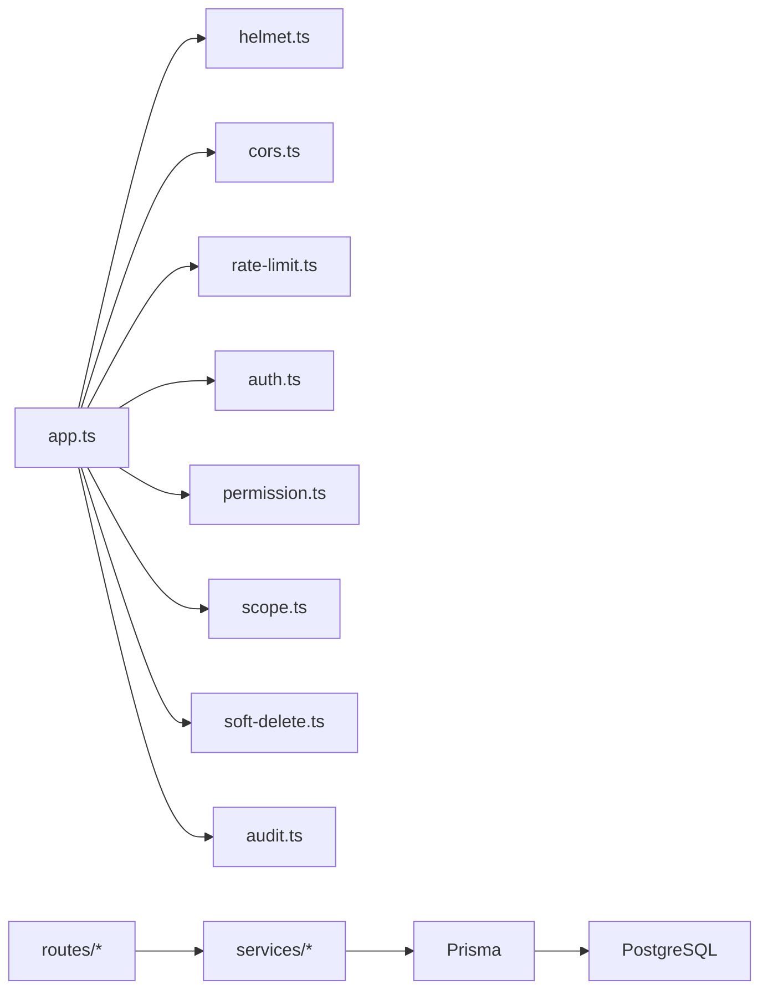

# 监控工具

<cite>
**本文引用的文件**   
- [observability.md](file://docs/references/observability.md)
- [backend.md](file://docs/references/backend.md)
- [devops.md](file://docs/references/devops.md)
- [server/src/lib/logger.ts](file://server/src/lib/logger.ts)
- [server/src/middleware/error-handler.ts](file://server/src/middleware/error-handler.ts)
- [server/src/middleware/trace-id.ts](file://server/src/middleware/trace-id.ts)
- [server/src/app.ts](file://server/src/app.ts)
- [server/src/server.ts](file://server/src/server.ts)
- [server/src/config/env.ts](file://server/src/config/env.ts)
- [server/src/middleware/rate-limit.ts](file://server/src/middleware/rate-limit.ts)
- [server/src/middleware/helmet.ts](file://server/src/middleware/helmet.ts)
- [server/src/middleware/cors.ts](file://server/src/middleware/cors.ts)
- [server/src/middleware/auth.ts](file://server/src/middleware/auth.ts)
- [server/src/middleware/permission.ts](file://server/src/middleware/permission.ts)
- [server/src/middleware/scope.ts](file://server/src/middleware/scope.ts)
- [server/src/middleware/soft-delete.ts](file://server/src/middleware/soft-delete.ts)
- [server/src/middleware/audit.ts](file://server/src/middleware/audit.ts)
- [server/src/routes/dashboard.ts](file://server/src/routes/dashboard.ts)
- [server/src/routes/indicators.ts](file://server/src/routes/indicators.ts)
- [server/src/services/DashboardService.ts](file://server/src/services/DashboardService.ts)
- [server/src/services/IndicatorsService.ts](file://server/src/services/IndicatorsService.ts)
- [server/prisma/schema.prisma](file://server/prisma/schema.prisma)
- [server/scripts/ai-smoke.ts](file://server/scripts/ai-smoke.ts)
- [server/scripts/ai-pipeline-smoke.ts](file://server/scripts/ai-pipeline-smoke.ts)
- [server/scripts/cors-check.ts](file://server/scripts/cors-check.ts)
</cite>

## 目录
1. [简介](#简介)
2. [项目结构](#项目结构)
3. [核心组件](#核心组件)
4. [架构总览](#架构总览)
5. [详细组件分析](#详细组件分析)
6. [依赖关系分析](#依赖关系分析)
7. [性能考量](#性能考量)
8. [故障排查指南](#故障排查指南)
9. [结论](#结论)
10. [附录](#附录)

## 简介
本文件面向FY200项目的运维与研发人员，系统化说明监控、日志与可观测性方案。内容覆盖：
- Prometheus 指标采集、存储与查询语言使用
- Grafana 仪表板搭建（预置导入、自定义图表、数据源配置）
- ELK Stack 日志收集（Filebeat、Logstash、Kibana）
- APM 集成（New Relic、AppDynamics 等）
- 自定义监控脚本开发（健康检查、性能测试、自动化巡检）
- 监控工具链的维护与升级指南

本项目为浙江壹品慧财年经营数据分析平台，后端技术栈为 Express + Prisma + PostgreSQL + JWT + DeepSeek API（SSE 流式）。中间件执行链顺序为：helmet → cors → express.json → rate-limit → auth(JWT+黑名单) → permission(默认拒绝) → scope(Prisma extension) → softDelete → audit → Service → Prisma → PostgreSQL。计算类指标采用安全公式解析（白名单算子），同比/环比由后端实时计算不入库。AI 双管道架构支持 polish 与 analyze 流程，并内置脱敏规则。

## 项目结构
与监控相关的关键位置：
- 文档参考：docs/references/observability.md、backend.md、devops.md
- 后端服务入口与中间件：server/src/app.ts、server/src/server.ts
- 日志与错误处理：server/src/lib/logger.ts、server/src/middleware/error-handler.ts、server/src/middleware/trace-id.ts
- 指标与看板接口：server/src/routes/dashboard.ts、server/src/routes/indicators.ts、server/src/services/DashboardService.ts、server/src/services/IndicatorsService.ts
- 环境变量与配置：server/src/config/env.ts
- 数据库模型：server/prisma/schema.prisma
- 脚本与冒烟测试：server/scripts/*.ts

**图示来源**
- [server/src/app.ts](file://server/src/app.ts)
- [server/src/server.ts](file://server/src/server.ts)
- [server/src/middleware/helmet.ts](file://server/src/middleware/helmet.ts)
- [server/src/middleware/cors.ts](file://server/src/middleware/cors.ts)
- [server/src/middleware/rate-limit.ts](file://server/src/middleware/rate-limit.ts)
- [server/src/middleware/auth.ts](file://server/src/middleware/auth.ts)
- [server/src/middleware/permission.ts](file://server/src/middleware/permission.ts)
- [server/src/middleware/scope.ts](file://server/src/middleware/scope.ts)
- [server/src/middleware/soft-delete.ts](file://server/src/middleware/soft-delete.ts)
- [server/src/middleware/audit.ts](file://server/src/middleware/audit.ts)
- [server/src/routes/dashboard.ts](file://server/src/routes/dashboard.ts)
- [server/src/routes/indicators.ts](file://server/src/routes/indicators.ts)
- [server/src/services/DashboardService.ts](file://server/src/services/DashboardService.ts)
- [server/src/services/IndicatorsService.ts](file://server/src/services/IndicatorsService.ts)
- [server/prisma/schema.prisma](file://server/prisma/schema.prisma)

**章节来源**
- [observability.md](file://docs/references/observability.md)
- [backend.md](file://docs/references/backend.md)
- [devops.md](file://docs/references/devops.md)

## 核心组件
- 指标采集与暴露
  - 通过中间件与服务层埋点，将关键业务指标（请求量、耗时、错误率、队列长度等）导出至 Prometheus。
  - 指标命名遵循统一规范，标签包含服务名、版本、环境、实例等维度。
- 日志收集与结构化
  - 使用 logger 模块输出结构化日志（JSON），包含 traceId、level、msg、duration、reqId 等字段。
  - Filebeat 采集容器或主机日志，Logstash 进行过滤与富化，Kibana 提供可视化检索。
- 链路追踪与上下文透传
  - 每个请求生成唯一 traceId，贯穿中间件、服务与数据库调用，便于问题定位。
- 告警与阈值
  - 基于 Prometheus Alertmanager 定义告警规则，结合邮件、企业微信、钉钉等通知渠道。
- APM 集成
  - 可选接入 New Relic 或 AppDynamics，用于分布式链路、慢查询与异常堆栈分析。

**章节来源**
- [server/src/lib/logger.ts](file://server/src/lib/logger.ts)
- [server/src/middleware/trace-id.ts](file://server/src/middleware/trace-id.ts)
- [server/src/middleware/error-handler.ts](file://server/src/middleware/error-handler.ts)
- [server/src/config/env.ts](file://server/src/config/env.ts)

## 架构总览
下图展示 FY200 的可观测性整体架构：应用层通过中间件和服务埋点暴露指标；日志经 Filebeat/Logstash 进入 Elasticsearch；Grafana 聚合指标与日志视图；APM 提供端到端链路追踪。

**图示来源**
- [server/src/app.ts](file://server/src/app.ts)
- [server/src/server.ts](file://server/src/server.ts)
- [server/src/middleware/audit.ts](file://server/src/middleware/audit.ts)
- [server/src/middleware/error-handler.ts](file://server/src/middleware/error-handler.ts)
- [server/src/lib/logger.ts](file://server/src/lib/logger.ts)

## 详细组件分析

### Prometheus 监控部署与配置
- 指标采集
  - 在关键路径埋点：HTTP 请求计数、延迟分布、错误码统计、数据库连接池状态、内存/CPU/GC 指标。
  - 指标命名建议：{namespace}_{service}_{metric_name}，标签包含 instance、job、env、version。
- 存储配置
  - 设置保留策略（如 30 天）、TSDB 压缩、远端写入（可选）。
  - 多租户隔离：按 job 划分采集目标，避免指标冲突。
- 查询语言使用
  - 常用函数：rate、irate、sum by、avg_over_time、histogram_quantile。
  - 典型查询：QPS、P95/P99 延迟、错误率、资源使用率。
- 告警规则
  - 基于阈值（如错误率>1%、延迟>500ms）与复合条件（如 CPU>80% 且错误率上升）触发告警。
  - 分级告警：警告、严重，配合抑制与静默策略。

**章节来源**
- [observability.md](file://docs/references/observability.md)
- [backend.md](file://docs/references/backend.md)

### Grafana 仪表板搭建
- 数据源配置
  - 添加 Prometheus 数据源，配置 URL、认证与最小权限。
  - 可选添加 Elasticsearch 数据源以关联日志。
- 预置仪表板导入
  - Node Exporter、PostgreSQL、JVM、Nginx 等通用仪表板。
  - 业务看板：API 概览、错误率趋势、慢查询 TopN、用户行为漏斗。
- 自定义图表创建
  - 折线图：QPS、延迟分位、错误率。
  - 热力图：请求耗时分布。
  - 表格：Top 慢接口、Top 错误接口。
  - 变量与筛选：按环境、版本、实例维度过滤。
- 联动与下钻
  - 从概览到明细：点击实例跳转到该实例的日志与链路详情。

**章节来源**
- [observability.md](file://docs/references/observability.md)

### ELK Stack 日志集成
- Filebeat 配置
  - 采集路径：应用 stdout/stderr、文件日志。
  - 字段标准化：timestamp、level、service、traceId、message。
  - 输出：直接写入 Logstash 或 Elasticsearch。
- Logstash 处理
  - 解析 JSON 日志，提取关键字段。
  - 富化：根据 IP 反查地域、根据 traceId 关联上下游。
  - 过滤：敏感信息脱敏、长消息截断。
- Kibana 可视化
  - 索引模式：按日期滚动（如 logs-*）。
  - 搜索语法：kql、lucene。
  - 仪表盘：错误日志趋势、Trace 时间线、慢请求列表。

**章节来源**
- [devops.md](file://docs/references/devops.md)
- [server/src/lib/logger.ts](file://server/src/lib/logger.ts)

### APM 工具集成（New Relic、AppDynamics）
- 探针安装
  - 在 Node.js 应用中安装对应 APM Agent，配置应用名与环境。
- 指标与链路
  - 自动采集 HTTP 事务、数据库调用、外部依赖。
  - 自定义埋点：关键业务步骤、异步任务、缓存命中。
- 告警与洞察
  - 慢事务、异常峰值、依赖超时。
  - 与 Prometheus/Grafana 联动，统一告警入口。

**章节来源**
- [observability.md](file://docs/references/observability.md)

### 自定义监控脚本开发
- 健康检查脚本
  - 检查端口连通、数据库连接、依赖服务可用性。
  - 返回标准健康状态码与诊断信息。
- 性能测试脚本
  - 使用压测工具模拟并发请求，采集 QPS、延迟、错误率。
  - 输出 CSV/JSON 供后续分析。
- 自动化巡检工具
  - 定时任务：指标采集、日志扫描、容量评估。
  - 报告生成：PDF/HTML 汇总，推送至协作平台。

**章节来源**
- [server/scripts/ai-smoke.ts](file://server/scripts/ai-smoke.ts)
- [server/scripts/ai-pipeline-smoke.ts](file://server/scripts/ai-pipeline-smoke.ts)
- [server/scripts/cors-check.ts](file://server/scripts/cors-check.ts)

### 指标与看板接口设计
- 指标接口
  - 暴露 /metrics 端点，返回 Prometheus 格式指标。
  - 支持按维度过滤与分页。
- 看板数据接口
  - 提供聚合后的业务指标，减少前端计算压力。
  - 缓存热点数据，提升响应速度。

**图示来源**
- [server/src/middleware/auth.ts](file://server/src/middleware/auth.ts)
- [server/src/middleware/permission.ts](file://server/src/middleware/permission.ts)
- [server/src/middleware/rate-limit.ts](file://server/src/middleware/rate-limit.ts)
- [server/src/routes/dashboard.ts](file://server/src/routes/dashboard.ts)
- [server/src/routes/indicators.ts](file://server/src/routes/indicators.ts)
- [server/src/services/DashboardService.ts](file://server/src/services/DashboardService.ts)
- [server/src/services/IndicatorsService.ts](file://server/src/services/IndicatorsService.ts)

**章节来源**
- [server/src/routes/dashboard.ts](file://server/src/routes/dashboard.ts)
- [server/src/routes/indicators.ts](file://server/src/routes/indicators.ts)
- [server/src/services/DashboardService.ts](file://server/src/services/DashboardService.ts)
- [server/src/services/IndicatorsService.ts](file://server/src/services/IndicatorsService.ts)

## 依赖关系分析
- 中间件耦合度
  - helmet、cors、rate-limit、auth、permission、scope、softDelete、audit 形成稳定链式依赖。
- 服务层依赖
  - DashboardService、IndicatorsService 依赖 Prisma 与 PostgreSQL。
- 外部依赖
  - Prometheus、Elasticsearch、Kibana、APM Agent。

**图示来源**
- [server/src/app.ts](file://server/src/app.ts)
- [server/src/middleware/helmet.ts](file://server/src/middleware/helmet.ts)
- [server/src/middleware/cors.ts](file://server/src/middleware/cors.ts)
- [server/src/middleware/rate-limit.ts](file://server/src/middleware/rate-limit.ts)
- [server/src/middleware/auth.ts](file://server/src/middleware/auth.ts)
- [server/src/middleware/permission.ts](file://server/src/middleware/permission.ts)
- [server/src/middleware/scope.ts](file://server/src/middleware/scope.ts)
- [server/src/middleware/soft-delete.ts](file://server/src/middleware/soft-delete.ts)
- [server/src/middleware/audit.ts](file://server/src/middleware/audit.ts)
- [server/prisma/schema.prisma](file://server/prisma/schema.prisma)

**章节来源**
- [server/src/app.ts](file://server/src/app.ts)
- [server/prisma/schema.prisma](file://server/prisma/schema.prisma)

## 性能考量
- 指标采样与降采样
  - 高基数指标需限制标签数量，必要时进行聚合与降采样。
- 日志吞吐优化
  - 批量写入、异步落盘、压缩传输。
- 缓存策略
  - 热点指标与看板数据缓存，TTL 与失效策略合理设置。
- 数据库优化
  - 慢查询监控、索引优化、连接池调优。

[本节为通用指导，无需特定文件引用]

## 故障排查指南
- 常见问题定位
  - 使用 traceId 串联日志与链路，快速定位问题根因。
  - 查看错误处理器输出的堆栈与上下文信息。
- 指标异常
  - 检查 Prometheus 抓取状态、目标可达性与指标命名规范。
- 日志缺失
  - 确认 Filebeat 采集路径与权限，Logstash 解析规则是否匹配。
- 告警风暴
  - 调整阈值与抑制规则，避免误报与抖动。

**章节来源**
- [server/src/middleware/error-handler.ts](file://server/src/middleware/error-handler.ts)
- [server/src/lib/logger.ts](file://server/src/lib/logger.ts)
- [server/src/middleware/trace-id.ts](file://server/src/middleware/trace-id.ts)

## 结论
通过 Prometheus、Grafana、ELK 与 APM 的组合，FY200 实现了全面的可观测性体系。建议在持续迭代中完善指标口径、日志规范与告警策略，确保系统稳定性与可维护性。

[本节为总结性内容，无需特定文件引用]

## 附录
- 术语表
  - 指标、日志、链路追踪、APM、PromQL、KQL
- 最佳实践
  - 指标命名规范、日志结构化、告警分级、容量规划
- 参考链接
  - 内部文档：observability.md、backend.md、devops.md

[本节为补充信息，无需特定文件引用]