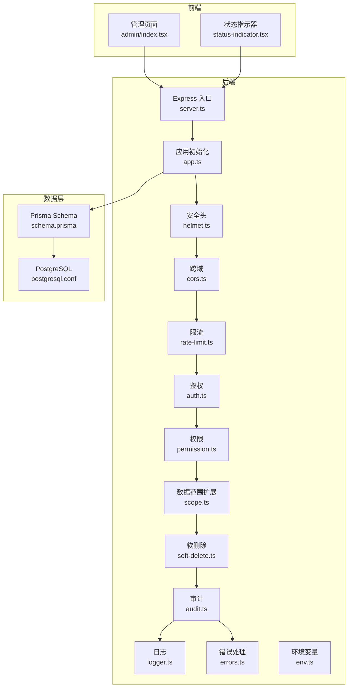
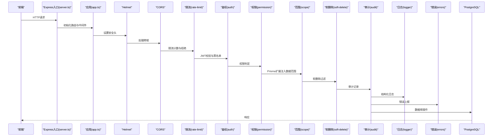
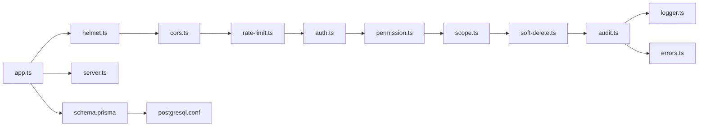

# 系统监控

<cite>
**本文引用的文件**   
- [server/src/server.ts](file://server/src/server.ts)
- [server/src/app.ts](file://server/src/app.ts)
- [server/src/middleware/helmet.ts](file://server/src/middleware/helmet.ts)
- [server/src/middleware/cors.ts](file://server/src/middleware/cors.ts)
- [server/src/middleware/rate-limit.ts](file://server/src/middleware/rate-limit.ts)
- [server/src/middleware/auth.ts](file://server/src/middleware/auth.ts)
- [server/src/middleware/permission.ts](file://server/src/middleware/permission.ts)
- [server/src/middleware/scope.ts](file://server/src/middleware/scope.ts)
- [server/src/middleware/soft-delete.ts](file://server/src/middleware/soft-delete.ts)
- [server/src/middleware/audit.ts](file://server/src/middleware/audit.ts)
- [server/src/lib/logger.ts](file://server/src/lib/logger.ts)
- [server/src/lib/errors.ts](file://server/src/lib/errors.ts)
- [server/src/config/env.ts](file://server/src/config/env.ts)
- [server/prisma/schema.prisma](file://server/prisma/schema.prisma)
- [server/.pgdata/postgresql.conf](file://server/.pgdata/postgresql.conf)
- [web/src/pages/admin/index.tsx](file://web/src/pages/admin/index.tsx)
- [web/src/components/ui/status-indicator.tsx](file://web/src/components/ui/status-indicator.tsx)
</cite>

## 目录
1. [简介](#简介)
2. [项目结构](#项目结构)
3. [核心组件](#核心组件)
4. [架构总览](#架构总览)
5. [详细组件分析](#详细组件分析)
6. [依赖关系分析](#依赖关系分析)
7. [性能注意事项](#性能注意事项)
8. [故障排查指南](#故障排查指南)
9. [结论](#结论)
10. [附录](#附录)

## 简介
本文件为FY200项目的系统监控文档，面向运维与研发人员，覆盖服务器资源监控（CPU、内存、磁盘与文件系统）、网络监控（连接数、带宽、延迟）、进程与服务健康检查（Node.js进程、依赖服务可用性、端口监听）、容器化环境监控（Docker资源限制、日志收集、生命周期管理），以及系统级性能分析工具使用方法和告警阈值配置、自动扩容策略。文档同时结合项目现有中间件链路与数据库配置，给出可落地的监控指标采集点与告警建议。

## 项目结构
FY200采用前后端分离架构：后端基于Express + Prisma + PostgreSQL，前端基于React/Vite。监控相关的关键位置包括：
- 后端入口与中间件链：用于接入请求级指标、错误率、鉴权失败等应用层指标
- 数据库配置：PostgreSQL参数影响连接池、锁等待与I/O，需纳入监控
- 前端管理页与状态指示器：可用于展示服务健康与关键KPI

图表来源
- [server/src/server.ts](file://server/src/server.ts)
- [server/src/app.ts](file://server/src/app.ts)
- [server/src/middleware/helmet.ts](file://server/src/middleware/helmet.ts)
- [server/src/middleware/cors.ts](file://server/src/middleware/cors.ts)
- [server/src/middleware/rate-limit.ts](file://server/src/middleware/rate-limit.ts)
- [server/src/middleware/auth.ts](file://server/src/middleware/auth.ts)
- [server/src/middleware/permission.ts](file://server/src/middleware/permission.ts)
- [server/src/middleware/scope.ts](file://server/src/middleware/scope.ts)
- [server/src/middleware/soft-delete.ts](file://server/src/middleware/soft-delete.ts)
- [server/src/middleware/audit.ts](file://server/src/middleware/audit.ts)
- [server/src/lib/logger.ts](file://server/src/lib/logger.ts)
- [server/src/lib/errors.ts](file://server/src/lib/errors.ts)
- [server/src/config/env.ts](file://server/src/config/env.ts)
- [server/prisma/schema.prisma](file://server/prisma/schema.prisma)
- [server/.pgdata/postgresql.conf](file://server/.pgdata/postgresql.conf)

章节来源
- [server/src/server.ts](file://server/src/server.ts)
- [server/src/app.ts](file://server/src/app.ts)
- [server/src/middleware/helmet.ts](file://server/src/middleware/helmet.ts)
- [server/src/middleware/cors.ts](file://server/src/middleware/cors.ts)
- [server/src/middleware/rate-limit.ts](file://server/src/middleware/rate-limit.ts)
- [server/src/middleware/auth.ts](file://server/src/middleware/auth.ts)
- [server/src/middleware/permission.ts](file://server/src/middleware/permission.ts)
- [server/src/middleware/scope.ts](file://server/src/middleware/scope.ts)
- [server/src/middleware/soft-delete.ts](file://server/src/middleware/soft-delete.ts)
- [server/src/middleware/audit.ts](file://server/src/middleware/audit.ts)
- [server/src/lib/logger.ts](file://server/src/lib/logger.ts)
- [server/src/lib/errors.ts](file://server/src/lib/errors.ts)
- [server/src/config/env.ts](file://server/src/config/env.ts)
- [server/prisma/schema.prisma](file://server/prisma/schema.prisma)
- [server/.pgdata/postgresql.conf](file://server/.pgdata/postgresql.conf)

## 核心组件
- 应用启动与中间件链：Express入口负责挂载中间件与路由，中间件顺序固定，便于在链路中埋点采集指标（如请求耗时、错误码分布、鉴权失败次数）。
- 日志与错误：统一日志模块与错误处理模块，是构建可观测性的基础，支持结构化日志与错误分类统计。
- 环境变量：集中管理运行期配置，便于按环境区分监控与告警阈值。
- 数据库配置：PostgreSQL参数直接影响连接池、锁与I/O，需要纳入监控与调优。

章节来源
- [server/src/app.ts](file://server/src/app.ts)
- [server/src/middleware/audit.ts](file://server/src/middleware/audit.ts)
- [server/src/lib/logger.ts](file://server/src/lib/logger.ts)
- [server/src/lib/errors.ts](file://server/src/lib/errors.ts)
- [server/src/config/env.ts](file://server/src/config/env.ts)
- [server/.pgdata/postgresql.conf](file://server/.pgdata/postgresql.conf)

## 架构总览
下图展示了从前端到后端中间件链再到数据库的调用路径，并标注了监控指标采集点（请求耗时、错误率、鉴权失败、审计事件、数据库连接与查询耗时等）。

图表来源
- [server/src/server.ts](file://server/src/server.ts)
- [server/src/app.ts](file://server/src/app.ts)
- [server/src/middleware/helmet.ts](file://server/src/middleware/helmet.ts)
- [server/src/middleware/cors.ts](file://server/src/middleware/cors.ts)
- [server/src/middleware/rate-limit.ts](file://server/src/middleware/rate-limit.ts)
- [server/src/middleware/auth.ts](file://server/src/middleware/auth.ts)
- [server/src/middleware/permission.ts](file://server/src/middleware/permission.ts)
- [server/src/middleware/scope.ts](file://server/src/middleware/scope.ts)
- [server/src/middleware/soft-delete.ts](file://server/src/middleware/soft-delete.ts)
- [server/src/middleware/audit.ts](file://server/src/middleware/audit.ts)
- [server/src/lib/logger.ts](file://server/src/lib/logger.ts)
- [server/src/lib/errors.ts](file://server/src/lib/errors.ts)

## 详细组件分析

### 服务器资源监控（CPU、内存、磁盘与文件系统）
- CPU与内存
  - 采集点：Node.js进程RSS/Heap、操作系统CPU与内存占用
  - 指标：CPU使用率、内存占用、GC停顿、事件循环延迟
  - 工具：top、htop、vmstat、pidstat、node --inspect
- 磁盘与文件系统
  - 采集点：磁盘IOPS、吞吐、队列长度、inode使用率、分区使用率
  - 指标：磁盘使用率、写入放大、I/O等待时间
  - 工具：iostat、df、du、iotop、lsof

建议告警阈值（可按环境调整）：
- CPU使用率持续>80%达5分钟
- 内存使用率>85%或RSS增长异常
- 磁盘使用率>85%且无清理策略
- I/O等待>20%或队列长度持续增长

章节来源
- [server/src/config/env.ts](file://server/src/config/env.ts)
- [server/src/lib/logger.ts](file://server/src/lib/logger.ts)

### 网络监控（连接数、带宽、延迟）
- 网络连接数
  - 采集点：ESTABLISHED/TIME_WAIT/CLOSE_WAIT数量、端口监听情况
  - 指标：并发连接数、重传率、丢包率
  - 工具：ss/netstat、netstat -anp、lsof -i
- 带宽使用率
  - 采集点：网卡入/出流量、TCP窗口大小、拥塞控制
  - 指标：带宽利用率、吞吐、RTT
  - 工具：iftop、nethogs、sar -n DEV
- 网络延迟
  - 采集点：HTTP端到端时延、DNS解析时间、TLS握手时间
  - 指标：P50/P95/P99延迟、超时率
  - 工具：curl -w、ab/wrk、tcpdump、wireshark

建议告警阈值：
- 连接数突增>基线2倍持续3分钟
- 带宽利用率>70%持续5分钟
- P99延迟>500ms或超时率>1%

章节来源
- [server/src/middleware/rate-limit.ts](file://server/src/middleware/rate-limit.ts)
- [server/src/middleware/cors.ts](file://server/src/middleware/cors.ts)

### 进程监控与服务健康检查（Node.js进程、依赖服务、端口监听）
- Node.js进程状态
  - 采集点：进程存活、重启次数、OOM、未捕获异常
  - 指标：进程健康、崩溃恢复时长、错误堆栈频率
  - 工具：systemd、pm2、docker stats、node --inspect
- 依赖服务可用性
  - 采集点：PostgreSQL连接、认证、慢查询；外部API可达性
  - 指标：连接池使用率、慢查询比例、外部API成功率
  - 工具：pg_isready、pg_stat_activity、curl探针
- 端口监听状态
  - 采集点：应用端口、数据库端口、代理端口
  - 指标：端口开放、绑定地址、SSL证书有效期
  - 工具：ss -tlnp、lsof -i :port、openssl s_client

建议告警阈值：
- 进程重启>2次/小时
- 连接池使用率>80%持续5分钟
- 外部API成功率<99%持续3分钟

章节来源
- [server/src/middleware/auth.ts](file://server/src/middleware/auth.ts)
- [server/src/middleware/audit.ts](file://server/src/middleware/audit.ts)
- [server/src/lib/errors.ts](file://server/src/lib/errors.ts)
- [server/.pgdata/postgresql.conf](file://server/.pgdata/postgresql.conf)

### 容器化环境监控（Docker）
- 容器资源限制
  - 采集点：CPU配额、内存限制、块设备I/O限制
  - 指标：CPU Throttling、OOM Kill、I/O限流
  - 工具：docker stats、docker inspect、cgroup监控
- 日志收集
  - 采集点：stdout/stderr、JSON结构化日志、审计日志
  - 指标：日志量、错误占比、关键字命中
  - 工具：docker logs、fluentd/filebeat、ELK/Loki
- 生命周期管理
  - 采集点：启动/停止/重启事件、健康检查、滚动更新
  - 指标：部署成功率、回滚率、就绪探针通过率
  - 工具：docker events、kubectl（若使用K8s）、编排平台API

建议告警阈值：
- OOM Kill发生即告警
- CPU Throttling>10%持续5分钟
- 健康检查失败>2次连续

章节来源
- [server/src/config/env.ts](file://server/src/config/env.ts)
- [server/src/lib/logger.ts](file://server/src/lib/logger.ts)

### 系统级性能分析工具使用方法
- top/htop：实时查看CPU、内存、进程占用，定位热点进程
- iostat：观察磁盘I/O瓶颈，关注await、%util、svctm
- ss/netstat：查看网络连接状态与端口监听
- curl/wrk：压测接口，评估吞吐与时延
- pg_stat_activity：查看数据库活跃会话与慢查询
- node --inspect：调试Node.js内存与事件循环

章节来源
- [server/src/lib/logger.ts](file://server/src/lib/logger.ts)
- [server/.pgdata/postgresql.conf](file://server/.pgdata/postgresql.conf)

### 告警阈值配置与自动扩容策略
- 阈值配置
  - 将阈值与环境变量关联，支持按环境差异化配置
  - 指标维度：系统、应用、数据库、外部依赖
- 自动扩容策略
  - 基于CPU/内存/连接数的水平扩容（副本数）
  - 基于I/O或数据库连接的垂直扩容（实例规格）
  - 灰度发布与回滚策略，确保稳定性

章节来源
- [server/src/config/env.ts](file://server/src/config/env.ts)

## 依赖关系分析
- 中间件耦合与职责清晰：安全、跨域、限流、鉴权、权限、数据范围、软删除、审计依次执行，便于在各阶段采集指标
- 日志与错误模块贯穿全链路，支撑可观测性与排障
- 数据库通过Prisma访问，PostgreSQL参数影响性能与稳定性

图表来源
- [server/src/app.ts](file://server/src/app.ts)
- [server/src/server.ts](file://server/src/server.ts)
- [server/src/middleware/helmet.ts](file://server/src/middleware/helmet.ts)
- [server/src/middleware/cors.ts](file://server/src/middleware/cors.ts)
- [server/src/middleware/rate-limit.ts](file://server/src/middleware/rate-limit.ts)
- [server/src/middleware/auth.ts](file://server/src/middleware/auth.ts)
- [server/src/middleware/permission.ts](file://server/src/middleware/permission.ts)
- [server/src/middleware/scope.ts](file://server/src/middleware/scope.ts)
- [server/src/middleware/soft-delete.ts](file://server/src/middleware/soft-delete.ts)
- [server/src/middleware/audit.ts](file://server/src/middleware/audit.ts)
- [server/src/lib/logger.ts](file://server/src/lib/logger.ts)
- [server/src/lib/errors.ts](file://server/src/lib/errors.ts)
- [server/prisma/schema.prisma](file://server/prisma/schema.prisma)
- [server/.pgdata/postgresql.conf](file://server/.pgdata/postgresql.conf)

章节来源
- [server/src/app.ts](file://server/src/app.ts)
- [server/src/server.ts](file://server/src/server.ts)
- [server/src/middleware/audit.ts](file://server/src/middleware/audit.ts)
- [server/src/lib/logger.ts](file://server/src/lib/logger.ts)
- [server/src/lib/errors.ts](file://server/src/lib/errors.ts)
- [server/prisma/schema.prisma](file://server/prisma/schema.prisma)
- [server/.pgdata/postgresql.conf](file://server/.pgdata/postgresql.conf)

## 性能注意事项
- 中间件顺序合理，避免在鉴权前进行昂贵计算
- 数据库连接池与慢查询需重点监控，防止锁竞争与长事务
- 日志级别按需调整，生产环境以INFO/WARN为主，避免DEBUG造成IO压力
- 容器环境下注意资源限制与探针配置，避免误判健康状态

[本节为通用指导，不直接分析具体文件]

## 故障排查指南
- 快速定位
  - 使用top/htop定位高CPU/内存进程
  - 使用ss/netstat查看异常连接与端口占用
  - 使用iostat观察磁盘I/O瓶颈
- 应用层问题
  - 检查错误日志与审计日志，定位错误类型与触发路径
  - 检查鉴权失败与权限拒绝原因
- 数据库问题
  - 使用pg_stat_activity查看慢查询与锁等待
  - 检查连接池使用率与最大连接数
- 容器问题
  - 检查docker stats与cgroup限制，确认是否被Throttle或OOM
  - 查看健康检查与重启事件

章节来源
- [server/src/lib/errors.ts](file://server/src/lib/errors.ts)
- [server/src/middleware/auth.ts](file://server/src/middleware/auth.ts)
- [server/src/middleware/audit.ts](file://server/src/middleware/audit.ts)
- [server/.pgdata/postgresql.conf](file://server/.pgdata/postgresql.conf)

## 结论
通过在本项目中系统化地采集与应用层、系统层、数据库层与容器层的指标，并结合合理的告警阈值与自动扩容策略，可实现对FY200项目的全面监控与稳定运行。建议在现有中间件链路与日志模块基础上，完善指标埋点与告警规则，形成闭环的可观测体系。

[本节为总结，不直接分析具体文件]

## 附录
- 常用命令速查
  - 系统资源：top、htop、vmstat、pidstat
  - 磁盘I/O：iostat、iotop、lsof
  - 网络：ss、netstat、iftop、nethogs、curl -w
  - 数据库：pg_isready、psql -c "SELECT * FROM pg_stat_activity;"
  - 容器：docker stats、docker inspect、docker events
- 监控看板建议
  - 系统层：CPU、内存、磁盘、网络
  - 应用层：QPS、错误率、鉴权失败、审计事件
  - 数据库层：连接池、慢查询、锁等待
  - 容器层：资源限制、健康检查、部署事件

[本节为补充信息，不直接分析具体文件]