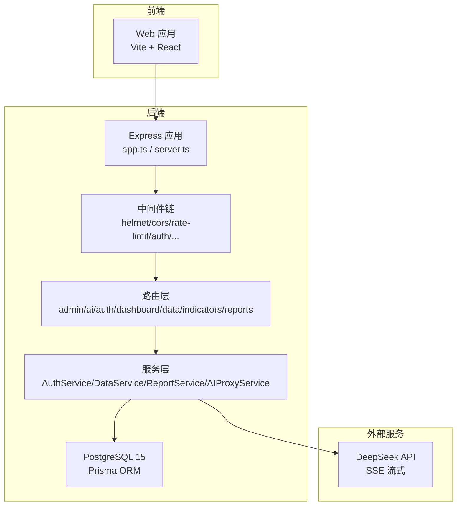
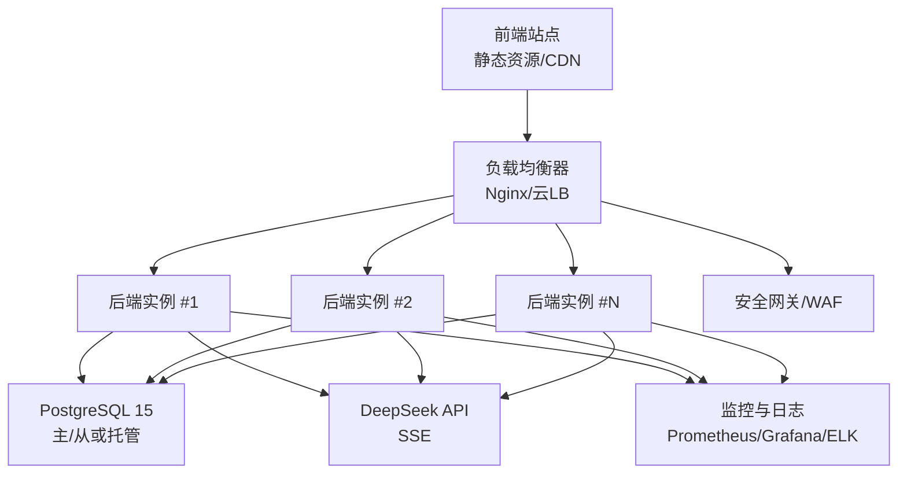
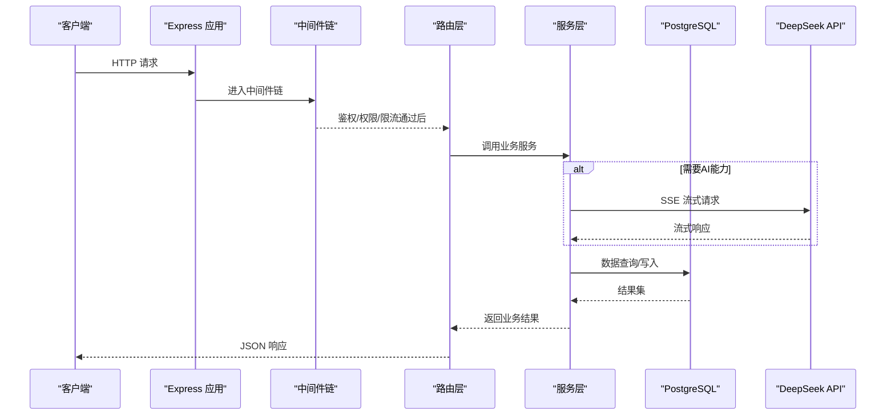
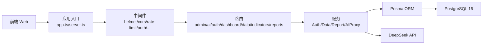

# 部署运维

<cite>
**本文引用的文件**   
- [server/src/app.ts](file://server/src/app.ts)
- [server/src/server.ts](file://server/src/server.ts)
- [server/src/config/env.ts](file://server/src/config/env.ts)
- [server/src/lib/logger.ts](file://server/src/lib/logger.ts)
- [server/src/lib/prisma.ts](file://server/src/lib/prisma.ts)
- [server/src/middleware/helmet.ts](file://server/src/middleware/helmet.ts)
- [server/src/middleware/cors.ts](file://server/src/middleware/cors.ts)
- [server/src/middleware/rate-limit.ts](file://server/src/middleware/rate-limit.ts)
- [server/src/middleware/auth.ts](file://server/src/middleware/auth.ts)
- [server/src/middleware/permission.ts](file://server/src/middleware/permission.ts)
- [server/src/middleware/scope.ts](file://server/src/middleware/scope.ts)
- [server/src/middleware/soft-delete.ts](file://server/src/middleware/soft-delete.ts)
- [server/src/middleware/audit.ts](file://server/src/middleware/audit.ts)
- [server/src/middleware/error-handler.ts](file://server/src/middleware/error-handler.ts)
- [server/src/middleware/trace-id.ts](file://server/src/middleware/trace-id.ts)
- [server/src/routes/admin.ts](file://server/src/routes/admin.ts)
- [server/src/routes/ai.ts](file://server/src/routes/ai.ts)
- [server/src/routes/auth.ts](file://server/src/routes/auth.ts)
- [server/src/routes/dashboard.ts](file://server/src/routes/dashboard.ts)
- [server/src/routes/data.ts](file://server/src/routes/data.ts)
- [server/src/routes/indicators.ts](file://server/src/routes/indicators.ts)
- [server/src/routes/reports.ts](file://server/src/routes/reports.ts)
- [server/src/services/AIProxyService.ts](file://server/src/services/AIProxyService.ts)
- [server/src/services/AuthService.ts](file://server/src/services/AuthService.ts)
- [server/src/services/DataService.ts](file://server/src/services/DataService.ts)
- [server/src/services/ReportService.ts](file://server/src/services/ReportService.ts)
- [server/prisma/schema.prisma](file://server/prisma/schema.prisma)
- [server/scripts/local-db.ts](file://server/scripts/local-db.ts)
- [web/package.json](file://web/package.json)
- [web/vite.config.ts](file://web/vite.config.ts)
- [server/package.json](file://server/package.json)
- [docs/references/devops.md](file://docs/references/devops.md)
- [docs/references/observability.md](file://docs/references/observability.md)
- [docs/references/performance.md](file://docs/references/performance.md)
</cite>

## 目录
1. [简介](#简介)
2. [项目结构](#项目结构)
3. [核心组件](#核心组件)
4. [架构总览](#架构总览)
5. [详细组件分析](#详细组件分析)
6. [依赖分析](#依赖分析)
7. [性能考虑](#性能考虑)
8. [故障排查指南](#故障排查指南)
9. [结论](#结论)
10. [附录](#附录)

## 简介
本文件为 FY200（浙江壹品慧财年经营数据分析平台）的生产环境部署与运维手册。内容覆盖服务器与网络要求、数据库部署、容器化与编排、环境变量与敏感信息管理、监控告警、日志管理、备份恢复与灾难恢复、容量规划、性能优化、CI/CD 流水线与自动化部署等。后端技术栈为 Express 4 + Prisma 5 + PostgreSQL 15 + JWT（access 15min + refresh 7day 轮转）+ DeepSeek API（SSE 流式）。中间件执行链顺序：helmet → cors → express.json → rate-limit → auth(JWT+黑名单) → permission(默认拒绝) → scope(Prisma extension) → softDelete → audit → Service → Prisma → PostgreSQL。计算类指标使用安全公式解析，同比/环比由后端实时计算不存库。AI 双管道架构：polish（文本→脱敏→LLM→还原）/ analyze（结构化→计算→脱敏→LLM→生成），脱敏规则：绝对金额→区间，公司名→动态映射。

## 项目结构
FY200 采用前后端分离的仓库结构：
- server：Express 后端服务，包含路由、中间件、服务层、Prisma 数据模型与迁移脚本、本地数据库初始化脚本等。
- web：前端应用（Vite + React），提供看板、报表、数据维护等界面。
- docs：运维参考文档（DevOps、可观测性、性能等）。

图表来源
- [server/src/app.ts](file://server/src/app.ts)
- [server/src/server.ts](file://server/src/server.ts)
- [server/src/middleware/helmet.ts](file://server/src/middleware/helmet.ts)
- [server/src/middleware/cors.ts](file://server/src/middleware/cors.ts)
- [server/src/middleware/rate-limit.ts](file://server/src/middleware/rate-limit.ts)
- [server/src/middleware/auth.ts](file://server/src/middleware/auth.ts)
- [server/src/middleware/permission.ts](file://server/src/middleware/permission.ts)
- [server/src/middleware/scope.ts](file://server/src/middleware/scope.ts)
- [server/src/middleware/soft-delete.ts](file://server/src/middleware/soft-delete.ts)
- [server/src/middleware/audit.ts](file://server/src/middleware/audit.ts)
- [server/src/routes/admin.ts](file://server/src/routes/admin.ts)
- [server/src/routes/ai.ts](file://server/src/routes/ai.ts)
- [server/src/routes/auth.ts](file://server/src/routes/auth.ts)
- [server/src/routes/dashboard.ts](file://server/src/routes/dashboard.ts)
- [server/src/routes/data.ts](file://server/src/routes/data.ts)
- [server/src/routes/indicators.ts](file://server/src/routes/indicators.ts)
- [server/src/routes/reports.ts](file://server/src/routes/reports.ts)
- [server/src/services/AIProxyService.ts](file://server/src/services/AIProxyService.ts)
- [server/src/services/AuthService.ts](file://server/src/services/AuthService.ts)
- [server/src/services/DataService.ts](file://server/src/services/DataService.ts)
- [server/src/services/ReportService.ts](file://server/src/services/ReportService.ts)
- [server/prisma/schema.prisma](file://server/prisma/schema.prisma)

章节来源
- [server/src/app.ts](file://server/src/app.ts)
- [server/src/server.ts](file://server/src/server.ts)
- [server/package.json](file://server/package.json)
- [web/package.json](file://web/package.json)
- [web/vite.config.ts](file://web/vite.config.ts)

## 核心组件
- 应用入口与HTTP服务：Express 应用初始化、监听端口、挂载中间件与路由。
- 配置与环境变量：集中读取并校验运行所需的环境变量（如数据库连接、JWT密钥、CORS、限流策略、AI代理等）。
- 中间件链：安全头、跨域、请求体解析、限流、鉴权、权限控制、作用域扩展、软删除、审计、错误处理、追踪ID。
- 路由与服务：按领域划分的路由与业务服务，封装对数据库与外部AI服务的调用。
- 数据访问：Prisma ORM 与 PostgreSQL 15 的连接池、迁移与种子数据。
- 日志与可观测性：结构化日志、统一错误格式、链路追踪ID。

章节来源
- [server/src/app.ts](file://server/src/app.ts)
- [server/src/server.ts](file://server/src/server.ts)
- [server/src/config/env.ts](file://server/src/config/env.ts)
- [server/src/lib/logger.ts](file://server/src/lib/logger.ts)
- [server/src/lib/prisma.ts](file://server/src/lib/prisma.ts)
- [server/src/middleware/helmet.ts](file://server/src/middleware/helmet.ts)
- [server/src/middleware/cors.ts](file://server/src/middleware/cors.ts)
- [server/src/middleware/rate-limit.ts](file://server/src/middleware/rate-limit.ts)
- [server/src/middleware/auth.ts](file://server/src/middleware/auth.ts)
- [server/src/middleware/permission.ts](file://server/src/middleware/permission.ts)
- [server/src/middleware/scope.ts](file://server/src/middleware/scope.ts)
- [server/src/middleware/soft-delete.ts](file://server/src/middleware/soft-delete.ts)
- [server/src/middleware/audit.ts](file://server/src/middleware/audit.ts)
- [server/src/middleware/error-handler.ts](file://server/src/middleware/error-handler.ts)
- [server/src/middleware/trace-id.ts](file://server/src/middleware/trace-id.ts)

## 架构总览
FY200 生产环境典型部署拓扑如下：
- 前端静态资源通过反向代理或 CDN 分发。
- 后端服务以多实例水平扩展，配合负载均衡器对外暴露。
- 数据库采用主从或高可用集群，读写分离与连接池调优。
- 外部AI服务通过代理或网关接入，支持SSE流式响应。
- 监控与日志采集通过Agent或Sidecar收集，汇聚至统一平台。

[此图为概念性拓扑，无需代码映射]

## 详细组件分析

### 应用启动与中间件链
- 应用初始化：加载环境变量、初始化日志、建立数据库连接、注册中间件与路由、启动HTTP服务。
- 中间件链顺序严格遵循：helmet → cors → express.json → rate-limit → auth → permission → scope → softDelete → audit → Service → Prisma → PostgreSQL。
- 错误处理：统一错误处理器捕获异常，输出结构化错误信息，避免泄露敏感细节。
- 追踪ID：每个请求分配唯一 traceId，贯穿日志与链路追踪。

图表来源
- [server/src/app.ts](file://server/src/app.ts)
- [server/src/server.ts](file://server/src/server.ts)
- [server/src/middleware/helmet.ts](file://server/src/middleware/helmet.ts)
- [server/src/middleware/cors.ts](file://server/src/middleware/cors.ts)
- [server/src/middleware/rate-limit.ts](file://server/src/middleware/rate-limit.ts)
- [server/src/middleware/auth.ts](file://server/src/middleware/auth.ts)
- [server/src/middleware/permission.ts](file://server/src/middleware/permission.ts)
- [server/src/middleware/scope.ts](file://server/src/middleware/scope.ts)
- [server/src/middleware/soft-delete.ts](file://server/src/middleware/soft-delete.ts)
- [server/src/middleware/audit.ts](file://server/src/middleware/audit.ts)
- [server/src/middleware/error-handler.ts](file://server/src/middleware/error-handler.ts)
- [server/src/middleware/trace-id.ts](file://server/src/middleware/trace-id.ts)
- [server/src/routes/admin.ts](file://server/src/routes/admin.ts)
- [server/src/routes/ai.ts](file://server/src/routes/ai.ts)
- [server/src/routes/auth.ts](file://server/src/routes/auth.ts)
- [server/src/routes/dashboard.ts](file://server/src/routes/dashboard.ts)
- [server/src/routes/data.ts](file://server/src/routes/data.ts)
- [server/src/routes/indicators.ts](file://server/src/routes/indicators.ts)
- [server/src/routes/reports.ts](file://server/src/routes/reports.ts)
- [server/src/services/AIProxyService.ts](file://server/src/services/AIProxyService.ts)
- [server/src/services/AuthService.ts](file://server/src/services/AuthService.ts)
- [server/src/services/DataService.ts](file://server/src/services/DataService.ts)
- [server/src/services/ReportService.ts](file://server/src/services/ReportService.ts)
- [server/prisma/schema.prisma](file://server/prisma/schema.prisma)

章节来源
- [server/src/app.ts](file://server/src/app.ts)
- [server/src/server.ts](file://server/src/server.ts)
- [server/src/middleware/error-handler.ts](file://server/src/middleware/error-handler.ts)
- [server/src/middleware/trace-id.ts](file://server/src/middleware/trace-id.ts)

### 环境变量与配置管理
- 配置来源：统一从环境变量读取，包括数据库连接串、JWT密钥、CORS白名单、限流阈值、AI代理URL与密钥等。
- 校验与默认值：在应用启动时进行必要校验，提供合理默认值与清晰的错误提示。
- 敏感信息管理：禁止将密钥硬编码到代码或镜像中；生产环境建议使用密钥管理服务（如KMS/Secrets Manager）注入。
- 环境差异：开发/测试/预发/生产通过不同配置文件或环境变量区分，确保最小权限原则。

章节来源
- [server/src/config/env.ts](file://server/src/config/env.ts)
- [server/src/lib/prisma.ts](file://server/src/lib/prisma.ts)
- [server/src/middleware/cors.ts](file://server/src/middleware/cors.ts)
- [server/src/middleware/rate-limit.ts](file://server/src/middleware/rate-limit.ts)
- [server/src/services/AIProxyService.ts](file://server/src/services/AIProxyService.ts)

### 数据库部署与数据模型
- 数据库版本：PostgreSQL 15，建议启用连接池、慢查询日志、自动清理与备份策略。
- ORM 与迁移：Prisma schema 定义数据模型，迁移脚本用于版本演进；种子数据用于初始化基础数据。
- 连接参数：根据生产负载调整最大连接数、超时、重试策略；读写分离需配合代理或驱动配置。
- 备份恢复：定期全量与增量备份，保留策略与演练恢复流程。

章节来源
- [server/prisma/schema.prisma](file://server/prisma/schema.prisma)
- [server/scripts/local-db.ts](file://server/scripts/local-db.ts)
- [server/src/lib/prisma.ts](file://server/src/lib/prisma.ts)

### 容器化与编排
- 镜像构建：基于精简运行时镜像，仅安装必要依赖，分层缓存加速构建。
- 容器编排：推荐使用 Kubernetes 或 Docker Compose（开发/测试）；生产环境建议多副本、健康检查、滚动更新。
- 服务编排：前后端分离部署，前端静态资源由反向代理或对象存储分发；后端无状态服务横向扩展。
- 配置注入：通过 ConfigMap/Secrets 注入环境变量，避免镜像内嵌配置。

[本节为通用指导，未直接分析具体文件]

### 监控与告警
- 应用监控：进程存活、内存/CPU、GC、请求QPS、延迟分布、错误率。
- 数据库监控：连接数、慢查询、锁等待、磁盘IO、复制延迟。
- 指标收集：导出标准指标（如 Prometheus），结合 Grafana 可视化。
- 告警策略：分级告警（警告/严重），通知渠道（邮件/IM/短信），抑制与静默窗口。

章节来源
- [docs/references/observability.md](file://docs/references/observability.md)
- [server/src/lib/logger.ts](file://server/src/lib/logger.ts)

### 日志管理
- 日志级别：DEBUG/INFO/WARN/ERROR，生产默认 INFO 及以上。
- 结构化日志：JSON 格式，包含 traceId、模块、方法、耗时、状态码等。
- 收集与聚合：Filebeat/Fluent Bit 采集，Elasticsearch/OpenSearch 存储，Kibana 检索。
- 留存策略：按天滚动、压缩归档、冷热分层、合规保留期。

章节来源
- [server/src/lib/logger.ts](file://server/src/lib/logger.ts)
- [docs/references/observability.md](file://docs/references/observability.md)

### 备份恢复与灾难恢复
- 备份策略：每日全量 + 每小时增量，异地容灾存储，加密传输与静态加密。
- 恢复演练：季度演练RTO/RPO目标，验证恢复流程与数据一致性。
- 灾难恢复：多可用区部署、自动故障转移、回滚策略与灰度发布。

[本节为通用指导，未直接分析具体文件]

### 容量规划
- CPU/内存：根据峰值QPS与并发估算，预留30%以上冗余。
- 数据库：连接池上限、索引命中率、表分区与归档策略。
- 存储：日志与备份空间增长预测，扩容预案。
- 网络：带宽与延迟评估，CDN与边缘节点优化。

[本节为通用指导，未直接分析具体文件]

### 性能优化建议
- 连接池与超时：合理设置数据库连接池大小与超时时间，避免连接耗尽。
- 缓存策略：热点数据缓存（Redis/Memcached），减少数据库压力。
- 查询优化：慢查询分析与索引优化，避免全表扫描。
- 异步处理：长任务队列化，提升响应速度。
- 前端优化：静态资源缓存、懒加载、按需打包。

章节来源
- [docs/references/performance.md](file://docs/references/performance.md)

### CI/CD 流水线与自动化部署
- 代码质量：静态检查、单元测试、集成测试、覆盖率门禁。
- 构建与镜像：多阶段构建、镜像签名、漏洞扫描。
- 部署策略：蓝绿/金丝雀发布、自动回滚、健康检查。
- 配置管理：环境配置与密钥通过安全通道注入，变更审计。

[本节为通用指导，未直接分析具体文件]

## 依赖分析
FY200 关键依赖关系如下：
- 应用入口依赖中间件、路由与服务层。
- 服务层依赖 Prisma ORM 与外部AI服务。
- 前端依赖后端API，静态资源由反向代理或CDN分发。

图表来源
- [server/src/app.ts](file://server/src/app.ts)
- [server/src/server.ts](file://server/src/server.ts)
- [server/src/middleware/helmet.ts](file://server/src/middleware/helmet.ts)
- [server/src/middleware/cors.ts](file://server/src/middleware/cors.ts)
- [server/src/middleware/rate-limit.ts](file://server/src/middleware/rate-limit.ts)
- [server/src/middleware/auth.ts](file://server/src/middleware/auth.ts)
- [server/src/middleware/permission.ts](file://server/src/middleware/permission.ts)
- [server/src/middleware/scope.ts](file://server/src/middleware/scope.ts)
- [server/src/middleware/soft-delete.ts](file://server/src/middleware/soft-delete.ts)
- [server/src/middleware/audit.ts](file://server/src/middleware/audit.ts)
- [server/src/routes/admin.ts](file://server/src/routes/admin.ts)
- [server/src/routes/ai.ts](file://server/src/routes/ai.ts)
- [server/src/routes/auth.ts](file://server/src/routes/auth.ts)
- [server/src/routes/dashboard.ts](file://server/src/routes/dashboard.ts)
- [server/src/routes/data.ts](file://server/src/routes/data.ts)
- [server/src/routes/indicators.ts](file://server/src/routes/indicators.ts)
- [server/src/routes/reports.ts](file://server/src/routes/reports.ts)
- [server/src/services/AIProxyService.ts](file://server/src/services/AIProxyService.ts)
- [server/src/services/AuthService.ts](file://server/src/services/AuthService.ts)
- [server/src/services/DataService.ts](file://server/src/services/DataService.ts)
- [server/src/services/ReportService.ts](file://server/src/services/ReportService.ts)
- [server/src/lib/prisma.ts](file://server/src/lib/prisma.ts)
- [server/prisma/schema.prisma](file://server/prisma/schema.prisma)

章节来源
- [server/package.json](file://server/package.json)
- [web/package.json](file://web/package.json)

## 性能考虑
- 连接池与超时：根据负载调优数据库连接池大小与超时，避免连接泄漏。
- 缓存与异步：热点数据缓存、长任务异步化，降低P99延迟。
- 查询优化：索引与SQL优化，避免N+1查询。
- 资源限制：容器CPU/内存限制与弹性伸缩策略。
- 前端优化：静态资源缓存、按需加载、图片与字体优化。

章节来源
- [docs/references/performance.md](file://docs/references/performance.md)

## 故障排查指南
- 常见问题定位：查看错误日志与traceId，确认中间件是否拦截、权限是否不足、限流是否触发。
- 数据库问题：检查连接池、慢查询、锁等待与磁盘空间。
- AI服务异常：确认代理配置、网络连通性与限流策略。
- 性能瓶颈：使用APM工具定位热点接口与慢查询。
- 回滚与降级：快速回滚到上一稳定版本，必要时降级AI功能。

章节来源
- [server/src/middleware/error-handler.ts](file://server/src/middleware/error-handler.ts)
- [server/src/lib/logger.ts](file://server/src/lib/logger.ts)
- [server/src/middleware/auth.ts](file://server/src/middleware/auth.ts)
- [server/src/middleware/rate-limit.ts](file://server/src/middleware/rate-limit.ts)
- [server/src/services/AIProxyService.ts](file://server/src/services/AIProxyService.ts)

## 结论
FY200 生产环境部署应遵循安全、稳定、可扩展的原则，通过严格的中间件链、完善的监控与日志体系、合理的容量规划与自动化流水线，保障系统在高并发与复杂业务场景下的可靠性与可维护性。建议持续优化数据库与AI服务调用路径，完善备份与灾难恢复演练，确保RTO/RPO目标达成。

## 附录
- 服务器配置建议：CPU/内存/磁盘规格、操作系统内核参数、文件系统与网络栈优化。
- 网络与安全：防火墙策略、TLS证书、WAF与入侵检测。
- 运维工具链：CI/CD、镜像仓库、配置中心、密钥管理、监控与日志平台。
- 合规与审计：操作审计、数据脱敏、访问控制与合规报告。

[本节为通用指导，未直接分析具体文件]