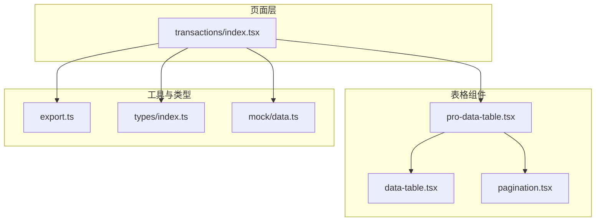
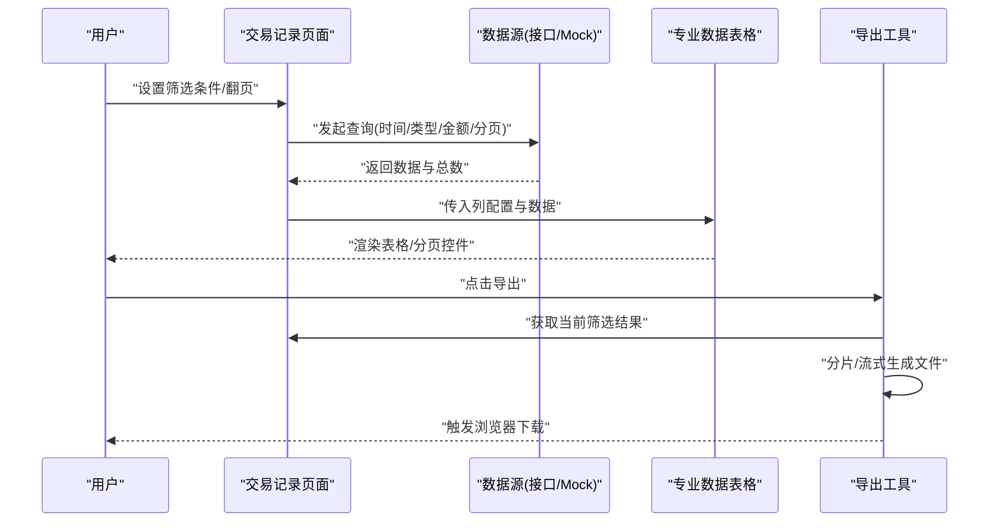
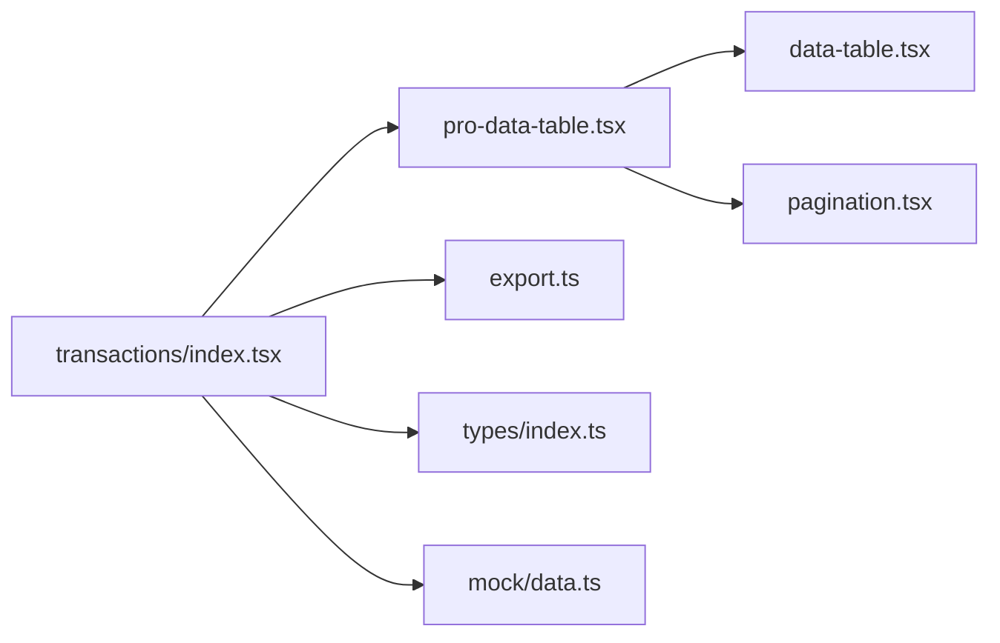

# 交易记录页面

<cite>
**本文引用的文件**   
- [web/src/pages/transactions/index.tsx](file://web/src/pages/transactions/index.tsx)
- [web/src/components/data-table/pro-data-table.tsx](file://web/src/components/data-table/pro-data-table.tsx)
- [web/src/components/data-table/pagination.tsx](file://web/src/components/data-table/pagination.tsx)
- [web/src/components/data-table/data-table.tsx](file://web/src/components/data-table/data-table.tsx)
- [web/src/lib/export.ts](file://web/src/lib/export.ts)
- [web/src/types/index.ts](file://web/src/types/index.ts)
- [web/src/mock/data.ts](file://web/src/mock/data.ts)
</cite>

## 目录
1. [简介](#简介)
2. [项目结构](#项目结构)
3. [核心组件](#核心组件)
4. [架构总览](#架构总览)
5. [详细组件分析](#详细组件分析)
6. [依赖关系分析](#依赖关系分析)
7. [性能考虑](#性能考虑)
8. [故障排查指南](#故障排查指南)
9. [结论](#结论)
10. [附录](#附录)

## 简介
本文件面向“交易记录页面”的完整实现与使用，覆盖以下关键能力：
- 交易流水查看、筛选（时间范围、类型分类、金额区间）、分页加载
- 统计分析与汇总计算、趋势展示、异常检测思路
- 数据导出方案（大文件处理、格式转换、异步下载）
- 性能优化策略（虚拟滚动、预加载、无限滚动）

## 项目结构
交易记录页面位于 pages/transactions，数据表格能力由 data-table 组件提供，导出功能在 lib/export.ts 中实现。类型定义集中于 types/index.ts，开发期可使用 mock 数据。

图表来源
- [web/src/pages/transactions/index.tsx](file://web/src/pages/transactions/index.tsx)
- [web/src/components/data-table/pro-data-table.tsx](file://web/src/components/data-table/pro-data-table.tsx)
- [web/src/components/data-table/data-table.tsx](file://web/src/components/data-table/data-table.tsx)
- [web/src/components/data-table/pagination.tsx](file://web/src/components/data-table/pagination.tsx)
- [web/src/lib/export.ts](file://web/src/lib/export.ts)
- [web/src/types/index.ts](file://web/src/types/index.ts)
- [web/src/mock/data.ts](file://web/src/mock/data.ts)

章节来源
- [web/src/pages/transactions/index.tsx](file://web/src/pages/transactions/index.tsx)
- [web/src/components/data-table/pro-data-table.tsx](file://web/src/components/data-table/pro-data-table.tsx)
- [web/src/components/data-table/pagination.tsx](file://web/src/components/data-table/pagination.tsx)
- [web/src/components/data-table/data-table.tsx](file://web/src/components/data-table/data-table.tsx)
- [web/src/lib/export.ts](file://web/src/lib/export.ts)
- [web/src/types/index.ts](file://web/src/types/index.ts)
- [web/src/mock/data.ts](file://web/src/mock/data.ts)

## 核心组件
- 交易记录页面（transactions/index.tsx）
  - 负责聚合筛选条件、调用数据源、渲染表格与导出入口
  - 支持时间范围、交易类型、金额区间等筛选参数组合
  - 触发分页加载与导出流程
- 专业数据表格（pro-data-table.tsx）
  - 封装分页、排序、筛选、列配置、加载状态、错误处理
  - 可接入虚拟滚动或无限滚动策略
- 分页器（pagination.tsx）
  - 页码切换、每页条数选择、跳转、总数显示
- 基础数据表格（data-table.tsx）
  - 行渲染、列映射、空态与骨架屏
- 导出工具（export.ts）
  - CSV/Excel 生成、分片写入、流式下载、进度反馈
- 类型定义（types/index.ts）
  - 交易记录模型、筛选条件、分页参数、导出选项
- Mock 数据（mock/data.ts）
  - 本地模拟交易数据，便于前端联调与演示

章节来源
- [web/src/pages/transactions/index.tsx](file://web/src/pages/transactions/index.tsx)
- [web/src/components/data-table/pro-data-table.tsx](file://web/src/components/data-table/pro-data-table.tsx)
- [web/src/components/data-table/pagination.tsx](file://web/src/components/data-table/pagination.tsx)
- [web/src/components/data-table/data-table.tsx](file://web/src/components/data-table/data-table.tsx)
- [web/src/lib/export.ts](file://web/src/lib/export.ts)
- [web/src/types/index.ts](file://web/src/types/index.ts)
- [web/src/mock/data.ts](file://web/src/mock/data.ts)

## 架构总览
交易记录页面的数据流与控制流如下：用户操作触发筛选或翻页，页面组装查询参数并请求数据；表格组件负责渲染与交互；导出模块将当前或筛选后的数据集转换为文件并触发下载。

图表来源
- [web/src/pages/transactions/index.tsx](file://web/src/pages/transactions/index.tsx)
- [web/src/components/data-table/pro-data-table.tsx](file://web/src/components/data-table/pro-data-table.tsx)
- [web/src/lib/export.ts](file://web/src/lib/export.ts)

## 详细组件分析

### 交易记录页面（transactions/index.tsx）
职责
- 维护筛选状态：时间范围、交易类型、金额区间
- 管理分页参数：页码、每页大小、排序字段
- 驱动数据加载：根据筛选与分页向数据源请求
- 暴露导出入口：将当前筛选结果传递给导出模块
- 展示统计概览：汇总金额、笔数、趋势指标（可与图表组件集成）

关键交互
- 筛选变更时重置到第一页并重新拉取
- 翻页时仅更新页码并增量加载
- 导出前校验筛选条件与数据量阈值

章节来源
- [web/src/pages/transactions/index.tsx](file://web/src/pages/transactions/index.tsx)

### 专业数据表格（pro-data-table.tsx）
职责
- 统一分页、排序、筛选、列定义、加载与错误状态
- 提供虚拟滚动与无限滚动的可选策略
- 对外暴露刷新、跳转、批量操作等能力

内部流程
- 接收 props：列定义、数据、分页参数、筛选回调
- 渲染表头与行，绑定事件（排序、筛选、分页）
- 当页码或筛选变化时，向上回调以触发数据重拉取
- 大数据集下启用虚拟滚动以减少 DOM 节点数量

章节来源
- [web/src/components/data-table/pro-data-table.tsx](file://web/src/components/data-table/pro-data-table.tsx)

### 分页器（pagination.tsx）
职责
- 展示总条数、当前页、每页条数
- 支持上一页/下一页、指定页跳转、改变每页条数
- 与上层表格联动，触发数据刷新

章节来源
- [web/src/components/data-table/pagination.tsx](file://web/src/components/data-table/pagination.tsx)

### 基础数据表格（data-table.tsx）
职责
- 基于列配置渲染行与单元格
- 处理空数据、加载中骨架屏、错误提示
- 为专业表格提供底层渲染能力

章节来源
- [web/src/components/data-table/data-table.tsx](file://web/src/components/data-table/data-table.tsx)

### 导出工具（export.ts）
职责
- 将筛选后的交易数据转换为 CSV/Excel
- 对大文件采用分片/流式写入，避免内存峰值过高
- 通过 Blob + URL.createObjectURL 触发浏览器下载
- 提供进度回调与取消机制（可选）

最佳实践
- 限制单次导出最大行数，必要时引导分批导出
- 优先使用服务端导出接口（如返回文件流），前端仅做触发与进度展示
- 对敏感字段进行脱敏后再导出

章节来源
- [web/src/lib/export.ts](file://web/src/lib/export.ts)

### 类型定义（types/index.ts）
职责
- 定义交易记录实体字段（如交易ID、时间、类型、金额、账户等）
- 定义筛选条件对象（时间起止、类型集合、金额上下界）
- 定义分页参数（页码、每页大小、排序字段/方向）
- 定义导出选项（格式、文件名、是否包含筛选条件）

章节来源
- [web/src/types/index.ts](file://web/src/types/index.ts)

### Mock 数据（mock/data.ts）
职责
- 提供符合交易记录类型的示例数据
- 支持按筛选条件过滤与分页切片，用于前端独立调试

章节来源
- [web/src/mock/data.ts](file://web/src/mock/data.ts)

## 依赖关系分析
- transactions/index.tsx 依赖 pro-data-table.tsx 完成列表渲染与交互
- pro-data-table.tsx 依赖 data-table.tsx 与 pagination.tsx 完成基础渲染与分页
- transactions/index.tsx 依赖 export.ts 完成导出
- 所有组件共享 types/index.ts 的类型契约
- 开发阶段可替换为 mock/data.ts 的数据源

图表来源
- [web/src/pages/transactions/index.tsx](file://web/src/pages/transactions/index.tsx)
- [web/src/components/data-table/pro-data-table.tsx](file://web/src/components/data-table/pro-data-table.tsx)
- [web/src/components/data-table/data-table.tsx](file://web/src/components/data-table/data-table.tsx)
- [web/src/components/data-table/pagination.tsx](file://web/src/components/data-table/pagination.tsx)
- [web/src/lib/export.ts](file://web/src/lib/export.ts)
- [web/src/types/index.ts](file://web/src/types/index.ts)
- [web/src/mock/data.ts](file://web/src/mock/data.ts)

章节来源
- [web/src/pages/transactions/index.tsx](file://web/src/pages/transactions/index.tsx)
- [web/src/components/data-table/pro-data-table.tsx](file://web/src/components/data-table/pro-data-table.tsx)
- [web/src/components/data-table/data-table.tsx](file://web/src/components/data-table/data-table.tsx)
- [web/src/components/data-table/pagination.tsx](file://web/src/components/data-table/pagination.tsx)
- [web/src/lib/export.ts](file://web/src/lib/export.ts)
- [web/src/types/index.ts](file://web/src/types/index.ts)
- [web/src/mock/data.ts](file://web/src/mock/data.ts)

## 性能考虑
- 虚拟滚动
  - 适用场景：单页数据量大（例如 > 500 行）
  - 要点：固定行高或估算行高，只渲染可视区域节点，监听滚动位置动态装载
- 预加载
  - 在接近页尾时提前请求下一页数据，减少等待感
  - 结合去抖与节流，避免重复请求
- 无限滚动
  - 适合“持续浏览”的场景，按需追加数据
  - 注意内存管理与历史回退时的数据重建
- 分页策略
  - 默认使用服务端分页，减少传输体积
  - 客户端分页仅在小数据集时使用
- 导出优化
  - 大文件分片生成，流式写入磁盘或内存缓冲
  - 优先走服务端导出接口，前端仅负责触发与进度展示

[本节为通用性能建议，不直接分析具体文件]

## 故障排查指南
常见问题与定位思路
- 筛选后无数据
  - 检查筛选条件是否为空或冲突
  - 确认分页参数是否正确重置到第一页
  - 核对后端/Mock 返回结构与类型定义一致
- 翻页卡顿或白屏
  - 评估是否启用了虚拟滚动
  - 检查行高是否稳定，避免频繁重排
  - 观察是否有大量同步计算阻塞主线程
- 导出失败或卡死
  - 检查数据量是否超过阈值
  - 确认导出格式与编码是否正确
  - 若使用客户端生成，关注内存占用与分片逻辑

章节来源
- [web/src/pages/transactions/index.tsx](file://web/src/pages/transactions/index.tsx)
- [web/src/components/data-table/pro-data-table.tsx](file://web/src/components/data-table/pro-data-table.tsx)
- [web/src/lib/export.ts](file://web/src/lib/export.ts)

## 结论
交易记录页面通过“页面 + 专业表格 + 分页器 + 导出工具”的组合，实现了完整的交易流水查看、筛选、分页与导出能力。配合虚拟滚动、预加载与无限滚动等策略，可在大数据量场景下保持流畅体验。导出方面建议优先采用服务端导出，前端聚焦于交互与进度反馈。

[本节为总结性内容，不直接分析具体文件]

## 附录

### 筛选与查询能力清单
- 时间范围筛选：起始时间与结束时间
- 交易类型分类：多选或单选
- 金额区间查询：最小值与最大值
- 排序：按时间、金额、类型等字段升/降序

章节来源
- [web/src/pages/transactions/index.tsx](file://web/src/pages/transactions/index.tsx)
- [web/src/types/index.ts](file://web/src/types/index.ts)

### 统计分析能力清单
- 汇总计算：总金额、总笔数、平均金额
- 趋势分析：按日/周/月维度聚合，绘制折线/柱状图
- 异常检测：金额离群、频次突增、类型分布异常

章节来源
- [web/src/pages/transactions/index.tsx](file://web/src/pages/transactions/index.tsx)

### 导出方案要点
- 格式：CSV、Excel（xlsx）
- 大文件处理：分片写入、流式生成、压缩打包
- 异步下载：Blob + URL.createObjectURL，支持进度与取消
- 安全：字段脱敏、权限校验、审计日志

章节来源
- [web/src/lib/export.ts](file://web/src/lib/export.ts)
- [web/src/types/index.ts](file://web/src/types/index.ts)