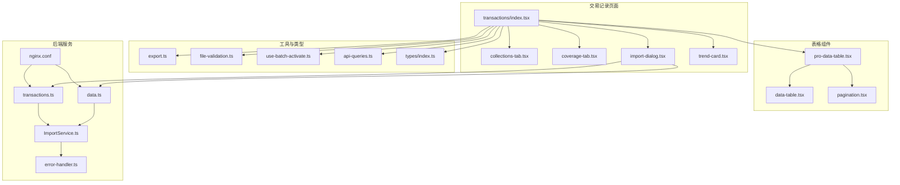
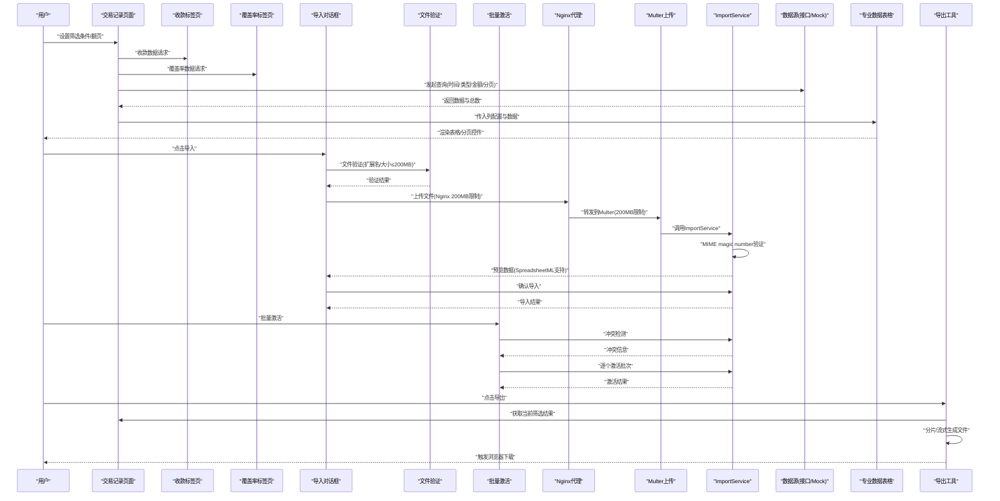
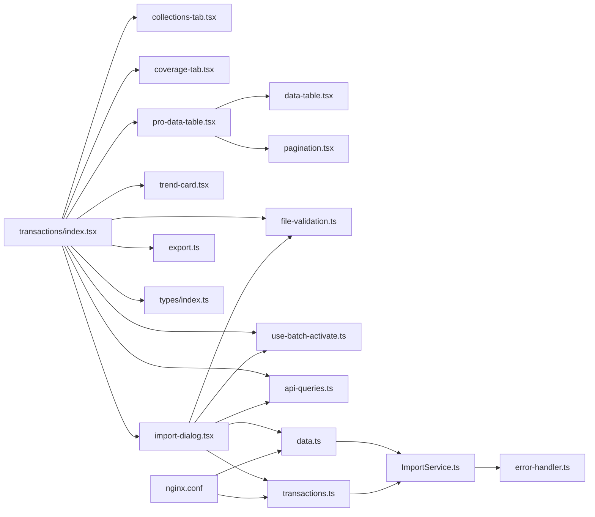

# 交易记录页面

<cite>
**本文引用的文件**   
- [web/src/pages/transactions/index.tsx](file://web/src/pages/transactions/index.tsx)
- [web/src/pages/transactions/collections-tab.tsx](file://web/src/pages/transactions/collections-tab.tsx)
- [web/src/pages/transactions/coverage-tab.tsx](file://web/src/pages/transactions/coverage-tab.tsx)
- [web/src/pages/transactions/import-dialog.tsx](file://web/src/pages/transactions/import-dialog.tsx)
- [web/src/pages/transactions/trend-card.tsx](file://web/src/pages/transactions/trend-card.tsx)
- [web/src/components/data-table/pro-data-table.tsx](file://web/src/components/data-table/pro-data-table.tsx)
- [web/src/components/data-table/pagination.tsx](file://web/src/components/data-table/pagination.tsx)
- [web/src/components/data-table/data-table.tsx](file://web/src/components/data-table/data-table.tsx)
- [web/src/lib/export.ts](file://web/src/lib/export.ts)
- [web/src/lib/file-validation.ts](file://web/src/lib/file-validation.ts)
- [web/src/hooks/use-batch-activate.ts](file://web/src/hooks/use-batch-activate.ts)
- [web/src/hooks/api-queries.ts](file://web/src/hooks/api-queries.ts)
- [web/src/types/index.ts](file://web/src/types/index.ts)
- [server/src/routes/data.ts](file://server/src/routes/data.ts)
- [server/src/routes/transactions.ts](file://server/src/routes/transactions.ts)
- [server/src/services/ImportService.ts](file://server/src/services/ImportService.ts)
- [server/src/middleware/error-handler.ts](file://server/src/middleware/error-handler.ts)
- [web/nginx.conf](file://web/nginx.conf)
</cite>

## 更新摘要
**变更内容**   
- **重大更新**：Excel导入功能全面升级，支持SpreadsheetML XML格式（ERP系统导出的伪.xls文件）
- **文件大小限制提升**：从50MB提升至200MB，涵盖前端验证、后端Multer配置、Nginx代理设置等所有层级
- **多层级安全校验机制**：前端扩展名验证 + 后端MIME magic number验证，确保文件安全性
- **增强的错误处理**：针对大文件上传的专门错误提示和处理逻辑
- **优化的大文件处理**：Nginx配置优化，支持200MB文件的稳定传输

## 目录
1. [简介](#简介)
2. [项目结构](#项目结构)
3. [核心组件](#核心组件)
4. [架构总览](#架构总览)
5. [详细组件分析](#详细组件分析)
6. [依赖关系分析](#依赖关系分析)
7. [性能考虑](#性能考虑)
8. [故障排查指南](#故障排查指南)
9. [结论](#结论)
10. [附录](#附录)

## 简介
本文件面向"交易记录页面"的完整实现与使用，覆盖以下关键能力：
- 交易流水查看、筛选（时间范围、类型分类、金额区间）、分页加载
- 统计分析与汇总计算、趋势展示、异常检测思路
- 数据导出方案（大文件处理、格式转换、异步下载）
- 性能优化策略（虚拟滚动、预加载、无限滚动）
- 用户界面优化和一致性改进
- **重大更新**：增强的Excel导入功能，支持SpreadsheetML XML格式和200MB大文件上传

## 项目结构
交易记录页面位于 pages/transactions，包含多个功能子组件：主页面index.tsx负责整体布局和数据管理，collections-tab.tsx处理收款相关功能，coverage-tab.tsx处理覆盖率统计，import-dialog.tsx提供数据导入功能，trend-card.tsx展示趋势分析。数据表格能力由 data-table 组件提供，导出功能在 lib/export.ts 中实现。类型定义集中于 types/index.ts。**新增的文件验证和批量激活功能**通过独立的模块提供。

**图表来源**
- [web/src/pages/transactions/index.tsx](file://web/src/pages/transactions/index.tsx)
- [web/src/pages/transactions/collections-tab.tsx](file://web/src/pages/transactions/collections-tab.tsx)
- [web/src/pages/transactions/coverage-tab.tsx](file://web/src/pages/transactions/coverage-tab.tsx)
- [web/src/pages/transactions/import-dialog.tsx](file://web/src/pages/transactions/import-dialog.tsx)
- [web/src/pages/transactions/trend-card.tsx](file://web/src/pages/transactions/trend-card.tsx)
- [web/src/components/data-table/pro-data-table.tsx](file://web/src/components/data-table/pro-data-table.tsx)
- [web/src/components/data-table/data-table.tsx](file://web/src/components/data-table/data-table.tsx)
- [web/src/components/data-table/pagination.tsx](file://web/src/components/data-table/pagination.tsx)
- [web/src/lib/export.ts](file://web/src/lib/export.ts)
- [web/src/lib/file-validation.ts](file://web/src/lib/file-validation.ts)
- [web/src/hooks/use-batch-activate.ts](file://web/src/hooks/use-batch-activate.ts)
- [web/src/hooks/api-queries.ts](file://web/src/hooks/api-queries.ts)
- [web/src/types/index.ts](file://web/src/types/index.ts)
- [server/src/routes/data.ts](file://server/src/routes/data.ts)
- [server/src/routes/transactions.ts](file://server/src/routes/transactions.ts)
- [server/src/services/ImportService.ts](file://server/src/services/ImportService.ts)
- [server/src/middleware/error-handler.ts](file://server/src/middleware/error-handler.ts)
- [web/nginx.conf](file://web/nginx.conf)

## 核心组件
- 交易记录主页面（transactions/index.tsx）
  - 负责聚合筛选条件、调用数据源、渲染表格与导出入口
  - 支持时间范围、交易类型、金额区间等筛选参数组合
  - 触发分页加载与导出流程
  - 集成各功能子组件的统一管理
- 收款标签页（collections-tab.tsx）
  - 专门处理收款相关的交易记录和统计
  - 提供收款数据的筛选和分析功能
- 覆盖率标签页（coverage-tab.tsx）
  - 展示交易覆盖率的统计信息
  - 提供覆盖率分析和可视化展示
- **增强版**导入对话框（import-dialog.tsx）
  - 提供交易数据的批量导入功能
  - 支持多种文件格式的解析和验证
  - **重大更新**：支持SpreadsheetML XML格式，最大200MB文件大小限制，批量激活支持
  - 提供数据预览和错误处理机制
- 趋势卡片（trend-card.tsx）
  - 展示交易趋势的可视化卡片
  - 提供关键指标的概览展示
- 专业数据表格（pro-data-table.tsx）
  - 封装分页、排序、筛选、列配置、加载状态、错误处理
  - 可接入虚拟滚动或无限滚动策略
- 分页器（pagination.tsx）
  - 页码切换、每页条数选择、跳转、总数显示
- 基础数据表格（data-table.tsx）
  - 行渲染、列映射、空态与骨架屏
- 导出工具（export.ts）
  - CSV/Excel 生成、分片写入、流式下载、进度反馈
- **重大更新**文件验证工具（file-validation.ts）
  - Excel文件扩展名验证（.xlsx/.xls）
  - **文件大小限制提升至200MB**
  - 统一的文件校验接口
- **新增**批量激活钩子（use-batch-activate.ts）
  - 批量激活编排和冲突检测
  - 进度跟踪和结果汇总
  - 冲突确认和覆盖风险提示
- API查询钩子（api-queries.ts）
  - 集中封装API调用和缓存管理
  - 新增交易导入相关的查询函数
- 类型定义（types/index.ts）
  - 交易记录模型、筛选条件、分页参数、导出选项
  - **新增**：导入预览、上传结果、批量激活相关类型

**章节来源**
- [web/src/pages/transactions/index.tsx](file://web/src/pages/transactions/index.tsx)
- [web/src/pages/transactions/collections-tab.tsx](file://web/src/pages/transactions/collections-tab.tsx)
- [web/src/pages/transactions/coverage-tab.tsx](file://web/src/pages/transactions/coverage-tab.tsx)
- [web/src/pages/transactions/import-dialog.tsx](file://web/src/pages/transactions/import-dialog.tsx)
- [web/src/pages/transactions/trend-card.tsx](file://web/src/pages/transactions/trend-card.tsx)
- [web/src/components/data-table/pro-data-table.tsx](file://web/src/components/data-table/pro-data-table.tsx)
- [web/src/components/data-table/pagination.tsx](file://web/src/components/data-table/pagination.tsx)
- [web/src/components/data-table/data-table.tsx](file://web/src/components/data-table/data-table.tsx)
- [web/src/lib/export.ts](file://web/src/lib/export.ts)
- [web/src/lib/file-validation.ts](file://web/src/lib/file-validation.ts)
- [web/src/hooks/use-batch-activate.ts](file://web/src/hooks/use-batch-activate.ts)
- [web/src/hooks/api-queries.ts](file://web/src/hooks/api-queries.ts)
- [web/src/types/index.ts](file://web/src/types/index.ts)

## 架构总览
交易记录页面的数据流与控制流如下：用户操作触发筛选或翻页，页面组装查询参数并请求数据；表格组件负责渲染与交互；导出模块将当前或筛选后的数据集转换为文件并触发下载。**重大更新的导入功能**提供了完整的文件验证、预览、上传和激活流程，支持SpreadsheetML XML格式和200MB大文件处理，具备多层级安全校验机制。

**图表来源**
- [web/src/pages/transactions/index.tsx](file://web/src/pages/transactions/index.tsx)
- [web/src/pages/transactions/collections-tab.tsx](file://web/src/pages/transactions/collections-tab.tsx)
- [web/src/pages/transactions/coverage-tab.tsx](file://web/src/pages/transactions/coverage-tab.tsx)
- [web/src/pages/transactions/import-dialog.tsx](file://web/src/pages/transactions/import-dialog.tsx)
- [web/src/lib/file-validation.ts](file://web/src/lib/file-validation.ts)
- [web/src/hooks/use-batch-activate.ts](file://web/src/hooks/use-batch-activate.ts)
- [web/src/components/data-table/pro-data-table.tsx](file://web/src/components/data-table/pro-data-table.tsx)
- [web/src/lib/export.ts](file://web/src/lib/export.ts)
- [web/nginx.conf](file://web/nginx.conf)
- [server/src/routes/data.ts](file://server/src/routes/data.ts)
- [server/src/routes/transactions.ts](file://server/src/routes/transactions.ts)
- [server/src/services/ImportService.ts](file://server/src/services/ImportService.ts)

## 详细组件分析

### 交易记录主页面（transactions/index.tsx）
职责
- 维护筛选状态：时间范围、交易类型、金额区间
- 管理分页参数：页码、每页大小、排序字段
- 驱动数据加载：根据筛选与分页向数据源请求
- 暴露导出入口：将当前筛选结果传递给导出模块
- 展示统计概览：汇总金额、笔数、趋势指标
- 集成子组件：统一管理收款、覆盖率、导入等功能

关键交互
- 筛选变更时重置到第一页并重新拉取
- 翻页时仅更新页码并增量加载
- 导出前校验筛选条件与数据量阈值
- 子组件状态同步和事件处理

**章节来源**
- [web/src/pages/transactions/index.tsx](file://web/src/pages/transactions/index.tsx)

### 收款标签页（collections-tab.tsx）
职责
- 专门处理收款相关的交易记录展示
- 提供收款数据的筛选、排序和统计功能
- 集成收款特有的业务逻辑和展示需求

功能特性
- 收款类型分类和筛选
- 收款金额统计和趋势分析
- 收款账户管理和对账功能

**章节来源**
- [web/src/pages/transactions/collections-tab.tsx](file://web/src/pages/transactions/collections-tab.tsx)

### 覆盖率标签页（coverage-tab.tsx）
职责
- 展示交易数据的覆盖率统计信息
- 提供覆盖率分析和可视化展示
- 支持覆盖率趋势和对比分析

功能特性
- 覆盖率指标计算和展示
- 时间维度覆盖率分析
- 覆盖率异常检测和预警

**章节来源**
- [web/src/pages/transactions/coverage-tab.tsx](file://web/src/pages/transactions/coverage-tab.tsx)

### **重大更新**导入对话框（import-dialog.tsx）
职责
- 提供交易数据的批量导入功能
- 支持多种文件格式的解析和验证
- 提供数据预览和错误处理机制

**重大更新功能特性**
- **SpreadsheetML XML支持**：支持ERP系统导出的伪.xls文件（实际为XML格式）
- **文件大小限制提升至200MB**：从50MB大幅提升，满足ERP大账龄报表需求
- **多层级安全验证**：前端扩展名验证 + 后端MIME magic number验证
- **批量激活支持**：支持多个批次的统一激活操作
- **冲突检测**：激活前检测数据冲突，提供覆盖确认
- **多文件选择**：支持同时选择最多12个文件进行批量处理
- **分步操作流程**：选择文件 → 预览数据 → 确认导入 → 批量激活

**技术实现**
- 使用validateExcelFile函数进行文件验证（200MB限制）
- ImportService.assertExcelMagic()进行MIME magic number验证
- 支持三种文件格式：.xlsx (ZIP格式)、.xls (OLE2格式)、SpreadsheetML XML
- 集成useBatchActivate钩子处理批量激活逻辑
- 实现三步向导式用户体验
- 提供详细的错误提示和进度反馈

**章节来源**
- [web/src/pages/transactions/import-dialog.tsx](file://web/src/pages/transactions/import-dialog.tsx)

### **重大更新**文件验证工具（file-validation.ts）
职责
- 提供统一的Excel文件验证功能
- 支持扩展名检查和文件大小验证
- 为导入功能提供安全保证

**重大更新核心功能**
- **扩展名验证**：仅允许.xlsx和.xls格式
- **文件大小限制提升至200MB**：MAX_UPLOAD_SIZE = 200 * 1024 * 1024
- **统一接口**：返回标准化的验证结果对象
- **安全校验**：前端第一道防线，后端进行MIME magic number验证

**章节来源**
- [web/src/lib/file-validation.ts](file://web/src/lib/file-validation.ts)

### **新增**批量激活钩子（use-batch-activate.ts）
职责
- 编排批量激活流程
- 处理冲突检测和覆盖确认
- 跟踪激活进度和结果

**核心功能**
- **冲突检测**：检查激活后将替换的已生效组合
- **批量执行**：串行逐个激活，单批失败不中断其余
- **进度跟踪**：实时显示激活进度和当前处理文件
- **结果汇总**：统计成功和失败数量，提供详细错误信息
- **确认机制**：构建冲突描述，提供风险确认弹窗

**数据结构**
- BatchActivateProgress：进度快照
- BatchActivateResult：单批次激活结果
- BatchActivateSummary：批量激活完成汇总
- BatchActivateCheckSummary：批量激活预检摘要

**章节来源**
- [web/src/hooks/use-batch-activate.ts](file://web/src/hooks/use-batch-activate.ts)

### 趋势卡片（trend-card.tsx）
职责
- 展示交易趋势的可视化卡片组件
- 提供关键指标的概览展示
- 支持趋势分析和数据对比

功能特性
- 趋势图表展示
- 关键指标高亮显示
- 交互式数据探索

**章节来源**
- [web/src/pages/transactions/trend-card.tsx](file://web/src/pages/transactions/trend-card.tsx)

### 专业数据表格（pro-data-table.tsx）
职责
- 统一分页、排序、筛选、列定义、加载与错误状态
- 提供虚拟滚动与无限滚动的可选策略
- 对外暴露刷新、跳转、批量操作等能力

内部流程
- 接收 props：列定义、数据、分页参数、筛选回调
- 渲染表头与行，绑定事件（排序、筛选、分页）
- 当页码或筛选变化时，向上回调以触发数据重拉取
- 大数据集下启用虚拟滚动以减少 DOM 节点数量

**章节来源**
- [web/src/components/data-table/pro-data-table.tsx](file://web/src/components/data-table/pro-data-table.tsx)

### 分页器（pagination.tsx）
职责
- 展示总条数、当前页、每页条数
- 支持上一页/下一页、指定页跳转、改变每页条数
- 与上层表格联动，触发数据刷新

**章节来源**
- [web/src/components/data-table/pagination.tsx](file://web/src/components/data-table/pagination.tsx)

### 基础数据表格（data-table.tsx）
职责
- 基于列配置渲染行与单元格
- 处理空数据、加载中骨架屏、错误提示
- 为专业表格提供底层渲染能力

**章节来源**
- [web/src/components/data-table/data-table.tsx](file://web/src/components/data-table/data-table.tsx)

### 导出工具（export.ts）
职责
- 将筛选后的交易数据转换为 CSV/Excel
- 对大文件采用分片/流式写入，避免内存峰值过高
- 通过 Blob + URL.createObjectURL 触发浏览器下载
- 提供进度回调与取消机制（可选）

最佳实践
- 限制单次导出最大行数，必要时引导分批导出
- 优先使用服务端导出接口（如返回文件流），前端仅做触发与进度展示
- 对敏感字段进行脱敏后再导出

**章节来源**
- [web/src/lib/export.ts](file://web/src/lib/export.ts)

### **重大更新**后端路由配置（data.ts, transactions.ts）
职责
- 处理Excel文件上传和导入请求
- 配置Multer文件上传限制
- 提供导入预览、上传、激活等API接口

**重大更新配置**
- **Multer配置**：`limits: { fileSize: 200 * 1024 * 1024 }`（200MB限制）
- **多文件上传支持**：`upload.array('files', 12)` 支持最多12个文件
- **文件扩展名校验**：`/\.(xlsx|xls)$/i.test(originalname)`
- **内存存储**：`multer.memoryStorage()` 避免磁盘IO瓶颈

**章节来源**
- [server/src/routes/data.ts](file://server/src/routes/data.ts)
- [server/src/routes/transactions.ts](file://server/src/routes/transactions.ts)

### **重大更新**导入服务（ImportService.ts）
职责
- 处理Excel文件解析和验证
- 管理导入批次生命周期
- 提供数据预览和激活功能

**重大更新核心功能**
- **SpreadsheetML XML支持**：支持ERP系统导出的伪.xls文件
- **三层MIME验证**：
  - `.xlsx`: ZIP格式 (50 4B 03 04)
  - `.xls`: OLE2格式 (D0 CF 11 E0 A1 B1 1A E1)  
  - **新增**: SpreadsheetML XML (`<?xml` 前缀，支持UTF-8 BOM跳过)
- **文件大小限制**：配合Multer的200MB限制
- **文件去重**：基于SHA256哈希避免重复导入
- **批量处理**：支持多文件并行处理和错误隔离

**章节来源**
- [server/src/services/ImportService.ts](file://server/src/services/ImportService.ts)

### **重大更新**错误处理中间件（error-handler.ts）
职责
- 全局错误处理和统一响应
- Multer上传错误专门处理
- 数据库错误和参数验证错误处理

**重大更新错误处理**
- **Multer错误专门处理**：`LIMIT_FILE_SIZE` 错误返回"文件超过 200MB 上限"
- **统一错误格式**：所有错误返回标准化JSON格式
- **日志记录**：不同级别错误的分级日志记录
- **安全保护**：500错误不泄露堆栈信息

**章节来源**
- [server/src/middleware/error-handler.ts](file://server/src/middleware/error-handler.ts)

### **重大更新**Nginx代理配置（nginx.conf）
职责
- HTTP服务器配置和反向代理
- 静态资源缓存和安全头设置
- 大文件上传优化配置

**重大更新配置**
- **全局文件大小限制**：`client_max_body_size 200M;`
- **专用上传路径优化**：
  - `/api/v1/data/imports`：`client_max_body_size 200M;`
  - `/api/v1/transactions/import`：`client_max_body_size 200M;`
- **大文件传输优化**：
  - `proxy_request_buffering off;` 禁用请求缓冲
  - `proxy_read_timeout 300s;` 延长读取超时
  - `proxy_send_timeout 300s;` 延长发送超时

**章节来源**
- [web/nginx.conf](file://web/nginx.conf)

### API查询钩子（api-queries.ts）
职责
- 集中封装React Query的API调用和缓存管理
- 提供事务导入相关的查询函数
- 管理查询失效和缓存策略

**新增函数**
- usePreviewTransactionImport：交易导入预览
- useImportTransactions：交易导入上传
- useActivateImport：单个批次激活
- useBatchActivateCheck：批量激活预检

**章节来源**
- [web/src/hooks/api-queries.ts](file://web/src/hooks/api-queries.ts)

### 类型定义（types/index.ts）
职责
- 定义交易记录实体字段（如交易ID、时间、类型、金额、账户等）
- 定义筛选条件对象（时间起止、类型集合、金额上下界）
- 定义分页参数（页码、每页大小、排序字段/方向）
- 定义导出选项（格式、文件名、是否包含筛选条件）

**新增类型**
- TransactionImportPreview：导入预览数据结构
- TransactionImportUploadResult：导入上传结果
- TransactionActivationImpact：激活影响预测
- ActivateConflict：激活冲突项
- BatchActivateCheckItem：批量激活预检项
- BatchActivateCheckResult：批量激活预检结果

**章节来源**
- [web/src/types/index.ts](file://web/src/types/index.ts)

## 依赖关系分析
- transactions/index.tsx 依赖 collections-tab.tsx、coverage-tab.tsx、import-dialog.tsx、trend-card.tsx 完成功能扩展
- transactions/index.tsx 依赖 pro-data-table.tsx 完成列表渲染与交互
- pro-data-table.tsx 依赖 data-table.tsx 与 pagination.tsx 完成基础渲染与分页
- transactions/index.tsx 依赖 export.ts 完成导出
- import-dialog.tsx 依赖 file-validation.ts 完成文件验证
- import-dialog.tsx 依赖 use-batch-activate.ts 完成批量激活
- 所有组件共享 types/index.ts 的类型契约
- **新增**：后端路由依赖ImportService进行文件处理
- **新增**：Nginx配置作为前端和后端的代理层

**图表来源**
- [web/src/pages/transactions/index.tsx](file://web/src/pages/transactions/index.tsx)
- [web/src/pages/transactions/collections-tab.tsx](file://web/src/pages/transactions/collections-tab.tsx)
- [web/src/pages/transactions/coverage-tab.tsx](file://web/src/pages/transactions/coverage-tab.tsx)
- [web/src/pages/transactions/import-dialog.tsx](file://web/src/pages/transactions/import-dialog.tsx)
- [web/src/pages/transactions/trend-card.tsx](file://web/src/pages/transactions/trend-card.tsx)
- [web/src/components/data-table/pro-data-table.tsx](file://web/src/components/data-table/pro-data-table.tsx)
- [web/src/components/data-table/data-table.tsx](file://web/src/components/data-table/data-table.tsx)
- [web/src/components/data-table/pagination.tsx](file://web/src/components/data-table/pagination.tsx)
- [web/src/lib/export.ts](file://web/src/lib/export.ts)
- [web/src/lib/file-validation.ts](file://web/src/lib/file-validation.ts)
- [web/src/hooks/use-batch-activate.ts](file://web/src/hooks/use-batch-activate.ts)
- [web/src/hooks/api-queries.ts](file://web/src/hooks/api-queries.ts)
- [web/src/types/index.ts](file://web/src/types/index.ts)
- [server/src/routes/data.ts](file://server/src/routes/data.ts)
- [server/src/routes/transactions.ts](file://server/src/routes/transactions.ts)
- [server/src/services/ImportService.ts](file://server/src/services/ImportService.ts)
- [server/src/middleware/error-handler.ts](file://server/src/middleware/error-handler.ts)
- [web/nginx.conf](file://web/nginx.conf)

## 性能考虑
- 虚拟滚动
  - 适用场景：单页数据量大（例如 > 500 行）
  - 要点：固定行高或估算行高，只渲染可视区域节点，监听滚动位置动态装载
- 预加载
  - 在接近页尾时提前请求下一页数据，减少等待感
  - 结合去抖与节流，避免重复请求
- 无限滚动
  - 适合"持续浏览"的场景，按需追加数据
  - 注意内存管理与历史回退时的数据重建
- 分页策略
  - 默认使用服务端分页，减少传输体积
  - 客户端分页仅在小数据集时使用
- 导出优化
  - 大文件分片生成，流式写入磁盘或内存缓冲
  - 优先走服务端导出接口，前端仅负责触发与进度展示
- 组件懒加载
  - 子组件按需加载，减少初始包体积
  - 使用React.lazy和Suspense优化加载性能
- **重大更新**文件验证优化
  - 前端即时验证，避免无效文件上传
  - 文件大小检查在前端完成，减少网络传输
  - 批量文件处理采用队列机制，避免阻塞UI
- **重大更新**大文件传输优化
  - Nginx禁用请求缓冲，直接流式传输
  - Multer内存存储，避免磁盘IO瓶颈
  - 支持200MB大文件的稳定上传

## 故障排查指南
常见问题与定位思路
- 筛选后无数据
  - 检查筛选条件是否为空或冲突
  - 确认分页参数是否正确重置到第一页
  - 核对后端/Mock 返回结构与类型定义一致
- 翻页卡顿或白屏
  - 评估是否启用了虚拟滚动
  - 检查行高是否稳定，避免频繁重排
  - 观察是否有大量同步计算阻塞主线程
- 导出失败或卡死
  - 检查数据量是否超过阈值
  - 确认导出格式与编码是否正确
  - 若使用客户端生成，关注内存占用与分片逻辑
- 子组件加载异常
  - 检查子组件依赖是否正确引入
  - 确认子组件状态管理是否正常
  - 验证子组件间的数据传递是否正确
- **重大更新**导入功能问题
  - **文件验证失败**：检查文件扩展名和200MB大小限制
  - **SpreadsheetML XML解析错误**：确认文件头是否为`<?xml`且支持UTF-8 BOM
  - **批量激活失败**：查看冲突检测结果和错误信息
  - **预览数据异常**：确认文件格式正确性和数据完整性
  - **大文件上传超时**：检查Nginx和后端超时配置
  - **MIME验证失败**：确认文件实际内容与扩展名匹配

**章节来源**
- [web/src/pages/transactions/index.tsx](file://web/src/pages/transactions/index.tsx)
- [web/src/pages/transactions/collections-tab.tsx](file://web/src/pages/transactions/collections-tab.tsx)
- [web/src/pages/transactions/coverage-tab.tsx](file://web/src/pages/transactions/coverage-tab.tsx)
- [web/src/pages/transactions/import-dialog.tsx](file://web/src/pages/transactions/import-dialog.tsx)
- [web/src/pages/transactions/trend-card.tsx](file://web/src/pages/transactions/trend-card.tsx)
- [web/src/components/data-table/pro-data-table.tsx](file://web/src/components/data-table/pro-data-table.tsx)
- [web/src/lib/export.ts](file://web/src/lib/export.ts)
- [web/src/lib/file-validation.ts](file://web/src/lib/file-validation.ts)
- [web/src/hooks/use-batch-activate.ts](file://web/src/hooks/use-batch-activate.ts)
- [server/src/middleware/error-handler.ts](file://server/src/middleware/error-handler.ts)

## 结论
交易记录页面通过"主页面 + 功能子组件 + 专业表格 + 分页器 + 导出工具"的组合，实现了完整的交易流水查看、筛选、分页、导入、统计与导出能力。**重大更新的导入功能**包括SpreadsheetML XML格式支持和200MB大文件上传，进一步提升了系统的兼容性和处理能力。配合虚拟滚动、预加载与无限滚动等策略，可在大数据量场景下保持流畅体验。导出方面建议优先采用服务端导出，前端聚焦于交互与进度反馈。**新增的多层级安全验证机制**确保了文件上传的安全性，从前端扩展到后端MIME验证形成完整的安全防护链。

## 附录

### 筛选与查询能力清单
- 时间范围筛选：起始时间与结束时间
- 交易类型分类：多选或单选
- 金额区间查询：最小值与最大值
- 排序：按时间、金额、类型等字段升/降序
- 收款特定筛选：收款账户、收款方式、收款状态
- 覆盖率筛选：时间维度、业务维度

### 统计分析能力清单
- 汇总计算：总金额、总笔数、平均金额
- 趋势分析：按日/周/月维度聚合，绘制折线/柱状图
- 异常检测：金额离群、频次突增、类型分布异常
- 覆盖率分析：数据完整性、缺失率、异常率
- 收款统计：收款总额、收款笔数、平均收款金额

### 导出方案要点
- 格式：CSV、Excel（xlsx）
- 大文件处理：分片写入、流式生成、压缩打包
- 异步下载：Blob + URL.createObjectURL，支持进度与取消
- 安全：字段脱敏、权限校验、审计日志
- 子组件导出：支持按功能模块选择性导出

### **重大更新**导入功能特性
- **SpreadsheetML XML支持**：支持ERP系统导出的伪.xls文件（XML格式）
- **文件大小限制提升至200MB**：从50MB大幅提升，满足ERP大账龄报表需求
- **多层级安全验证**：前端扩展名验证 + 后端MIME magic number验证
- **批量处理**：支持最多12个文件同时处理
- **预览功能**：导入前预览数据结构和统计信息
- **冲突检测**：激活前检测数据冲突，提供覆盖确认
- **批量激活**：统一激活多个批次，支持进度跟踪
- **错误处理**：详细的错误信息和重试机制

### 用户体验优化要点
- 界面一致性：统一的样式规范和交互模式
- 响应式设计：适配不同屏幕尺寸和设备
- 加载状态：合理的加载指示和错误提示
- 操作反馈：及时的操作结果反馈
- 键盘导航：完善的键盘快捷键支持
- **重大更新**导入向导：三步式操作流程，清晰的步骤指引

### **重大更新**技术规格
- **支持的Excel格式**：
  - .xlsx (ZIP格式，magic: 50 4B 03 04)
  - .xls (OLE2格式，magic: D0 CF 11 E0 A1 B1 1A E1)
  - **新增**: SpreadsheetML XML (magic: <?xml，支持UTF-8 BOM)
- **文件大小限制**：200MB（前端、Multer、Nginx统一配置）
- **并发上传**：最多12个文件同时上传
- **内存优化**：Multer内存存储，避免磁盘IO
- **安全验证**：三层验证（扩展名→MIME magic→业务逻辑）

**章节来源**
- [web/src/pages/transactions/index.tsx](file://web/src/pages/transactions/index.tsx)
- [web/src/pages/transactions/collections-tab.tsx](file://web/src/pages/transactions/collections-tab.tsx)
- [web/src/pages/transactions/coverage-tab.tsx](file://web/src/pages/transactions/coverage-tab.tsx)
- [web/src/pages/transactions/import-dialog.tsx](file://web/src/pages/transactions/import-dialog.tsx)
- [web/src/pages/transactions/trend-card.tsx](file://web/src/pages/transactions/trend-card.tsx)
- [web/src/lib/export.ts](file://web/src/lib/export.ts)
- [web/src/lib/file-validation.ts](file://web/src/lib/file-validation.ts)
- [web/src/hooks/use-batch-activate.ts](file://web/src/hooks/use-batch-activate.ts)
- [web/src/types/index.ts](file://web/src/types/index.ts)
- [server/src/services/ImportService.ts](file://server/src/services/ImportService.ts)
- [server/src/routes/data.ts](file://server/src/routes/data.ts)
- [server/src/routes/transactions.ts](file://server/src/routes/transactions.ts)
- [web/nginx.conf](file://web/nginx.conf)