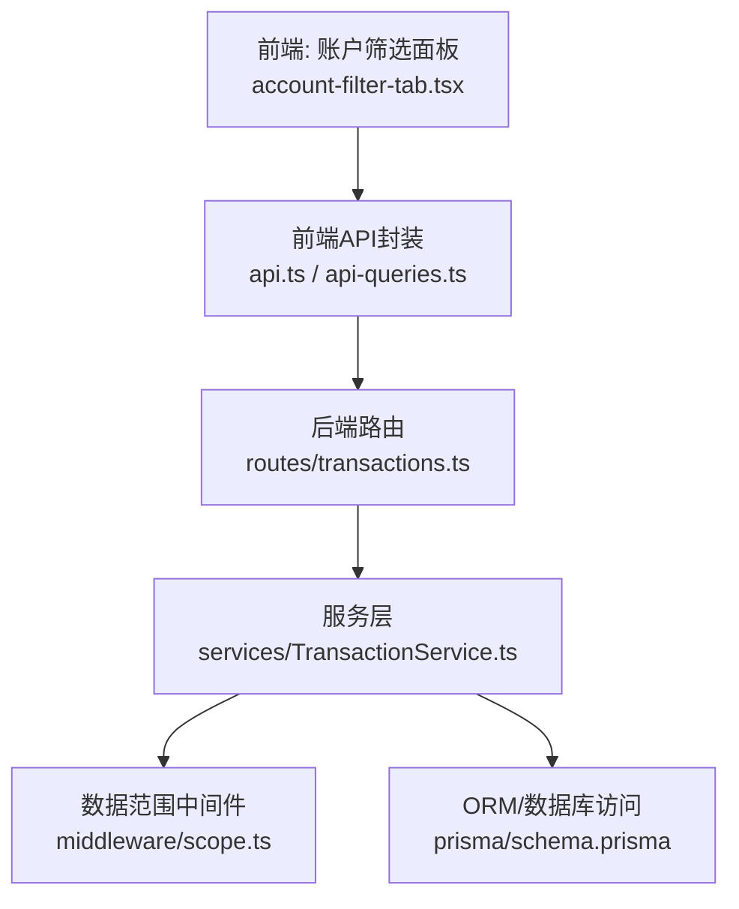
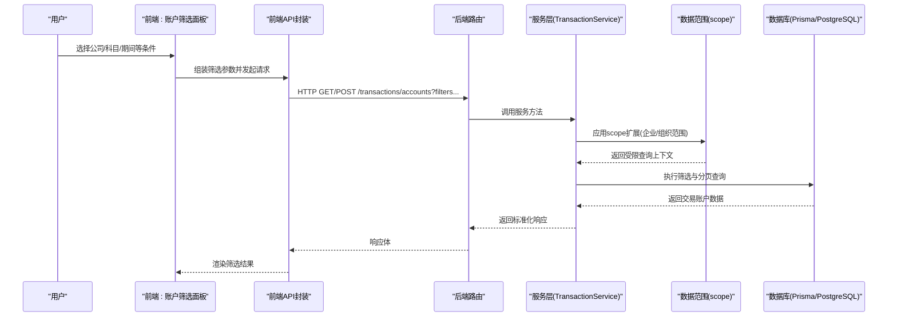
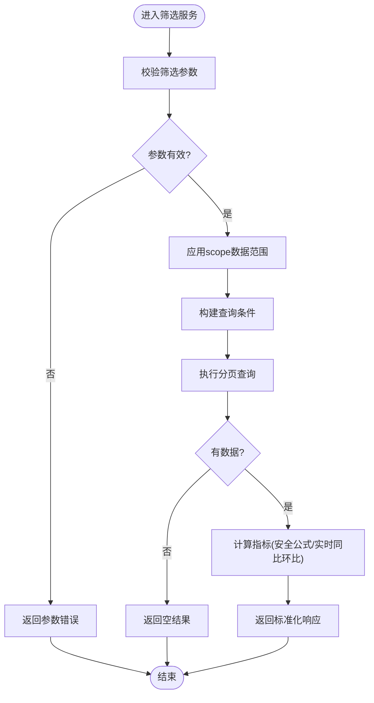
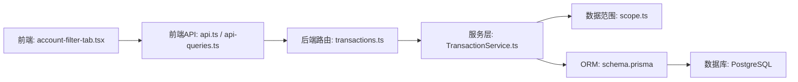

# 交易账户筛选功能

<cite>
**本文引用的文件**   
- [server/src/routes/transactions.ts](file://server/src/routes/transactions.ts)
- [server/src/services/TransactionService.ts](file://server/src/services/TransactionService.ts)
- [server/src/middleware/scope.ts](file://server/src/middleware/scope.ts)
- [server/prisma/schema.prisma](file://server/prisma/schema.prisma)
- [web/src/pages/transactions/account-filter-tab.tsx](file://web/src/pages/transactions/account-filter-tab.tsx)
- [web/src/hooks/api-queries.ts](file://web/src/hooks/api-queries.ts)
- [web/src/lib/api.ts](file://web/src/lib/api.ts)
</cite>

## 目录
1. [简介](#简介)
2. [项目结构](#项目结构)
3. [核心组件](#核心组件)
4. [架构总览](#架构总览)
5. [详细组件分析](#详细组件分析)
6. [依赖关系分析](#依赖关系分析)
7. [性能考量](#性能考量)
8. [故障排查指南](#故障排查指南)
9. [结论](#结论)

## 简介
本文件聚焦“交易账户筛选”能力，覆盖前端交互、后端接口与数据层实现。该功能支持按公司、科目树、期间等维度对交易明细进行过滤，并通过权限与数据范围（scope）控制返回结果，确保多租户与企业级隔离。计算类指标采用安全公式解析，同比/环比由后端实时计算，不持久化。

## 项目结构
围绕交易账户筛选的关键路径：
- 前端页面与交互：交易页签中的账户筛选面板
- 前端 API 封装：查询与参数序列化
- 后端路由：接收请求并委派服务层
- 服务层：业务逻辑、校验、聚合与分页
- 中间件：权限与数据范围（scope）注入
- 数据模型：Prisma Schema 定义交易账户相关字段与索引

**图示来源** 
- [web/src/pages/transactions/account-filter-tab.tsx](file://web/src/pages/transactions/account-filter-tab.tsx)
- [web/src/lib/api.ts](file://web/src/lib/api.ts)
- [web/src/hooks/api-queries.ts](file://web/src/hooks/api-queries.ts)
- [server/src/routes/transactions.ts](file://server/src/routes/transactions.ts)
- [server/src/services/TransactionService.ts](file://server/src/services/TransactionService.ts)
- [server/src/middleware/scope.ts](file://server/src/middleware/scope.ts)
- [server/prisma/schema.prisma](file://server/prisma/schema.prisma)

**章节来源**
- [server/src/routes/transactions.ts](file://server/src/routes/transactions.ts)
- [server/src/services/TransactionService.ts](file://server/src/services/TransactionService.ts)
- [server/src/middleware/scope.ts](file://server/src/middleware/scope.ts)
- [server/prisma/schema.prisma](file://server/prisma/schema.prisma)
- [web/src/pages/transactions/account-filter-tab.tsx](file://web/src/pages/transactions/account-filter-tab.tsx)
- [web/src/hooks/api-queries.ts](file://web/src/hooks/api-queries.ts)
- [web/src/lib/api.ts](file://web/src/lib/api.ts)

## 核心组件
- 前端账户筛选面板：提供公司、科目树、期间等筛选条件输入，触发查询并渲染结果
- 前端 API 封装：将筛选参数序列化为查询字符串，调用后端交易接口
- 后端路由：挂载交易相关接口，鉴权后进入服务层
- 服务层 TransactionService：处理筛选条件、权限与范围、分页、排序与聚合
- 数据范围中间件 scope：基于用户上下文注入 Prisma 扩展，限制可访问的企业/组织范围
- 数据模型 schema：定义交易账户实体、关联关系与必要索引

**章节来源**
- [web/src/pages/transactions/account-filter-tab.tsx](file://web/src/pages/transactions/account-filter-tab.tsx)
- [web/src/hooks/api-queries.ts](file://web/src/hooks/api-queries.ts)
- [web/src/lib/api.ts](file://web/src/lib/api.ts)
- [server/src/routes/transactions.ts](file://server/src/routes/transactions.ts)
- [server/src/services/TransactionService.ts](file://server/src/services/TransactionService.ts)
- [server/src/middleware/scope.ts](file://server/src/middleware/scope.ts)
- [server/prisma/schema.prisma](file://server/prisma/schema.prisma)

## 架构总览
交易账户筛选的请求链路遵循平台统一中间件链：helmet → cors → express.json → rate-limit → auth(JWT+黑名单) → permission(默认拒绝) → scope(Prisma extension) → softDelete → audit → Service → Prisma → PostgreSQL。筛选流程在 service 层完成参数校验、范围注入与查询构建，最终返回分页结果。

**图示来源** 
- [web/src/pages/transactions/account-filter-tab.tsx](file://web/src/pages/transactions/account-filter-tab.tsx)
- [web/src/lib/api.ts](file://web/src/lib/api.ts)
- [web/src/hooks/api-queries.ts](file://web/src/hooks/api-queries.ts)
- [server/src/routes/transactions.ts](file://server/src/routes/transactions.ts)
- [server/src/services/TransactionService.ts](file://server/src/services/TransactionService.ts)
- [server/src/middleware/scope.ts](file://server/src/middleware/scope.ts)
- [server/prisma/schema.prisma](file://server/prisma/schema.prisma)

## 详细组件分析

### 前端账户筛选面板（account-filter-tab.tsx）
- 职责：展示筛选表单（公司、科目树、期间等），维护本地状态，触发查询并渲染结果
- 交互要点：
  - 条件变更时防抖或按需提交
  - 支持多选与搜索（如科目树）
  - 分页与排序联动
- 错误处理：网络异常提示、空结果友好展示

**章节来源**
- [web/src/pages/transactions/account-filter-tab.tsx](file://web/src/pages/transactions/account-filter-tab.tsx)

### 前端 API 封装（api.ts / api-queries.ts）
- 职责：封装交易账户筛选的 HTTP 调用，序列化筛选参数为查询字符串，统一错误处理
- 关键点：
  - 参数编码：公司ID、科目ID、期间起止、分页大小、页码、排序字段
  - 重试与超时策略
  - 与后端响应结构对齐（分页元数据、数据列表）

**章节来源**
- [web/src/lib/api.ts](file://web/src/lib/api.ts)
- [web/src/hooks/api-queries.ts](file://web/src/hooks/api-queries.ts)

### 后端路由（routes/transactions.ts）
- 职责：注册交易相关接口，鉴权后委派至服务层
- 关键点：
  - 路由前缀与HTTP方法
  - 入参校验（可选）
  - 错误透传与统一响应格式

**章节来源**
- [server/src/routes/transactions.ts](file://server/src/routes/transactions.ts)

### 服务层 TransactionService.ts
- 职责：实现交易账户筛选的核心逻辑
- 关键流程：
  - 参数校验与规范化（公司、科目、期间、分页、排序）
  - 应用数据范围（scope）限制
  - 构建查询条件（包含软删除过滤）
  - 执行分页与排序
  - 计算指标（使用安全公式解析，同比/环比实时计算）
- 错误处理：参数非法、权限不足、数据为空等场景

**图示来源** 
- [server/src/services/TransactionService.ts](file://server/src/services/TransactionService.ts)
- [server/src/middleware/scope.ts](file://server/src/middleware/scope.ts)

**章节来源**
- [server/src/services/TransactionService.ts](file://server/src/services/TransactionService.ts)
- [server/src/middleware/scope.ts](file://server/src/middleware/scope.ts)

### 数据范围中间件 scope.ts
- 职责：基于当前用户上下文注入 Prisma 扩展，限制可访问的企业/组织范围
- 关键点：
  - 从请求上下文读取用户权限与组织范围
  - 动态附加 where 条件到所有查询
  - 与软删除、审计日志协同工作

**章节来源**
- [server/src/middleware/scope.ts](file://server/src/middleware/scope.ts)

### 数据模型 schema.prisma
- 职责：定义交易账户实体、关联关系与索引
- 关键点：
  - 交易账户表结构与字段类型
  - 与公司、科目树的关联
  - 常用筛选字段的索引优化

**章节来源**
- [server/prisma/schema.prisma](file://server/prisma/schema.prisma)

## 依赖关系分析
- 前端依赖：React 组件、状态管理、API 封装库
- 后端依赖：Express 路由、服务层、Prisma ORM、PostgreSQL
- 中间件依赖：auth、permission、scope、soft-delete、audit
- 外部依赖：DeepSeek API（AI 管道，非本次筛选主流程）

**图示来源** 
- [web/src/pages/transactions/account-filter-tab.tsx](file://web/src/pages/transactions/account-filter-tab.tsx)
- [web/src/lib/api.ts](file://web/src/lib/api.ts)
- [web/src/hooks/api-queries.ts](file://web/src/hooks/api-queries.ts)
- [server/src/routes/transactions.ts](file://server/src/routes/transactions.ts)
- [server/src/services/TransactionService.ts](file://server/src/services/TransactionService.ts)
- [server/src/middleware/scope.ts](file://server/src/middleware/scope.ts)
- [server/prisma/schema.prisma](file://server/prisma/schema.prisma)

**章节来源**
- [server/src/routes/transactions.ts](file://server/src/routes/transactions.ts)
- [server/src/services/TransactionService.ts](file://server/src/services/TransactionService.ts)
- [server/src/middleware/scope.ts](file://server/src/middleware/scope.ts)
- [server/prisma/schema.prisma](file://server/prisma/schema.prisma)
- [web/src/pages/transactions/account-filter-tab.tsx](file://web/src/pages/transactions/account-filter-tab.tsx)
- [web/src/hooks/api-queries.ts](file://web/src/hooks/api-queries.ts)
- [web/src/lib/api.ts](file://web/src/lib/api.ts)

## 性能考量
- 查询优化：
  - 合理设计筛选字段索引（公司、科目、期间）
  - 避免全表扫描，优先使用精确匹配与范围查询
- 分页与排序：
  - 服务端分页，限制每页大小
  - 排序字段需有索引支持
- 缓存策略：
  - 字典数据（公司、科目树）可前端缓存
  - 频繁筛选条件可考虑短期缓存
- 指标计算：
  - 安全公式解析避免 eval 开销
  - 同比/环比实时计算，注意批量计算时的并发与耗时

[本节为通用指导，不直接分析具体文件]

## 故障排查指南
- 常见错误：
  - 参数非法：检查前端传入的公司ID、科目ID、期间格式
  - 权限不足：确认用户角色与数据范围配置
  - 数据为空：检查筛选条件是否过严或数据未导入
- 调试步骤：
  - 查看浏览器网络请求参数与响应
  - 检查后端日志（错误堆栈、scope 注入结果）
  - 验证数据库查询计划与索引命中
- 恢复建议：
  - 修正参数格式
  - 调整权限与范围配置
  - 补充缺失数据或放宽筛选条件

**章节来源**
- [server/src/services/TransactionService.ts](file://server/src/services/TransactionService.ts)
- [server/src/middleware/scope.ts](file://server/src/middleware/scope.ts)

## 结论
交易账户筛选功能通过前后端协作与严格的权限控制，实现了高效、安全的财务数据检索。前端提供直观的筛选界面，后端通过服务层与中间件保障数据一致性与安全性。建议在后续迭代中进一步优化查询性能与用户体验，并完善监控与告警机制。

[本节为总结性内容，不直接分析具体文件]