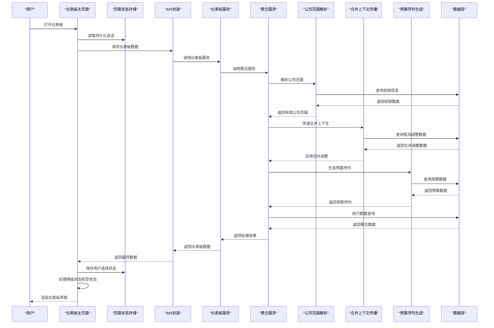
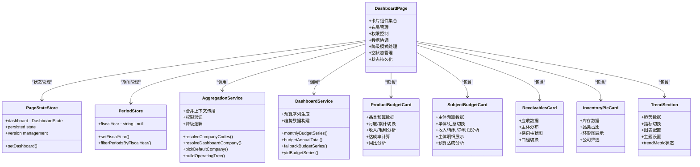
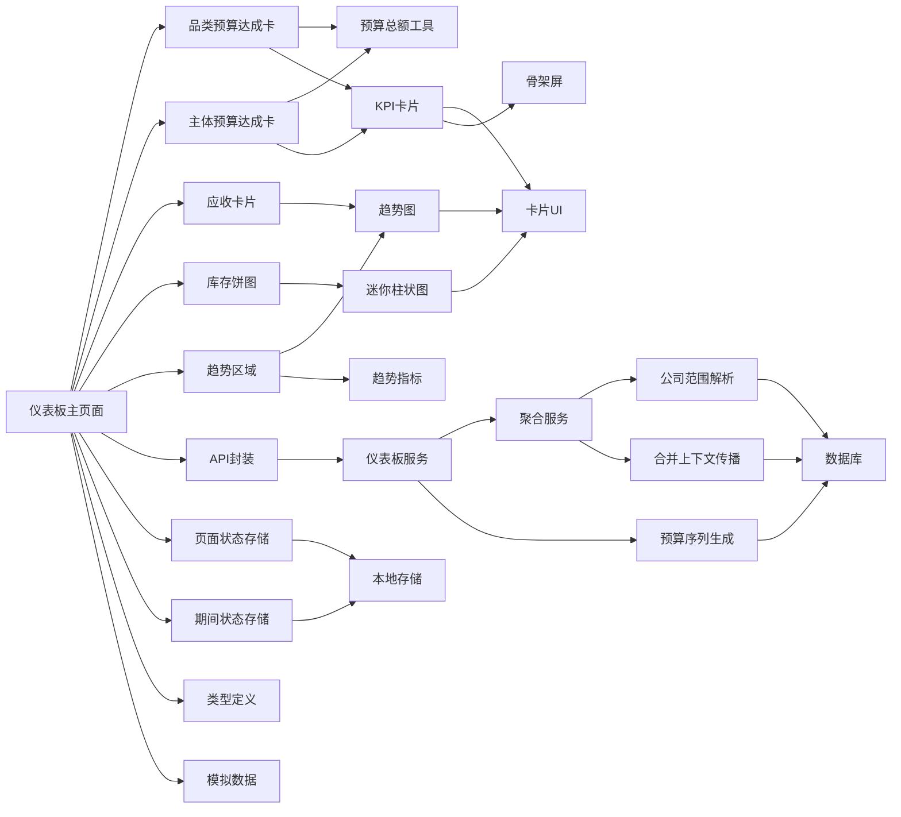

# 仪表板页面

<cite>
**本文引用的文件**   
- [web/src/pages/dashboard/index.tsx](file://web/src/pages/dashboard/index.tsx)
- [server/src/services/AggregationService.ts](file://server/src/services/AggregationService.ts)
- [server/src/services/DashboardService.ts](file://server/src/services/DashboardService.ts)
- [web/src/pages/dashboard/product-budget-card.tsx](file://web/src/pages/dashboard/product-budget-card.tsx)
- [web/src/pages/dashboard/subject-budget-card.tsx](file://web/src/pages/dashboard/subject-budget-card.tsx)
- [web/src/pages/dashboard/budget-total.ts](file://web/src/pages/dashboard/budget-total.ts)
- [web/src/pages/dashboard/receivables-card.tsx](file://web/src/pages/dashboard/receivables-card.tsx)
- [web/src/pages/dashboard/inventory-pie-card.tsx](file://web/src/pages/dashboard/inventory-pie-card.tsx)
- [web/src/pages/dashboard/trend-section.tsx](file://web/src/pages/dashboard/trend-section.tsx)
- [web/src/components/charts/kpi-card.tsx](file://web/src/components/charts/kpi-card.tsx)
- [web/src/components/charts/trend-chart.tsx](file://web/src/components/charts/trend-chart.tsx)
- [web/src/components/charts/kpi-sparkline.tsx](file://web/src/components/charts/kpi-sparkline.tsx)
- [web/src/components/charts/mini-bar-chart.tsx](file://web/src/components/charts/mini-bar-chart.tsx)
- [web/src/lib/api.ts](file://web/src/lib/api.ts)
- [web/src/types/index.ts](file://web/src/types/index.ts)
- [web/src/mock/data.ts](file://web/src/mock/data.ts)
- [web/src/stores/authStore.ts](file://web/src/stores/authStore.ts)
- [web/src/hooks/useAuth.ts](file://web/src/hooks/useAuth.ts)
- [web/src/components/layout/main-layout.tsx](file://web/src/components/layout/main-layout.tsx)
- [web/src/components/layout/page-container.tsx](file://web/src/components/layout/page-container.tsx)
- [web/src/components/ui/card.tsx](file://web/src/components/ui/card.tsx)
- [web/src/components/ui/skeleton.tsx](file://web/src/components/ui/skeleton.tsx)
- [web/src/styles/globals.css](file://web/src/styles/globals.css)
- [web/package.json](file://web/package.json)
- [web/src/stores/pageStateStore.ts](file://web/src/stores/pageStateStore.ts)
- [web/src/stores/periodStore.ts](file://web/src/stores/periodStore.ts)
- [web/src/hooks/api-queries.ts](file://web/src/hooks/api-queries.ts)
- [web/src/components/charts/trend-metrics.ts](file://web/src/components/charts/trend-metrics.ts)
</cite>

## 更新摘要
**变更内容**   
- **增强合并上下文传播**：在聚合服务中实现了汇总主体查询链路透传抵消上下文，支持合并调整的聚合计算
- **优化预算系列生成**：改进了月度预算序列、年度预算总额和累计预算序列的生成逻辑，支持计算类指标的预算回退机制
- **完善数据聚合流程**：通过`buildTrees`函数并行构建各期间聚合树，避免串行N+1查询问题
- **提升性能表现**：实现了更高效的预算数据处理和趋势数据构建，减少了数据库查询次数
- **增强错误处理**：改进了无预算数据时的降级处理和空值处理逻辑

## 目录
1. [简介](#简介)
2. [项目结构](#项目结构)
3. [核心组件](#核心组件)
4. [架构总览](#架构总览)
5. [详细组件分析](#详细组件分析)
6. [依赖关系分析](#依赖关系分析)
7. [性能考虑](#性能考虑)
8. [故障排查指南](#故障排查指南)
9. [结论](#结论)
10. [附录](#附录)

## 简介
本文件围绕"仪表板页面"的架构设计与实现进行系统化说明，重点覆盖：
- 模块化卡片系统的架构设计和组件拆分策略
- KPI指标展示、趋势图表分析与迷你图表组件的组合模式
- 数据可视化组件的数据绑定与实时更新机制
- 仪表板的数据获取流程（API调用、数据转换、状态管理）
- 响应式布局在不同设备上的适配方案
- 自定义指标配置与图表主题定制的开发指南（新增业务指标、修改样式、调整刷新频率等）
- **新增**：公司范围处理逻辑的改进，包括`resolveDashboardCompany`函数的实现、降级模式支持和空状态处理
- **新增**：状态持久化机制，支持期间选择、维度筛选和趋势指标的本地存储
- **新增**：合并上下文传播和预算系列生成的增强功能，支持合并调整的聚合计算

**更新** 基于最新的架构重构，仪表板页面已从单体页面转变为模块化卡片系统，新增了品类预算达成分析和主体预算达成分析两个重要功能模块，显著提升了预算管理的可视化能力。同时，公司范围处理逻辑得到了大幅改进，提供了更健壮的权限控制和用户体验。新增的状态持久化机制确保了用户交互状态的连续性。**最新增强**：合并上下文传播功能的实现使得汇总主体的数据聚合更加准确，预算系列生成逻辑也得到了优化，支持计算类指标的预算回退机制。

## 项目结构
仪表板相关代码位于前端工程 web 目录下，采用按功能域组织的方式：
- 页面层：web/src/pages/dashboard/index.tsx（主入口）
- 模块化卡片：web/src/pages/dashboard/*（各功能卡片组件）
- 可视化组件：web/src/components/charts/*
- 基础UI组件：web/src/components/ui/*
- 布局容器：web/src/components/layout/*
- 数据与类型：web/src/lib/api.ts、web/src/types/index.ts、web/src/mock/data.ts
- 认证与权限：web/src/stores/authStore.ts、web/src/hooks/useAuth.ts
- 全局样式：web/src/styles/globals.css
- 构建与依赖：web/package.json
- **新增**：后端服务层 - server/src/services/AggregationService.ts（包含`resolveDashboardCompany`函数和合并上下文传播）
- **新增**：状态管理 - web/src/stores/pageStateStore.ts、web/src/stores/periodStore.ts

```mermaid
graph TB
subgraph "仪表板页面"
D["仪表板主页面<br/>pages/dashboard/index.tsx"]
PBC["品类预算达成卡<br/>pages/dashboard/product-budget-card.tsx"]
SBC["主体预算达成卡<br/>pages/dashboard/subject-budget-card.tsx"]
RC["应收卡片<br/>pages/dashboard/receivables-card.tsx"]
IPC["库存饼图<br/>pages/dashboard/inventory-pie-card.tsx"]
TS["趋势区域<br/>pages/dashboard/trend-section.tsx"]
BT["预算总额工具<br/>pages/dashboard/budget-total.ts"]
end
subgraph "可视化组件"
KC["KPI卡片<br/>components/charts/kpi-card.tsx"]
TC["趋势图<br/>components/charts/trend-chart.tsx"]
SK["迷你图<br/>components/charts/kpi-sparkline.tsx"]
MBC["迷你柱状图<br/>components/charts/mini-bar-chart.tsx"]
TM["趋势指标<br/>components/charts/trend-metrics.ts"]
end
subgraph "状态管理"
PS["页面状态存储<br/>stores/pageStateStore.ts"]
PERIOD["期间状态存储<br/>stores/periodStore.ts"]
end
subgraph "基础UI"
UI_Card["卡片<br/>components/ui/card.tsx"]
UI_Skel["骨架屏<br/>components/ui/skeleton.tsx"]
end
subgraph "布局"
ML["主布局<br/>components/layout/main-layout.tsx"]
PC["页面容器<br/>components/layout/page-container.tsx"]
end
subgraph "数据与类型"
API["API封装<br/>lib/api.ts"]
Types["类型定义<br/>types/index.ts"]
Mock["模拟数据<br/>mock/data.ts"]
AQ["API查询钩子<br/>hooks/api-queries.ts"]
end
subgraph "后端服务"
AS["聚合服务<br/>services/AggregationService.ts"]
DS["仪表板服务<br/>services/DashboardService.ts"]
RDC["公司范围解析<br/>resolveDashboardCompany"]
BTS["预算序列生成<br/>monthlyBudgetSeries/budgetAnnualTotal"]
CT["合并上下文传播<br/>consolidationSummaryCode"]
end
D --> PBC
D --> SBC
D --> RC
D --> IPC
D --> TS
PBC --> BT
SBC --> BT
PBC --> KC
SBC --> KC
TS --> TC
TS --> SK
IPC --> MBC
D --> API
D --> Types
D --> Mock
D --> ML
D --> PC
D --> AS
AS --> RDC
AS --> BTS
AS --> CT
DS --> RDC
DS --> BTS
D --> PS
D --> PERIOD
D --> AQ
TS --> TM
```

**图示来源**
- [web/src/pages/dashboard/index.tsx](file://web/src/pages/dashboard/index.tsx)
- [server/src/services/AggregationService.ts](file://server/src/services/AggregationService.ts)
- [server/src/services/DashboardService.ts](file://server/src/services/DashboardService.ts)
- [web/src/pages/dashboard/product-budget-card.tsx](file://web/src/pages/dashboard/product-budget-card.tsx)
- [web/src/pages/dashboard/subject-budget-card.tsx](file://web/src/pages/dashboard/subject-budget-card.tsx)
- [web/src/pages/dashboard/budget-total.ts](file://web/src/pages/dashboard/budget-total.ts)
- [web/src/pages/dashboard/receivables-card.tsx](file://web/src/pages/dashboard/receivables-card.tsx)
- [web/src/pages/dashboard/inventory-pie-card.tsx](file://web/src/pages/dashboard/inventory-pie-card.tsx)
- [web/src/pages/dashboard/trend-section.tsx](file://web/src/pages/dashboard/trend-section.tsx)
- [web/src/components/charts/kpi-card.tsx](file://web/src/components/charts/kpi-card.tsx)
- [web/src/components/charts/trend-chart.tsx](file://web/src/components/charts/trend-chart.tsx)
- [web/src/components/charts/kpi-sparkline.tsx](file://web/src/components/charts/kpi-sparkline.tsx)
- [web/src/components/charts/mini-bar-chart.tsx](file://web/src/components/charts/mini-bar-chart.tsx)
- [web/src/components/charts/trend-metrics.ts](file://web/src/components/charts/trend-metrics.ts)
- [web/src/stores/pageStateStore.ts](file://web/src/stores/pageStateStore.ts)
- [web/src/stores/periodStore.ts](file://web/src/stores/periodStore.ts)
- [web/src/hooks/api-queries.ts](file://web/src/hooks/api-queries.ts)
- [web/src/lib/api.ts](file://web/src/lib/api.ts)
- [web/src/types/index.ts](file://web/src/types/index.ts)
- [web/src/mock/data.ts](file://web/src/mock/data.ts)

## 核心组件
- **模块化卡片系统**：将原单体页面拆分为独立的业务卡片组件，包括品类预算达成卡、主体预算达成卡、应收卡片、库存饼图、趋势区域等
- **KPI卡片**：用于承载单项关键指标的数值、同比/环比变化、迷你趋势线以及加载态
- **趋势图**：用于展示一段时间内的指标走势，支持时间轴缩放、多系列对比、空数据占位与错误提示
- **迷你图**：轻量级折线或柱状迷你图，常用于KPI卡片内嵌趋势预览，具备低开销渲染策略
- **迷你柱状图**：专门用于展示分类数据的对比情况，支持动态颜色映射和数据排序
- **基础UI与布局**：卡片容器、骨架屏、页面容器与主布局提供一致的视觉与交互基座
- **新增**：**公司范围解析服务**：通过`resolveDashboardCompany`函数实现智能的公司范围解析和降级逻辑
- **新增**：**状态持久化系统**：通过Zustand store实现期间选择、维度筛选和趋势指标的本地存储
- **新增**：**合并上下文传播服务**：支持汇总主体查询链路透传抵消上下文，实现准确的合并调整聚合计算
- **新增**：**预算序列生成服务**：提供月度预算序列、年度预算总额和累计预算序列的生成逻辑

**更新** 架构重构后，仪表板采用了更加模块化的设计，新增了品类预算达成分析和主体预算达成分析两个重要的预算管理功能模块，每个业务功能都有独立的卡片组件，提高了代码的可维护性和复用性。同时，公司范围处理逻辑得到了大幅改进，提供了更健壮的权限控制。新增的状态持久化机制确保了用户交互的连续性。**最新增强**：合并上下文传播和预算序列生成功能的实现，使得数据聚合更加准确，预算计算更加灵活。

## 架构总览
仪表板采用"模块化卡片 + 组件组合 + 数据服务 + 状态持久化 + 合并上下文传播"的分层架构：
- 页面层负责聚合多个模块化卡片组件、编排布局与交互逻辑
- 卡片层专注单一业务功能的完整实现，包含数据获取、状态管理和UI渲染
- 组件层专注通用可视化呈现与局部状态
- 数据层通过API封装统一请求、错误处理与缓存策略
- **新增**：状态管理层通过Zustand store实现跨组件状态共享和本地持久化
- **新增**：公司范围解析层通过`resolveDashboardCompany`函数处理权限验证和降级逻辑
- **新增**：合并上下文传播层通过`consolidationSummaryCode`参数实现汇总主体的抵消上下文透传
- **新增**：预算序列生成层通过`monthlyBudgetSeries`、`budgetAnnualTotal`等函数提供灵活的预算数据处理
- 类型系统贯穿前后端契约，确保数据结构一致
- 认证与权限控制影响数据可见性与操作能力

**图示来源**
- [web/src/pages/dashboard/index.tsx](file://web/src/pages/dashboard/index.tsx)
- [web/src/stores/pageStateStore.ts](file://web/src/stores/pageStateStore.ts)
- [server/src/services/DashboardService.ts](file://server/src/services/DashboardService.ts)
- [server/src/services/AggregationService.ts](file://server/src/services/AggregationService.ts)
- [web/src/lib/api.ts](file://web/src/lib/api.ts)

## 详细组件分析

### 仪表板主页面编排
- 职责：聚合各个模块化卡片组件；管理整体加载、错误与刷新策略；根据权限过滤功能模块；驱动响应式布局
- 数据流：从API获取后转换为各卡片组件所需结构，必要时合并本地缓存与模拟数据
- 交互：支持手动刷新、自动轮询、筛选条件变更触发重绘
- 可访问性：为关键图表提供语义化标签与键盘导航支持
- **新增**：状态持久化集成，通过`usePageStore`管理期间选择、维度筛选和趋势指标
- **新增**：降级模式支持，当请求的主体越权或不存在时，自动切换到有权的主体并同步显示

**更新** 主页面现在主要负责协调各个模块化卡片组件，包括新增的品类预算达成卡和主体预算达成卡，不再直接处理具体的业务逻辑，大大简化了页面复杂度。同时增强了状态持久化和降级模式的处理，确保在权限异常时仍能提供可用的数据视图。

### 合并上下文传播服务 (AggregationService)
- 职责：实现智能的公司范围解析逻辑，支持权限验证和优雅降级，以及合并上下文的传播
- 核心函数：`resolveDashboardCompany`函数处理公司范围的解析和降级，`buildOperatingTree`函数支持合并上下文传播
- 降级策略：当请求的主体越权或不存在时，按优先级降级到ET0001 → 任一授权汇总主体 → 任一授权单体
- 权限控制：遵循「全有或全无」授权原则，避免部分成员之和被当作汇总总额呈现
- 空状态处理：当无任何授权时返回空范围，前端展示空态界面
- **新增**：合并上下文传播：通过`consolidationSummaryCode`参数在汇总主体查询链路中传递抵消上下文
- **新增**：四维度统一叠加：本月实际/本年累计按抵消期匹配，同期实际/同期累计按抵消期减1年匹配

### 预算序列生成服务 (DashboardService)
- 职责：提供灵活的预算数据处理和序列生成功能
- 核心函数：`monthlyBudgetSeries`（月度预算序列）、`budgetAnnualTotal`（年度预算总额）、`fallbackBudgetSeries`（预算序列兜底）、`ytdBudgetSeries`（累计预算序列）
- 月度预算序列：active预算批次内按(科目, 期间)求和，再按指标叶子码集合归集为期间→合计
- 年度预算总额：优先按叶子预算行求和（含月度粒度归集），无匹配行时回退树节点BUDGET_AMOUNT
- 预算序列兜底：叶子归集结果为全null时按树预算总额月均均摊，无预算返回原全null
- 累计预算序列：预算无累计粒度，恒为年度总额水平线，年度总额为0时返回全null

### 验证与回退机制
- **期间验证**：财年切换后已选期间不在候选内时自动回退默认（最新期）
- **主体验证**：无选或编码已删除/越权时自动回退默认主体
- **降级处理**：前端通过`data?.degraded`标志识别降级状态，自动同步实际生效的主体
- **用户体验**：防止下拉框出现空白选项，确保用户始终看到有效的主体选择

### 空状态处理机制
- 空数据检测：通过`isEmpty = !isLoading && !isError && kpiData.length === 0`判断
- 友好提示：显示"暂无可用数据"和相关提示信息
- 原因说明：提示用户可能是无数据权限或尚未导入经营数据批次
- 视觉设计：使用中性色调和图标，避免误导用户认为出现错误

### 品类预算达成分析卡片 (Product Budget Card)
- 职责：展示按品类维度划分的收入/毛利预算达成情况，支持月度/累计切换
- 数据绑定：接收品类预算数据，内部完成金额格式化、达成率计算和同比分析
- 交互功能：支持月度/累计模式切换，自动联动预算口径（月度=年度/12，累计=年度总额）
- 状态管理：维护数据加载状态、空数据处理和用户交互状态
- 特色功能：三级语义色显示达成率（≥95%绿色达标、85-95%琥珀预警、<85%红色严重偏离）

### 主体预算达成分析卡片 (Subject Budget Card)
- 职责：展示按主体维度划分的收入/毛利/净利润预算达成情况，支持单体/汇总主体切换
- 数据绑定：接收主体预算数据，内部完成多维度指标计算和格式化
- 交互功能：支持月度/累计模式切换，自动跟随看板顶部筛选的主体口径
- 状态管理：维护不同主体类型的展示逻辑和汇总主体的成员明细行展示
- 特色功能：支持汇总主体时展示其成员公司明细行，提供完整的预算达成分析视图

### 预算总额计算工具 (Budget Total)
- 职责：为品类和主体预算达成卡提供合计行计算逻辑
- 算法实现：预算和金额直接求和，达成率按预算加权计算，同比按合计金额重算避免简单平均偏差
- 数据支持：同时支持收入、毛利、净利润三个维度的合计计算
- 精度控制：使用round2函数确保计算精度，避免浮点数误差

### 应收卡片组件 (Receivables Card) 
- 职责：展示应收账款相关的关键指标和分布分析
- 数据绑定：接收应收数据，内部完成金额汇总、主体分布统计
- 可视化：使用横向柱状图展示各主体应收期末余额降序排列
- 交互功能：支持单体/汇总口径切换，独立于KPI区的筛选器

### 库存饼图组件 (Inventory Pie Card)
- 职责：展示存货品类占比的环形图分析
- 数据绑定：接收库存数据，内部完成正负值分类和占比计算
- 可视化：使用ECharts环形图展示各品类金额占比，支持点击跳转库存管理页
- 交互功能：支持公司筛选，期间跟随看板当前期间

### 趋势区域组件 (Trend Section)
- 职责：集中展示各类业务指标的趋势图表和分析结果
- 图表集成：整合趋势图组件，支持收入/毛利/净利润指标切换
- 数据同步：支持多图表间的数据联动和筛选同步
- 主题定制：支持统一的图表主题和样式配置
- **新增**：趋势指标持久化，通过`trendMetric`状态管理当前选中的指标类型

**更新** 新增的状态持久化系统、公司范围解析服务和合并上下文传播服务，使仪表板在处理权限异常时更加健壮，用户体验得到显著提升。期间选择和维度筛选的本地存储确保了用户交互的连续性。合并上下文传播功能使得汇总主体的数据聚合更加准确，预算序列生成服务提供了更灵活的预算数据处理能力。

**图示来源**
- [web/src/pages/dashboard/index.tsx](file://web/src/pages/dashboard/index.tsx)
- [web/src/stores/pageStateStore.ts](file://web/src/stores/pageStateStore.ts)
- [web/src/stores/periodStore.ts](file://web/src/stores/periodStore.ts)
- [server/src/services/AggregationService.ts](file://server/src/services/AggregationService.ts)
- [server/src/services/DashboardService.ts](file://server/src/services/DashboardService.ts)
- [web/src/pages/dashboard/product-budget-card.tsx](file://web/src/pages/dashboard/product-budget-card.tsx)
- [web/src/pages/dashboard/subject-budget-card.tsx](file://web/src/pages/dashboard/subject-budget-card.tsx)
- [web/src/pages/dashboard/receivables-card.tsx](file://web/src/pages/dashboard/receivables-card.tsx)
- [web/src/pages/dashboard/inventory-pie-card.tsx](file://web/src/pages/dashboard/inventory-pie-card.tsx)
- [web/src/pages/dashboard/trend-section.tsx](file://web/src/pages/dashboard/trend-section.tsx)

### KPI卡片组件
- 职责：展示单指标数值、变化率、迷你趋势与辅助信息；处理加载与错误态
- 数据绑定：接收标准化指标对象，内部完成单位换算、百分比格式化与阈值高亮
- 主题与尺寸：通过属性切换主题色与尺寸，保持与全局设计令牌一致
- 性能：避免不必要的重渲染，仅在数据变化时更新

### 趋势图组件
- 职责：渲染时间序列数据，支持多系列、缩放、空数据与错误提示
- 实时更新：基于增量数据追加与窗口滑动，减少全量重绘
- 主题定制：颜色、网格、坐标轴样式可通过配置注入
- 性能优化：按需绘制、节流更新、大数据集采样

### 迷你图组件
- 职责：在有限空间内展示短期趋势，强调方向与波动
- 性能策略：简化路径计算、限制点数、避免复杂动画
- 集成方式：作为KPI卡片的内嵌元素，复用主题与尺寸配置

### 迷你柱状图组件
- 职责：展示分类数据的对比情况，支持动态颜色映射和数据排序
- 数据绑定：接收分类数据和对应的数值，自动生成合适的颜色方案
- 交互功能：支持悬停显示详细信息、点击筛选数据
- 性能优化：使用虚拟滚动技术处理大量数据点

### 趋势指标管理 (trend-metrics)
- 职责：定义趋势图的可选指标类型和标签映射
- 指标类型：支持'revenue'（收入）、'profit'（毛利）、'netProfit'（净利润）三种指标
- 标签映射：提供中文标签显示，如TREND_METRIC_LABELS常量
- 数据提取：通过`seriesOf`函数从趋势数据中提取指定指标的三个序列

**更新** 模块化架构使得各个组件的职责更加明确，特别是新增的状态持久化系统、公司范围解析服务、合并上下文传播服务和预算序列生成服务，数据流向也更加清晰，便于单元测试和维护。

## 依赖关系分析
- 主页面依赖各个模块化卡片组件
- 预算卡片组件依赖预算总额计算工具和类型定义
- 卡片组件依赖可视化组件与基础UI
- 可视化组件依赖基础UI与全局样式
- 页面与数据层通过API封装交互，受认证状态影响
- **新增**：仪表板服务依赖聚合服务中的公司范围解析函数和合并上下文传播
- **新增**：页面状态依赖Zustand store进行持久化管理
- **新增**：预算序列生成依赖预算数据查询和计算逻辑
- 类型定义贯穿数据契约，保证前后端一致性

**图示来源**
- [web/src/pages/dashboard/index.tsx](file://web/src/pages/dashboard/index.tsx)
- [server/src/services/DashboardService.ts](file://server/src/services/DashboardService.ts)
- [server/src/services/AggregationService.ts](file://server/src/services/AggregationService.ts)
- [web/src/pages/dashboard/product-budget-card.tsx](file://web/src/pages/dashboard/product-budget-card.tsx)
- [web/src/pages/dashboard/subject-budget-card.tsx](file://web/src/pages/dashboard/subject-budget-card.tsx)
- [web/src/pages/dashboard/budget-total.ts](file://web/src/pages/dashboard/budget-total.ts)
- [web/src/pages/dashboard/receivables-card.tsx](file://web/src/pages/dashboard/receivables-card.tsx)
- [web/src/pages/dashboard/inventory-pie-card.tsx](file://web/src/pages/dashboard/inventory-pie-card.tsx)
- [web/src/pages/dashboard/trend-section.tsx](file://web/src/pages/dashboard/trend-section.tsx)
- [web/src/components/charts/kpi-card.tsx](file://web/src/components/charts/kpi-card.tsx)
- [web/src/components/charts/trend-chart.tsx](file://web/src/components/charts/trend-chart.tsx)
- [web/src/components/charts/kpi-sparkline.tsx](file://web/src/components/charts/kpi-sparkline.tsx)
- [web/src/components/charts/mini-bar-chart.tsx](file://web/src/components/charts/mini-bar-chart.tsx)
- [web/src/components/charts/trend-metrics.ts](file://web/src/components/charts/trend-metrics.ts)
- [web/src/stores/pageStateStore.ts](file://web/src/stores/pageStateStore.ts)
- [web/src/stores/periodStore.ts](file://web/src/stores/periodStore.ts)
- [web/src/lib/api.ts](file://web/src/lib/api.ts)
- [web/src/types/index.ts](file://web/src/types/index.ts)
- [web/src/mock/data.ts](file://web/src/mock/data.ts)
- [web/src/stores/authStore.ts](file://web/src/stores/authStore.ts)
- [web/src/components/ui/card.tsx](file://web/src/components/ui/card.tsx)
- [web/src/components/ui/skeleton.tsx](file://web/src/components/ui/skeleton.tsx)

## 性能考虑
- 数据层
  - 请求去抖与节流：避免频繁刷新导致抖动
  - 增量更新：仅追加新数据点，维护固定长度窗口
  - 缓存策略：对静态或低频变化数据做短期缓存
  - 模块化数据隔离：各卡片组件独立管理自己的数据状态
  - **新增**：公司范围解析缓存，避免重复的权限查询
  - **新增**：状态持久化缓存，减少重复的状态初始化
  - **新增**：合并上下文传播缓存，避免重复的抵消数据查询
  - **新增**：预算序列生成缓存，优化预算数据处理性能
- 渲染层
  - 组件粒度拆分：最小化重渲染范围
  - 图表采样：大数据集下降采样与懒加载
  - 动画降级：低端设备禁用复杂过渡
  - 虚拟滚动：处理大量数据时的性能优化
- 资源与网络
  - 按需引入图表库与主题包
  - 失败重试与退化为骨架屏/占位图
  - 组件懒加载：按需加载卡片组件
  - **新增**：降级模式的快速响应，避免长时间等待无效数据
  - **新增**：本地状态优先加载，提升首屏渲染速度
  - **新增**：并行构建各期间聚合树，避免串行N+1查询问题

**更新** 模块化架构带来了更好的性能表现，特别是新增的状态持久化系统、公司范围解析服务、合并上下文传播服务和预算序列生成服务可以独立优化和管理自己的渲染逻辑，减少了不必要的重渲染。降级模式的支持也提升了用户体验，避免了因权限问题导致的长时间等待。本地状态持久化进一步提升了页面的响应速度。**最新增强**：并行构建各期间聚合树的实现显著提升了数据查询性能，避免了传统的串行N+1查询问题。

## 故障排查指南
- 数据未加载
  - 检查认证状态与权限是否满足
  - 确认API接口可达与返回结构符合类型定义
  - 查看是否有模拟数据开关导致行为差异
  - 检查各卡片组件的数据获取逻辑
  - **新增**：检查公司范围解析是否正确，确认`resolveDashboardCompany`函数的返回值
  - **新增**：检查状态持久化是否正常，确认localStorage读写权限
  - **新增**：检查合并上下文传播是否正确，确认`consolidationSummaryCode`参数的传递
  - **新增**：检查预算序列生成是否正确，确认预算数据的格式和可用性
- 图表不更新
  - 核对增量数据格式与时间戳顺序
  - 检查是否存在重复键或空值导致渲染中断
  - 验证组件间的数据传递是否正确
- 性能问题
  - 定位高频重渲染的组件
  - 评估数据量是否超过采样阈值
  - 关闭非必要动画与调试日志
  - 检查模块化组件的依赖关系
- 样式错乱
  - 检查全局样式变量是否被覆盖
  - 确认断点与栅格配置是否符合预期
  - 验证各卡片组件的样式隔离
- 预算分析异常
  - 检查预算数据格式是否正确
  - 验证月度/累计切换逻辑是否正常
  - 确认达成率计算逻辑是否符合业务规则
  - 检查同比计算的基准数据准确性
  - **新增**：检查预算序列生成逻辑，确认`monthlyBudgetSeries`和`budgetAnnualTotal`函数的正确性
- **新增**：公司范围解析问题
  - 检查用户的权限配置是否正确
  - 验证降级逻辑是否按预期工作
  - 确认空状态处理的触发条件
  - 检查前后端公司编码的一致性
- **新增**：合并上下文传播问题
  - 检查汇总主体的抵消调整数据是否正确
  - 验证四维度统一叠加逻辑是否符合预期
  - 确认抵消期间的匹配规则是否正确
  - 检查合并调整数据的时效性和有效性
- **新增**：状态持久化问题
  - 检查浏览器localStorage是否可用
  - 验证状态版本兼容性
  - 确认状态序列化/反序列化是否正常
  - 检查状态回退逻辑是否正确

**更新** 新增了针对公司范围解析、状态持久化、合并上下文传播和预算序列生成的故障排查指导，特别关注权限配置、降级逻辑、空状态处理、localStorage读写、抵消数据准确性和预算数据处理的问题。

## 结论
仪表板页面通过模块化卡片系统的架构重构，实现了更好的代码组织、更高的可维护性和更强的扩展性。新增的品类预算达成分析和主体预算达成分析功能模块，为预算管理提供了全面的数据可视化支持。同时，公司范围处理逻辑的大幅改进，通过`resolveDashboardCompany`函数实现了智能的权限控制和优雅降级，显著提升了系统的健壮性和用户体验。每个业务功能都有独立的卡片组件，职责清晰、边界明确。结合响应式布局与主题定制能力，可在多设备上保持一致体验。基于最新的架构改进，仪表板现在支持更好的组件复用、更清晰的数据流向、更高效的性能表现、更健壮的权限处理和更连续的用户体验。**最新增强**：合并上下文传播和预算序列生成功能的实现，使得汇总主体的数据聚合更加准确，预算计算更加灵活，为复杂的财务分析场景提供了强有力的技术支持。建议在后续迭代中持续完善错误边界、可观测性与性能监控，以提升稳定性与可维护性。

**更新** 新增的状态持久化机制、公司范围解析服务、合并上下文传播服务和预算序列生成服务，使仪表板在处理权限异常时更加健壮，为用户提供了更好的使用体验。期间选择和维度筛选的本地存储确保了用户交互的连续性，空状态处理机制也为用户提供了更清晰的反馈，避免了困惑和误解。合并上下文传播功能使得汇总主体的数据聚合更加准确，预算序列生成服务提供了更灵活的预算数据处理能力。

## 附录

### 开发指南：新增预算分析卡片组件
- 步骤
  - 在dashboard目录下创建新的预算卡片组件文件
  - 定义组件属性和数据类型（Period、CompanyCode、SubjectName）
  - 实现数据获取、状态管理和UI渲染逻辑
  - 在主页面中注册新卡片组件
  - 添加相应的权限控制和样式适配
  - 实现预算总额计算工具函数
- 参考文件
  - [web/src/pages/dashboard/product-budget-card.tsx](file://web/src/pages/dashboard/product-budget-card.tsx)
  - [web/src/pages/dashboard/subject-budget-card.tsx](file://web/src/pages/dashboard/subject-budget-card.tsx)
  - [web/src/pages/dashboard/budget-total.ts](file://web/src/pages/dashboard/budget-total.ts)
  - [web/src/pages/dashboard/index.tsx](file://web/src/pages/dashboard/index.tsx)

### 开发指南：修改图表样式
- 步骤
  - 在全局样式中调整设计令牌（颜色、间距、字号）
  - 在组件属性中传入主题色与尺寸
  - 在趋势图配置中调整网格、坐标轴与图例样式
  - 为新组件添加相应的样式支持
- 参考文件
  - [web/src/styles/globals.css](file://web/src/styles/globals.css)
  - [web/src/components/charts/trend-chart.tsx](file://web/src/components/charts/trend-chart.tsx)
  - [web/src/components/charts/kpi-card.tsx](file://web/src/components/charts/kpi-card.tsx)
  - [web/src/components/charts/mini-bar-chart.tsx](file://web/src/components/charts/mini-bar-chart.tsx)

### 开发指南：调整数据刷新频率
- 步骤
  - 在页面层设置轮询间隔与去抖参数
  - 在API层增加重试与超时策略
  - 在组件层监听数据变化并执行增量更新
  - 为新卡片组件配置适当的刷新策略
- 参考文件
  - [web/src/pages/dashboard/index.tsx](file://web/src/pages/dashboard/index.tsx)
  - [web/src/lib/api.ts](file://web/src/lib/api.ts)
  - [web/src/components/charts/trend-chart.tsx](file://web/src/components/charts/trend-chart.tsx)
  - [web/src/pages/dashboard/trend-section.tsx](file://web/src/pages/dashboard/trend-section.tsx)

### 开发指南：集成新可视化组件
- 步骤
  - 创建新的可视化组件文件
  - 定义组件属性和数据类型
  - 实现数据绑定和渲染逻辑
  - 在相应的卡片组件中集成新组件
  - 添加相应的测试用例
- 参考文件
  - [web/src/components/charts/kpi-sparkline.tsx](file://web/src/components/charts/kpi-sparkline.tsx)
  - [web/src/components/charts/mini-bar-chart.tsx](file://web/src/components/charts/mini-bar-chart.tsx)
  - [web/src/pages/dashboard/trend-section.tsx](file://web/src/pages/dashboard/trend-section.tsx)

### 开发指南：扩展预算分析功能
- 步骤
  - 在类型定义中添加新的预算指标类型
  - 实现新的预算计算逻辑
  - 在预算总额工具中添加新的合计计算规则
  - 更新卡片组件以支持新的指标展示
  - 添加相应的数据验证和错误处理
- 参考文件
  - [web/src/types/index.ts](file://web/src/types/index.ts)
  - [web/src/pages/dashboard/budget-total.ts](file://web/src/pages/dashboard/budget-total.ts)
  - [web/src/pages/dashboard/product-budget-card.tsx](file://web/src/pages/dashboard/product-budget-card.tsx)
  - [web/src/pages/dashboard/subject-budget-card.tsx](file://web/src/pages/dashboard/subject-budget-card.tsx)

### 开发指南：实现公司范围解析功能
- 步骤
  - 在聚合服务中实现`resolveDashboardCompany`函数
  - 定义EffectiveCompany接口和降级逻辑
  - 集成权限验证和空状态处理
  - 在前端仪表板页面中处理降级状态
  - 添加相应的测试用例和错误处理
- 参考文件
  - [server/src/services/AggregationService.ts](file://server/src/services/AggregationService.ts)
  - [web/src/pages/dashboard/index.tsx](file://web/src/pages/dashboard/index.tsx)
  - [server/src/services/DashboardService.ts](file://server/src/services/DashboardService.ts)

### 开发指南：实现状态持久化
- 步骤
  - 在pageStateStore中定义新的状态接口
  - 实现zustand store的持久化配置
  - 在页面组件中使用usePageStore管理状态
  - 添加状态验证和回退逻辑
  - 处理状态版本迁移和兼容性
- 参考文件
  - [web/src/stores/pageStateStore.ts](file://web/src/stores/pageStateStore.ts)
  - [web/src/stores/periodStore.ts](file://web/src/stores/periodStore.ts)
  - [web/src/pages/dashboard/index.tsx](file://web/src/pages/dashboard/index.tsx)

### 开发指南：添加趋势指标类型
- 步骤
  - 在trend-metrics.ts中定义新的指标类型
  - 更新TREND_METRIC_LABELS映射
  - 在趋势图组件中支持新指标的渲染
  - 更新API接口以支持新指标的数据格式
  - 添加相应的测试用例
- 参考文件
  - [web/src/components/charts/trend-metrics.ts](file://web/src/components/charts/trend-metrics.ts)
  - [web/src/pages/dashboard/trend-section.tsx](file://web/src/pages/dashboard/trend-section.tsx)
  - [web/src/types/index.ts](file://web/src/types/index.ts)

### 开发指南：实现合并上下文传播
- 步骤
  - 在聚合服务的`buildOperatingTree`函数中添加`consolidationSummaryCode`参数支持
  - 实现合并调整数据的查询和应用逻辑
  - 确保四维度统一叠加的正确性（本月实际/本年累计/同期实际/同期累计）
  - 在仪表板服务中正确传递合并上下文参数
  - 添加相应的测试用例验证合并调整效果
- 参考文件
  - [server/src/services/AggregationService.ts](file://server/src/services/AggregationService.ts)
  - [server/src/services/DashboardService.ts](file://server/src/services/DashboardService.ts)

### 开发指南：实现预算序列生成
- 步骤
  - 实现`monthlyBudgetSeries`函数处理月度预算序列生成
  - 实现`budgetAnnualTotal`函数处理年度预算总额计算
  - 实现`fallbackBudgetSeries`函数处理预算序列兜底逻辑
  - 实现`ytdBudgetSeries`函数处理累计预算序列生成
  - 在仪表板数据构建中集成预算序列生成逻辑
  - 添加相应的测试用例验证预算计算的准确性
- 参考文件
  - [server/src/services/DashboardService.ts](file://server/src/services/DashboardService.ts)
  - [server/src/services/DashboardService.test.ts](file://server/src/services/DashboardService.test.ts)

### 依赖与版本
- 建议关注图表库与构建工具版本兼容性，避免破坏性升级
- 参考包清单以了解第三方依赖
- **新增**：注意Zustand版本兼容性，确保持久化中间件正常工作
- **新增**：注意Prisma客户端版本兼容性，确保数据库操作正常

**更新** 新增了状态持久化、公司范围解析、合并上下文传播和预算序列生成功能的开发指南，便于扩展仪表板的状态管理、权限处理、合并计算和预算分析能力，特别是Zustand store的配置方法、`resolveDashboardCompany`函数的实现、合并上下文传播的实现和预算序列生成函数的使用方法。

**章节来源**
- [web/src/pages/dashboard/index.tsx:22-96](file://web/src/pages/dashboard/index.tsx#L22-L96)
- [web/src/stores/pageStateStore.ts:111-117](file://web/src/stores/pageStateStore.ts#L111-L117)
- [web/src/stores/pageStateStore.ts:227-251](file://web/src/stores/pageStateStore.ts#L227-L251)
- [web/src/stores/periodStore.ts:27-42](file://web/src/stores/periodStore.ts#L27-L42)
- [server/src/services/AggregationService.ts:494-513](file://server/src/services/AggregationService.ts#L494-L513)
- [server/src/services/DashboardService.ts:206-209](file://server/src/services/DashboardService.ts#L206-L209)
- [server/src/services/DashboardService.ts:227-247](file://server/src/services/DashboardService.ts#L227-L247)
- [server/src/services/DashboardService.ts:253-259](file://server/src/services/DashboardService.ts#L253-L259)
- [server/src/services/DashboardService.ts:265-278](file://server/src/services/DashboardService.ts#L265-L278)
- [server/src/services/DashboardService.ts:392-463](file://server/src/services/DashboardService.ts#L392-L463)
- [web/src/pages/dashboard/product-budget-card.tsx:57-163](file://web/src/pages/dashboard/product-budget-card.tsx#L57-L163)
- [web/src/pages/dashboard/subject-budget-card.tsx:59-182](file://web/src/pages/dashboard/subject-budget-card.tsx#L59-L182)
- [web/src/pages/dashboard/budget-total.ts:1-46](file://web/src/pages/dashboard/budget-total.ts#L1-L46)
- [web/src/pages/dashboard/receivables-card.tsx:17-134](file://web/src/pages/dashboard/receivables-card.tsx#L17-L134)
- [web/src/pages/dashboard/inventory-pie-card.tsx:18-132](file://web/src/pages/dashboard/inventory-pie-card.tsx#L18-L132)
- [web/src/pages/dashboard/trend-section.tsx:20-53](file://web/src/pages/dashboard/trend-section.tsx#L20-L53)
- [web/src/components/charts/trend-metrics.ts:1-21](file://web/src/components/charts/trend-metrics.ts#L1-L21)
- [web/src/hooks/api-queries.ts:531-570](file://web/src/hooks/api-queries.ts#L531-L570)
- [web/src/types/index.ts:220-261](file://web/src/types/index.ts#L220-L261)