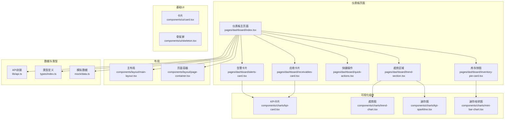
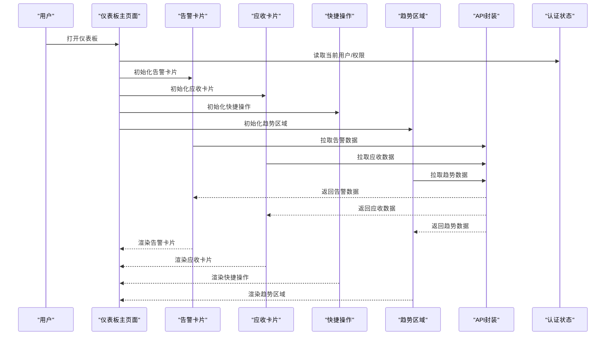
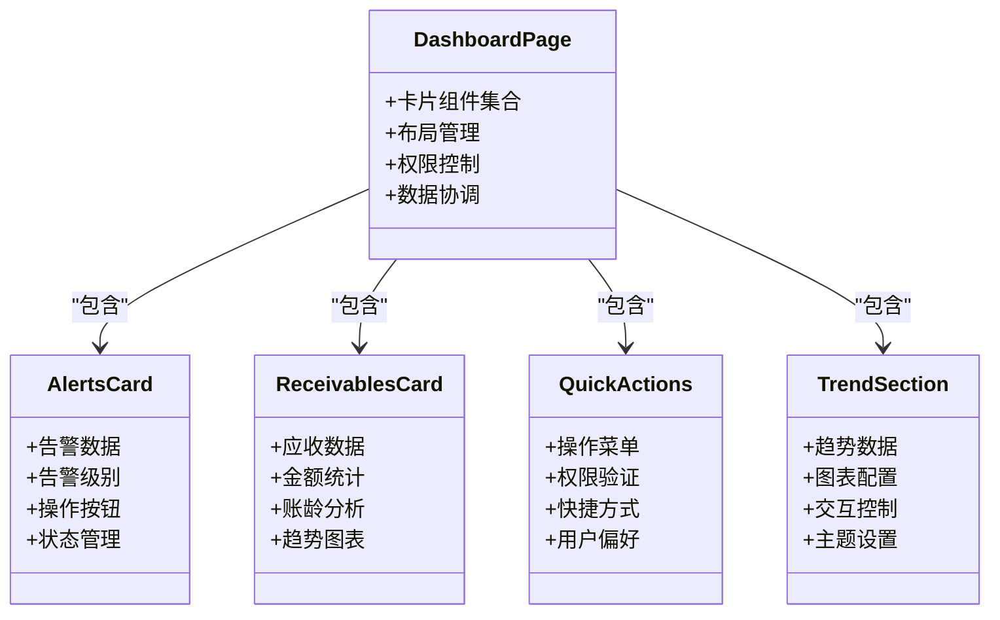
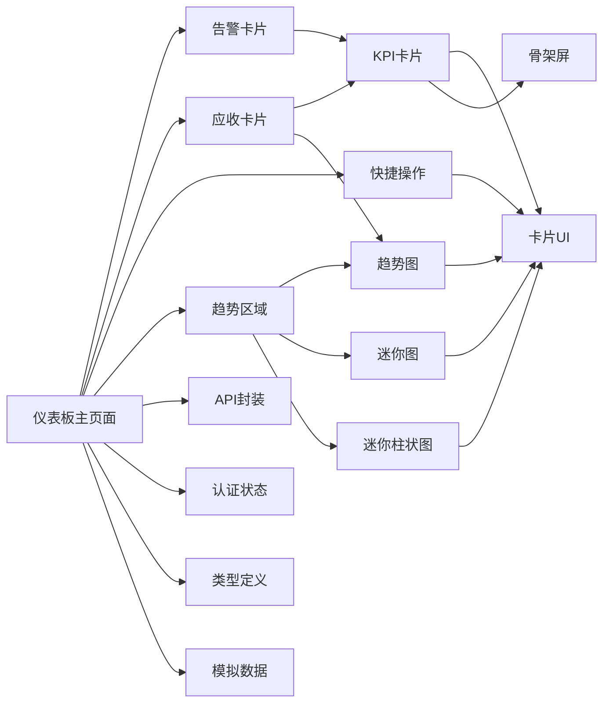

# 仪表板页面

<cite>
**本文引用的文件**   
- [web/src/pages/dashboard/index.tsx](file://web/src/pages/dashboard/index.tsx)
- [web/src/pages/dashboard/alerts-card.tsx](file://web/src/pages/dashboard/alerts-card.tsx)
- [web/src/pages/dashboard/receivables-card.tsx](file://web/src/pages/dashboard/receivables-card.tsx)
- [web/src/pages/dashboard/quick-actions.tsx](file://web/src/pages/dashboard/quick-actions.tsx)
- [web/src/pages/dashboard/trend-section.tsx](file://web/src/pages/dashboard/trend-section.tsx)
- [web/src/pages/dashboard/inventory-pie-card.tsx](file://web/src/pages/dashboard/inventory-pie-card.tsx)
- [web/src/components/charts/kpi-card.tsx](file://web/src/components/charts/kpi-card.tsx)
- [web/src/components/charts/trend-chart.tsx](file://web/src/components/charts/trend-chart.tsx)
- [web/src/components/charts/kpi-sparkline.tsx](file://web/src/components/charts/kpi-sparkline.tsx)
- [web/src/components/charts/mini-bar-chart.tsx](file://web/src/components/charts/mini-bar-chart.tsx)
- [web/src/lib/api.ts](file://web/src/lib/api.ts)
- [web/src/types/index.ts](file://web/src/types/index.ts)
- [web/src/mock/data.ts](file://web/src/mock/data.ts)
- [web/src/stores/authStore.ts](file://web/src/stores/authStore.ts)
- [web/src/hooks/useAuth.ts](file://web/src/hooks/useAuth.ts)
- [web/src/components/layout/main-layout.tsx](file://web/src/components/layout/main-layout.tsx)
- [web/src/components/layout/page-container.tsx](file://web/src/components/layout/page-container.tsx)
- [web/src/components/ui/card.tsx](file://web/src/components/ui/card.tsx)
- [web/src/components/ui/skeleton.tsx](file://web/src/components/ui/skeleton.tsx)
- [web/src/styles/globals.css](file://web/src/styles/globals.css)
- [web/package.json](file://web/package.json)
</cite>

## 更新摘要
**变更内容**   
- 基于Applied Changes更新：仪表板架构已从单体页面重构为模块化卡片系统
- 新增alerts-card、receivables-card、quick-actions、trend-section等独立组件模块
- 数据流和组件结构发生重大变化，采用更清晰的模块化设计
- 增强了组件间的解耦性和可维护性，支持更好的代码复用

## 目录
1. [简介](#简介)
2. [项目结构](#项目结构)
3. [核心组件](#核心组件)
4. [架构总览](#架构总览)
5. [详细组件分析](#详细组件分析)
6. [依赖关系分析](#依赖关系分析)
7. [性能考虑](#性能考虑)
8. [故障排查指南](#故障排查指南)
9. [结论](#结论)
10. [附录](#附录)

## 简介
本文件围绕"仪表板页面"的架构设计与实现进行系统化说明，重点覆盖：
- 模块化卡片系统的架构设计和组件拆分策略
- KPI指标展示、趋势图表分析与迷你图表组件的组合模式
- 数据可视化组件的数据绑定与实时更新机制
- 仪表板的数据获取流程（API调用、数据转换、状态管理）
- 响应式布局在不同设备上的适配方案
- 自定义指标配置与图表主题定制的开发指南（新增业务指标、修改样式、调整刷新频率等）

**更新** 基于最新的架构重构，仪表板页面已从单体页面转变为模块化卡片系统，包含独立的alerts-card、receivables-card、quick-actions、trend-section等组件，显著提升了代码的可维护性和扩展性。

## 项目结构
仪表板相关代码位于前端工程 web 目录下，采用按功能域组织的方式：
- 页面层：web/src/pages/dashboard/index.tsx（主入口）
- 模块化卡片：web/src/pages/dashboard/*（各功能卡片组件）
- 可视化组件：web/src/components/charts/*
- 基础UI组件：web/src/components/ui/*
- 布局容器：web/src/components/layout/*
- 数据与类型：web/src/lib/api.ts、web/src/types/index.ts、web/src/mock/data.ts
- 认证与权限：web/src/stores/authStore.ts、web/src/hooks/useAuth.ts
- 全局样式：web/src/styles/globals.css
- 构建与依赖：web/package.json

**图示来源**
- [web/src/pages/dashboard/index.tsx](file://web/src/pages/dashboard/index.tsx)
- [web/src/pages/dashboard/alerts-card.tsx](file://web/src/pages/dashboard/alerts-card.tsx)
- [web/src/pages/dashboard/receivables-card.tsx](file://web/src/pages/dashboard/receivables-card.tsx)
- [web/src/pages/dashboard/quick-actions.tsx](file://web/src/pages/dashboard/quick-actions.tsx)
- [web/src/pages/dashboard/trend-section.tsx](file://web/src/pages/dashboard/trend-section.tsx)
- [web/src/pages/dashboard/inventory-pie-card.tsx](file://web/src/pages/dashboard/inventory-pie-card.tsx)
- [web/src/components/charts/kpi-card.tsx](file://web/src/components/charts/kpi-card.tsx)
- [web/src/components/charts/trend-chart.tsx](file://web/src/components/charts/trend-chart.tsx)
- [web/src/components/charts/kpi-sparkline.tsx](file://web/src/components/charts/kpi-sparkline.tsx)
- [web/src/components/charts/mini-bar-chart.tsx](file://web/src/components/charts/mini-bar-chart.tsx)
- [web/src/components/ui/card.tsx](file://web/src/components/ui/card.tsx)
- [web/src/components/ui/skeleton.tsx](file://web/src/components/ui/skeleton.tsx)
- [web/src/components/layout/main-layout.tsx](file://web/src/components/layout/main-layout.tsx)
- [web/src/components/layout/page-container.tsx](file://web/src/components/layout/page-container.tsx)
- [web/src/lib/api.ts](file://web/src/lib/api.ts)
- [web/src/types/index.ts](file://web/src/types/index.ts)
- [web/src/mock/data.ts](file://web/src/mock/data.ts)

## 核心组件
- **模块化卡片系统**：将原单体页面拆分为独立的业务卡片组件，包括告警卡片、应收卡片、快捷操作、趋势区域等
- **KPI卡片**：用于承载单项关键指标的数值、同比/环比变化、迷你趋势线以及加载态
- **趋势图**：用于展示一段时间内的指标走势，支持时间轴缩放、多系列对比、空数据占位与错误提示
- **迷你图**：轻量级折线或柱状迷你图，常用于KPI卡片内嵌趋势预览，具备低开销渲染策略
- **迷你柱状图**：专门用于展示分类数据的对比情况，支持动态颜色映射和数据排序
- **基础UI与布局**：卡片容器、骨架屏、页面容器与主布局提供一致的视觉与交互基座

**更新** 架构重构后，仪表板采用了更加模块化的设计，每个业务功能都有独立的卡片组件，提高了代码的可维护性和复用性。

## 架构总览
仪表板采用"模块化卡片 + 组件组合 + 数据服务"的分层架构：
- 页面层负责聚合多个模块化卡片组件、编排布局与交互逻辑
- 卡片层专注单一业务功能的完整实现，包含数据获取、状态管理和UI渲染
- 组件层专注通用可视化呈现与局部状态
- 数据层通过API封装统一请求、错误处理与缓存策略
- 类型系统贯穿前后端契约，确保数据结构一致
- 认证与权限控制影响数据可见性与操作能力

**图示来源**
- [web/src/pages/dashboard/index.tsx](file://web/src/pages/dashboard/index.tsx)
- [web/src/pages/dashboard/alerts-card.tsx](file://web/src/pages/dashboard/alerts-card.tsx)
- [web/src/pages/dashboard/receivables-card.tsx](file://web/src/pages/dashboard/receivables-card.tsx)
- [web/src/pages/dashboard/quick-actions.tsx](file://web/src/pages/dashboard/quick-actions.tsx)
- [web/src/pages/dashboard/trend-section.tsx](file://web/src/pages/dashboard/trend-section.tsx)
- [web/src/lib/api.ts](file://web/src/lib/api.ts)
- [web/src/stores/authStore.ts](file://web/src/stores/authStore.ts)

## 详细组件分析

### 仪表板主页面编排
- 职责：聚合各个模块化卡片组件；管理整体加载、错误与刷新策略；根据权限过滤功能模块；驱动响应式布局
- 数据流：从API获取后转换为各卡片组件所需结构，必要时合并本地缓存与模拟数据
- 交互：支持手动刷新、自动轮询、筛选条件变更触发重绘
- 可访问性：为关键图表提供语义化标签与键盘导航支持

**更新** 主页面现在主要负责协调各个模块化卡片组件，不再直接处理具体的业务逻辑，大大简化了页面复杂度。

### 告警卡片组件 (Alerts Card)
- 职责：展示系统告警信息、异常指标和需要关注的业务问题
- 数据绑定：接收告警数据，内部完成告警级别分类、优先级排序和时间格式化
- 交互功能：支持告警确认、详情查看和操作跳转
- 状态管理：维护告警列表状态、筛选条件和用户操作历史

### 应收卡片组件 (Receivables Card) 
- 职责：展示应收账款相关的关键指标和趋势分析
- 数据绑定：接收应收数据，内部完成金额汇总、账龄分析和风险评级
- 可视化：集成KPI卡片和趋势图，展示应收金额的时序变化
- 性能优化：使用虚拟滚动处理大量应收记录

### 快捷操作组件 (Quick Actions)
- 职责：提供常用操作的快速入口，提升用户工作效率
- 功能模块：包含数据导入、报表生成、批量操作等常用功能
- 交互设计：支持快捷键、拖拽排序和个性化配置
- 权限控制：根据用户角色显示相应的操作选项

### 趋势区域组件 (Trend Section)
- 职责：集中展示各类业务指标的趋势图表和分析结果
- 图表集成：整合趋势图、迷你图和迷你柱状图等多种可视化组件
- 数据同步：支持多图表间的数据联动和筛选同步
- 主题定制：支持统一的图表主题和样式配置

**更新** 新增的模块化卡片组件使仪表板的各个功能模块更加独立和清晰，便于维护和扩展。

**图示来源**
- [web/src/pages/dashboard/index.tsx](file://web/src/pages/dashboard/index.tsx)
- [web/src/pages/dashboard/alerts-card.tsx](file://web/src/pages/dashboard/alerts-card.tsx)
- [web/src/pages/dashboard/receivables-card.tsx](file://web/src/pages/dashboard/receivables-card.tsx)
- [web/src/pages/dashboard/quick-actions.tsx](file://web/src/pages/dashboard/quick-actions.tsx)
- [web/src/pages/dashboard/trend-section.tsx](file://web/src/pages/dashboard/trend-section.tsx)

### KPI卡片组件
- 职责：展示单指标数值、变化率、迷你趋势与辅助信息；处理加载与错误态
- 数据绑定：接收标准化指标对象，内部完成单位换算、百分比格式化与阈值高亮
- 主题与尺寸：通过属性切换主题色与尺寸，保持与全局设计令牌一致
- 性能：避免不必要的重渲染，仅在数据变化时更新

### 趋势图组件
- 职责：渲染时间序列数据，支持多系列、缩放、空数据与错误提示
- 实时更新：基于增量数据追加与窗口滑动，减少全量重绘
- 主题定制：颜色、网格、坐标轴样式可通过配置注入
- 性能优化：按需绘制、节流更新、大数据集采样

### 迷你图组件
- 职责：在有限空间内展示短期趋势，强调方向与波动
- 性能策略：简化路径计算、限制点数、避免复杂动画
- 集成方式：作为KPI卡片的内嵌元素，复用主题与尺寸配置

### 迷你柱状图组件
- 职责：展示分类数据的对比情况，支持动态颜色映射和数据排序
- 数据绑定：接收分类数据和对应的数值，自动生成合适的颜色方案
- 交互功能：支持悬停显示详细信息、点击筛选数据
- 性能优化：使用虚拟滚动技术处理大量数据点

**更新** 模块化架构使得各个组件的职责更加明确，数据流向也更加清晰，便于单元测试和维护。

## 依赖关系分析
- 主页面依赖各个模块化卡片组件
- 卡片组件依赖可视化组件与基础UI
- 可视化组件依赖基础UI与全局样式
- 页面与数据层通过API封装交互，受认证状态影响
- 类型定义贯穿数据契约，保证前后端一致性

**图示来源**
- [web/src/pages/dashboard/index.tsx](file://web/src/pages/dashboard/index.tsx)
- [web/src/pages/dashboard/alerts-card.tsx](file://web/src/pages/dashboard/alerts-card.tsx)
- [web/src/pages/dashboard/receivables-card.tsx](file://web/src/pages/dashboard/receivables-card.tsx)
- [web/src/pages/dashboard/quick-actions.tsx](file://web/src/pages/dashboard/quick-actions.tsx)
- [web/src/pages/dashboard/trend-section.tsx](file://web/src/pages/dashboard/trend-section.tsx)
- [web/src/components/charts/kpi-card.tsx](file://web/src/components/charts/kpi-card.tsx)
- [web/src/components/charts/trend-chart.tsx](file://web/src/components/charts/trend-chart.tsx)
- [web/src/components/charts/kpi-sparkline.tsx](file://web/src/components/charts/kpi-sparkline.tsx)
- [web/src/components/charts/mini-bar-chart.tsx](file://web/src/components/charts/mini-bar-chart.tsx)
- [web/src/lib/api.ts](file://web/src/lib/api.ts)
- [web/src/types/index.ts](file://web/src/types/index.ts)
- [web/src/mock/data.ts](file://web/src/mock/data.ts)
- [web/src/stores/authStore.ts](file://web/src/stores/authStore.ts)
- [web/src/components/ui/card.tsx](file://web/src/components/ui/card.tsx)
- [web/src/components/ui/skeleton.tsx](file://web/src/components/ui/skeleton.tsx)

## 性能考虑
- 数据层
  - 请求去抖与节流：避免频繁刷新导致抖动
  - 增量更新：仅追加新数据点，维护固定长度窗口
  - 缓存策略：对静态或低频变化数据做短期缓存
  - 模块化数据隔离：各卡片组件独立管理自己的数据状态
- 渲染层
  - 组件粒度拆分：最小化重渲染范围
  - 图表采样：大数据集下降采样与懒加载
  - 动画降级：低端设备禁用复杂过渡
  - 虚拟滚动：处理大量数据时的性能优化
- 资源与网络
  - 按需引入图表库与主题包
  - 失败重试与退化为骨架屏/占位图
  - 组件懒加载：按需加载卡片组件

**更新** 模块化架构带来了更好的性能表现，每个卡片组件可以独立优化和管理自己的渲染逻辑，减少了不必要的重渲染。

## 故障排查指南
- 数据未加载
  - 检查认证状态与权限是否满足
  - 确认API接口可达与返回结构符合类型定义
  - 查看是否有模拟数据开关导致行为差异
  - 检查各卡片组件的数据获取逻辑
- 图表不更新
  - 核对增量数据格式与时间戳顺序
  - 检查是否存在重复键或空值导致渲染中断
  - 验证组件间的数据传递是否正确
- 性能问题
  - 定位高频重渲染的组件
  - 评估数据量是否超过采样阈值
  - 关闭非必要动画与调试日志
  - 检查模块化组件的依赖关系
- 样式错乱
  - 检查全局样式变量是否被覆盖
  - 确认断点与栅格配置是否符合预期
  - 验证各卡片组件的样式隔离
- 新组件问题
  - 检查模块化卡片组件的数据格式是否正确
  - 验证组件间的通信机制是否正常
  - 确认权限控制和状态管理逻辑

**更新** 新增了针对模块化架构的故障排查指导，特别关注组件间的数据传递和状态同步问题。

## 结论
仪表板页面通过模块化卡片系统的架构重构，实现了更好的代码组织、更高的可维护性和更强的扩展性。每个业务功能都有独立的卡片组件，职责清晰、边界明确。结合响应式布局与主题定制能力，可在多设备上保持一致体验。基于最新的架构改进，仪表板现在支持更好的组件复用、更清晰的数据流向和更高效的性能表现。建议在后续迭代中持续完善错误边界、可观测性与性能监控，以提升稳定性与可维护性。

**更新** 模块化架构的重构显著提升了仪表板的代码质量和可维护性，为未来的功能扩展奠定了坚实的基础。

## 附录

### 开发指南：新增业务卡片组件
- 步骤
  - 在dashboard目录下创建新的卡片组件文件
  - 定义组件属性和数据类型
  - 实现数据获取、状态管理和UI渲染逻辑
  - 在主页面中注册新卡片组件
  - 添加相应的权限控制和样式适配
- 参考文件
  - [web/src/pages/dashboard/alerts-card.tsx](file://web/src/pages/dashboard/alerts-card.tsx)
  - [web/src/pages/dashboard/receivables-card.tsx](file://web/src/pages/dashboard/receivables-card.tsx)
  - [web/src/pages/dashboard/index.tsx](file://web/src/pages/dashboard/index.tsx)

### 开发指南：修改图表样式
- 步骤
  - 在全局样式中调整设计令牌（颜色、间距、字号）
  - 在组件属性中传入主题色与尺寸
  - 在趋势图配置中调整网格、坐标轴与图例样式
  - 为新组件添加相应的样式支持
- 参考文件
  - [web/src/styles/globals.css](file://web/src/styles/globals.css)
  - [web/src/components/charts/trend-chart.tsx](file://web/src/components/charts/trend-chart.tsx)
  - [web/src/components/charts/kpi-card.tsx](file://web/src/components/charts/kpi-card.tsx)
  - [web/src/components/charts/mini-bar-chart.tsx](file://web/src/components/charts/mini-bar-chart.tsx)

### 开发指南：调整数据刷新频率
- 步骤
  - 在页面层设置轮询间隔与去抖参数
  - 在API层增加重试与超时策略
  - 在组件层监听数据变化并执行增量更新
  - 为新卡片组件配置适当的刷新策略
- 参考文件
  - [web/src/pages/dashboard/index.tsx](file://web/src/pages/dashboard/index.tsx)
  - [web/src/lib/api.ts](file://web/src/lib/api.ts)
  - [web/src/components/charts/trend-chart.tsx](file://web/src/components/charts/trend-chart.tsx)
  - [web/src/pages/dashboard/trend-section.tsx](file://web/src/pages/dashboard/trend-section.tsx)

### 开发指南：集成新可视化组件
- 步骤
  - 创建新的可视化组件文件
  - 定义组件属性和数据类型
  - 实现数据绑定和渲染逻辑
  - 在相应的卡片组件中集成新组件
  - 添加相应的测试用例
- 参考文件
  - [web/src/components/charts/kpi-sparkline.tsx](file://web/src/components/charts/kpi-sparkline.tsx)
  - [web/src/components/charts/mini-bar-chart.tsx](file://web/src/components/charts/mini-bar-chart.tsx)
  - [web/src/pages/dashboard/trend-section.tsx](file://web/src/pages/dashboard/trend-section.tsx)

### 依赖与版本
- 建议关注图表库与构建工具版本兼容性，避免破坏性升级
- 参考包清单以了解第三方依赖

**更新** 新增了模块化卡片组件的开发指南，便于扩展仪表板功能，特别是新增业务卡片组件的创建和使用。