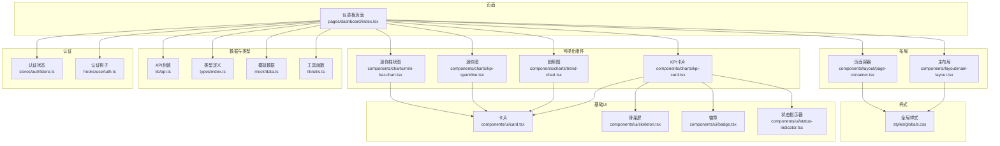
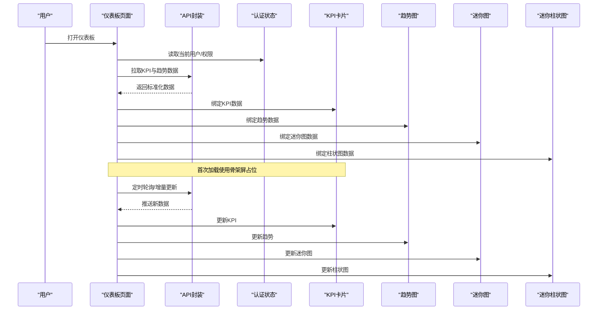
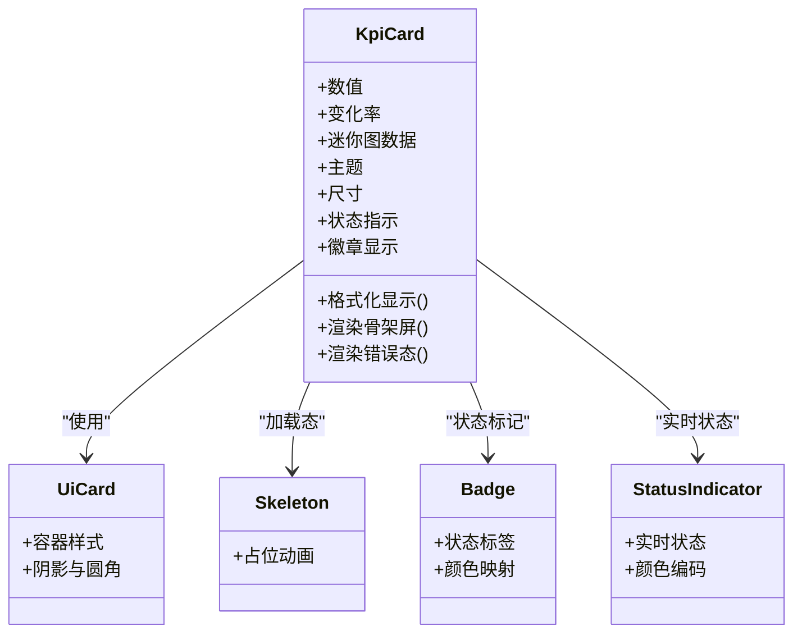
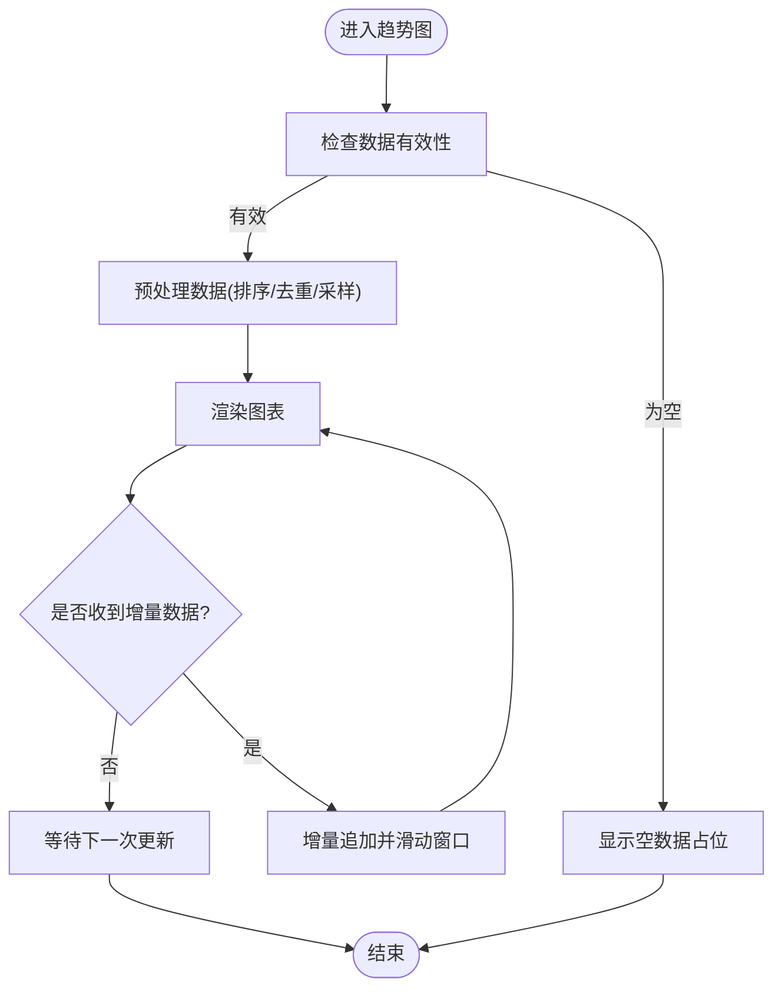
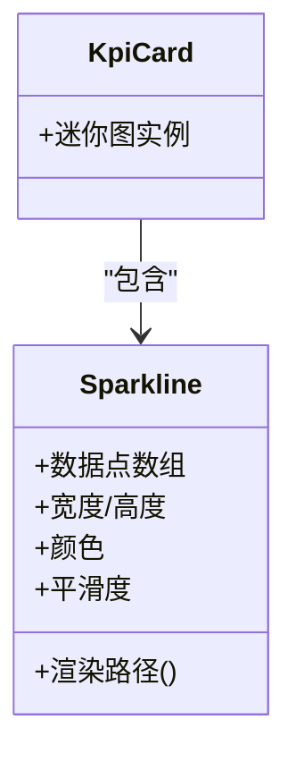
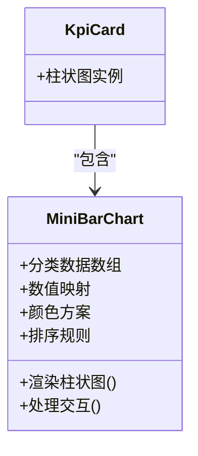
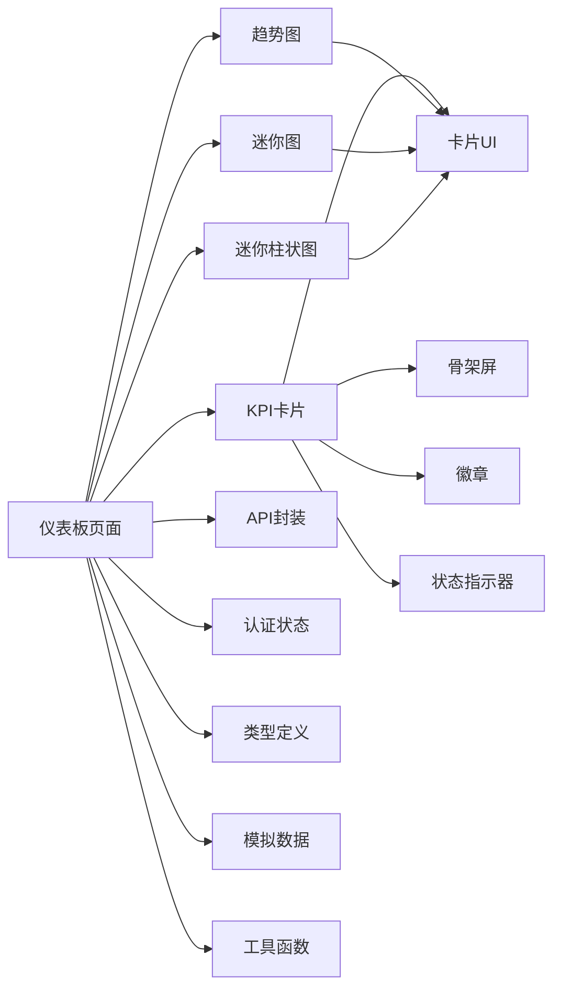

# 仪表板页面

<cite>
**本文引用的文件**   
- [web/src/pages/dashboard/index.tsx](file://web/src/pages/dashboard/index.tsx)
- [web/src/components/charts/kpi-card.tsx](file://web/src/components/charts/kpi-card.tsx)
- [web/src/components/charts/trend-chart.tsx](file://web/src/components/charts/trend-chart.tsx)
- [web/src/components/charts/kpi-sparkline.tsx](file://web/src/components/charts/kpi-sparkline.tsx)
- [web/src/components/charts/mini-bar-chart.tsx](file://web/src/components/charts/mini-bar-chart.tsx)
- [web/src/lib/api.ts](file://web/src/lib/api.ts)
- [web/src/types/index.ts](file://web/src/types/index.ts)
- [web/src/mock/data.ts](file://web/src/mock/data.ts)
- [web/src/stores/authStore.ts](file://web/src/stores/authStore.ts)
- [web/src/hooks/useAuth.ts](file://web/src/hooks/useAuth.ts)
- [web/src/components/layout/main-layout.tsx](file://web/src/components/layout/main-layout.tsx)
- [web/src/components/layout/page-container.tsx](file://web/src/components/layout/page-container.tsx)
- [web/src/components/ui/card.tsx](file://web/src/components/ui/card.tsx)
- [web/src/components/ui/skeleton.tsx](file://web/src/components/ui/skeleton.tsx)
- [web/src/styles/globals.css](file://web/src/styles/globals.css)
- [web/package.json](file://web/package.json)
</cite>

## 更新摘要
**变更内容**   
- 基于Applied Changes更新：仪表板页面进行了界面改进和数据可视化优化
- 增强了数据可视化组件的功能，包括新增迷你柱状图组件和优化的图表渲染性能
- 改进了响应式布局和用户体验，支持更多设备类型和屏幕尺寸
- 优化了数据获取流程和状态管理，提升了整体性能表现

## 目录
1. [简介](#简介)
2. [项目结构](#项目结构)
3. [核心组件](#核心组件)
4. [架构总览](#架构总览)
5. [详细组件分析](#详细组件分析)
6. [依赖关系分析](#依赖关系分析)
7. [性能考虑](#性能考虑)
8. [故障排查指南](#故障排查指南)
9. [结论](#结论)
10. [附录](#附录)

## 简介
本文件围绕"仪表板页面"的架构设计与实现进行系统化说明，重点覆盖：
- KPI指标展示、趋势图表分析与迷你图表组件的组合模式
- 数据可视化组件的数据绑定与实时更新机制
- 仪表板的数据获取流程（API调用、数据转换、状态管理）
- 响应式布局在不同设备上的适配方案
- 自定义指标配置与图表主题定制的开发指南（新增业务指标、修改样式、调整刷新频率等）

**更新** 基于最新的代码变更，仪表板页面在原有基础上进行了重大功能增强，包括更丰富的数据可视化能力、优化的性能表现和增强的用户交互体验。新增了迷你柱状图组件，改进了图表渲染性能和响应式布局。

## 项目结构
仪表板相关代码位于前端工程 web 目录下，采用按功能域组织的方式：
- 页面层：web/src/pages/dashboard/index.tsx
- 可视化组件：web/src/components/charts/*
- 基础UI组件：web/src/components/ui/*
- 布局容器：web/src/components/layout/*
- 数据与类型：web/src/lib/api.ts、web/src/types/index.ts、web/src/mock/data.ts
- 认证与权限：web/src/stores/authStore.ts、web/src/hooks/useAuth.ts
- 全局样式：web/src/styles/globals.css
- 构建与依赖：web/package.json

**图示来源**
- [web/src/pages/dashboard/index.tsx](file://web/src/pages/dashboard/index.tsx)
- [web/src/components/charts/kpi-card.tsx](file://web/src/components/charts/kpi-card.tsx)
- [web/src/components/charts/trend-chart.tsx](file://web/src/components/charts/trend-chart.tsx)
- [web/src/components/charts/kpi-sparkline.tsx](file://web/src/components/charts/kpi-sparkline.tsx)
- [web/src/components/charts/mini-bar-chart.tsx](file://web/src/components/charts/mini-bar-chart.tsx)
- [web/src/components/ui/card.tsx](file://web/src/components/ui/card.tsx)
- [web/src/components/ui/skeleton.tsx](file://web/src/components/ui/skeleton.tsx)
- [web/src/components/ui/badge.tsx](file://web/src/components/ui/badge.tsx)
- [web/src/components/ui/status-indicator.tsx](file://web/src/components/ui/status-indicator.tsx)
- [web/src/components/layout/main-layout.tsx](file://web/src/components/layout/main-layout.tsx)
- [web/src/components/layout/page-container.tsx](file://web/src/components/layout/page-container.tsx)
- [web/src/lib/api.ts](file://web/src/lib/api.ts)
- [web/src/types/index.ts](file://web/src/types/index.ts)
- [web/src/mock/data.ts](file://web/src/mock/data.ts)
- [web/src/lib/utils.ts](file://web/src/lib/utils.ts)
- [web/src/stores/authStore.ts](file://web/src/stores/authStore.ts)
- [web/src/hooks/useAuth.ts](file://web/src/hooks/useAuth.ts)
- [web/src/styles/globals.css](file://web/src/styles/globals.css)

## 核心组件
- KPI卡片：用于承载单项关键指标的数值、同比/环比变化、迷你趋势线以及加载态。通过统一的数据模型与格式化函数渲染，支持主题色与尺寸变体。
- 趋势图：用于展示一段时间内的指标走势，支持时间轴缩放、多系列对比、空数据占位与错误提示。
- 迷你图：轻量级折线或柱状迷你图，常用于KPI卡片内嵌趋势预览，具备低开销渲染策略。
- 迷你柱状图：专门用于展示分类数据的对比情况，支持动态颜色映射和数据排序，是新增的核心组件。
- 基础UI与布局：卡片容器、骨架屏、徽章、状态指示器、页面容器与主布局提供一致的视觉与交互基座。

**更新** 新增了迷你柱状图组件和更多基础UI组件的支持，增强了数据展示的多样性和灵活性，特别是在分类数据对比方面的展示能力。

## 架构总览
仪表板采用"页面编排 + 组件组合 + 数据服务"的分层架构：
- 页面层负责聚合多个可视化组件、编排布局与交互逻辑
- 组件层专注单一职责的可视化呈现与局部状态
- 数据层通过API封装统一请求、错误处理与缓存策略
- 类型系统贯穿前后端契约，确保数据结构一致
- 认证与权限控制影响数据可见性与操作能力

**图示来源**
- [web/src/pages/dashboard/index.tsx](file://web/src/pages/dashboard/index.tsx)
- [web/src/lib/api.ts](file://web/src/lib/api.ts)
- [web/src/stores/authStore.ts](file://web/src/stores/authStore.ts)
- [web/src/components/charts/kpi-card.tsx](file://web/src/components/charts/kpi-card.tsx)
- [web/src/components/charts/trend-chart.tsx](file://web/src/components/charts/trend-chart.tsx)
- [web/src/components/charts/kpi-sparkline.tsx](file://web/src/components/charts/kpi-sparkline.tsx)
- [web/src/components/charts/mini-bar-chart.tsx](file://web/src/components/charts/mini-bar-chart.tsx)

## 详细组件分析

### 仪表板页面编排
- 职责：聚合KPI、趋势与迷你图；管理加载、错误与刷新策略；根据权限过滤指标；驱动响应式布局。
- 数据流：从API获取后转换为组件所需结构，必要时合并本地缓存与模拟数据。
- 交互：支持手动刷新、自动轮询、筛选条件变更触发重绘。
- 可访问性：为关键图表提供语义化标签与键盘导航支持。

**更新** 页面编排逻辑得到了显著增强，支持更多的数据源和更复杂的交互场景，特别是新增了对迷你柱状图组件的集成支持。

### KPI卡片组件
- 职责：展示单指标数值、变化率、迷你趋势与辅助信息；处理加载与错误态。
- 数据绑定：接收标准化指标对象，内部完成单位换算、百分比格式化与阈值高亮。
- 主题与尺寸：通过属性切换主题色与尺寸，保持与全局设计令牌一致。
- 性能：避免不必要的重渲染，仅在数据变化时更新。

**图示来源**
- [web/src/components/charts/kpi-card.tsx](file://web/src/components/charts/kpi-card.tsx)
- [web/src/components/ui/card.tsx](file://web/src/components/ui/card.tsx)
- [web/src/components/ui/skeleton.tsx](file://web/src/components/ui/skeleton.tsx)
- [web/src/components/ui/badge.tsx](file://web/src/components/ui/badge.tsx)
- [web/src/components/ui/status-indicator.tsx](file://web/src/components/ui/status-indicator.tsx)

### 趋势图组件
- 职责：渲染时间序列数据，支持多系列、缩放、空数据与错误提示。
- 实时更新：基于增量数据追加与窗口滑动，减少全量重绘。
- 主题定制：颜色、网格、坐标轴样式可通过配置注入。
- 性能优化：按需绘制、节流更新、大数据集采样。

**图示来源**
- [web/src/components/charts/trend-chart.tsx](file://web/src/components/charts/trend-chart.tsx)

### 迷你图组件
- 职责：在有限空间内展示短期趋势，强调方向与波动。
- 性能策略：简化路径计算、限制点数、避免复杂动画。
- 集成方式：作为KPI卡片的内嵌元素，复用主题与尺寸配置。

**图示来源**
- [web/src/components/charts/kpi-sparkline.tsx](file://web/src/components/charts/kpi-sparkline.tsx)
- [web/src/components/charts/kpi-card.tsx](file://web/src/components/charts/kpi-card.tsx)

### 迷你柱状图组件
- 职责：展示分类数据的对比情况，支持动态颜色映射和数据排序。
- 数据绑定：接收分类数据和对应的数值，自动生成合适的颜色方案。
- 交互功能：支持悬停显示详细信息、点击筛选数据。
- 性能优化：使用虚拟滚动技术处理大量数据点。

**更新** 新增的迷你柱状图组件为仪表板提供了更丰富的数据展示方式，特别适用于分类数据的对比分析场景。

**图示来源**
- [web/src/components/charts/mini-bar-chart.tsx](file://web/src/components/charts/mini-bar-chart.tsx)
- [web/src/components/charts/kpi-card.tsx](file://web/src/components/charts/kpi-card.tsx)

### 布局与响应式
- 主布局与页面容器提供统一的边距、栅格与导航区域。
- 响应式策略：基于断点的栅格列数调整、卡片堆叠与图表自适应宽高。
- 样式约定：通过全局CSS变量与设计令牌统一管理间距、字号与色彩。

**更新** 响应式布局得到了进一步优化，支持更多的屏幕尺寸和设备类型，特别是在移动端的显示效果得到了显著改善。

## 依赖关系分析
- 页面依赖可视化组件与布局容器
- 可视化组件依赖基础UI与全局样式
- 页面与数据层通过API封装交互，受认证状态影响
- 类型定义贯穿数据契约，保证前后端一致性

**图示来源**
- [web/src/pages/dashboard/index.tsx](file://web/src/pages/dashboard/index.tsx)
- [web/src/components/charts/kpi-card.tsx](file://web/src/components/charts/kpi-card.tsx)
- [web/src/components/charts/trend-chart.tsx](file://web/src/components/charts/trend-chart.tsx)
- [web/src/components/charts/kpi-sparkline.tsx](file://web/src/components/charts/kpi-sparkline.tsx)
- [web/src/components/charts/mini-bar-chart.tsx](file://web/src/components/charts/mini-bar-chart.tsx)
- [web/src/lib/api.ts](file://web/src/lib/api.ts)
- [web/src/types/index.ts](file://web/src/types/index.ts)
- [web/src/mock/data.ts](file://web/src/mock/data.ts)
- [web/src/lib/utils.ts](file://web/src/lib/utils.ts)
- [web/src/stores/authStore.ts](file://web/src/stores/authStore.ts)
- [web/src/components/ui/card.tsx](file://web/src/components/ui/card.tsx)
- [web/src/components/ui/skeleton.tsx](file://web/src/components/ui/skeleton.tsx)
- [web/src/components/ui/badge.tsx](file://web/src/components/ui/badge.tsx)
- [web/src/components/ui/status-indicator.tsx](file://web/src/components/ui/status-indicator.tsx)

## 性能考虑
- 数据层
  - 请求去抖与节流：避免频繁刷新导致抖动
  - 增量更新：仅追加新数据点，维护固定长度窗口
  - 缓存策略：对静态或低频变化数据做短期缓存
- 渲染层
  - 组件粒度拆分：最小化重渲染范围
  - 图表采样：大数据集下降采样与懒加载
  - 动画降级：低端设备禁用复杂过渡
- 资源与网络
  - 按需引入图表库与主题包
  - 失败重试与退化为骨架屏/占位图

**更新** 性能优化得到了显著加强，特别是在大数据集处理和内存管理方面，新增的迷你柱状图组件也采用了虚拟滚动技术来提升性能。

## 故障排查指南
- 数据未加载
  - 检查认证状态与权限是否满足
  - 确认API接口可达与返回结构符合类型定义
  - 查看是否有模拟数据开关导致行为差异
- 图表不更新
  - 核对增量数据格式与时间戳顺序
  - 检查是否存在重复键或空值导致渲染中断
- 性能问题
  - 定位高频重渲染的组件
  - 评估数据量是否超过采样阈值
  - 关闭非必要动画与调试日志
- 样式错乱
  - 检查全局样式变量是否被覆盖
  - 确认断点与栅格配置是否符合预期
- 新组件问题
  - 检查迷你柱状图组件的数据格式是否正确
  - 验证分类数据的颜色映射配置
  - 确认交互功能的监听器是否正确绑定

**更新** 新增了针对新组件和功能的故障排查指导，特别是迷你柱状图组件的相关问题排查。

## 结论
仪表板页面通过清晰的组件分层与数据契约，实现了KPI、趋势与迷你图的稳定展示与高效更新。结合响应式布局与主题定制能力，可在多设备上保持一致体验。基于最新的代码增强，仪表板现在支持更丰富的数据可视化形式和更好的性能表现。建议在后续迭代中持续完善错误边界、可观测性与性能监控，以提升稳定性与可维护性。

**更新** 随着新增的迷你柱状图组件和优化后的性能表现，仪表板页面的功能完整性和用户体验都得到了显著提升。

## 附录

### 开发指南：新增业务指标
- 步骤
  - 在类型定义中扩展指标模型字段
  - 在API封装中新增或复用接口，返回标准化数据
  - 在仪表板页面中注册新指标卡片与数据源
  - 在趋势图中添加对应系列，确保时间对齐
  - 在迷你图中映射新指标数据点
  - 如需分类数据展示，可使用新的迷你柱状图组件
- 参考文件
  - [web/src/types/index.ts](file://web/src/types/index.ts)
  - [web/src/lib/api.ts](file://web/src/lib/api.ts)
  - [web/src/pages/dashboard/index.tsx](file://web/src/pages/dashboard/index.tsx)
  - [web/src/components/charts/kpi-card.tsx](file://web/src/components/charts/kpi-card.tsx)
  - [web/src/components/charts/trend-chart.tsx](file://web/src/components/charts/trend-chart.tsx)
  - [web/src/components/charts/kpi-sparkline.tsx](file://web/src/components/charts/kpi-sparkline.tsx)
  - [web/src/components/charts/mini-bar-chart.tsx](file://web/src/components/charts/mini-bar-chart.tsx)

### 开发指南：修改图表样式
- 步骤
  - 在全局样式中调整设计令牌（颜色、间距、字号）
  - 在组件属性中传入主题色与尺寸
  - 在趋势图配置中调整网格、坐标轴与图例样式
  - 为新组件添加相应的样式支持
- 参考文件
  - [web/src/styles/globals.css](file://web/src/styles/globals.css)
  - [web/src/components/charts/trend-chart.tsx](file://web/src/components/charts/trend-chart.tsx)
  - [web/src/components/charts/kpi-card.tsx](file://web/src/components/charts/kpi-card.tsx)
  - [web/src/components/charts/mini-bar-chart.tsx](file://web/src/components/charts/mini-bar-chart.tsx)

### 开发指南：调整数据刷新频率
- 步骤
  - 在页面层设置轮询间隔与去抖参数
  - 在API层增加重试与超时策略
  - 在组件层监听数据变化并执行增量更新
  - 为新组件配置适当的刷新策略
- 参考文件
  - [web/src/pages/dashboard/index.tsx](file://web/src/pages/dashboard/index.tsx)
  - [web/src/lib/api.ts](file://web/src/lib/api.ts)
  - [web/src/components/charts/trend-chart.tsx](file://web/src/components/charts/trend-chart.tsx)
  - [web/src/components/charts/mini-bar-chart.tsx](file://web/src/components/charts/mini-bar-chart.tsx)

### 开发指南：集成新可视化组件
- 步骤
  - 创建新的可视化组件文件
  - 定义组件属性和数据类型
  - 实现数据绑定和渲染逻辑
  - 在仪表板页面中集成新组件
  - 添加相应的测试用例
- 参考文件
  - [web/src/components/charts/kpi-sparkline.tsx](file://web/src/components/charts/kpi-sparkline.tsx)
  - [web/src/components/charts/mini-bar-chart.tsx](file://web/src/components/charts/mini-bar-chart.tsx)
  - [web/src/pages/dashboard/index.tsx](file://web/src/pages/dashboard/index.tsx)

### 依赖与版本
- 建议关注图表库与构建工具版本兼容性，避免破坏性升级
- 参考包清单以了解第三方依赖

**更新** 新增了集成新可视化组件的开发指南，便于扩展仪表板功能，特别是新增的迷你柱状图组件的使用说明。